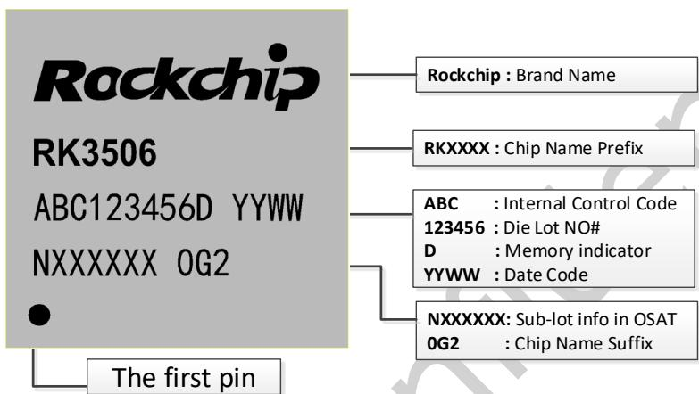
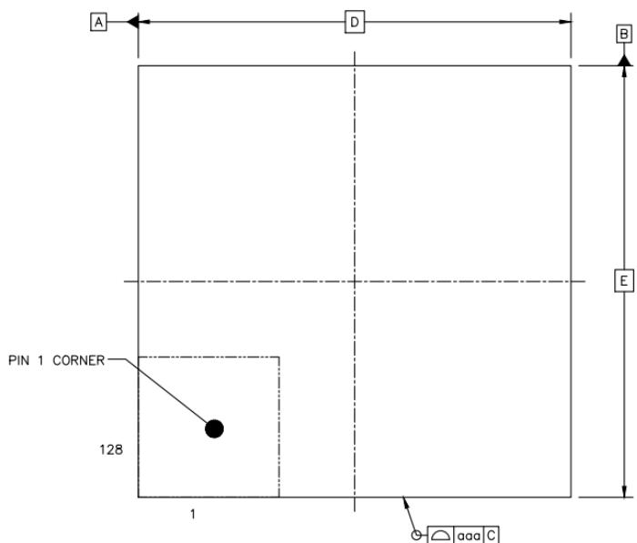
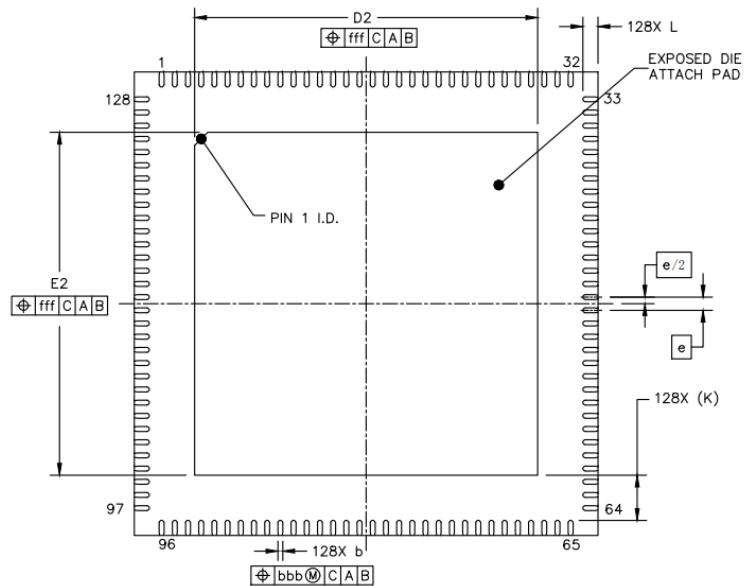
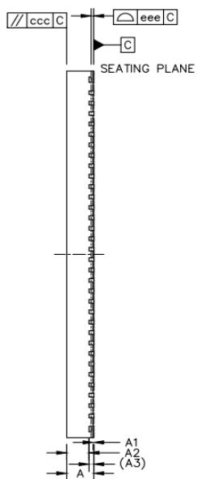

# Rockchip RK3506G2 Datasheet

Revision 1.0

August 2024

Revision History  

<table><tr><td>Date</td><td>Revision</td><td>Description</td></tr><tr><td>2024-08-16</td><td>1.0</td><td>Initial release</td></tr></table>

# Table of Content

Table of Content 3

Figure Index 4

Table Index. 5

Warranty Disclaimer 6

Chapter 1 Introduction 7

1.1 Overview 7  
1.2 Features 7  
1.3 Block Diagram 13

Chapter 2 Package Information. 15

2.1 Order Information 15  
2.2 Top Marking 15  
2.3 Package Dimension 15  
2.4 MSL Information 17  
2.5 Lead Finish/Ball material Information 17  
2.6 Pin Number List 17  
2.7 Power/Ground IO Description 20  
2.8 Function IO Description 21  
2.9 IO Pin Name Description 24  
2.10 Rockchip Matrix IO Function List 31  
2.11 FLEXBUS Interface Typical Application Example 33

Chapter 3 Electrical Specification 35

3.1 Absolute Ratings 35  
3.2 Recommended Operating Condition 35  
3.3 DC Characteristics 36  
3.4 Electrical Characteristics for General IO 37  
3.5 Electrical Characteristics for PLL 37  
3.6 Electrical Characteristics for USB2.0 Interface 38  
3.7 Electrical Characteristics for SARADC 38  
3.8 Electrical Characteristics for TSADC 39  
3.9 Electrical Characteristics for CODEC ADC 39  
3.10 Electrical Characteristics for MIPI DSI 39

Chapter 4 Thermal Management. 40

4.1 Overview 40  
4.2 Package Thermal Characteristics 40

# Figure Index

Fig.1-1 RK3506G2 Block Diagram 14  
Fig.2-1 RK3506G2 Package Definition 15  
Fig.2-2 Package Top View 15  
Fig.2-3 Package Bottom View 16  
Fig.2-4 Package Side View 16  
Fig.2-5 Package Dimension 16

# Table Index

Table 2-1 Pin Number Order Information. 17  
Table 2-2 Power/Ground IO information 20  
Table 2-3 Function IO description. 21  
Table 2-4 IO function description list 24  
Table 2-5 Matrix IO function list 31  
Table 2-6 Pin Mapping between FLEXBUS and ADC 33  
Table 2-7 Pin Mapping between FLEXBUS and DAC 33  
Table 2-8 Pin Mapping between FLEXBUS and DVP Camera 34  
Table 2-9 Pin Mapping between FLEXBUS and QSPI LCD Panel. 34  
Table 3-1 Absolute ratings. 35  
Table 3-2 Recommended operating condition 35  
Table 3-3 DC Characteristics. 36  
Table 3-4 Electrical Characteristics for Digital General IO. 37  
Table 3-5 Electrical Characteristics for FRAC PLL. 37  
Table 3-6 Electrical Characteristics for USB2.0 Interface 38  
Table 3-7 Electrical Characteristics for SARADC 38  
Table 3-8 Electrical Characteristics for TSADC 39  
Table 3-9 Electrical Characteristics for CODEC ADC. 39  
Table 3-10 Electrical Characteristics for MIPI DSI 39  
Table 4-1 Thermal Resistance Characteristics. 40

# Warranty Disclaimer

Copyright © 2024 Rockchip Electronics Co., Ltd. All rights reserved.

No part of this document may be reproduced, transmitted or used in any form or by any means without the written prior consent of Rockchip Electronics Co., Ltd.

# Trademark

Rockchip is a registered trademark of Rockchip Electronics Co., Ltd. in the People's Republic of China and other countries/areas. Other brands, product names mentioned in this document are the property of their respective owners.

# Disclaimer

Rockchip Electronics Co., Ltd. ("Rockchip") may make changes to any information in this document at any time without any prior notice.

Information in this document is provided just as a reference or typical applications. All or part of product features described in this document may not be within the purchase scope or the usage scope, and may be subject to the third party licensing requirements. All statements, information in this document is provided "AS IS" without warranties of any kind, either express or implied. Actual performance of Rockchip products may vary in different applications. Third party licenses maybe required to use some features supported by Rockchip products. Customers shall be solely and exclusively responsible to obtain all appropriately required third party licenses prior to its such use. Should customers use the features supported by Rockchip products without any required third party license, customers shall indemnify and hold Rockchip and its subsidiaries, affiliates as well as distributors harmless against all claims, costs, damages, and expenses, and reasonable attorney fees arising out of any claim associated with such unauthorized use.

Rockchip products are not intended for use in military, airplane, medical devices, lifesaving or life sustaining applications ("Unintended Uses"). Customers shall take any and all actions to ensure using Rockchip products in a lawful manner and shall be liable for Unintended Uses.

# Chapter 1 Introduction

# 1.1 Overview

RK3506G2 is a high-performance triple core Cortex-A7 application processor designed for intelligent voice interaction, audio input/output processing, image output processing and other digital multimedia applications.

Embedded 2D hardware engine and display output engine for minimizing CPU overhead to meet image display requirements.

Embedded rich peripheral interfaces, such as SAI, PDM, SPDIF, Audio DSM, Audio ADC, USB2 OTG, RMII, CAN and so on, can meet different application development, reduce hardware development complexity and development cost.

RK3506G2 has high-performance external memory interface capable of sustaining demanding memory bandwidths. Integrated 128MB DDR3 is available for customer.

# 1.2 Features

# 1.2.1 Microprocessor

- Triple-core ARM Cortex-A7 CPU  
- ARM architecture v7-A instruction set  
ARM Neon Advanced SIMD (single instruction, multiple data) support for accelerated media and signal processing computation  
- Include VFPv4-D32 hardware to support single and double-precision operations  
- Integrated 16KB L1 instruction cache, 16KB L1 data cache  
128KB unified system L2 cache  
- TrustZone technology support  
One isolated voltage domain to support DVFS

# 1.2.2 Memory Organization

- Internal on-chip memory

BootROM  
System SRAM

External off-chip memory

SPI Nor/Nand Flash  
SDMMC(eMMC/SD Card)

# 1.2.3 Internal Memory

- Internal BootRom

Support system boot from the following device:

$\spadesuit$  SPI Flash interface  
SDMMC(eMMC/SD Card) interface

Support system code download by the following interface:

USB OTG interface (Device mode)  
SPI interface(Slave mode)

- Internal SRAM  
48KB System SRAM  
- Integrated 128MB DDR is available.

# 1.2.4 External Memory or Storage device

- Serial Flash Interface

Support transfer data from/to SPI flash device  
Support x1,x2,x4 data bits mode  
Support up to 1 chip select

SD/MMC Interface

Compatible with standard iNAND interface  
Compatible with eMMC specification 4.51  
Compatible with SD3.0, MMC ver4.51  
Compatible with SDIO3.0 protocol  
Data bus width is 4bits

# 1.2.5 System Component

# - Cortex-M0

The ARMv6-M Thumb instruction set  
Thumb-2 technology  
Nested Vectored Interrupt Controller (NVIC)  
Serial wire debug port (SW-DP) debug access

# - CRU (clock & reset unit)

One oscillator with external 24MHz crystal input  
One internal low frequency RC clock  
One internal power on reset circuit  
Support single-end 32.768KHz clock input/output from/to GPIO  
Support PLL control and generate various clock frequency for chip  
Support clock gating control for individual components  
Support global soft-reset control for whole chip, also individual soft-reset for each component

# PMU(power management unit)

Three separate voltage domains(CPU_DVDD/LOGIC_DVDD/PMU_DVDD)  
Multiple configurable work sleep modes to save power consumption by different frequency or automatic clock gating control or external power on/off control

# - Timer

Twelve 64-bit timers with interrupt-based operation  
One 64-bit timer with interrupt-based operation for low power mode application  
Support two operation modes: free-running and user-defined count  
Support timer work state checkable

# - PWM0

4-channel PWM with interrupt-based operation  
Support capture mode  
- Provides reference mode and output various duty-cycle waveform  
Support continuous mode or one-shot mode  
Support one channel IR RX application  
Support four channel waveform generation through lookup table

# PWM1

8-channels PWM with interrupt-based operation  
Support capture mode  
■ Provides reference mode and output various duty-cycle waveform  
Support continuous mode or one-shot mode  
Support one channel IR TX application  
Support one clock frequency calculation engine and one clock free running counter  
Support six channel biphasic counter

# Watchdog

Support two 32-bit watchdog counter  
Counter counts down from a preset value to 0 to indicate the occurrence of a timeout  
WDT can perform two types of operations when timeout occurs:

$\spadesuit$  Generate a system reset

$\spadesuit$  First generate an interrupt and if this is not cleared by the service routine by the time a second timeout occurs then generate a system reset

Programmable reset pulse length  
- Totally 16 defined ranges of main timeout period

- Mailbox

One Mailbox to service Cortex-A7 and Cortex-M0 communication  
Support four mailbox elements, each element includes one data word, one command word register and one flag bit that can represent one interrupt

- Spinlock

Support spinlock registers for software to realize resource management

- DMA

Support two embedded DMA controllers  
Support data transfer types with memory-to-memory, memory-to-peripheral, peripheral-to-memory  
Support TrustZone technology and programmable secure state for each DMA channel  
DMAC0 support 6 channels in total  
DMAC1 support 8 channels in total

- Secure System

Cipher engine

$\spadesuit$  Support SHA-1, SHA-256/224, MD5 with hardware padding  
$\spadesuit$  Support HMAC of SHA-1, SHA-256, MD5 with hardware padding  
$\spadesuit$  Support AES-128, AES-192, AES-256 encrypt & decrypt cipher  
$\spadesuit$  Support AES ECB/CBC/OFB/CFB/CTR/CTS/XTS/CCM/GCM/CBC-MAC/CMAC mode  
$\spadesuit$  Support up to 4096 bits PKA mathematical operations for RSA

Support two 256 bits RNG output  
Support secure boot  
Support secure debug  
Support secure OTP  
Support secure OS  
Support bus firewall

# 1.2.6 Graphics Engine

2D Graphics Engine

SRC0 Input data format:

$\spadesuit$  ARGB8888/RGBA8888/RGBA4444/RGBA5551  
RGB888P/RGB565  
$\spadesuit$  YUV422-P/YUV422-SP-8bit/10bit(clip to 8bit after input)  
$\spadesuit$  YUV420-P/YUV420-SP-8bit/10bit(clip to 8bit after input)  
$\spadesuit$  YVYU422-8bit  
YUV400-8bit  
BPP1/2/4/8

SRC1 Input data format:

$\spadesuit$  ARGB8888/RGBA8888/RGBA4444/RGBA5551/A8  
RGB888P/RGB565

Output data format(all YUV format is 8bit):

$\spadesuit$  ARGB8888/RGBA8888/ARB4444/RGBA4444/ARB5551/RGBA5551  
RGB888/RGB565  
YUV420/YUV422 P/SP  
$\spadesuit$  YUV400

Pixel Format conversion, BT.601/BT.709  
Dither operation

Max resolution: 1280x1280 source, 1280x1280 destination  
Scaling

$\spadesuit$  Down-scaling: Average filter  
$\spadesuit$  Up-scaling: Bi-cubic filter(Horizontal, Vertical), Bi-linear filter(Vertical)  
$\spadesuit$  Arbitrary non-integer scaling ratio, from 1/16 to 16

Rotation

0, 90, 180, 270 degree rotation  
$\spadesuit$  x-mirror, y-mirror operation  
$\spadesuit$  Mirroring and rotation co-operation

BitBLT

$\spadesuit$  Block transfer  
Color palette/Color fill, support with alpha  
$\spadesuit$  Transparency mode (color keying/stencil test, specified value/value range)  
$\spadesuit$  Two source BitBLT  
$\spadesuit$  A+B=B only BitBLT, A support rotate & scale when B fixed  
$\spadesuit$  A+B=C second source (B) has same attribute with (C) plus rotation function

Alpha Blending

$\spadesuit$  Comprehensive per-pixel alpha(color/alpha channel separately)  
Fading  
$\spadesuit$  Support SRC1(R2Y)+SRC0(YUV) -> DST(YUV)  
$\spadesuit$  Support DST Full CSC convert for YUV2YUV

Others

Supports Gaussian filters with a window size of  $3*3$

# 1.2.7 Video Output Processor

- Display Interface

Support parallel MCU/RGB LCD interface: 24-bit(RGB888), 18-bit(RGB666), 16-bit(RGB565)  
Support serial MCU/RGB LCD interface: 3x8-bit(RGB888), 3x6-bit(RGB666), 2x8-bit(RGB565)  
Support BT.656/BT.1120 interface  
Support 2lane MIPI interface, 1.5Gbps/lan  
Max output resolution is 1280x1280@60fps

- Display process

Background layer

$\spadesuit$  programmable 24-bit color

Win1 layer

RGB888, ARGB888, RGB565  
$\spadesuit$  Support virtual display  
$\spadesuit$  256 level alpha blending (pre-multiplied alpha support)  
$\spadesuit$  Transparency color key  
RGB2YUV(BT601/BT709)

- Others

Support RGB or YUV domain overlay  
BCSH (Brightness, Contrast, Saturation, Hue adjustment)  
BCSH: RGB2YUV(BT601/BT709)  
Support dither down allegro RGB888to666 RGB888to565 and dither down FRC(Frame Rate Control) (configurable) RGB888to666  
Blank and black display  
Standby mode

# 1.2.8 Audio Interface

SAI

Support five SAI components  
Support audio protocol: I2S, PCM, TDM  
Support up to 128 slots available with configurable size  
Support slot length 8 to 32 bits configurable

Support master and slave mode, software configurable  
Sample rate up to 192KHz  
Support slot valid data length 8 to 32 bits configurable  
SAI0 support up to one lane transmitter and four lane parallel receivers  
SAI1 support up to four lane parallel transmitters and one lane receiver  
SAI2 support up to one lane transmitter and one lane receiver  
SAI0/1/2 connected to chip GPIO  
SAI3 support up to one lane transmitter and one lane receiver  
SAI4 support up to one lane receiver  
SAI3 connected to internal Audio DSM modulator and chip GPIO optional, and SAI4 connected to internal Audio ADC

PDM

Support PDM master receive mode  
Support 5 wire PDM interface with one is clock and 4 data line  
Support up to 8 mono microphones  
Support 16~24 bits sample resolution  
Sample rate up to 192KHz

- SPDIF

Support SPDIF TX x 1  
Support SPDIF RX x 1  
Support 16bits/20bits/24bits resolution  
Support linear PCM mode (IEC-60958)  
Support non-linear PCM transfer (IEC-61937)  
Sample rate up to 192KHz

ASRC

Support two ASRC components  
Support fixed length conversion mode and real time conversion mode  
Support asynchronous sample rate clock for real time conversion mode  
Support 4 channel sample rate converter for each ASRC  
Support combine two ASRC component to meet 8 channel sample rate converter

Audio DSM

Support 2-channel digital DAC  
Support I2S/PCM master and slave mode  
Support 16 bit sample resolution  
Support volume control  
Sample rate up to 192KHz

- Audio ADC

One channel 24 bit ADC microphone input  
Support one differential microphone input  
Support I2S as the digital signal interface  
Support both master and slave mode  
Support 16bits/24bits resolution  
Support I2S normal, left and right justified mode  
Sample rate up to 192KHz

# 1.2.9 Connectivity

- RMII 10/100 Ethernet Controller  
Support two Ethernet Controllers  
Supports 10/100-Mbps data transfer rates with the RMII interfaces  
Supports both full-duplex and half-duplex operation  
USB 2.0 OTG

Support two USB 2.0 OTG ports  
Compatible with USB 2.0 specification  
Supports high-speed(480Mbps), full-speed(12Mbps) and low-speed(1.5Mbps) mode

- DSMC master interface

Support master role  
Support transfer data from/to Xcella pSRAM device  
Support transfer data from/to Hyperbus pSRAM device  
Support act as local bus to transfer data from/to another device with DSMC slave interface  
Support x8,x16 data bits mode  
Support DDR mode

- DSMC slave interface

Support slave role  
Support act as local bus to transfer data from/to another device with DSMC master interface  
Support x8 data bits mode  
Support DDR mode

FLEXBUS interface

Support transfer data from internal memory to GPIO by DMA  
Support transfer data from GPIO to internal memory by DMA  
Support multiple operating modes

$\spadesuit$  Multiplexing TX clock and RX clock, Multiplexing TX data and RX data  $\succ$  Support TX only mode, RX only mode, TX then RX mode  
Multiplexing TX clock and RX clock, Separating TX data and RX data Support TX only mode, RX only mode, TX and RX mode, TX then RX mode  
$\spadesuit$  Separating TX clock and RX clock, Separating TX data and RX data  $\succ$  Support TX only mode, RX only mode, TX and RX mode

Support clock free running mode and following data mode  
Support TX data width 1, 2, 4, 8, 16 bit configurable  
Support RX data width 1, 2, 4, 8, 16 bit configurable  
Support continue transmission mode and fix length transmission mode  
Support one chip selection function for multiplexing TX clock and RX clock mode  
Support two chip selection function for separating TX clock and RX clock mode, one for TX direction, the other for RX direction  
Support TX clock auto gating  
Support DVP (RGB888, RGB565, YUV422) interface for camera sensor

SPI interface

Support three SPI Controllers  
SPI0/SPI1 support serial-master and serial-slave mode, software-configurable  
Support 2 chip-selects output in serial-master mode  
SPI2 support serial-slave mode

I2C interface

Support three I2C interface  
Support 7bits and 10bits address mode  
Software programmable clock frequency  
Data on the I2C-bus can be transferred at rates of up to 100 Kbit/s in the Standard-mode, up to 400 Kbit/s in the Fast-mode or up to 1 Mbit/s in Fast-mode Plus

- UART Controller

Support six UART interface  
Embedded two 64-byte FIFO for TX and RX operation respectively

Support 5bit, 6bit, 7bit, 8bit serial data transmit or receive  
Standard asynchronous communication bits such as start, stop and parity  
Support different input clock for UART operation to get up to 4Mbps baud rate  
Support auto flow control mode

CAN Controller

Support two CAN interface  
Support CAN 2.0B protocol  
Support transmit or receive standard frame  
Support transmit or receive extended frame

- Touch Key Controller

Support multi-channel CapSense monitor  
Support trigger interrupt waterline configurable  
Support LPF and DC elimination

# 1.2.10 Others

- Multiple groups of GPIO

All of GPIOs can be used to generate interrupt  
Support level trigger and edge trigger interrupt  
Support configurable polarity of level trigger interrupt  
Support configurable rising edge, falling edge and both edge trigger interrupt  
Support configurable pull direction (pullup or pulldown)  
Support configurable drive strength  
Support configurable slew rate

- Temperature Sensor (TS-ADC)

Up to 50KS/s sampling rate  
Support one temperature sensor  
- 40~125°C temperature range and +/-5°C temperature accuracy

- Successive Approximation ADC (SARADC)

10-bit resolution  
Up to 1MS/s sampling rate  
4 single-ended input channels  
GPIO multiplexed

- OTP

Support 8K bits Size, 7K bit for secure application  
Support Program/Read/Idle mode

Package Type

■ RK3506G2: QFN128L(body: 12.3mm x 12.3mm; lead pitch: 0.35mm)

Embedded with 128MB DDR3L

# 1.3 Block Diagram

The following figure shows the basic block diagram.

# System Peripheral

Clock & Reset

PMU

PLL×3

System Register

TIMER_6CH x 2

HPTIMER x 1

Watchdog x 2

MAILBOX

SPINLOCK

Crypto

RNG x 2

SAR-ADC(4-CH)

TS-ADC

DMAC x 2

PVTPLL x 1

nPOR

RC OSC

# RK3506G2

# CPU subsystem

Cortex-A7 Triple-Core

16K/16K L1 I/D Cache

NEON/FPU

128KB L2 Cache

Interrupt

Controller

Cortex-M0

# Embedded Memory

SYSTEM SRAM(48KB)

ROM(32KB)

OTP 1Kbit User Space

OTP 7Kbit Secure Space

128MB DDR3L

# Video Processor

2D Graphic Engine

Scale/Rotation/Mirror

1280x800@60fps

Video Output Processor

RGB Output

MCU Output

2Lane MIPI Output/1.5Gbps per Lane

1280x800@60fps

# External Memory Interface

eMMC4.51/SD3.0/MMC

4.51/SDIO3.0 I/F

QSPI NOR/NAND I/F

# Connectivity

USBOTG  $2.0\times 2$

PWM x 12

Audio ADC 1CH x 1

Audio DSM 2CH x 1

SAI TX 1LANE/RX 1LANE x 2

SAI TX 1LANE/RX 4LANE x 1

SAI TX 4LANE/RX 1LANe x 1

PDM RX 8CH x 1

SPDIF TX x1

SPDIF RX x1

UARTx6

SPI×3

12C x 3

RMII x 2

GPIO X N

CANx2

ASRC 4CH x 2

Touch Key x8

DSMC master x1

DSMC slave x1

FLEXBUS x1

Fig.1-1 RK3506G2 Block Diagram

# Chapter 2 Package Information

# 2.1 Order Information

<table><tr><td>Orderable Device</td><td>RoHS status</td><td>Package</td><td>Package Qty</td><td>Device Feature</td></tr><tr><td>RK3506G2</td><td>RoHS</td><td>QFN128L</td><td>1520 pcs</td><td>Audio Application Processor</td></tr></table>

# 2.2 Top Marking

  
Fig.2-1 RK3506G2 Package Definition

# 2.3 Package Dimension

  
Fig.2-2 Package Top View

  
Fig.2-3 Package Bottom View

  
Fig.2-4 Package Side View

<table><tr><td colspan="2"></td><td>SYMBOL</td><td>MIN</td><td>NOM</td><td>MAX</td></tr><tr><td colspan="2">TOTAL THICKNESS</td><td>A</td><td>0.8</td><td>0.85</td><td>0.9</td></tr><tr><td colspan="2">STAND OFF</td><td>A1</td><td>0</td><td>0.02</td><td>0.05</td></tr><tr><td colspan="2">MOLD THICKNESS</td><td>A2</td><td>----</td><td>0.7</td><td>----</td></tr><tr><td colspan="2">L/F THICKNESS</td><td>A3</td><td colspan="3">0.152 REF</td></tr><tr><td colspan="2">LEAD WIDTH</td><td>b</td><td>0.08</td><td>0.13</td><td>0.18</td></tr><tr><td rowspan="2">BODY SIZE</td><td>X</td><td>D</td><td colspan="3">12.3 BSC</td></tr><tr><td>Y</td><td>E</td><td colspan="3">12.3 BSC</td></tr><tr><td colspan="2">LEAD PITCH</td><td>e</td><td colspan="3">0.35 BSC</td></tr><tr><td rowspan="2">EP SIZE</td><td>X</td><td>D2</td><td>9</td><td>9.1</td><td>9.2</td></tr><tr><td>Y</td><td>E2</td><td>9</td><td>9.1</td><td>9.2</td></tr><tr><td colspan="2">LEAD LENGTH</td><td>L</td><td>0.3</td><td>0.4</td><td>0.5</td></tr><tr><td colspan="2">LEAD TIP TO EXPOSED PAD EDGE</td><td>K</td><td colspan="3">1.2 REF</td></tr><tr><td colspan="2">PACKAGE EDGE TOLERANCE</td><td>aaa</td><td colspan="3">0.1</td></tr><tr><td colspan="2">MOLD FLATNESS</td><td>ccc</td><td colspan="3">0.1</td></tr><tr><td colspan="2">COPLANARITY</td><td>eee</td><td colspan="3">0.08</td></tr><tr><td colspan="2">LEAD OFFSET</td><td>bbb</td><td colspan="3">0.07</td></tr><tr><td colspan="2">EXPOSED PAD OFFSET</td><td>fff</td><td colspan="3">0.1</td></tr></table>

Fig.2-5 Package Dimension

# 2.4 MSL Information

Moisture sensitivity Level: 3

# 2.5 Lead Finish/Ball material Information

Lead Finish/Ball material: Sn

# 2.6 Pin Number List

Table 2-1 Pin Number Order Information  

<table><tr><td>Pin</td><td>Pin Name</td><td>Abbreviated Pin Name</td></tr><tr><td>1</td><td>SPI0_MOSI/RM_IO17/GPI00_C1_d</td><td>GPIO0_C1</td></tr><tr><td>2</td><td>SPI0_CLK/RM_IO16/GPI00_C0_d</td><td>GPIO0_C0</td></tr><tr><td>3</td><td>SAI1_SDO3/SPI0_CSN1/RM_IO15/GPI00_B7_d</td><td>GPIO0_B7</td></tr><tr><td>4</td><td>SAI1_SDO2/SPI1_CSN0/RM_IO14/GPI00_B6_d</td><td>GPIO0_B6</td></tr><tr><td>5</td><td>SAI1_SDO1/RM_IO13/GPI00_B5_d</td><td>GPIO0_B5</td></tr><tr><td>6</td><td>SAI1_SDO0/RM_IO12/GPI00_B4_d</td><td>GPIO0_B4</td></tr><tr><td>7</td><td>SAI1_SDI/RM_IO11/GPI00_B3_d</td><td>GPIO0_B3</td></tr><tr><td>8</td><td>SAI1_LRCK/SPI1_MISO/RM_IO10/GPI00_B2_d</td><td>GPIO0_B2</td></tr><tr><td>9</td><td>PMUIO_VCC3V3</td><td>PMUIO_VCC3V3</td></tr><tr><td>10</td><td>NPOR</td><td>NPOR</td></tr><tr><td>11</td><td>PMU_LOGIC_DVDD0V9</td><td>PMU_LOGIC_DVDD0V9</td></tr><tr><td>12</td><td>SAI1_SCLK/SPI1_MOSI/RM_IO9/GPI00_B1_d</td><td>GPIO0_B1</td></tr><tr><td>13</td><td>SAI1_MCLK/SPI1_CLK/RM_IO8/GPI00_B0_d</td><td>GPIO0_B0</td></tr><tr><td>14</td><td>SAI0_SDI3/SPI1_CSN1/RM_IO7/GPI00_A7_d</td><td>GPIO0_A7</td></tr><tr><td>15</td><td>SAI0_SDI2/RM_IO6/GPI00_A6_d</td><td>GPIO0_A6</td></tr><tr><td>16</td><td>SAI0_SDI1/RM_IO5/GPI00_A5_d</td><td>GPIO0_A5</td></tr><tr><td>17</td><td>SAI0_SDI0/RM_IO4/GPI00_A4_d</td><td>GPIO0_A4</td></tr><tr><td>18</td><td>SAI0_SDO/RM_IO3/GPI00_A3_d</td><td>GPIO0_A3</td></tr><tr><td>19</td><td>SAI0_MCLK/RM_IO2/GPI00_A2_u</td><td>GPIO0_A2</td></tr><tr><td>20</td><td>SAI0_SCLK/RM_IO1/GPI00_A1_d</td><td>GPIO0_A1</td></tr><tr><td>21</td><td>SAI0_LRCK/RM_IO0/GPI00_A0_u</td><td>GPIO0_A0</td></tr><tr><td>22</td><td>DDR_VDDQ</td><td>DDR_VDDQ</td></tr><tr><td>23</td><td>DDR_VDDQ</td><td>DDR_VDDQ</td></tr><tr><td>24</td><td>VSS</td><td>VSS</td></tr><tr><td>25</td><td>DDR_VDDQ</td><td>DDR_VDDQ</td></tr><tr><td>26</td><td>SAI2_MCLK_M0/ETH_RMII1_RXDVCRS/GPI03_B6_d</td><td>GPIO3_B6</td></tr><tr><td>27</td><td>UART5_RTSN_M0/ETH_RMII1_MDIO/GPI03_B5_d</td><td>GPIO3_B5</td></tr><tr><td>28</td><td>UART5_TX_M0/ETH_RMII1_MDC/GPI03_B4_d</td><td>GPIO3_B4</td></tr><tr><td>29</td><td>UART5_RX_M0/ETH_RMII1_TXEN/GPI03_B3_d</td><td>GPIO3_B3</td></tr><tr><td>30</td><td>UART5_CTSN_M0/ETH_RMII1_TXD1/GPI03_B2_d</td><td>GPIO3_B2</td></tr><tr><td>31</td><td>SAI2_LRCK_M0/ETH_RMII1_TXD0/GPI03_B1_d</td><td>GPIO3_B1</td></tr><tr><td>32</td><td>SAI2_SDO_M0/ETH_RMII1_CLK/GPI03_B0_d</td><td>GPIO3_B0</td></tr><tr><td>33</td><td>SAI2_SCLK_M0/ETH_RMII1_RXD1/GPI03_A7_d</td><td>GPIO3_A7</td></tr><tr><td>34</td><td>SAI2_SDI_M0/ETH_RMII1_RXD0/GPI03_A6_d</td><td>GPIO3_A6</td></tr><tr><td>35</td><td>SDMMC_D1/TEST_CLK_OUT/GPI03_A3_d</td><td>GPIO3_A3</td></tr><tr><td>36</td><td>SDMMC_D0/GPI03_A2_d</td><td>GPIO3_A2</td></tr><tr><td>37</td><td>SDMMC_CLK/GPI03_A0_d</td><td>GPIO3_A0</td></tr><tr><td>38</td><td>SDMMC_CMD/GPI03_A1_d</td><td>GPIO3_A1</td></tr><tr><td>39</td><td>VCCIO4_VCC</td><td>VCCIO4_VCC</td></tr><tr><td>40</td><td>SDMMC_D3/JTAG_TMS_M0/GPIO3_A5_d</td><td>GPIO3_A5</td></tr><tr><td>41</td><td>SDMMC_D2/JTAG_TCK_M0/GPIO3_A4_d</td><td>GPIO3_A4</td></tr><tr><td>42</td><td>ETH_RMII0_RXDVCRS/SAI3_MCLK/GPIO2_C0_d</td><td>GPIO2_C0</td></tr><tr><td>43</td><td>ETH_RMII0_MDIO/DSM_AUD_LP_M1/SAI3_SDO/GPIO2_B7_d</td><td>GPIO2_B7</td></tr><tr><td>44</td><td>ETH_RMII0_MDIO/DSM_AUD_LN_M1/SAI3_SDI/GPIO2_B6_d</td><td>GPIO2_B6</td></tr><tr><td>45</td><td>ETH_RMII0_TXEN/DSM_AUD_RP_M1/SAI3_LRCK/GPIO2_B5_d</td><td>GPIO2_B5</td></tr><tr><td>46</td><td>ETH_RMII0_TXD1/DSM_AUD_RN_M1/SAI3_SCLK/GPIO2_B4_d</td><td>GPIO2_B4</td></tr><tr><td>47</td><td>ETH_RMII0_TXD0/SPI2_MISO/GPIO2_B3_d</td><td>GPIO2_B3</td></tr><tr><td>48</td><td>ETH_RMII0_CLK/SPI2_MOSI/GPIO2_B2_d</td><td>GPIO2_B2</td></tr><tr><td>49</td><td>ETH_RMII0_RXD1/SPI2_CSN/GPIO2_B1_d</td><td>GPIO2_B1</td></tr><tr><td>50</td><td>ETH_RMII0_RXD0/SPI2_CLK/GPIO2_B0_d</td><td>GPIO2_B0</td></tr><tr><td>51</td><td>LOGIC_DVDD</td><td>LOGIC_DVDD</td></tr><tr><td>52</td><td>VCCIO3_VCC</td><td>VCCIO3_VCC</td></tr><tr><td>53</td><td>FSPI_D3/GPIO2_A5_u</td><td>GPIO2_A5</td></tr><tr><td>54</td><td>FSPI_CLK/GPIO2_A1_d</td><td>GPIO2_A1</td></tr><tr><td>55</td><td>FSPI_D0/GPIO2_A2_u</td><td>GPIO2_A2</td></tr><tr><td>56</td><td>VCCIO2_VCC</td><td>VCCIO2_VCC</td></tr><tr><td>57</td><td>FSPI_D2/GPIO2_A4_u</td><td>GPIO2_A4</td></tr><tr><td>58</td><td>FSPI_D1/GPIO2_A3_u</td><td>GPIO2_A3</td></tr><tr><td>59</td><td>FSPI_CSN/GPIO2_A0_u</td><td>GPIO2_A0</td></tr><tr><td>60</td><td>SARADC_IN3/GPIO4_B3_z</td><td>SARADC_IN3/GPIO4_B3_z</td></tr><tr><td>61</td><td>SARADC_IN2/GPIO4_B2_z</td><td>SARADC_IN2/GPIO4_B2_z</td></tr><tr><td>62</td><td>SARADC_IN1/GPIO4_B1_z</td><td>SARADC_IN1/GPIO4_B1_z</td></tr><tr><td>63</td><td>SARADC_IN0/GPIO4_B0_z</td><td>SARADC_IN0/GPIO4_B0_z</td></tr><tr><td>64</td><td>AVCC_1V8</td><td>AVCC_1V8</td></tr><tr><td>65</td><td>ACODEC_ADC_AVDD1V6</td><td>ACODEC_ADC_AVDD1V6</td></tr><tr><td>66</td><td>ACODEC_ADC_VCM</td><td>ACODEC_ADC_VCM</td></tr><tr><td>67</td><td>ACODEC_ADC_INN</td><td>ACODEC_ADC_INN</td></tr><tr><td>68</td><td>ACODEC_ADC_INP</td><td>ACODEC_ADC_INP</td></tr><tr><td>69</td><td>ACODEC_ADC_AVSS</td><td>ACODEC_ADC_AVSS</td></tr><tr><td>70</td><td>USB20_OTG_AVDD3V3</td><td>USB20_OTG_AVDD3V3</td></tr><tr><td>71</td><td>USB20_OTG0_DM</td><td>USB20_OTG0_DM</td></tr><tr><td>72</td><td>USB20_OTG0_DP</td><td>USB20_OTG0_DP</td></tr><tr><td>73</td><td>USB20_OTG1_DM</td><td>USB20_OTG1_DM</td></tr><tr><td>74</td><td>USB20_OTG1_DP</td><td>USB20_OTG1_DP</td></tr><tr><td>75</td><td>AVDD_0V9</td><td>AVDD_0V9</td></tr><tr><td>76</td><td>AVDD_1V8</td><td>AVDD_1V8</td></tr><tr><td>77</td><td>MIPI_DPHY_DSI_TX_CLKN/GPIO4_A4_z</td><td>MIPI_DPHY_DSI_TX_CLKN/GPIO4_A4_z</td></tr><tr><td>78</td><td>MIPI_DPHY_DSI_TX_CLKP/GPIO4_A5_z</td><td>MIPI_DPHY_DSI_TX_CLKP/GPIO4_A5_z</td></tr><tr><td>79</td><td>MIPI_DPHY_DSI_TX_D1N/GPIO4_A2_z</td><td>MIPI_DPHY_DSI_TX_D1N/GPIO4_A2_z</td></tr><tr><td>80</td><td>MIPI_DPHY_DSI_TX_D1P/GPIO4_A3_z</td><td>MIPI_DPHY_DSI_TX_D1P/GPIO4_A3_z</td></tr><tr><td>81</td><td>MIPI_DPHY_DSI_TX_D0N/GPIO4_A0_z</td><td>MIPI_DPHY_DSI_TX_D0N/GPIO4_A0_z</td></tr><tr><td>82</td><td>MIPI_DPHY_DSI_TX_D0P/GPIO4_A1_z</td><td>MIPI_DPHY_DSI_TX_D0P/GPIO4_A1_z</td></tr><tr><td>83</td><td>VO_LCDC_DEN/DSMC_CLKP/FLEXBUS1_D0/GPIO1_A0_d</td><td>GPIO1_A0</td></tr><tr><td>84</td><td>VO_LCDC_VSYNC/DSMC_CLKN/FLEXBUS1_D1/DSMC_INT0/DSMC_SLV_I NT/GPIO1_A1_d</td><td>GPIO1_A1</td></tr><tr><td>85</td><td>CPU_DVDD</td><td>CPU_DVDD</td></tr><tr><td>86</td><td>VSS</td><td>VSS</td></tr><tr><td>87</td><td>LOGIC_DVDD</td><td>LOGIC_DVDD</td></tr><tr><td>88</td><td>VO_LCDC_HSYNC/DSMC_DQS0/FLEXBUS1_D2/GPIO1_A2_d</td><td>GPIO1_A2</td></tr><tr><td>89</td><td>VO_LCDC_CLK/DSMC_D0/FLEXBUS1_D3/GPIO1_A3_d</td><td>GPIO1_A3</td></tr><tr><td>90</td><td>VO_LCDC_D23/DSMC_D1/FLEXBUS1_D4/GPIO1_A4_d</td><td>GPIO1_A4</td></tr><tr><td>91</td><td>VO_LCDC_D22/DSMC_D2/FLEXBUS1_D5/GPIO1_A5_d</td><td>GPIO1_A5</td></tr><tr><td>92</td><td>VCCIO1_VCC</td><td>VCCIO1_VCC</td></tr><tr><td>93</td><td>VO_LCDC_D21/DSMC_D3/FLEXBUS1_D6/GPIO1_A6_d</td><td>GPIO1_A6</td></tr><tr><td>94</td><td>VO_LCDC_D20/DSMC_D4/FLEXBUS1_D7/GPIO1_A7_d</td><td>GPIO1_A7</td></tr><tr><td>95</td><td>VO_LCDC_D19/DSMC_D5/FLEXBUS1_D8/FLEXBUS0_CSN_M0/GPIO1_B0_d</td><td>GPIO1_B0</td></tr><tr><td>96</td><td>VO_LCDC_D18/DSMC_CSN1/FLEXBUS1_D9/FLEXBUS1_CSN_M0/UART5_CTSN_M1/RM_IO24/GPIO1_B1_d</td><td>GPIO1_B1</td></tr><tr><td>97</td><td>VO_LCDC_D17/DSMC_INT2/FLEXBUS1_D10/FLEXBUS0_D15/FLEXBUS0_CSN_M1/SAI2_CLK_M1/RM_IO25/GPIO1_B2_d</td><td>GPIO1_B2</td></tr><tr><td>98</td><td>VO_LCDC_D16/DSMC_INT3/FLEXBUS1_D11/FLEXBUS0_D14/FLEXBUS1_CSN_M1/SAI2_LRCK_M1/RM_IO26/GPIO1_B3_d</td><td>GPIO1_B3</td></tr><tr><td>99</td><td>VO_LCDC_D15/DSMC_D6/FLEXBUS1_D12/FLEXBUS0_D13/FLEXBUS0_CSN_M2/GPIO1_B4_d</td><td>GPIO1_B4</td></tr><tr><td>100</td><td>VO_LCDC_D14/DSMC_D7/FLEXBUS1_D13/FLEXBUS0_D12/FLEXBUS1_CSN_M2/GPIO1_B5_d</td><td>GPIO1_B5</td></tr><tr><td>101</td><td>VO_LCDC_D13/DSMC_CSN0/FLEXBUS1_D14/FLEXBUS0_D11/FLEXBUS0_CSN_M3/GPIO1_B6_d</td><td>GPIO1_B6</td></tr><tr><td>102</td><td>VO_LCDC_D12/DSMC_RDYN/FLEXBUS1_D15/FLEXBUS0_D10/FLEXBUS1_CSN_M3/GPIO1_B7_d</td><td>GPIO1_B7</td></tr><tr><td>103</td><td>VCCIO1_VCC</td><td>VCCIO1_VCC</td></tr><tr><td>104</td><td>VO_LCDC_D11/DSMC_RESET/NFLEXBUS1_CLK/DSMC_INT1/FLEXBUS0_CSN_M4/DSMC_SLV_CLK/GPIO1_C0_d</td><td>GPIO1_C0</td></tr><tr><td>105</td><td>VO_LCDC_D10/DSMC_D8/FLEXBUS0_CLK/DSM_AUD_RN_M0/FLEXBUS1_CSN_M4/SAI2_MCLK_M1/DSMC_SLV_DQSO/GPIO1_C1_d</td><td>GPIO1_C1</td></tr><tr><td>106</td><td>VO_LCDC_D9/FLEXBUS0_D9/DSM_AUD_RP_M0/FLEXBUS0_CSN_M5/SAI2_SDI_M1/RM_IO27/DSMC_SLV_D0/GPIO1_C2_d</td><td>GPIO1_C2</td></tr><tr><td>107</td><td>VO_LCDC_D8/DSMC_D10/FLEXBUS0_D8/FLEXBUS1_CSN_M5/SAI2_SDO_M1/RM_IO28/DSMC_SLV_D1/GPIO1_C3_d</td><td>GPIO1_C3</td></tr><tr><td>108</td><td>VO_LCDC_D7/DSMC_D11/FLEXBUS0_D7/DSMC_SLV_D2/GPIO1_C4_d</td><td>GPIO1_C4</td></tr><tr><td>109</td><td>VO_LCDC_D6/DSMC_D12/FLEXBUS0_D6/DSMC_SLV_D3/GPIO1_C5_d</td><td>GPIO1_C5</td></tr><tr><td>110</td><td>LOGIC DVDD</td><td>LOGIC DVDD</td></tr><tr><td>111</td><td>VSS</td><td>VSS</td></tr><tr><td>112</td><td>CPU DVDD</td><td>CPU DVDD</td></tr><tr><td>113</td><td>VO_LCDC_D5/DSMC_D13/FLEXBUS0_D5/DSMC_SLV_D4/GPIO1_C6_d</td><td>GPIO1_C6</td></tr><tr><td>114</td><td>VO_LCDC_D4/DSMC_D14/FLEXBUS0_D4/DSMC_SLV_D5/GPIO1_C7_d</td><td>GPIO1_C7</td></tr><tr><td>115</td><td>VO_LCDC_D3/DSMC_D15/FLEXBUS0_D3/DSM_AUD_LN_M0/DSMC_SLV_D6/GPIO1_D0_d</td><td>GPIO1_D0</td></tr><tr><td>116</td><td>VO_LCDC_D2/DSMC_DQS1/FLEXBUS0_D2/DSM_AUD_LP_M0/UART5_RT_SN_M1/RM_IO29/DSMC_SLV_D7/GPIO1_D1_d</td><td>GPIO1_D1</td></tr><tr><td>117</td><td>VO_LCDC_D1/DSMC_CSN2/FLEXBUS0_D1/UART5_TX_M1/RM_IO30/DSMC_SCLV_CSN0/GPIO1_D2_d</td><td>GPIO1_D2</td></tr><tr><td>118</td><td>VO_LCDC_D0/DSMC_CSN3/FLEXBUS0_D0/UART5_RX_M1/RM_IO31/DSMC_SCLV_RDYN/GPIO1_D3_d</td><td>GPIO1_D3</td></tr><tr><td>119</td><td>OSC_CLK_OUT/REF_CLK0_OUT/GPIO0_D0_d</td><td>GPIO0_D0</td></tr><tr><td>120</td><td>SYS_PLL_AVDD1V8</td><td>SYS_PLL_AVDD1V8</td></tr><tr><td>121</td><td>OSC_XIN</td><td>OSC_XIN</td></tr><tr><td>122</td><td>OSC_XOUT</td><td>OSC_XOUT</td></tr><tr><td>123</td><td>UART0_RX/JTAG_TMS_M1/RM_IO23/GPIO0_C7_u</td><td>GPIO0_C7</td></tr><tr><td>124</td><td>UART0_TX/JTAG_TCK_M1/RM_IO22/GPIO0_C6_u</td><td>GPIO0_C6</td></tr><tr><td>125</td><td>CPU_AVS/RM_IO21/GPIO0_C5_z</td><td>GPIO0_C5</td></tr><tr><td>126</td><td>ETH_CLK0_25M_OUT/AUPLL_CLK_IN/RM_IO20/GPIO0_C4_d</td><td>GPIO0_C4</td></tr><tr><td>127</td><td>ETH_CLK1_25M_OUT/SPIO_CSN0/RM_IO19/GPIO0_C3_d</td><td>GPIO0_C3</td></tr><tr><td>128</td><td>REF_CLK1_OUT/SPIO_MISO/RM_IO18/GPIO0_C2_d</td><td>GPIO0_C2</td></tr><tr><td>EPA D</td><td>VSS</td><td>VSS</td></tr></table>

# 2.7 Power/Ground IO Description

Table 2-2 Power/Ground IO information  

<table><tr><td>Group</td><td>Pin#</td><td>Descriptions</td></tr><tr><td>VSS</td><td>24, 86, 111, EPAD</td><td>Digital Ground</td></tr><tr><td>ACODEC_ADC_AVSS</td><td>69</td><td>ACODEC ADC Analog Ground</td></tr><tr><td colspan="3"></td></tr><tr><td>CPU_DVDD</td><td>85, 112</td><td>Logic Power</td></tr><tr><td>LOGIC_DVDD</td><td>51, 87, 110</td><td>DSP0 Power</td></tr><tr><td>PMU_LOGIC_DVDD0V9</td><td>11</td><td>PMU Power</td></tr><tr><td colspan="3"></td></tr><tr><td>PMUIO_VCC3V3</td><td>9</td><td>PMU IO Power</td></tr><tr><td>VCCIO1_VCC</td><td>92, 103</td><td>VCCIO1 IO Power</td></tr><tr><td>VCCIO2_VCC</td><td>56</td><td>VCCIO2 IO Power</td></tr><tr><td>VCCIO3_VCC</td><td>52</td><td>VCCIO3 IO Power</td></tr><tr><td>VCCIO4_VCC</td><td>39</td><td>VCCIO4 IO Power</td></tr><tr><td colspan="3"></td></tr><tr><td>SYS_PLL_AVDD1V8</td><td>120</td><td>PLL Power</td></tr><tr><td colspan="3"></td></tr><tr><td>USB20_OTG_AVDD3V3</td><td>70</td><td>USB OTG2.0 Power</td></tr><tr><td colspan="3"></td></tr><tr><td>AVDD_0V9</td><td>75</td><td>USB OTG2.0/MIPI DPHY Analog Power</td></tr><tr><td colspan="3"></td></tr><tr><td>AVDD_1V8</td><td>76</td><td>USB OTG2.0/MIPI DPHY/TSADC Analog Power</td></tr><tr><td colspan="3"></td></tr><tr><td>AVCC_1V8</td><td>64</td><td>ACODEC ADC/SARADC/OTP Analog Power</td></tr><tr><td colspan="3"></td></tr><tr><td>DDR_VDDQ</td><td>22, 23, 25</td><td>DDR Power</td></tr></table>

# 2.8 Function IO Description

Table 2-3 Function IO description  

<table><tr><td>Pin</td><td>Pin Name</td><td>Func0</td><td>Func1</td><td>Func2</td><td>Func3</td><td>Func4</td><td>Func5</td><td>Func6</td><td>Func7</td><td>Func8</td><td>Pad Type①</td><td>Def②</td><td>Pull</td><td>Drive Strength③</td><td>INT</td><td>Power Domain</td></tr><tr><td>121</td><td>OSC_XIN</td><td>OSC_XIN</td><td></td><td></td><td></td><td></td><td></td><td></td><td></td><td></td><td>I</td><td>I</td><td>N/A</td><td>N/A</td><td></td><td rowspan="3">PLL</td></tr><tr><td>122</td><td>OSC_XOUT</td><td>OSC_XOUT</td><td></td><td></td><td></td><td></td><td></td><td></td><td></td><td></td><td>O</td><td>O</td><td>N/A</td><td>N/A</td><td rowspan="2"></td></tr><tr><td>119</td><td>OSC_CLK_OUT/REF_CLK0_OUT/GPIO0_D0_d</td><td>GPIO0_D0</td><td>OSC_CLK_OUT</td><td>REF_CLK0_OUT</td><td></td><td></td><td></td><td></td><td></td><td>IO</td><td>I</td><td>down</td><td>Level1</td><td>√</td></tr><tr><td>10</td><td>NPOR</td><td>NPOR</td><td></td><td></td><td></td><td></td><td></td><td></td><td></td><td></td><td>I</td><td>I</td><td>N/A</td><td>N/A</td><td rowspan="25"></td><td rowspan="25">PMUIO_VCC3V3</td></tr><tr><td>21</td><td>SAIO_LCK/RM_I00/GPIO0_A0_u</td><td>GPIO0_A0</td><td>SAIO_LRCK</td><td></td><td></td><td></td><td></td><td></td><td>RM_I00</td><td>IO</td><td>I</td><td>up</td><td>Level2</td><td>√</td></tr><tr><td>20</td><td>SAIO_SCLK/RM_I01/GPIO0_A1_d</td><td>GPIO0_A1</td><td>SAIO_SCLK</td><td></td><td></td><td></td><td></td><td></td><td>RM_I01</td><td>IO</td><td>I</td><td>down</td><td>Level2</td><td>√</td></tr><tr><td>19</td><td>SAIO_MCLK/RM_I02/GPIO0_A2_u</td><td>GPIO0_A2</td><td>SAIO_MCLK</td><td></td><td></td><td></td><td></td><td></td><td>RM_I02</td><td>IO</td><td>I</td><td>up</td><td>Level2</td><td>√</td></tr><tr><td>18</td><td>SAIO_SDO/RM_I03/GPIO0_A3_d</td><td>GPIO0_A3</td><td>SAIO_SDO</td><td></td><td></td><td></td><td></td><td></td><td>RM_I03</td><td>IO</td><td>I</td><td>down</td><td>Level2</td><td>√</td></tr><tr><td>17</td><td>SAIO_SIO/RM_I04/GPIO0_A4_d</td><td>GPIO0_A4</td><td>SAIO_SIO</td><td></td><td></td><td></td><td></td><td></td><td>RM_I04</td><td>IO</td><td>I</td><td>down</td><td>Level2</td><td>√</td></tr><tr><td>16</td><td>SAIO_SIO1/RM_I05/GPIO0_A5_d</td><td>GPIO0_A5</td><td>SAIO_SIO1</td><td></td><td></td><td></td><td></td><td></td><td>RM_I05</td><td>IO</td><td>I</td><td>down</td><td>Level2</td><td>√</td></tr><tr><td>15</td><td>SAIO_SIO2/RM_I06/GPIO0_A6_d</td><td>GPIO0_A6</td><td>SAIO_SIO2</td><td></td><td></td><td></td><td></td><td></td><td>RM_I06</td><td>IO</td><td>I</td><td>down</td><td>Level2</td><td>√</td></tr><tr><td>14</td><td>SAIO_SIO3/SP1_CSN1/RM_I07/GPIO0_A7_d</td><td>GPIO0_A7</td><td>SAIO_SD13</td><td>SPI1_CSN1</td><td></td><td></td><td></td><td></td><td>RM_I07</td><td>IO</td><td>I</td><td>down</td><td>Level2</td><td>√</td></tr><tr><td>13</td><td>SAIO_MCLK/SP1_CLK/RM_I08/GPIO0_B0_d</td><td>GPIO0_B0</td><td>SAII_MCLK</td><td>SPI1_CLK</td><td></td><td></td><td></td><td></td><td>RM_I08</td><td>IO</td><td>I</td><td>down</td><td>Level2</td><td>√</td></tr><tr><td>12</td><td>SAIO_SCLK/SP1_MOSI/RM_I09/GPIO0_B1_d</td><td>GPIO0_B1</td><td>SAII_SCLK</td><td>SPI1_MOSI</td><td></td><td></td><td></td><td></td><td>RM_I09</td><td>IO</td><td>I</td><td>down</td><td>Level2</td><td>√</td></tr><tr><td>8</td><td>SAIO_LCK/SP1_MISO/RM_I010/GPIO0_B2_d</td><td>GPIO0_B2</td><td>SAII_LCK</td><td>SPI1_MISO</td><td></td><td></td><td></td><td></td><td>RM_I010</td><td>IO</td><td>I</td><td>down</td><td>Level2</td><td>√</td></tr><tr><td>7</td><td>SAIO_SIO/RM_I011/GPIO0_B3_d</td><td>GPIO0_B3</td><td>SAII_SIO</td><td></td><td></td><td></td><td></td><td></td><td>RM_I011</td><td>IO</td><td>I</td><td>down</td><td>Level2</td><td>√</td></tr><tr><td>6</td><td>SAIO_SDO/RM_I012/GPIO0_B4_d</td><td>GPIO0_B4</td><td>SAII_SDOO</td><td></td><td></td><td></td><td></td><td></td><td>RM_I012</td><td>IO</td><td>I</td><td>down</td><td>Level2</td><td>√</td></tr><tr><td>5</td><td>SAIO_SDO1/RM_I013/GPIO0_B5_d</td><td>GPIO0_B5</td><td>SAII_SDO1</td><td></td><td></td><td></td><td></td><td></td><td>RM_I013</td><td>IO</td><td>I</td><td>down</td><td>Level2</td><td>√</td></tr><tr><td>4</td><td>SAIO_SDO2/SP1_CSN0/RM_I014/GPIO0_B6_d</td><td>GPIO0_B6</td><td>SAII_SDO2</td><td>SPI1_CSN0</td><td></td><td></td><td></td><td></td><td>RM_I014</td><td>IO</td><td>I</td><td>down</td><td>Level2</td><td>√</td></tr><tr><td>3</td><td>SAIO_SDO3/SP1_CSN1/RM_I015/GPIO0_B7_d</td><td>GPIO0_B7</td><td>SAII_SDO3</td><td>SPI1_CSN1</td><td></td><td></td><td></td><td></td><td>RM_I015</td><td>IO</td><td>I</td><td>down</td><td>Level2</td><td>√</td></tr><tr><td>2</td><td>SPI0_CLK/RM_I016/GPIO0_C0_d</td><td>GPIO0_C0</td><td></td><td>SPI0_CLK</td><td></td><td></td><td></td><td></td><td>RM_I016</td><td>IO</td><td>I</td><td>down</td><td>Level2</td><td>√</td></tr><tr><td>1</td><td>SPI0_MOSI/RM_I017/GPIO0_C1_d</td><td>GPIO0_C1</td><td></td><td>SPI0_MOSI</td><td></td><td></td><td></td><td></td><td>RM_I017</td><td>IO</td><td>I</td><td>down</td><td>Level2</td><td>√</td></tr><tr><td>128</td><td>REF_CLK1_OUT/SP1_MISO/RM_I018/GPIO0_C2_d</td><td>GPIO0_C2</td><td>REF_CLK1_OUT</td><td>SPI0_MISO</td><td></td><td></td><td></td><td></td><td>RM_I018</td><td>IO</td><td>I</td><td>down</td><td>Level2</td><td>√</td></tr><tr><td>127</td><td>ETH_CLK1_25M_OUT/SP1_CSN0/RM_I019/GPIO0_C3_d</td><td>GPIO0_C3</td><td>ETH_CLK1_25M_OUT</td><td>SPI0_CSN0</td><td></td><td></td><td></td><td></td><td>RM_I019</td><td>IO</td><td>I</td><td>down</td><td>Level2</td><td>√</td></tr><tr><td>126</td><td>ETH_CLK1_25M_OUT/AUPLL_CLK_IN/RM_I020/GPIO0_C4_d</td><td>GPIO0_C4</td><td>ETH_CLK1_25M_OUT</td><td>AUPLL_CLK_IN</td><td></td><td></td><td></td><td></td><td>RM_I020</td><td>IO</td><td>I</td><td>down</td><td>Level2</td><td>√</td></tr><tr><td>125</td><td>CPU_AVS/RM_I021/GPIO0_C5_z</td><td>GPIO0_C5</td><td>CPU_AVS</td><td></td><td></td><td></td><td></td><td></td><td>RM_I021</td><td>IO</td><td>I</td><td>z</td><td>Level2</td><td>√</td></tr><tr><td>124</td><td>UART_TX/TAG_TCK_M1/RM_I022/GPIO0_C6_u</td><td>GPIO0_C6</td><td>UART_TX</td><td>JTAG_TCK_M1</td><td></td><td></td><td></td><td></td><td>RM_I022</td><td>IO</td><td>I</td><td>up</td><td>Level2</td><td>√</td></tr><tr><td>123</td><td>UART_RX/TAG_TMS_M1/RM_I023/GPIO0_C7_u</td><td>GPIO0_C7</td><td>UART_RX</td><td>JTAG_TMS_M1</td><td></td><td></td><td></td><td></td><td>RM_I023</td><td>IO</td><td>I</td><td>up</td><td>Level2</td><td>√</td></tr><tr><td>83</td><td>VO_LCDC_DEN/DSMC_CLKF/LEXBUS1_D0/GPIO1_A0_d</td><td>GPIO1_A0</td><td>VO_LCDC_DE_N</td><td>DSMC_CLKP</td><td>FLEXBUS1_D0</td><td></td><td></td><td></td><td></td><td>IO</td><td>I</td><td>down</td><td>Level2</td><td>√</td><td>VCCIO1_VCC</td><td rowspan="9"></td></tr><tr><td>84</td><td>VO_LCDC_VSYNC/DSMC_CLKF/LEXBUS1_D1/DSMC_INT0/DSMC_SLV_INT/GPIO1_A1_d</td><td>GPIO1_A1</td><td>VO_LCDC_VSY NC</td><td>DSMC_CLKN</td><td>FLEXBUS1_D1</td><td>DSMC_INT0</td><td></td><td></td><td></td><td>DSMC_SLV_I NT</td><td>IO</td><td>I</td><td>down</td><td>Level2</td><td rowspan="7">√</td></tr><tr><td>88</td><td>VO_LCDC_HSYNC/DSMC_QSO/FLEXBUS1_D2/GPIO1_A2_d</td><td>GPIO1_A2</td><td>VO_LCDC_HSY NC</td><td>DSMC_QSO</td><td>FLEXBUS1_D2</td><td></td><td></td><td></td><td></td><td>IO</td><td>I</td><td>down</td><td>Level2</td><td>√</td></tr><tr><td>89</td><td>VO_LCDC_CLK/DSMC_D0/FLEXBUS1_D3/GPIO1_A3_d</td><td>GPIO1_A3</td><td>VO_LCDC_CLK</td><td>DSMC_D0</td><td>FLEXBUS1_D3</td><td></td><td></td><td></td><td></td><td>IO</td><td>I</td><td>down</td><td>Level2</td><td>√</td></tr><tr><td>90</td><td>VO_LCDC_D23/DSMC_D1/FLEXBUS1_D4/GPIO1_A4_d</td><td>GPIO1_A4</td><td>VO_LCDC_D23</td><td>DSMC_D1</td><td>FLEXBUS1_D4</td><td></td><td></td><td></td><td></td><td>IO</td><td>I</td><td>down</td><td>Level2</td><td>√</td></tr><tr><td>91</td><td>VO_LCDC_D22/DSMC_D2/FLEXBUS1_D5/GPIO1_A5_d</td><td>GPIO1_A5</td><td>VO_LCDC_D22</td><td>DSMC_D2</td><td>FLEXBUS1_D5</td><td></td><td></td><td></td><td></td><td>IO</td><td>I</td><td>down</td><td>Level2</td><td>√</td></tr><tr><td>93</td><td>VO_LCDC_D21/DSMC_D3/FLEXBUS1_D6/GPIO1_A6_d</td><td>GPIO1_A6</td><td>VO_LCDC_D21</td><td>DSMC_D3</td><td>FLEXBUS1_D6</td><td></td><td></td><td></td><td></td><td>IO</td><td>I</td><td>down</td><td>Level2</td><td>√</td></tr><tr><td>94</td><td>VO_LCDC_D20/DSMC_D4/FLEXBUS1_D7/GPIO1_A7_d</td><td>GPIO1_A7</td><td>VO_LCDC_D20</td><td>DSMC_D4</td><td>FLEXBUS1_D7</td><td></td><td></td><td></td><td></td><td>IO</td><td>I</td><td>down</td><td>Level2</td><td>√</td></tr><tr><td>95</td><td>VO_LCDC_D19/DSMC_D5/FLEXBUS1_D8/FLEXBUS1_CSN_M0/GPIO1_B0_d</td><td>GPIO1_B0</td><td>VO_LCDC_D19</td><td>DSMC_D5</td><td>FLEXBUS1_D8</td><td></td><td></td><td></td><td></td><td>FLEXBUS1_CSN M0</td><td>IO</td><td>I</td><td>down</td><td>Level2</td><td>√</td></tr><tr><td>96</td><td>VO_LCDC_D18/DSMC_CSN1/FLEXBUS1_D9/FLEXBUS1_CSN_M0/UART5 CTSN_M1/RM_I024/GPIO1_B1_d</td><td>GPIO1_B1</td><td>VO_LCDC_D18</td><td>DSMC_CSN1</td><td>FLEXBUS1_D9</td><td></td><td></td><td></td><td></td><td>FLEXBUS1_CSN M0</td><td>UART5 CTSN M1</td><td>IO</td><td>I</td><td>down</td><td>Level2</td><td>√</td></tr><tr><td>97</td><td>VO_LCDC_D17/DSMC_INT1/FLEXBUS1_D10/FLEXBUS1_D15/FLEXBUS0 CSN M1/SA2 SCLK M1/RM_I025/GPIO1_B2_d</td><td>GPIO1_B2</td><td>VO_LCDC_D17</td><td>DSMC_INT2</td><td>FLEXBUS1_D10</td><td>FLEXBUS1_D15</td><td></td><td></td><td></td><td>FLEXBUS0_CSN M1</td><td>SA12_SCLK_M1</td><td>IO</td><td>I</td><td>down</td><td>Level2</td><td>√</td></tr><tr><td>98</td><td>VO_LCDC_D16/DSMC_INT3/FLEXBUS1_D11/FLEXBUS1_D10/FLEXBUS1 D14/FLEXBUS1 CSN M1/SA2 LCK R M1/SA2 GPO1 B3 d</td><td>GPIO1_B3</td><td>VO_LCDC_D16</td><td>DSMC_INT3</td><td>FLEXBUS1_D11</td><td></td><td></td><td></td><td></td><td>FLEXBUS1_CSN M1</td><td>SA12_RCK_M1</td><td>IO</td><td>I</td><td>down</td><td>Level2</td><td>√</td></tr><tr><td>99</td><td>VO_LCDC_D15/DSMC_D6/FLEXBUS1_D12/FLEXBUS1_D13/FLEXBUS0 CSN M2/GPI1 B4 d</td><td>GPIO1_B4</td><td>VO_LCDC_D15</td><td>DSMC_D6</td><td>FLEXBUS1_D12</td><td></td><td></td><td></td><td></td><td>FLEXBUS0_CSN M2</td><td></td><td>IO</td><td>I</td><td>down</td><td>Level2</td><td>√</td></tr><tr><td>Pin</td><td>Pin Name</td><td>Func0</td><td>Func1</td><td>Func2</td><td>Func3</td><td>Func4</td><td>Func5</td><td>Func6</td><td>Func7</td><td>Func8</td><td>Pad Type①</td><td>Def⑥</td><td>Pull</td><td>Drive Strength②</td><td>INT</td><td>Power Domain</td></tr><tr><td>100</td><td>VO_LCDC_D14/DSMC_D7/FLEXBUS1_D13/FLEXBUS0_D12/FLEXBUS1_CSN M2/GPI01 B5 d</td><td>GPI01_B5</td><td>VO_LCDC_D14</td><td>DSMC_D7</td><td>FLEXBUS1_D13</td><td>FLEXBUS0_D12</td><td>FLEXBUS1_CSN M2</td><td></td><td></td><td></td><td>IO</td><td>I</td><td>down</td><td>Level2</td><td>√</td><td></td></tr><tr><td>101</td><td>VO_LCDC_D13/DSMC_CSN/FLEXBUS1_D14/FLEXBUS0_D11/FLEXBUS0_0_CSN M3/GPI01 B6 d</td><td>GPI01_B6</td><td>VO_LCDC_D13</td><td>DSMC_CSN0</td><td>FLEXBUS1_D14</td><td>FLEXBUS0_D11</td><td>FLEXBUS0_CSN M3</td><td></td><td></td><td></td><td>IO</td><td>I</td><td>down</td><td>Level2</td><td>√</td><td></td></tr><tr><td>102</td><td>VO_LCDC_D12/DSMC_RDYN/FLEXBUS1_D15/FLEXBUS0_1_CSN M3/D17</td><td>GPI01_B7</td><td>VO_LCDC_D12</td><td>DSMC_RDYN</td><td>FLEXBUS1_D15</td><td>FLEXBUS0_D10</td><td>FLEXBUS1_CSN M3</td><td></td><td></td><td></td><td>IO</td><td>I</td><td>down</td><td>Level2</td><td>√</td><td></td></tr><tr><td>104</td><td>VO_LCDC_D11/DSMC_RESETN/FLEXBUS1_CLK/DSMC_INT1/FLEXBUS0_M4/M3/DSMC_SIL_CLK/GPI01_C0 d</td><td>GPI01_C0</td><td>VO_LCDC_D11</td><td>DSMC_RESETN</td><td>FLEXBUS1_CLK</td><td>DSMC_INT1</td><td>FLEXBUS0_CSN M4</td><td></td><td>DSMC_SLV_CLK</td><td>IO</td><td>I</td><td>down</td><td>Level2</td><td>√</td><td></td><td></td></tr><tr><td>105</td><td>VO_LCDC_D10/DSMC_D8/FLEXBUS0_CLK/DSM_AUD_RN_M0/FLEXBUS1_CN M4/SA12_MCLK/DSMC_SIL_DSM_GPI01_C1 d</td><td>GPI01_C1</td><td>VO_LCDC_D10</td><td>DSMC_D8</td><td>FLEXBUS0_CLK</td><td>DSM_AUD_RN_M0</td><td>FLEXBUS1_CSN M4</td><td>SA12_MCLK_M1</td><td>DSMC_SLV_DQSO</td><td>IO</td><td>I</td><td>down</td><td>Level2</td><td>√</td><td></td><td></td></tr><tr><td>106</td><td>VO_LCDC_D9/DSMC_D9/FLEXBUS0_D9/DSM_AUD_RP_M0/FLEXBUS0_CSN M5/SA12_M1/RM_027/DSMC_SIL_D0/GPI01_C2 d</td><td>GPI01_C2</td><td>VO_LCDC_D9</td><td>DSMC_D9</td><td>FLEXBUS0_D9</td><td>DSM_AUD_RP_M0</td><td>FLEXBUS0_CSN M5</td><td>SA12_SDL_M1</td><td>RM_1027</td><td>DSMC_SLV_D0</td><td>IO</td><td>I</td><td>down</td><td>Level2</td><td>√</td><td></td></tr><tr><td>107</td><td>VO_LCDC_D8/DSMC_D10/FLEXBUS0_D8/FLEXBUS1_CSN_M5/SA12_SD_0_M1/RM_028/DSMC_SIL_D1/GPI01_C3 d</td><td>GPI01_C3</td><td>VO_LCDC_D8</td><td>DSMC_D10</td><td>FLEXBUS0_D6</td><td></td><td>FLEXBUS0_CSN M5</td><td>SA12_SDO_M1</td><td>RM_1028</td><td>DSMC_SLV_D3</td><td>IO</td><td>I</td><td>down</td><td>Level2</td><td>√</td><td></td></tr><tr><td>108</td><td>VO_LCDC_D7/DSMC_D11/FLEXBUS0_D7/DSMC_SIL_D2/GPI01_C4_d</td><td>GPI01_C4</td><td>VO_LCDC_D7</td><td>DSMC_D11</td><td>FLEXBUS0_D7</td><td></td><td></td><td></td><td>DSMC_SLV_D2</td><td>IO</td><td>I</td><td>down</td><td>Level2</td><td>√</td><td></td><td></td></tr><tr><td>109</td><td>VO_LCDC_D6/DSMC_D12/FLEXBUS0_D6/DSMC_SIL_D3/GPI01_C5_d</td><td>GPI01_C5</td><td>VO_LCDC_D6</td><td>DSMC_D12</td><td>FLEXBUS0_D6</td><td></td><td></td><td></td><td>DSMC_SLV_D3</td><td>IO</td><td>I</td><td>down</td><td>Level2</td><td>√</td><td></td><td></td></tr><tr><td>113</td><td>VO_LCDC_D5/DSMC_D13/FLEXBUS0_D5/DSMC_SIL_D4/GPI01_C6_d</td><td>GPI01_C6</td><td>VO_LCDC_D5</td><td>DSMC_D13</td><td>FLEXBUS0_D5</td><td></td><td></td><td></td><td>DSMC_SLV_D4</td><td>IO</td><td>I</td><td>down</td><td>Level2</td><td>√</td><td></td><td></td></tr><tr><td>114</td><td>VO_LCDC_D4/DSMC_D14/FLEXBUS0_D4/DSMC_SIL_D5/GPI01_C7_d</td><td>GPI01_C7</td><td>VO_LCDC_D4</td><td>DSMC_D14</td><td>FLEXBUS0_D4</td><td></td><td></td><td></td><td>DSMC_SLV_D5</td><td>IO</td><td>I</td><td>down</td><td>Level2</td><td>√</td><td></td><td></td></tr><tr><td>115</td><td>VO_LCDC_D3/DSMC_D15/FLEXBUS0_D3/DSM_AUD_LN_M0/DSMC_SIL_D6/GPI01_D0 d</td><td>GPI01_D0</td><td>VO_LCDC_D3</td><td>DSMC_D15</td><td>FLEXBUS0_D3</td><td></td><td></td><td></td><td>DSMC_SLV_D6</td><td>IO</td><td>I</td><td>down</td><td>Level2</td><td>√</td><td></td><td></td></tr><tr><td>116</td><td>VO_LCDC_D2/DSMC_DQS1/FLEXBUS0_D2/DSM_AUD_LP_M0/UART5_R TSN_M1/RM_029/DSMC_SIL_D7/GPI01_D1 d</td><td>GPI01_D1</td><td>VO_LCDC_D2</td><td>DSMC_DQS1</td><td>FLEXBUS0_D2</td><td>DSM_AUD_LP_M0</td><td></td><td>UART5_RTSN_M1</td><td>RM_1029</td><td>DSMC_SLV_D7</td><td>IO</td><td>I</td><td>down</td><td>Level2</td><td>√</td><td></td></tr><tr><td>117</td><td>VO_LCDC_D1/DSMC_CSN2/FLEXBUS0_D1/JUART5_TX_M1/RM_030/DSMC_SIL_GPI01_D2 d</td><td>GPI01_D2</td><td>VO_LCDC_D1</td><td>DSMC_CSN2</td><td>FLEXBUS0_D1</td><td></td><td></td><td>UART5_TX_M1</td><td>RM_1030</td><td>DSMC_SLV_CSND</td><td>IO</td><td>I</td><td>down</td><td>Level2</td><td>√</td><td></td></tr><tr><td>118</td><td>VO_LCDC_D0/DSMC_CSN3/FLEXBUS0_D0/JUART5_RX_M1/RM_031/DSMC_SIL_RDYN/GPI01_D3 d</td><td>GPI01_D3</td><td>VO_LCDC_D0</td><td>DSMC_CSN3</td><td>FLEXBUS0_D0</td><td></td><td></td><td>UART5_RX_M1</td><td>RM_1031</td><td>DSMC_SLV_R DYN</td><td>IO</td><td>I</td><td>down</td><td>Level2</td><td>√</td><td></td></tr><tr><td>59</td><td>FSPI_CSN/GPI02_A0_u</td><td>GPI02_A0</td><td>FSPI_CSN</td><td></td><td></td><td></td><td></td><td></td><td></td><td>IO</td><td>I</td><td>up</td><td>Level2</td><td>√</td><td></td><td></td></tr><tr><td>54</td><td>FSPI_CLK/GPI02_A1_d</td><td>GPI02_A1</td><td>FSPI_CLK</td><td></td><td></td><td></td><td></td><td></td><td></td><td>IO</td><td>I</td><td>down</td><td>Level3</td><td>√</td><td></td><td></td></tr><tr><td>55</td><td>FSPI_D0/GPI02_A2_u</td><td>GPI02_A2</td><td>FSPI_D0</td><td></td><td></td><td></td><td></td><td></td><td></td><td>IO</td><td>I</td><td>up</td><td>Level2</td><td>√</td><td></td><td></td></tr><tr><td>58</td><td>FSPI_D1/GPI02_A3_u</td><td>GPI02_A3</td><td>FSPI_D1</td><td></td><td></td><td></td><td></td><td></td><td></td><td>IO</td><td>I</td><td>up</td><td>Level2</td><td>√</td><td></td><td></td></tr><tr><td>57</td><td>FSPI_D2/GPI02_A4_u</td><td>GPI02_A4</td><td>FSPI_D2</td><td></td><td></td><td></td><td></td><td></td><td></td><td>IO</td><td>I</td><td>up</td><td>Level2</td><td>√</td><td></td><td></td></tr><tr><td>53</td><td>FSPI_D3/GPI02_A5_u</td><td>GPI02_A5</td><td>FSPI_D3</td><td></td><td></td><td></td><td></td><td></td><td></td><td>IO</td><td>I</td><td>up</td><td>Level2</td><td>√</td><td></td><td></td></tr><tr><td>50</td><td>ETH_RMII0_RXD0/SPI2_CLK/GPI02_B0_d</td><td>GPI02_B0</td><td>ETH_RMII0_RXD0</td><td></td><td></td><td></td><td></td><td></td><td></td><td>IO</td><td>I</td><td>down</td><td>Level2</td><td>√</td><td></td><td></td></tr><tr><td>49</td><td>ETH_RMII0_RXD1/SPI2_CSN/GPI02_B1_d</td><td>GPI02_B1</td><td>ETH_RMII0_RXD1</td><td></td><td></td><td></td><td></td><td></td><td></td><td>IO</td><td>I</td><td>down</td><td>Level2</td><td>√</td><td></td><td></td></tr><tr><td>48</td><td>ETH_RMII0_CLK/SPI2_MOSI/GPI02_B2_d</td><td>GPI02_B2</td><td>ETH_RMII0_CLK</td><td></td><td></td><td></td><td></td><td></td><td></td><td>IO</td><td>I</td><td>down</td><td>Level2</td><td>√</td><td></td><td></td></tr><tr><td>47</td><td>ETH_RMII0_TXD0/SPI2_MISO/GPI02_B3_d</td><td>GPI02_B3</td><td>ETH_RMII0_TXD0</td><td></td><td></td><td></td><td></td><td></td><td></td><td>IO</td><td>I</td><td>down</td><td>Level2</td><td>√</td><td></td><td></td></tr><tr><td>46</td><td>ETH_RMII0_TXD1/DSM_AUD_RN_M1/SA13_SCL/KPI02_B4_d</td><td>GPI02_B4</td><td>ETH_RMII0_TXD1</td><td>DSM_AUD_RN_M1</td><td>SA13_SCL</td><td></td><td></td><td></td><td></td><td>IO</td><td>I</td><td>down</td><td>Level2</td><td>√</td><td></td><td></td></tr><tr><td>45</td><td>ETH_RMII0_TXEN/DSM_AUD_RP_M1/SA13_LRCK/GPI02_B5_d</td><td>GPI02_B5</td><td>ETH_RMII0_TXEN</td><td>DSM_AUD_RP_M1</td><td>SA13_LRCK</td><td></td><td></td><td></td><td></td><td>IO</td><td>I</td><td>down</td><td>Level2</td><td>√</td><td></td><td></td></tr><tr><td>44</td><td>ETH_RMII0_MDC/DSM_AUD_LN_M1/SDI/GPI02_B6_d</td><td>GPI02_B6</td><td>ETH_RMII0_MDC</td><td>DSM_AUD_LN_M1</td><td>SA13_SD1</td><td></td><td></td><td></td><td></td><td>IO</td><td>I</td><td>down</td><td>Level2</td><td>√</td><td></td><td></td></tr><tr><td>43</td><td>ETH_RMII0_MDD/DSM_AUD_LP_M1/SA13_SDO/GPI02_B7_d</td><td>GPI02_B7</td><td>ETH_RMII0_MDD</td><td></td><td>DSM_AUD_LP_M1</td><td>SA13_SDO</td><td></td><td></td><td></td><td>IO</td><td>I</td><td>down</td><td>Level2</td><td>√</td><td></td><td></td></tr><tr><td>42</td><td>ETH_RMII0_RXDCRS/SA13_MCLK/GPI02_C0_d</td><td>GPI02_C0</td><td>ETH_RMII0_RXDCRS</td><td></td><td>SA13_MCLK</td><td></td><td></td><td></td><td></td><td>IO</td><td>I</td><td>down</td><td>Level2</td><td>√</td><td></td><td></td></tr><tr><td>37</td><td>SDMMC_CLK/GPI03_A0_d</td><td>GPI03_A0</td><td>SDMMC_CLK</td><td></td><td></td><td></td><td></td><td></td><td></td><td>IO</td><td>I</td><td>down</td><td>Level3</td><td>√</td><td></td><td></td></tr><tr><td>38</td><td>SDMMC_CMD/GPI03_A1_d</td><td>GPI03_A1</td><td>SDMMC_CMD</td><td></td><td></td><td></td><td></td><td></td><td></td><td>IO</td><td>I</td><td>down</td><td>Level2</td><td>√</td><td></td><td></td></tr><tr><td>36</td><td>SDMMC_D0/GPI03_A2_d</td><td>GPI03_A2</td><td>SDMMC_D0</td><td></td><td></td><td></td><td></td><td></td><td></td><td>IO</td><td>I</td><td>down</td><td>Level2</td><td>√</td><td></td><td></td></tr><tr><td>35</td><td>SDMMC_D1/TEST_CLK_OUT/GPI03_A3_d</td><td>GPI03_A3</td><td>SDMMC_D1</td><td>TEST_CLK_OUT</td><td></td><td></td><td></td><td></td><td></td><td>IO</td><td>I</td><td>down</td><td>Level2</td><td>√</td><td></td><td></td></tr><tr><td>41</td><td>SDMMC_D2/JTAG_TCK_M0/GPI03_A4_d</td><td>GPI03_A4</td><td>SDMMC_D2</td><td>JTAG_TCK_M0</td><td></td><td></td><td></td><td></td><td></td><td>IO</td><td>I</td><td>down</td><td>Level2</td><td>√</td><td></td><td></td></tr><tr><td>40</td><td>SDMMC_D3/JTAG_TMS_M0/GPI03_A5_d</td><td>GPI03_A5</td><td>SDMMC_D3</td><td>JTAG_TMS_M0</td><td></td><td></td><td></td><td></td><td></td><td>IO</td><td>I</td><td>down</td><td>Level2</td><td>√</td><td></td><td></td></tr><tr><td>34</td><td>SA12_SDI_M0/ETH_RMII1_RXD0/GPI03_A6_d</td><td>GPI03_A6</td><td>SA12_SDI_M0</td><td>ETH_RMII1_RXD0</td><td></td><td></td><td></td><td></td><td></td><td>IO</td><td>I</td><td>down</td><td>Level2</td><td>√</td><td></td><td></td></tr><tr><td>33</td><td>SA12_SCLK_M0/ETH_RMII1_RXD1/GPI03_A7_d</td><td>GPI03_A7</td><td>SA12_SCLK_M0</td><td>ETH_RMII1_RXD1</td><td></td><td></td><td></td><td></td><td></td><td>IO</td><td>I</td><td>down</td><td>Level2</td><td>√</td><td></td><td></td></tr><tr><td>32</td><td>SA12_SDO_M0/ETH_RMII1_CLK_GPI03_B0_d</td><td>GPI03_B0</td><td>SA12_SDO_M0</td><td>ETH_RMII1_CLK</td><td></td><td></td><td></td><td></td><td></td><td>IO</td><td>I</td><td>down</td><td>Level2</td><td>√</td><td></td><td></td></tr><tr><td>31</td><td>SA12_LRCK_M0/ETH_RMII1_TXD0/GPI03_B1_d</td><td>GPI03_B1</td><td>SA12_LRCK_M0</td><td>ETH_RMII1_TXD0</td><td></td><td></td><td></td><td></td><td></td><td>IO</td><td>I</td><td>down</td><td>Level2</td><td>√</td><td></td><td></td></tr><tr><td>Pin</td><td>Pin Name</td><td>Func0</td><td>Func1</td><td>Func2</td><td>Func3</td><td>Func4</td><td>Func5</td><td>Func6</td><td>Func7</td><td>Func8</td><td>Pad Type③</td><td>Def③</td><td>Pull</td><td>Drive Strength②</td><td>INT</td><td>Power Domain</td></tr><tr><td>30</td><td>UART5_CTSN_M0/ETH_RMII1_TXD1/GPIO3_B2_d</td><td>GPIO3_B2</td><td>UART5_CTSN_M0</td><td>ETH_RMII1_TX D1</td><td></td><td></td><td></td><td></td><td></td><td></td><td>IO</td><td>I</td><td>down</td><td>Level2</td><td>√</td><td rowspan="5"></td></tr><tr><td>29</td><td>UART5_RX_M0/ETH_RMII1_TXEN/GPIO3_B3_d</td><td>GPIO3_B3</td><td>UART5_RX_M0</td><td>ETH_RMII1_TX EN</td><td></td><td></td><td></td><td></td><td></td><td></td><td>IO</td><td>I</td><td>down</td><td>Level2</td><td colspan="1">√</td></tr><tr><td>28</td><td>UART5_TX_M0/ETH_RMII1_MDC/GPIO3_B4_d</td><td>GPIO3_B4</td><td>UART5_TX_M0</td><td>ETH_RMII1_MD C</td><td></td><td></td><td></td><td></td><td></td><td></td><td>IO</td><td>I</td><td>down</td><td>Level2</td><td colspan="1">√</td></tr><tr><td>27</td><td>UART5_RTSN_M0/ETH_RMII1_MDIO/GPIO3_B5_d</td><td>GPIO3_B5</td><td>UART5_RTSN_M0</td><td>ETH_RMII1_MD IO</td><td></td><td></td><td></td><td></td><td></td><td></td><td>IO</td><td>I</td><td>down</td><td>Level2</td><td colspan="1">√</td></tr><tr><td>26</td><td>SAI2_MCLK_M0/ETH_RMII1_RXDVCRS/GPIO3_B6_d</td><td>GPIO3_B6</td><td>SAI2_MCLK_M 0</td><td>ETH_RMII1_RX DVCRS</td><td></td><td></td><td></td><td></td><td></td><td></td><td>IO</td><td>I</td><td>down</td><td>Level2</td><td colspan="1">√</td></tr><tr><td>81</td><td>MIPI_DPHY_DSI_TX_DON/GPIO4_A0_z</td><td>GPO4_A0</td><td>MIPI_DPHY_D SI_TX_DON</td><td></td><td></td><td></td><td></td><td></td><td></td><td></td><td>O</td><td>O</td><td>Z</td><td></td><td></td><td rowspan="6">MIPI</td></tr><tr><td>82</td><td>MIPI_DPHY_DSI_TX_DOP/GPIO4_A1_z</td><td>GPO4_A1</td><td>MIPI_DPHY_D SI_TX_DOP</td><td></td><td></td><td></td><td></td><td></td><td></td><td></td><td>O</td><td>O</td><td>Z</td><td></td><td colspan="1"></td></tr><tr><td>79</td><td>MIPI_DPHY_DSI_TX_D1N/GPIO4_A2_z</td><td>GPO4_A2</td><td>MIPI_DPHY_D SI_TX_D1N</td><td></td><td></td><td></td><td></td><td></td><td></td><td></td><td>O</td><td>O</td><td>Z</td><td></td><td colspan="1"></td></tr><tr><td>80</td><td>MIPI_DPHY_DSI_TX_D1P/GPIO4_A3_z</td><td>GPO4_A3</td><td>MIPI_DPHY_D SI_TX_D1P</td><td></td><td></td><td></td><td></td><td></td><td></td><td></td><td>O</td><td>O</td><td>Z</td><td></td><td colspan="1"></td></tr><tr><td>77</td><td>MIPI_DPHY_DSI_TX_CLKN/GPIO4_A4_z</td><td>GPO4_A4</td><td>MIPI_DPHY_D SI_TX_CLKN</td><td></td><td></td><td></td><td></td><td></td><td></td><td></td><td>O</td><td>O</td><td>Z</td><td></td><td colspan="1"></td></tr><tr><td>78</td><td>MIPI_DPHY_DSI_TX_CLKP/GPIO4_A5_z</td><td>GPO4_A5</td><td>MIPI_DPHY_D SI_TX_CLKP</td><td></td><td></td><td></td><td></td><td></td><td></td><td></td><td>O</td><td>O</td><td>Z</td><td></td><td colspan="1"></td></tr><tr><td>63</td><td>SARADC_IN0/GPIO4_B0_z</td><td>GPIO4_B0</td><td>SARADC_IN0</td><td></td><td></td><td></td><td></td><td></td><td></td><td></td><td>IO</td><td>I</td><td>z</td><td>Level1</td><td>√</td><td rowspan="4">SARADC</td></tr><tr><td>62</td><td>SARADC_IN1/GPIO4_B1_z</td><td>GPIO4_B1</td><td>SARADC_IN1</td><td></td><td></td><td></td><td></td><td></td><td></td><td></td><td>IO</td><td>I</td><td>z</td><td>Level1</td><td colspan="1">√</td></tr><tr><td>61</td><td>SARADC_IN2/GPIO4_B2_z</td><td>GPIO4_B2</td><td>SARADC_IN2</td><td></td><td></td><td></td><td></td><td></td><td></td><td></td><td>IO</td><td>I</td><td>z</td><td>Level1</td><td colspan="1">√</td></tr><tr><td>60</td><td>SARADC_IN3/GPIO4_B3_z</td><td>GPIO4_B3</td><td>SARADC_IN3</td><td></td><td></td><td></td><td></td><td></td><td></td><td></td><td>IO</td><td>I</td><td>z</td><td>Level1</td><td colspan="1">√</td></tr><tr><td>72</td><td>USB20_OTG0_DP</td><td>USB20_OTG0_DP</td><td></td><td></td><td></td><td></td><td></td><td></td><td></td><td></td><td>A</td><td></td><td></td><td></td><td></td><td rowspan="4">USB</td></tr><tr><td>71</td><td>USB20_OTG0_DM</td><td>USB20_OTG0_DM</td><td></td><td></td><td></td><td></td><td></td><td></td><td></td><td></td><td>A</td><td></td><td></td><td></td><td colspan="1"></td></tr><tr><td>74</td><td>USB20_OTG1_DP</td><td>USB20_OTG1_DP</td><td></td><td></td><td></td><td></td><td></td><td></td><td></td><td></td><td>A</td><td></td><td></td><td></td><td colspan="1"></td></tr><tr><td>73</td><td>USB20_OTG1_DM</td><td>USB20_OTG1_DM</td><td></td><td></td><td></td><td></td><td></td><td></td><td></td><td></td><td>A</td><td></td><td></td><td></td><td colspan="1"></td></tr><tr><td>68</td><td>ACODEC_ADC_INP</td><td>ACODEC_ADC_INP</td><td></td><td></td><td></td><td></td><td></td><td></td><td></td><td></td><td>A</td><td></td><td></td><td></td><td></td><td rowspan="4">ACODEC ADC</td></tr><tr><td>67</td><td>ACODEC_ADC_INN</td><td>ACODEC_ADC_INN</td><td></td><td></td><td></td><td></td><td></td><td></td><td></td><td></td><td>A</td><td></td><td></td><td></td><td colspan="1"></td></tr><tr><td>66</td><td>ACODEC_ADC_VCM</td><td>ACODEC_ADC_VCM</td><td></td><td></td><td></td><td></td><td></td><td></td><td></td><td></td><td>A</td><td></td><td></td><td></td><td colspan="1"></td></tr><tr><td>65</td><td>ACODEC_ADC_AVDD1V6</td><td>ACODEC_ADC_AVDD1V6</td><td></td><td></td><td></td><td></td><td></td><td></td><td></td><td></td><td>A</td><td></td><td></td><td></td><td colspan="1"></td></tr></table>

Notes:  
$\square$  : Pad types:  $I =$  input,  $O =$  output,  $I / O =$  input/output (bidirectional)  
$AP =$  Analog Power,  $AG =$  Analog Ground  
$DP =$  Digital Power,  $DG =$  Digital Ground  
$A = \text{Analog}$  
- Output Drive Unit is mA, only Digital IO has drive value;  
□: Reset state:  $I =$  input,  $O =$  output;

# 2.9 IO Pin Name Description

This sub-chapter will focus on the detailed function description of every pins based on different interface.

Table 2-4 IO function description list  

<table><tr><td>Interface</td><td>Pin Name</td><td>Direction</td><td>Description</td></tr><tr><td rowspan="14">Misc</td><td>OSC_XIN</td><td>I</td><td>Clock input of crystal XO</td></tr><tr><td>OSC_XOUT</td><td>O</td><td>Clock output of crystal XO</td></tr><tr><td>NPOR</td><td>I</td><td>Chip hardware reset input</td></tr><tr><td>OSC_CLK_OUT</td><td>O</td><td>OSC Clock Output for external function module</td></tr><tr><td>REF_CLK0_OUT</td><td>O</td><td>REF Clock Output for external function module</td></tr><tr><td>REF_CLK1_OUT</td><td>O</td><td>REF Clock Output for external function module</td></tr><tr><td>ETH_CLK0_25M_OUT</td><td>O</td><td>REF Clock Output for external function module</td></tr><tr><td>ETH_CLK1_25M_OUT</td><td>O</td><td>REF Clock Output for external function module</td></tr><tr><td>AUPLL_CLK_IN</td><td>I</td><td>REF Clock Input for internal PLL</td></tr><tr><td>TEST_CLK_OUT</td><td>O</td><td>Chip internal clock output for measurement</td></tr><tr><td>PMU_SLEEP</td><td>O</td><td>Chip low power mode output indication signal</td></tr><tr><td>CORE_POWER_OFF</td><td>O</td><td>Chip low power mode output indication signal</td></tr><tr><td>TSADC_CTRL</td><td>O</td><td>Chip high temperature output indication signal</td></tr><tr><td>CLK_32K</td><td>I/O</td><td>32K clock
If configured as input, clock is provided from external circuit;
If configured as output, clock is provided from internal circuit of chip;</td></tr></table>

<table><tr><td>Interface</td><td>Pin Name</td><td>Direction</td><td>Description</td></tr><tr><td rowspan="2">SWJ-DP</td><td>JTAG_TCK_Mi (i=0~1)</td><td>I</td><td>SWD interface clock input for CPU</td></tr><tr><td>JTAG_TMS_Mi (i=0~1)</td><td>I/O</td><td>SWD interface data input/output for CPU</td></tr></table>

<table><tr><td>Interface</td><td>Pin Name</td><td>Direction</td><td>Description</td></tr><tr><td rowspan="3">SD/MMC Host Controller</td><td>SDMMC_CLK</td><td>O</td><td>sdmmc card clock</td></tr><tr><td>SDMMC_CMD</td><td>I/O</td><td>sdmmc card command output and response input</td></tr><tr><td>SDMMC_D[i] (i=0~3)</td><td>I/O</td><td>sdmmc card data input and output</td></tr></table>

<table><tr><td>Interface</td><td>Pin Name</td><td>Direction</td><td>Description</td></tr><tr><td rowspan="2">FSPI Controller</td><td>FSPI_CLK</td><td>O</td><td>fspi serial clock</td></tr><tr><td>FSPI_CSN</td><td>O</td><td>fspi chip select signal, low active</td></tr><tr><td></td><td>FSPI_Di(i=0~3)</td><td>I/O</td><td>fspi serial data input/output signal</td></tr></table>

<table><tr><td>Interface</td><td>Pin Name</td><td>Direction</td><td>Description</td></tr><tr><td rowspan="5">Display Interface</td><td>VO_LCDC_DEN</td><td>O</td><td>LCDC RGB interface data enable, MCU interface REN signal</td></tr><tr><td>VO_LCDC_VSYNC</td><td>O</td><td>LCDC RGB interface vertical sync pulse, MCU interface CSN signal</td></tr><tr><td>VO_LCDC_HSYNC</td><td>O</td><td>LCDC RGB interface horizontal sync pulse, MCU interface WEN signal</td></tr><tr><td>VO_LCDC_CLK</td><td>O</td><td>LCDC RGB interface display clock out, MCU interface RS signal</td></tr><tr><td>VO_LCDC_Di(i=0~23)</td><td>I/O</td><td>LCDC RGB interface data output, MCU interface data input/output</td></tr></table>

<table><tr><td>Interface</td><td>Pin Name</td><td>Direction</td><td>Description</td></tr><tr><td rowspan="8">SAIO</td><td>SAIO_MCLK</td><td>I/O</td><td>I2S/PCM/TDM master clock</td></tr><tr><td>SAIO_SCLK</td><td>I/O</td><td>I2S/PCM/TDM serial clock</td></tr><tr><td>SAIO_LRCK</td><td>I/O</td><td>I2S/PCM/TDM channel indication signal</td></tr><tr><td>SAIO_SDO</td><td>O</td><td>I2S/PCM/TDM serial data output</td></tr><tr><td>SAIO_SDIO</td><td>I</td><td>I2S/PCM/TDM serial data input</td></tr><tr><td>SAIO_SD11</td><td>I</td><td>I2S/PCM/TDM serial data input</td></tr><tr><td>SAIO_SD12</td><td>I</td><td>I2S/PCM/TDM serial data input</td></tr><tr><td>SAIO_SD13</td><td>I</td><td>I2S/PCM/TDM serial data input</td></tr></table>

<table><tr><td>Interface</td><td>Pin Name</td><td>Direction</td><td>Description</td></tr><tr><td rowspan="8">SAI1</td><td>SAI1_MCLK</td><td>I/O</td><td>I2S/PCM/TDM master clock</td></tr><tr><td>SAI1_SCLK</td><td>I/O</td><td>I2S/PCM/TDM serial clock</td></tr><tr><td>SAI1_LRCK</td><td>I/O</td><td>I2S/PCM/TDM channel indication signal</td></tr><tr><td>SAI1_SDO0</td><td>O</td><td>I2S/PCM/TDM serial data output</td></tr><tr><td>SAI1_SDO1</td><td>O</td><td>I2S/PCM/TDM serial data output</td></tr><tr><td>SAI1_SDO2</td><td>O</td><td>I2S/PCM/TDM serial data output</td></tr><tr><td>SAI1_SDO3</td><td>O</td><td>I2S/PCM/TDM serial data output</td></tr><tr><td>SAI1_SDI</td><td>I</td><td>I2S/PCM/TDM serial data input</td></tr></table>

<table><tr><td>Interface</td><td>Pin Name</td><td>Direction</td><td>Description</td></tr><tr><td rowspan="5">SAI2</td><td>SAI2_MCLK_Mi(i=0~1)</td><td>I/O</td><td>I2S/PCM/TDM master clock</td></tr><tr><td>SAI2_SCL_Mi(i=0~1)</td><td>I/O</td><td>I2S/PCM/TDM serial clock</td></tr><tr><td>SAI2_LRCK_Mi(i=0~1)</td><td>I/O</td><td>I2S/PCM/TDM channel indication signal</td></tr><tr><td>SAI2_SDO_Mi(i=0~1)</td><td>O</td><td>I2S/PCM/TDM serial data output</td></tr><tr><td>SAI2_SDI_Mi(i=0~1)</td><td>I</td><td>I2S/PCM/TDM serial data input</td></tr></table>

<table><tr><td>Interface</td><td>Pin Name</td><td>Direction</td><td>Description</td></tr><tr><td rowspan="3">SAI3</td><td>SAI3_MCLK</td><td>I/O</td><td>I2S/PCM/TDM master clock</td></tr><tr><td>SAI3_SCLK</td><td>I/O</td><td>I2S/PCM/TDM serial clock</td></tr><tr><td>SAI3_LRCK</td><td>I/O</td><td>I2S/PCM/TDM channel indication signal</td></tr><tr><td rowspan="2"></td><td>SAI3_SDO</td><td>O</td><td>I2S/PCM/TDM serial data output</td></tr><tr><td>SAI3_SDI</td><td>I</td><td colspan="1">I2S/PCM/TDM serial data input</td></tr></table>

<table><tr><td>Interface</td><td>Pin Name</td><td>Direction</td><td>Description</td></tr><tr><td rowspan="3">PDM</td><td>PDM_CLK0</td><td>O</td><td>PDM sampling clock</td></tr><tr><td>PDM_CLK1</td><td>O</td><td>PDM sampling clock</td></tr><tr><td>PDM_SDII(i=0~3)</td><td>I</td><td>PDM data</td></tr></table>

<table><tr><td>Interface</td><td>Pin Name</td><td>Direction</td><td>Description</td></tr><tr><td rowspan="4">Audio DSM</td><td>DSM_AUD_RP_Mi(i=0 ~1)</td><td>O</td><td>Audio DSM Right Channel positive differential data output</td></tr><tr><td>DSM_AUD_RN_Mi(i= 0~1)</td><td>O</td><td>Audio DSM Right Channel negative differential data output</td></tr><tr><td>DSM_AUD_LP_Mi(i=0 ~1)</td><td>O</td><td>Audio DSM Left Channel positive differential data output</td></tr><tr><td>DSM_AUD_LN_Mi(i=0 ~1)</td><td>O</td><td>Audio DSM Left Channel negative differential data output</td></tr></table>

<table><tr><td>Interface</td><td>Pin Name</td><td>Direction</td><td>Description</td></tr><tr><td rowspan="2">SPDIF</td><td>SPDIF_TX</td><td>O</td><td>SPDIF output data</td></tr><tr><td>SPDIF_RX</td><td>I</td><td>SPDIF input data</td></tr></table>

<table><tr><td>Interface</td><td>Pin Name</td><td>Direction</td><td>Description</td></tr><tr><td rowspan="5">SPI0/SPI1</td><td>SPIi_CLK(i=0~1)</td><td>I/O</td><td>SPI serial clock</td></tr><tr><td>SPIi_CSN0(i=0~1)</td><td>I/O</td><td>SPI chip select signal, low active</td></tr><tr><td>SPIi_CSN1(i=0~1)</td><td>O</td><td>SPI chip select signal, low active</td></tr><tr><td>SPIi_MISO(i=0~1)</td><td>I/O</td><td>SPI serial data input/output</td></tr><tr><td>SPIi_MOSI(i=1~2)</td><td>I/O</td><td>SPI serial data input/output</td></tr></table>

<table><tr><td>Interface</td><td>Pin Name</td><td>Direction</td><td>Description</td></tr><tr><td rowspan="4">SPI2</td><td>SPI2_CLK</td><td>I</td><td>SPI serial clock</td></tr><tr><td>SPI2_CSN)</td><td>I</td><td>SPI chip select signal, low active</td></tr><tr><td>SPI2_MOSI</td><td>I</td><td>SPI serial data input</td></tr><tr><td>SPI2_MISO</td><td>O</td><td>SPI serial data output</td></tr></table>

<table><tr><td>Interface</td><td>Pin Name</td><td>Direction</td><td>Description</td></tr><tr><td rowspan="2">PWM</td><td>PWM0_CHi(i=0~3)</td><td>I/O</td><td>Pulse Width Modulation input and output</td></tr><tr><td>PWM1_CHi(i=0~7)</td><td>I/O</td><td>Pulse Width Modulation input and output</td></tr><tr><td rowspan="2"></td><td>PWM1_BIP_CNTR_Ai( i=0~5)</td><td>I</td><td>Phase A input for AB phase counter</td></tr><tr><td>PWM1_BIP_CNTR_Bi( i=0~5)</td><td>I</td><td colspan="1">Phase B input for AB phase counter</td></tr></table>

<table><tr><td>Interface</td><td>Pin Name</td><td>Direction</td><td>Description</td></tr><tr><td rowspan="2">I2C</td><td>I2Ci_SDA
(i=0,1,2)</td><td>I/O</td><td>I2C data</td></tr><tr><td>I2Ci_SCL
(i=0,1,2)</td><td>I/O</td><td>I2C clock</td></tr></table>

<table><tr><td>Interface</td><td>Pin Name</td><td>Direction</td><td>Description</td></tr><tr><td rowspan="10">UART</td><td>UART0_RX</td><td>I</td><td>UART serial data input</td></tr><tr><td>UART0_TX</td><td>O</td><td>UART serial data output</td></tr><tr><td>UARTi_RX(i=1,2,3,4)</td><td>I</td><td>UART serial data input</td></tr><tr><td>UARTi_TX(i=1,2,3,4)</td><td>O</td><td>UART serial data output</td></tr><tr><td>UARTi_CTSN(i=1,2,3,4)</td><td>I</td><td>UART clear to send modem status input</td></tr><tr><td>UARTi_RTSN(i=1,2,3,4)</td><td>O</td><td>UART modem control request to send output</td></tr><tr><td>UART5_RX_Mi(i=0~1)</td><td>I</td><td>UART serial data input</td></tr><tr><td>UART5_TX_Mi(i=0~1)</td><td>O</td><td>UART serial data output</td></tr><tr><td>UART5_CTSN_Mi(i=0~1)</td><td>I</td><td>UART clear to send modem status input</td></tr><tr><td>UART5_RTSN_Mi(i=0~1)</td><td>O</td><td>UART modem control request to send output</td></tr></table>

<table><tr><td>Interface</td><td>Pin Name</td><td>Direction</td><td>Description</td></tr><tr><td rowspan="2">Touch Key</td><td>TOUCH_KEY_IN/(i=0 ~7)</td><td>I</td><td>Touch Key data input</td></tr><tr><td>TOUCH_KEY_DRIVE</td><td>O</td><td>Touch Key drive clock output</td></tr></table>

<table><tr><td>Interface</td><td>Pin Name</td><td>Direction</td><td>Description</td></tr><tr><td rowspan="4">RMII</td><td>ETH_RMIIi_CLK(i=0 ~1)</td><td>I/O</td><td>RMII REC_CLK output or external clock input</td></tr><tr><td>ETH_RMIIj_MDC(i=0 ~1)</td><td>O</td><td>RMII management interface clock</td></tr><tr><td>ETH_RMIIi_MDIO(i= 0~1)</td><td>I/O</td><td>RMII management interface data</td></tr><tr><td>ETH_RMIIi_TXD0(i=0 ~1)</td><td>O</td><td>RMII TX data</td></tr><tr><td rowspan="5"></td><td>ETH_RMIIi_TXD1(i=0 ~1)</td><td>O</td><td>RMII TX data</td></tr><tr><td>ETH_RMIIi_RXD0(i= 0~1)</td><td>I</td><td colspan="1">RMII RX data</td></tr><tr><td>ETH_RMIIi_RXD1(i= 0~1)</td><td>I</td><td colspan="1">RMII RX data</td></tr><tr><td>ETH_RMIIi_TXEN(i=0 ~1)</td><td>O</td><td colspan="1">RMII TX data enable</td></tr><tr><td>ETH_RMIIi_RXDVCRS (i=0~1)</td><td>I</td><td colspan="1">RMII RX indication signal</td></tr></table>

<table><tr><td>Interface</td><td>Pin Name</td><td>Direction</td><td>Description</td></tr><tr><td rowspan="6">FLEXBUS</td><td>FLEXBUS0_CLK</td><td>O</td><td>FLEXBUS0 clock output</td></tr><tr><td>FLEXBUS0_Di(i=0~15)</td><td>I/O</td><td>FLEXBUS0 data input/output</td></tr><tr><td>FLEXBUS1_CLK</td><td>I/O</td><td>FLEXBUS1 clock input/output
DVP mode, acted as VICAP_CLK input</td></tr><tr><td>FLEXBUS1_Di(i=0~15)</td><td>I</td><td>FLEXBUS0 data input
DVP mode, FLEXBUS1_D6 and FLEXBUS1_D7 acted as VICAP_VSYNC and VICAP_HREF input signal separately. FLEXBUS1_D8~
FLEXBUS1_D16 acted as VICAP_DATA0~
VICAP_DATA7 input signal.</td></tr><tr><td>FLEXBUS0_CSN_Mi(i=0~5)</td><td>O</td><td>FLEXBUS0 chip selection output</td></tr><tr><td>FLEXBUS1_CSN_Mi(i=0~5)</td><td>O</td><td>FLEXBUS1 chip selection output</td></tr></table>

<table><tr><td>Interface</td><td>Pin Name</td><td>Direction</td><td>Description</td></tr><tr><td rowspan="8">Master DSMC</td><td>DSMC_CLKP</td><td>O</td><td>Master DSMC positive differential clock output</td></tr><tr><td>DSMC_CLKN</td><td>O</td><td>Master DSMC negative differential clock output</td></tr><tr><td>DSMC_Dj(i=0~15)</td><td>I/O</td><td>Master DSMC data input/output</td></tr><tr><td>DSMC_DQSi(i=0~1)</td><td>I/O</td><td>Master DSMC data write mask output and data strobe input</td></tr><tr><td>DSMC_CSNi(i=0~3)</td><td>O</td><td>Master DSMC chip selection output</td></tr><tr><td>DSMC_RESET</td><td>O</td><td>Master DSMC reset signal output</td></tr><tr><td>DSMC_RDYN</td><td>I</td><td>Master DSMC ready indication signal input</td></tr><tr><td>DSMC_INTi(i=0~3)</td><td>I</td><td>Master DSMC interrupt indication signal input</td></tr></table>

<table><tr><td>Interface</td><td>Pin Name</td><td>Direction</td><td>Description</td></tr><tr><td rowspan="3">Slave 
DSMC</td><td>DSMC_SLV_CLK</td><td>I</td><td>Slave DSMC clock input</td></tr><tr><td>DSMC_SLV_Di(i=0~7)</td><td>I/O</td><td>Slave DSMC data input/output</td></tr><tr><td>DSMC_SLV_DQS0</td><td>I/O</td><td>Slave DSMC data write mask input and data strobe output</td></tr><tr><td rowspan="3"></td><td>DSMC_SLV_CSNO</td><td>I</td><td>Slave DSMC chip selection input</td></tr><tr><td>DSMC_SLV_RDYN</td><td>O</td><td colspan="1">Slave DSMC ready indication signal output</td></tr><tr><td>DSMC_SLV_INT</td><td>O</td><td colspan="1">Slave DSMC interrupt indication signal output</td></tr></table>

<table><tr><td>Interface</td><td>Pin Name</td><td>Direction</td><td>Description</td></tr><tr><td>Rockchip 
matrix IO</td><td>RM_IOi(i=0~31)</td><td>I/O</td><td>IO matrix</td></tr></table>

<table><tr><td>Interface</td><td>Pin Name</td><td>Direction</td><td>Description</td></tr><tr><td>SARADC</td><td>SARADC_IN/(i=0~3)</td><td>I/O</td><td>SARADC input signal for 4 channel</td></tr></table>

<table><tr><td>Interface</td><td>Pin Name</td><td>Direction</td><td>Description</td></tr><tr><td rowspan="4">MIPI DSI</td><td>MIPI_DPHY_DSI_TX_DiP(i=0~1)</td><td>I/O</td><td>MIPI DSI positive differential data line transceiver output</td></tr><tr><td>MIPI_DPHY_DSI_TX_DiN(i=0~1)</td><td>I/O</td><td>MIPI DSI negative differential data line transceiver output</td></tr><tr><td>MIPI_DPHY_DSI_TX_CLKP</td><td>I/O</td><td>MIPI DSI positive differential clock line transceiver output</td></tr><tr><td>MIPI_DPHY_DSI_TX_CLKN</td><td>I/O</td><td>MIPI DSI negative differential clock line transceiver output</td></tr></table>

<table><tr><td>Interface</td><td>Pin Name</td><td>Direction</td><td>Description</td></tr><tr><td rowspan="6">USB 2.0</td><td>USB20_OTG0_DP</td><td>I/O</td><td>USB 2.0 Port0 Data signal DP</td></tr><tr><td>USB20_OTG0_DM</td><td>I/O</td><td>USB 2.0 Port0 Data signal DM</td></tr><tr><td>USB20_OTG1_DP</td><td>I/O</td><td>USB 2.0 Port1 Data signal DP</td></tr><tr><td>USB20_OTG1_DM</td><td>I/O</td><td>USB 2.0 Port1 Data signal DM</td></tr><tr><td>USB20_OTG0_VBUS DET</td><td>I</td><td>Port0 insert detect when act as USB device</td></tr><tr><td>USB20_OTG0_ID</td><td>I</td><td>Port0 USB Mini-Receptacle Identifier</td></tr></table>

<table><tr><td>Interface</td><td>Pin Name</td><td>Direction</td><td>Description</td></tr><tr><td rowspan="4">ACODEC
ADC</td><td>ACODEC_ADC_INP</td><td>I</td><td>ADC input signal</td></tr><tr><td>ACODEC_ADC_INN</td><td>I</td><td>ADC input signal</td></tr><tr><td>ACODEC_ADC_VCM</td><td>O</td><td>Internal voltage output</td></tr><tr><td>ACODEC_ADC_AVDD
1V6</td><td>O</td><td>Internal voltage output</td></tr></table>

<table><tr><td>Interface</td><td>Pin Name</td><td>Direction</td><td>Description</td></tr><tr><td rowspan="4">DDR Interface</td><td>DDR_CLKP</td><td>O</td><td>Active-high clock signal to the memory device.</td></tr><tr><td>DDR_CLKN</td><td>O</td><td>Active-low clock signal to the memory device.</td></tr><tr><td>DDR_CKE</td><td>O</td><td>Active-high clock enable signal to the memory device</td></tr><tr><td>DDR_CSN</td><td>O</td><td>Active-low chip select signal to the memory device.</td></tr><tr><td rowspan="17"></td><td>DDR2_RASN/DDR3_A10</td><td>O</td><td>DDR2: Active-low row address strobe to the memory device. DDR3: Address signal to the memory device.</td></tr><tr><td>DDR2_CASN/DDR3_BA1</td><td>O</td><td colspan="1">DDR2: Active-low column address strobe to the memory device. DDR3: Bank address signal to the memory device.</td></tr><tr><td>DDR2_WEN/DDR3_RASN</td><td>O</td><td colspan="1">DDR2: Active-low write enable strobe to the memory device. DDR3: Active-low row address strobe to the memory device.</td></tr><tr><td>DDR2_BA0/DDR3_CASN</td><td>O</td><td colspan="1">DDR2: Bank address signal to the memory device. DDR3: Active-low column address strobe to the memory device.</td></tr><tr><td>DDR2_BA1/DDR3_WEN</td><td>O</td><td colspan="1">DDR2: Bank address signal to the memory device. DDR3: Active-low write enable strobe to the memory device.</td></tr><tr><td>DDR2_BA2/DDR3_BA2</td><td>O</td><td colspan="1">DDR2: Bank address signal to the memory device. DDR3: Bank address signal to the memory device.</td></tr><tr><td>DDR2_A0/DDR3_A12</td><td>O</td><td colspan="1">DDR2: Address signal to the memory device. DDR3: Address signal to the memory device.</td></tr><tr><td>DDR2_A1/DDR3_A3</td><td>O</td><td colspan="1">DDR2: Address signal to the memory device. DDR3: Address signal to the memory device.</td></tr><tr><td>DDR2_A2/DDR3_A4</td><td>O</td><td colspan="1">DDR2: Address signal to the memory device. DDR3: Address signal to the memory device.</td></tr><tr><td>DDR2_A3/DDR3_A0</td><td>O</td><td colspan="1">DDR2: Address signal to the memory device. DDR3: Address signal to the memory device.</td></tr><tr><td>DDR2_A4/DDR3_A1</td><td>O</td><td colspan="1">DDR2: Address signal to the memory device. DDR3: Address signal to the memory device.</td></tr><tr><td>DDR2_A5/DDR3_A5</td><td>O</td><td colspan="1">DDR2: Address signal to the memory device. DDR3: Address signal to the memory device.</td></tr><tr><td>DDR2_A6/DDR3_A6</td><td>O</td><td colspan="1">DDR2: Address signal to the memory device. DDR3: Address signal to the memory device.</td></tr><tr><td>DDR2_A7/DDR3_A2</td><td>O</td><td colspan="1">DDR2: Address signal to the memory device. DDR3: Address signal to the memory device.</td></tr><tr><td>DDR2_A8/DDR3_A8</td><td>O</td><td colspan="1">DDR2: Address signal to the memory device. DDR3: Address signal to the memory device.</td></tr><tr><td>DDR2_A9/DDR3_A7</td><td>O</td><td colspan="1">DDR2: Address signal to the memory device. DDR3: Address signal to the memory device.</td></tr><tr><td>DDR2_A10/DDR3_BA0</td><td>O</td><td colspan="1">DDR2: Address signal to the memory device.</td></tr><tr><td rowspan="17"></td><td></td><td></td><td>DDR3: Bank address signal to the memory device.</td></tr><tr><td>DDR2_A11/DDR3_A1 1</td><td>O</td><td colspan="1">DDR2: Address signal to the memory device. DDR3: Address signal to the memory device.</td></tr><tr><td>DDR2_A12/DDR3_A9</td><td>O</td><td colspan="1">DDR2: Address signal to the memory device. DDR3: Address signal to the memory device.</td></tr><tr><td>DDR2_A13/DDR3_A1 3</td><td>O</td><td colspan="1">DDR2: Address signal to the memory device. DDR3: Address signal to the memory device.</td></tr><tr><td>DDR2_A14/DDR3_A1 4</td><td>O</td><td colspan="1">DDR2: Address signal to the memory device. DDR3: Address signal to the memory device.</td></tr><tr><td>DDR2_A15/DDR3_A1 5</td><td>O</td><td colspan="1">DDR2: Address signal to the memory device. DDR3: Address signal to the memory device.</td></tr><tr><td>DDR_DQi(i=0~15)</td><td>I/O</td><td colspan="1">Bidirectional data line to the memory device.</td></tr><tr><td>DDR_DQSIP(i=0~1)</td><td>I/O</td><td colspan="1">Active-high bidirectional data strobes to the memory device.</td></tr><tr><td>DDR_DQSIN(i=0~1)</td><td>I/O</td><td colspan="1">Active-low bidirectional data strobes to the memory device.</td></tr><tr><td>DDR_DMi(1=0~1)</td><td>O</td><td colspan="1">Data mask signal to the memory device.</td></tr><tr><td>DDRODT</td><td>O</td><td colspan="1">On-Die Termination output signal.</td></tr><tr><td>DDR3_RESET</td><td>O</td><td colspan="1">Reset signal to the memory device.</td></tr><tr><td>DDR_VREF_CA</td><td>O</td><td colspan="1">CA VREF for DDR</td></tr><tr><td>DDR_VREF_DQ</td><td>O</td><td colspan="1">DQ VREF for DDR</td></tr><tr><td>DDR_RZQ</td><td>O</td><td colspan="1">RZQ for DDR</td></tr><tr><td>DDR_OPEN0</td><td>O</td><td colspan="1">Debug IO</td></tr><tr><td>DDR_OPEN1</td><td>O</td><td colspan="1">Debug IO</td></tr></table>

# 2.10 Rockchip Matrix IO Function List

RK3506G2 supports one Rockchip Matrix IO (RM_IO) which are designed to let numerous functional signals share limited pin interfaces. Within the same matrix, any function signal can be mapped to any pin interface by software configurable. RM_IO support 98 function signals map to 32 pin interfaces (GPIO0_A0~GPIO0_C7, GPIO1_B1~GPIO1_B3, GPIO1_C2~GPIO1_C3, GPIO1_D1~GPIO1_D3)

Table 2-5 Matrix IO function list  

<table><tr><td>Function Index</td><td>RM_IO</td><td>Function Index</td><td>RM_IO</td></tr><tr><td>1</td><td>UART1_TX</td><td>50</td><td>TOUCH_KEY_IN7</td></tr><tr><td>2</td><td>UART1_RX</td><td>51</td><td>SAIO_MCLK</td></tr><tr><td>3</td><td>UART2_TX</td><td>52</td><td>SAIO_SCLK</td></tr><tr><td>4</td><td>UART2_RX</td><td>53</td><td>SAIO_LRCK</td></tr><tr><td>5</td><td>UART3_TX</td><td>54</td><td>SAIO_SDIO</td></tr><tr><td>6</td><td>UART3_RX</td><td>55</td><td>SAIO_SD11</td></tr><tr><td>7</td><td>UART3_CTSN</td><td>56</td><td>SAIO_SD12</td></tr><tr><td>8</td><td>UART3_RTSN</td><td>57</td><td>SAIO_SD13</td></tr><tr><td>9</td><td>UART4_TX</td><td>58</td><td>SAI0_SDO</td></tr><tr><td>10</td><td>UART4_RX</td><td>59</td><td>SAI1_MCLK</td></tr><tr><td>11</td><td>UART4_CTSN</td><td>60</td><td>SAI1_SCLK</td></tr><tr><td>12</td><td>UART4_RTSN</td><td>61</td><td>SAI1_LRCK</td></tr><tr><td>13</td><td>MIPI_DPHY_DSI_TX_TE</td><td>62</td><td>SAI1_SDI</td></tr><tr><td>14</td><td>CLK_32K</td><td>63</td><td>SAI1_SDO0</td></tr><tr><td>15</td><td>I2C0_SCL</td><td>64</td><td>SAI1_SDO1</td></tr><tr><td>16</td><td>I2C0_SDA</td><td>65</td><td>SAI1_SDO2</td></tr><tr><td>17</td><td>I2C1_SCL</td><td>66</td><td>SAI1_SDO3</td></tr><tr><td>18</td><td>I2C1_SDA</td><td>67</td><td>SPI0_CLK</td></tr><tr><td>19</td><td>I2C2_SCL</td><td>68</td><td>SPI0_MOSI</td></tr><tr><td>20</td><td>I2C2_SDA</td><td>69</td><td>SPI0_MISO</td></tr><tr><td>21</td><td>PDM_CLK0</td><td>70</td><td>SPI0_CSN0</td></tr><tr><td>22</td><td>PDM_SDIO</td><td>71</td><td>SPI0_CSN1</td></tr><tr><td>23</td><td>PDM_SDII</td><td>72</td><td>SPI1_CLK</td></tr><tr><td>24</td><td>PDM_SDII2</td><td>73</td><td>SPI1_MOSI</td></tr><tr><td>25</td><td>PDM_SDII3</td><td>74</td><td>SPI1_MISO</td></tr><tr><td>26</td><td>CAN1_TX</td><td>75</td><td>SPI1_CSN0</td></tr><tr><td>27</td><td>CAN1_RX</td><td>76</td><td>SPI1_CSN1</td></tr><tr><td>28</td><td>CAN0_TX</td><td>77</td><td>TSADC_CTRL</td></tr><tr><td>29</td><td>CAN0_RX</td><td>78</td><td>PMU_SLEEP</td></tr><tr><td>30</td><td>PWM0_CH0</td><td>79</td><td>CORE_POWER_OFF</td></tr><tr><td>31</td><td>PWM0_CH1</td><td>80</td><td>SPDIF_TX</td></tr><tr><td>32</td><td>PWM0_CH2</td><td>81</td><td>SPDIF_RX</td></tr><tr><td>33</td><td>PWM0_CH3</td><td>82</td><td>PWM1_BIP_CNTR_A0</td></tr><tr><td>34</td><td>PWM1_CH0</td><td>83</td><td>PWM1_BIP_CNTR_A1</td></tr><tr><td>35</td><td>PWM1_CH1</td><td>84</td><td>PWM1_BIP_CNTR_A2</td></tr><tr><td>36</td><td>PWM1_CH2</td><td>85</td><td>PWM1_BIP_CNTR_A3</td></tr><tr><td>37</td><td>PWM1_CH3</td><td>86</td><td>PWM1_BIP_CNTR_A4</td></tr><tr><td>38</td><td>PWM1_CH4</td><td>87</td><td>PWM1_BIP_CNTR_A5</td></tr><tr><td>39</td><td>PWM1_CH5</td><td>88</td><td>PWM1_BIP_CNTR_B0</td></tr><tr><td>40</td><td>PWM1_CH6</td><td>89</td><td>PWM1_BIP_CNTR_B1</td></tr><tr><td>41</td><td>PWM1_CH7</td><td>90</td><td>PWM1_BIP_CNTR_B2</td></tr><tr><td>42</td><td>TOUCH_KEY_DRIVE</td><td>91</td><td>PWM1_BIP_CNTR_B3</td></tr><tr><td>43</td><td>TOUCH_KEY_INO</td><td>92</td><td>PWM1_BIP_CNTR_B4</td></tr><tr><td>44</td><td>TOUCH_KEY_IN1</td><td>93</td><td>PWM1_BIP_CNTR_B5</td></tr><tr><td>45</td><td>TOUCH_KEY_IN2</td><td>94</td><td>PDM_CLK1</td></tr><tr><td>46</td><td>TOUCH_KEY_IN3</td><td>95</td><td>ETH_RMII0_PPSCLK</td></tr><tr><td>47</td><td>TOUCH_KEY_IN4</td><td>96</td><td>ETH_RMII0_PPSTRIG</td></tr><tr><td>48</td><td>TOUCH_KEY_IN5</td><td>97</td><td>ETH_RMII1_PPSCLK</td></tr><tr><td>49</td><td>TOUCH_KEY_IN6</td><td>98</td><td>ETH_RMII1_PPSTRIG</td></tr></table>

# 2.11 FLEXBUS Interface Typical Application Example

RK3506G2 FLEXBUS can be adapted to certain timing interface through software programming. In this section, we will list the pin mapping relationship for some typical application interfaces, such as ADC, DAC, DVP, QSPI LCD panel.

Table 2-6 Pin Mapping between FLEXBUS and ADC  

<table><tr><td>FLEXBUS Interface</td><td>Direction</td><td>ADC Application Interface</td></tr><tr><td>FLEXBUS1_D0</td><td>Input</td><td>ADC_D0</td></tr><tr><td>FLEXBUS1_D1</td><td>Input</td><td>ADC_D1</td></tr><tr><td>FLEXBUS1_D2</td><td>Input</td><td>ADC_D2</td></tr><tr><td>FLEXBUS1_D3</td><td>Input</td><td>ADC_D3</td></tr><tr><td>FLEXBUS1_D4</td><td>Input</td><td>ADC_D4</td></tr><tr><td>FLEXBUS1_D5</td><td>Input</td><td>ADC_D5</td></tr><tr><td>FLEXBUS1_D6</td><td>Input</td><td>ADC_D6</td></tr><tr><td>FLEXBUS1_D7</td><td>Input</td><td>ADC_D7</td></tr><tr><td>FLEXBUS1_D8</td><td>Input</td><td>ADC_D8</td></tr><tr><td>FLEXBUS1_D9</td><td>Input</td><td>ADC_D9</td></tr><tr><td>FLEXBUS1_D10</td><td>Input</td><td>ADC_D10</td></tr><tr><td>FLEXBUS1_D11</td><td>Input</td><td>ADC_D11</td></tr><tr><td>FLEXBUS1_D12</td><td>Input</td><td>ADC_D12</td></tr><tr><td>FLEXBUS1_D13</td><td>Input</td><td>ADC_D13</td></tr><tr><td>FLEXBUS1_D14</td><td>Input</td><td>ADC_D14</td></tr><tr><td>FLEXBUS1_D15</td><td>Input</td><td>ADC_D15</td></tr><tr><td>FLEXBUS1_CLK</td><td>InputOutput</td><td>ADC_CLK_IN(from ADC)ADC_CLK_OUT(To ADC)</td></tr></table>

Table 2-7 Pin Mapping between FLEXBUS and DAC  

<table><tr><td>FLEXBUS Interface</td><td>Direction</td><td>DAC Application Interface</td></tr><tr><td>FLEXBUS0_D0</td><td>Output</td><td>DAC_D0</td></tr><tr><td>FLEXBUS0_D1</td><td>Output</td><td>DAC_D1</td></tr><tr><td>FLEXBUS0_D2</td><td>Output</td><td>DAC_D2</td></tr><tr><td>FLEXBUS0_D3</td><td>Output</td><td>DAC_D3</td></tr><tr><td>FLEXBUS0_D4</td><td>Output</td><td>DAC_D4</td></tr><tr><td>FLEXBUS0_D5</td><td>Output</td><td>DAC_D5</td></tr><tr><td>FLEXBUS0_D6</td><td>Output</td><td>DAC_D6</td></tr><tr><td>FLEXBUS0_D7</td><td>Output</td><td>DAC_D7</td></tr><tr><td>FLEXBUS0_D8</td><td>Output</td><td>DAC_D8</td></tr><tr><td>FLEXBUS0_D9</td><td>Output</td><td>DAC_D9</td></tr><tr><td>FLEXBUS0_D10</td><td>Output</td><td>DAC_D10</td></tr><tr><td>FLEXBUS0_D11</td><td>Output</td><td>DAC_D11</td></tr><tr><td>FLEXBUS0_D12</td><td>Output</td><td>DAC_D12</td></tr><tr><td>FLEXBUS0_D13</td><td>Output</td><td>DAC_D13</td></tr><tr><td>FLEXBUS0_D14</td><td>Output</td><td>DAC_D14</td></tr><tr><td>FLEXBUS0_D15</td><td>Output</td><td>DAC_D15</td></tr><tr><td>FLEXBUS0_CLK</td><td>Output</td><td>DAC_CLK</td></tr><tr><td>FLEXBUS0_CSN</td><td>Output</td><td>DAC_CS</td></tr></table>

Table 2-8 Pin Mapping between FLEXBUS and DVP Camera  

<table><tr><td>FLEXBUS Interface</td><td>Direction</td><td>DVP Application Interface</td></tr><tr><td>FLEXBUS1_D6</td><td>Input</td><td>VI_CIF_VSYNC</td></tr><tr><td>FLEXBUS1_D7</td><td>Input</td><td>VI_CIF_HREF</td></tr><tr><td>FLEXBUS1_D8</td><td>Input</td><td>VI_CIF_D0</td></tr><tr><td>FLEXBUS1_D9</td><td>Input</td><td>VI_CIF_D1</td></tr><tr><td>FLEXBUS1_D10</td><td>Input</td><td>VI_CIF_D2</td></tr><tr><td>FLEXBUS1_D11</td><td>Input</td><td>VI_CIF_D3</td></tr><tr><td>FLEXBUS1_D12</td><td>Input</td><td>VI_CIF_D4</td></tr><tr><td>FLEXBUS1_D13</td><td>Input</td><td>VI_CIF_D5</td></tr><tr><td>FLEXBUS1_D14</td><td>Input</td><td>VI_CIF_D6</td></tr><tr><td>FLEXBUS1_D15</td><td>Input</td><td>VI_CIF_D7</td></tr><tr><td>FLEXBUS1_CLK</td><td>Input</td><td>VI_CIF_CLK</td></tr></table>

Table 2-9 Pin Mapping between FLEXBUS and QSPI LCD Panel  

<table><tr><td>FLEXBUS Interface</td><td>Direction</td><td>QSPI LCD Application Interface</td></tr><tr><td>FLEXBUS0_D0</td><td>Inout</td><td>QSPI_D0</td></tr><tr><td>FLEXBUS0_D1</td><td>Inout</td><td>QSPI_D1</td></tr><tr><td>FLEXBUS0_D2</td><td>Inout</td><td>QSPI_D2</td></tr><tr><td>FLEXBUS0_D3</td><td>Inout</td><td>QSPI_D3</td></tr><tr><td>FLEXBUS0_CLK</td><td>Output</td><td>QSPI_CLK</td></tr><tr><td>FLEXBUS0_CS</td><td>Output</td><td>QSPI_CS</td></tr></table>

# Chapter 3 Electrical Specification

# 3.1 Absolute Ratings

The below table provides the absolute ratings.

Absolute maximum or minimum ratings specify the values beyond which the device may be damaged permanently. Long-term exposure to absolute maximum ratings conditions may affect device reliability.

Table 3-1 Absolute ratings  

<table><tr><td>Parameters</td><td>Related Power Group</td><td>Min</td><td>Max</td><td>Unit</td></tr><tr><td>Supply voltage for CPU</td><td>CPU_DVDD</td><td>-0.30</td><td>TBD</td><td>V</td></tr><tr><td>Supply voltage for LOGIC</td><td>LOGIC_DVDD</td><td>-0.30</td><td>1.05</td><td>V</td></tr><tr><td>Supply voltage for PMU</td><td>PMU_LOGIC_DVDD0V9</td><td>-0.30</td><td>1.05</td><td>V</td></tr><tr><td>0.9V supply voltage</td><td>AVDD_0V9MIPI_DPHY_AVDD0V9USB20_OTG_DVDD0V9</td><td>-0.30</td><td>1.05</td><td>V</td></tr><tr><td>1.8V supply voltage</td><td>SYS_PLL_AVDD1V8AVDD_1V8AVCC_1V8ACODEC_ADC_AVDD1V8SARADC_AVDD1V8TSADC_VCC1V8MIPI_DPHY_AVDD1V8USB20_OTG_AVDD1V8</td><td>-0.30</td><td>2.10</td><td>V</td></tr><tr><td>3.3V supply voltage</td><td>PMUIO_VCC3V3USB20_OTG_AVDD3V3</td><td>-0.30</td><td>3.80</td><td>V</td></tr><tr><td>1.8V/3.3V supply voltage</td><td>VCCIO1_VCVCCIO2_VCVCCIO3_VCVCCIO4_VCC</td><td>-0.30</td><td>3.80</td><td>V</td></tr><tr><td>Supply voltage for DDR IO</td><td>DDR_VDDQ</td><td>-0.30</td><td>2.00</td><td>V</td></tr><tr><td>Storage Temperature</td><td>Tstg</td><td>-40</td><td>125</td><td>°C</td></tr><tr><td>Max Conjunction Temperature</td><td>Tj</td><td></td><td>125</td><td>°C</td></tr></table>

# 3.2 Recommended Operating Condition

The following table describes the recommended operating condition.

Table 3-2 Recommended operating condition  

<table><tr><td>Parameters</td><td>Symbol</td><td>Min</td><td>Typ</td><td>Max</td><td>Unit</td></tr><tr><td>Voltage for CPU</td><td>CPU_DVDD</td><td>0.81</td><td>0.90</td><td>TBD</td><td>V</td></tr><tr><td>Voltage for LOGIC</td><td>LOGIC_DVDD</td><td>0.81</td><td>0.90</td><td>0.99</td><td>V</td></tr><tr><td>Voltage for PMU</td><td>PMU_LOGIC_DVDD0V9</td><td>0.81</td><td>0.90</td><td>0.99</td><td>V</td></tr><tr><td>Voltage for PLL Analog (1.8V)</td><td>SYS_PLL_AVDD1V8</td><td>1.62</td><td>1.80</td><td>1.98</td><td>V</td></tr><tr><td>Voltage for GPIO (3.3V only)</td><td>PMUIO_VCC3V3</td><td>3.00</td><td>3.30</td><td>3.63</td><td>V</td></tr><tr><td rowspan="3">Voltage for GPIO (1.8V/3.3V)</td><td>VCCIO1_VCC</td><td>1.62</td><td>1.80</td><td>1.98</td><td rowspan="3">V</td></tr><tr><td>VCCIO2_VCC</td><td rowspan="2">3.00</td><td rowspan="2">3.30</td><td rowspan="2">3.63</td></tr><tr><td>VCCIO3_VCC</td></tr><tr><td></td><td>VCCIO4_VCC</td><td></td><td></td><td></td><td></td></tr><tr><td>Voltage for USB/MIPI Analog(0.9V)</td><td>AVDD_0V9</td><td>0.81</td><td>0.90</td><td>0.99</td><td>V</td></tr><tr><td>Voltage for USB/MIPI/TSADC Analog (1.8V)</td><td>AVDD_1V8</td><td>1.62</td><td>1.80</td><td>1.98</td><td>V</td></tr><tr><td>Voltage for ACODEC ADC/SARADC/OTP Analog (1.8V)</td><td>AVCC_1V8</td><td>1.62</td><td>1.80</td><td>1.98</td><td>V</td></tr><tr><td>Voltage for ACODEC ADC Analog (1.8V)</td><td>ACODEC_ADC_AVDD1V8</td><td>1.62</td><td>1.80</td><td>1.98</td><td>V</td></tr><tr><td>Voltage for SARADC/OTP Analog (1.8V)</td><td>SARADC_AVDD1V8</td><td>1.62</td><td>1.80</td><td>1.98</td><td>V</td></tr><tr><td>Voltage for TSADC Analog (1.8V)</td><td>TSADC_VCC1V8</td><td>1.62</td><td>1.80</td><td>1.98</td><td>V</td></tr><tr><td>Voltage for MIPI Analog(0.9V)</td><td>MIPI_DPHY_AVDD0V9</td><td>0.81</td><td>0.90</td><td>0.99</td><td>V</td></tr><tr><td>Voltage for MIPI Analog (1.8V)</td><td>MIPI_DPHY_AVDD1V8</td><td>1.62</td><td>1.80</td><td>1.98</td><td>V</td></tr><tr><td>Voltage for USB Analog (0.9V)</td><td>USB20_OTG_DVDD0V9</td><td>0.81</td><td>0.90</td><td>0.99</td><td>V</td></tr><tr><td>Voltage for USB Analog (1.8V)</td><td>USB20_OTG_AVDD1V8</td><td>1.62</td><td>1.8</td><td>1.98</td><td>V</td></tr><tr><td>Voltage for USB Analog (3.3V)</td><td>USB20_OTG_AVDD3V3</td><td>3.00</td><td>3.30</td><td>3.63</td><td>V</td></tr><tr><td>DDR2 IO power</td><td>DDR_VDDQ</td><td>1.71</td><td>1.80</td><td>1.89</td><td>V</td></tr><tr><td>DDR3 IO power</td><td>DDR_VDDQ</td><td>1.425</td><td>1.50</td><td>1.575</td><td>V</td></tr><tr><td>DDR3L IO Power</td><td>DDR_VDDQ</td><td>1.283</td><td>1.35</td><td>1.418</td><td>V</td></tr><tr><td>OSC input clock frequency</td><td>Fosc</td><td>N/A</td><td>24</td><td>N/A</td><td>MHz</td></tr><tr><td>Ambient Operating Temperature</td><td>TA</td><td>-20</td><td>25</td><td>80</td><td>°C</td></tr></table>

Notes: Please refer to "Power/Ground IO Description" section for relationship between power symbol and chip model

# 3.3 DC Characteristics

Table 3-3 DC Characteristics  

<table><tr><td colspan="2">Parameters</td><td>Symbol</td><td>Min</td><td>Typ</td><td>Max</td><td>Unit</td></tr><tr><td rowspan="6">Digital GPIO @3.3V</td><td>Input Low Voltage</td><td>Vil</td><td>-0.3</td><td>NA</td><td>0.8</td><td>V</td></tr><tr><td>Input High Voltage</td><td>Vih</td><td>2.0</td><td>NA</td><td>VDDO+0.3</td><td>V</td></tr><tr><td>Output Low Voltage</td><td>Vol</td><td>-0.3</td><td>NA</td><td>0.4</td><td>V</td></tr><tr><td>Output High Voltage</td><td>Voh</td><td>2.4</td><td>NA</td><td>VDDO+0.3</td><td>V</td></tr><tr><td>Pullup Resistor</td><td>Rpu</td><td>16</td><td>30</td><td>43</td><td>Kohm</td></tr><tr><td>Pulldown Resistor</td><td>Rpd</td><td>16</td><td>30</td><td>43</td><td>Kohm</td></tr><tr><td rowspan="6">Digital GPIO @1.8V</td><td>Input Low Voltage</td><td>Vil</td><td>-0.3</td><td>NA</td><td>0.35*VDDO</td><td>V</td></tr><tr><td>Input High Voltage</td><td>Vih</td><td>0.65*VDDO</td><td>NA</td><td>VDDO+0.3</td><td>V</td></tr><tr><td>Output Low Voltage</td><td>Vol</td><td>-0.3</td><td>NA</td><td>0.4</td><td>V</td></tr><tr><td>Output High Voltage</td><td>Voh</td><td>1.4</td><td>NA</td><td>VDDO+0.3</td><td>V</td></tr><tr><td>Pullup Resistor</td><td>Rpu</td><td>16</td><td>30</td><td>43</td><td>Kohm</td></tr><tr><td>Pulldown Resistor</td><td>Rpd</td><td>16</td><td>30</td><td>43</td><td>Kohm</td></tr></table>

<table><tr><td colspan="2">Parameters</td><td>Symbol</td><td>Min</td><td>Typ</td><td>Max</td><td>Unit</td></tr><tr><td rowspan="4">DDR IO @ DDR2 mode</td><td>Input High Voltage</td><td>Vih_ddr</td><td>VREF + 0.13</td><td>NA</td><td>DDR_VDDQ</td><td>V</td></tr><tr><td>Input Low Voltage</td><td>Vil_ddr</td><td>VSS</td><td>NA</td><td>VREF - 0.13</td><td>V</td></tr><tr><td>Output High Voltage</td><td>Voh_ddr</td><td>VREF + 0.13</td><td>NA</td><td>DDR_VDDQ</td><td>V</td></tr><tr><td>Output Low Voltage</td><td>Vol_ddr</td><td>VSS</td><td>NA</td><td>VREF-0.13</td><td>V</td></tr><tr><td rowspan="2">DDR IO @ @DDR3 mode</td><td>Input High Voltage</td><td>Vih_ddr</td><td>VREF + 0.10</td><td>NA</td><td>DDR_VDDQ</td><td>V</td></tr><tr><td>Input Low Voltage</td><td>Vil_ddr</td><td>VSS</td><td>NA</td><td>VREF - 0.10</td><td>V</td></tr><tr><td rowspan="2"></td><td>Output High Voltage</td><td>Voh/ddr</td><td>VREF + 0.10</td><td>NA</td><td>DDR_VDDQ</td><td>V</td></tr><tr><td>Output Low Voltage</td><td>Vol_ldr</td><td>VSS</td><td>NA</td><td>VREF - 0.10</td><td colspan="1">V</td></tr><tr><td rowspan="4">DDR IO @ @DDR3L mode</td><td>Input High Voltage</td><td>Vih_ldr</td><td>VREF + 0.09</td><td>NA</td><td>DDR_VDDQ</td><td>V</td></tr><tr><td>Input Low Voltage</td><td>Vil_ldr</td><td>VSS</td><td>NA</td><td>VREF - 0.09</td><td colspan="1">V</td></tr><tr><td>Output High Voltage</td><td>Voh_ldr</td><td>VREF + 0.09</td><td>NA</td><td>DDR_VDDQ</td><td colspan="1">V</td></tr><tr><td>Output Low Voltage</td><td>Vol_ldr</td><td>VSS</td><td>NA</td><td>VREF - 0.09</td><td colspan="1">V</td></tr></table>

# 3.4 Electrical Characteristics for General IO

Table 3-4 Electrical Characteristics for Digital General IO  

<table><tr><td colspan="2">Parameters</td><td>Symbol</td><td>Test condition</td><td>Min</td><td>Typ</td><td>Max</td><td>Unit</td></tr><tr><td rowspan="6">Digital GPIO @3.3V</td><td>Input leakage current</td><td>Ii</td><td>Vin = 3.3V or 0V</td><td>NA</td><td>NA</td><td>15</td><td>uA</td></tr><tr><td>Tri-state output leakage current</td><td>Ioz</td><td>Vout = 3.3V or 0V</td><td>NA</td><td>NA</td><td>15</td><td>uA</td></tr><tr><td rowspan="2">High level input current</td><td rowspan="2">Iih</td><td>Vin = 3.3V, pulldown disabled</td><td>NA</td><td>NA</td><td>15</td><td>uA</td></tr><tr><td>Vin = 3.3V, pulldown enabled</td><td>NA</td><td>NA</td><td>250</td><td>uA</td></tr><tr><td rowspan="2">Low level input current</td><td rowspan="2">Iil</td><td>Vin = 0V, pullup disabled</td><td>NA</td><td>NA</td><td>15</td><td>uA</td></tr><tr><td>Vin = 0V, pullup enabled</td><td>NA</td><td>NA</td><td>250</td><td>uA</td></tr><tr><td rowspan="6">Digital GPIO @1.8V</td><td>Input leakage current</td><td>Ii</td><td>Vin = 1.8V or 0V</td><td>NA</td><td>NA</td><td>15</td><td>uA</td></tr><tr><td>Tri-state output leakage current</td><td>Ioz</td><td>Vout = 1.8V or 0V</td><td>NA</td><td>NA</td><td>15</td><td>uA</td></tr><tr><td rowspan="2">High level input current</td><td rowspan="2">Iih</td><td>Vin = 1.8V, pulldown disabled</td><td>NA</td><td>NA</td><td>15</td><td>uA</td></tr><tr><td>Vin = 1.8V, pulldown enabled</td><td>NA</td><td>NA</td><td>150</td><td>uA</td></tr><tr><td rowspan="2">Low level input current</td><td rowspan="2">Iil</td><td>Vin = 0V, pullup disabled</td><td>NA</td><td>NA</td><td>15</td><td>uA</td></tr><tr><td>Vin = 0V, pullup enabled</td><td>NA</td><td>NA</td><td>150</td><td>uA</td></tr></table>

# 3.5 Electrical Characteristics for PLL

Table 3-5 Electrical Characteristics for FRAC PLL  

<table><tr><td colspan="2">Parameters</td><td>Symbol</td><td>Test condition</td><td>Min</td><td>Typ</td><td>Max</td><td>Unit</td></tr><tr><td rowspan="3"></td><td>Input clock frequency(Frac)</td><td>\(F_{in}\)</td><td>Fin = FREF</td><td>10</td><td>NA</td><td>1200</td><td>MHz</td></tr><tr><td>VCO operating range</td><td>\(F_{vco}\)</td><td>Fvco = FREF * FBDIV</td><td>950</td><td>NA</td><td>3800</td><td>MHz</td></tr><tr><td>Output clock frequency</td><td>\(F_{out}\)</td><td>Fout = Fvco/POSTDIV</td><td>19</td><td>NA</td><td>3800</td><td>MHz</td></tr><tr><td></td><td>Lock time</td><td>\(T_{it}\)</td><td>FREF=24M,REFDIV=1</td><td>NA</td><td>250</td><td>500</td><td>Input clock cycles</td></tr></table>

Notes:  
① REFDIV is the input divider value;  
$②$  FBDIV is the feedback divider value;  
③ POSTDIV is the output divider value.

# 3.6 Electrical Characteristics for USB2.0 Interface

Table 3-6 Electrical Characteristics for USB2.0 Interface  

<table><tr><td>Parameters</td><td>Symbol</td><td>Test condition</td><td>Min</td><td>Typ</td><td>Max</td><td>Unit</td></tr><tr><td colspan="7">Transmitter</td></tr><tr><td rowspan="2">Output Resistance</td><td rowspan="2">ROUT</td><td>Classic mode (Vout = 0 or 3.3V)</td><td>40.5</td><td>45</td><td>49.5</td><td>ohms</td></tr><tr><td>HS mode (Vout = 0 to 800mV)</td><td>40.5</td><td>45</td><td>49.5</td><td>ohms</td></tr><tr><td>Output Capacitance</td><td>COUT</td><td>seen from D+ or D-</td><td></td><td></td><td>3</td><td>pF</td></tr><tr><td rowspan="2">Output Common Mode Voltage</td><td rowspan="2">VM</td><td>Classic (LS/FS) mode</td><td>1.45</td><td>1.65</td><td>1.85</td><td>V</td></tr><tr><td>HS mode</td><td>0.175</td><td>0.2</td><td>0.225</td><td>V</td></tr><tr><td rowspan="3">Differential output signal high</td><td rowspan="3">VOH</td><td>Classic (LS/FS); Io=0mA</td><td>2.97</td><td>3.3</td><td>3.63</td><td>V</td></tr><tr><td>Classic (LS/FS); Io=6mA</td><td>2.2</td><td>2.7</td><td>NA</td><td>V</td></tr><tr><td>HS mode; Io=0mA</td><td>360</td><td>400</td><td>440</td><td>mV</td></tr><tr><td rowspan="3">Differential output signal low</td><td rowspan="3">VOL</td><td>Classic (LS/FS); Io=0mA</td><td>-0.33</td><td>0</td><td>0.33</td><td>V</td></tr><tr><td>Classic (LS/FS); Io=6mA</td><td>NA</td><td>0.3</td><td>0.8</td><td>V</td></tr><tr><td>HS mode; Io=0mA</td><td>-40</td><td>0</td><td>40</td><td>mV</td></tr><tr><td colspan="7">Receiver</td></tr><tr><td rowspan="2">Receiver sensitivity</td><td rowspan="2">RSENS</td><td>Classic mode</td><td>NA</td><td>+-250</td><td>NA</td><td>mV</td></tr><tr><td>HS mode</td><td>NA</td><td>+-25</td><td>NA</td><td>mV</td></tr><tr><td rowspan="3">Receiver common mode</td><td rowspan="3">RCM</td><td>Classic mode</td><td>0.8</td><td>1.65</td><td>2.5</td><td>V</td></tr><tr><td>HS mode (differential and squelch comparator)</td><td>0.1</td><td>0.2</td><td>0.3</td><td>V</td></tr><tr><td>HS mode (disconnect comparator)</td><td>0.5</td><td>0.6</td><td>0.7</td><td>V</td></tr><tr><td>Input capacitance (seen at D+ or D-)</td><td></td><td></td><td>NA</td><td>NA</td><td>3</td><td>pF</td></tr><tr><td>Squelch threshold</td><td></td><td></td><td>100</td><td>NA</td><td>150</td><td>mV</td></tr><tr><td>Disconnect threshold</td><td></td><td></td><td>570</td><td>600</td><td>664</td><td>mV</td></tr></table>

# 3.7 Electrical Characteristics for SARADC

Table 3-7 Electrical Characteristics for SARADC  

<table><tr><td>Parameters</td><td>Symbol</td><td>Test condition</td><td>Min</td><td>Typ</td><td>Max</td><td>Unit</td></tr><tr><td>Resolution</td><td></td><td></td><td>NA</td><td>10</td><td>NA</td><td>bit</td></tr><tr><td>Effective Number of Bit</td><td>ENOB</td><td></td><td>NA</td><td>9</td><td>NA</td><td>bit</td></tr><tr><td>Differential Non-Linearity</td><td>DNL</td><td></td><td>-1</td><td>NA</td><td>+1</td><td>LSB</td></tr><tr><td>Integral Non-Linearity</td><td>INL</td><td></td><td>-2</td><td>NA</td><td>+2</td><td>LSB</td></tr><tr><td>Reference voltage</td><td>VREFP</td><td></td><td>NA</td><td>1.8</td><td>NA</td><td>V</td></tr><tr><td>Input Capacitance</td><td>CIN</td><td></td><td>NA</td><td>8</td><td>NA</td><td>pF</td></tr><tr><td>Sampling Rate</td><td>fS</td><td></td><td>NA</td><td>NA</td><td>1</td><td>MS/s</td></tr><tr><td>Spurious Free Dynamic Range</td><td>SFDR</td><td>fS=1MS/s fOUT=1.17KHz</td><td>NA</td><td>61</td><td>NA</td><td>dB</td></tr><tr><td>Signal to Noise and Harmonic Ratio</td><td>SNDR</td><td></td><td>NA</td><td>56</td><td>NA</td><td>dB</td></tr></table>

# 3.8 Electrical Characteristics for TSADC

Table 3-8 Electrical Characteristics for TSADC  

<table><tr><td>Parameters</td><td>Symbol</td><td>Test condition</td><td>Min</td><td>Typ</td><td>Max</td><td>Unit</td></tr><tr><td>Accuracy from -40°C to 125°C</td><td>TJACC</td><td></td><td>NA</td><td>NA</td><td>±5</td><td>°C</td></tr><tr><td>Sensing Temperature Range</td><td>TRANGE</td><td></td><td>-40</td><td>NA</td><td>125</td><td>°C</td></tr><tr><td>Resolution</td><td>TLSB</td><td></td><td>NA</td><td>0.6</td><td>NA</td><td>°C</td></tr></table>

# 3.9 Electrical Characteristics for CODEC ADC

Table 3-9 Electrical Characteristics for CODEC ADC  

<table><tr><td>Parameters</td><td>Symbol</td><td>Test condition</td><td>Min</td><td>Typ</td><td>Max</td><td>Unit</td></tr><tr><td>Resolution</td><td></td><td></td><td></td><td>24</td><td></td><td>°C</td></tr><tr><td>Full Scale Input Range</td><td></td><td>0dB Gain in PGA state</td><td></td><td>+/- 1.0</td><td></td><td>Vrms</td></tr><tr><td>Input Resistance</td><td>RIN</td><td></td><td></td><td>20</td><td></td><td>Kohm</td></tr><tr><td>Input Capacitance</td><td>CIN</td><td></td><td></td><td>10</td><td></td><td>pF</td></tr><tr><td>Negative Gain Range</td><td>G(negative)</td><td></td><td>-9</td><td></td><td>0</td><td>dB</td></tr><tr><td>Negative Gain Step</td><td></td><td></td><td></td><td>3</td><td></td><td>dB/Step</td></tr><tr><td>Positive Gain Range</td><td>G(positive)</td><td></td><td>0</td><td></td><td>48</td><td>dB</td></tr><tr><td>Positive Gain Step</td><td></td><td></td><td></td><td>12</td><td></td><td>dB/Step</td></tr><tr><td>Signal to Noise Ratio</td><td>SNR</td><td>fs=48kHz -60dBFS, A-weighted</td><td></td><td>94</td><td></td><td>dB</td></tr><tr><td>Total Harmonic Distortion</td><td>THD</td><td>fs=48kHz -3dBFS, A-weighted</td><td></td><td>98</td><td></td><td>dB</td></tr><tr><td>Power Supply Rejection</td><td>PSRR</td><td></td><td></td><td>90</td><td></td><td>dB</td></tr></table>

# 3.10 Electrical Characteristics for MIPI DSI

Table 3-10 Electrical Characteristics for MIPI DSI  

<table><tr><td>Parameters</td><td>Symbol</td><td>Test condition</td><td>Min</td><td>Typ</td><td>Max</td><td>Unit</td></tr><tr><td>HS TX static Common-mode voltage</td><td>Vcmtx</td><td></td><td>150</td><td>200</td><td>250</td><td>mV</td></tr><tr><td>HS transmit differential voltage</td><td>|VOD|</td><td></td><td>140</td><td>200</td><td>270</td><td>mV</td></tr><tr><td>HS Single ended output impedance</td><td>ZOS</td><td></td><td>40</td><td>50</td><td>62.5</td><td>ohm</td></tr><tr><td rowspan="2">HS TX 20%-80% rise time and fall time</td><td rowspan="2">Tr and Tf</td><td>HS bit rates&lt;=1Gbps</td><td></td><td></td><td>0.3</td><td>UI</td></tr><tr><td>1Gbps &lt; HS bit rates &lt;= 1.5Gbps</td><td></td><td></td><td>0.35</td><td>UI</td></tr></table>

# Chapter 4 Thermal Management

# 4.1 Overview

For reliability and operability concerns, the absolute maximum junction temperature has to be below  $125^{\circ}\mathrm{C}$ .

# 4.2 Package Thermal Characteristics

Table 4-1 provides the thermal resistance characteristics for the package used on the SoC. The resulting simulation data for reference only, please prevail in kind test.

Table 4-1 Thermal Resistance Characteristics  

<table><tr><td>Parameter</td><td>Symbol</td><td>Value</td><td>Unit</td><td>Note</td></tr><tr><td>Junction-to-ambient thermal resistance</td><td>θJA</td><td>TBD</td><td>(°C/W)</td><td>(1)</td></tr><tr><td>Junction-to-board thermal resistance</td><td>θJB</td><td>TBD</td><td>(°C/W)</td><td>(2)</td></tr><tr><td>Junction-to-case thermal resistance</td><td>θJC</td><td>TBD</td><td>(°C/W)</td><td>(3)</td></tr><tr><td>Thermal characterization parameter</td><td>ψJT</td><td>TBD</td><td>(°C/W)</td><td>(4)</td></tr></table>

Note (1): The package-board system is placed in the natural convection (JEDEC JESD51-2 standard), and the 2S2P test-board is designed in accordance with JESD 51-7/JESD 51-9. The actual system design and environment may be different. (The PCB is 4 layers,  $114.3\mathrm{mm}^{*}76.2\mathrm{mm}$ )  
Note (2):  $\theta_{JB}$  is measured in the special environment (JEDEC JESD51-8 standard), and the printed circuit board used to mount the devices is specified in JESD51-7.  
Note (3): The thermal resistance  $\theta_{JC}$  is provided in compliance with the JEDEC JESD51-14.  
Note (4):  $\psi_{JT}$  - The thermal characterization parameter to report the difference between junction temperature and the temperature at the top center of the outside surface of the component package,  $\psi_{JT}$  is measured in the test environment of  $\theta_{JA}$  (JEDEC JESD51-2 standard).