# ST7701S

# Datasheet

Sitronix reserves the right to change the contents in this document without prior notice, please contact Sitronix to obtain the latest version of datasheet before placing your order. No responsibility is assumed by Sitronix for any infringement of patent or other rights of third parties which may result from its use.

© 2017 Sitronix Technology Corporation. All rights reserved.

Version 1.2

2017/10

# LIST OF CONTENT

1 GENERAL DESCRIPTION. 8  
2 FEATURES. 9

3 PAD ARRANGEMENT 11

3.1 OUTPUT BUMP DIMENSION 11  
3.2 INPUT BUMP DIMENSION 12  
3.3 ALIGNMENT MARK DIMENSION 13  
3.4 CHIP INFORMATION 13

4 PAD CENTER COORDINATES (AFTER HEAT CORRECTION). 14  
5 BLOCK DIAGRAM 35  
6 PIN DESCRIPTION 36

6.1 POWER SUPPLY PINS 36  
6.2 BUS INTERFACE PINS 37  
6.3 DRIVER OUTPUT PINS 40  
6.4 TEST AND OTHER PINS 40

7 DRIVER ELECTRICAL CHARACTERISTICS 42

7.1 ABSOLUTE OPERATION RANGE 42  
7.2 DC CHARACTERISTICS 43  
7.3 DC CHARACTERISTICS 45  
7.4 POWER CONSUMPTION 46  
7.5 AC CHARACTERISTICS 47

7.5.1 Serial Interface Characteristics (3-line serial): 47  
7.5.2 Serial Interface Characteristics (4-line serial): 48  
7.5.3 RGB Interface Characteristics : 49  
7.5.4 MIPI Interface Characteristics: 50  
7.5.4.1 High Speed Mode 50  
7.5.4.2 Lowe Power Mode 51  
7.5.4.3 DSI Bursts Mode 52  
7.5.5 Reset Timing: 54

8 FUNCTION DESCRIPTION. 56

8.1 SYSTEM INTERFACE 56  
8.2 SERIAL INTERFACE 57

8.2.1 Serial Interface (SPI) 58  
8.2.1.1 Command write mode 58

8.2.2 Read function 60

8.3 16 BIT SERIAL INTERFACE. 64

8.3.1 Write Mode 64  
8.3.2 Read Mode 66

8.4 DATA TRANSFER BREAK AND RECOVERY 68  
8.5 DATA TRANSFER PAUSE 70

8.6.1 RGB Color Format 73  
8.6.2 RGB Interface Definition 74  
8.6.3 RGB Interface Mode Selection 75  
8.6.4 RGB Interface Timing 75

8.5.1 SPI interface pause 71  
8.6 RGB INTERFACE. 72  
8.7 MIPI-DSI INTERFACE 77  
8.7.1 Display Module Pin Configuration for DSI 78  
8.7.2 Display Serial Interface (DSI) 79  
8.7.2.1 General description 79  
8.7.2.2 Interface level communication 79  
8.7.2.2.1 General 79  
8.7.2.2.2 DSI-CLK Lanes 81  
8.7.2.2.2.1 Low Power Mode (LPM) 82  
8.7.2.2.2.2 Ultra Low Power Mode (ULPM) 84  
8.7.2.2.2.3 High-speed Clock Mode (HSCM) 85  
8.7.2.2.3 DSI-DATA LANES 87  
8.7.2.2.3.1 GENERAL 87  
8.7.2.2.3.2 ESCAPE MODE 88  
8.7.2.2.3.3 HIGH SPEED DATA TRANSMISSION (HSDT) 95  
8.7.2.3 Packet Level Communication 100  
8.7.2.3.1 Short Packet (SPA) And Long Packet (LPA) Structure 100  
8.7.2.3.1.1 Bit Order of the Byte on Packets 101  
8.7.2.3.1.2 Bit Order of the Multiple Byte Information on Packets 101  
8.7.2.3.1.3 PackHeader(PH) 102  
8.7.2.3.1.4 Packet Data (PD) on the Long Packet (LPa) 114  
8.7.2.3.1.5 Packet Follower (PF) on the Long Packet (LPa). 114  
8.7.2.3.2 Packet Transmissions 116  
8.7.2.3.2.1 Packet from the MCU to the Display Module 116  
8.7.2.3.2.2 PACKET FROM THE DISPLAY MODULE TO THE MCU 139  
8.7.2.3.3 COMMUNICATION SEQUENCES 151  
8.7.2.3.3.1 GENERAL 151

8.7.2.3.3.2 SEQUENCES 152  
8.7.2.4 Video Mode Communication 157  
8.7.2.4.1 TRANSMISSION PACKET SEQUENCES 157  
8.7.2.4.2 NON-BURST MODE WITH SYNC PULSES 159  
8.7.2.4.3 NON-BURST MODE 160  
8.7.2.4.4 BURST MODE 161

# 9 POWER ON/OFF SEQUENCE 162

9.1 UNCONTROLLED POWER OFF 163

# 10 POWER LEVEL DEFINITION 164

10.1 POWER LEVEL 164  
10.2 POWER FLOW CHART 165  
10.3 SLEEP OUT -COMMAND AND SELF-DIAGNOSTIC FUNCTIONS OF THE DISPLAY MODULE 167

10.3.1 Register loading Detection 167  
10.3.2 Functionality Detection 168

# 11 GAMMA CORRECTION 169

11.1 GRAY VOLTAGE GENERATOR FOR DIGITAL GAMMA CORRECTION 174  
11.2 DISPLAY DIMMING 175  
11.3 CONTENT ADAPTIVE BRIGHTNESS CONTROL (CABC) 178

# 12 COMMAND 184

12.1 COMMAND TRANSMISSION MODE ON MIPI INTERFACE 184  
12.2 SYSTEM FUNCTION COMMAND TABLE 1. 184

12.2.1 NOP (00/0000h) 187  
12.2.2 SWRESET (01h/0100h): Software Reset 188  
12.2.3 RDDID (04h/0400h~0402h): Read Display ID 189  
12.2.4 RDNUMED (05h/0500h): Read Number of Errors on DSI 190  
12.2.5 RDRED (06h/0600h): Read the first pixel of Red Color 191  
12.2.6 RDGREEN (07h/0700h): Read the first pixel of Green Color 192  
12.2.7 RDBLUE (08h/0800h): Read the first pixel of Blue Color 193  
12.2.8 RDDPM (0Ah/0A00h): Read Display Power Mode 194  
12.2.9 RDDMADCTL (0Bh/0B00h): Read Display MADCTL 195  
12.2.10 RDDCOLMOD (OCh/OC00h): Read Display Pixel Format 196  
12.2.11 RDDIM (ODh/OD00h): Read Display Image Mode 197  
12.2.12 RDDSM (0Eh/0E00h): Read Display Signal Mode 198  
12.2.13 RDDSDR (OFh/OF00h): Read Display Self-Diagnostic Result 199  
12.2.14 SLPIN (10h/1000h): Sleep in 200

12.2.15 SLPOUT(11h/1100h):SleepOut 201  
12.2.16 PTLON (12h/1200h): Partial Display Mode On 202  
12.2.17 NORON (13h/1300h): Normal Display Mode On 203  
12.2.18 INVOFF (20h/2000h): Display Inversion Off 204  
12.2.19 INVON (21h/2100h): Display Inversion On 205  
12.2.20 ALLPOFF (22h/2200h): All Pixel Off 206  
12.2.21 ALLPON (23h/2300h): All Pixel ON 207  
12.2.22 GAMSET (26h/2600h): Gamma Set 208  
12.2.23 DISPOFF (28h/2800h): Display Off 209  
12.2.24 DispON (29h/2900h): Display On 210  
12.2.25 TEOFF (34h/3400h):Tearing Effect Line OFF 211  
12.2.26 TEON (35h/3500h):Tearing Effect Line ON 212  
12.2.27 MADCTL(36h/3600h): Display data access control 214  
12.2.28 IDMOFF (38h/3800h): Idle Mode Off 215  
12.2.29 IDMON (39h/3900h): Idle Mode On 216  
12.2.30 COLMOD (3Ah/3A00h): Interface Pixel Format 218  
12.2.31 GSL (45h): Get Scan Line 219  
12.2.32 WRDISBV(51h):Write Display Brightness 220  
12.2.33 RDDISBV(52h/5200h):ReadDisplayBrightnessValue 221  
12.2.34 WRCTRLD (53h/5300h): Write CTRL Display 222  
12.2.35 RDCTRLD (54h): Read CTRL Value Display 224  
12.2.36 WRCACE (55h/5500h): Write Content Adaptive Brightness Control and Color Enhancement 225  
12.2.37 RDCABC (56h/5600h): Read Content Adaptive Brightness Control 227  
12.2.38 WRCABCMB (5Eh/5E00h): Write CABC Minimum Brightness 229  
12.2.39 RDCABCMB (5Fh/5F00h): Read CABC Minimum Brightness 230  
12.2.40 RDABCSDR (68h/6800h): Read Automatic Brightness Control Self-Diagnostic Result 231  
12.2.41 RDBWLB (70h/7000h):Read Black/White Low Bits 232  
12.2.42 RDBkx (71h/7100h):Read Bkx 233  
12.2.43 RDBky (72h/7200h):Read Bky 234  
12.2.44 RDWx (73h/7300h):Read Wx 235  
12.2.45 RDWy (74h/7400h):Read Wy 236  
12.2.46 RDRGLB (75h/7500h):Read Red/Green Low Bits 237  
12.2.47 RDRx (76h/7600h):Read Rx 238  
12.2.48 RDRy (77h/7700h):Read Ry 239  
12.2.49 RDGx (78h/7800h):Read Gx 240  
12.2.50 RDGy (79h/7900h):Read Gy 241  
12.2.51 RDBALB (7Ah/7A00h):Read Blue/A Color Low Bits 242  
12.2.52 RDBx (7Bh/7B00h):Read Bx 243

12.2.53 RDBy (7Ch/7C00h):Read By 244  
12.2.54 RDAx (7Dh/7D00h):Read Ax 245  
12.2.55 RDAy (7Eh/7E00h):Read Ay 246  
12.2.56 RDDDBS (A1h/A100h): Read DDB Start 247  
12.2.57 RDDDBC (A8h/A800h): Read DDB Continue 249  
12.2.58 RDFCS (AAh/AA00h): Read First Checksum 250  
12.2.59 RDCCS (AFh/AF00h): Read Continue Checksum 251  
12.2.60 RDID1 (DAh/DA00h): Read ID1 252  
12.2.61 RDID2 (DBh/DB00h): Read ID2 253  
12.2.62 RDID3 (DCh/DC00h): Read ID3 254

# 12.3 SYSTEM FUNCTION COMMAND TABLE 2. 255

12.3.1 CND2BKxSEL (FFh/FF00h): Command2 BKx Selection 260  
12.3.2 Command 2 BK0 Function 261  
12.3.2.1 PVGAMCTRL (B0h/B000h): Positive Voltage Gamma Control 261  
12.3.2.2 NVGAMCTRL (B1h/B100h): Negative Voltage Gamma Control 263  
12.3.2.3 DGMEN (B8h/B800h): Digital Gamma Enable 265  
12.3.2.4 DGMLUTR (B9h/B900h): Digital Gamma Look-up Table for Red 266  
12.3.2.5 DGMLUTB (BAh/BA00h): Digital Gamma Look-up Table for Blue 267  
12.3.2.6 PWM CLK SEL(BCh/BC00h):PWM CLK select 268  
12.3.2.7 LNESET (C0h/C000h): Display Line Setting 269  
12.3.2.8 PORCTRL (C1h/C100h):Porch Control 270  
12.3.2.9 INVSET (C2h/C200h):Inversion selection & Frame Rate Control 271  
12.3.2.10 RGBCTRL (C3h/C300h):RGB control 272  
12.3.2.11 PARCTRL (C5h/C500h):Partial Mode Control 273  
12.3.2.12 SDIR (C7h/C700): X-direction Control 274  
12.3.2.13 PDOSET (C8h/C800h):Pseudo-Dot inversion diving setting 275  
12.3.2.14 COLCTRL (CDh/CD00h):Color Control 276  
12.3.2.16 SECTRL (E0h/E000h):Sunlight Readable Enhancement 278  
12.3.2.17 NRCTRL (Elh/E100h): Noise Reduce Control 279  
12.3.2.18 SECTRL (E2h/E200h):Sharpness Control 280  
12.3.2.19 CCCTRL (E3h/E300h):Color Calibration Control 281  
12.3.2.20 SKCTRL (E4h/E400h):Skin Tone Preservation Control 282  
12.3.2.24 DSTBT: Deep Standby Mode Active 286  
12.3.3 Command 2 BK1 Function 287  
12.3.3.1 VRHS (B0h/B000h):Vop Amplitude setting 287  
12.3.3.2 VCOMS (B1h/B100h):VCOM amplitude setting 288  
12.3.3.3 VGHSS (B2h/B200h):VGH Voltage setting 289  
12.3.3.4 TESTCMD (B3h/B300h):TEST Command Setting 290

12.3.3.5 VGLS (B5h/B500h):VGL Voltage setting 291  
12.3.3.6 PWCTRL1 (B7h/B700h):Power Control 1 292  
12.3.3.7 PWCTRL2(B8h/B800h):Power Control 2 293  
12.3.3.9 PCLKS1 (BAh/BA00h):Power pumping clk selection 1 295  
12.3.3.11 PCLKS3 (BCh/BC00h):Power pumping clk selection 3 297  
12.3.3.12 SPD1 (C1h/C100h): Source predrive timing set1 298  
12.3.3.14 MIPISET1 (D0h/D000h):MIPI Setting 1. 300  
12.3.3.15 MIPISET2 (D1h/D100h):MIPI Setting 2 301  
12.3.3.16 MIPISET3 (D2h/D200h):MIPI Setting 3 303  
12.3.3.17 MIPISET4 (D3h/D300h):MIPI Setting 4. 304

# 13 APPLICATION CIRCUIT 305

13.1 VOLTAGE GENERATION 306  
13.2 RELATIONSHIP ABOUT SOURCE VOLTAGE 307

# 14 REVISION HISTORY 308

# 1 GENERAL DESCRIPTION

The ST7701S, a 16.7M-color System-on-Chip (SOC) driver LSI designed for small and medium sizes of TFT LCD display, is capable of supporting up to 480RGBX864 in resolution which can transmit graphic data without RAM. The 480-channel source driver has true 8-bit resolution, which generates 256 Gamma-corrected values by an internal D/A converter.

The ST7701S is able to operate with low IO interface power supply and incorporate with several charge pumps to generate various voltage levels that form an on-chip power management system for gate driver and source driver. The built-in timing controller in ST7701S can support several interfaces for the diverse request of medium or small size portable display.ST7701S provides several system interfaces ,which include MIPI/RGB/SPI.For further power control ,the dynamic backlight control function basing on displaying image content is also supported.

# 2 FEATURES

- Single chip WVGA a-Si TFT-LCD Controller/Driver without Display RAM  
Display Resolution

- 480*RGB (H) *960(V) (FWVGA)  
- 480*RGB (H) *864(V) (WVGA)  
- 480\*RGB (H) \*854(V)  
- 480*RGB (H) *800(V)  
- 480*RGB (H) *720(V)  
- 480*RGB (H) *640(V) (VGA)  
- 480*RGB (H) *360(V)

LCD Driver Output Circuits

- Source Outputs: 480 RGB Channels  
Support gate control signals to gate driver in the panel  
Common Electrode Output

- Display Colors (Color Mode)

Full Color mode : 16.7M-colors, RGB= (888) max., Idle Mode Off  
- Reduce color mode: 262K colors  
- Reduce color mode: 65K colors  
- Idle Mode: 8-color, RGB=(111)

- Programmable Pixel Color Format (Color Depth) for Various Display Data input Format

- 24-bit/pixel: RGB=(888)  
- 18-bit/pixel: RGB=(666)  
- 16-bit/pixel: RGB=(565)

- Display Interface

- 8 bit,9bit and 16 bit serial peripheral interface  
- 16/18/24 RGB Interface(VSYNC, HSYNC, DOTCLK, ENABLE, DB[17:0], Sync and DE mode)  
MIPI Display Serial Interface (DSI V1.01 r11 and D-PHY V1.0, 1 clock and 1 or 2 data lane pairs)

Supports one data lane / maximum speed 800Mbps

Supports two data lanes / maximum speed 550Mbps

- Display Features

- Programmable Partial Display Duty  
CABC for saving current consumption  
Color enhancement

On Chip Build-In Circuits

DC/DC Converter  
- Adjustable VCOM Generation  
- Non-Volatile (NV) Memory to Store Initial Register Setting and Factory Default Value (Module ID,

Module Version, etc)

- Timing Controller  
- 4 preset Gamma curve with separated RGB Gamma setting

Build-In NV Memory for LCD Initial Register Setting

- OTP to store VCOM and ID1~ID3

Driving Algorithm Support

- 1-dot/2-dot/3-dot/4-dot Inversion  
- Column Inversion  
- Zigzag Inversion

Wide Supply Voltage Range

I/O Voltage (VDDI to DGND): 1.65V ~ 3.3V (VDDI ≤ VDD)  
- Analog Voltage (VDDA to AGND): 2.5V ~ 3.6V  
MIPI Voltage (VDDAM to VSSAM): 2.5V ~ 3.6V

On-Chip Power System

- Source Voltage: 6.4V~-4.6V  
- VCOM level: GND  
- Gate driver HIGH level (VGH to AGND): +11.5V ~ +17 V  
- Gate driver LOW level (VGL to AGND): -12V ~ -7.6V

- Optimized layout for COG Assembly  
Operate temperature range:  $-30^{\circ}\mathrm{C}$  to  $+85^{\circ}\mathrm{C}$  
Lower Power Consumption

# 3 PAD ARRANGEMENT

# 3.1 Output Bump Dimension

<table><tr><td>Au bump height</td><td>9μm</td></tr><tr><td rowspan="2">Au bump size</td><td>14μmx95μm
Gate: GO1~GO32
Source: S1~S1440</td></tr><tr><td>40μmx84μm
Input Pads: Pad 1 to Pad 398</td></tr></table>

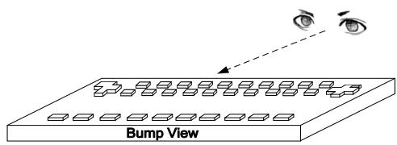

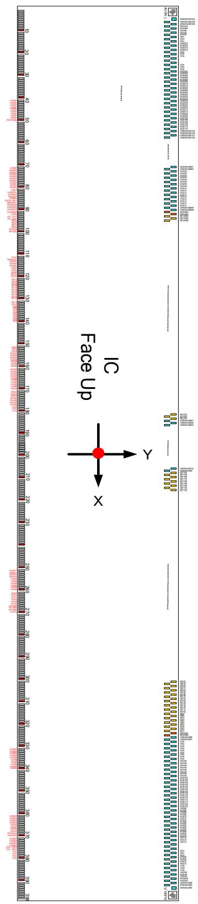

# 3.2 Input Bump Dimension

# Output Pads

P400~P2076  

<table><tr><td>Symbol</td><td>Item</td><td>Size</td></tr><tr><td>A</td><td>Bump Width</td><td>14 um</td></tr><tr><td>B</td><td>Bump Gap 1 (Horizontal)</td><td>14 um</td></tr><tr><td>C</td><td>Bump Height</td><td>95 um</td></tr><tr><td>D</td><td>Bump Gap 2 (Vertical)</td><td>30 um</td></tr></table>

P399、P2077  

<table><tr><td>Symbol</td><td>Item</td><td>Size</td></tr><tr><td>A</td><td>Bump Width</td><td>42 um</td></tr><tr><td>B</td><td>Bump Gap 1 (Horizontal)</td><td>14 um</td></tr><tr><td>C</td><td>Bump Height</td><td>95 um</td></tr><tr><td>D</td><td>Bump Gap 2 (Vertical)</td><td>30 um</td></tr></table>

- Input Pads  
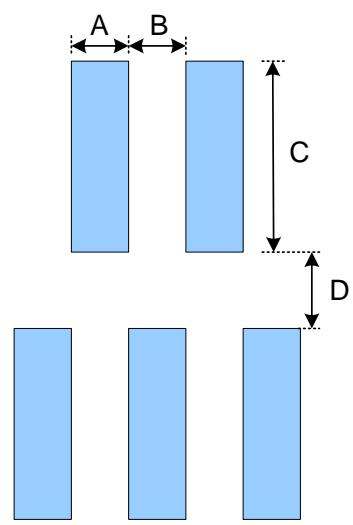  
No.1~398

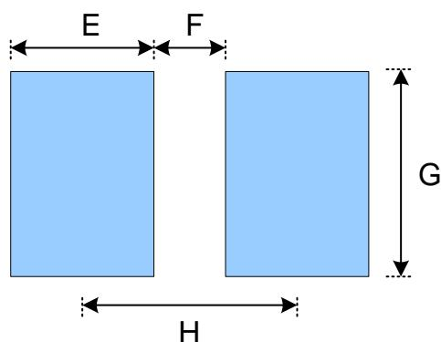

<table><tr><td>Symbol</td><td>Item</td><td>Size</td></tr><tr><td>E</td><td>Bump Width</td><td>40 um</td></tr><tr><td>F</td><td>Bump Gap</td><td>20um</td></tr><tr><td>G</td><td>Bump Height</td><td>84 um</td></tr><tr><td>H</td><td>Bump Pitch</td><td>60 um</td></tr></table>

# 3.3 Alignment Mark Dimension

- Alignment Mark ALIGN_L : (X,Y) = (-11870,302)

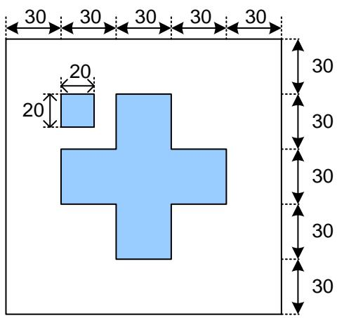

- Alignment Mark ALIGN_R:  $(X,Y) = (+11870,302)$

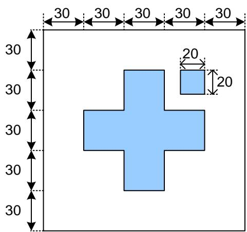

# 3.4 Chip Information

<table><tr><td>Chip size</td><td>23970μm x770μm
(Tolerance±30um)</td></tr><tr><td>Chip thickness</td><td>250μm</td></tr><tr><td>Pad Location</td><td>Pad center</td></tr><tr><td>Coordinate Origin</td><td>Chip center</td></tr></table>

Chip size included scribe line.

4 PAD CENTER COORDINATES (AFTER HEAT CORRECTION)  

<table><tr><td>PAD No.</td><td>PIN Name</td><td>X</td><td>Y</td><td>PAD No.</td><td>PIN Name</td><td>X</td><td>Y</td><td>PAD No.</td><td>PIN Name</td><td>X</td><td>Y</td></tr><tr><td>1</td><td>VSSIDUM0</td><td>-11910</td><td>-315</td><td>33</td><td>VSSB</td><td>-9990</td><td>-315</td><td>65</td><td>DGND</td><td>-8070</td><td>-315</td></tr><tr><td>2</td><td>VSSIDUM0</td><td>-11850</td><td>-315</td><td>34</td><td>VSSB</td><td>-9930</td><td>-315</td><td>66</td><td>VCC</td><td>-8010</td><td>-315</td></tr><tr><td>3</td><td>VSSIDUM1</td><td>-11790</td><td>-315</td><td>35</td><td>VSSB</td><td>-9870</td><td>-315</td><td>67</td><td>VCC</td><td>-7950</td><td>-315</td></tr><tr><td>4</td><td>PADA1</td><td>-11730</td><td>-315</td><td>36</td><td>VSSB</td><td>-9810</td><td>-315</td><td>68</td><td>VCC</td><td>-7890</td><td>-315</td></tr><tr><td>5</td><td>PADB1</td><td>-11670</td><td>-315</td><td>37</td><td>VSSB</td><td>-9750</td><td>-315</td><td>69</td><td>VDDB</td><td>-7830</td><td>-315</td></tr><tr><td>6</td><td>VCOM</td><td>-11610</td><td>-315</td><td>38</td><td>VDDB</td><td>-9690</td><td>-315</td><td>70</td><td>VDDB</td><td>-7770</td><td>-315</td></tr><tr><td>7</td><td>VCOM</td><td>-11550</td><td>-315</td><td>39</td><td>VDDB</td><td>-9630</td><td>-315</td><td>71</td><td>VDDB</td><td>-7710</td><td>-315</td></tr><tr><td>8</td><td>VCOM</td><td>-11490</td><td>-315</td><td>40</td><td>VDDB</td><td>-9570</td><td>-315</td><td>72</td><td>VSSB2</td><td>-7650</td><td>-315</td></tr><tr><td>9</td><td>VCOM</td><td>-11430</td><td>-315</td><td>41</td><td>VDDB</td><td>-9510</td><td>-315</td><td>73</td><td>VSSB2</td><td>-7590</td><td>-315</td></tr><tr><td>10</td><td>VCOM</td><td>-11370</td><td>-315</td><td>42</td><td>VDDB</td><td>-9450</td><td>-315</td><td>74</td><td>VSSB2</td><td>-7530</td><td>-315</td></tr><tr><td>11</td><td>CNTACT1</td><td>-11310</td><td>-315</td><td>43</td><td>VDDB</td><td>-9390</td><td>-315</td><td>75</td><td>VSSB2</td><td>-7470</td><td>-315</td></tr><tr><td>12</td><td>CNTACT1</td><td>-11250</td><td>-315</td><td>44</td><td>VDDB</td><td>-9330</td><td>-315</td><td>76</td><td>VSSB2</td><td>-7410</td><td>-315</td></tr><tr><td>13</td><td>VPP</td><td>-11190</td><td>-315</td><td>45</td><td>VDDB</td><td>-9270</td><td>-315</td><td>77</td><td>VSSB2</td><td>-7350</td><td>-315</td></tr><tr><td>14</td><td>VPP</td><td>-11130</td><td>-315</td><td>46</td><td>VSSB</td><td>-9210</td><td>-315</td><td>78</td><td>SGND</td><td>-7290</td><td>-315</td></tr><tr><td>15</td><td>VPP</td><td>-11070</td><td>-315</td><td>47</td><td>VSSB</td><td>-9150</td><td>-315</td><td>79</td><td>SGND</td><td>-7230</td><td>-315</td></tr><tr><td>16</td><td>VPP</td><td>-11010</td><td>-315</td><td>48</td><td>VSSB</td><td>-9090</td><td>-315</td><td>80</td><td>SGND</td><td>-7170</td><td>-315</td></tr><tr><td>17</td><td>VPP</td><td>-10950</td><td>-315</td><td>49</td><td>VSSB</td><td>-9030</td><td>-315</td><td>81</td><td>VDDI</td><td>-7110</td><td>-315</td></tr><tr><td>18</td><td>VGL</td><td>-10890</td><td>-315</td><td>50</td><td>TESTO[0]</td><td>-8970</td><td>-315</td><td>82</td><td>LANSEL</td><td>-7050</td><td>-315</td></tr><tr><td>19</td><td>VGL</td><td>-10830</td><td>-315</td><td>51</td><td>TESTO[1]</td><td>-8910</td><td>-315</td><td>83</td><td>DSWAP</td><td>-6990</td><td>-315</td></tr><tr><td>20</td><td>VGL</td><td>-10770</td><td>-315</td><td>52</td><td>TESTO[2]</td><td>-8850</td><td>-315</td><td>84</td><td>PSWAP</td><td>-6930</td><td>-315</td></tr><tr><td>21</td><td>VGL</td><td>-10710</td><td>-315</td><td>53</td><td>TESTO[3]</td><td>-8790</td><td>-315</td><td>85</td><td>DGND</td><td>-6870</td><td>-315</td></tr><tr><td>22</td><td>VGL</td><td>-10650</td><td>-315</td><td>54</td><td>DMY</td><td>-8730</td><td>-315</td><td>86</td><td>DSTB_SEL</td><td>-6810</td><td>-315</td></tr><tr><td>23</td><td>VGL</td><td>-10590</td><td>-315</td><td>55</td><td>DMY</td><td>-8670</td><td>-315</td><td>87</td><td>NBWSEL</td><td>-6750</td><td>-315</td></tr><tr><td>24</td><td>VGHEQ2</td><td>-10530</td><td>-315</td><td>56</td><td>DMY</td><td>-8610</td><td>-315</td><td>88</td><td>VGSW[3]</td><td>-6690</td><td>-315</td></tr><tr><td>25</td><td>VGHEQ2</td><td>-10470</td><td>-315</td><td>57</td><td>DGND</td><td>-8550</td><td>-315</td><td>89</td><td>VGSW[2]</td><td>-6630</td><td>-315</td></tr><tr><td>26</td><td>VSSB2</td><td>-10410</td><td>-315</td><td>58</td><td>DGND</td><td>-8490</td><td>-315</td><td>90</td><td>VGSW[1]</td><td>-6570</td><td>-315</td></tr><tr><td>27</td><td>VSSB2</td><td>-10350</td><td>-315</td><td>59</td><td>DGND</td><td>-8430</td><td>-315</td><td>91</td><td>VGSW[0]</td><td>-6510</td><td>-315</td></tr><tr><td>28</td><td>VSSB2</td><td>-10290</td><td>-315</td><td>60</td><td>DGND</td><td>-8370</td><td>-315</td><td>92</td><td>VDDI</td><td>-6450</td><td>-315</td></tr><tr><td>29</td><td>VSSB2</td><td>-10230</td><td>-315</td><td>61</td><td>DGND</td><td>-8310</td><td>-315</td><td>93</td><td>I2C_SA1</td><td>-6390</td><td>-315</td></tr><tr><td>30</td><td>VSSB</td><td>-10170</td><td>-315</td><td>62</td><td>DGND</td><td>-8250</td><td>-315</td><td>94</td><td>I2C_SA0</td><td>-6330</td><td>-315</td></tr><tr><td>31</td><td>VSSB</td><td>-10110</td><td>-315</td><td>63</td><td>DGND</td><td>-8190</td><td>-315</td><td>95</td><td>IM[3]</td><td>-6270</td><td>-315</td></tr><tr><td>32</td><td>VSSB</td><td>-10050</td><td>-315</td><td>64</td><td>DGND</td><td>-8130</td><td>-315</td><td>96</td><td>IM[2]</td><td>-6210</td><td>-315</td></tr><tr><td>97</td><td>IM[1]</td><td>-6150</td><td>-315</td><td>131</td><td>D[11]</td><td>-4110</td><td>-315</td><td>165</td><td>VSSB</td><td>-2070</td><td>-315</td></tr><tr><td>98</td><td>IM[0]</td><td>-6090</td><td>-315</td><td>132</td><td>D[10]</td><td>-4050</td><td>-315</td><td>166</td><td>VSSB</td><td>-2010</td><td>-315</td></tr><tr><td>99</td><td>GPO[3]</td><td>-6030</td><td>-315</td><td>133</td><td>D[9]</td><td>-3990</td><td>-315</td><td>167</td><td>VSSB</td><td>-1950</td><td>-315</td></tr><tr><td>100</td><td>GPO[2]</td><td>-5970</td><td>-315</td><td>134</td><td>D[8]</td><td>-3930</td><td>-315</td><td>168</td><td>VSSB</td><td>-1890</td><td>-315</td></tr><tr><td>101</td><td>GPO[1]</td><td>-5910</td><td>-315</td><td>135</td><td>D[7]</td><td>-3870</td><td>-315</td><td>169</td><td>VSSB</td><td>-1830</td><td>-315</td></tr><tr><td>102</td><td>GPO[0]</td><td>-5850</td><td>-315</td><td>136</td><td>D[6]</td><td>-3810</td><td>-315</td><td>170</td><td>VDDA</td><td>-1770</td><td>-315</td></tr><tr><td>103</td><td>EXB1T</td><td>-5790</td><td>-315</td><td>137</td><td>D[5]</td><td>-3750</td><td>-315</td><td>171</td><td>VDDA</td><td>-1710</td><td>-315</td></tr><tr><td>104</td><td>TE_L</td><td>-5730</td><td>-315</td><td>138</td><td>D[4]</td><td>-3690</td><td>-315</td><td>172</td><td>VDDA</td><td>-1650</td><td>-315</td></tr><tr><td>105</td><td>DMY</td><td>-5670</td><td>-315</td><td>139</td><td>D[3]</td><td>-3630</td><td>-315</td><td>173</td><td>VDDA</td><td>-1590</td><td>-315</td></tr><tr><td>106</td><td>SDO</td><td>-5610</td><td>-315</td><td>140</td><td>D[2]</td><td>-3570</td><td>-315</td><td>174</td><td>DGND</td><td>-1530</td><td>-315</td></tr><tr><td>107</td><td>SDA</td><td>-5550</td><td>-315</td><td>141</td><td>D[1]</td><td>-3510</td><td>-315</td><td>175</td><td>DGND</td><td>-1470</td><td>-315</td></tr><tr><td>108</td><td>DCX</td><td>-5490</td><td>-315</td><td>142</td><td>D[0]</td><td>-3450</td><td>-315</td><td>176</td><td>DGND</td><td>-1410</td><td>-315</td></tr><tr><td>109</td><td>SCL</td><td>-5430</td><td>-315</td><td>143</td><td>DE</td><td>-3390</td><td>-315</td><td>177</td><td>DGND</td><td>-1350</td><td>-315</td></tr><tr><td>110</td><td>RDX</td><td>-5370</td><td>-315</td><td>144</td><td>PCLK</td><td>-3330</td><td>-315</td><td>178</td><td>VCC</td><td>-1290</td><td>-315</td></tr><tr><td>111</td><td>CSX</td><td>-5310</td><td>-315</td><td>145</td><td>HS</td><td>-3270</td><td>-315</td><td>179</td><td>VCC</td><td>-1230</td><td>-315</td></tr><tr><td>112</td><td>RESETX</td><td>-5250</td><td>-315</td><td>146</td><td>VS</td><td>-3210</td><td>-315</td><td>180</td><td>VCC</td><td>-1170</td><td>-315</td></tr><tr><td>113</td><td>DGND</td><td>-5190</td><td>-315</td><td>147</td><td>LEDPWM</td><td>-3150</td><td>-315</td><td>181</td><td>VCC</td><td>-1110</td><td>-315</td></tr><tr><td>114</td><td>DGND</td><td>-5130</td><td>-315</td><td>148</td><td>LEDON</td><td>-3090</td><td>-315</td><td>182</td><td>VSSM</td><td>-1050</td><td>-315</td></tr><tr><td>115</td><td>DGND</td><td>-5070</td><td>-315</td><td>149</td><td>DMY</td><td>-3030</td><td>-315</td><td>183</td><td>VSSM</td><td>-990</td><td>-315</td></tr><tr><td>116</td><td>VDDI</td><td>-5010</td><td>-315</td><td>150</td><td>ERR</td><td>-2970</td><td>-315</td><td>184</td><td>VSSM</td><td>-930</td><td>-315</td></tr><tr><td>117</td><td>VDDI</td><td>-4950</td><td>-315</td><td>151</td><td>VDDI</td><td>-2910</td><td>-315</td><td>185</td><td>VSSM</td><td>-870</td><td>-315</td></tr><tr><td>118</td><td>VDDI</td><td>-4890</td><td>-315</td><td>152</td><td>VDDI</td><td>-2850</td><td>-315</td><td>186</td><td>VSSM</td><td>-810</td><td>-315</td></tr><tr><td>119</td><td>D[23]</td><td>-4830</td><td>-315</td><td>153</td><td>VDDI</td><td>-2790</td><td>-315</td><td>187</td><td>DP1</td><td>-750</td><td>-315</td></tr><tr><td>120</td><td>D[22]</td><td>-4770</td><td>-315</td><td>154</td><td>DGND</td><td>-2730</td><td>-315</td><td>188</td><td>DP1</td><td>-690</td><td>-315</td></tr><tr><td>121</td><td>D[21]</td><td>-4710</td><td>-315</td><td>155</td><td>DGND</td><td>-2670</td><td>-315</td><td>189</td><td>DP1</td><td>-630</td><td>-315</td></tr><tr><td>122</td><td>D[20]</td><td>-4650</td><td>-315</td><td>156</td><td>DGND</td><td>-2610</td><td>-315</td><td>190</td><td>DP1</td><td>-570</td><td>-315</td></tr><tr><td>123</td><td>D[19]</td><td>-4590</td><td>-315</td><td>157</td><td>VDDB</td><td>-2550</td><td>-315</td><td>191</td><td>DN1</td><td>-510</td><td>-315</td></tr><tr><td>124</td><td>D[18]</td><td>-4530</td><td>-315</td><td>158</td><td>VDDB</td><td>-2490</td><td>-315</td><td>192</td><td>DN1</td><td>-450</td><td>-315</td></tr><tr><td>125</td><td>D[17]</td><td>-4470</td><td>-315</td><td>159</td><td>VDDB</td><td>-2430</td><td>-315</td><td>193</td><td>DN1</td><td>-390</td><td>-315</td></tr><tr><td>126</td><td>D[16]</td><td>-4410</td><td>-315</td><td>160</td><td>VDDB</td><td>-2370</td><td>-315</td><td>194</td><td>DN1</td><td>-330</td><td>-315</td></tr><tr><td>127</td><td>D[15]</td><td>-4350</td><td>-315</td><td>161</td><td>AGND</td><td>-2310</td><td>-315</td><td>195</td><td>VSSM</td><td>-270</td><td>-315</td></tr><tr><td>128</td><td>D[14]</td><td>-4290</td><td>-315</td><td>162</td><td>AGND</td><td>-2250</td><td>-315</td><td>196</td><td>VSSM</td><td>-210</td><td>-315</td></tr><tr><td>129</td><td>D[13]</td><td>-4230</td><td>-315</td><td>163</td><td>AGND</td><td>-2190</td><td>-315</td><td>197</td><td>CP</td><td>-150</td><td>-315</td></tr><tr><td>130</td><td>D[12]</td><td>-4170</td><td>-315</td><td>164</td><td>AGND</td><td>-2130</td><td>-315</td><td>198</td><td>CP</td><td>-90</td><td>-315</td></tr><tr><td>199</td><td>CP</td><td>-30</td><td>-315</td><td>233</td><td>VSSA</td><td>2010</td><td>-315</td><td>267</td><td>VCCMD</td><td>4050</td><td>-315</td></tr><tr><td>200</td><td>CP</td><td>30</td><td>-315</td><td>234</td><td>VSSA</td><td>2070</td><td>-315</td><td>268</td><td>VCCMD</td><td>4110</td><td>-315</td></tr><tr><td>201</td><td>CN</td><td>90</td><td>-315</td><td>235</td><td>VSSA</td><td>2130</td><td>-315</td><td>269</td><td>VCCMD</td><td>4170</td><td>-315</td></tr><tr><td>202</td><td>CN</td><td>150</td><td>-315</td><td>236</td><td>VSSA</td><td>2190</td><td>-315</td><td>270</td><td>V12TX</td><td>4230</td><td>-315</td></tr><tr><td>203</td><td>CN</td><td>210</td><td>-315</td><td>237</td><td>V20</td><td>2250</td><td>-315</td><td>271</td><td>V12TX</td><td>4290</td><td>-315</td></tr><tr><td>204</td><td>CN</td><td>270</td><td>-315</td><td>238</td><td>V20</td><td>2310</td><td>-315</td><td>272</td><td>V12TX</td><td>4350</td><td>-315</td></tr><tr><td>205</td><td>VSSM</td><td>330</td><td>-315</td><td>239</td><td>DMY</td><td>2370</td><td>-315</td><td>273</td><td>AVDD</td><td>4410</td><td>-315</td></tr><tr><td>206</td><td>VSSM</td><td>390</td><td>-315</td><td>240</td><td>DMY</td><td>2430</td><td>-315</td><td>274</td><td>AVDD</td><td>4470</td><td>-315</td></tr><tr><td>207</td><td>DP0</td><td>450</td><td>-315</td><td>241</td><td>VAP</td><td>2490</td><td>-315</td><td>275</td><td>AVDD</td><td>4530</td><td>-315</td></tr><tr><td>208</td><td>DP0</td><td>510</td><td>-315</td><td>242</td><td>VAP</td><td>2550</td><td>-315</td><td>276</td><td>AVCL</td><td>4590</td><td>-315</td></tr><tr><td>209</td><td>DP0</td><td>570</td><td>-315</td><td>243</td><td>DMY</td><td>2610</td><td>-315</td><td>277</td><td>AVCL</td><td>4650</td><td>-315</td></tr><tr><td>210</td><td>DP0</td><td>630</td><td>-315</td><td>244</td><td>DMY</td><td>2670</td><td>-315</td><td>278</td><td>AVCL</td><td>4710</td><td>-315</td></tr><tr><td>211</td><td>DN0</td><td>690</td><td>-315</td><td>245</td><td>VAN</td><td>2730</td><td>-315</td><td>279</td><td>VDDB</td><td>4770</td><td>-315</td></tr><tr><td>212</td><td>DN0</td><td>750</td><td>-315</td><td>246</td><td>VAN</td><td>2790</td><td>-315</td><td>280</td><td>VDDB</td><td>4830</td><td>-315</td></tr><tr><td>213</td><td>DN0</td><td>810</td><td>-315</td><td>247</td><td>DMY</td><td>2850</td><td>-315</td><td>281</td><td>VDDB</td><td>4890</td><td>-315</td></tr><tr><td>214</td><td>DN0</td><td>870</td><td>-315</td><td>248</td><td>DMY</td><td>2910</td><td>-315</td><td>282</td><td>VDDB</td><td>4950</td><td>-315</td></tr><tr><td>215</td><td>VSSM</td><td>930</td><td>-315</td><td>249</td><td>VDDR1</td><td>2970</td><td>-315</td><td>283</td><td>VDDB</td><td>5010</td><td>-315</td></tr><tr><td>216</td><td>VSSM</td><td>990</td><td>-315</td><td>250</td><td>VDDR1</td><td>3030</td><td>-315</td><td>284</td><td>VDDB</td><td>5070</td><td>-315</td></tr><tr><td>217</td><td>VCCMA</td><td>1050</td><td>-315</td><td>251</td><td>VDDR1</td><td>3090</td><td>-315</td><td>285</td><td>VDDB</td><td>5130</td><td>-315</td></tr><tr><td>218</td><td>VCCMA</td><td>1110</td><td>-315</td><td>252</td><td>VDDR1</td><td>3150</td><td>-315</td><td>286</td><td>VDDB</td><td>5190</td><td>-315</td></tr><tr><td>219</td><td>VCCMA</td><td>1170</td><td>-315</td><td>253</td><td>VDDR1</td><td>3210</td><td>-315</td><td>287</td><td>VDDB</td><td>5250</td><td>-315</td></tr><tr><td>220</td><td>VDDR</td><td>1230</td><td>-315</td><td>254</td><td>VDDR1</td><td>3270</td><td>-315</td><td>288</td><td>VDDB</td><td>5310</td><td>-315</td></tr><tr><td>221</td><td>VDDR</td><td>1290</td><td>-315</td><td>255</td><td>VSSR</td><td>3330</td><td>-315</td><td>289</td><td>SGND</td><td>5370</td><td>-315</td></tr><tr><td>222</td><td>VDDR</td><td>1350</td><td>-315</td><td>256</td><td>VSSR</td><td>3390</td><td>-315</td><td>290</td><td>SGND</td><td>5430</td><td>-315</td></tr><tr><td>223</td><td>VDDR</td><td>1410</td><td>-315</td><td>257</td><td>VSSR</td><td>3450</td><td>-315</td><td>291</td><td>SGND</td><td>5490</td><td>-315</td></tr><tr><td>224</td><td>VDDR</td><td>1470</td><td>-315</td><td>258</td><td>VSSR</td><td>3510</td><td>-315</td><td>292</td><td>SGND</td><td>5550</td><td>-315</td></tr><tr><td>225</td><td>VDDR</td><td>1530</td><td>-315</td><td>259</td><td>VSSR</td><td>3570</td><td>-315</td><td>293</td><td>SGND</td><td>5610</td><td>-315</td></tr><tr><td>226</td><td>VDDR</td><td>1590</td><td>-315</td><td>260</td><td>VSSR</td><td>3630</td><td>-315</td><td>294</td><td>VSSB</td><td>5670</td><td>-315</td></tr><tr><td>227</td><td>VDDR</td><td>1650</td><td>-315</td><td>261</td><td>VPS1</td><td>3690</td><td>-315</td><td>295</td><td>VSSB</td><td>5730</td><td>-315</td></tr><tr><td>228</td><td>VDDB</td><td>1710</td><td>-315</td><td>262</td><td>VPS1</td><td>3750</td><td>-315</td><td>296</td><td>VSSB</td><td>5790</td><td>-315</td></tr><tr><td>229</td><td>VDDB</td><td>1770</td><td>-315</td><td>263</td><td>VPS1</td><td>3810</td><td>-315</td><td>297</td><td>VSSB</td><td>5850</td><td>-315</td></tr><tr><td>230</td><td>VDDB</td><td>1830</td><td>-315</td><td>264</td><td>VPS2</td><td>3870</td><td>-315</td><td>298</td><td>VSSB</td><td>5910</td><td>-315</td></tr><tr><td>231</td><td>DMY</td><td>1890</td><td>-315</td><td>265</td><td>VPS2</td><td>3930</td><td>-315</td><td>299</td><td>VSSB</td><td>5970</td><td>-315</td></tr><tr><td>232</td><td>DMY</td><td>1950</td><td>-315</td><td>266</td><td>VPS2</td><td>3990</td><td>-315</td><td>300</td><td>VSSB</td><td>6030</td><td>-315</td></tr><tr><td>301</td><td>VSSB</td><td>6090</td><td>-315</td><td>335</td><td>VSSB2</td><td>8130</td><td>-315</td><td>369</td><td>VGHEQ2</td><td>10170</td><td>-315</td></tr><tr><td>302</td><td>VSSB</td><td>6150</td><td>-315</td><td>336</td><td>VSSB</td><td>8190</td><td>-315</td><td>370</td><td>VGHEQ2</td><td>10230</td><td>-315</td></tr><tr><td>303</td><td>VSSB</td><td>6210</td><td>-315</td><td>337</td><td>VSSB</td><td>8250</td><td>-315</td><td>371</td><td>VDDB2</td><td>10290</td><td>-315</td></tr><tr><td>304</td><td>VSSB</td><td>6270</td><td>-315</td><td>338</td><td>VSSB</td><td>8310</td><td>-315</td><td>372</td><td>VDDB2</td><td>10350</td><td>-315</td></tr><tr><td>305</td><td>VSSB</td><td>6330</td><td>-315</td><td>339</td><td>AGND</td><td>8370</td><td>-315</td><td>373</td><td>VDDB2</td><td>10410</td><td>-315</td></tr><tr><td>306</td><td>VSSB</td><td>6390</td><td>-315</td><td>340</td><td>AGND</td><td>8430</td><td>-315</td><td>374</td><td>VDDB2</td><td>10470</td><td>-315</td></tr><tr><td>307</td><td>VSSB</td><td>6450</td><td>-315</td><td>341</td><td>AGND</td><td>8490</td><td>-315</td><td>375</td><td>VGL</td><td>10530</td><td>-315</td></tr><tr><td>308</td><td>VSSB</td><td>6510</td><td>-315</td><td>342</td><td>AGND</td><td>8550</td><td>-315</td><td>376</td><td>VGL</td><td>10590</td><td>-315</td></tr><tr><td>309</td><td>VSSB</td><td>6570</td><td>-315</td><td>343</td><td>VDDB</td><td>8610</td><td>-315</td><td>377</td><td>VGL</td><td>10650</td><td>-315</td></tr><tr><td>310</td><td>VSSB</td><td>6630</td><td>-315</td><td>344</td><td>VDDB</td><td>8670</td><td>-315</td><td>378</td><td>VGL</td><td>10710</td><td>-315</td></tr><tr><td>311</td><td>VSSB</td><td>6690</td><td>-315</td><td>345</td><td>VDDB</td><td>8730</td><td>-315</td><td>379</td><td>VGL</td><td>10770</td><td>-315</td></tr><tr><td>312</td><td>VSSB</td><td>6750</td><td>-315</td><td>346</td><td>VDDB</td><td>8790</td><td>-315</td><td>380</td><td>VGL</td><td>10830</td><td>-315</td></tr><tr><td>313</td><td>VSSB</td><td>6810</td><td>-315</td><td>347</td><td>VDDB</td><td>8850</td><td>-315</td><td>381</td><td>VGL</td><td>10890</td><td>-315</td></tr><tr><td>314</td><td>VSSB</td><td>6870</td><td>-315</td><td>348</td><td>VDDB</td><td>8910</td><td>-315</td><td>382</td><td>VGL</td><td>10950</td><td>-315</td></tr><tr><td>315</td><td>VDDB</td><td>6930</td><td>-315</td><td>349</td><td>VDDB</td><td>8970</td><td>-315</td><td>383</td><td>DMY</td><td>11010</td><td>-315</td></tr><tr><td>316</td><td>VDDB</td><td>6990</td><td>-315</td><td>350</td><td>VDDB</td><td>9030</td><td>-315</td><td>384</td><td>DMY</td><td>11070</td><td>-315</td></tr><tr><td>317</td><td>VDDB</td><td>7050</td><td>-315</td><td>351</td><td>VDDB</td><td>9090</td><td>-315</td><td>385</td><td>DMY</td><td>11130</td><td>-315</td></tr><tr><td>318</td><td>VDDB</td><td>7110</td><td>-315</td><td>352</td><td>VGHP</td><td>9150</td><td>-315</td><td>386</td><td>DMY</td><td>11190</td><td>-315</td></tr><tr><td>319</td><td>VDDB</td><td>7170</td><td>-315</td><td>353</td><td>VGHP</td><td>9210</td><td>-315</td><td>387</td><td>CNTACT2</td><td>11250</td><td>-315</td></tr><tr><td>320</td><td>VDDB</td><td>7230</td><td>-315</td><td>354</td><td>VGHP</td><td>9270</td><td>-315</td><td>388</td><td>CNTACT2</td><td>11310</td><td>-315</td></tr><tr><td>321</td><td>VDDB</td><td>7290</td><td>-315</td><td>355</td><td>VCC</td><td>9330</td><td>-315</td><td>389</td><td>VCOM</td><td>11370</td><td>-315</td></tr><tr><td>322</td><td>VDDB</td><td>7350</td><td>-315</td><td>356</td><td>VCC</td><td>9390</td><td>-315</td><td>390</td><td>VCOM</td><td>11430</td><td>-315</td></tr><tr><td>323</td><td>VDDB</td><td>7410</td><td>-315</td><td>357</td><td>VCC</td><td>9450</td><td>-315</td><td>391</td><td>VCOM</td><td>11490</td><td>-315</td></tr><tr><td>324</td><td>VDDB</td><td>7470</td><td>-315</td><td>358</td><td>DGND</td><td>9510</td><td>-315</td><td>392</td><td>VCOM</td><td>11550</td><td>-315</td></tr><tr><td>325</td><td>VDDB</td><td>7530</td><td>-315</td><td>359</td><td>DGND</td><td>9570</td><td>-315</td><td>393</td><td>VCOM</td><td>11610</td><td>-315</td></tr><tr><td>326</td><td>VDDB</td><td>7590</td><td>-315</td><td>360</td><td>DGND</td><td>9630</td><td>-315</td><td>394</td><td>PADA2</td><td>11670</td><td>-315</td></tr><tr><td>327</td><td>VDDB</td><td>7650</td><td>-315</td><td>361</td><td>VSSB2</td><td>9690</td><td>-315</td><td>395</td><td>PADB2</td><td>11730</td><td>-315</td></tr><tr><td>328</td><td>VDDB</td><td>7710</td><td>-315</td><td>362</td><td>VSSB2</td><td>9750</td><td>-315</td><td>396</td><td>VSSIDUM2</td><td>11790</td><td>-315</td></tr><tr><td>329</td><td>VSSB2</td><td>7770</td><td>-315</td><td>363</td><td>VSSB2</td><td>9810</td><td>-315</td><td>397</td><td>VSSIDUM3</td><td>11850</td><td>-315</td></tr><tr><td>330</td><td>VSSB2</td><td>7830</td><td>-315</td><td>364</td><td>VSSB2</td><td>9870</td><td>-315</td><td>398</td><td>VSSIDUM3</td><td>11910</td><td>-315</td></tr><tr><td>331</td><td>VSSB2</td><td>7890</td><td>-315</td><td>365</td><td>VGHS</td><td>9930</td><td>-315</td><td>399</td><td>DMY</td><td>11760</td><td>309.5</td></tr><tr><td>332</td><td>VSSB2</td><td>7950</td><td>-315</td><td>366</td><td>VGHS</td><td>9990</td><td>-315</td><td>400</td><td>DMY</td><td>11732</td><td>184.5</td></tr><tr><td>333</td><td>VSSB2</td><td>8010</td><td>-315</td><td>367</td><td>VGHS</td><td>10050</td><td>-315</td><td>401</td><td>DMY</td><td>11718</td><td>309.5</td></tr><tr><td>334</td><td>VSSB2</td><td>8070</td><td>-315</td><td>368</td><td>VGHS</td><td>10110</td><td>-315</td><td>402</td><td>PADA3</td><td>11704</td><td>184.5</td></tr><tr><td>403</td><td>PADB3</td><td>11690</td><td>309.5</td><td>437</td><td>GO[10]</td><td>11214</td><td>309.5</td><td>471</td><td>SDUM1</td><td>10738</td><td>309.5</td></tr><tr><td>404</td><td>VGHS</td><td>11676</td><td>184.5</td><td>438</td><td>GO[10]</td><td>11200</td><td>184.5</td><td>472</td><td>S[1]</td><td>10724</td><td>184.5</td></tr><tr><td>405</td><td>VGHS</td><td>11662</td><td>309.5</td><td>439</td><td>GO[11]</td><td>11186</td><td>309.5</td><td>473</td><td>S[2]</td><td>10710</td><td>309.5</td></tr><tr><td>406</td><td>VGHS</td><td>11648</td><td>184.5</td><td>440</td><td>GO[11]</td><td>11172</td><td>184.5</td><td>474</td><td>S[3]</td><td>10696</td><td>184.5</td></tr><tr><td>407</td><td>VGL</td><td>11634</td><td>309.5</td><td>441</td><td>GO[12]</td><td>11158</td><td>309.5</td><td>475</td><td>S[4]</td><td>10682</td><td>309.5</td></tr><tr><td>408</td><td>VGL</td><td>11620</td><td>184.5</td><td>442</td><td>GO[12]</td><td>11144</td><td>184.5</td><td>476</td><td>S[5]</td><td>10668</td><td>184.5</td></tr><tr><td>409</td><td>VGL</td><td>11606</td><td>309.5</td><td>443</td><td>GO[13]</td><td>11130</td><td>309.5</td><td>477</td><td>S[6]</td><td>10654</td><td>309.5</td></tr><tr><td>410</td><td>GO[1]</td><td>11592</td><td>184.5</td><td>444</td><td>GO[13]</td><td>11116</td><td>184.5</td><td>478</td><td>S[7]</td><td>10640</td><td>184.5</td></tr><tr><td>411</td><td>GO[1]</td><td>11578</td><td>309.5</td><td>445</td><td>GO[14]</td><td>11102</td><td>309.5</td><td>479</td><td>S[8]</td><td>10626</td><td>309.5</td></tr><tr><td>412</td><td>GO[2]</td><td>11564</td><td>184.5</td><td>446</td><td>GO[14]</td><td>11088</td><td>184.5</td><td>480</td><td>S[9]</td><td>10612</td><td>184.5</td></tr><tr><td>413</td><td>GO[2]</td><td>11550</td><td>309.5</td><td>447</td><td>GO[15]</td><td>11074</td><td>309.5</td><td>481</td><td>S[10]</td><td>10598</td><td>309.5</td></tr><tr><td>414</td><td>VGL</td><td>11536</td><td>184.5</td><td>448</td><td>GO[15]</td><td>11060</td><td>184.5</td><td>482</td><td>S[11]</td><td>10584</td><td>184.5</td></tr><tr><td>415</td><td>VGL</td><td>11522</td><td>309.5</td><td>449</td><td>GO[16]</td><td>11046</td><td>309.5</td><td>483</td><td>S[12]</td><td>10570</td><td>309.5</td></tr><tr><td>416</td><td>VGL</td><td>11508</td><td>184.5</td><td>450</td><td>GO[16]</td><td>11032</td><td>184.5</td><td>484</td><td>S[13]</td><td>10556</td><td>184.5</td></tr><tr><td>417</td><td>DMY</td><td>11494</td><td>309.5</td><td>451</td><td>VGHS</td><td>11018</td><td>309.5</td><td>485</td><td>S[14]</td><td>10542</td><td>309.5</td></tr><tr><td>418</td><td>DMY</td><td>11480</td><td>184.5</td><td>452</td><td>VGHS</td><td>11004</td><td>184.5</td><td>486</td><td>S[15]</td><td>10528</td><td>184.5</td></tr><tr><td>419</td><td>DMY</td><td>11466</td><td>309.5</td><td>453</td><td>VGHS</td><td>10990</td><td>309.5</td><td>487</td><td>S[16]</td><td>10514</td><td>309.5</td></tr><tr><td>420</td><td>VGL</td><td>11452</td><td>184.5</td><td>454</td><td>VGHS</td><td>10976</td><td>184.5</td><td>488</td><td>S[17]</td><td>10500</td><td>184.5</td></tr><tr><td>421</td><td>VGL</td><td>11438</td><td>309.5</td><td>455</td><td>VGHS</td><td>10962</td><td>309.5</td><td>489</td><td>S[18]</td><td>10486</td><td>309.5</td></tr><tr><td>422</td><td>VGL</td><td>11424</td><td>184.5</td><td>456</td><td>VGHS</td><td>10948</td><td>184.5</td><td>490</td><td>S[19]</td><td>10472</td><td>184.5</td></tr><tr><td>423</td><td>GO[3]</td><td>11410</td><td>309.5</td><td>457</td><td>VGHS</td><td>10934</td><td>309.5</td><td>491</td><td>S[20]</td><td>10458</td><td>309.5</td></tr><tr><td>424</td><td>GO[3]</td><td>11396</td><td>184.5</td><td>458</td><td>VGHS</td><td>10920</td><td>184.5</td><td>492</td><td>S[21]</td><td>10444</td><td>184.5</td></tr><tr><td>425</td><td>GO[4]</td><td>11382</td><td>309.5</td><td>459</td><td>VGL</td><td>10906</td><td>309.5</td><td>493</td><td>S[22]</td><td>10430</td><td>309.5</td></tr><tr><td>426</td><td>GO[4]</td><td>11368</td><td>184.5</td><td>460</td><td>VGL</td><td>10892</td><td>184.5</td><td>494</td><td>S[23]</td><td>10416</td><td>184.5</td></tr><tr><td>427</td><td>GO[5]</td><td>11354</td><td>309.5</td><td>461</td><td>VGL</td><td>10878</td><td>309.5</td><td>495</td><td>S[24]</td><td>10402</td><td>309.5</td></tr><tr><td>428</td><td>GO[5]</td><td>11340</td><td>184.5</td><td>462</td><td>VGL</td><td>10864</td><td>184.5</td><td>496</td><td>S[25]</td><td>10388</td><td>184.5</td></tr><tr><td>429</td><td>GO[6]</td><td>11326</td><td>309.5</td><td>463</td><td>VGL</td><td>10850</td><td>309.5</td><td>497</td><td>S[26]</td><td>10374</td><td>309.5</td></tr><tr><td>430</td><td>GO[6]</td><td>11312</td><td>184.5</td><td>464</td><td>VGL</td><td>10836</td><td>184.5</td><td>498</td><td>S[27]</td><td>10360</td><td>184.5</td></tr><tr><td>431</td><td>GO[7]</td><td>11298</td><td>309.5</td><td>465</td><td>VGL</td><td>10822</td><td>309.5</td><td>499</td><td>S[28]</td><td>10346</td><td>309.5</td></tr><tr><td>432</td><td>GO[7]</td><td>11284</td><td>184.5</td><td>466</td><td>VGL</td><td>10808</td><td>184.5</td><td>500</td><td>S[29]</td><td>10332</td><td>184.5</td></tr><tr><td>433</td><td>GO[8]</td><td>11270</td><td>309.5</td><td>467</td><td>VGL</td><td>10794</td><td>309.5</td><td>501</td><td>S[30]</td><td>10318</td><td>309.5</td></tr><tr><td>434</td><td>GO[8]</td><td>11256</td><td>184.5</td><td>468</td><td>DMY</td><td>10780</td><td>184.5</td><td>502</td><td>S[31]</td><td>10304</td><td>184.5</td></tr><tr><td>435</td><td>GO[9]</td><td>11242</td><td>309.5</td><td>469</td><td>DMY</td><td>10766</td><td>309.5</td><td>503</td><td>S[32]</td><td>10290</td><td>309.5</td></tr><tr><td>436</td><td>GO[9]</td><td>11228</td><td>184.5</td><td>470</td><td>SDUMO</td><td>10752</td><td>184.5</td><td>504</td><td>S[33]</td><td>10276</td><td>184.5</td></tr><tr><td>505</td><td>S[34]</td><td>10262</td><td>309.5</td><td>539</td><td>S[68]</td><td>9786</td><td>309.5</td><td>573</td><td>S[102]</td><td>9310</td><td>309.5</td></tr><tr><td>506</td><td>S[35]</td><td>10248</td><td>184.5</td><td>540</td><td>S[69]</td><td>9772</td><td>184.5</td><td>574</td><td>S[103]</td><td>9296</td><td>184.5</td></tr><tr><td>507</td><td>S[36]</td><td>10234</td><td>309.5</td><td>541</td><td>S[70]</td><td>9758</td><td>309.5</td><td>575</td><td>S[104]</td><td>9282</td><td>309.5</td></tr><tr><td>508</td><td>S[37]</td><td>10220</td><td>184.5</td><td>542</td><td>S[71]</td><td>9744</td><td>184.5</td><td>576</td><td>S[105]</td><td>9268</td><td>184.5</td></tr><tr><td>509</td><td>S[38]</td><td>10206</td><td>309.5</td><td>543</td><td>S[72]</td><td>9730</td><td>309.5</td><td>577</td><td>S[106]</td><td>9254</td><td>309.5</td></tr><tr><td>510</td><td>S[39]</td><td>10192</td><td>184.5</td><td>544</td><td>S[73]</td><td>9716</td><td>184.5</td><td>578</td><td>S[107]</td><td>9240</td><td>184.5</td></tr><tr><td>511</td><td>S[40]</td><td>10178</td><td>309.5</td><td>545</td><td>S[74]</td><td>9702</td><td>309.5</td><td>579</td><td>S[108]</td><td>9226</td><td>309.5</td></tr><tr><td>512</td><td>S[41]</td><td>10164</td><td>184.5</td><td>546</td><td>S[75]</td><td>9688</td><td>184.5</td><td>580</td><td>S[109]</td><td>9212</td><td>184.5</td></tr><tr><td>513</td><td>S[42]</td><td>10150</td><td>309.5</td><td>547</td><td>S[76]</td><td>9674</td><td>309.5</td><td>581</td><td>S[110]</td><td>9198</td><td>309.5</td></tr><tr><td>514</td><td>S[43]</td><td>10136</td><td>184.5</td><td>548</td><td>S[77]</td><td>9660</td><td>184.5</td><td>582</td><td>S[111]</td><td>9184</td><td>184.5</td></tr><tr><td>515</td><td>S[44]</td><td>10122</td><td>309.5</td><td>549</td><td>S[78]</td><td>9646</td><td>309.5</td><td>583</td><td>S[112]</td><td>9170</td><td>309.5</td></tr><tr><td>516</td><td>S[45]</td><td>10108</td><td>184.5</td><td>550</td><td>S[79]</td><td>9632</td><td>184.5</td><td>584</td><td>S[113]</td><td>9156</td><td>184.5</td></tr><tr><td>517</td><td>S[46]</td><td>10094</td><td>309.5</td><td>551</td><td>S[80]</td><td>9618</td><td>309.5</td><td>585</td><td>S[114]</td><td>9142</td><td>309.5</td></tr><tr><td>518</td><td>S[47]</td><td>10080</td><td>184.5</td><td>552</td><td>S[81]</td><td>9604</td><td>184.5</td><td>586</td><td>S[115]</td><td>9128</td><td>184.5</td></tr><tr><td>519</td><td>S[48]</td><td>10066</td><td>309.5</td><td>553</td><td>S[82]</td><td>9590</td><td>309.5</td><td>587</td><td>S[116]</td><td>9114</td><td>309.5</td></tr><tr><td>520</td><td>S[49]</td><td>10052</td><td>184.5</td><td>554</td><td>S[83]</td><td>9576</td><td>184.5</td><td>588</td><td>S[117]</td><td>9100</td><td>184.5</td></tr><tr><td>521</td><td>S[50]</td><td>10038</td><td>309.5</td><td>555</td><td>S[84]</td><td>9562</td><td>309.5</td><td>589</td><td>S[118]</td><td>9086</td><td>309.5</td></tr><tr><td>522</td><td>S[51]</td><td>10024</td><td>184.5</td><td>556</td><td>S[85]</td><td>9548</td><td>184.5</td><td>590</td><td>S[119]</td><td>9072</td><td>184.5</td></tr><tr><td>523</td><td>S[52]</td><td>10010</td><td>309.5</td><td>557</td><td>S[86]</td><td>9534</td><td>309.5</td><td>591</td><td>S[120]</td><td>9058</td><td>309.5</td></tr><tr><td>524</td><td>S[53]</td><td>9996</td><td>184.5</td><td>558</td><td>S[87]</td><td>9520</td><td>184.5</td><td>592</td><td>S[121]</td><td>9044</td><td>184.5</td></tr><tr><td>525</td><td>S[54]</td><td>9982</td><td>309.5</td><td>559</td><td>S[88]</td><td>9506</td><td>309.5</td><td>593</td><td>S[122]</td><td>9030</td><td>309.5</td></tr><tr><td>526</td><td>S[55]</td><td>9968</td><td>184.5</td><td>560</td><td>S[89]</td><td>9492</td><td>184.5</td><td>594</td><td>S[123]</td><td>9016</td><td>184.5</td></tr><tr><td>527</td><td>S[56]</td><td>9954</td><td>309.5</td><td>561</td><td>S[90]</td><td>9478</td><td>309.5</td><td>595</td><td>S[124]</td><td>9002</td><td>309.5</td></tr><tr><td>528</td><td>S[57]</td><td>9940</td><td>184.5</td><td>562</td><td>S[91]</td><td>9464</td><td>184.5</td><td>596</td><td>S[125]</td><td>8988</td><td>184.5</td></tr><tr><td>529</td><td>S[58]</td><td>9926</td><td>309.5</td><td>563</td><td>S[92]</td><td>9450</td><td>309.5</td><td>597</td><td>S[126]</td><td>8974</td><td>309.5</td></tr><tr><td>530</td><td>S[59]</td><td>9912</td><td>184.5</td><td>564</td><td>S[93]</td><td>9436</td><td>184.5</td><td>598</td><td>S[127]</td><td>8960</td><td>184.5</td></tr><tr><td>531</td><td>S[60]</td><td>9898</td><td>309.5</td><td>565</td><td>S[94]</td><td>9422</td><td>309.5</td><td>599</td><td>S[128]</td><td>8946</td><td>309.5</td></tr><tr><td>532</td><td>S[61]</td><td>9884</td><td>184.5</td><td>566</td><td>S[95]</td><td>9408</td><td>184.5</td><td>600</td><td>S[129]</td><td>8932</td><td>184.5</td></tr><tr><td>533</td><td>S[62]</td><td>9870</td><td>309.5</td><td>567</td><td>S[96]</td><td>9394</td><td>309.5</td><td>601</td><td>S[130]</td><td>8918</td><td>309.5</td></tr><tr><td>534</td><td>S[63]</td><td>9856</td><td>184.5</td><td>568</td><td>S[97]</td><td>9380</td><td>184.5</td><td>602</td><td>S[131]</td><td>8904</td><td>184.5</td></tr><tr><td>535</td><td>S[64]</td><td>9842</td><td>309.5</td><td>569</td><td>S[98]</td><td>9366</td><td>309.5</td><td>603</td><td>S[132]</td><td>8890</td><td>309.5</td></tr><tr><td>536</td><td>S[65]</td><td>9828</td><td>184.5</td><td>570</td><td>S[99]</td><td>9352</td><td>184.5</td><td>604</td><td>S[133]</td><td>8876</td><td>184.5</td></tr><tr><td>537</td><td>S[66]</td><td>9814</td><td>309.5</td><td>571</td><td>S[100]</td><td>9338</td><td>309.5</td><td>605</td><td>S[134]</td><td>8862</td><td>309.5</td></tr><tr><td>538</td><td>S[67]</td><td>9800</td><td>184.5</td><td>572</td><td>S[101]</td><td>9324</td><td>184.5</td><td>606</td><td>S[135]</td><td>8848</td><td>184.5</td></tr><tr><td>607</td><td>S[136]</td><td>8834</td><td>309.5</td><td>641</td><td>S[170]</td><td>8358</td><td>309.5</td><td>675</td><td>S[204]</td><td>7882</td><td>309.5</td></tr><tr><td>608</td><td>S[137]</td><td>8820</td><td>184.5</td><td>642</td><td>S[171]</td><td>8344</td><td>184.5</td><td>676</td><td>S[205]</td><td>7868</td><td>184.5</td></tr><tr><td>609</td><td>S[138]</td><td>8806</td><td>309.5</td><td>643</td><td>S[172]</td><td>8330</td><td>309.5</td><td>677</td><td>S[206]</td><td>7854</td><td>309.5</td></tr><tr><td>610</td><td>S[139]</td><td>8792</td><td>184.5</td><td>644</td><td>S[173]</td><td>8316</td><td>184.5</td><td>678</td><td>S[207]</td><td>7840</td><td>184.5</td></tr><tr><td>611</td><td>S[140]</td><td>8778</td><td>309.5</td><td>645</td><td>S[174]</td><td>8302</td><td>309.5</td><td>679</td><td>S[208]</td><td>7826</td><td>309.5</td></tr><tr><td>612</td><td>S[141]</td><td>8764</td><td>184.5</td><td>646</td><td>S[175]</td><td>8288</td><td>184.5</td><td>680</td><td>S[209]</td><td>7812</td><td>184.5</td></tr><tr><td>613</td><td>S[142]</td><td>8750</td><td>309.5</td><td>647</td><td>S[176]</td><td>8274</td><td>309.5</td><td>681</td><td>S[210]</td><td>7798</td><td>309.5</td></tr><tr><td>614</td><td>S[143]</td><td>8736</td><td>184.5</td><td>648</td><td>S[177]</td><td>8260</td><td>184.5</td><td>682</td><td>S[211]</td><td>7784</td><td>184.5</td></tr><tr><td>615</td><td>S[144]</td><td>8722</td><td>309.5</td><td>649</td><td>S[178]</td><td>8246</td><td>309.5</td><td>683</td><td>S[212]</td><td>7770</td><td>309.5</td></tr><tr><td>616</td><td>S[145]</td><td>8708</td><td>184.5</td><td>650</td><td>S[179]</td><td>8232</td><td>184.5</td><td>684</td><td>S[213]</td><td>7756</td><td>184.5</td></tr><tr><td>617</td><td>S[146]</td><td>8694</td><td>309.5</td><td>651</td><td>S[180]</td><td>8218</td><td>309.5</td><td>685</td><td>S[214]</td><td>7742</td><td>309.5</td></tr><tr><td>618</td><td>S[147]</td><td>8680</td><td>184.5</td><td>652</td><td>S[181]</td><td>8204</td><td>184.5</td><td>686</td><td>S[215]</td><td>7728</td><td>184.5</td></tr><tr><td>619</td><td>S[148]</td><td>8666</td><td>309.5</td><td>653</td><td>S[182]</td><td>8190</td><td>309.5</td><td>687</td><td>S[216]</td><td>7714</td><td>309.5</td></tr><tr><td>620</td><td>S[149]</td><td>8652</td><td>184.5</td><td>654</td><td>S[183]</td><td>8176</td><td>184.5</td><td>688</td><td>S[217]</td><td>7700</td><td>184.5</td></tr><tr><td>621</td><td>S[150]</td><td>8638</td><td>309.5</td><td>655</td><td>S[184]</td><td>8162</td><td>309.5</td><td>689</td><td>S[218]</td><td>7686</td><td>309.5</td></tr><tr><td>622</td><td>S[151]</td><td>8624</td><td>184.5</td><td>656</td><td>S[185]</td><td>8148</td><td>184.5</td><td>690</td><td>S[219]</td><td>7672</td><td>184.5</td></tr><tr><td>623</td><td>S[152]</td><td>8610</td><td>309.5</td><td>657</td><td>S[186]</td><td>8134</td><td>309.5</td><td>691</td><td>S[220]</td><td>7658</td><td>309.5</td></tr><tr><td>624</td><td>S[153]</td><td>8596</td><td>184.5</td><td>658</td><td>S[187]</td><td>8120</td><td>184.5</td><td>692</td><td>S[221]</td><td>7644</td><td>184.5</td></tr><tr><td>625</td><td>S[154]</td><td>8582</td><td>309.5</td><td>659</td><td>S[188]</td><td>8106</td><td>309.5</td><td>693</td><td>S[222]</td><td>7630</td><td>309.5</td></tr><tr><td>626</td><td>S[155]</td><td>8568</td><td>184.5</td><td>660</td><td>S[189]</td><td>8092</td><td>184.5</td><td>694</td><td>S[223]</td><td>7616</td><td>184.5</td></tr><tr><td>627</td><td>S[156]</td><td>8554</td><td>309.5</td><td>661</td><td>S[190]</td><td>8078</td><td>309.5</td><td>695</td><td>S[224]</td><td>7602</td><td>309.5</td></tr><tr><td>628</td><td>S[157]</td><td>8540</td><td>184.5</td><td>662</td><td>S[191]</td><td>8064</td><td>184.5</td><td>696</td><td>S[225]</td><td>7588</td><td>184.5</td></tr><tr><td>629</td><td>S[158]</td><td>8526</td><td>309.5</td><td>663</td><td>S[192]</td><td>8050</td><td>309.5</td><td>697</td><td>S[226]</td><td>7574</td><td>309.5</td></tr><tr><td>630</td><td>S[159]</td><td>8512</td><td>184.5</td><td>664</td><td>S[193]</td><td>8036</td><td>184.5</td><td>698</td><td>S[227]</td><td>7560</td><td>184.5</td></tr><tr><td>631</td><td>S[160]</td><td>8498</td><td>309.5</td><td>665</td><td>S[194]</td><td>8022</td><td>309.5</td><td>699</td><td>S[228]</td><td>7546</td><td>309.5</td></tr><tr><td>632</td><td>S[161]</td><td>8484</td><td>184.5</td><td>666</td><td>S[195]</td><td>8008</td><td>184.5</td><td>700</td><td>S[229]</td><td>7532</td><td>184.5</td></tr><tr><td>633</td><td>S[162]</td><td>8470</td><td>309.5</td><td>667</td><td>S[196]</td><td>7994</td><td>309.5</td><td>701</td><td>S[230]</td><td>7518</td><td>309.5</td></tr><tr><td>634</td><td>S[163]</td><td>8456</td><td>184.5</td><td>668</td><td>S[197]</td><td>7980</td><td>184.5</td><td>702</td><td>S[231]</td><td>7504</td><td>184.5</td></tr><tr><td>635</td><td>S[164]</td><td>8442</td><td>309.5</td><td>669</td><td>S[198]</td><td>7966</td><td>309.5</td><td>703</td><td>S[232]</td><td>7490</td><td>309.5</td></tr><tr><td>636</td><td>S[165]</td><td>8428</td><td>184.5</td><td>670</td><td>S[199]</td><td>7952</td><td>184.5</td><td>704</td><td>S[233]</td><td>7476</td><td>184.5</td></tr><tr><td>637</td><td>S[166]</td><td>8414</td><td>309.5</td><td>671</td><td>S[200]</td><td>7938</td><td>309.5</td><td>705</td><td>S[234]</td><td>7462</td><td>309.5</td></tr><tr><td>638</td><td>S[167]</td><td>8400</td><td>184.5</td><td>672</td><td>S[201]</td><td>7924</td><td>184.5</td><td>706</td><td>S[235]</td><td>7448</td><td>184.5</td></tr><tr><td>639</td><td>S[168]</td><td>8386</td><td>309.5</td><td>673</td><td>S[202]</td><td>7910</td><td>309.5</td><td>707</td><td>S[236]</td><td>7434</td><td>309.5</td></tr><tr><td>640</td><td>S[169]</td><td>8372</td><td>184.5</td><td>674</td><td>S[203]</td><td>7896</td><td>184.5</td><td>708</td><td>S[237]</td><td>7420</td><td>184.5</td></tr><tr><td>709</td><td>S[238]</td><td>7406</td><td>309.5</td><td>743</td><td>S[272]</td><td>6930</td><td>309.5</td><td>777</td><td>S[306]</td><td>6454</td><td>309.5</td></tr><tr><td>710</td><td>S[239]</td><td>7392</td><td>184.5</td><td>744</td><td>S[273]</td><td>6916</td><td>184.5</td><td>778</td><td>S[307]</td><td>6440</td><td>184.5</td></tr><tr><td>711</td><td>S[240]</td><td>7378</td><td>309.5</td><td>745</td><td>S[274]</td><td>6902</td><td>309.5</td><td>779</td><td>S[308]</td><td>6426</td><td>309.5</td></tr><tr><td>712</td><td>S[241]</td><td>7364</td><td>184.5</td><td>746</td><td>S[275]</td><td>6888</td><td>184.5</td><td>780</td><td>S[309]</td><td>6412</td><td>184.5</td></tr><tr><td>713</td><td>S[242]</td><td>7350</td><td>309.5</td><td>747</td><td>S[276]</td><td>6874</td><td>309.5</td><td>781</td><td>S[310]</td><td>6398</td><td>309.5</td></tr><tr><td>714</td><td>S[243]</td><td>7336</td><td>184.5</td><td>748</td><td>S[277]</td><td>6860</td><td>184.5</td><td>782</td><td>S[311]</td><td>6384</td><td>184.5</td></tr><tr><td>715</td><td>S[244]</td><td>7322</td><td>309.5</td><td>749</td><td>S[278]</td><td>6846</td><td>309.5</td><td>783</td><td>S[312]</td><td>6370</td><td>309.5</td></tr><tr><td>716</td><td>S[245]</td><td>7308</td><td>184.5</td><td>750</td><td>S[279]</td><td>6832</td><td>184.5</td><td>784</td><td>S[313]</td><td>6356</td><td>184.5</td></tr><tr><td>717</td><td>S[246]</td><td>7294</td><td>309.5</td><td>751</td><td>S[280]</td><td>6818</td><td>309.5</td><td>785</td><td>S[314]</td><td>6342</td><td>309.5</td></tr><tr><td>718</td><td>S[247]</td><td>7280</td><td>184.5</td><td>752</td><td>S[281]</td><td>6804</td><td>184.5</td><td>786</td><td>S[315]</td><td>6328</td><td>184.5</td></tr><tr><td>719</td><td>S[248]</td><td>7266</td><td>309.5</td><td>753</td><td>S[282]</td><td>6790</td><td>309.5</td><td>787</td><td>S[316]</td><td>6314</td><td>309.5</td></tr><tr><td>720</td><td>S[249]</td><td>7252</td><td>184.5</td><td>754</td><td>S[283]</td><td>6776</td><td>184.5</td><td>788</td><td>S[317]</td><td>6300</td><td>184.5</td></tr><tr><td>721</td><td>S[250]</td><td>7238</td><td>309.5</td><td>755</td><td>S[284]</td><td>6762</td><td>309.5</td><td>789</td><td>S[318]</td><td>6286</td><td>309.5</td></tr><tr><td>722</td><td>S[251]</td><td>7224</td><td>184.5</td><td>756</td><td>S[285]</td><td>6748</td><td>184.5</td><td>790</td><td>S[319]</td><td>6272</td><td>184.5</td></tr><tr><td>723</td><td>S[252]</td><td>7210</td><td>309.5</td><td>757</td><td>S[286]</td><td>6734</td><td>309.5</td><td>791</td><td>S[320]</td><td>6258</td><td>309.5</td></tr><tr><td>724</td><td>S[253]</td><td>7196</td><td>184.5</td><td>758</td><td>S[287]</td><td>6720</td><td>184.5</td><td>792</td><td>S[321]</td><td>6244</td><td>184.5</td></tr><tr><td>725</td><td>S[254]</td><td>7182</td><td>309.5</td><td>759</td><td>S[288]</td><td>6706</td><td>309.5</td><td>793</td><td>S[322]</td><td>6230</td><td>309.5</td></tr><tr><td>726</td><td>S[255]</td><td>7168</td><td>184.5</td><td>760</td><td>S[289]</td><td>6692</td><td>184.5</td><td>794</td><td>S[323]</td><td>6216</td><td>184.5</td></tr><tr><td>727</td><td>S[256]</td><td>7154</td><td>309.5</td><td>761</td><td>S[290]</td><td>6678</td><td>309.5</td><td>795</td><td>S[324]</td><td>6202</td><td>309.5</td></tr><tr><td>728</td><td>S[257]</td><td>7140</td><td>184.5</td><td>762</td><td>S[291]</td><td>6664</td><td>184.5</td><td>796</td><td>S[325]</td><td>6188</td><td>184.5</td></tr><tr><td>729</td><td>S[258]</td><td>7126</td><td>309.5</td><td>763</td><td>S[292]</td><td>6650</td><td>309.5</td><td>797</td><td>S[326]</td><td>6174</td><td>309.5</td></tr><tr><td>730</td><td>S[259]</td><td>7112</td><td>184.5</td><td>764</td><td>S[293]</td><td>6636</td><td>184.5</td><td>798</td><td>S[327]</td><td>6160</td><td>184.5</td></tr><tr><td>731</td><td>S[260]</td><td>7098</td><td>309.5</td><td>765</td><td>S[294]</td><td>6622</td><td>309.5</td><td>799</td><td>S[328]</td><td>6146</td><td>309.5</td></tr><tr><td>732</td><td>S[261]</td><td>7084</td><td>184.5</td><td>766</td><td>S[295]</td><td>6608</td><td>184.5</td><td>800</td><td>S[329]</td><td>6132</td><td>184.5</td></tr><tr><td>733</td><td>S[262]</td><td>7070</td><td>309.5</td><td>767</td><td>S[296]</td><td>6594</td><td>309.5</td><td>801</td><td>S[330]</td><td>6118</td><td>309.5</td></tr><tr><td>734</td><td>S[263]</td><td>7056</td><td>184.5</td><td>768</td><td>S[297]</td><td>6580</td><td>184.5</td><td>802</td><td>S[331]</td><td>6104</td><td>184.5</td></tr><tr><td>735</td><td>S[264]</td><td>7042</td><td>309.5</td><td>769</td><td>S[298]</td><td>6566</td><td>309.5</td><td>803</td><td>S[332]</td><td>6090</td><td>309.5</td></tr><tr><td>736</td><td>S[265]</td><td>7028</td><td>184.5</td><td>770</td><td>S[299]</td><td>6552</td><td>184.5</td><td>804</td><td>S[333]</td><td>6076</td><td>184.5</td></tr><tr><td>737</td><td>S[266]</td><td>7014</td><td>309.5</td><td>771</td><td>S[300]</td><td>6538</td><td>309.5</td><td>805</td><td>S[334]</td><td>6062</td><td>309.5</td></tr><tr><td>738</td><td>S[267]</td><td>7000</td><td>184.5</td><td>772</td><td>S[301]</td><td>6524</td><td>184.5</td><td>806</td><td>S[335]</td><td>6048</td><td>184.5</td></tr><tr><td>739</td><td>S[268]</td><td>6986</td><td>309.5</td><td>773</td><td>S[302]</td><td>6510</td><td>309.5</td><td>807</td><td>S[336]</td><td>6034</td><td>309.5</td></tr><tr><td>740</td><td>S[269]</td><td>6972</td><td>184.5</td><td>774</td><td>S[303]</td><td>6496</td><td>184.5</td><td>808</td><td>S[337]</td><td>6020</td><td>184.5</td></tr><tr><td>741</td><td>S[270]</td><td>6958</td><td>309.5</td><td>775</td><td>S[304]</td><td>6482</td><td>309.5</td><td>809</td><td>S[338]</td><td>6006</td><td>309.5</td></tr><tr><td>742</td><td>S[271]</td><td>6944</td><td>184.5</td><td>776</td><td>S[305]</td><td>6468</td><td>184.5</td><td>810</td><td>S[339]</td><td>5992</td><td>184.5</td></tr><tr><td>811</td><td>S[340]</td><td>5978</td><td>309.5</td><td>845</td><td>S[374]</td><td>5502</td><td>309.5</td><td>879</td><td>S[408]</td><td>5026</td><td>309.5</td></tr><tr><td>812</td><td>S[341]</td><td>5964</td><td>184.5</td><td>846</td><td>S[375]</td><td>5488</td><td>184.5</td><td>880</td><td>S[409]</td><td>5012</td><td>184.5</td></tr><tr><td>813</td><td>S[342]</td><td>5950</td><td>309.5</td><td>847</td><td>S[376]</td><td>5474</td><td>309.5</td><td>881</td><td>S[410]</td><td>4998</td><td>309.5</td></tr><tr><td>814</td><td>S[343]</td><td>5936</td><td>184.5</td><td>848</td><td>S[377]</td><td>5460</td><td>184.5</td><td>882</td><td>S[411]</td><td>4984</td><td>184.5</td></tr><tr><td>815</td><td>S[344]</td><td>5922</td><td>309.5</td><td>849</td><td>S[378]</td><td>5446</td><td>309.5</td><td>883</td><td>S[412]</td><td>4970</td><td>309.5</td></tr><tr><td>816</td><td>S[345]</td><td>5908</td><td>184.5</td><td>850</td><td>S[379]</td><td>5432</td><td>184.5</td><td>884</td><td>S[413]</td><td>4956</td><td>184.5</td></tr><tr><td>817</td><td>S[346]</td><td>5894</td><td>309.5</td><td>851</td><td>S[380]</td><td>5418</td><td>309.5</td><td>885</td><td>S[414]</td><td>4942</td><td>309.5</td></tr><tr><td>818</td><td>S[347]</td><td>5880</td><td>184.5</td><td>852</td><td>S[381]</td><td>5404</td><td>184.5</td><td>886</td><td>S[415]</td><td>4928</td><td>184.5</td></tr><tr><td>819</td><td>S[348]</td><td>5866</td><td>309.5</td><td>853</td><td>S[382]</td><td>5390</td><td>309.5</td><td>887</td><td>S[416]</td><td>4914</td><td>309.5</td></tr><tr><td>820</td><td>S[349]</td><td>5852</td><td>184.5</td><td>854</td><td>S[383]</td><td>5376</td><td>184.5</td><td>888</td><td>S[417]</td><td>4900</td><td>184.5</td></tr><tr><td>821</td><td>S[350]</td><td>5838</td><td>309.5</td><td>855</td><td>S[384]</td><td>5362</td><td>309.5</td><td>889</td><td>S[418]</td><td>4886</td><td>309.5</td></tr><tr><td>822</td><td>S[351]</td><td>5824</td><td>184.5</td><td>856</td><td>S[385]</td><td>5348</td><td>184.5</td><td>890</td><td>S[419]</td><td>4872</td><td>184.5</td></tr><tr><td>823</td><td>S[352]</td><td>5810</td><td>309.5</td><td>857</td><td>S[386]</td><td>5334</td><td>309.5</td><td>891</td><td>S[420]</td><td>4858</td><td>309.5</td></tr><tr><td>824</td><td>S[353]</td><td>5796</td><td>184.5</td><td>858</td><td>S[387]</td><td>5320</td><td>184.5</td><td>892</td><td>S[421]</td><td>4844</td><td>184.5</td></tr><tr><td>825</td><td>S[354]</td><td>5782</td><td>309.5</td><td>859</td><td>S[388]</td><td>5306</td><td>309.5</td><td>893</td><td>S[422]</td><td>4830</td><td>309.5</td></tr><tr><td>826</td><td>S[355]</td><td>5768</td><td>184.5</td><td>860</td><td>S[389]</td><td>5292</td><td>184.5</td><td>894</td><td>S[423]</td><td>4816</td><td>184.5</td></tr><tr><td>827</td><td>S[356]</td><td>5754</td><td>309.5</td><td>861</td><td>S[390]</td><td>5278</td><td>309.5</td><td>895</td><td>S[424]</td><td>4802</td><td>309.5</td></tr><tr><td>828</td><td>S[357]</td><td>5740</td><td>184.5</td><td>862</td><td>S[391]</td><td>5264</td><td>184.5</td><td>896</td><td>S[425]</td><td>4788</td><td>184.5</td></tr><tr><td>829</td><td>S[358]</td><td>5726</td><td>309.5</td><td>863</td><td>S[392]</td><td>5250</td><td>309.5</td><td>897</td><td>S[426]</td><td>4774</td><td>309.5</td></tr><tr><td>830</td><td>S[359]</td><td>5712</td><td>184.5</td><td>864</td><td>S[393]</td><td>5236</td><td>184.5</td><td>898</td><td>S[427]</td><td>4760</td><td>184.5</td></tr><tr><td>831</td><td>S[360]</td><td>5698</td><td>309.5</td><td>865</td><td>S[394]</td><td>5222</td><td>309.5</td><td>899</td><td>S[428]</td><td>4746</td><td>309.5</td></tr><tr><td>832</td><td>S[361]</td><td>5684</td><td>184.5</td><td>866</td><td>S[395]</td><td>5208</td><td>184.5</td><td>900</td><td>S[429]</td><td>4732</td><td>184.5</td></tr><tr><td>833</td><td>S[362]</td><td>5670</td><td>309.5</td><td>867</td><td>S[396]</td><td>5194</td><td>309.5</td><td>901</td><td>S[430]</td><td>4718</td><td>309.5</td></tr><tr><td>834</td><td>S[363]</td><td>5656</td><td>184.5</td><td>868</td><td>S[397]</td><td>5180</td><td>184.5</td><td>902</td><td>S[431]</td><td>4704</td><td>184.5</td></tr><tr><td>835</td><td>S[364]</td><td>5642</td><td>309.5</td><td>869</td><td>S[398]</td><td>5166</td><td>309.5</td><td>903</td><td>S[432]</td><td>4690</td><td>309.5</td></tr><tr><td>836</td><td>S[365]</td><td>5628</td><td>184.5</td><td>870</td><td>S[399]</td><td>5152</td><td>184.5</td><td>904</td><td>S[433]</td><td>4676</td><td>184.5</td></tr><tr><td>837</td><td>S[366]</td><td>5614</td><td>309.5</td><td>871</td><td>S[400]</td><td>5138</td><td>309.5</td><td>905</td><td>S[434]</td><td>4662</td><td>309.5</td></tr><tr><td>838</td><td>S[367]</td><td>5600</td><td>184.5</td><td>872</td><td>S[401]</td><td>5124</td><td>184.5</td><td>906</td><td>S[435]</td><td>4648</td><td>184.5</td></tr><tr><td>839</td><td>S[368]</td><td>5586</td><td>309.5</td><td>873</td><td>S[402]</td><td>5110</td><td>309.5</td><td>907</td><td>S[436]</td><td>4634</td><td>309.5</td></tr><tr><td>840</td><td>S[369]</td><td>5572</td><td>184.5</td><td>874</td><td>S[403]</td><td>5096</td><td>184.5</td><td>908</td><td>S[437]</td><td>4620</td><td>184.5</td></tr><tr><td>841</td><td>S[370]</td><td>5558</td><td>309.5</td><td>875</td><td>S[404]</td><td>5082</td><td>309.5</td><td>909</td><td>S[438]</td><td>4606</td><td>309.5</td></tr><tr><td>842</td><td>S[371]</td><td>5544</td><td>184.5</td><td>876</td><td>S[405]</td><td>5068</td><td>184.5</td><td>910</td><td>S[439]</td><td>4592</td><td>184.5</td></tr><tr><td>843</td><td>S[372]</td><td>5530</td><td>309.5</td><td>877</td><td>S[406]</td><td>5054</td><td>309.5</td><td>911</td><td>S[440]</td><td>4578</td><td>309.5</td></tr><tr><td>844</td><td>S[373]</td><td>5516</td><td>184.5</td><td>878</td><td>S[407]</td><td>5040</td><td>184.5</td><td>912</td><td>S[441]</td><td>4564</td><td>184.5</td></tr><tr><td>913</td><td>S[442]</td><td>4550</td><td>309.5</td><td>947</td><td>S[476]</td><td>4074</td><td>309.5</td><td>981</td><td>S[510]</td><td>3598</td><td>309.5</td></tr><tr><td>914</td><td>S[443]</td><td>4536</td><td>184.5</td><td>948</td><td>S[477]</td><td>4060</td><td>184.5</td><td>982</td><td>S[511]</td><td>3584</td><td>184.5</td></tr><tr><td>915</td><td>S[444]</td><td>4522</td><td>309.5</td><td>949</td><td>S[478]</td><td>4046</td><td>309.5</td><td>983</td><td>S[512]</td><td>3570</td><td>309.5</td></tr><tr><td>916</td><td>S[445]</td><td>4508</td><td>184.5</td><td>950</td><td>S[479]</td><td>4032</td><td>184.5</td><td>984</td><td>S[513]</td><td>3556</td><td>184.5</td></tr><tr><td>917</td><td>S[446]</td><td>4494</td><td>309.5</td><td>951</td><td>S[480]</td><td>4018</td><td>309.5</td><td>985</td><td>S[514]</td><td>3542</td><td>309.5</td></tr><tr><td>918</td><td>S[447]</td><td>4480</td><td>184.5</td><td>952</td><td>S[481]</td><td>4004</td><td>184.5</td><td>986</td><td>S[515]</td><td>3528</td><td>184.5</td></tr><tr><td>919</td><td>S[448]</td><td>4466</td><td>309.5</td><td>953</td><td>S[482]</td><td>3990</td><td>309.5</td><td>987</td><td>S[516]</td><td>3514</td><td>309.5</td></tr><tr><td>920</td><td>S[449]</td><td>4452</td><td>184.5</td><td>954</td><td>S[483]</td><td>3976</td><td>184.5</td><td>988</td><td>S[517]</td><td>3500</td><td>184.5</td></tr><tr><td>921</td><td>S[450]</td><td>4438</td><td>309.5</td><td>955</td><td>S[484]</td><td>3962</td><td>309.5</td><td>989</td><td>S[518]</td><td>3486</td><td>309.5</td></tr><tr><td>922</td><td>S[451]</td><td>4424</td><td>184.5</td><td>956</td><td>S[485]</td><td>3948</td><td>184.5</td><td>990</td><td>S[519]</td><td>3472</td><td>184.5</td></tr><tr><td>923</td><td>S[452]</td><td>4410</td><td>309.5</td><td>957</td><td>S[486]</td><td>3934</td><td>309.5</td><td>991</td><td>S[520]</td><td>3458</td><td>309.5</td></tr><tr><td>924</td><td>S[453]</td><td>4396</td><td>184.5</td><td>958</td><td>S[487]</td><td>3920</td><td>184.5</td><td>992</td><td>S[521]</td><td>3444</td><td>184.5</td></tr><tr><td>925</td><td>S[454]</td><td>4382</td><td>309.5</td><td>959</td><td>S[488]</td><td>3906</td><td>309.5</td><td>993</td><td>S[522]</td><td>3430</td><td>309.5</td></tr><tr><td>926</td><td>S[455]</td><td>4368</td><td>184.5</td><td>960</td><td>S[489]</td><td>3892</td><td>184.5</td><td>994</td><td>S[523]</td><td>3416</td><td>184.5</td></tr><tr><td>927</td><td>S[456]</td><td>4354</td><td>309.5</td><td>961</td><td>S[490]</td><td>3878</td><td>309.5</td><td>995</td><td>S[524]</td><td>3402</td><td>309.5</td></tr><tr><td>928</td><td>S[457]</td><td>4340</td><td>184.5</td><td>962</td><td>S[491]</td><td>3864</td><td>184.5</td><td>996</td><td>S[525]</td><td>3388</td><td>184.5</td></tr><tr><td>929</td><td>S[458]</td><td>4326</td><td>309.5</td><td>963</td><td>S[492]</td><td>3850</td><td>309.5</td><td>997</td><td>S[526]</td><td>3374</td><td>309.5</td></tr><tr><td>930</td><td>S[459]</td><td>4312</td><td>184.5</td><td>964</td><td>S[493]</td><td>3836</td><td>184.5</td><td>998</td><td>S[527]</td><td>3360</td><td>184.5</td></tr><tr><td>931</td><td>S[460]</td><td>4298</td><td>309.5</td><td>965</td><td>S[494]</td><td>3822</td><td>309.5</td><td>999</td><td>S[528]</td><td>3346</td><td>309.5</td></tr><tr><td>932</td><td>S[461]</td><td>4284</td><td>184.5</td><td>966</td><td>S[495]</td><td>3808</td><td>184.5</td><td>1000</td><td>S[529]</td><td>3332</td><td>184.5</td></tr><tr><td>933</td><td>S[462]</td><td>4270</td><td>309.5</td><td>967</td><td>S[496]</td><td>3794</td><td>309.5</td><td>1001</td><td>S[530]</td><td>3318</td><td>309.5</td></tr><tr><td>934</td><td>S[463]</td><td>4256</td><td>184.5</td><td>968</td><td>S[497]</td><td>3780</td><td>184.5</td><td>1002</td><td>S[531]</td><td>3304</td><td>184.5</td></tr><tr><td>935</td><td>S[464]</td><td>4242</td><td>309.5</td><td>969</td><td>S[498]</td><td>3766</td><td>309.5</td><td>1003</td><td>S[532]</td><td>3290</td><td>309.5</td></tr><tr><td>936</td><td>S[465]</td><td>4228</td><td>184.5</td><td>970</td><td>S[499]</td><td>3752</td><td>184.5</td><td>1004</td><td>S[533]</td><td>3276</td><td>184.5</td></tr><tr><td>937</td><td>S[466]</td><td>4214</td><td>309.5</td><td>971</td><td>S[500]</td><td>3738</td><td>309.5</td><td>1005</td><td>S[534]</td><td>3262</td><td>309.5</td></tr><tr><td>938</td><td>S[467]</td><td>4200</td><td>184.5</td><td>972</td><td>S[501]</td><td>3724</td><td>184.5</td><td>1006</td><td>S[535]</td><td>3248</td><td>184.5</td></tr><tr><td>939</td><td>S[468]</td><td>4186</td><td>309.5</td><td>973</td><td>S[502]</td><td>3710</td><td>309.5</td><td>1007</td><td>S[536]</td><td>3234</td><td>309.5</td></tr><tr><td>940</td><td>S[469]</td><td>4172</td><td>184.5</td><td>974</td><td>S[503]</td><td>3696</td><td>184.5</td><td>1008</td><td>S[537]</td><td>3220</td><td>184.5</td></tr><tr><td>941</td><td>S[470]</td><td>4158</td><td>309.5</td><td>975</td><td>S[504]</td><td>3682</td><td>309.5</td><td>1009</td><td>S[538]</td><td>3206</td><td>309.5</td></tr><tr><td>942</td><td>S[471]</td><td>4144</td><td>184.5</td><td>976</td><td>S[505]</td><td>3668</td><td>184.5</td><td>1010</td><td>S[539]</td><td>3192</td><td>184.5</td></tr><tr><td>943</td><td>S[472]</td><td>4130</td><td>309.5</td><td>977</td><td>S[506]</td><td>3654</td><td>309.5</td><td>1011</td><td>S[540]</td><td>3178</td><td>309.5</td></tr><tr><td>944</td><td>S[473]</td><td>4116</td><td>184.5</td><td>978</td><td>S[507]</td><td>3640</td><td>184.5</td><td>1012</td><td>S[541]</td><td>3164</td><td>184.5</td></tr><tr><td>945</td><td>S[474]</td><td>4102</td><td>309.5</td><td>979</td><td>S[508]</td><td>3626</td><td>309.5</td><td>1013</td><td>S[542]</td><td>3150</td><td>309.5</td></tr><tr><td>946</td><td>S[475]</td><td>4088</td><td>184.5</td><td>980</td><td>S[509]</td><td>3612</td><td>184.5</td><td>1014</td><td>S[543]</td><td>3136</td><td>184.5</td></tr><tr><td>1015</td><td>S[544]</td><td>3122</td><td>309.5</td><td>1049</td><td>S[578]</td><td>2646</td><td>309.5</td><td>1083</td><td>S[612]</td><td>2170</td><td>309.5</td></tr><tr><td>1016</td><td>S[545]</td><td>3108</td><td>184.5</td><td>1050</td><td>S[579]</td><td>2632</td><td>184.5</td><td>1084</td><td>S[613]</td><td>2156</td><td>184.5</td></tr><tr><td>1017</td><td>S[546]</td><td>3094</td><td>309.5</td><td>1051</td><td>S[580]</td><td>2618</td><td>309.5</td><td>1085</td><td>S[614]</td><td>2142</td><td>309.5</td></tr><tr><td>1018</td><td>S[547]</td><td>3080</td><td>184.5</td><td>1052</td><td>S[581]</td><td>2604</td><td>184.5</td><td>1086</td><td>S[615]</td><td>2128</td><td>184.5</td></tr><tr><td>1019</td><td>S[548]</td><td>3066</td><td>309.5</td><td>1053</td><td>S[582]</td><td>2590</td><td>309.5</td><td>1087</td><td>S[616]</td><td>2114</td><td>309.5</td></tr><tr><td>1020</td><td>S[549]</td><td>3052</td><td>184.5</td><td>1054</td><td>S[583]</td><td>2576</td><td>184.5</td><td>1088</td><td>S[617]</td><td>2100</td><td>184.5</td></tr><tr><td>1021</td><td>S[550]</td><td>3038</td><td>309.5</td><td>1055</td><td>S[584]</td><td>2562</td><td>309.5</td><td>1089</td><td>S[618]</td><td>2086</td><td>309.5</td></tr><tr><td>1022</td><td>S[551]</td><td>3024</td><td>184.5</td><td>1056</td><td>S[585]</td><td>2548</td><td>184.5</td><td>1090</td><td>S[619]</td><td>2072</td><td>184.5</td></tr><tr><td>1023</td><td>S[552]</td><td>3010</td><td>309.5</td><td>1057</td><td>S[586]</td><td>2534</td><td>309.5</td><td>1091</td><td>S[620]</td><td>2058</td><td>309.5</td></tr><tr><td>1024</td><td>S[553]</td><td>2996</td><td>184.5</td><td>1058</td><td>S[587]</td><td>2520</td><td>184.5</td><td>1092</td><td>S[621]</td><td>2044</td><td>184.5</td></tr><tr><td>1025</td><td>S[554]</td><td>2982</td><td>309.5</td><td>1059</td><td>S[588]</td><td>2506</td><td>309.5</td><td>1093</td><td>S[622]</td><td>2030</td><td>309.5</td></tr><tr><td>1026</td><td>S[555]</td><td>2968</td><td>184.5</td><td>1060</td><td>S[589]</td><td>2492</td><td>184.5</td><td>1094</td><td>S[623]</td><td>2016</td><td>184.5</td></tr><tr><td>1027</td><td>S[556]</td><td>2954</td><td>309.5</td><td>1061</td><td>S[590]</td><td>2478</td><td>309.5</td><td>1095</td><td>S[624]</td><td>2002</td><td>309.5</td></tr><tr><td>1028</td><td>S[557]</td><td>2940</td><td>184.5</td><td>1062</td><td>S[591]</td><td>2464</td><td>184.5</td><td>1096</td><td>S[625]</td><td>1988</td><td>184.5</td></tr><tr><td>1029</td><td>S[558]</td><td>2926</td><td>309.5</td><td>1063</td><td>S[592]</td><td>2450</td><td>309.5</td><td>1097</td><td>S[626]</td><td>1974</td><td>309.5</td></tr><tr><td>1030</td><td>S[559]</td><td>2912</td><td>184.5</td><td>1064</td><td>S[593]</td><td>2436</td><td>184.5</td><td>1098</td><td>S[627]</td><td>1960</td><td>184.5</td></tr><tr><td>1031</td><td>S[560]</td><td>2898</td><td>309.5</td><td>1065</td><td>S[594]</td><td>2422</td><td>309.5</td><td>1099</td><td>S[628]</td><td>1946</td><td>309.5</td></tr><tr><td>1032</td><td>S[561]</td><td>2884</td><td>184.5</td><td>1066</td><td>S[595]</td><td>2408</td><td>184.5</td><td>1100</td><td>S[629]</td><td>1932</td><td>184.5</td></tr><tr><td>1033</td><td>S[562]</td><td>2870</td><td>309.5</td><td>1067</td><td>S[596]</td><td>2394</td><td>309.5</td><td>1101</td><td>S[630]</td><td>1918</td><td>309.5</td></tr><tr><td>1034</td><td>S[563]</td><td>2856</td><td>184.5</td><td>1068</td><td>S[597]</td><td>2380</td><td>184.5</td><td>1102</td><td>S[631]</td><td>1904</td><td>184.5</td></tr><tr><td>1035</td><td>S[564]</td><td>2842</td><td>309.5</td><td>1069</td><td>S[598]</td><td>2366</td><td>309.5</td><td>1103</td><td>S[632]</td><td>1890</td><td>309.5</td></tr><tr><td>1036</td><td>S[565]</td><td>2828</td><td>184.5</td><td>1070</td><td>S[599]</td><td>2352</td><td>184.5</td><td>1104</td><td>S[633]</td><td>1876</td><td>184.5</td></tr><tr><td>1037</td><td>S[566]</td><td>2814</td><td>309.5</td><td>1071</td><td>S[600]</td><td>2338</td><td>309.5</td><td>1105</td><td>S[634]</td><td>1862</td><td>309.5</td></tr><tr><td>1038</td><td>S[567]</td><td>2800</td><td>184.5</td><td>1072</td><td>S[601]</td><td>2324</td><td>184.5</td><td>1106</td><td>S[635]</td><td>1848</td><td>184.5</td></tr><tr><td>1039</td><td>S[568]</td><td>2786</td><td>309.5</td><td>1073</td><td>S[602]</td><td>2310</td><td>309.5</td><td>1107</td><td>S[636]</td><td>1834</td><td>309.5</td></tr><tr><td>1040</td><td>S[569]</td><td>2772</td><td>184.5</td><td>1074</td><td>S[603]</td><td>2296</td><td>184.5</td><td>1108</td><td>S[637]</td><td>1820</td><td>184.5</td></tr><tr><td>1041</td><td>S[570]</td><td>2758</td><td>309.5</td><td>1075</td><td>S[604]</td><td>2282</td><td>309.5</td><td>1109</td><td>S[638]</td><td>1806</td><td>309.5</td></tr><tr><td>1042</td><td>S[571]</td><td>2744</td><td>184.5</td><td>1076</td><td>S[605]</td><td>2268</td><td>184.5</td><td>1110</td><td>S[639]</td><td>1792</td><td>184.5</td></tr><tr><td>1043</td><td>S[572]</td><td>2730</td><td>309.5</td><td>1077</td><td>S[606]</td><td>2254</td><td>309.5</td><td>1111</td><td>S[640]</td><td>1778</td><td>309.5</td></tr><tr><td>1044</td><td>S[573]</td><td>2716</td><td>184.5</td><td>1078</td><td>S[607]</td><td>2240</td><td>184.5</td><td>1112</td><td>S[641]</td><td>1764</td><td>184.5</td></tr><tr><td>1045</td><td>S[574]</td><td>2702</td><td>309.5</td><td>1079</td><td>S[608]</td><td>2226</td><td>309.5</td><td>1113</td><td>S[642]</td><td>1750</td><td>309.5</td></tr><tr><td>1046</td><td>S[575]</td><td>2688</td><td>184.5</td><td>1080</td><td>S[609]</td><td>2212</td><td>184.5</td><td>1114</td><td>S[643]</td><td>1736</td><td>184.5</td></tr><tr><td>1047</td><td>S[576]</td><td>2674</td><td>309.5</td><td>1081</td><td>S[610]</td><td>2198</td><td>309.5</td><td>1115</td><td>S[644]</td><td>1722</td><td>309.5</td></tr><tr><td>1048</td><td>S[577]</td><td>2660</td><td>184.5</td><td>1082</td><td>S[611]</td><td>2184</td><td>184.5</td><td>1116</td><td>S[645]</td><td>1708</td><td>184.5</td></tr><tr><td>1117</td><td>S[646]</td><td>1694</td><td>309.5</td><td>1151</td><td>S[680]</td><td>1218</td><td>309.5</td><td>1185</td><td>S[714]</td><td>742</td><td>309.5</td></tr><tr><td>1118</td><td>S[647]</td><td>1680</td><td>184.5</td><td>1152</td><td>S[681]</td><td>1204</td><td>184.5</td><td>1186</td><td>S[715]</td><td>728</td><td>184.5</td></tr><tr><td>1119</td><td>S[648]</td><td>1666</td><td>309.5</td><td>1153</td><td>S[682]</td><td>1190</td><td>309.5</td><td>1187</td><td>S[716]</td><td>714</td><td>309.5</td></tr><tr><td>1120</td><td>S[649]</td><td>1652</td><td>184.5</td><td>1154</td><td>S[683]</td><td>1176</td><td>184.5</td><td>1188</td><td>S[717]</td><td>700</td><td>184.5</td></tr><tr><td>1121</td><td>S[650]</td><td>1638</td><td>309.5</td><td>1155</td><td>S[684]</td><td>1162</td><td>309.5</td><td>1189</td><td>S[718]</td><td>686</td><td>309.5</td></tr><tr><td>1122</td><td>S[651]</td><td>1624</td><td>184.5</td><td>1156</td><td>S[685]</td><td>1148</td><td>184.5</td><td>1190</td><td>S[719]</td><td>672</td><td>184.5</td></tr><tr><td>1123</td><td>S[652]</td><td>1610</td><td>309.5</td><td>1157</td><td>S[686]</td><td>1134</td><td>309.5</td><td>1191</td><td>S[720]</td><td>658</td><td>309.5</td></tr><tr><td>1124</td><td>S[653]</td><td>1596</td><td>184.5</td><td>1158</td><td>S[687]</td><td>1120</td><td>184.5</td><td>1192</td><td>DMY</td><td>644</td><td>184.5</td></tr><tr><td>1125</td><td>S[654]</td><td>1582</td><td>309.5</td><td>1159</td><td>S[688]</td><td>1106</td><td>309.5</td><td>1193</td><td>DMY</td><td>630</td><td>309.5</td></tr><tr><td>1126</td><td>S[655]</td><td>1568</td><td>184.5</td><td>1160</td><td>S[689]</td><td>1092</td><td>184.5</td><td>1194</td><td>DMY</td><td>616</td><td>184.5</td></tr><tr><td>1127</td><td>S[656]</td><td>1554</td><td>309.5</td><td>1161</td><td>S[690]</td><td>1078</td><td>309.5</td><td>1195</td><td>DMY</td><td>602</td><td>309.5</td></tr><tr><td>1128</td><td>S[657]</td><td>1540</td><td>184.5</td><td>1162</td><td>S[691]</td><td>1064</td><td>184.5</td><td>1196</td><td>DMY</td><td>588</td><td>184.5</td></tr><tr><td>1129</td><td>S[658]</td><td>1526</td><td>309.5</td><td>1163</td><td>S[692]</td><td>1050</td><td>309.5</td><td>1197</td><td>DMY</td><td>574</td><td>309.5</td></tr><tr><td>1130</td><td>S[659]</td><td>1512</td><td>184.5</td><td>1164</td><td>S[693]</td><td>1036</td><td>184.5</td><td>1198</td><td>DMY</td><td>560</td><td>184.5</td></tr><tr><td>1131</td><td>S[660]</td><td>1498</td><td>309.5</td><td>1165</td><td>S[694]</td><td>1022</td><td>309.5</td><td>1199</td><td>DMY</td><td>546</td><td>309.5</td></tr><tr><td>1132</td><td>S[661]</td><td>1484</td><td>184.5</td><td>1166</td><td>S[695]</td><td>1008</td><td>184.5</td><td>1200</td><td>DMY</td><td>532</td><td>184.5</td></tr><tr><td>1133</td><td>S[662]</td><td>1470</td><td>309.5</td><td>1167</td><td>S[696]</td><td>994</td><td>309.5</td><td>1201</td><td>DMY</td><td>518</td><td>309.5</td></tr><tr><td>1134</td><td>S[663]</td><td>1456</td><td>184.5</td><td>1168</td><td>S[697]</td><td>980</td><td>184.5</td><td>1202</td><td>DMY</td><td>504</td><td>184.5</td></tr><tr><td>1135</td><td>S[664]</td><td>1442</td><td>309.5</td><td>1169</td><td>S[698]</td><td>966</td><td>309.5</td><td>1203</td><td>DMY</td><td>490</td><td>309.5</td></tr><tr><td>1136</td><td>S[665]</td><td>1428</td><td>184.5</td><td>1170</td><td>S[699]</td><td>952</td><td>184.5</td><td>1204</td><td>DMY</td><td>476</td><td>184.5</td></tr><tr><td>1137</td><td>S[666]</td><td>1414</td><td>309.5</td><td>1171</td><td>S[700]</td><td>938</td><td>309.5</td><td>1205</td><td>DMY</td><td>462</td><td>309.5</td></tr><tr><td>1138</td><td>S[667]</td><td>1400</td><td>184.5</td><td>1172</td><td>S[701]</td><td>924</td><td>184.5</td><td>1206</td><td>DMY</td><td>448</td><td>184.5</td></tr><tr><td>1139</td><td>S[668]</td><td>1386</td><td>309.5</td><td>1173</td><td>S[702]</td><td>910</td><td>309.5</td><td>1207</td><td>DMY</td><td>434</td><td>309.5</td></tr><tr><td>1140</td><td>S[669]</td><td>1372</td><td>184.5</td><td>1174</td><td>S[703]</td><td>896</td><td>184.5</td><td>1208</td><td>DMY</td><td>420</td><td>184.5</td></tr><tr><td>1141</td><td>S[670]</td><td>1358</td><td>309.5</td><td>1175</td><td>S[704]</td><td>882</td><td>309.5</td><td>1209</td><td>DMY</td><td>406</td><td>309.5</td></tr><tr><td>1142</td><td>S[671]</td><td>1344</td><td>184.5</td><td>1176</td><td>S[705]</td><td>868</td><td>184.5</td><td>1210</td><td>DMY</td><td>392</td><td>184.5</td></tr><tr><td>1143</td><td>S[672]</td><td>1330</td><td>309.5</td><td>1177</td><td>S[706]</td><td>854</td><td>309.5</td><td>1211</td><td>DMY</td><td>378</td><td>309.5</td></tr><tr><td>1144</td><td>S[673]</td><td>1316</td><td>184.5</td><td>1178</td><td>S[707]</td><td>840</td><td>184.5</td><td>1212</td><td>DMY</td><td>364</td><td>184.5</td></tr><tr><td>1145</td><td>S[674]</td><td>1302</td><td>309.5</td><td>1179</td><td>S[708]</td><td>826</td><td>309.5</td><td>1213</td><td>DMY</td><td>350</td><td>309.5</td></tr><tr><td>1146</td><td>S[675]</td><td>1288</td><td>184.5</td><td>1180</td><td>S[709]</td><td>812</td><td>184.5</td><td>1214</td><td>DMY</td><td>336</td><td>184.5</td></tr><tr><td>1147</td><td>S[676]</td><td>1274</td><td>309.5</td><td>1181</td><td>S[710]</td><td>798</td><td>309.5</td><td>1215</td><td>DMY</td><td>322</td><td>309.5</td></tr><tr><td>1148</td><td>S[677]</td><td>1260</td><td>184.5</td><td>1182</td><td>S[711]</td><td>784</td><td>184.5</td><td>1216</td><td>DMY</td><td>308</td><td>184.5</td></tr><tr><td>1149</td><td>S[678]</td><td>1246</td><td>309.5</td><td>1183</td><td>S[712]</td><td>770</td><td>309.5</td><td>1217</td><td>DMY</td><td>294</td><td>309.5</td></tr><tr><td>1150</td><td>S[679]</td><td>1232</td><td>184.5</td><td>1184</td><td>S[713]</td><td>756</td><td>184.5</td><td>1218</td><td>DMY</td><td>280</td><td>184.5</td></tr><tr><td>1219</td><td>DMY</td><td>266</td><td>309.5</td><td>1253</td><td>S[733]</td><td>-210</td><td>309.5</td><td>1287</td><td>S[767]</td><td>-686</td><td>309.5</td></tr><tr><td>1220</td><td>DMY</td><td>252</td><td>184.5</td><td>1254</td><td>S[734]</td><td>-224</td><td>184.5</td><td>1288</td><td>S[768]</td><td>-700</td><td>184.5</td></tr><tr><td>1221</td><td>DMY</td><td>238</td><td>309.5</td><td>1255</td><td>S[735]</td><td>-238</td><td>309.5</td><td>1289</td><td>S[769]</td><td>-714</td><td>309.5</td></tr><tr><td>1222</td><td>DMY</td><td>224</td><td>184.5</td><td>1256</td><td>S[736]</td><td>-252</td><td>184.5</td><td>1290</td><td>S[770]</td><td>-728</td><td>184.5</td></tr><tr><td>1223</td><td>DMY</td><td>210</td><td>309.5</td><td>1257</td><td>S[737]</td><td>-266</td><td>309.5</td><td>1291</td><td>S[771]</td><td>-742</td><td>309.5</td></tr><tr><td>1224</td><td>DMY</td><td>196</td><td>184.5</td><td>1258</td><td>S[738]</td><td>-280</td><td>184.5</td><td>1292</td><td>S[772]</td><td>-756</td><td>184.5</td></tr><tr><td>1225</td><td>DMY</td><td>182</td><td>309.5</td><td>1259</td><td>S[739]</td><td>-294</td><td>309.5</td><td>1293</td><td>S[773]</td><td>-770</td><td>309.5</td></tr><tr><td>1226</td><td>DMY</td><td>168</td><td>184.5</td><td>1260</td><td>S[740]</td><td>-308</td><td>184.5</td><td>1294</td><td>S[774]</td><td>-784</td><td>184.5</td></tr><tr><td>1227</td><td>DMY</td><td>154</td><td>309.5</td><td>1261</td><td>S[741]</td><td>-322</td><td>309.5</td><td>1295</td><td>S[775]</td><td>-798</td><td>309.5</td></tr><tr><td>1228</td><td>DMY</td><td>140</td><td>184.5</td><td>1262</td><td>S[742]</td><td>-336</td><td>184.5</td><td>1296</td><td>S[776]</td><td>-812</td><td>184.5</td></tr><tr><td>1229</td><td>DMY</td><td>126</td><td>309.5</td><td>1263</td><td>S[743]</td><td>-350</td><td>309.5</td><td>1297</td><td>S[777]</td><td>-826</td><td>309.5</td></tr><tr><td>1230</td><td>DMY</td><td>112</td><td>184.5</td><td>1264</td><td>S[744]</td><td>-364</td><td>184.5</td><td>1298</td><td>S[778]</td><td>-840</td><td>184.5</td></tr><tr><td>1231</td><td>DMY</td><td>98</td><td>309.5</td><td>1265</td><td>S[745]</td><td>-378</td><td>309.5</td><td>1299</td><td>S[779]</td><td>-854</td><td>309.5</td></tr><tr><td>1232</td><td>DMY</td><td>84</td><td>184.5</td><td>1266</td><td>S[746]</td><td>-392</td><td>184.5</td><td>1300</td><td>S[780]</td><td>-868</td><td>184.5</td></tr><tr><td>1233</td><td>DMY</td><td>70</td><td>309.5</td><td>1267</td><td>S[747]</td><td>-406</td><td>309.5</td><td>1301</td><td>S[781]</td><td>-882</td><td>309.5</td></tr><tr><td>1234</td><td>DMY</td><td>56</td><td>184.5</td><td>1268</td><td>S[748]</td><td>-420</td><td>184.5</td><td>1302</td><td>S[782]</td><td>-896</td><td>184.5</td></tr><tr><td>1235</td><td>DMY</td><td>42</td><td>309.5</td><td>1269</td><td>S[749]</td><td>-434</td><td>309.5</td><td>1303</td><td>S[783]</td><td>-910</td><td>309.5</td></tr><tr><td>1236</td><td>DMY</td><td>28</td><td>184.5</td><td>1270</td><td>S[750]</td><td>-448</td><td>184.5</td><td>1304</td><td>S[784]</td><td>-924</td><td>184.5</td></tr><tr><td>1237</td><td>DMY</td><td>14</td><td>309.5</td><td>1271</td><td>S[751]</td><td>-462</td><td>309.5</td><td>1305</td><td>S[785]</td><td>-938</td><td>309.5</td></tr><tr><td>1238</td><td>DMY</td><td>0</td><td>184.5</td><td>1272</td><td>S[752]</td><td>-476</td><td>184.5</td><td>1306</td><td>S[786]</td><td>-952</td><td>184.5</td></tr><tr><td>1239</td><td>DMY</td><td>-14</td><td>309.5</td><td>1273</td><td>S[753]</td><td>-490</td><td>309.5</td><td>1307</td><td>S[787]</td><td>-966</td><td>309.5</td></tr><tr><td>1240</td><td>DMY</td><td>-28</td><td>184.5</td><td>1274</td><td>S[754]</td><td>-504</td><td>184.5</td><td>1308</td><td>S[788]</td><td>-980</td><td>184.5</td></tr><tr><td>1241</td><td>S[721]</td><td>-42</td><td>309.5</td><td>1275</td><td>S[755]</td><td>-518</td><td>309.5</td><td>1309</td><td>S[789]</td><td>-994</td><td>309.5</td></tr><tr><td>1242</td><td>S[722]</td><td>-56</td><td>184.5</td><td>1276</td><td>S[756]</td><td>-532</td><td>184.5</td><td>1310</td><td>S[790]</td><td>-1008</td><td>184.5</td></tr><tr><td>1243</td><td>S[723]</td><td>-70</td><td>309.5</td><td>1277</td><td>S[757]</td><td>-546</td><td>309.5</td><td>1311</td><td>S[791]</td><td>-1022</td><td>309.5</td></tr><tr><td>1244</td><td>S[724]</td><td>-84</td><td>184.5</td><td>1278</td><td>S[758]</td><td>-560</td><td>184.5</td><td>1312</td><td>S[792]</td><td>-1036</td><td>184.5</td></tr><tr><td>1245</td><td>S[725]</td><td>-98</td><td>309.5</td><td>1279</td><td>S[759]</td><td>-574</td><td>309.5</td><td>1313</td><td>S[793]</td><td>-1050</td><td>309.5</td></tr><tr><td>1246</td><td>S[726]</td><td>-112</td><td>184.5</td><td>1280</td><td>S[760]</td><td>-588</td><td>184.5</td><td>1314</td><td>S[794]</td><td>-1064</td><td>184.5</td></tr><tr><td>1247</td><td>S[727]</td><td>-126</td><td>309.5</td><td>1281</td><td>S[761]</td><td>-602</td><td>309.5</td><td>1315</td><td>S[795]</td><td>-1078</td><td>309.5</td></tr><tr><td>1248</td><td>S[728]</td><td>-140</td><td>184.5</td><td>1282</td><td>S[762]</td><td>-616</td><td>184.5</td><td>1316</td><td>S[796]</td><td>-1092</td><td>184.5</td></tr><tr><td>1249</td><td>S[729]</td><td>-154</td><td>309.5</td><td>1283</td><td>S[763]</td><td>-630</td><td>309.5</td><td>1317</td><td>S[797]</td><td>-1106</td><td>309.5</td></tr><tr><td>1250</td><td>S[730]</td><td>-168</td><td>184.5</td><td>1284</td><td>S[764]</td><td>-644</td><td>184.5</td><td>1318</td><td>S[798]</td><td>-1120</td><td>184.5</td></tr><tr><td>1251</td><td>S[731]</td><td>-182</td><td>309.5</td><td>1285</td><td>S[765]</td><td>-658</td><td>309.5</td><td>1319</td><td>S[799]</td><td>-1134</td><td>309.5</td></tr><tr><td>1252</td><td>S[732]</td><td>-196</td><td>184.5</td><td>1286</td><td>S[766]</td><td>-672</td><td>184.5</td><td>1320</td><td>S[800]</td><td>-1148</td><td>184.5</td></tr><tr><td>1321</td><td>S[801]</td><td>-1162</td><td>309.5</td><td>1355</td><td>S[835]</td><td>-1638</td><td>309.5</td><td>1389</td><td>S[869]</td><td>-2114</td><td>309.5</td></tr><tr><td>1322</td><td>S[802]</td><td>-1176</td><td>184.5</td><td>1356</td><td>S[836]</td><td>-1652</td><td>184.5</td><td>1390</td><td>S[870]</td><td>-2128</td><td>184.5</td></tr><tr><td>1323</td><td>S[803]</td><td>-1190</td><td>309.5</td><td>1357</td><td>S[837]</td><td>-1666</td><td>309.5</td><td>1391</td><td>S[871]</td><td>-2142</td><td>309.5</td></tr><tr><td>1324</td><td>S[804]</td><td>-1204</td><td>184.5</td><td>1358</td><td>S[838]</td><td>-1680</td><td>184.5</td><td>1392</td><td>S[872]</td><td>-2156</td><td>184.5</td></tr><tr><td>1325</td><td>S[805]</td><td>-1218</td><td>309.5</td><td>1359</td><td>S[839]</td><td>-1694</td><td>309.5</td><td>1393</td><td>S[873]</td><td>-2170</td><td>309.5</td></tr><tr><td>1326</td><td>S[806]</td><td>-1232</td><td>184.5</td><td>1360</td><td>S[840]</td><td>-1708</td><td>184.5</td><td>1394</td><td>S[874]</td><td>-2184</td><td>184.5</td></tr><tr><td>1327</td><td>S[807]</td><td>-1246</td><td>309.5</td><td>1361</td><td>S[841]</td><td>-1722</td><td>309.5</td><td>1395</td><td>S[875]</td><td>-2198</td><td>309.5</td></tr><tr><td>1328</td><td>S[808]</td><td>-1260</td><td>184.5</td><td>1362</td><td>S[842]</td><td>-1736</td><td>184.5</td><td>1396</td><td>S[876]</td><td>-2212</td><td>184.5</td></tr><tr><td>1329</td><td>S[809]</td><td>-1274</td><td>309.5</td><td>1363</td><td>S[843]</td><td>-1750</td><td>309.5</td><td>1397</td><td>S[877]</td><td>-2226</td><td>309.5</td></tr><tr><td>1330</td><td>S[810]</td><td>-1288</td><td>184.5</td><td>1364</td><td>S[844]</td><td>-1764</td><td>184.5</td><td>1398</td><td>S[878]</td><td>-2240</td><td>184.5</td></tr><tr><td>1331</td><td>S[811]</td><td>-1302</td><td>309.5</td><td>1365</td><td>S[845]</td><td>-1778</td><td>309.5</td><td>1399</td><td>S[879]</td><td>-2254</td><td>309.5</td></tr><tr><td>1332</td><td>S[812]</td><td>-1316</td><td>184.5</td><td>1366</td><td>S[846]</td><td>-1792</td><td>184.5</td><td>1400</td><td>S[880]</td><td>-2268</td><td>184.5</td></tr><tr><td>1333</td><td>S[813]</td><td>-1330</td><td>309.5</td><td>1367</td><td>S[847]</td><td>-1806</td><td>309.5</td><td>1401</td><td>S[881]</td><td>-2282</td><td>309.5</td></tr><tr><td>1334</td><td>S[814]</td><td>-1344</td><td>184.5</td><td>1368</td><td>S[848]</td><td>-1820</td><td>184.5</td><td>1402</td><td>S[882]</td><td>-2296</td><td>184.5</td></tr><tr><td>1335</td><td>S[815]</td><td>-1358</td><td>309.5</td><td>1369</td><td>S[849]</td><td>-1834</td><td>309.5</td><td>1403</td><td>S[883]</td><td>-2310</td><td>309.5</td></tr><tr><td>1336</td><td>S[816]</td><td>-1372</td><td>184.5</td><td>1370</td><td>S[850]</td><td>-1848</td><td>184.5</td><td>1404</td><td>S[884]</td><td>-2324</td><td>184.5</td></tr><tr><td>1337</td><td>S[817]</td><td>-1386</td><td>309.5</td><td>1371</td><td>S[851]</td><td>-1862</td><td>309.5</td><td>1405</td><td>S[885]</td><td>-2338</td><td>309.5</td></tr><tr><td>1338</td><td>S[818]</td><td>-1400</td><td>184.5</td><td>1372</td><td>S[852]</td><td>-1876</td><td>184.5</td><td>1406</td><td>S[886]</td><td>-2352</td><td>184.5</td></tr><tr><td>1339</td><td>S[819]</td><td>-1414</td><td>309.5</td><td>1373</td><td>S[853]</td><td>-1890</td><td>309.5</td><td>1407</td><td>S[887]</td><td>-2366</td><td>309.5</td></tr><tr><td>1340</td><td>S[820]</td><td>-1428</td><td>184.5</td><td>1374</td><td>S[854]</td><td>-1904</td><td>184.5</td><td>1408</td><td>S[888]</td><td>-2380</td><td>184.5</td></tr><tr><td>1341</td><td>S[821]</td><td>-1442</td><td>309.5</td><td>1375</td><td>S[855]</td><td>-1918</td><td>309.5</td><td>1409</td><td>S[889]</td><td>-2394</td><td>309.5</td></tr><tr><td>1342</td><td>S[822]</td><td>-1456</td><td>184.5</td><td>1376</td><td>S[856]</td><td>-1932</td><td>184.5</td><td>1410</td><td>S[890]</td><td>-2408</td><td>184.5</td></tr><tr><td>1343</td><td>S[823]</td><td>-1470</td><td>309.5</td><td>1377</td><td>S[857]</td><td>-1946</td><td>309.5</td><td>1411</td><td>S[891]</td><td>-2422</td><td>309.5</td></tr><tr><td>1344</td><td>S[824]</td><td>-1484</td><td>184.5</td><td>1378</td><td>S[858]</td><td>-1960</td><td>184.5</td><td>1412</td><td>S[892]</td><td>-2436</td><td>184.5</td></tr><tr><td>1345</td><td>S[825]</td><td>-1498</td><td>309.5</td><td>1379</td><td>S[859]</td><td>-1974</td><td>309.5</td><td>1413</td><td>S[893]</td><td>-2450</td><td>309.5</td></tr><tr><td>1346</td><td>S[826]</td><td>-1512</td><td>184.5</td><td>1380</td><td>S[860]</td><td>-1988</td><td>184.5</td><td>1414</td><td>S[894]</td><td>-2464</td><td>184.5</td></tr><tr><td>1347</td><td>S[827]</td><td>-1526</td><td>309.5</td><td>1381</td><td>S[861]</td><td>-2002</td><td>309.5</td><td>1415</td><td>S[895]</td><td>-2478</td><td>309.5</td></tr><tr><td>1348</td><td>S[828]</td><td>-1540</td><td>184.5</td><td>1382</td><td>S[862]</td><td>-2016</td><td>184.5</td><td>1416</td><td>S[896]</td><td>-2492</td><td>184.5</td></tr><tr><td>1349</td><td>S[829]</td><td>-1554</td><td>309.5</td><td>1383</td><td>S[863]</td><td>-2030</td><td>309.5</td><td>1417</td><td>S[897]</td><td>-2506</td><td>309.5</td></tr><tr><td>1350</td><td>S[830]</td><td>-1568</td><td>184.5</td><td>1384</td><td>S[864]</td><td>-2044</td><td>184.5</td><td>1418</td><td>S[898]</td><td>-2520</td><td>184.5</td></tr><tr><td>1351</td><td>S[831]</td><td>-1582</td><td>309.5</td><td>1385</td><td>S[865]</td><td>-2058</td><td>309.5</td><td>1419</td><td>S[899]</td><td>-2534</td><td>309.5</td></tr><tr><td>1352</td><td>S[832]</td><td>-1596</td><td>184.5</td><td>1386</td><td>S[866]</td><td>-2072</td><td>184.5</td><td>1420</td><td>S[900]</td><td>-2548</td><td>184.5</td></tr><tr><td>1353</td><td>S[833]</td><td>-1610</td><td>309.5</td><td>1387</td><td>S[867]</td><td>-2086</td><td>309.5</td><td>1421</td><td>S[901]</td><td>-2562</td><td>309.5</td></tr><tr><td>1354</td><td>S[834]</td><td>-1624</td><td>184.5</td><td>1388</td><td>S[868]</td><td>-2100</td><td>184.5</td><td>1422</td><td>S[902]</td><td>-2576</td><td>184.5</td></tr><tr><td>1423</td><td>S[903]</td><td>-2590</td><td>309.5</td><td>1457</td><td>S[937]</td><td>-3066</td><td>309.5</td><td>1491</td><td>S[971]</td><td>-3542</td><td>309.5</td></tr><tr><td>1424</td><td>S[904]</td><td>-2604</td><td>184.5</td><td>1458</td><td>S[938]</td><td>-3080</td><td>184.5</td><td>1492</td><td>S[972]</td><td>-3556</td><td>184.5</td></tr><tr><td>1425</td><td>S[905]</td><td>-2618</td><td>309.5</td><td>1459</td><td>S[939]</td><td>-3094</td><td>309.5</td><td>1493</td><td>S[973]</td><td>-3570</td><td>309.5</td></tr><tr><td>1426</td><td>S[906]</td><td>-2632</td><td>184.5</td><td>1460</td><td>S[940]</td><td>-3108</td><td>184.5</td><td>1494</td><td>S[974]</td><td>-3584</td><td>184.5</td></tr><tr><td>1427</td><td>S[907]</td><td>-2646</td><td>309.5</td><td>1461</td><td>S[941]</td><td>-3122</td><td>309.5</td><td>1495</td><td>S[975]</td><td>-3598</td><td>309.5</td></tr><tr><td>1428</td><td>S[908]</td><td>-2660</td><td>184.5</td><td>1462</td><td>S[942]</td><td>-3136</td><td>184.5</td><td>1496</td><td>S[976]</td><td>-3612</td><td>184.5</td></tr><tr><td>1429</td><td>S[909]</td><td>-2674</td><td>309.5</td><td>1463</td><td>S[943]</td><td>-3150</td><td>309.5</td><td>1497</td><td>S[977]</td><td>-3626</td><td>309.5</td></tr><tr><td>1430</td><td>S[910]</td><td>-2688</td><td>184.5</td><td>1464</td><td>S[944]</td><td>-3164</td><td>184.5</td><td>1498</td><td>S[978]</td><td>-3640</td><td>184.5</td></tr><tr><td>1431</td><td>S[911]</td><td>-2702</td><td>309.5</td><td>1465</td><td>S[945]</td><td>-3178</td><td>309.5</td><td>1499</td><td>S[979]</td><td>-3654</td><td>309.5</td></tr><tr><td>1432</td><td>S[912]</td><td>-2716</td><td>184.5</td><td>1466</td><td>S[946]</td><td>-3192</td><td>184.5</td><td>1500</td><td>S[980]</td><td>-3668</td><td>184.5</td></tr><tr><td>1433</td><td>S[913]</td><td>-2730</td><td>309.5</td><td>1467</td><td>S[947]</td><td>-3206</td><td>309.5</td><td>1501</td><td>S[981]</td><td>-3682</td><td>309.5</td></tr><tr><td>1434</td><td>S[914]</td><td>-2744</td><td>184.5</td><td>1468</td><td>S[948]</td><td>-3220</td><td>184.5</td><td>1502</td><td>S[982]</td><td>-3696</td><td>184.5</td></tr><tr><td>1435</td><td>S[915]</td><td>-2758</td><td>309.5</td><td>1469</td><td>S[949]</td><td>-3234</td><td>309.5</td><td>1503</td><td>S[983]</td><td>-3710</td><td>309.5</td></tr><tr><td>1436</td><td>S[916]</td><td>-2772</td><td>184.5</td><td>1470</td><td>S[950]</td><td>-3248</td><td>184.5</td><td>1504</td><td>S[984]</td><td>-3724</td><td>184.5</td></tr><tr><td>1437</td><td>S[917]</td><td>-2786</td><td>309.5</td><td>1471</td><td>S[951]</td><td>-3262</td><td>309.5</td><td>1505</td><td>S[985]</td><td>-3738</td><td>309.5</td></tr><tr><td>1438</td><td>S[918]</td><td>-2800</td><td>184.5</td><td>1472</td><td>S[952]</td><td>-3276</td><td>184.5</td><td>1506</td><td>S[986]</td><td>-3752</td><td>184.5</td></tr><tr><td>1439</td><td>S[919]</td><td>-2814</td><td>309.5</td><td>1473</td><td>S[953]</td><td>-3290</td><td>309.5</td><td>1507</td><td>S[987]</td><td>-3766</td><td>309.5</td></tr><tr><td>1440</td><td>S[920]</td><td>-2828</td><td>184.5</td><td>1474</td><td>S[954]</td><td>-3304</td><td>184.5</td><td>1508</td><td>S[988]</td><td>-3780</td><td>184.5</td></tr><tr><td>1441</td><td>S[921]</td><td>-2842</td><td>309.5</td><td>1475</td><td>S[955]</td><td>-3318</td><td>309.5</td><td>1509</td><td>S[989]</td><td>-3794</td><td>309.5</td></tr><tr><td>1442</td><td>S[922]</td><td>-2856</td><td>184.5</td><td>1476</td><td>S[956]</td><td>-3332</td><td>184.5</td><td>1510</td><td>S[990]</td><td>-3808</td><td>184.5</td></tr><tr><td>1443</td><td>S[923]</td><td>-2870</td><td>309.5</td><td>1477</td><td>S[957]</td><td>-3346</td><td>309.5</td><td>1511</td><td>S[991]</td><td>-3822</td><td>309.5</td></tr><tr><td>1444</td><td>S[924]</td><td>-2884</td><td>184.5</td><td>1478</td><td>S[958]</td><td>-3360</td><td>184.5</td><td>1512</td><td>S[992]</td><td>-3836</td><td>184.5</td></tr><tr><td>1445</td><td>S[925]</td><td>-2898</td><td>309.5</td><td>1479</td><td>S[959]</td><td>-3374</td><td>309.5</td><td>1513</td><td>S[993]</td><td>-3850</td><td>309.5</td></tr><tr><td>1446</td><td>S[926]</td><td>-2912</td><td>184.5</td><td>1480</td><td>S[960]</td><td>-3388</td><td>184.5</td><td>1514</td><td>S[994]</td><td>-3864</td><td>184.5</td></tr><tr><td>1447</td><td>S[927]</td><td>-2926</td><td>309.5</td><td>1481</td><td>S[961]</td><td>-3402</td><td>309.5</td><td>1515</td><td>S[995]</td><td>-3878</td><td>309.5</td></tr><tr><td>1448</td><td>S[928]</td><td>-2940</td><td>184.5</td><td>1482</td><td>S[962]</td><td>-3416</td><td>184.5</td><td>1516</td><td>S[996]</td><td>-3892</td><td>184.5</td></tr><tr><td>1449</td><td>S[929]</td><td>-2954</td><td>309.5</td><td>1483</td><td>S[963]</td><td>-3430</td><td>309.5</td><td>1517</td><td>S[997]</td><td>-3906</td><td>309.5</td></tr><tr><td>1450</td><td>S[930]</td><td>-2968</td><td>184.5</td><td>1484</td><td>S[964]</td><td>-3444</td><td>184.5</td><td>1518</td><td>S[998]</td><td>-3920</td><td>184.5</td></tr><tr><td>1451</td><td>S[931]</td><td>-2982</td><td>309.5</td><td>1485</td><td>S[965]</td><td>-3458</td><td>309.5</td><td>1519</td><td>S[999]</td><td>-3934</td><td>309.5</td></tr><tr><td>1452</td><td>S[932]</td><td>-2996</td><td>184.5</td><td>1486</td><td>S[966]</td><td>-3472</td><td>184.5</td><td>1520</td><td>S[1000]</td><td>-3948</td><td>184.5</td></tr><tr><td>1453</td><td>S[933]</td><td>-3010</td><td>309.5</td><td>1487</td><td>S[967]</td><td>-3486</td><td>309.5</td><td>1521</td><td>S[1001]</td><td>-3962</td><td>309.5</td></tr><tr><td>1454</td><td>S[934]</td><td>-3024</td><td>184.5</td><td>1488</td><td>S[968]</td><td>-3500</td><td>184.5</td><td>1522</td><td>S[1002]</td><td>-3976</td><td>184.5</td></tr><tr><td>1455</td><td>S[935]</td><td>-3038</td><td>309.5</td><td>1489</td><td>S[969]</td><td>-3514</td><td>309.5</td><td>1523</td><td>S[1003]</td><td>-3990</td><td>309.5</td></tr><tr><td>1456</td><td>S[936]</td><td>-3052</td><td>184.5</td><td>1490</td><td>S[970]</td><td>-3528</td><td>184.5</td><td>1524</td><td>S[1004]</td><td>-4004</td><td>184.5</td></tr><tr><td>1525</td><td>S[1005]</td><td>-4018</td><td>309.5</td><td>1559</td><td>S[1039]</td><td>-4494</td><td>309.5</td><td>1593</td><td>S[1073]</td><td>-4970</td><td>309.5</td></tr><tr><td>1526</td><td>S[1006]</td><td>-4032</td><td>184.5</td><td>1560</td><td>S[1040]</td><td>-4508</td><td>184.5</td><td>1594</td><td>S[1074]</td><td>-4984</td><td>184.5</td></tr><tr><td>1527</td><td>S[1007]</td><td>-4046</td><td>309.5</td><td>1561</td><td>S[1041]</td><td>-4522</td><td>309.5</td><td>1595</td><td>S[1075]</td><td>-4998</td><td>309.5</td></tr><tr><td>1528</td><td>S[1008]</td><td>-4060</td><td>184.5</td><td>1562</td><td>S[1042]</td><td>-4536</td><td>184.5</td><td>1596</td><td>S[1076]</td><td>-5012</td><td>184.5</td></tr><tr><td>1529</td><td>S[1009]</td><td>-4074</td><td>309.5</td><td>1563</td><td>S[1043]</td><td>-4550</td><td>309.5</td><td>1597</td><td>S[1077]</td><td>-5026</td><td>309.5</td></tr><tr><td>1530</td><td>S[1010]</td><td>-4088</td><td>184.5</td><td>1564</td><td>S[1044]</td><td>-4564</td><td>184.5</td><td>1598</td><td>S[1078]</td><td>-5040</td><td>184.5</td></tr><tr><td>1531</td><td>S[1011]</td><td>-4102</td><td>309.5</td><td>1565</td><td>S[1045]</td><td>-4578</td><td>309.5</td><td>1599</td><td>S[1079]</td><td>-5054</td><td>309.5</td></tr><tr><td>1532</td><td>S[1012]</td><td>-4116</td><td>184.5</td><td>1566</td><td>S[1046]</td><td>-4592</td><td>184.5</td><td>1600</td><td>S[1080]</td><td>-5068</td><td>184.5</td></tr><tr><td>1533</td><td>S[1013]</td><td>-4130</td><td>309.5</td><td>1567</td><td>S[1047]</td><td>-4606</td><td>309.5</td><td>1601</td><td>S[1081]</td><td>-5082</td><td>309.5</td></tr><tr><td>1534</td><td>S[1014]</td><td>-4144</td><td>184.5</td><td>1568</td><td>S[1048]</td><td>-4620</td><td>184.5</td><td>1602</td><td>S[1082]</td><td>-5096</td><td>184.5</td></tr><tr><td>1535</td><td>S[1015]</td><td>-4158</td><td>309.5</td><td>1569</td><td>S[1049]</td><td>-4634</td><td>309.5</td><td>1603</td><td>S[1083]</td><td>-5110</td><td>309.5</td></tr><tr><td>1536</td><td>S[1016]</td><td>-4172</td><td>184.5</td><td>1570</td><td>S[1050]</td><td>-4648</td><td>184.5</td><td>1604</td><td>S[1084]</td><td>-5124</td><td>184.5</td></tr><tr><td>1537</td><td>S[1017]</td><td>-4186</td><td>309.5</td><td>1571</td><td>S[1051]</td><td>-4662</td><td>309.5</td><td>1605</td><td>S[1085]</td><td>-5138</td><td>309.5</td></tr><tr><td>1538</td><td>S[1018]</td><td>-4200</td><td>184.5</td><td>1572</td><td>S[1052]</td><td>-4676</td><td>184.5</td><td>1606</td><td>S[1086]</td><td>-5152</td><td>184.5</td></tr><tr><td>1539</td><td>S[1019]</td><td>-4214</td><td>309.5</td><td>1573</td><td>S[1053]</td><td>-4690</td><td>309.5</td><td>1607</td><td>S[1087]</td><td>-5166</td><td>309.5</td></tr><tr><td>1540</td><td>S[1020]</td><td>-4228</td><td>184.5</td><td>1574</td><td>S[1054]</td><td>-4704</td><td>184.5</td><td>1608</td><td>S[1088]</td><td>-5180</td><td>184.5</td></tr><tr><td>1541</td><td>S[1021]</td><td>-4242</td><td>309.5</td><td>1575</td><td>S[1055]</td><td>-4718</td><td>309.5</td><td>1609</td><td>S[1089]</td><td>-5194</td><td>309.5</td></tr><tr><td>1542</td><td>S[1022]</td><td>-4256</td><td>184.5</td><td>1576</td><td>S[1056]</td><td>-4732</td><td>184.5</td><td>1610</td><td>S[1090]</td><td>-5208</td><td>184.5</td></tr><tr><td>1543</td><td>S[1023]</td><td>-4270</td><td>309.5</td><td>1577</td><td>S[1057]</td><td>-4746</td><td>309.5</td><td>1611</td><td>S[1091]</td><td>-5222</td><td>309.5</td></tr><tr><td>1544</td><td>S[1024]</td><td>-4284</td><td>184.5</td><td>1578</td><td>S[1058]</td><td>-4760</td><td>184.5</td><td>1612</td><td>S[1092]</td><td>-5236</td><td>184.5</td></tr><tr><td>1545</td><td>S[1025]</td><td>-4298</td><td>309.5</td><td>1579</td><td>S[1059]</td><td>-4774</td><td>309.5</td><td>1613</td><td>S[1093]</td><td>-5250</td><td>309.5</td></tr><tr><td>1546</td><td>S[1026]</td><td>-4312</td><td>184.5</td><td>1580</td><td>S[1060]</td><td>-4788</td><td>184.5</td><td>1614</td><td>S[1094]</td><td>-5264</td><td>184.5</td></tr><tr><td>1547</td><td>S[1027]</td><td>-4326</td><td>309.5</td><td>1581</td><td>S[1061]</td><td>-4802</td><td>309.5</td><td>1615</td><td>S[1095]</td><td>-5278</td><td>309.5</td></tr><tr><td>1548</td><td>S[1028]</td><td>-4340</td><td>184.5</td><td>1582</td><td>S[1062]</td><td>-4816</td><td>184.5</td><td>1616</td><td>S[1096]</td><td>-5292</td><td>184.5</td></tr><tr><td>1549</td><td>S[1029]</td><td>-4354</td><td>309.5</td><td>1583</td><td>S[1063]</td><td>-4830</td><td>309.5</td><td>1617</td><td>S[1097]</td><td>-5306</td><td>309.5</td></tr><tr><td>1550</td><td>S[1030]</td><td>-4368</td><td>184.5</td><td>1584</td><td>S[1064]</td><td>-4844</td><td>184.5</td><td>1618</td><td>S[1098]</td><td>-5320</td><td>184.5</td></tr><tr><td>1551</td><td>S[1031]</td><td>-4382</td><td>309.5</td><td>1585</td><td>S[1065]</td><td>-4858</td><td>309.5</td><td>1619</td><td>S[1099]</td><td>-5334</td><td>309.5</td></tr><tr><td>1552</td><td>S[1032]</td><td>-4396</td><td>184.5</td><td>1586</td><td>S[1066]</td><td>-4872</td><td>184.5</td><td>1620</td><td>S[1100]</td><td>-5348</td><td>184.5</td></tr><tr><td>1553</td><td>S[1033]</td><td>-4410</td><td>309.5</td><td>1587</td><td>S[1067]</td><td>-4886</td><td>309.5</td><td>1621</td><td>S[1101]</td><td>-5362</td><td>309.5</td></tr><tr><td>1554</td><td>S[1034]</td><td>-4424</td><td>184.5</td><td>1588</td><td>S[1068]</td><td>-4900</td><td>184.5</td><td>1622</td><td>S[1102]</td><td>-5376</td><td>184.5</td></tr><tr><td>1555</td><td>S[1035]</td><td>-4438</td><td>309.5</td><td>1589</td><td>S[1069]</td><td>-4914</td><td>309.5</td><td>1623</td><td>S[1103]</td><td>-5390</td><td>309.5</td></tr><tr><td>1556</td><td>S[1036]</td><td>-4452</td><td>184.5</td><td>1590</td><td>S[1070]</td><td>-4928</td><td>184.5</td><td>1624</td><td>S[1104]</td><td>-5404</td><td>184.5</td></tr><tr><td>1557</td><td>S[1037]</td><td>-4466</td><td>309.5</td><td>1591</td><td>S[1071]</td><td>-4942</td><td>309.5</td><td>1625</td><td>S[1105]</td><td>-5418</td><td>309.5</td></tr><tr><td>1558</td><td>S[1038]</td><td>-4480</td><td>184.5</td><td>1592</td><td>S[1072]</td><td>-4956</td><td>184.5</td><td>1626</td><td>S[1106]</td><td>-5432</td><td>184.5</td></tr><tr><td>1627</td><td>S[1107]</td><td>-5446</td><td>309.5</td><td>1661</td><td>S[1141]</td><td>-5922</td><td>309.5</td><td>1695</td><td>S[1175]</td><td>-6398</td><td>309.5</td></tr><tr><td>1628</td><td>S[1108]</td><td>-5460</td><td>184.5</td><td>1662</td><td>S[1142]</td><td>-5936</td><td>184.5</td><td>1696</td><td>S[1176]</td><td>-6412</td><td>184.5</td></tr><tr><td>1629</td><td>S[1109]</td><td>-5474</td><td>309.5</td><td>1663</td><td>S[1143]</td><td>-5950</td><td>309.5</td><td>1697</td><td>S[1177]</td><td>-6426</td><td>309.5</td></tr><tr><td>1630</td><td>S[1110]</td><td>-5488</td><td>184.5</td><td>1664</td><td>S[1144]</td><td>-5964</td><td>184.5</td><td>1698</td><td>S[1178]</td><td>-6440</td><td>184.5</td></tr><tr><td>1631</td><td>S[1111]</td><td>-5502</td><td>309.5</td><td>1665</td><td>S[1145]</td><td>-5978</td><td>309.5</td><td>1699</td><td>S[1179]</td><td>-6454</td><td>309.5</td></tr><tr><td>1632</td><td>S[1112]</td><td>-5516</td><td>184.5</td><td>1666</td><td>S[1146]</td><td>-5992</td><td>184.5</td><td>1700</td><td>S[1180]</td><td>-6468</td><td>184.5</td></tr><tr><td>1633</td><td>S[1113]</td><td>-5530</td><td>309.5</td><td>1667</td><td>S[1147]</td><td>-6006</td><td>309.5</td><td>1701</td><td>S[1181]</td><td>-6482</td><td>309.5</td></tr><tr><td>1634</td><td>S[1114]</td><td>-5544</td><td>184.5</td><td>1668</td><td>S[1148]</td><td>-6020</td><td>184.5</td><td>1702</td><td>S[1182]</td><td>-6496</td><td>184.5</td></tr><tr><td>1635</td><td>S[1115]</td><td>-5558</td><td>309.5</td><td>1669</td><td>S[1149]</td><td>-6034</td><td>309.5</td><td>1703</td><td>S[1183]</td><td>-6510</td><td>309.5</td></tr><tr><td>1636</td><td>S[1116]</td><td>-5572</td><td>184.5</td><td>1670</td><td>S[1150]</td><td>-6048</td><td>184.5</td><td>1704</td><td>S[1184]</td><td>-6524</td><td>184.5</td></tr><tr><td>1637</td><td>S[1117]</td><td>-5586</td><td>309.5</td><td>1671</td><td>S[1151]</td><td>-6062</td><td>309.5</td><td>1705</td><td>S[1185]</td><td>-6538</td><td>309.5</td></tr><tr><td>1638</td><td>S[1118]</td><td>-5600</td><td>184.5</td><td>1672</td><td>S[1152]</td><td>-6076</td><td>184.5</td><td>1706</td><td>S[1186]</td><td>-6552</td><td>184.5</td></tr><tr><td>1639</td><td>S[1119]</td><td>-5614</td><td>309.5</td><td>1673</td><td>S[1153]</td><td>-6090</td><td>309.5</td><td>1707</td><td>S[1187]</td><td>-6566</td><td>309.5</td></tr><tr><td>1640</td><td>S[1120]</td><td>-5628</td><td>184.5</td><td>1674</td><td>S[1154]</td><td>-6104</td><td>184.5</td><td>1708</td><td>S[1188]</td><td>-6580</td><td>184.5</td></tr><tr><td>1641</td><td>S[1121]</td><td>-5642</td><td>309.5</td><td>1675</td><td>S[1155]</td><td>-6118</td><td>309.5</td><td>1709</td><td>S[1189]</td><td>-6594</td><td>309.5</td></tr><tr><td>1642</td><td>S[1122]</td><td>-5656</td><td>184.5</td><td>1676</td><td>S[1156]</td><td>-6132</td><td>184.5</td><td>1710</td><td>S[1190]</td><td>-6608</td><td>184.5</td></tr><tr><td>1643</td><td>S[1123]</td><td>-5670</td><td>309.5</td><td>1677</td><td>S[1157]</td><td>-6146</td><td>309.5</td><td>1711</td><td>S[1191]</td><td>-6622</td><td>309.5</td></tr><tr><td>1644</td><td>S[1124]</td><td>-5684</td><td>184.5</td><td>1678</td><td>S[1158]</td><td>-6160</td><td>184.5</td><td>1712</td><td>S[1192]</td><td>-6636</td><td>184.5</td></tr><tr><td>1645</td><td>S[1125]</td><td>-5698</td><td>309.5</td><td>1679</td><td>S[1159]</td><td>-6174</td><td>309.5</td><td>1713</td><td>S[1193]</td><td>-6650</td><td>309.5</td></tr><tr><td>1646</td><td>S[1126]</td><td>-5712</td><td>184.5</td><td>1680</td><td>S[1160]</td><td>-6188</td><td>184.5</td><td>1714</td><td>S[1194]</td><td>-6664</td><td>184.5</td></tr><tr><td>1647</td><td>S[1127]</td><td>-5726</td><td>309.5</td><td>1681</td><td>S[1161]</td><td>-6202</td><td>309.5</td><td>1715</td><td>S[1195]</td><td>-6678</td><td>309.5</td></tr><tr><td>1648</td><td>S[1128]</td><td>-5740</td><td>184.5</td><td>1682</td><td>S[1162]</td><td>-6216</td><td>184.5</td><td>1716</td><td>S[1196]</td><td>-6692</td><td>184.5</td></tr><tr><td>1649</td><td>S[1129]</td><td>-5754</td><td>309.5</td><td>1683</td><td>S[1163]</td><td>-6230</td><td>309.5</td><td>1717</td><td>S[1197]</td><td>-6706</td><td>309.5</td></tr><tr><td>1650</td><td>S[1130]</td><td>-5768</td><td>184.5</td><td>1684</td><td>S[1164]</td><td>-6244</td><td>184.5</td><td>1718</td><td>S[1198]</td><td>-6720</td><td>184.5</td></tr><tr><td>1651</td><td>S[1131]</td><td>-5782</td><td>309.5</td><td>1685</td><td>S[1165]</td><td>-6258</td><td>309.5</td><td>1719</td><td>S[1199]</td><td>-6734</td><td>309.5</td></tr><tr><td>1652</td><td>S[1132]</td><td>-5796</td><td>184.5</td><td>1686</td><td>S[1166]</td><td>-6272</td><td>184.5</td><td>1720</td><td>S[1200]</td><td>-6748</td><td>184.5</td></tr><tr><td>1653</td><td>S[1133]</td><td>-5810</td><td>309.5</td><td>1687</td><td>S[1167]</td><td>-6286</td><td>309.5</td><td>1721</td><td>S[1201]</td><td>-6762</td><td>309.5</td></tr><tr><td>1654</td><td>S[1134]</td><td>-5824</td><td>184.5</td><td>1688</td><td>S[1168]</td><td>-6300</td><td>184.5</td><td>1722</td><td>S[1202]</td><td>-6776</td><td>184.5</td></tr><tr><td>1655</td><td>S[1135]</td><td>-5838</td><td>309.5</td><td>1689</td><td>S[1169]</td><td>-6314</td><td>309.5</td><td>1723</td><td>S[1203]</td><td>-6790</td><td>309.5</td></tr><tr><td>1656</td><td>S[1136]</td><td>-5852</td><td>184.5</td><td>1690</td><td>S[1170]</td><td>-6328</td><td>184.5</td><td>1724</td><td>S[1204]</td><td>-6804</td><td>184.5</td></tr><tr><td>1657</td><td>S[1137]</td><td>-5866</td><td>309.5</td><td>1691</td><td>S[1171]</td><td>-6342</td><td>309.5</td><td>1725</td><td>S[1205]</td><td>-6818</td><td>309.5</td></tr><tr><td>1658</td><td>S[1138]</td><td>-5880</td><td>184.5</td><td>1692</td><td>S[1172]</td><td>-6356</td><td>184.5</td><td>1726</td><td>S[1206]</td><td>-6832</td><td>184.5</td></tr><tr><td>1659</td><td>S[1139]</td><td>-5894</td><td>309.5</td><td>1693</td><td>S[1173]</td><td>-6370</td><td>309.5</td><td>1727</td><td>S[1207]</td><td>-6846</td><td>309.5</td></tr><tr><td>1660</td><td>S[1140]</td><td>-5908</td><td>184.5</td><td>1694</td><td>S[1174]</td><td>-6384</td><td>184.5</td><td>1728</td><td>S[1208]</td><td>-6860</td><td>184.5</td></tr><tr><td>1729</td><td>S[1209]</td><td>-6874</td><td>309.5</td><td>1763</td><td>S[1243]</td><td>-7350</td><td>309.5</td><td>1797</td><td>S[1277]</td><td>-7826</td><td>309.5</td></tr><tr><td>1730</td><td>S[1210]</td><td>-6888</td><td>184.5</td><td>1764</td><td>S[1244]</td><td>-7364</td><td>184.5</td><td>1798</td><td>S[1278]</td><td>-7840</td><td>184.5</td></tr><tr><td>1731</td><td>S[1211]</td><td>-6902</td><td>309.5</td><td>1765</td><td>S[1245]</td><td>-7378</td><td>309.5</td><td>1799</td><td>S[1279]</td><td>-7854</td><td>309.5</td></tr><tr><td>1732</td><td>S[1212]</td><td>-6916</td><td>184.5</td><td>1766</td><td>S[1246]</td><td>-7392</td><td>184.5</td><td>1800</td><td>S[1280]</td><td>-7868</td><td>184.5</td></tr><tr><td>1733</td><td>S[1213]</td><td>-6930</td><td>309.5</td><td>1767</td><td>S[1247]</td><td>-7406</td><td>309.5</td><td>1801</td><td>S[1281]</td><td>-7882</td><td>309.5</td></tr><tr><td>1734</td><td>S[1214]</td><td>-6944</td><td>184.5</td><td>1768</td><td>S[1248]</td><td>-7420</td><td>184.5</td><td>1802</td><td>S[1282]</td><td>-7896</td><td>184.5</td></tr><tr><td>1735</td><td>S[1215]</td><td>-6958</td><td>309.5</td><td>1769</td><td>S[1249]</td><td>-7434</td><td>309.5</td><td>1803</td><td>S[1283]</td><td>-7910</td><td>309.5</td></tr><tr><td>1736</td><td>S[1216]</td><td>-6972</td><td>184.5</td><td>1770</td><td>S[1250]</td><td>-7448</td><td>184.5</td><td>1804</td><td>S[1284]</td><td>-7924</td><td>184.5</td></tr><tr><td>1737</td><td>S[1217]</td><td>-6986</td><td>309.5</td><td>1771</td><td>S[1251]</td><td>-7462</td><td>309.5</td><td>1805</td><td>S[1285]</td><td>-7938</td><td>309.5</td></tr><tr><td>1738</td><td>S[1218]</td><td>-7000</td><td>184.5</td><td>1772</td><td>S[1252]</td><td>-7476</td><td>184.5</td><td>1806</td><td>S[1286]</td><td>-7952</td><td>184.5</td></tr><tr><td>1739</td><td>S[1219]</td><td>-7014</td><td>309.5</td><td>1773</td><td>S[1253]</td><td>-7490</td><td>309.5</td><td>1807</td><td>S[1287]</td><td>-7966</td><td>309.5</td></tr><tr><td>1740</td><td>S[1220]</td><td>-7028</td><td>184.5</td><td>1774</td><td>S[1254]</td><td>-7504</td><td>184.5</td><td>1808</td><td>S[1288]</td><td>-7980</td><td>184.5</td></tr><tr><td>1741</td><td>S[1221]</td><td>-7042</td><td>309.5</td><td>1775</td><td>S[1255]</td><td>-7518</td><td>309.5</td><td>1809</td><td>S[1289]</td><td>-7994</td><td>309.5</td></tr><tr><td>1742</td><td>S[1222]</td><td>-7056</td><td>184.5</td><td>1776</td><td>S[1256]</td><td>-7532</td><td>184.5</td><td>1810</td><td>S[1290]</td><td>-8008</td><td>184.5</td></tr><tr><td>1743</td><td>S[1223]</td><td>-7070</td><td>309.5</td><td>1777</td><td>S[1257]</td><td>-7546</td><td>309.5</td><td>1811</td><td>S[1291]</td><td>-8022</td><td>309.5</td></tr><tr><td>1744</td><td>S[1224]</td><td>-7084</td><td>184.5</td><td>1778</td><td>S[1258]</td><td>-7560</td><td>184.5</td><td>1812</td><td>S[1292]</td><td>-8036</td><td>184.5</td></tr><tr><td>1745</td><td>S[1225]</td><td>-7098</td><td>309.5</td><td>1779</td><td>S[1259]</td><td>-7574</td><td>309.5</td><td>1813</td><td>S[1293]</td><td>-8050</td><td>309.5</td></tr><tr><td>1746</td><td>S[1226]</td><td>-7112</td><td>184.5</td><td>1780</td><td>S[1260]</td><td>-7588</td><td>184.5</td><td>1814</td><td>S[1294]</td><td>-8064</td><td>184.5</td></tr><tr><td>1747</td><td>S[1227]</td><td>-7126</td><td>309.5</td><td>1781</td><td>S[1261]</td><td>-7602</td><td>309.5</td><td>1815</td><td>S[1295]</td><td>-8078</td><td>309.5</td></tr><tr><td>1748</td><td>S[1228]</td><td>-7140</td><td>184.5</td><td>1782</td><td>S[1262]</td><td>-7616</td><td>184.5</td><td>1816</td><td>S[1296]</td><td>-8092</td><td>184.5</td></tr><tr><td>1749</td><td>S[1229]</td><td>-7154</td><td>309.5</td><td>1783</td><td>S[1263]</td><td>-7630</td><td>309.5</td><td>1817</td><td>S[1297]</td><td>-8106</td><td>309.5</td></tr><tr><td>1750</td><td>S[1230]</td><td>-7168</td><td>184.5</td><td>1784</td><td>S[1264]</td><td>-7644</td><td>184.5</td><td>1818</td><td>S[1298]</td><td>-8120</td><td>184.5</td></tr><tr><td>1751</td><td>S[1231]</td><td>-7182</td><td>309.5</td><td>1785</td><td>S[1265]</td><td>-7658</td><td>309.5</td><td>1819</td><td>S[1299]</td><td>-8134</td><td>309.5</td></tr><tr><td>1752</td><td>S[1232]</td><td>-7196</td><td>184.5</td><td>1786</td><td>S[1266]</td><td>-7672</td><td>184.5</td><td>1820</td><td>S[1300]</td><td>-8148</td><td>184.5</td></tr><tr><td>1753</td><td>S[1233]</td><td>-7210</td><td>309.5</td><td>1787</td><td>S[1267]</td><td>-7686</td><td>309.5</td><td>1821</td><td>S[1301]</td><td>-8162</td><td>309.5</td></tr><tr><td>1754</td><td>S[1234]</td><td>-7224</td><td>184.5</td><td>1788</td><td>S[1268]</td><td>-7700</td><td>184.5</td><td>1822</td><td>S[1302]</td><td>-8176</td><td>184.5</td></tr><tr><td>1755</td><td>S[1235]</td><td>-7238</td><td>309.5</td><td>1789</td><td>S[1269]</td><td>-7714</td><td>309.5</td><td>1823</td><td>S[1303]</td><td>-8190</td><td>309.5</td></tr><tr><td>1756</td><td>S[1236]</td><td>-7252</td><td>184.5</td><td>1790</td><td>S[1270]</td><td>-7728</td><td>184.5</td><td>1824</td><td>S[1304]</td><td>-8204</td><td>184.5</td></tr><tr><td>1757</td><td>S[1237]</td><td>-7266</td><td>309.5</td><td>1791</td><td>S[1271]</td><td>-7742</td><td>309.5</td><td>1825</td><td>S[1305]</td><td>-8218</td><td>309.5</td></tr><tr><td>1758</td><td>S[1238]</td><td>-7280</td><td>184.5</td><td>1792</td><td>S[1272]</td><td>-7756</td><td>184.5</td><td>1826</td><td>S[1306]</td><td>-8232</td><td>184.5</td></tr><tr><td>1759</td><td>S[1239]</td><td>-7294</td><td>309.5</td><td>1793</td><td>S[1273]</td><td>-7770</td><td>309.5</td><td>1827</td><td>S[1307]</td><td>-8246</td><td>309.5</td></tr><tr><td>1760</td><td>S[1240]</td><td>-7308</td><td>184.5</td><td>1794</td><td>S[1274]</td><td>-7784</td><td>184.5</td><td>1828</td><td>S[1308]</td><td>-8260</td><td>184.5</td></tr><tr><td>1761</td><td>S[1241]</td><td>-7322</td><td>309.5</td><td>1795</td><td>S[1275]</td><td>-7798</td><td>309.5</td><td>1829</td><td>S[1309]</td><td>-8274</td><td>309.5</td></tr><tr><td>1762</td><td>S[1242]</td><td>-7336</td><td>184.5</td><td>1796</td><td>S[1276]</td><td>-7812</td><td>184.5</td><td>1830</td><td>S[1310]</td><td>-8288</td><td>184.5</td></tr><tr><td>1831</td><td>S[1311]</td><td>-8302</td><td>309.5</td><td>1865</td><td>S[1345]</td><td>-8778</td><td>309.5</td><td>1899</td><td>S[1379]</td><td>-9254</td><td>309.5</td></tr><tr><td>1832</td><td>S[1312]</td><td>-8316</td><td>184.5</td><td>1866</td><td>S[1346]</td><td>-8792</td><td>184.5</td><td>1900</td><td>S[1380]</td><td>-9268</td><td>184.5</td></tr><tr><td>1833</td><td>S[1313]</td><td>-8330</td><td>309.5</td><td>1867</td><td>S[1347]</td><td>-8806</td><td>309.5</td><td>1901</td><td>S[1381]</td><td>-9282</td><td>309.5</td></tr><tr><td>1834</td><td>S[1314]</td><td>-8344</td><td>184.5</td><td>1868</td><td>S[1348]</td><td>-8820</td><td>184.5</td><td>1902</td><td>S[1382]</td><td>-9296</td><td>184.5</td></tr><tr><td>1835</td><td>S[1315]</td><td>-8358</td><td>309.5</td><td>1869</td><td>S[1349]</td><td>-8834</td><td>309.5</td><td>1903</td><td>S[1383]</td><td>-9310</td><td>309.5</td></tr><tr><td>1836</td><td>S[1316]</td><td>-8372</td><td>184.5</td><td>1870</td><td>S[1350]</td><td>-8848</td><td>184.5</td><td>1904</td><td>S[1384]</td><td>-9324</td><td>184.5</td></tr><tr><td>1837</td><td>S[1317]</td><td>-8386</td><td>309.5</td><td>1871</td><td>S[1351]</td><td>-8862</td><td>309.5</td><td>1905</td><td>S[1385]</td><td>-9338</td><td>309.5</td></tr><tr><td>1838</td><td>S[1318]</td><td>-8400</td><td>184.5</td><td>1872</td><td>S[1352]</td><td>-8876</td><td>184.5</td><td>1906</td><td>S[1386]</td><td>-9352</td><td>184.5</td></tr><tr><td>1839</td><td>S[1319]</td><td>-8414</td><td>309.5</td><td>1873</td><td>S[1353]</td><td>-8890</td><td>309.5</td><td>1907</td><td>S[1387]</td><td>-9366</td><td>309.5</td></tr><tr><td>1840</td><td>S[1320]</td><td>-8428</td><td>184.5</td><td>1874</td><td>S[1354]</td><td>-8904</td><td>184.5</td><td>1908</td><td>S[1388]</td><td>-9380</td><td>184.5</td></tr><tr><td>1841</td><td>S[1321]</td><td>-8442</td><td>309.5</td><td>1875</td><td>S[1355]</td><td>-8918</td><td>309.5</td><td>1909</td><td>S[1389]</td><td>-9394</td><td>309.5</td></tr><tr><td>1842</td><td>S[1322]</td><td>-8456</td><td>184.5</td><td>1876</td><td>S[1356]</td><td>-8932</td><td>184.5</td><td>1910</td><td>S[1390]</td><td>-9408</td><td>184.5</td></tr><tr><td>1843</td><td>S[1323]</td><td>-8470</td><td>309.5</td><td>1877</td><td>S[1357]</td><td>-8946</td><td>309.5</td><td>1911</td><td>S[1391]</td><td>-9422</td><td>309.5</td></tr><tr><td>1844</td><td>S[1324]</td><td>-8484</td><td>184.5</td><td>1878</td><td>S[1358]</td><td>-8960</td><td>184.5</td><td>1912</td><td>S[1392]</td><td>-9436</td><td>184.5</td></tr><tr><td>1845</td><td>S[1325]</td><td>-8498</td><td>309.5</td><td>1879</td><td>S[1359]</td><td>-8974</td><td>309.5</td><td>1913</td><td>S[1393]</td><td>-9450</td><td>309.5</td></tr><tr><td>1846</td><td>S[1326]</td><td>-8512</td><td>184.5</td><td>1880</td><td>S[1360]</td><td>-8988</td><td>184.5</td><td>1914</td><td>S[1394]</td><td>-9464</td><td>184.5</td></tr><tr><td>1847</td><td>S[1327]</td><td>-8526</td><td>309.5</td><td>1881</td><td>S[1361]</td><td>-9002</td><td>309.5</td><td>1915</td><td>S[1395]</td><td>-9478</td><td>309.5</td></tr><tr><td>1848</td><td>S[1328]</td><td>-8540</td><td>184.5</td><td>1882</td><td>S[1362]</td><td>-9016</td><td>184.5</td><td>1916</td><td>S[1396]</td><td>-9492</td><td>184.5</td></tr><tr><td>1849</td><td>S[1329]</td><td>-8554</td><td>309.5</td><td>1883</td><td>S[1363]</td><td>-9030</td><td>309.5</td><td>1917</td><td>S[1397]</td><td>-9506</td><td>309.5</td></tr><tr><td>1850</td><td>S[1330]</td><td>-8568</td><td>184.5</td><td>1884</td><td>S[1364]</td><td>-9044</td><td>184.5</td><td>1918</td><td>S[1398]</td><td>-9520</td><td>184.5</td></tr><tr><td>1851</td><td>S[1331]</td><td>-8582</td><td>309.5</td><td>1885</td><td>S[1365]</td><td>-9058</td><td>309.5</td><td>1919</td><td>S[1399]</td><td>-9534</td><td>309.5</td></tr><tr><td>1852</td><td>S[1332]</td><td>-8596</td><td>184.5</td><td>1886</td><td>S[1366]</td><td>-9072</td><td>184.5</td><td>1920</td><td>S[1400]</td><td>-9548</td><td>184.5</td></tr><tr><td>1853</td><td>S[1333]</td><td>-8610</td><td>309.5</td><td>1887</td><td>S[1367]</td><td>-9086</td><td>309.5</td><td>1921</td><td>S[1401]</td><td>-9562</td><td>309.5</td></tr><tr><td>1854</td><td>S[1334]</td><td>-8624</td><td>184.5</td><td>1888</td><td>S[1368]</td><td>-9100</td><td>184.5</td><td>1922</td><td>S[1402]</td><td>-9576</td><td>184.5</td></tr><tr><td>1855</td><td>S[1335]</td><td>-8638</td><td>309.5</td><td>1889</td><td>S[1369]</td><td>-9114</td><td>309.5</td><td>1923</td><td>S[1403]</td><td>-9590</td><td>309.5</td></tr><tr><td>1856</td><td>S[1336]</td><td>-8652</td><td>184.5</td><td>1890</td><td>S[1370]</td><td>-9128</td><td>184.5</td><td>1924</td><td>S[1404]</td><td>-9604</td><td>184.5</td></tr><tr><td>1857</td><td>S[1337]</td><td>-8666</td><td>309.5</td><td>1891</td><td>S[1371]</td><td>-9142</td><td>309.5</td><td>1925</td><td>S[1405]</td><td>-9618</td><td>309.5</td></tr><tr><td>1858</td><td>S[1338]</td><td>-8680</td><td>184.5</td><td>1892</td><td>S[1372]</td><td>-9156</td><td>184.5</td><td>1926</td><td>S[1406]</td><td>-9632</td><td>184.5</td></tr><tr><td>1859</td><td>S[1339]</td><td>-8694</td><td>309.5</td><td>1893</td><td>S[1373]</td><td>-9170</td><td>309.5</td><td>1927</td><td>S[1407]</td><td>-9646</td><td>309.5</td></tr><tr><td>1860</td><td>S[1340]</td><td>-8708</td><td>184.5</td><td>1894</td><td>S[1374]</td><td>-9184</td><td>184.5</td><td>1928</td><td>S[1408]</td><td>-9660</td><td>184.5</td></tr><tr><td>1861</td><td>S[1341]</td><td>-8722</td><td>309.5</td><td>1895</td><td>S[1375]</td><td>-9198</td><td>309.5</td><td>1929</td><td>S[1409]</td><td>-9674</td><td>309.5</td></tr><tr><td>1862</td><td>S[1342]</td><td>-8736</td><td>184.5</td><td>1896</td><td>S[1376]</td><td>-9212</td><td>184.5</td><td>1930</td><td>S[1410]</td><td>-9688</td><td>184.5</td></tr><tr><td>1863</td><td>S[1343]</td><td>-8750</td><td>309.5</td><td>1897</td><td>S[1377]</td><td>-9226</td><td>309.5</td><td>1931</td><td>S[1411]</td><td>-9702</td><td>309.5</td></tr><tr><td>1864</td><td>S[1344]</td><td>-8764</td><td>184.5</td><td>1898</td><td>S[1378]</td><td>-9240</td><td>184.5</td><td>1932</td><td>S[1412]</td><td>-9716</td><td>184.5</td></tr><tr><td>1933</td><td>S[1413]</td><td>-9730</td><td>309.5</td><td>1967</td><td>VGL</td><td>-10206</td><td>309.5</td><td>2001</td><td>DMY</td><td>-10682</td><td>309.5</td></tr><tr><td>1934</td><td>S[1414]</td><td>-9744</td><td>184.5</td><td>1968</td><td>VGL</td><td>-10220</td><td>184.5</td><td>2002</td><td>DMY</td><td>-10696</td><td>184.5</td></tr><tr><td>1935</td><td>S[1415]</td><td>-9758</td><td>309.5</td><td>1969</td><td>VGL</td><td>-10234</td><td>309.5</td><td>2003</td><td>DMY</td><td>-10710</td><td>309.5</td></tr><tr><td>1936</td><td>S[1416]</td><td>-9772</td><td>184.5</td><td>1970</td><td>VGL</td><td>-10248</td><td>184.5</td><td>2004</td><td>DMY</td><td>-10724</td><td>184.5</td></tr><tr><td>1937</td><td>S[1417]</td><td>-9786</td><td>309.5</td><td>1971</td><td>VGL</td><td>-10262</td><td>309.5</td><td>2005</td><td>DMY</td><td>-10738</td><td>309.5</td></tr><tr><td>1938</td><td>S[1418]</td><td>-9800</td><td>184.5</td><td>1972</td><td>VGL</td><td>-10276</td><td>184.5</td><td>2006</td><td>DMY</td><td>-10752</td><td>184.5</td></tr><tr><td>1939</td><td>S[1419]</td><td>-9814</td><td>309.5</td><td>1973</td><td>VGL</td><td>-10290</td><td>309.5</td><td>2007</td><td>DMY</td><td>-10766</td><td>309.5</td></tr><tr><td>1940</td><td>S[1420]</td><td>-9828</td><td>184.5</td><td>1974</td><td>VGHS</td><td>-10304</td><td>184.5</td><td>2008</td><td>DMY</td><td>-10780</td><td>184.5</td></tr><tr><td>1941</td><td>S[1421]</td><td>-9842</td><td>309.5</td><td>1975</td><td>VGHS</td><td>-10318</td><td>309.5</td><td>2009</td><td>DMY</td><td>-10794</td><td>309.5</td></tr><tr><td>1942</td><td>S[1422]</td><td>-9856</td><td>184.5</td><td>1976</td><td>VGHS</td><td>-10332</td><td>184.5</td><td>2010</td><td>DMY</td><td>-10808</td><td>184.5</td></tr><tr><td>1943</td><td>S[1423]</td><td>-9870</td><td>309.5</td><td>1977</td><td>VGHS</td><td>-10346</td><td>309.5</td><td>2011</td><td>DMY</td><td>-10822</td><td>309.5</td></tr><tr><td>1944</td><td>S[1424]</td><td>-9884</td><td>184.5</td><td>1978</td><td>VGHS</td><td>-10360</td><td>184.5</td><td>2012</td><td>DMY</td><td>-10836</td><td>184.5</td></tr><tr><td>1945</td><td>S[1425]</td><td>-9898</td><td>309.5</td><td>1979</td><td>VGHS</td><td>-10374</td><td>309.5</td><td>2013</td><td>DMY</td><td>-10850</td><td>309.5</td></tr><tr><td>1946</td><td>S[1426]</td><td>-9912</td><td>184.5</td><td>1980</td><td>VGHS</td><td>-10388</td><td>184.5</td><td>2014</td><td>DMY</td><td>-10864</td><td>184.5</td></tr><tr><td>1947</td><td>S[1427]</td><td>-9926</td><td>309.5</td><td>1981</td><td>VGHS</td><td>-10402</td><td>309.5</td><td>2015</td><td>DMY</td><td>-10878</td><td>309.5</td></tr><tr><td>1948</td><td>S[1428]</td><td>-9940</td><td>184.5</td><td>1982</td><td>DMY</td><td>-10416</td><td>184.5</td><td>2016</td><td>DMY</td><td>-10892</td><td>184.5</td></tr><tr><td>1949</td><td>S[1429]</td><td>-9954</td><td>309.5</td><td>1983</td><td>DMY</td><td>-10430</td><td>309.5</td><td>2017</td><td>DMY</td><td>-10906</td><td>309.5</td></tr><tr><td>1950</td><td>S[1430]</td><td>-9968</td><td>184.5</td><td>1984</td><td>DMY</td><td>-10444</td><td>184.5</td><td>2018</td><td>DMY</td><td>-10920</td><td>184.5</td></tr><tr><td>1951</td><td>S[1431]</td><td>-9982</td><td>309.5</td><td>1985</td><td>DMY</td><td>-10458</td><td>309.5</td><td>2019</td><td>DMY</td><td>-10934</td><td>309.5</td></tr><tr><td>1952</td><td>S[1432]</td><td>-9996</td><td>184.5</td><td>1986</td><td>DMY</td><td>-10472</td><td>184.5</td><td>2020</td><td>DMY</td><td>-10948</td><td>184.5</td></tr><tr><td>1953</td><td>S[1433]</td><td>-10010</td><td>309.5</td><td>1987</td><td>DMY</td><td>-10486</td><td>309.5</td><td>2021</td><td>DMY</td><td>-10962</td><td>309.5</td></tr><tr><td>1954</td><td>S[1434]</td><td>-10024</td><td>184.5</td><td>1988</td><td>DMY</td><td>-10500</td><td>184.5</td><td>2022</td><td>DMY</td><td>-10976</td><td>184.5</td></tr><tr><td>1955</td><td>S[1435]</td><td>-10038</td><td>309.5</td><td>1989</td><td>DMY</td><td>-10514</td><td>309.5</td><td>2023</td><td>DMY</td><td>-10990</td><td>309.5</td></tr><tr><td>1956</td><td>S[1436]</td><td>-10052</td><td>184.5</td><td>1990</td><td>DMY</td><td>-10528</td><td>184.5</td><td>2024</td><td>DMY</td><td>-11004</td><td>184.5</td></tr><tr><td>1957</td><td>S[1437]</td><td>-10066</td><td>309.5</td><td>1991</td><td>DMY</td><td>-10542</td><td>309.5</td><td>2025</td><td>DMY</td><td>-11018</td><td>309.5</td></tr><tr><td>1958</td><td>S[1438]</td><td>-10080</td><td>184.5</td><td>1992</td><td>DMY</td><td>-10556</td><td>184.5</td><td>2026</td><td>GO[17]</td><td>-11032</td><td>184.5</td></tr><tr><td>1959</td><td>S[1439]</td><td>-10094</td><td>309.5</td><td>1993</td><td>DMY</td><td>-10570</td><td>309.5</td><td>2027</td><td>GO[17]</td><td>-11046</td><td>309.5</td></tr><tr><td>1960</td><td>S[1440]</td><td>-10108</td><td>184.5</td><td>1994</td><td>DMY</td><td>-10584</td><td>184.5</td><td>2028</td><td>GO[18]</td><td>-11060</td><td>184.5</td></tr><tr><td>1961</td><td>SDUM2</td><td>-10122</td><td>309.5</td><td>1995</td><td>DMY</td><td>-10598</td><td>309.5</td><td>2029</td><td>GO[18]</td><td>-11074</td><td>309.5</td></tr><tr><td>1962</td><td>SDUM3</td><td>-10136</td><td>184.5</td><td>1996</td><td>DMY</td><td>-10612</td><td>184.5</td><td>2030</td><td>GO[19]</td><td>-11088</td><td>184.5</td></tr><tr><td>1963</td><td>DMY</td><td>-10150</td><td>309.5</td><td>1997</td><td>DMY</td><td>-10626</td><td>309.5</td><td>2031</td><td>GO[19]</td><td>-11102</td><td>309.5</td></tr><tr><td>1964</td><td>DMY</td><td>-10164</td><td>184.5</td><td>1998</td><td>DMY</td><td>-10640</td><td>184.5</td><td>2032</td><td>GO[20]</td><td>-11116</td><td>184.5</td></tr><tr><td>1965</td><td>VGL</td><td>-10178</td><td>309.5</td><td>1999</td><td>DMY</td><td>-10654</td><td>309.5</td><td>2033</td><td>GO[20]</td><td>-11130</td><td>309.5</td></tr><tr><td>1966</td><td>VGL</td><td>-10192</td><td>184.5</td><td>2000</td><td>DMY</td><td>-10668</td><td>184.5</td><td>2034</td><td>GO[21]</td><td>-11144</td><td>184.5</td></tr><tr><td>2035</td><td>GO[21]</td><td>-11158</td><td>309.5</td><td>2050</td><td>GO[29]</td><td>-11368</td><td>184.5</td><td>2065</td><td>GO[32]</td><td>-11578</td><td>309.5</td></tr><tr><td>2036</td><td>GO[22]</td><td>-11172</td><td>184.5</td><td>2051</td><td>GO[29]</td><td>-11382</td><td>309.5</td><td>2066</td><td>GO[32]</td><td>-11592</td><td>184.5</td></tr><tr><td>2037</td><td>GO[22]</td><td>-11186</td><td>309.5</td><td>2052</td><td>GO[30]</td><td>-11396</td><td>184.5</td><td>2067</td><td>VGL</td><td>-11606</td><td>309.5</td></tr><tr><td>2038</td><td>GO[23]</td><td>-11200</td><td>184.5</td><td>2053</td><td>GO[30]</td><td>-11410</td><td>309.5</td><td>2068</td><td>VGL</td><td>-11620</td><td>184.5</td></tr><tr><td>2039</td><td>GO[23]</td><td>-11214</td><td>309.5</td><td>2054</td><td>VGL</td><td>-11424</td><td>184.5</td><td>2069</td><td>VGL</td><td>-11634</td><td>309.5</td></tr><tr><td>2040</td><td>GO[24]</td><td>-11228</td><td>184.5</td><td>2055</td><td>VGL</td><td>-11438</td><td>309.5</td><td>2070</td><td>VGHS</td><td>-11648</td><td>184.5</td></tr><tr><td>2041</td><td>GO[24]</td><td>-11242</td><td>309.5</td><td>2056</td><td>VGL</td><td>-11452</td><td>184.5</td><td>2071</td><td>VGHS</td><td>-11662</td><td>309.5</td></tr><tr><td>2042</td><td>GO[25]</td><td>-11256</td><td>184.5</td><td>2057</td><td>DMY</td><td>-11466</td><td>309.5</td><td>2072</td><td>VGHS</td><td>-11676</td><td>184.5</td></tr><tr><td>2043</td><td>GO[25]</td><td>-11270</td><td>309.5</td><td>2058</td><td>DMY</td><td>-11480</td><td>184.5</td><td>2073</td><td>PADA4</td><td>-11690</td><td>309.5</td></tr><tr><td>2044</td><td>GO[26]</td><td>-11284</td><td>184.5</td><td>2059</td><td>DMY</td><td>-11494</td><td>309.5</td><td>2074</td><td>PADB4</td><td>-11704</td><td>184.5</td></tr><tr><td>2045</td><td>GO[26]</td><td>-11298</td><td>309.5</td><td>2060</td><td>VGL</td><td>-11508</td><td>184.5</td><td>2075</td><td>DMY</td><td>-11718</td><td>309.5</td></tr><tr><td>2046</td><td>GO[27]</td><td>-11312</td><td>184.5</td><td>2061</td><td>VGL</td><td>-11522</td><td>309.5</td><td>2076</td><td>DMY</td><td>-11732</td><td>184.5</td></tr><tr><td>2047</td><td>GO[27]</td><td>-11326</td><td>309.5</td><td>2062</td><td>VGL</td><td>-11536</td><td>184.5</td><td>2077</td><td>DMY</td><td>-11760</td><td>309.5</td></tr><tr><td>2048</td><td>GO[28]</td><td>-11340</td><td>184.5</td><td>2063</td><td>GO[31]</td><td>-11550</td><td>309.5</td><td>2078</td><td>ALIGN_L</td><td>-11870</td><td>302</td></tr><tr><td>2049</td><td>GO[28]</td><td>-11354</td><td>309.5</td><td>2064</td><td>GO[31]</td><td>-11564</td><td>184.5</td><td>2079</td><td>ALIGN_R</td><td>11870</td><td>302</td></tr></table>

# 5 BLOCK DIAGRAM

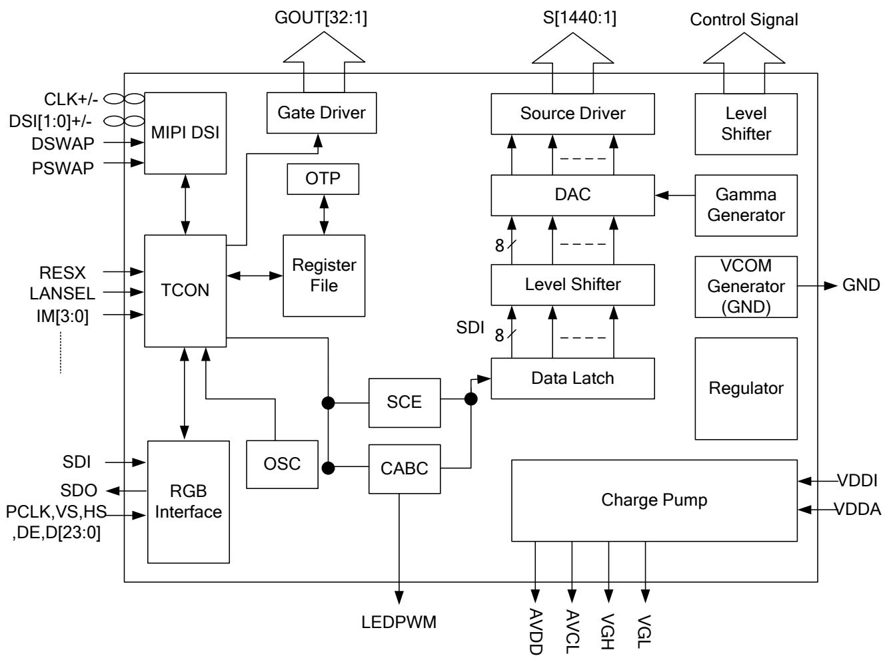

# 6 PIN DESCRIPTION

6.1 Power Supply Pins  

<table><tr><td>Name</td><td>I/O</td><td>Description</td><td>Connect Pin</td></tr><tr><td>VDDI</td><td>I</td><td>Power Supply for I/O System.</td><td>VDDI</td></tr><tr><td>VDDA</td><td>I</td><td>Power Supply for Analog, Digital System and Booster Circuit.</td><td>VDDA</td></tr><tr><td>VDDM</td><td>I</td><td>Power Supply for MIPI Circuit.</td><td>VDDA</td></tr><tr><td>VDDB</td><td>I</td><td>Power Supply for internal Circuit.</td><td>VDDA</td></tr><tr><td>VDDB2</td><td>I</td><td>Power Supply for internal Circuit.</td><td>VDDA</td></tr><tr><td>VDDR</td><td>I</td><td>Power Supply for internal Circuit.</td><td>VDDA</td></tr><tr><td>VDDR1</td><td>I</td><td>Power Supply for internal Circuit.</td><td>VDDA</td></tr><tr><td>VSSB</td><td>I</td><td>System Ground for internal Circuit.</td><td>AGND</td></tr><tr><td>VSSB2</td><td>I</td><td>System Ground for internal Circuit.</td><td>AGND</td></tr><tr><td>VSSR</td><td>I</td><td>System Ground for internal Circuit.</td><td>AGND</td></tr><tr><td>VSSA</td><td>I</td><td>System Ground for internal Circuit.</td><td>AGND</td></tr><tr><td>VSSM</td><td>I</td><td>System Ground for MIPI Circuit.</td><td>AGND</td></tr><tr><td>SGND</td><td>I</td><td>System Ground for internal Circuit.</td><td>AGND</td></tr><tr><td>AGND</td><td>I</td><td>System Ground for Analog System and Booster Circuit.</td><td>AGND</td></tr><tr><td>DGND</td><td>I</td><td>System Ground for I/O System and Digital System.</td><td>DGND</td></tr><tr><td>VPP</td><td>I</td><td>When programming NVM, can select internal power or external power supply voltage (7.5V); the current of lvpp must be more than 10mA. If select internal power then leaves the pin open when not in use.</td><td>External Power</td></tr></table>

6.2 Bus Interface Pins  

<table><tr><td>Name</td><td>I/O</td><td colspan="7">Description</td><td>Connect Pin</td></tr><tr><td colspan="10">Digital Control</td></tr><tr><td rowspan="11">IM3, IM2,IM1, IM0</td><td rowspan="11">I</td><td colspan="7">-The System interface mode select.</td><td rowspan="11">VDDI/DGND</td></tr><tr><td>IM3</td><td>IM2</td><td>IM1</td><td>IM0</td><td colspan="3">MPU Interface Mode</td></tr><tr><td>0</td><td>0</td><td>0</td><td>1</td><td colspan="3">RGB+8b SPI(fall)</td></tr><tr><td>0</td><td>0</td><td>1</td><td>0</td><td colspan="3">RGB+9b SPI(fall)</td></tr><tr><td>0</td><td>0</td><td>1</td><td>1</td><td colspan="3">RGB+16b SPI(rise)</td></tr><tr><td>0/1</td><td>1</td><td>0</td><td>1</td><td colspan="3">MIPI</td></tr><tr><td>0</td><td>1</td><td>1</td><td>0</td><td colspan="3">MIPI+16b SPI(rise)</td></tr><tr><td>1</td><td>0</td><td>0</td><td>1</td><td colspan="3">RGB+8b SPI(rise)</td></tr><tr><td>1</td><td>0</td><td>1</td><td>0</td><td colspan="3">RGB+9b SPI(rise)</td></tr><tr><td>1</td><td>0</td><td>1</td><td>1</td><td colspan="3">RGB+16b SPI(fall)</td></tr><tr><td>1</td><td>1</td><td>1</td><td>0</td><td colspan="3">MIPI+16b SPI(fall)</td></tr><tr><td>RESETSX</td><td>I</td><td colspan="7">- The external reset input- Initialized the chip with a low input. Be sure to execute a power-onreset after supplying power.</td><td>MPU</td></tr><tr><td>NBWSEL</td><td>I</td><td colspan="7">Input pin to select the gamma voltage level sequence of V0~V255.Low: V0 &gt; V1 &gt;...&gt; V254 &gt; V255, normally whiteHigh: V255 &gt; V254 &gt;...&gt; V1 &gt; V0, normally blackFix to VDDI level when not in use.</td><td>VDDI/DGND</td></tr><tr><td>GO [3:0]</td><td>O</td><td colspan="7">General purpose output pins. The output voltage swing is VDDI toDGND.Leave the pin open.</td><td>MPUVDDI/DGND</td></tr><tr><td colspan="10">SPI Interface</td></tr><tr><td>CSX</td><td>I</td><td colspan="7">-A chip select signalLow: the chip is selected and accessibleHigh: the chip is not selected and not accessibleFix to VDDI or DGND level when not in use.</td><td>MPU</td></tr><tr><td>DCX</td><td>I</td><td colspan="7">- The SPI interface (DCX): The signal for command orparameter select.Low: CommandHigh: ParameterFix to VDDI or DGND level when not in use.</td><td>MPU</td></tr><tr><td>Name</td><td>I/O</td><td colspan="7">Description</td><td>Connect Pin</td></tr><tr><td>SCL</td><td>I</td><td colspan="7">SCL: Serial clock input for SPI interface.Fix to VDDI or DGND level when not in use.</td><td>MPU</td></tr><tr><td>SDA</td><td>I</td><td colspan="7">SDA: Serial data input/output bidirectional pin for SPI Interface.Fix to DGND level when not in use.</td><td>MPU</td></tr><tr><td>SDO</td><td>O</td><td colspan="7">Serial data output pin used for the SPI Interface.Leave the pin open when not in use.</td><td>MPU</td></tr><tr><td>I2C_SA[0:1]</td><td>I</td><td colspan="7">Fix to VDDI or DGND level.</td><td>MPU</td></tr><tr><td colspan="10">RGB Interface</td></tr><tr><td>PCLK</td><td>I</td><td colspan="7">Dot clock signal for RGB interface operationFix to VDDI or DGND level when not in use.</td><td>MPU</td></tr><tr><td>VS</td><td>I</td><td colspan="7">Frame synchronizing signal for RGB interface operationFix to VDDI or DGND level when not in use.</td><td>MPU</td></tr><tr><td>HS</td><td>I</td><td colspan="7">Line synchronizing signal for RGB interface operationFix to VDDI or DGND level when not in use.</td><td>MPU</td></tr><tr><td>DE</td><td>I</td><td colspan="7">Data enable signal for RGB interface operationLow: access enabledHigh: access inhibitedFix to VDDI or DGND level when not in use.</td><td>MPU</td></tr><tr><td>DB [23:0]</td><td>I/O</td><td colspan="7">A 24-bit parallel data bus for RGB Interface.24-bit/pixel: D[23:16]=R,D[15:8]=G,D[7:0]=B18-bit/pixel: MDT=0:D[21:16]=R,D[13:8]=G,D[5:0]=BMDT=1:D[17:12]=R,D[11:6]=G,D[5:0]=B16-bit/pixel: D[20:16]=R,D[13:8]=G,[4:0]=BFix to VDDI or DGND level when not in use.</td><td>MPU</td></tr><tr><td colspan="10">CABC Control</td></tr><tr><td>LEDON</td><td>O</td><td colspan="7">Used for turning On/Off external LED backlight control.Leave the pin open when not in use.</td><td>CABC</td></tr><tr><td>LEDPWM</td><td>O</td><td colspan="7">The PWM frequency output for LCD driver control.Leave the pin open when not in use.</td><td>CABC</td></tr><tr><td colspan="10">MIPI Interface</td></tr><tr><td>CPCN</td><td>I</td><td colspan="7">MIPI DSI differential clock pair.That the COG resistance is less than 10 ohm.If MIPI are not in use, they should be connected to VSSM.</td><td>MIPI</td></tr><tr><td>DP0DN0DP1</td><td>I/O</td><td colspan="7">MIPI DSI differential data pair.That the COG resistance is less than 10 ohm.If MIPI are not in use, they should be connected to VSSM</td><td>MIPI</td></tr><tr><td>Name</td><td>I/O</td><td colspan="7">Description</td><td>Connect Pin</td></tr><tr><td>DN1</td><td></td><td colspan="7"></td><td></td></tr><tr><td>ERR</td><td>O</td><td colspan="7">CRC and ECC error output pin for the MIPI interface, activated by S/W command. This pin is output low when it is not activated. When this pin is activated, it is output high if CRC/ECC error is found. Leave the pin open when not in use.</td><td>MIPI</td></tr><tr><td>LANSEL</td><td>I</td><td colspan="7">Input pin to select 1 data lane or 2 data lanes in MIPI/MDDI interface. Low: 1 data lane High: 2 data lanes Fix to VSSI level when not in use.</td><td>MIPI</td></tr><tr><td rowspan="7">DSWAP PSWAP</td><td rowspan="7">I</td><td colspan="7">Differential clock polarity swap For MIPI interface</td><td rowspan="2">VDDI/DGND</td></tr><tr><td rowspan="2">DSWAP</td><td rowspan="2">PSWAP</td><td colspan="5">Pins</td></tr><tr><td>CLK_P</td><td>CLK_N</td><td>D0_P</td><td>D0_N</td><td>D1_P</td><td>D1_N</td></tr><tr><td rowspan="2">0</td><td>0</td><td>CLK_P</td><td>CLK_N</td><td>D0_P</td><td>D0_N</td><td>D1_P</td><td>D1_N</td></tr><tr><td>1</td><td>CLK_N</td><td>CLK_P</td><td>D0_N</td><td>D0_P</td><td>D1_N</td><td>D1_P</td></tr><tr><td rowspan="2">1</td><td>0</td><td>CLK_P</td><td>CLK_N</td><td>D1_P</td><td>D1_N</td><td>D0_P</td><td>D0_N</td></tr><tr><td>1</td><td>CLK_N</td><td>CLK_P</td><td>D1_N</td><td>D1_P</td><td>D0_N</td><td>D0_P</td></tr></table>

Note1. "I" = VDDI level, "0" = DGND level.  
Note2. When in parallel mode, unused data pins must be connected to "1" or "0".  
Note3. When  $CSX = "1"$ , there is no influence to the parallel and serial interface.

6.3 Driver Output Pins  

<table><tr><td>Name</td><td>I/O</td><td>Description</td><td>Connect pin</td></tr><tr><td>S [1:1440]</td><td>O</td><td>Source output voltage signals applied to a LCD panel</td><td>LCD</td></tr><tr><td>GOUT [1:32]</td><td>O</td><td>Gate control signals and the swing voltage level is VGHO to VGLO</td><td>LCD</td></tr><tr><td>SDUM [0:3]</td><td>O</td><td>Dummy Source
Leave the pin open when not in use.</td><td>LCD</td></tr><tr><td>VCOM</td><td>O</td><td>Regulator output for common voltage of panel.
Fix to AGND level.</td><td>LCD</td></tr><tr><td>VGL</td><td>O</td><td>Connect to VGL or OPEN.</td><td>LCD</td></tr><tr><td>VGHS</td><td>O</td><td>Connect to VGH.</td><td>LCD</td></tr></table>

6.4 Test and other pins  

<table><tr><td>VCC</td><td>O</td><td>Used for monitoring.</td><td>OPEN</td></tr><tr><td>VCCMA</td><td>O</td><td>Used for monitoring.</td><td>OPEN</td></tr><tr><td>V20</td><td>O</td><td>Used for monitoring.</td><td>OPEN</td></tr><tr><td>VPS1/VPS2</td><td>O</td><td>Used for monitoring.</td><td>OPEN</td></tr><tr><td>VCCMD</td><td>O</td><td>Used for monitoring.</td><td>OPEN</td></tr><tr><td>V12TX</td><td>O</td><td>Used for monitoring.</td><td>OPEN</td></tr><tr><td>AVDD</td><td>O</td><td>Power Pad for analog Circuit.</td><td>OPEN</td></tr><tr><td>AVCL</td><td>O</td><td>Power Pad for analog Circuit.</td><td>OPEN</td></tr><tr><td>VAN</td><td>O</td><td>A power output of grayscale voltage.</td><td>OPEN</td></tr><tr><td>VAP</td><td>O</td><td>A power output (negative) of gray scale voltage.</td><td>OPEN</td></tr><tr><td>RDX</td><td>I</td><td>Input pin for testing.
Fix to VDDI or DGND level.</td><td>VDDI/DGND</td></tr><tr><td>DSTB_SEL</td><td>I</td><td>input pin for testing.
Fix to DGND level.</td><td>DGND</td></tr><tr><td>EXB1T</td><td>I</td><td>This pin is for test..
Fix to DGND level when not in use.</td><td>DGND</td></tr><tr><td>VGSW [0:3]</td><td>I</td><td>Input pins for testing.
Fix to DGND level when not in use.</td><td>VDDI/DGND</td></tr><tr><td>TESTO [0:3]</td><td>O</td><td>Output pins for testing.
Please keep these pins floating.</td><td>OPEN</td></tr><tr><td>TE_L</td><td>O</td><td>For IC Test.
Leave the pin open when not in use.</td><td>OPEN</td></tr><tr><td>VGHP</td><td>O</td><td>Power Pad for analog Circuit.</td><td>OPEN</td></tr><tr><td>VGHEQ2</td><td>O</td><td>Output pins for testing.</td><td>OPEN</td></tr><tr><td></td><td></td><td>Please keep this pin floating.</td><td></td></tr><tr><td>VSSIDUM0~3</td><td>I</td><td>GND Dummy pads. Connect to AGND.</td><td>AGND</td></tr><tr><td>PADA1</td><td rowspan="5">I/O</td><td>These test pins for chip attachment detection.</td><td rowspan="5">OPEN</td></tr><tr><td>PADB1</td><td colspan="1">PADA1 to PADA2 are output pins and PADB1 to PADB2 are input pins.</td></tr><tr><td>PADA2</td><td colspan="1">-For normal operation:</td></tr><tr><td rowspan="2">PADB2</td><td colspan="1">Connect PADA1 and PADB1 together by ITO trace.</td></tr><tr><td colspan="1">Connect PADA2 and PADB2 together by ITO trace.</td></tr><tr><td>CNTACT1</td><td rowspan="2">I/O</td><td rowspan="2">Test pin, for test bonding quality.</td><td rowspan="2">OPEN</td></tr><tr><td colspan="1">CNTACT2</td></tr><tr><td rowspan="3">DUMMY</td><td rowspan="3">-</td><td>These pins are dummy (no electrical characteristic)</td><td rowspan="3">OPEN</td></tr><tr><td colspan="1">Can pass signal through these pads on TFT panel.</td></tr><tr><td colspan="1">Please open these pins.</td></tr></table>

# 7 DRIVER ELECTRICAL CHARACTERISTICS

7.1 Absolute Operation Range  

<table><tr><td>Item</td><td>Symbol</td><td>Rating</td><td>Unit</td></tr><tr><td>Supply Voltage</td><td>VDD</td><td>-0.3 ~ +4.6</td><td>V</td></tr><tr><td>Supply Voltage (Logic)</td><td>VDDI</td><td>-0.3 ~ +4.6</td><td>V</td></tr><tr><td>Driver Supply Voltage</td><td>VGH-VGL</td><td>-0.3 ~ +30.0</td><td>V</td></tr><tr><td>Logic Input Voltage Range</td><td>VIN</td><td>-0.3 ~ VDDI + 0.3</td><td>V</td></tr><tr><td>Logic Output Voltage Range</td><td>VO</td><td>-0.3 ~ VDDI + 0.3</td><td>V</td></tr><tr><td>Operating Temperature Range</td><td>TOPR</td><td>-30 ~ +85</td><td>°C</td></tr><tr><td>Storage Temperature Range</td><td>TSTG</td><td>-40 ~ +125</td><td>°C</td></tr></table>

Table 1 Absolute Operation Range

Note: If one of the above items is exceeded its maximum limitation momentarily, the quality of the product may be degraded. Absolute maximum limitation, therefore, specify the values exceeding which the product may be physically damaged. Be sure to use the product within the recommend range.

7.2 DC Characteristics  

<table><tr><td rowspan="2">Parameter</td><td rowspan="2">Symbol</td><td rowspan="2">Condition</td><td colspan="3">Specification</td><td rowspan="2">Unit</td><td rowspan="2">Related Pins</td></tr><tr><td>MIN.</td><td>TYP.</td><td>MAX.</td></tr><tr><td colspan="8">Power &amp; Operation Voltage</td></tr><tr><td>System Voltage</td><td>VDD</td><td>Operating voltage</td><td>2.5</td><td>2.8</td><td>3.6</td><td>V</td><td></td></tr><tr><td>Interface Operation Voltage</td><td>VDDI</td><td>I/O Supply Voltage</td><td>1.65</td><td>1.8</td><td>3.3</td><td>V</td><td></td></tr><tr><td>Gate Driver High Voltage</td><td>VGH</td><td></td><td>11.5</td><td></td><td>17</td><td>V</td><td></td></tr><tr><td>Gate Driver Low Voltage</td><td>VGL</td><td></td><td>-7.6</td><td></td><td>-12</td><td>V</td><td></td></tr><tr><td>Gate Driver Supply Voltage</td><td></td><td>| VGH-VGL |</td><td>-</td><td></td><td>30</td><td>V</td><td></td></tr><tr><td colspan="8">Input / Output</td></tr><tr><td>Logic-High Input Voltage</td><td>VIH</td><td></td><td>0.7VDDI</td><td></td><td>VDDI</td><td>V</td><td>Note 1</td></tr><tr><td>Logic-Low Input Voltage</td><td>VIL</td><td></td><td>VSS</td><td></td><td>0.3VDDI</td><td>V</td><td>Note 1</td></tr><tr><td>Logic-High Output Voltage</td><td>VOH</td><td>IOH = -1.0mA</td><td>0.8VDDI</td><td></td><td>VDDI</td><td>V</td><td>Note 1</td></tr><tr><td>Differential Input High Threshold Voltage</td><td>VIT+</td><td></td><td></td><td>0</td><td>50</td><td>mV</td><td rowspan="3">MIPI_CLKMIPI_Data</td></tr><tr><td>Differential Input Low Threshold Voltage</td><td>VIT-</td><td></td><td>-50</td><td>0</td><td></td><td>mV</td></tr><tr><td>Single-ended Receiver Input Operation Voltage Range</td><td>VIR</td><td></td><td>0.5</td><td></td><td>1.2</td><td>V</td></tr><tr><td>Logic-Low Output Voltage</td><td>VOL</td><td>IOL = +1.0mA</td><td>VSS</td><td></td><td>0.2VDDI</td><td>V</td><td>Note 1</td></tr><tr><td>Logic-High Input Current</td><td>IIH</td><td>VIN = VDDI</td><td></td><td></td><td>1</td><td>uA</td><td>Note 1</td></tr><tr><td>Logic-Low Input Current</td><td>IIL</td><td>VIN = VSS</td><td>-1</td><td></td><td></td><td>uA</td><td>Note 1</td></tr><tr><td>Input Leakage Current</td><td>IIL</td><td>IOH = -1.0mA</td><td>-0.1</td><td></td><td>0.1</td><td>uA</td><td>Note 1</td></tr><tr><td colspan="8">VCOM Voltage</td></tr><tr><td>VCOM amplitude</td><td>VCOM</td><td></td><td></td><td>VSS</td><td></td><td>V</td><td></td></tr><tr><td colspan="8">Source Driver</td></tr><tr><td>Gamma Reference Voltage(Positive)</td><td>VAP</td><td></td><td>4.4</td><td></td><td>6.4</td><td>V</td><td></td></tr><tr><td>Gamma Reference Voltage(Negative)</td><td>VAN</td><td></td><td>-2.6</td><td></td><td>-4.6</td><td>V</td><td></td></tr><tr><td>Source Output Settling Time</td><td>Tr</td><td>Below with 99% precision</td><td></td><td></td><td>10</td><td>us</td><td>Note 2</td></tr></table>

Table 2 Basic DC Characteristics

Notes:

1. Typical:  $VDDI = 1.8V$ ,  $VDD = 2.8V$ ;  $Ta = 25^{\circ}C$

2. The Max. value is between measured point of source output and gamma setting value.  
3. When evaluating the maximum and minimum of VGH,  $VDD = 2.8V$ .  
4. The maximum value of  $\left| {VGH} - {VGL}\right|$  can no over  ${30V}$  .

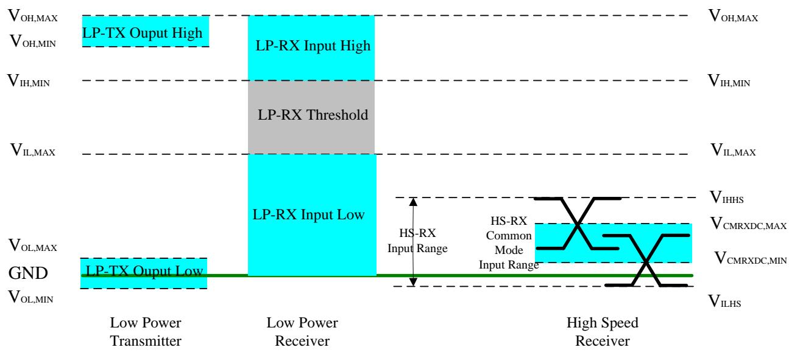  
7.3 DC Characteristics

$VDDI = 1.8,VDD = 2.8,AGND = DGND = 0V,Ta = 25^{\circ}C$  

<table><tr><td rowspan="2">Parameter</td><td rowspan="2">Symbol</td><td colspan="3">Specification</td><td rowspan="2">Unit</td></tr><tr><td>MIN</td><td>TYP</td><td>MAX</td></tr><tr><td colspan="6">Operation Voltage for MIPI Receiver</td></tr><tr><td>Low power mode operating voltage</td><td>VLPH</td><td>1.1</td><td>1.2</td><td>1.3</td><td>V</td></tr><tr><td colspan="6">MIPI Characteristics for High Speed Receiver</td></tr><tr><td>Single-ended input low voltage</td><td>VILHS</td><td>-40</td><td>-</td><td>-</td><td>mV</td></tr><tr><td>Single-ended input high voltage</td><td>VIHHS</td><td>-</td><td>-</td><td>460</td><td>mV</td></tr><tr><td>Common-mode voltage</td><td>VCMRXDC</td><td>70</td><td>-</td><td>330</td><td>mV</td></tr><tr><td>Differential input impedance</td><td>ZID</td><td>80</td><td>100</td><td>125</td><td>ohm</td></tr><tr><td colspan="6">MIPI Characteristics for Low Power Mode</td></tr><tr><td>Pad signal voltage range</td><td>VI</td><td>-50</td><td>-</td><td>1350</td><td>mV</td></tr><tr><td>Logic 0 input threshold</td><td>VIL</td><td>0-</td><td>-</td><td>550</td><td>mV</td></tr><tr><td>Logic 1 input threshold</td><td>VIH</td><td>880</td><td>-</td><td>1350</td><td>mV</td></tr><tr><td>Output low level</td><td>VOL</td><td>-50</td><td>-</td><td>50</td><td>mV</td></tr><tr><td>Output high level</td><td>VOH</td><td>1.1</td><td>1.2</td><td>1.3</td><td>V</td></tr></table>

# 7.4 Power Consumption

RGB Interface

Ta=25°C, Frame rate = 60Hz, Registers setting are IC default setting.  

<table><tr><td rowspan="3">Operation Mode</td><td rowspan="3">Image</td><td colspan="4">Current Consumption</td></tr><tr><td colspan="2">Typical</td><td colspan="2">Maximum</td></tr><tr><td>IDDI(uA)</td><td>IDD(uA)</td><td>IDDI(uA)</td><td>IDD(uA)</td></tr><tr><td>Sleep-in mode</td><td>--</td><td>5</td><td>45</td><td>10</td><td>60</td></tr></table>

MIPI Interface

Ta=25°C, Frame rate = 60Hz, Registers setting are IC default setting.  

<table><tr><td rowspan="3">Operation Mode</td><td rowspan="3">Image</td><td colspan="4">Current Consumption</td></tr><tr><td colspan="2">Typical</td><td colspan="2">Maximum</td></tr><tr><td>IDDI(uA)</td><td>IDD(uA)</td><td>IDDI(uA)</td><td>IDD(uA)</td></tr><tr><td>Sleep-in mode</td><td>--</td><td>5</td><td>70</td><td>10</td><td>150</td></tr></table>

Table 3 Power Consumption

Notes:

1. The Current Consumption is DC characteristics of ST7701S.  
2. Typical:  $VDDI = 1.8V$ ,  $VDD = 2.8V$

# 7.5 AC Characteristics

# 7.5.1 Serial Interface Characteristics (3-line serial):

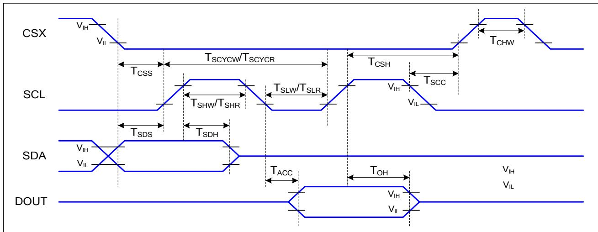  
Figure 1 3-line serial Interface Timing Characteristics

VDDI=1.8,VDD=2.8,AGND=DGND=0V,Ta=25°C

<table><tr><td>Signal</td><td>Symbol</td><td>Parameter</td><td>Min</td><td>Max</td><td>Unit</td><td>Description</td></tr><tr><td rowspan="5">CSX</td><td>T CSS</td><td>Chip select setup time (write)</td><td>15</td><td></td><td>ns</td><td rowspan="5"></td></tr><tr><td>T CSH</td><td>Chip select hold time (write)</td><td>15</td><td></td><td>ns</td></tr><tr><td>T CSS</td><td>Chip select setup time (read)</td><td>60</td><td></td><td>ns</td></tr><tr><td>T SCC</td><td>Chip select hold time (read)</td><td>60</td><td></td><td>ns</td></tr><tr><td>T CHW</td><td>Chip select “H” pulse width</td><td>40</td><td></td><td>ns</td></tr><tr><td rowspan="6">SCL</td><td>T SCYCW</td><td>Serial clock cycle (Write)</td><td>66</td><td></td><td>ns</td><td rowspan="6"></td></tr><tr><td>T SHW</td><td>SCL “H” pulse width (Write)</td><td>15</td><td></td><td>ns</td></tr><tr><td>T SLW</td><td>SCL “L” pulse width (Write)</td><td>15</td><td></td><td>ns</td></tr><tr><td>T SCYCR</td><td>Serial clock cycle (Read)</td><td>150</td><td></td><td>ns</td></tr><tr><td>T SHR</td><td>SCL “H” pulse width (Read)</td><td>60</td><td></td><td>ns</td></tr><tr><td>T SLR</td><td>SCL “L” pulse width (Read)</td><td>60</td><td></td><td>ns</td></tr><tr><td rowspan="2">SDA (DIN)</td><td>T SDS</td><td>Data setup time</td><td>10</td><td></td><td>ns</td><td rowspan="2"></td></tr><tr><td>T SDH</td><td>Data hold time</td><td>10</td><td></td><td>ns</td></tr></table>

Note : The rising time and falling time (Tr, Tf) of input signal are specified at 15 ns or less. Logic high and low levels are specified as  ${30}\%$  and  ${70}\%$  of VDDI for Input signals.

Table 4 3-line serial Interface Characteristics

# 7.5.2 Serial Interface Characteristics (4-line serial):

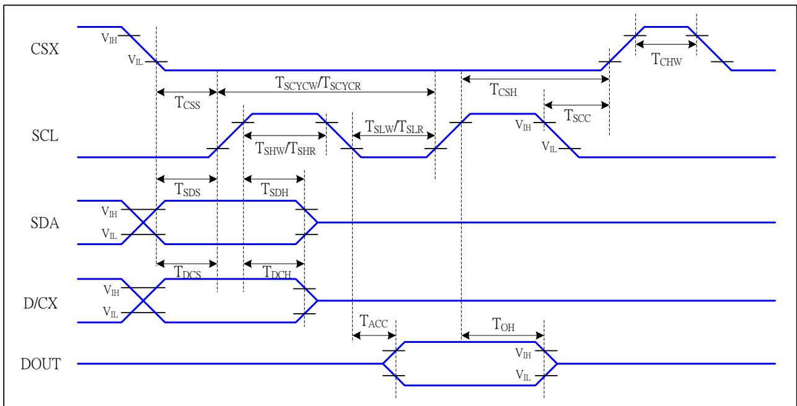  
Figure 2 4-line serial Interface Timing Characteristics

VDDI=1.8, VDD=2.8, AGND=DGND=0V, Ta=25 °C

<table><tr><td>Signal</td><td>Symbol</td><td>Parameter</td><td>MIN</td><td>MAX</td><td>Unit</td><td>Description</td></tr><tr><td rowspan="5">CSX</td><td>T CSS</td><td>Chip select setup time (write)</td><td>15</td><td></td><td>ns</td><td rowspan="5"></td></tr><tr><td>T CSH</td><td>Chip select hold time (write)</td><td>15</td><td></td><td>ns</td></tr><tr><td>T CSS</td><td>Chip select setup time (read)</td><td>60</td><td></td><td>ns</td></tr><tr><td>T SCC</td><td>Chip select hold time (read)</td><td>65</td><td></td><td>ns</td></tr><tr><td>T CHW</td><td>Chip select “H” pulse width</td><td>40</td><td></td><td>ns</td></tr><tr><td rowspan="6">SCL</td><td>T SCYCW</td><td>Serial clock cycle (Write)</td><td>66</td><td></td><td>ns</td><td rowspan="3">-write command &amp; data ram</td></tr><tr><td>T SHW</td><td>SCL “H” pulse width (Write)</td><td>15</td><td></td><td>ns</td></tr><tr><td>T SLW</td><td>SCL “L” pulse width (Write)</td><td>15</td><td></td><td>ns</td></tr><tr><td>T SCYCR</td><td>Serial clock cycle (Read)</td><td>150</td><td></td><td>ns</td><td rowspan="3">-read command &amp; data ram</td></tr><tr><td>T SHR</td><td>SCL “H” pulse width (Read)</td><td>60</td><td></td><td>ns</td></tr><tr><td>T SLR</td><td>SCL “L” pulse width (Read)</td><td>60</td><td></td><td>ns</td></tr><tr><td rowspan="2">D/CX</td><td>T DCS</td><td>D/CX setup time</td><td>10</td><td></td><td>ns</td><td rowspan="2"></td></tr><tr><td>T DCH</td><td>D/CX hold time</td><td>10</td><td></td><td>ns</td></tr><tr><td rowspan="2">SDA (DIN)</td><td>T SDS</td><td>Data setup time</td><td>10</td><td></td><td>ns</td><td rowspan="2"></td></tr><tr><td>T SDH</td><td>Data hold time</td><td>10</td><td></td><td>ns</td></tr></table>

Note : The rising time and falling time (Tr, Tf) of input signal are specified at 15 ns or less. Logic high and low levels are specified as  ${30}\%$  and  ${70}\%$  of VDDI for Input signals.

Table 5 4-line serial Interface Characteristics

# 7.5.3 RGB Interface Characteristics :

  
Figure 3 RGB Interface Timing Characteristics

VDDI=1.8,VDD=2.8,AGND=DGND=0V,Ta=25 °C  

<table><tr><td>Signal</td><td>Symbol</td><td>Parameter</td><td>MIN</td><td>MAX</td><td>Unit</td><td>Description</td></tr><tr><td>HSYNC, VSYNC</td><td>TSYNCS</td><td>VSYNC, HSYNC Setup Time</td><td>5</td><td>-</td><td>ns</td><td></td></tr><tr><td rowspan="2">ENABLE</td><td>TENS</td><td>Enable Setup Time</td><td>5</td><td>-</td><td>ns</td><td rowspan="2"></td></tr><tr><td>TENH</td><td>Enable Hold Time</td><td>5</td><td>-</td><td>ns</td></tr><tr><td rowspan="4">DOTCLK</td><td>PWDH</td><td>DOTCLK High-level Pulse Width</td><td>15</td><td>-</td><td>ns</td><td rowspan="4"></td></tr><tr><td>PWDL</td><td>DOTCLK Low-level Pulse Width</td><td>15</td><td>-</td><td>ns</td></tr><tr><td>TCYCD</td><td>DOTCLK Cycle Time</td><td>33</td><td>-</td><td>ns</td></tr><tr><td>Trghr, Trghf</td><td>DOTCLK Rise/Fall time</td><td>-</td><td>15</td><td>ns</td></tr><tr><td rowspan="2">DB</td><td>TPDS</td><td>PD Data Setup Time</td><td>5</td><td>-</td><td>ns</td><td rowspan="2"></td></tr><tr><td>TPDH</td><td>PD Data Hold Time</td><td>5</td><td>-</td><td>ns</td></tr></table>

Table 6 18/16 Bits RGB Interface Timing Characteristics

# 7.5.4 MIPI Interface Characteristics:

# 7.5.4.1 High Speed Mode

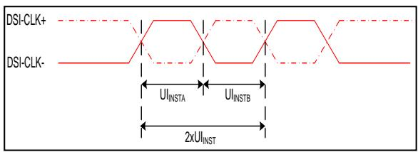  
Figure 4 DSI clock channel timing

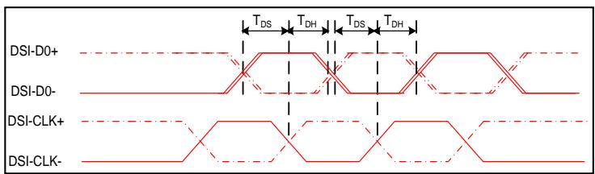

Figure 5 Rising and falling time on clock and data channel  
$VDDI = 1.8, VDD = 2.8, AGND = DGND = 0V, Ta = 25^{\circ}C$  

<table><tr><td>Signal</td><td>Symbol</td><td>Parameter</td><td>MIN</td><td>MAX</td><td>Unit</td><td>Description</td></tr><tr><td>DSI-CLK+/-</td><td>2xUIINSTA</td><td>Double UI instantaneous</td><td>4</td><td>25</td><td>ns</td><td></td></tr><tr><td rowspan="2">DSI-CLK+/-</td><td>UIINSTA</td><td rowspan="2">UI instantaneous halves</td><td rowspan="2">2</td><td rowspan="2">12.5</td><td rowspan="2">ns</td><td>UI = UIINSTA=</td></tr><tr><td>UIINSTB</td><td>UIINSTB</td></tr><tr><td>DSI-Dn+/-</td><td>tDS</td><td>Data to clock setup time</td><td>0.15</td><td>-</td><td>UI</td><td></td></tr><tr><td>DSI-Dn+/-</td><td>tDH</td><td>Data to clock hold time</td><td>0.15</td><td>-</td><td>UI</td><td></td></tr></table>

Table 7 Mipi Interface- High Speed Mode Timing Characteristics

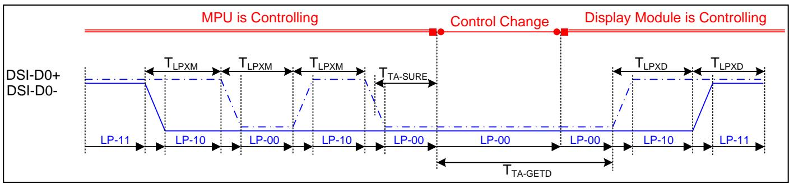  
7.5.4.2 Lowe Power Mode  
Figure 6 Bus Turnaround (BTA) from display module to MPU Timing

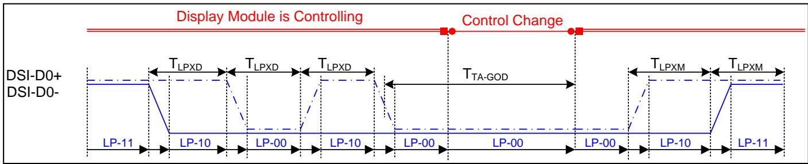  
Figure 7 Bus Turnaround (BTA) from MPU to display module Timing

$VDDI = 1.8,VDD = 2.8,AGND = DGND = 0V,Ta = 25^{\circ}C$  

<table><tr><td>Signal</td><td>Symbol</td><td>Parameter</td><td>MIN</td><td>MAX</td><td>Unit</td><td>Description</td></tr><tr><td>DSI-D0+/-</td><td>TLPXM</td><td>Length of LP-00,LP-01, LP-10 or LP-11 periods MPU→Display Module</td><td>50</td><td>75</td><td>ns</td><td>Input</td></tr><tr><td>DSI-D0+/-</td><td>TLPXD</td><td>Length of LP-00,LP-01, LP-10 or LP-11 periods MPU→Display Module</td><td>50</td><td>75</td><td>ns</td><td>Output</td></tr><tr><td>DSI-D0+/-</td><td>TTA-SURED</td><td>Time-out before the MPU start driving</td><td>TLPXD</td><td>2xTLP xd</td><td>ns</td><td>Output</td></tr><tr><td>DSI-D0+/-</td><td>TTA-GETD</td><td>Time to drive LP-00 by display module</td><td colspan="2">5xTLPXD</td><td>ns</td><td>Input</td></tr><tr><td>DSI-D0+/-</td><td>TTA-GOD</td><td>Time to drive LP-00 after turnaround request-MPU</td><td colspan="2">4xTLPXD</td><td>ns</td><td>Output</td></tr></table>

Table 8 Mipi Interface Low Power Mode Timing Characteristics

# 7.5.4.3 DSI Bursts Mode

  
Figure 7 Data Ianes-Low Power Mode to/from High Speed Mode Timing

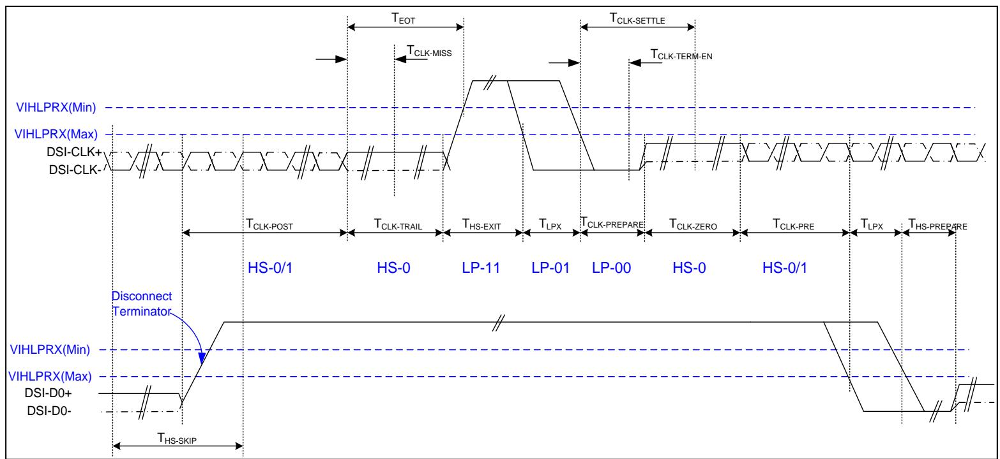  
Figure 8 Clock lanes- High Speed Mode to/from Low Power Mode Timing

$VDDI = 1.8, VDD = 2.8, AGND = DGND = 0V, Ta = 25^{\circ}C$  

<table><tr><td>Signal</td><td>Symbol</td><td>Parameter</td><td>MIN</td><td>MAX</td><td>Unit</td><td>Description</td></tr><tr><td colspan="7">Low Power Mode to High Speed Mode Timing</td></tr><tr><td>DSI-Dn+/-</td><td>TLPX</td><td>Length of any low power state period</td><td>50</td><td>-</td><td>ns</td><td>Input</td></tr><tr><td>DSI-Dn+/-</td><td>THS-PREPARE</td><td>Time to drive LP-00 to prepare for HS transmission</td><td>40+4 UI</td><td>85+6 UI</td><td>ns</td><td>Input</td></tr><tr><td>DSI-Dn+/-</td><td>THS-TERM-EN</td><td>Time to enable data receiver line termination measured from when Dn crosses VILMAX</td><td>-</td><td>35+4 UI</td><td>ns</td><td>Input</td></tr><tr><td>DSI-Dn+/-</td><td>THS-PREPARE + THS-ZERO</td><td>THS-PREPARE + time to drive HS-0 before the sync sequence</td><td>140+ 10UI</td><td>-</td><td>ns</td><td>Input</td></tr><tr><td colspan="7">High Speed Mode to Low Power Mode Timing</td></tr><tr><td>DSI-Dn+/-</td><td>THS-SKIP</td><td>Time-out at display module to ignore transition period of EoT</td><td>40</td><td>55+4 UI</td><td>ns</td><td>Input</td></tr><tr><td>DSI-Dn+/-</td><td>THS-EXIT</td><td>Time to drive LP-11 after HS burst</td><td>100</td><td>-</td><td>ns</td><td>Input</td></tr><tr><td>DSI-Dn+/-</td><td>THS-TRAIL</td><td>Time to drive flipped differential state after last payload data bit of a HS transmission burst</td><td>60+4 UI</td><td>-</td><td>ns</td><td>Input</td></tr><tr><td colspan="7">High Speed Mode to/from Low Power Mode Timing</td></tr><tr><td>DSI-CLK+/-</td><td>TCLK-POS</td><td>Time that the MPU shall continue sending HS clock after the last associated data lane has transition to LP mode</td><td>60+5 2UI</td><td>-</td><td>ns</td><td>Input</td></tr><tr><td>DSI-CLK+/-</td><td>TCLK-TRAIL</td><td>Time to drive HS differential state after last payload clock bit of a HS transmission burst</td><td>60</td><td>-</td><td>ns</td><td>Input</td></tr><tr><td>DSI-CLK+/-</td><td>THS-EXIT</td><td>Time to drive LP-11 after HS burst</td><td>100</td><td>-</td><td>ns</td><td>Input</td></tr><tr><td>DSI-CLK+/-</td><td>TCLK-PREPARE</td><td>Time to drive LP-00 to prepare for HS transmission</td><td>38</td><td>95</td><td>ns</td><td>Input</td></tr><tr><td>DSI-CLK+/-</td><td>TCLK-TERM-EN</td><td>Time-out at clock lan display module to enable HS transmission</td><td>--</td><td>38</td><td>ns</td><td>Input</td></tr><tr><td>DSI-CLK+/-</td><td>TCLK-PREPARE + TCLK-ZERO</td><td>Minimum lead HS-0 drive period before starting clock</td><td>300</td><td>-</td><td>ns</td><td>Input</td></tr><tr><td>DSI-CLK+/-</td><td>TCLK-PRE</td><td>Time that the HS clock shall be driven prior to any associated data lane beginning the transition from LP to HS mode</td><td>8UI</td><td>-</td><td>ns</td><td>Input</td></tr><tr><td>DSI-CLK+/-</td><td>TEOT</td><td>Time form start of TCLK-TRAIL period to start of LP-11 state</td><td>-</td><td>105n s+12 UI</td><td>ns</td><td>Input</td></tr></table>

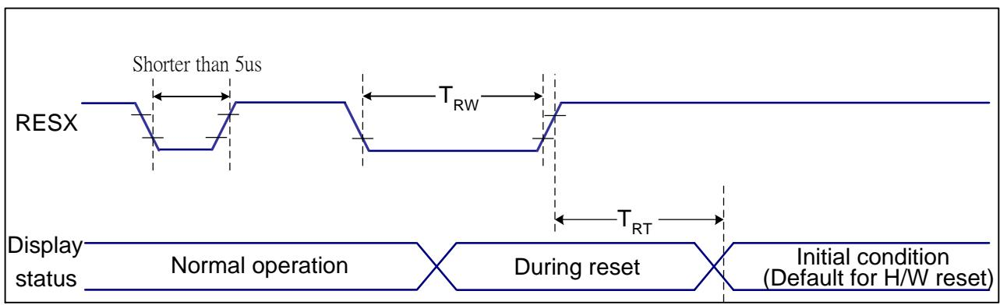  
7.5.5 Reset Timing:  
Figure 9 Reset Timing

VDDI=1.8,VDD=2.8,AGND=DGND=0V,Ta=25°C  

<table><tr><td>Related Pins</td><td>Symbol</td><td>Parameter</td><td>MIN</td><td>MAX</td><td>Unit</td></tr><tr><td rowspan="3">RESX</td><td>TRW</td><td>Reset pulse duration</td><td>10</td><td>-</td><td>us</td></tr><tr><td rowspan="2">TRT</td><td rowspan="2">Reset cancel</td><td>-</td><td>5 (Note 1, 5)</td><td>ms</td></tr><tr><td></td><td>120 (Note 1, 6, 7)</td><td>ms</td></tr></table>

Notes:

1. The reset cancel includes also required time for loading ID bytes, VCOM setting and other settings from NVM (or similar device) to registers. This loading is done every time when there is HW reset cancel time (tRT) within 5 ms after a rising edge of RESX.  
2. Spike due to an electrostatic discharge on RESX line does not cause irregular system reset according to the table below:

Table 9 Reset Timing  

<table><tr><td>RESX Pulse</td><td>Action</td></tr><tr><td>Shorter than 5us</td><td>Reset Rejected</td></tr><tr><td>Longer than 9us</td><td>Reset</td></tr><tr><td>Between 5us and 9us</td><td>Reset starts</td></tr></table>

3. During the Resetting period, the display will be blanked (The display is entering blanking sequence, which maximum time is 120 ms, when Reset Starts in Sleep Out -mode. The display remains the blank state in Sleep In -mode.) and then return to Default condition for Hardware Reset.  
4. Spike Rejection also applies during a valid reset pulse as shown below:

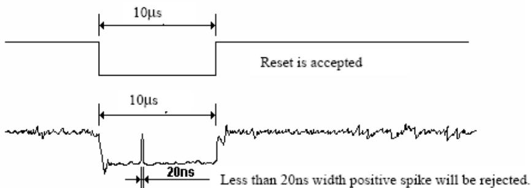

5. When Reset applied during Sleep In Mode.  
6. When Reset applied during Sleep Out Mode.  
7. It is necessary to wait 5msec after releasing RESX before sending commands. Also Sleep Out command cannot be sent for 120msec.

# 8 FUNCTION DESCRIPTION

# 8.1 System Interface

ST7701S supports RGB serial interfaces, and MIPI serial interfaces. Selection of these interfaces are set by IM[3:0] pins as shown below.

<table><tr><td>IM3</td><td>IM2</td><td>IM1</td><td>IM0</td><td>Interface</td><td>Data pins</td></tr><tr><td rowspan="5">0</td><td>0</td><td>0</td><td>1</td><td>RGB+8b_SPI(fall)</td><td>D[0~23]</td></tr><tr><td>0</td><td>1</td><td>0</td><td>RGB+9b_SPI(fall)</td><td>D[0~23]</td></tr><tr><td>0</td><td>1</td><td>1</td><td>RGB+16b_SPI(rise)</td><td>D[0~23]</td></tr><tr><td>1</td><td>0</td><td>1</td><td>MIPI</td><td>HSSI_D1_P/N,HSSI_D0_P/N</td></tr><tr><td>1</td><td>1</td><td>0</td><td>MIPI+16b_SPI(rise)</td><td>HSSI_D1_P/N,HSSI_D0_P/N</td></tr><tr><td rowspan="5">1</td><td>0</td><td>0</td><td>1</td><td>RGB+8b_SPI(rise)</td><td>D[0~23]</td></tr><tr><td>0</td><td>1</td><td>0</td><td>RGB+9b_SPI(rise)</td><td>D[0~23]</td></tr><tr><td>0</td><td>1</td><td>1</td><td>RGB+16b_SPI(fall)</td><td>D[0~23]</td></tr><tr><td>1</td><td>0</td><td>1</td><td>MIPI</td><td>HSSI_D1_P/N,HSSI_D0_P/N</td></tr><tr><td>1</td><td>1</td><td>0</td><td>MIPI+16b_SPI(fall)</td><td>HSSI_D1_P/N,HSSI_D0_P/N</td></tr></table>

Table 10 Interface Type Selection

# 8.2 Serial Interface

The serial interface is either 3-lines/9-bits,16-bits or 4-lines/8-bits bi-directional interface for communication between the micro controller and the LCD driver. The 3-lines serial interface use: CSX (chip enable), SCL (serial clock) and SDA (serial data input/output), and the 4-lines serial interface use: CSX (chip enable), D/CX (data/ command flag), SCL (serial clock) and SDA (serial data input/output). Serial clock (SCL) is used for interface with MCU only, so it can be stopped when no communication is necessary.

Pin description

3-line serial interface (9 bits)  

<table><tr><td>Pin Name</td><td>Description</td></tr><tr><td>CSX</td><td>Chip selection signal</td></tr><tr><td>SCL</td><td>Serial input CLK</td></tr><tr><td>SDA</td><td>Serial input data</td></tr><tr><td>SDO</td><td>Serial output data</td></tr></table>

4-line serial interface (8 bits)  

<table><tr><td>Pin Name</td><td>Description</td></tr><tr><td>CSX</td><td>Chip selection signal</td></tr><tr><td>DCX</td><td>Data is regarded as a command when SCL is low
Data is regarded as a parameter or data when SCL is high</td></tr><tr><td>SCL</td><td>Clock signal</td></tr><tr><td>SDA</td><td>Serial input data</td></tr><tr><td>SDO</td><td>Serial output data</td></tr></table>

# 8.2.1 Serial Interface (SPI)

# 8.2.1.1 Command write mode

The write mode of the interface means the micro controller writes commands and data to the LCD driver. 3-lines serial data packet contains a control bit D/CX and a transmission byte. In 4-lines serial interface, data packet contains just transmission byte and control bit D/CX is transferred by the D/CX pin. If D/CX is "low", the transmission byte is interpreted as a command byte. If D/CX is "high", the transmission byte is command register as parameter.

Any instruction can be sent in any order to the driver. The MSB is transmitted first. The serial interface is initialized when CSX is high. In this state, SCL clock pulse or SDA data have no effect. A falling edge on CSX enables the serial interface and indicates the start of data transmission.

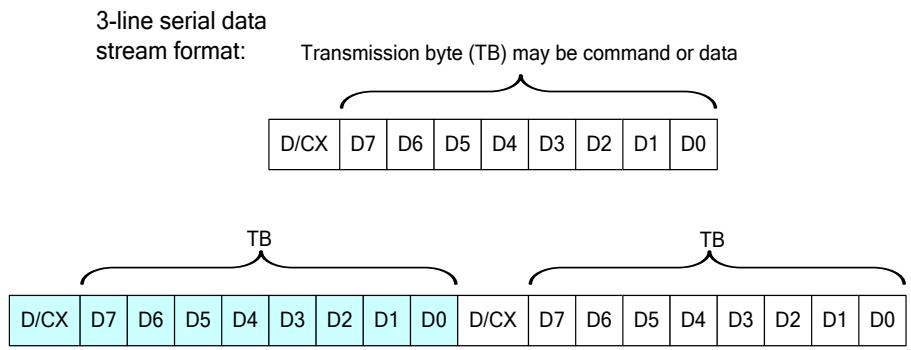

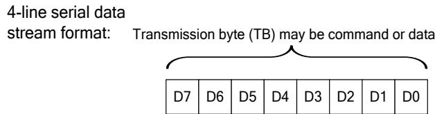

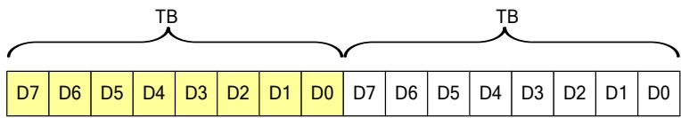  
Figure 10 Serial interface data stream format

When CSX is "high", SCL clock is ignored. During the high period of CSX the serial interface is initialized. At the falling edge of CSX, SCL can be high or low. SDA is sampled at the rising edge of SCL. D/CX indicates whether the byte is command  $(\mathrm{D} / \mathrm{CX} = '0')$  or parameter data  $(\mathrm{D} / \mathrm{CX} = '1')$ . D/CX is sampled when first rising edge of SCL (3-line serial interface) or 8th rising edge of SCL (4-line serial interface). If CSX stays low after the last bit of command/data byte, the serial interface expects the D/CX bit (3-line serial interface) or D7 (4-line serial interface) of the next byte at the next rising edge of SCL..

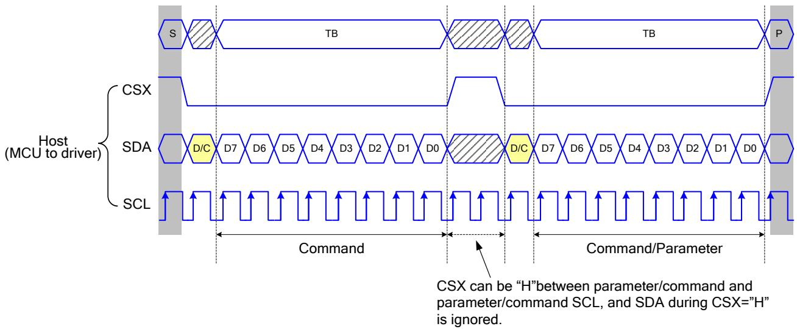  
Figure 11 3-line serial interface write protocol (write to register with control bit in transmission)

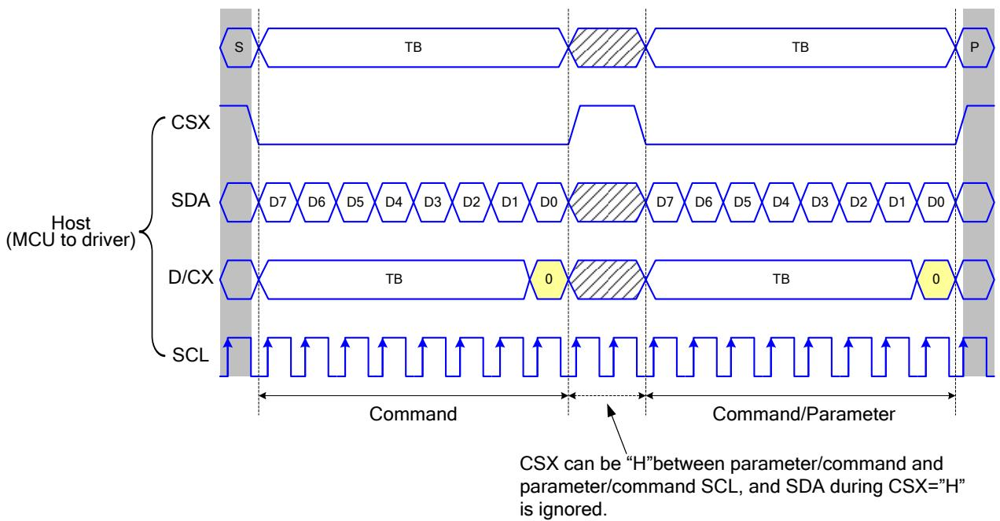  
Figure 12 4-line serial interface write protocol (write to register with control bit in transmission)

# 8.2.2 Read function

The read mode of the interface means that the micro controller reads register value from the driver. To achieve read function, the micro controller first has to send a command (read ID or register command) and then the following byte is transmitted in the opposite direction. After that CSX is required to go to high before a new command is send (see the below figure). The driver samples the SDA (input data) at rising edge of SCL, but shifts SDA (output data) at the falling edge of SCL. Thus the micro controller is supported to read at the rising edge of SCL.

After the read status command has been sent, the SDA line must be set to tri-state no later than at the falling edge of SCL of the last bit.

# 3-line serial interface protocol

3-line serial protocol (for RDID1/RDID2/RDID3/0Ah/0Bh/0Ch/0Dh/0Eh/0Fh command: 8-bit read):

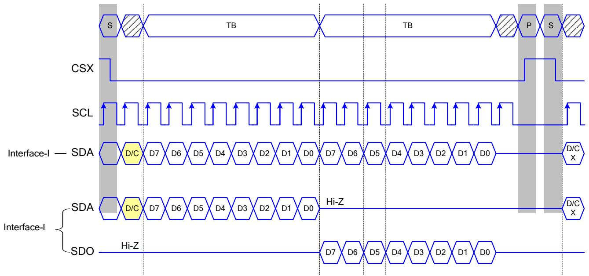

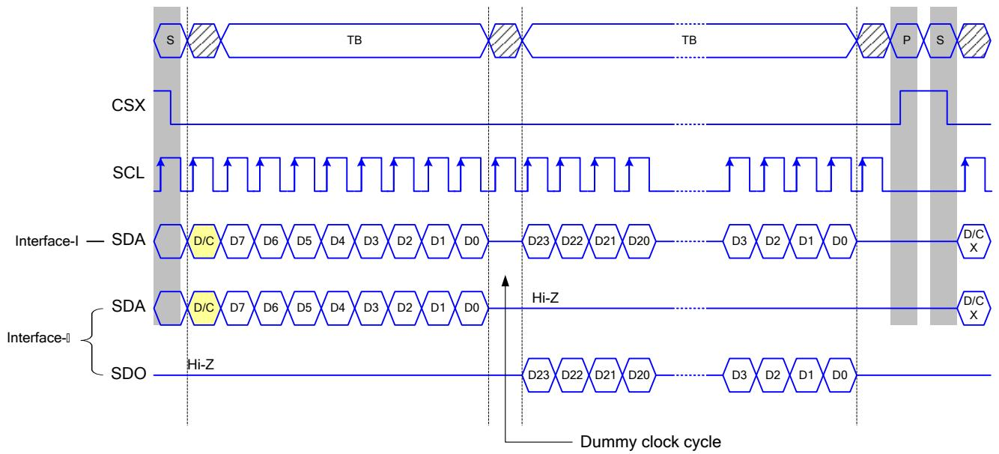  
3-line serial protocol (for RDDID command: 24-bit read)

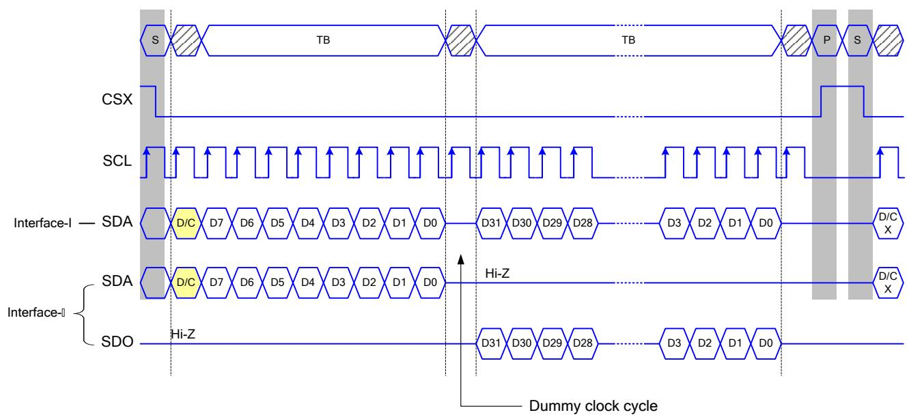  
3-line Serial Protocol (for RDDST command: 32-bit read)  
Figure 13 3-line serial interface read protocol

# 4-line serial protocol

4-line serial protocol (for RDID1/RDID2/RDID3/0Ah/0Bh/0Ch/0Dh/0Eh/0Fh command: 8-bit read):

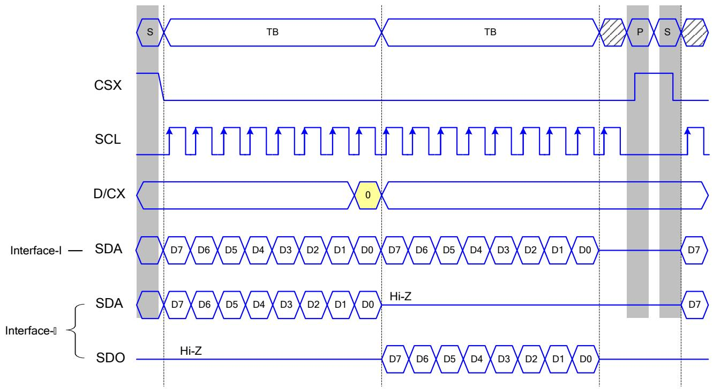  
4-line serial protocol (for RDDID command: 24-bit read)

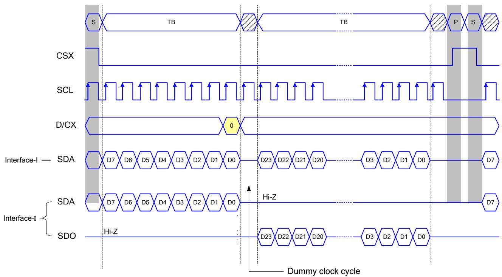  
4-line Serial Protocol (for RDDST command: 32-bit read)

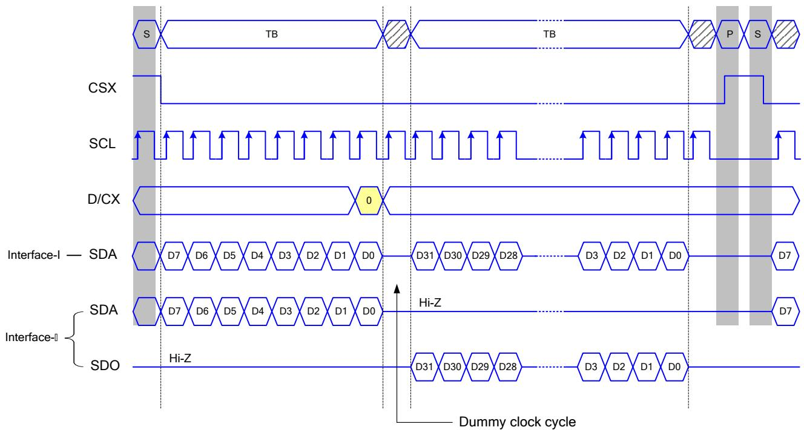  
Figure 14 4-line serial interface read protocol

# 8.3 16 bit Serial Interface

# 8.3.1 Write Mode

The write mode of the interface means the micro controller writes commands and data to the ST7701S. The serial interface is initialized when CSX is high. In this state, SCL clock pulse or SDI data have no effect. A falling edge on CSX enables the serial interface and indicates the start of data transmission.

When CSX is high, SCL clock is ignored. During the high time of CSX the serial interface is initialized. At the falling CSX edge, SCL can be high or low. SDI/SDO are sampled at the rising edge of SCL. R/W indicates, whether the byte is read command (R/W = '1') or write command (R/W = '0'). It is sampled when first rising SCL edge. If CSX stays low after the last bit of command/data byte, the serial interface expects the R/W bit of the next byte at the next rising edge of SCL.

  
Figure 15 serial 16 bit interface write mode

# 8.3.2 Read Mode

The read mode of the interface means that the micro controller reads register value from the ST7701S. To do so the micro controller first has to send a command and then the following byte is transmitted in the opposite direction. After that CSX is required to go high before a new command is send. The ST7701S samples the SDI (input data) at the rising edges, but shifts SDO (output data) at the falling SCL edges. Thus the micro controller is supported to read data at the rising SCL edges. After the read status command has been sent, the SDI line must be set to tri-state no later than at the falling SCL edge of the last bit. It doesn't need any dummy clock when execute the command data read.

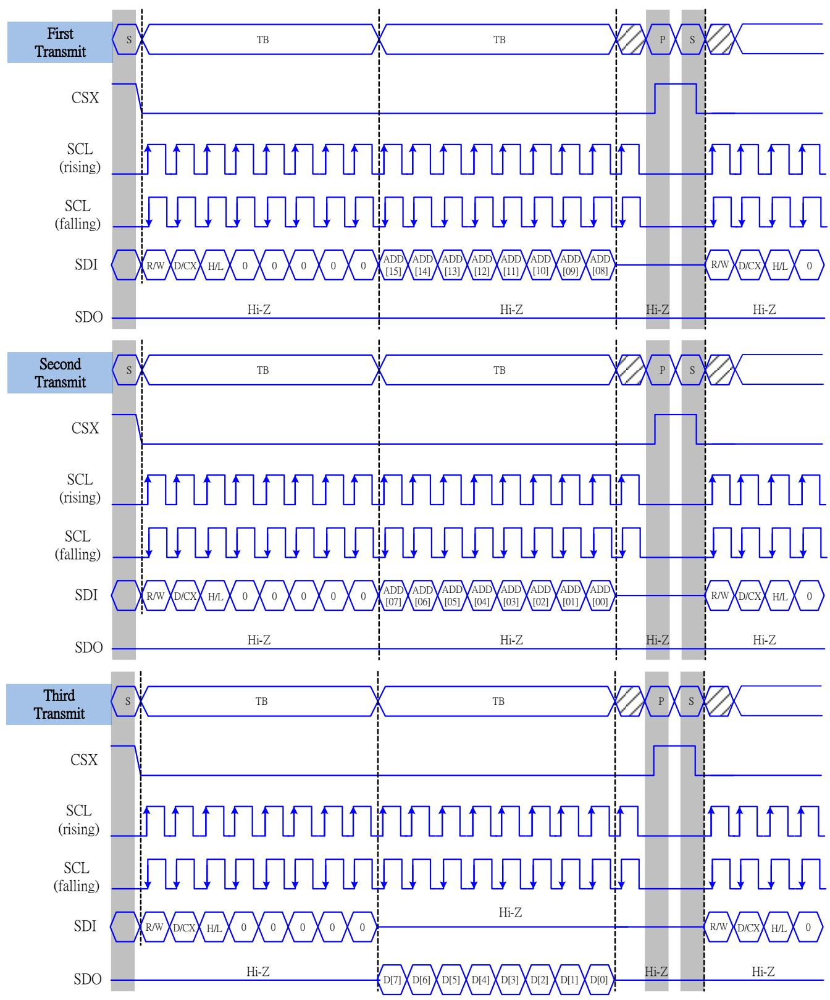  
Figure 16 serial 16 bit interface read mode

# 8.4 Data Transfer Break and Recovery

If there is a break in data transmission by RESX pulse, while transferring a command or frame memory data or multiple parameter command data, before Bit D0 of the byte has been completed, then driver will reject the previous bits and have reset the interface such that it will be ready to receive command data again when the chip select line (CSX) is next activated after RESX have been HIGH state.

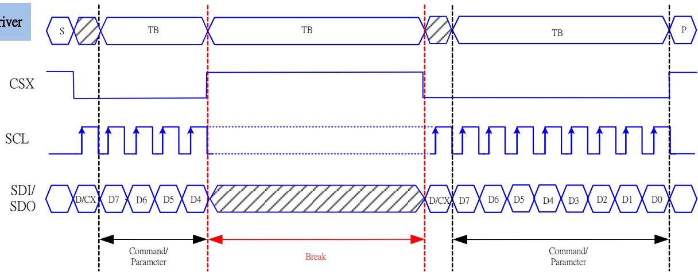  
MPU to Driver  
Figure 17 Data Transfer Break and Recovery.

If there is a break in data transmission by CSX pulse, while transferring a command or frame memory data or multiple parameter command data, before Bit D0 of the byte has been completed, then driver will reject the previous bits and have reset the interface such that it will be ready to receive the same byte re-transmitted when the chip select line (CSX) is next activated.

If 1, 2 or more parameter commands are being sent and a break occurs while sending any parameter before the last one and if the host then sends a new command rather than re-transmitting the parameter that was interrupted, then the parameters that were successfully sent are stored and the parameter where the break occurred is rejected. The interface is ready to receive next byte as shown below.

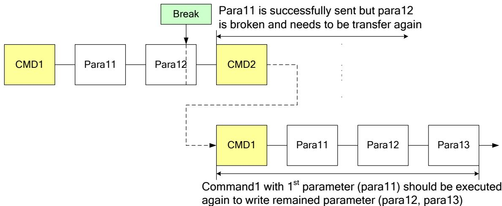  
Figure 18 Write interrupts recovery

If a 2 or more parameter commands are being sent and a break occurs by the other command before the last one is sent, then the parameters that were successfully sent are stored and the other parameter of that command remains previous value.

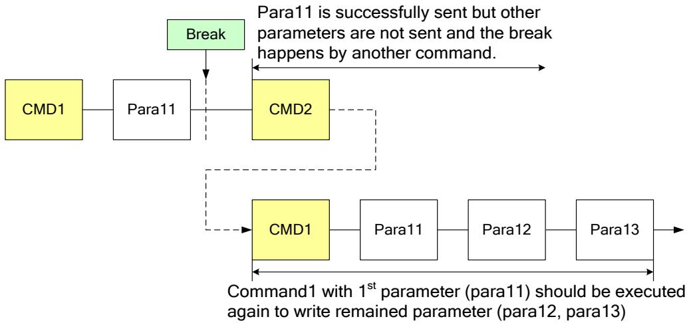  
Figure 19 Write interrupts recovery

# 8.5 Data Transfer Pause

Transferring a Command, Frame Memory Data, or Multiple Parameter Data might invoke a pause in the data transmission. If the Chip Select pin (CSX) is released after a whole byte of a Frame Memory Data or Multiple Parameter Data has been completed, then the ST7701S will wait and continue the Frame Memory Data or Parameter Data Transmission from the point where it was paused. If the Chip Select pin is released after a whole byte of a command has been completely transmitted, then the display module will receive either the command's parameters or a new command when the Chip Select Line is enabled again, as shown below.

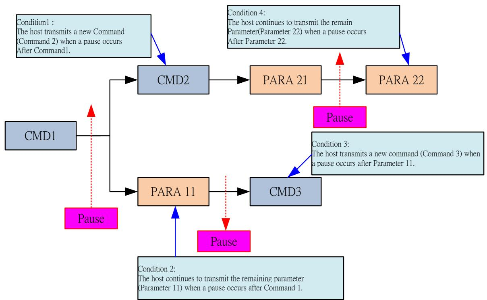  
Figure 20 Data Transfer Pause

  
8.5.1 SPI interface pause  
Figure 21 Serial Data Transfer Pause

This applies to the following 4 conditions:

1) Command-Pause-Command  
2) Command-Pause-Parameter  
3) Parameter-Pause-Command  
4) Parameter-Pause-Parameter

# 8.6 RGB Interface

The ST7701S support RGB interface Mode 1 and Mode 2. The interface signals as shown in table 6.3.1.

The Mode 1 and Mode 2 function is select by setting in the Command 2, please reference application note.

In RGB Mode 1, writing data to line buffer is done by PCLK and Video Data Bus (D[23:0]), when DE is high state.

The external clocks (PCLK, VS and HS) are used for internal displaying clock. So, controller must always transfer

PCLK, VS and HS signal to ST7701S.

In RGB Mode 2, back porch of Vsync is defined by VBP_HVRGB [7:0] of RGBCTR command. And back porch of Hsync is defined by HBP_HVRGB [7:0] of RGBCTR command. Front porch of Vsync are not setting by this mode.

<table><tr><td>RGB I/F Mode</td><td>PCLK</td><td>DE</td><td>VS</td><td>HS</td><td>DB[23:0]</td><td>Register for Blanking Porch setting</td></tr><tr><td>RGB Mode 1</td><td>Used</td><td>Used</td><td>Used</td><td>Used</td><td>Used</td><td>Not Used</td></tr><tr><td>RGB Mode 2</td><td>Used</td><td>Not Used</td><td>Used</td><td>Used</td><td>Used</td><td>Used</td></tr></table>

<table><tr><td>Symbol</td><td>Name</td><td>Description</td></tr><tr><td>PCLK</td><td>Pixel clock</td><td>Pixel clock for capturing pixels at display interface</td></tr><tr><td>HS</td><td>Horizontal sync</td><td>Horizontal synchronization timing signal</td></tr><tr><td>VS</td><td>Vertical sync</td><td>Vertical synchronization timing signal</td></tr><tr><td>DE</td><td>Data enable</td><td>Data enable signal (assertion indicates valid pixels)</td></tr><tr><td>DB[23:0]</td><td>Pixel data</td><td>Pixel data in 16-bit,18-bit and 24-bit format</td></tr></table>

Table 11 The interface signals of RGB interface

# 8.6.1 RGB Color Format

ST7701S supports two kinds of RGB interface, DE mode (mode 1) and HV mode (mode 2), and 16bit/18bit and 24 bit data format. When DE mode is selected and the VSYNC, HSYNC, DOTCLK, DE, D[23:0] pins can be used; when HV mode is selected and the VSYNC, HSYNC, DOTCLK, D[23:0] pins can be used. When using RGB interface, only serial interface can be selected.

<table><tr><td rowspan="2">Pad name</td><td rowspan="2">24 bits configuration
VIPF[3:0]=0111</td><td colspan="2">18 bits configuration
VIPF[3:0]=0110</td><td rowspan="2">16 bits configuration
VIPF[3:0]=0101</td></tr><tr><td>MDT=0</td><td>MDT=1</td></tr><tr><td>DB[23]</td><td>R7</td><td>Not used</td><td>Not used</td><td>Not used</td></tr><tr><td>DB[22]</td><td>R6</td><td>Not used</td><td>Not used</td><td>Not used</td></tr><tr><td>DB[21]</td><td>R5</td><td>R5</td><td>Not used</td><td>Not used</td></tr><tr><td>DB[20]</td><td>R4</td><td>R4</td><td>Not used</td><td>R4</td></tr><tr><td>DB[19]</td><td>R3</td><td>R3</td><td>Not used</td><td>R3</td></tr><tr><td>DB[18]</td><td>R2</td><td>R2</td><td>Not used</td><td>R2</td></tr><tr><td>DB[17]</td><td>R1</td><td>R1</td><td>R5</td><td>R1</td></tr><tr><td>DB[16]</td><td>R0</td><td>R0</td><td>R4</td><td>R0</td></tr><tr><td>DB[15]</td><td>G7</td><td>Not used</td><td>R3</td><td>Not used</td></tr><tr><td>DB[14]</td><td>G6</td><td>Not used</td><td>R2</td><td>Not used</td></tr><tr><td>DB[13]</td><td>G5</td><td>G5</td><td>R1</td><td>G5</td></tr><tr><td>DB[12]</td><td>G4</td><td>G4</td><td>R0</td><td>G4</td></tr><tr><td>DB[11]</td><td>G3</td><td>G3</td><td>G5</td><td>G3</td></tr><tr><td>DB[10]</td><td>G2</td><td>G2</td><td>G4</td><td>G2</td></tr><tr><td>DB[09]</td><td>G1</td><td>G1</td><td>G3</td><td>G1</td></tr><tr><td>DB[08]</td><td>G0</td><td>G0</td><td>G2</td><td>G0</td></tr><tr><td>DB[07]</td><td>B7</td><td>Not used</td><td>G1</td><td>Not used</td></tr><tr><td>DB[06]</td><td>B6</td><td>Not used</td><td>G0</td><td>Not used</td></tr><tr><td>DB[05]</td><td>B5</td><td>B5</td><td>B5</td><td>Not used</td></tr><tr><td>DB[04]</td><td>B4</td><td>B4</td><td>B4</td><td>B4</td></tr><tr><td>DB[03]</td><td>B3</td><td>B3</td><td>B3</td><td>B3</td></tr><tr><td>DB[02]</td><td>B2</td><td>B2</td><td>B2</td><td>B2</td></tr><tr><td>DB[01]</td><td>B1</td><td>B1</td><td>B1</td><td>B1</td></tr><tr><td>DB[00]</td><td>B0</td><td>B0</td><td>B0</td><td>B0</td></tr></table>

Table 12 The interface color mapping of RGB interface

# 8.6.2 RGB Interface Definition

The display operation via the RGB interface is synchronized with the VSYNC, HSYNC, and DOTCLK signals. The data can be written only within the specified area with low power consumption by using window address function. The back porch and front porch are used to set the RGB interface timing.

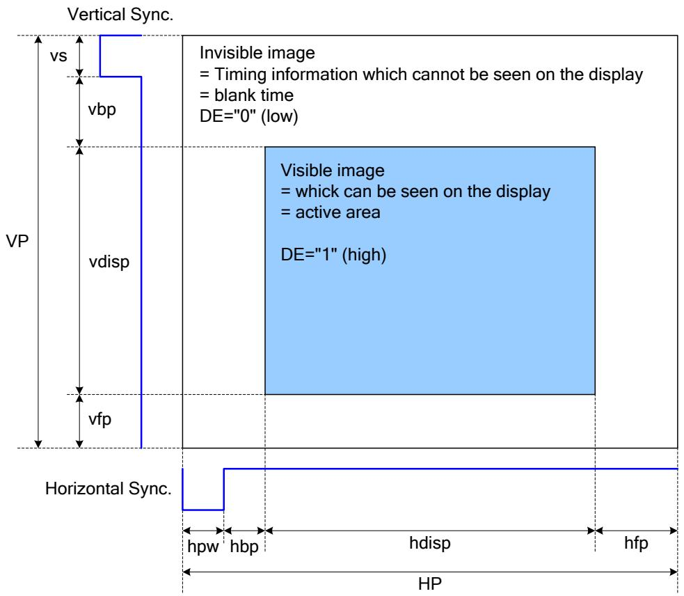  
Figure 22 Access Area by RGB Interface

Please refer to the following table for the setting limitation of RGB interface signals.  

<table><tr><td>Parameter</td><td>Symbol</td><td>Min.</td><td>Typ.</td><td>Max.</td><td>Unit</td></tr><tr><td>Horizontal Sync. Width</td><td>hpw</td><td>2</td><td>-</td><td>255</td><td>Clock</td></tr><tr><td>Horizontal Sync. Back Porch</td><td>hbp</td><td>2</td><td>--</td><td>255</td><td>Clock</td></tr><tr><td>Horizontal Sync. Front Porch</td><td>hfp</td><td>2</td><td>--</td><td>-</td><td>Clock</td></tr><tr><td>Vertical Sync. Width</td><td>vs</td><td>2</td><td>--</td><td>254</td><td>Line</td></tr><tr><td>Vertical Sync. Back Porch</td><td>vbp</td><td>2</td><td>--</td><td>254</td><td>Line</td></tr><tr><td>Vertical Sync. Front Porch</td><td>vfp</td><td>2</td><td>--</td><td>--</td><td>Line</td></tr></table>

Note:  
1. Typical value are related to the setting frame rate is  $60\mathrm{Hz}$

# 8.6.3 RGB Interface Mode Selection

ST7701S supports two kinds of RGB interface, DE mode and HV mode. The table shown below uses command C3h to select RGB interface mode.

<table><tr><td>DE/Sync</td><td>RGB Mode</td></tr><tr><td>0</td><td>DE mode</td></tr><tr><td>1</td><td>HV mode</td></tr></table>

# 8.6.4 RGB Interface Timing

The timing chart of RGB interface DE mode is shown as follows.

Figure 23 Timing Chart of Signals in RGB Interface DE Mode  
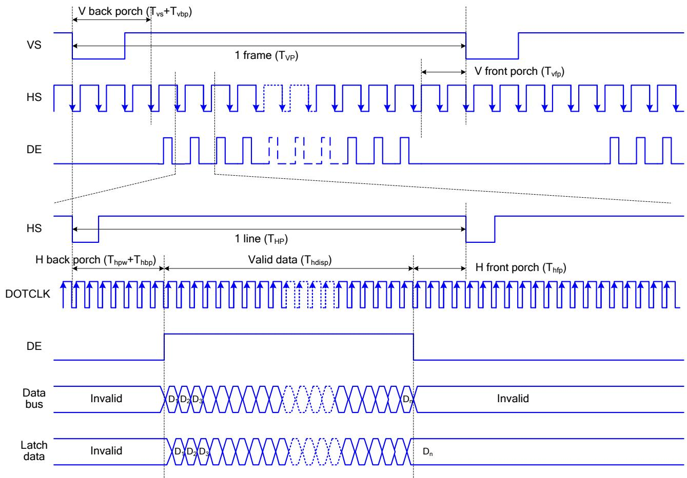  
Note: The setting of front porch and back porch in host must match that in IC as this mode.

The timing chart of RGB interface HV mode is shown as follows.

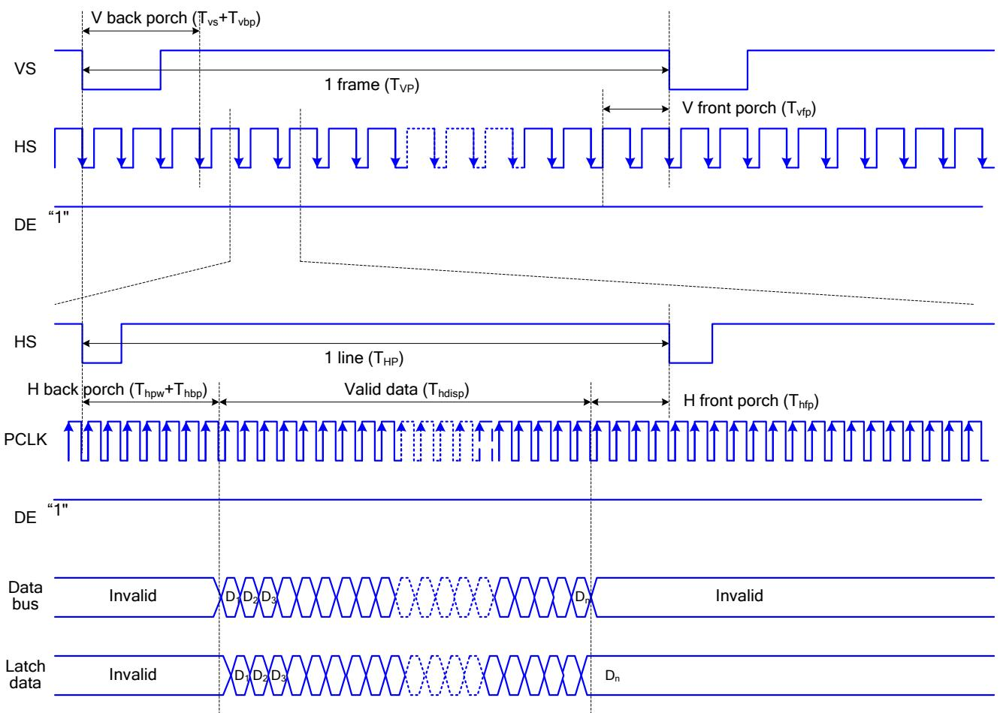  
Figure 24 Timing chart of RGB interface HV mod

# 8.7 MIPI-DSI interface

The Display Serial Interface standard defines protocols between a host processor and peripheral devices that adhere to MIPI Alliance standards for mobile device interfaces. The DSI standard builds on existing standards by adopting pixel formats and command set defined in MIPI Alliance standards.

DSI-compliant peripherals support either of two basic modes of operation: Command Mode and Video Mode.

Which mode is used depends on the architecture and capabilities of the peripheral. The mode definitions reflect the primary intended use of DSI for display interconnect, but are not intended to restrict DSI from operating in other applications.

Typically, a peripheral is capable of Command Mode operation or Video Mode operation. Some Video Mode display modules also include a simplified form of Command Mode operation in which the display module may refresh its screen from a reduced-size, or partial, frame buffer, and the interface (DSI) to the host processor may be shut down to reduce power consumption.

Command Mode refers to operation in which transactions primarily take the form of sending commands to a peripheral, such as a display module, that incorporates a display controller. The display controller may include local registers and a frame buffer. Systems using Command Mode write to, and read from, the registers. The host processor indirectly controls activity at the peripheral by sending commands, parameters to the display controller. The host processor can also read display module status information. Command Mode operation requires a bidirectional interface.

Video Mode refers to operation in which transfers from the host processor to the peripheral take the form of a real-time pixel stream. In normal operation, the display module relies on the host processor to provide image data at sufficient bandwidth to avoid flicker or other visible artifacts in the displayed image. Video information should only be transmitted using High Speed Mode. Some Video Mode architectures may include a simple timing controller and partial frame buffer, used to maintain a partial-screen or lower-resolution image in standby or Low Power Mode. This permits the interface to be shut down to reduce power consumption. To reduce complexity and cost, systems that only operate in Video Mode may use a unidirectional data path.

Configuration:

<table><tr><td>Lane Pair</td><td>MCU (Master) Display Module (Slave)</td></tr><tr><td>Clock Lane</td><td>Unidirectional Lane
■ Clock Only
■ Escape Mode(ULPS Only)</td></tr><tr><td>Data Lane 0</td><td>Bi-directional Lane
■ Forward High-Speed
■ Bi-directional Escape Mode
■ Bi-directional LPDT</td></tr><tr><td>Data Lane 1</td><td>Unidirectional Lane
■ Forward High-Speed
■ Escape Mode (ULPM only)
■ No LPDT</td></tr></table>

# 8.7.1 Display Module Pin Configuration for DSI

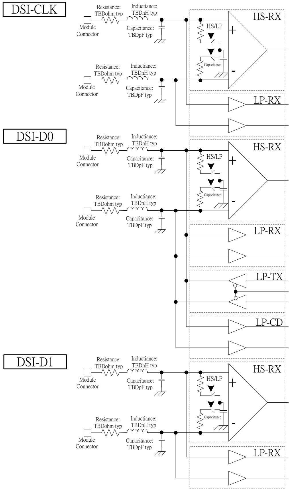

# 8.7.2 Display Serial Interface (DSI)

# 8.7.2.1 General description

The communication can be separated 2 different levels between the MCU and the display module:

- Interface Level : Low level communication  
- Packet level : High level communication

# 8.7.2.2 Interface level communication

# 8.7.2.2.1 General

The display module uses data and clock lane differential pairs for DSI. Both clock lane and data lane0 can be driven Low Power (LP) or High Speed (HS) mode. Data lane1 and Data lane2 can be driven High Speed mode only.

<table><tr><td></td><td>Lane support mode</td><td></td><td></td></tr><tr><td>Clock Lane</td><td>Unidirectional lane
High-Speed Clock only
Simplified Escape Mode (ULPS Only)</td><td>D-PHY
Lane Module
←→
D-PHY
Lane Module
←→
D-PHY
Lane Module
←→
D-PHY
Lane Module
←→
D-PHY
Lane Module
←→
D-PHY
Lane Module
←→
D-PHY
Lane Module
←→
D-PHY
Lane Module
←→
D-PHY
Lane Module
←→
D-PHY
Lane Module
←→
D-PHY
Lane Module
←→</td><td></td></tr><tr><td>Data Lane0</td><td>Bi-directional lane
Forward high-speed only
Bi-directional Escape Mode
Bi-direction LPDT</td><td>D-PHY
Lane Module
←→
D-PHY
Lane Module
←→
D-PHY
Lane Module
←→
D-PHY
Lane Module
←→
D-PHY
Lane Module
←→
D-PHY
Lane Module
←→
D-PHY
Lane Module
←→
D-PHY
Lane Module
←→
D-PHY
Lane Module
←→
D-PHY
Lane Module
←~</td><td></td></tr><tr><td>Data Lane 1</td><td>Unidirectional lane
Forward high-speed only
Simplified Escape Mode(ULPS Only)</td><td>D-PHY
Lane Module
←→
D-PHY
Lane Module
←→
D-PHY
Lane Module
←→
D-PHY
Lane Module
←→
D-PHY
Lane Module
←→
D-PHY
Lane Module
←→
D-PHY
Lane Module
←→
D-PHY
Lane Module
←→
D-PHY
Lane Module
←→
D-PHY
Line Module
←→
D-PHY
Line Module
←→
D-PHY
Line Module
←→
D-PHY
Line Module
←→
D-PHY
Line Module
←→
D-PHY
Line Module
←→
D-PHY
Line Module
←→
D-PHY
Line Module
←→
D-PHY
Line Module
←→
D-PHY
Line Module
←→
D-PHY
line Module
←→
D-PHY
Line Module
←→
D-PHY
Line Module
←→
D-PHY
Line Module
←→
D-PHY
Line Module
←→
D-PHY
Line Module
←→
D-PHY
Line Module
←→
D-PHY
Line Module
←→
D-PHY
Line Module
←→
D-PHY
Line Module
←→
D-PHY
LINE Module
←→
D-PHY
Line Module
←→
D-PHY
Line Module
←→
D-PHY
Line Module
←→
D-PHY
Line Module
←→
D-PHY
Line Module
←→
D-PHY
Line Module
←→
D-PHY
Line Module
←→
D-PHY
Line Module
←→
D-PHY
Line Module
←→
D-PHY
-line Module
←→
D-PHY
Line Module
←→
D-PHY
Line Module
←→
D-PHY
Line Module
←→
D-PHY
Line Module
←→
D-PHY
Line Module
←→
D-PHY
Line Module
←→
D-PHY
Line Module
←→
D-PHY
Line Module
←→
D-PHY
Line Module
←→
D-PHY
线 Module
←→
D-PHY
Line Module
←→
D-PHY
Line Module
←→
D-PHY
Line Module
←→
D-PHY
Line Module
←→
D-PHY
Line Module
←→
D-PHY
Line Module
←→
D-PHY
Line Module
←→
D-PHY
Line Module
←→
D-PHY
Line Module
←→
D-PHY
Lines Module
←→
D-PHY
Line Module
←→
D-PHY
Line Module
←→
D-PHY
Line Module
←→
D-PHY
Line Module
←→
D-PHY
Line Module
←→
D-PHY
Line Module
←→
D-PHY
Line Module
←→
D-PHY
Line Module
←→
D-PHY
Line Module
←→
D-PHY
Lanes Module
←→
D-PHY
Line Module
←→
D-PHY
Line Module
←→
D-PHY
Line Module
←→
D-PHY
Line Module
←→
D-PHY
Line Module
←→
D-PHY
Line Module
←→
D-PHY
Line Module
←→
D-PHY
Line Module
←→
D-PHY
Line Module
←→
D-PHY
Lane Module
←→
D-PHY
Line Module
←→
D-PHY
Line Module
←→
D-PHY
Line Module
←→
D-PHY
Line Module
←→
D-PHY
Line Module
←→
D-PHY
Line Module
←→
D-PHY
Line Module
←→
D-PHY
Line Module
←→
D-PHY
Lanes Module
←→
D-PHY</td><td>D-PHY
Lane Module
←→
D-PHY
Lane Module
←→
D-PHY
Lane Module
←→
D-PHY
Lane Module
←→
D-PHY
Lane Module
←→
D-PHY
Lane Module
←→
D-PHY
Lane Module
←→
D-PHY
Lane Module
←→
D-PHY
Lane Module
←→
D-PHY
Lane Module
←·</td></tr></table>

Table 13 The interface color Lane types and support mode

Low Power mode means that each line of the differential pair is used in single end mode and a differential receiver is disable (A termination resistor of the receiver is disable) and it can be driven into a low power mode.

High Speed mode means that differential pairs (The termination resistor of the receiver is enable) are not used in the single end mode.

There are used different modes and protocols in each mode when there are wanted to transfer information from the MCU to the display module and vice versa.

The State Codes of the High Speed (HS) and Low Power (LP) lane pair are defined below.

<table><tr><td rowspan="2">Lane Pair
State Code</td><td colspan="2">Line DC voltage Levels</td><td>High Speed(HS)</td><td colspan="2">Low-Power(LP)</td></tr><tr><td>Dn+ Line</td><td>Dn- Line</td><td>Burst Mode</td><td>Control Mode</td><td>Escape Mode</td></tr><tr><td>HS-0</td><td>Low (HS)</td><td>High (HS)</td><td>Differential-0</td><td>Note 1</td><td>Note 1</td></tr><tr><td>HS-1</td><td>High (HS)</td><td>Low (HS)</td><td>Differential-1</td><td>Note 1</td><td>Note 1</td></tr><tr><td>LP-00</td><td>Low (LP)</td><td>Low (LP)</td><td>Not Defined</td><td>Bridge</td><td>Space</td></tr><tr><td>LP-01</td><td>Low (LP)</td><td>High (LP)</td><td>Not Defined</td><td>HS-Request</td><td>Mark-0</td></tr><tr><td>LP-10</td><td>High (LP)</td><td>Low (LP)</td><td>Not Defined</td><td>LP-Request</td><td>Mark-1</td></tr><tr><td>LP-11</td><td>High (LP)</td><td>High (LP)</td><td>Not Defined</td><td>Stop</td><td>Note 2</td></tr></table>

Table 14 High Speed and Low-Power Lane Pair State Descriptions

Notes:

1. Low-Power Receivers (LP-Rx) of the lane pair are checking the LP-00 state code, when the Lane Pair is in the High Speed (HS) mode.  
2. If Low-Power Receivers (LP-Rx) of the lane pair recognizes LP-11 state code, the lane pair returns to LP-11 of the Control Mode.

# 8.7.2.2.2 DSI-CLK Lanes

DSI-CLK+/- lanes can be driven into three different power modes: Low Power Mode (LPM LP-11), Ultra Low Power Mode (ULPM) or High Speed Clock Mode (HSCM).

Clock lanes are in a single end mode (LP = Low Power) when there is entering or leaving Low Power Mode(LPM) or Ultra Low Power Mode (ULPM).

Clock lanes are in the single end mode (LP = Low Power) when there is entering in or leaving out High Speed Clock Mode (HSCM).

These entering and leaving protocols are using clock lanes in the single end mode to generate an entering or leaving sequences.

The principal flow chart of the different clock lanes power modes is illustrated below.

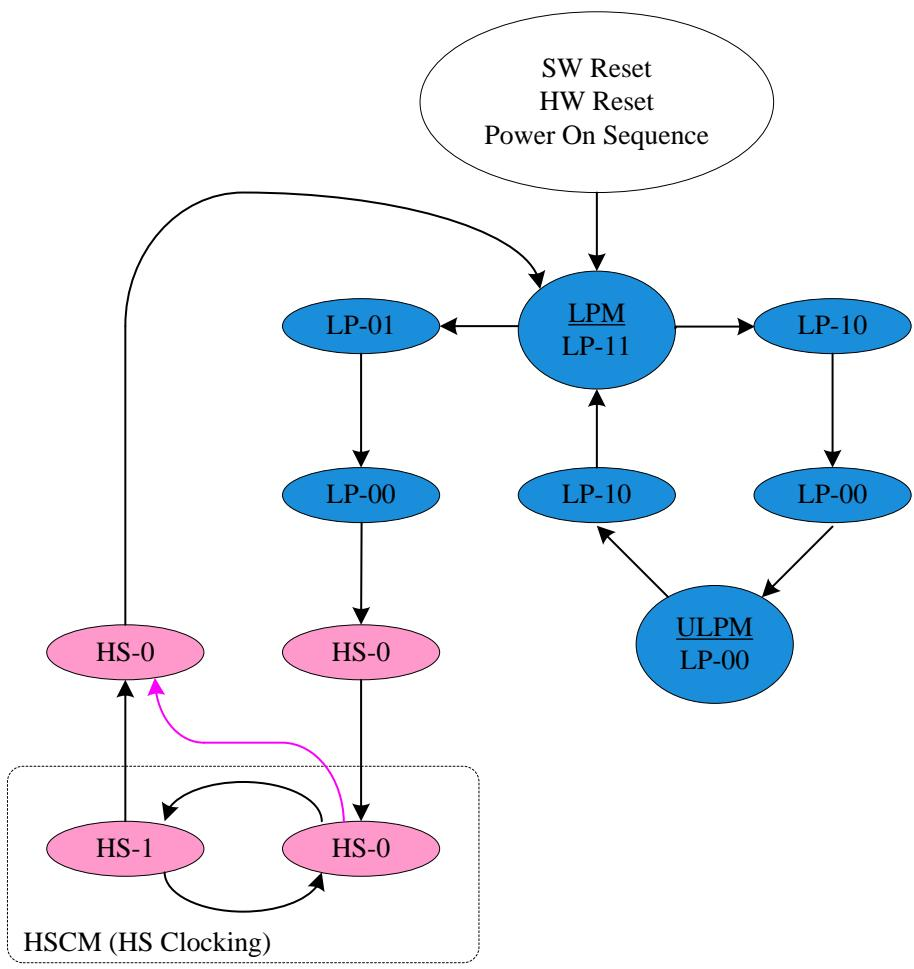  
Figure 25 Clock Lanes Power Modes

# 8.7.2.2.2.1 Low Power Mode (LPM)

DSI-CLK+/- lanes can be driven to the Low Power Mode(LMP), when DSI-CLK lanes are entering LP-11 State Code, in three different ways:

After SW Reset,HW Reset or Power On Sequence  $\equiv >$  LP-11

After DSI-CLK+/- lanes are leaving Ultra Low Power Mode (ULPM,LP-00 State Code)  $\Rightarrow$  LP10  $\Longrightarrow$  LP-11(LPM).

This sequence is illustrated below.

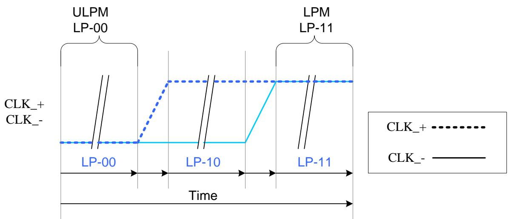  
Figure 26 From ULPM to LPM

After DSI-CLK+/- lanes are leaving High Speed Clock Mode (HSCM, HS-0 or HS-1 State Code) =>HS-0 =>LP-11 (LPM).

This sequence is illustrated below.

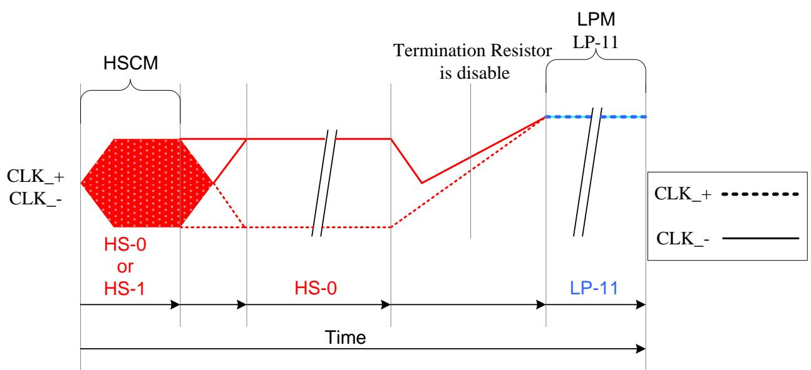  
Figure 27 From HSCM to LPM

All three mode changes are illustrated a flow chart below.

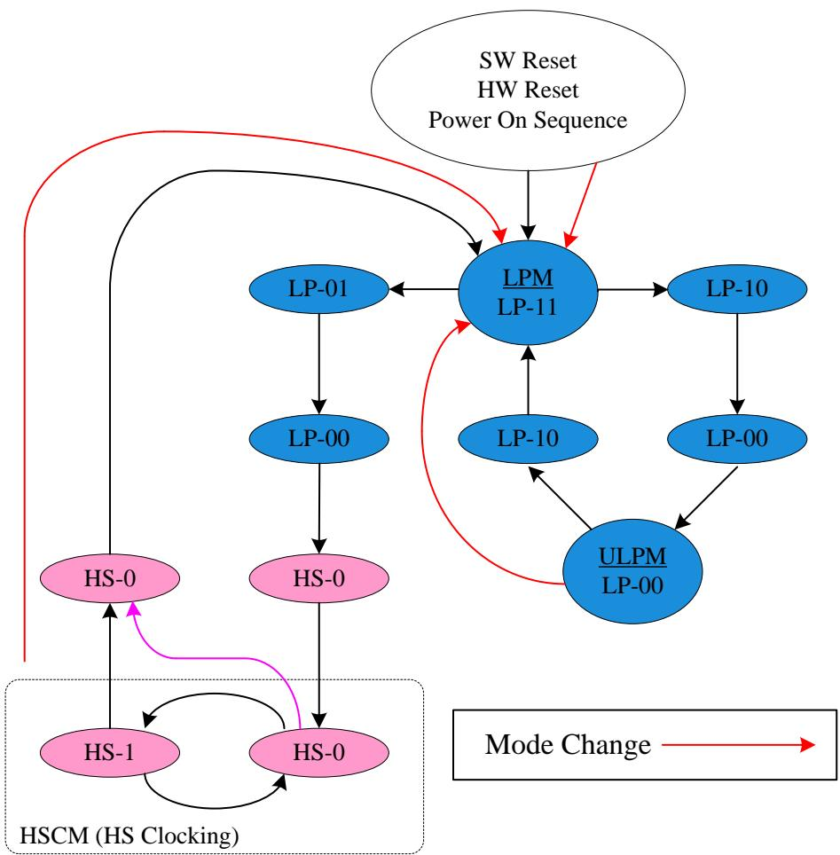  
Figure 28 All three mode changes to LPM

# 8.7.2.2.2.2 Ultra Low Power Mode (ULPM)

DSI-CLK+/- lanes can be driven to the Ultra Low power Mode (ULPM), when DSI-CLK lanes are entering LP-00 State Code.

The only entering possibility is from the Low Power Mode (LPM, LP-11 State Code)  $= >$  LP-10  $= >$  LP-00(ULPM).

This sequence is illustrated below.

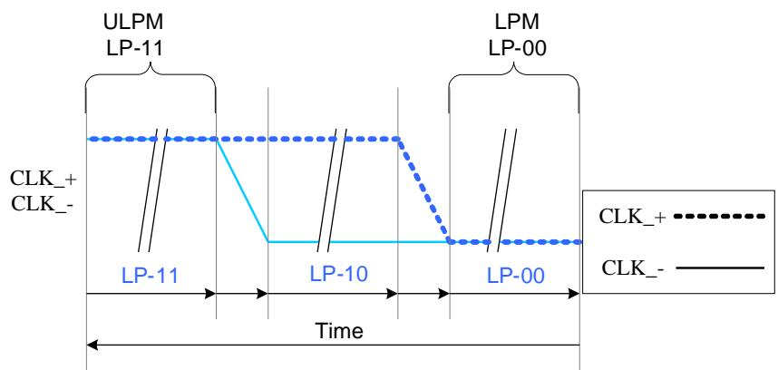  
Figure 29 From LPM to UPLM

The mode change is also illustrated below:

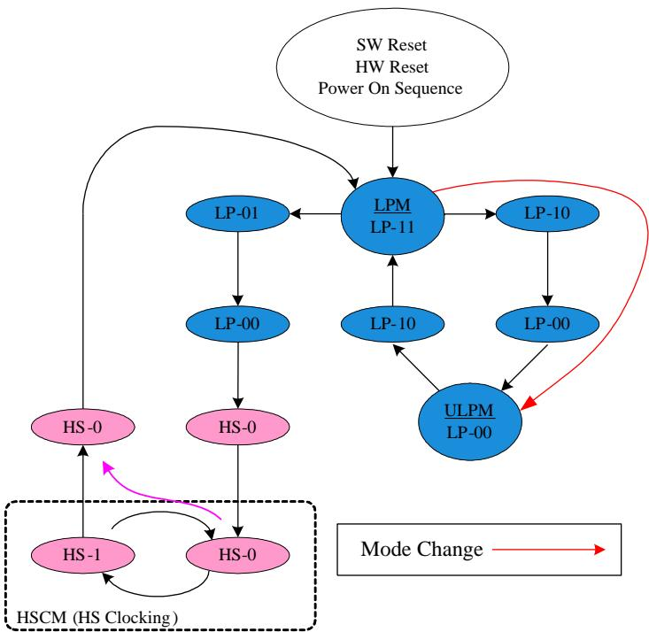  
Figure 30 The mode change from LPM to UPLM

# 8.7.2.2.2.3 High-speed Clock Mode (HSCM)

DSI-CLK+/- lanes can be driven to the High Speed Clock Mode (HSCM), when DSI-CLK lanes are starting to work between HS-0 and HS-1 State Codes.

The only entering possibility is from the Low Power Mode (LPM, LP-11 State Code) =>LP-01 =>LP-00 =>HS-0 =>HS-0/1 (HSCM).

This sequence is illustrated below.

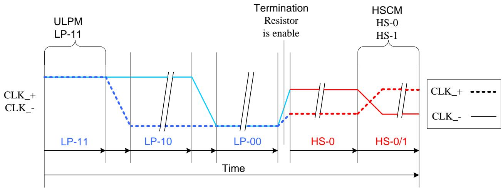  
Figure 31 From LPM to HSCM

The mode change is also illustrated below:

  
Figure 32 Mode Change from LPM to HSCM on the Flow Chart

The high speed clock (DSI-CLK+/-) is started before high speed data is sent via DSI-Dn+/- lanes. The high speed clock continues clocking after the high speed data sending has been stopped.

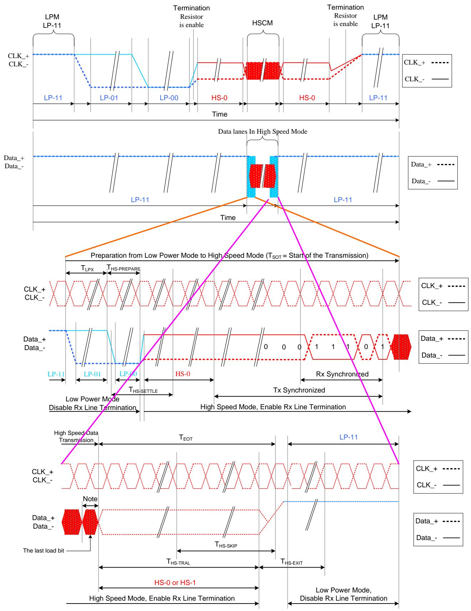  
Figure 33 High Speed Clock Burst

8.7.2.2.3

DSI-DATA LANES

8.7.2.2.3.1

GENERAL

DSI-D0+/- Data Lanes can be driven in different modes which are:

- Escape Mode (Only DSI-D0+/- data lanes are used)  
- High-Speed Data Transmission (DSI-D1+/- and DSI-D0+/- data lanes are used)  
- Bus Turnaround Request (Only DSI-D0+/- data lanes are used)

These modes and their entering codes are defined on the following table.

<table><tr><td>Mode</td><td>Entering Mode Sequence</td><td>Leaving Mode Sequence</td></tr><tr><td>Escape Mode</td><td>LP-11=&gt;LP-10=&gt;LP-00=&gt;LP-01=&gt;LP-00</td><td>LP-00=&gt;LP-10=&gt;LP11(Mark1)</td></tr><tr><td>High-Speed Data Transmission</td><td>LP-11=&gt;LP-01=&gt;LP-00=&gt;HS-0</td><td>(HS-0 or HS-1) =&gt;LP-11</td></tr><tr><td>Bus Turnaround Request</td><td>LP-11=&gt;LP-10=&gt;LP-00=&gt;LP-10=&gt;LP-00</td><td>High-Z</td></tr></table>

Notes:

1. Only DSI-D0+/- data lanes are used.  
2. DSI-D1+/- and DSI-D0+/- data lanes are used.  
3. More information on section "Bus Turnaround (BTA)"

# 8.7.2.2.3.2

# ESCAPE MODE

Data lanes (DSI-D0+/-) can be used in different Escape Modes when data lanes are in Low Power (LP) mode.

These Escape Modes are used to:

- Send "Low-Power Data Transmission" (LPDT) e.g. from the MCU to the display module  
- Drive data lanes to "Ultra-Low Power State" (ULPS)  
- Indicate "Remote Application Reset" (RAR), which is reset the display module  
- Indicate "Tearing Effect" (TEE), which is used for a TE trigger event from the display module to the MCU  
- Indicate "Acknowledge" (ACK), which is used for a non-error event from the display module to the MCU

The basic sequence of the Escape Mode is as follow

Start: LP-11  
- Escape Mode Entry (EME): LP-11 =>LP-10 =>LP-00 =>LP-01 =>LP-00  
- Escape Command (EC), which is coded, when one of the data lanes is changing from low-to-high-to-low then this changed data lane is presenting a value of the current data bit (DSI-D0+ = 1, DSI-D0- = 0) e.g. when

DSI-D0- is changing from low-to-high-to-low, the receiver is latching a data bit, which value is logical 0. The receiver is using this low-to-high-to-low transition for its internal clock.

- A load if it is needed  
- Exit Escape (Mark-1) LP-00 =>LP-10 =>LP-11  
End: LP-11

This basic construction is illustrated below:

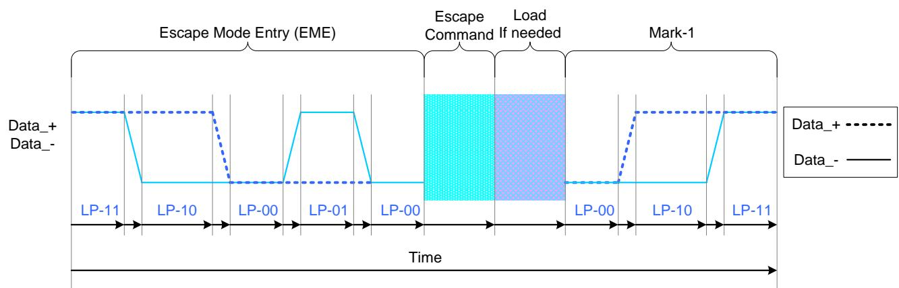  
Figure 34 General Escape Mode Sequence

The number of the different Escape Commands (EC) is eight. These eight different escape commands (EC) can be divided 2 different groups: Mode or Trigger. The MCU is informing to the display module that it is controlling data lanes (DSI-D0+/-) with the mode e.g. The MCU can inform to the display module that it can put data lanes in the low power mode. The MCU is waiting from the display module event information, which has been set by the MCU, with the trigger e.g. when the display module reaches a new V-synch, the display module sent to the MCU a TE trigger (TEE), if the MCU has been requested it.

Escape commands are defined on the next table.

This basic construction is illustrated below:

<table><tr><td>Escape Command</td><td>Command Type Mode/Trigger</td><td>Entry Command Pattern (First Bit→Last Bit Transmitted)</td><td>Dn</td><td>D0</td></tr><tr><td>Low-Power Data Transmission</td><td>Mode</td><td>1110 0001 bin</td><td>-</td><td>○</td></tr><tr><td>Ultra-Low Power Mode</td><td>Mode</td><td>0001 1110 bin</td><td>○</td><td>○</td></tr><tr><td>Underfined-1, Note 1</td><td>Mode</td><td>1001 1111 bin</td><td>-</td><td>-</td></tr><tr><td>Underfined-2, Note 1</td><td>Mode</td><td>1101 1110 bin</td><td>-</td><td>-</td></tr><tr><td>Remote Application Reset</td><td>Trigger</td><td>0110 0010 bin</td><td>-</td><td>○</td></tr><tr><td>Tearing Effect</td><td>Trigger</td><td>0101 1101 bin</td><td>-</td><td>-</td></tr><tr><td>Acknowledge</td><td>Trigger</td><td>0010 0001 bin</td><td>-</td><td>○</td></tr><tr><td>Unknow-5,Note 1</td><td>Trigger</td><td>1010 0000 bin</td><td>-</td><td>-</td></tr></table>

# Notes:

1. This Escape command support has not been implemented on the display module.  
2.  $n = 1$  
3. "O" = Supported  
4. "--" = Not Supported  
5. Tearing Effect Trigger can not be used in MIPI Video mode.

# Low-Power Data Transmission(LPDT)

The MCU can send data to the display module in Low-Power Data Transmission (LPDT) mode when data lanes are entering in Escape Mode and Low-Power Data Transmission (LPDT) command has been sent to the display module. The display module is also using the same sequence when it is sending data to the MCU.

The Low Power Data Transmission (LPDT) is using a following sequence:

Start: LP-11  
- Escape Mode Entry (EME): LP-11 =>LP-10 =>LP-00 =>LP-01 =>LP-00  
- Low-Power Data Transmission (LPDT) command in Escape Mode: 1110 0001 (First to Last bit)  
- Load (Data): One or more bytes (8 bits)

Data lanes are in pause mode when data lanes are stopped (Bothe lanes are low ) between bytes

Mark-1: LP-00 =>LP-10 =>LP-11  
End: LP-11

This sequence is illustrated for reference purposes below:

Figure 35 Low-Power Data Transmission (LPDT)  
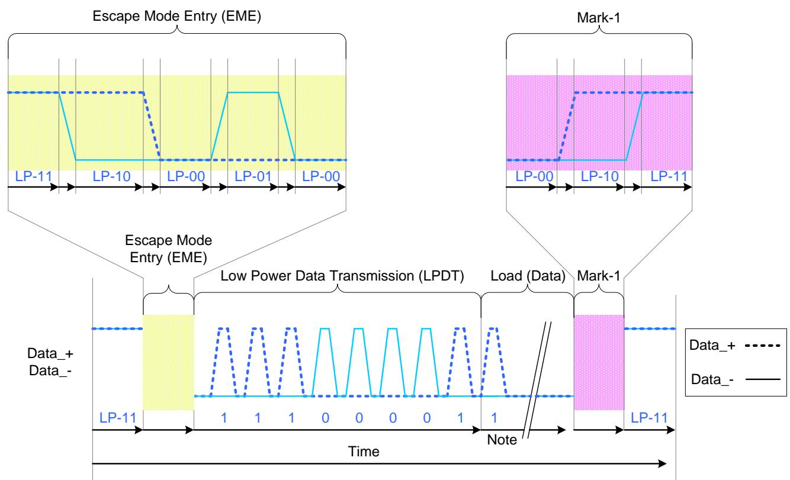  
Note : Load (Data) is presenting that the first bit is logical “1” in this Example

Notes:

Load(Data) is presenting that the first bit is logical '1' in this example

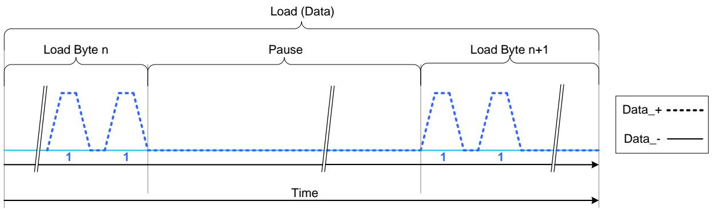  
Figure 36 Pause (Example)

# Ultra-Low Power State (ULPS)

The MCU can force data lanes in Ultra-Low Power State (ULPS) mode when data lanes are entering in Escape Mode.

The Ultra-Low Power State (ULPS) is using a following sequence:

Start: LP-11  
- Escape Mode Entry (EME): LP-11 =>LP-10 =>LP-00 =>LP-01 =>LP-00  
- Ultra-Low Power State (ULPS) command in Escape Mode: 0001110 (First to Last bit)  
- Ultra-Low Power State (ULPS) when the MCU is keeping data lanes low  
Mark-1: LP-00 =>LP-10 =>LP-11  
End: LP-11

This sequence is illustrated for reference purposes below:

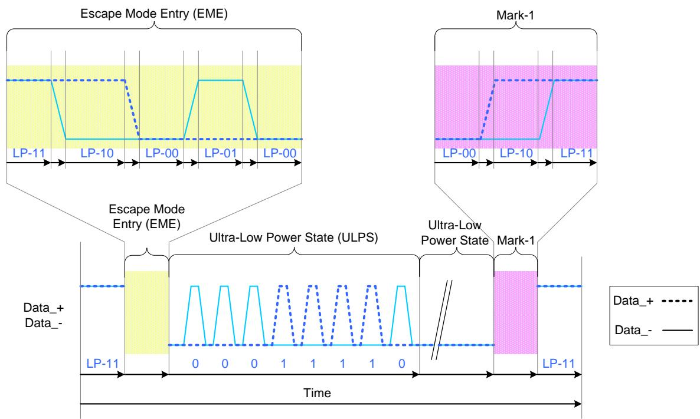  
Figure 37 Ultra-Low Power State (ULPS)

# Remote Application Reset (RAP)

The MCU can inform to the display module that it should be reset in Remote Application Reset (RAR) trigger when data lanes are entering in Escape Mode.

The Remote Application Reset (RAR) is using a following sequence:

Start: LP-11  
- Escape Mode Entry (EME): LP-11 =>LP-10 =>LP-00 =>LP-01 =>LP-00  
- Remote Application Reset (RAR) command in Escape Mode: 0110 0010 (First to Last bit)  
Mark-1: LP-00 =>LP-10 =>LP-11  
End: LP-11

This sequence is illustrated for reference purposes below:

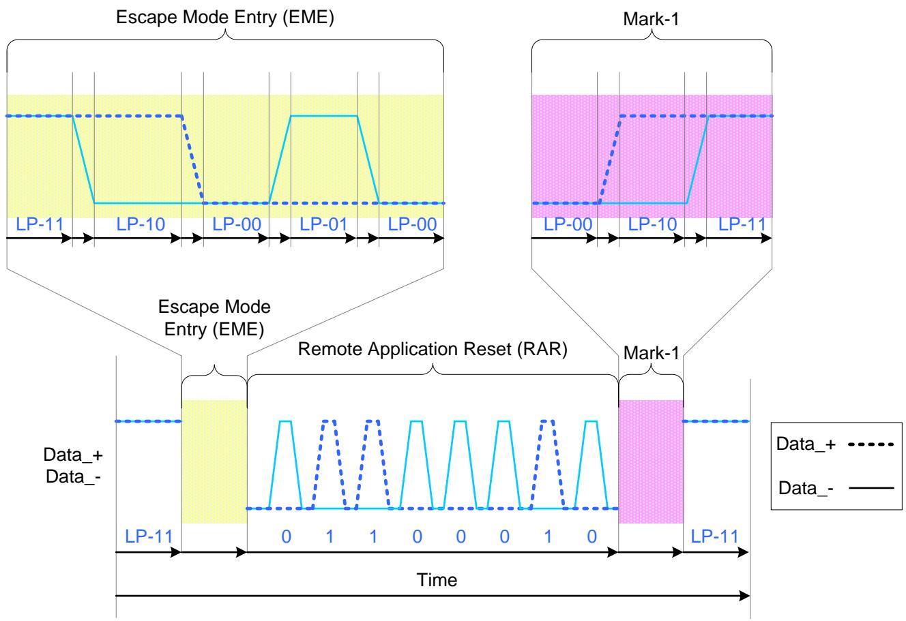  
Figure 38 Remote Application Reset (RAR)

# Tearing Effect (TEE)

The display module can inform to the MCU when a tearing effect event (New V-synch) has been happen on the display module by Tearing Effect (TEE).

The Tearing Effect (TEE) is using a following sequence:

Start: LP-11  
- Escape Mode Entry (EME): LP-11 =>LP-10 =>LP-00 =>LP-01 =>LP-00  
- Tearing Effect (TEE) trigger in Escape Mode: 0101 1101 (First to Last bit)  
Mark-1: LP-00 =>LP-10 =>LP-11  
End: LP-11

This sequence is illustrated for reference purposes below:

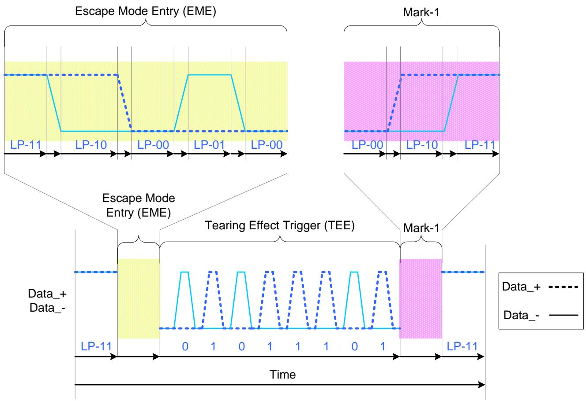  
Figure 39 Tearing Effect (TEE)

Note: Tearing Effect (TEE) can not be used in MIPI Video Mode

# Acknowledge (ACK)

The display module can inform to the MCU when an error has not recognized on it by Acknowledge (ACK).

The Acknowledge (ACK) is using a following sequence:

Start: LP-11  
- Escape Mode Entry (EME): LP-11 =>LP-10 =>LP-00 =>LP-01 =>LP-00  
- Acknowledge (ACK) command in Escape Mode: 0010 0001 (First to Last bit)  
Mark-1: LP-00 =>LP-10 =>LP-11  
End: LP-11

This sequence is illustrated for reference purposes below:

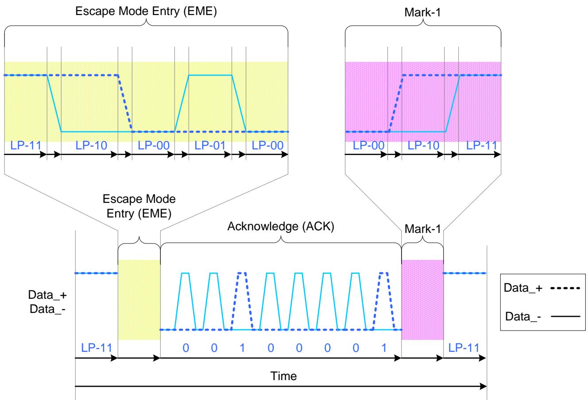  
Figure 40 Acknowledge (ACK)

# 8.7.2.2.3.3 HIGH SPEED DATA TRANSMISSION (HSDT)

# Entering High-Speed Data Transmission  $(T_{\mathrm{SOT}}$  of HSDT)

The display module is entering High-Speed Data Transmission (HSDT) when Clock lanes DSI-CLK+/- have already been entered in the High-Speed Clock Mode (HSCM) by the MCU. See more information on chapter "8.8.2.2.2.3 High-Speed Clock Mode (HSCM)".

Data lanes of the display module are entering (TSOT) in the High-Speed Data Transmission (HSDT) as follows

Start: LP-11  
- HS-Request: LP-01  
- HS-Settle: LP-00 => HS-0 (Rx: Lane Termination Enable)  
- Rx Synchronization: 011101 (Tx (= MCU) Synchronization: 0001 1101)  
- End: High-Speed Data Transmission (HSDT) – Ready to receive High-Speed Data Load

This same entering High-Speed Data Transmission (TSOT of HSDT) sequence is illustrated below

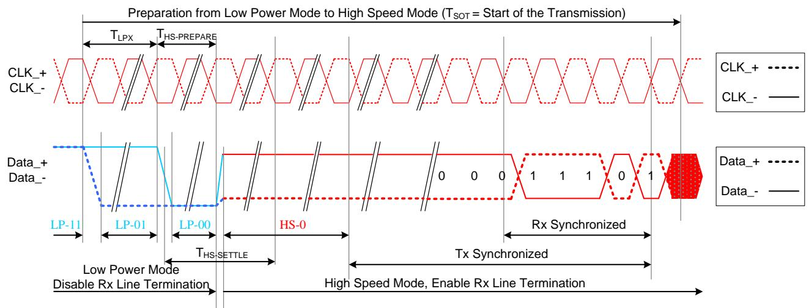  
Figure 41 Entering High-Speed Data transmission (TSOT of HSDT)

# Leaving High-Speed Data Transmission  $(\mathsf{T}_{\mathrm{EOT}}$  of HSDT)

The display module is leaving the High-Speed Data Transmission (TEOT of HSDT) when Clock lanes DSI-CLK+/- are in the High-Speed Clock Mode (HSCM) by the MCU and this HSCM is kept until data lanes are in LP-11 mode. See more information on chapter "5.3.2.2.2.3 High-Speed Clock Mode (HSCM)".

Data lanes of the display module are leaving from the High-Speed Data Transmission (TEOT of HSDT) as follows

- Start: High-Speed Data Transmission (HSDT)  
- Stops High-Speed Data Transmission  
- MCU changes to HS-1, if the last load bit is HS-0  
- MCU changes to HS-0, if the last load bit is HS-1  
- End: LP-11 (Rx: Lane Termination Disable)

This same leaving High-Speed Data Transmission (TEOT of HSDT) sequence is illustrated below

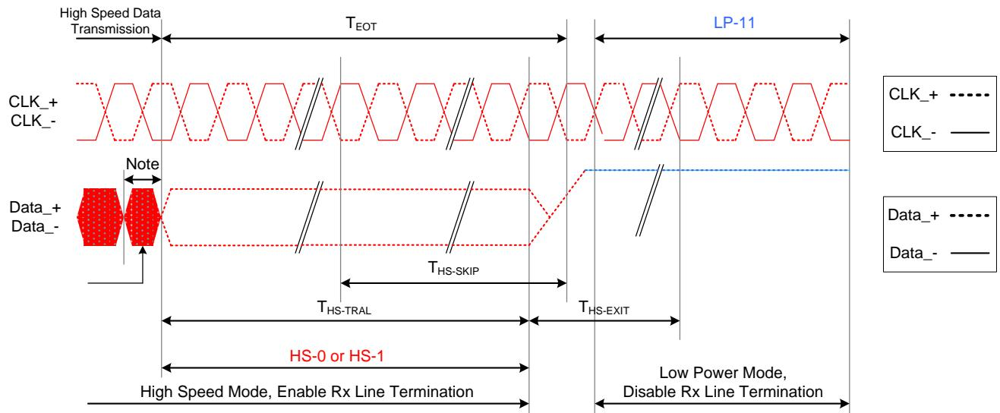  
Figure 42 Levaving High-Speed data Transmission (TEOT of HSDT)

# Burst of the High-Speed Data Transmission (HSDT)

The burst of the high-speed data transmission (HSDT) can consist of one data packet or several data packets.

These data packets can be Long (LPa) or Short (SPa) packets.

These different burst of the High-Speed Data Transmission (HSDT) cases are illustrated for reference purposes below.

Single Packet in High Speed Data Transmission

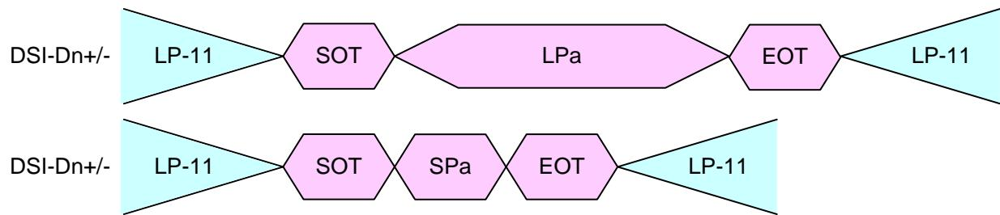

Multiple Packets in High Speed Data Transmission

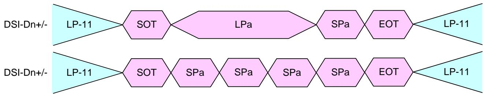  
Figure 43 HS Transmission Example with EoT packet disabled

Single Packet in High Speed Data Transmission

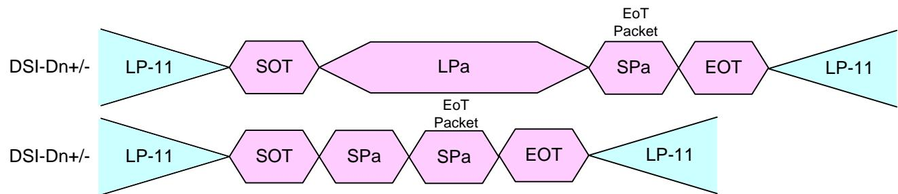

Multiple Packets in High Speed Data Transmission

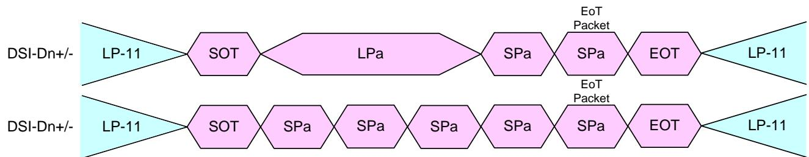  
Figure 44 HS Transmission Example with EoS packet enable

<table><tr><td>Abbreviation</td><td>Explanation</td></tr><tr><td>EOT</td><td>End of the Transmission</td></tr><tr><td>LPa</td><td>Long Packet</td></tr><tr><td>LP-11</td><td>Low Power Mode, Data lanes are’1’s (Stop Mode)</td></tr><tr><td>SPa</td><td>Short Packet</td></tr><tr><td>SOT</td><td>Start of the Transmission</td></tr></table>

# Bus Turnaround (BTA)

The MCU or display module, which is controlling DSI-D0+/- Data Lanes, can start a bus turnaround procedure when it wants information from a receiver, which can be the MCU or display module.

The MCU or display module are using the same sequence when this bus turnaround procedure is used. This sequence is described for reference purposes, when the MCU wants to do the bus turnaround procedure to the display module, as follow.

Start (MCU):LP-11  
- Turnaround Request (MCU): LP-11_LP-10_LP-00_LP-10_LP-00  
- The MCU wait until the display module is starting to control DSI-D0+/- data lanes and the MCU stop to control DSI-D0+/- data lanes (=High-Z)  
- The display module changes to the stop mode: LP-00_LP-10_LP-11

The same bus turnaround .procedure (From the MCU to the display module) is illustrated below.

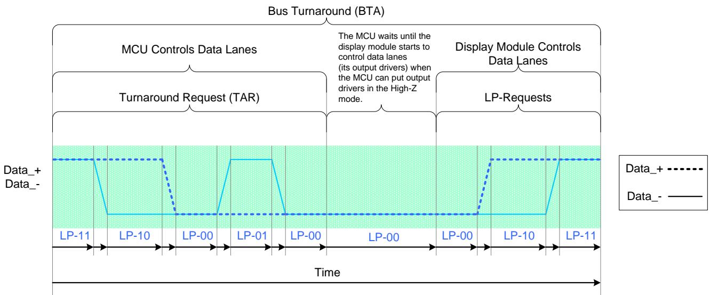  
Figure 45 Bus Turnaround Procedure

MCU and the display module terms are switched on above figure, if the Bus Turnaround (BTA) is from the display module to the MCU..

# 8.7.2.3 Packet Level Communication

# 8.7.2.3.1 Short Packet (SPA) And Long Packet (LPA) Structure

Short Packet (SPa) and Long Packet (LPa) are always used when data transmission is done in Low Power Data Transmission (LPDT) or High-Speed Data Transmission (HSDT) modes.

The lengths of the packets are

- Short Packet (SPa): 4 bytes  
- Long Packet (LPa): From 6 to 65,541 bytes

The type (SPa or LPa) of the packet can be recognized from their package headers (PH).

Short Packet (Spa) Structure:

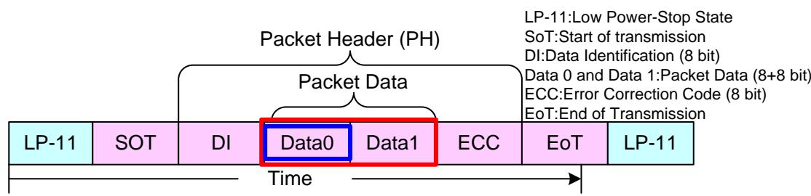

Long Packet (Spa) Structure:

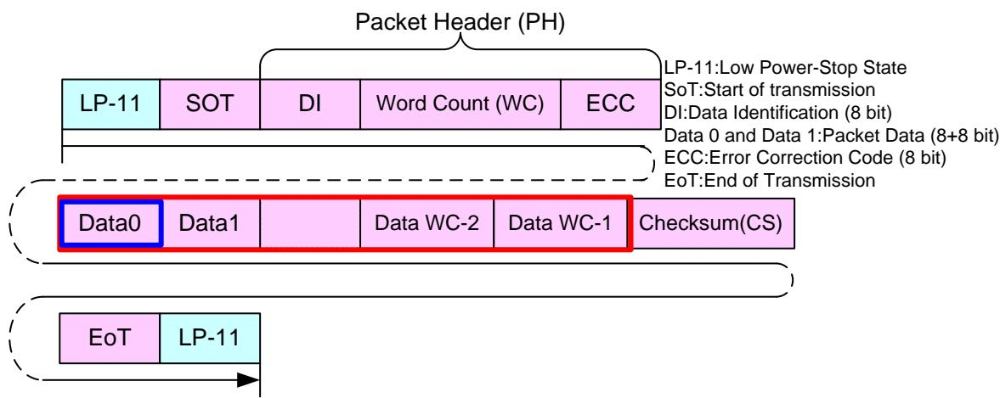

# Note:

Short Packet (SPa) Structure and Long Packet (LPa) Structure are presenting a single packet sending  $(= \text{Includes LP-11})$

SoT and EoT for each packet sendings).

The other possibility is that there is not needed SoT, EoT and LP-11 between packets if packets have sent in multiple

packet format e.g.

*  ${LP} - {11} \Rightarrow  {SoT} \Rightarrow  {SPa} \Rightarrow  {LPa} \Rightarrow  {SPa} \Rightarrow  {SPa} \Rightarrow  {EoT} \Rightarrow  {LP} - {11}$  
*  ${LP} - {11} \Rightarrow  {SoT} \Rightarrow  {SPa} \Rightarrow  {SPa} \Rightarrow  {SPa} \Rightarrow  {EoT} \Rightarrow  {LP} - {11}$  
*  ${LP} - {11} =  > {SoT} =  > L{P}_{a} =  > L{P}_{a} =  > L{P}_{a} =  > E{O}_{T} =  > {LP} - {11}$

# 8.7.2.3.1.1 Bit Order of the Byte on Packets

The bit order of the byte, what is used on packets, is that the Least Significant Bit (LSB) of the byte is sent in the first and the Most Significant Bit (MSB) of the byte is sent in the last.

This same order is illustrated for reference purposes below.

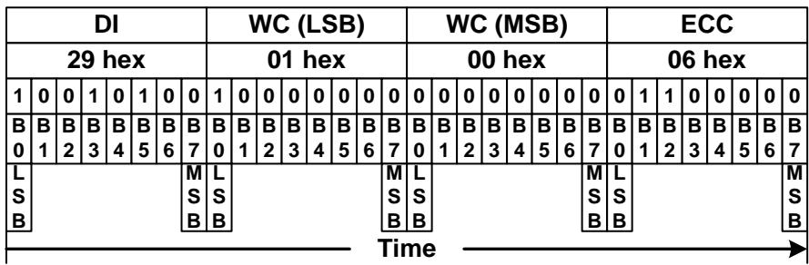  
Figure 46 Bit Order of Byte on Packets

# 8.7.2.3.1.2 Bit Order of the Multiple Byte Information on Packets

Byte order of the multiple bytes information, what is used on packets, is that the Least Significant (LS) Byte of the information is sent in the first and the Most Significant (MS) Byte of the information is sent in the last e.g. Word Count (WC) consists of 2 bytes (16 bits) when the LS byte is sent in the first and the MS byte is sent in the last.

This same order is illustrated for reference purposes below.

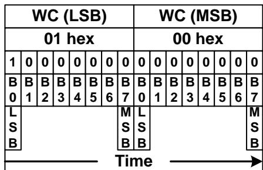  
Figure 47 Byte Order of the Multiple Byte on Packets

# 8.7.2.3.1.3

# Pack Header (PH)

The packet header is always consisting of 4 bytes. The content of these 4 bytes are different if it is used to Short Packet (SPa) or Long Packet (LPa).

Short Packet (SPa):

- 1st byte: Data Identification (DI) => Identification that this is Short Packet (SPa)  
- 2nd and 3rd bytes: Packet Data (PD), Data 0 and 1  
- 4th byte: Error Correction Code (ECC)

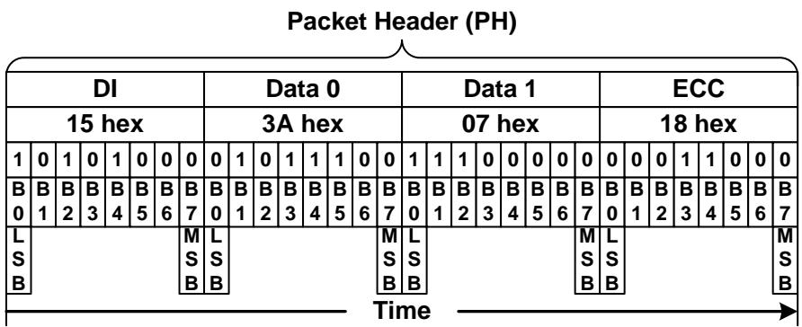  
Figure 48 Packet Header (PH) on Short Packet(Spa)

Long Packet (LPa):

- 1st byte: Data Identification (DI) => Identification that this is Long Packet (LPa)  
- 2nd and 3rd bytes: Word Count (WC)  
- 4th byte: Error Correction Code (ECC)

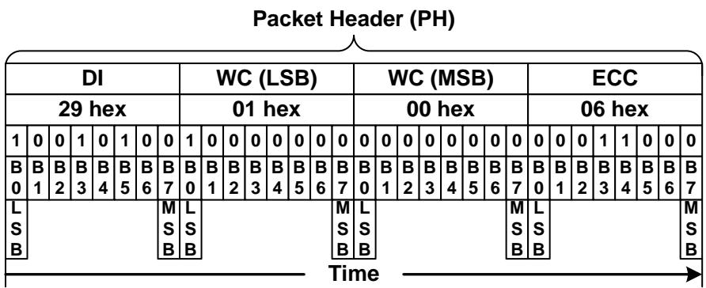  
Figure 49 Packet Header (PH) on Long Packet (LPa)

# Data Identification (DI)

Data Identification (DI) is a part of Packet Header (PH) and it consists of 2 parts:

- Virtual Channel (VC), 2 bits, DI[7...6]  
- Data Type (DT), 6 bits, DI[5...0]

The Data Identification (DI) structure is illustrated on a table below.

<table><tr><td colspan="8">Data Identification (DI)</td></tr><tr><td colspan="2">Virtual Channel (VC)</td><td colspan="6">Data Type (DT)</td></tr><tr><td>Bit 7</td><td>Bit 6</td><td>Bit 5</td><td>Bit 4</td><td>Bit 3</td><td>Bit 2</td><td>Bit 1</td><td>Bit 0</td></tr></table>

Figure 50 Data Identification (DI) Structure  

<table><tr><td colspan="9">DI</td><td colspan="8">WC (LSB)</td><td colspan="8">WC (MSB)</td><td colspan="8">ECC</td></tr><tr><td colspan="9">29 hex</td><td colspan="8">01 hex</td><td colspan="8">00 hex</td><td colspan="8">06 hex</td></tr><tr><td>1</td><td>0</td><td>0</td><td>1</td><td>0</td><td>1</td><td>0</td><td>0</td><td>1</td><td>0</td><td>0</td><td>0</td><td>0</td><td>0</td><td>0</td><td>0</td><td>0</td><td>0</td><td>0</td><td>0</td><td>0</td><td>0</td><td>0</td><td>0</td><td>0</td><td>1</td><td>1</td><td>0</td><td>0</td><td>0</td><td>0</td><td>0</td><td></td></tr><tr><td>B</td><td>B</td><td>B</td><td>B</td><td>B</td><td>B</td><td>B</td><td>B</td><td>B</td><td>B</td><td>B</td><td>B</td><td>B</td><td>B</td><td>B</td><td>B</td><td>B</td><td>B</td><td>B</td><td>B</td><td>B</td><td>B</td><td>B</td><td>B</td><td>B</td><td>B</td><td>B</td><td>B</td><td>B</td><td>B</td><td>B</td><td>B</td><td></td></tr><tr><td>0</td><td>1</td><td>2</td><td>3</td><td>4</td><td>5</td><td>6</td><td>7</td><td>0</td><td>1</td><td>2</td><td>3</td><td>4</td><td>5</td><td>6</td><td>6</td><td>7</td><td>0</td><td>1</td><td>2</td><td>3</td><td>4</td><td>5</td><td>6</td><td>7</td><td>0</td><td>1</td><td>2</td><td>3</td><td>4</td><td>5</td><td>6</td><td>7</td></tr><tr><td>L</td><td colspan="7"></td><td>M</td><td>L</td><td colspan="6"></td><td>M</td><td>L</td><td colspan="5"></td><td>M</td><td>L</td><td colspan="6"></td><td>M</td><td></td></tr><tr><td>S</td><td colspan="7"></td><td>S</td><td>S</td><td colspan="6"></td><td>S</td><td>S</td><td colspan="5"></td><td>S</td><td>S</td><td colspan="6"></td><td>S</td><td></td></tr><tr><td>B</td><td colspan="7"></td><td>B</td><td>B</td><td colspan="6"></td><td>B</td><td>B</td><td colspan="5"></td><td>B</td><td>B</td><td colspan="6"></td><td>B</td><td></td></tr><tr><td colspan="32">Time</td><td></td></tr></table>

Figure 51 Data Identification (DI) on the Packet Header(PH)

# Virtual Channel (VC)

Virtual Channel (VC) is a part of Data Identification (DI[7...6]) structure and it is used to address where a packet is wanted to send from the MCU.

Bits of the Virtual Channel (VC) are illustrated for reference purposes below.

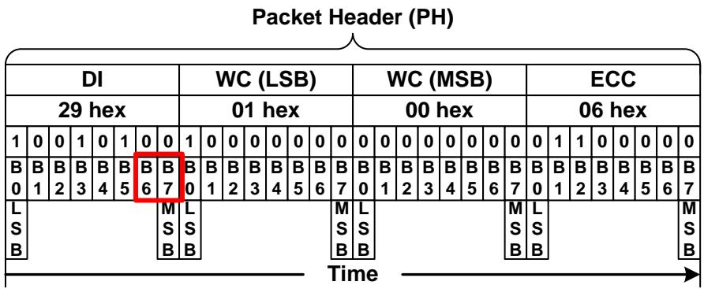  
Figure 52 Virtual Channel (VC) on the Packet Header (PH)

Virtual Channel (VC) can address 4 different channels for e.g. 4 different display modules. Devices are using the same virtual channel what the MCU is using to send packets to them e.g.

- The MCU is using the virtual channel 0 when it sends packets to this display module  
- This display module is also using the virtual channel 0 when it sends packets to the MCU

This functionality is illustrated below.

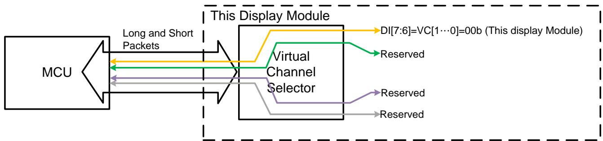

# Virtual Channel (VC) Configuration

Virtual Channel (VC) always 0 (D[7...6] = VC[1...0]00b) when the MCU is sending "End of Transmission Packet" to the display module. See section "End of Transmission Packet (EoTP)

This display module is not supporting the virtual channel selector for other device (1 to 3) when only possible virtual channel (VC[1...0]) is 00b for this display module.

# Data Type (DT)

Data Type (DT) is a part of Data Identification (DI[5...0]) structure and it is used to define a type of the used data on a packet.

Bits of the Data Type (DT) are illustrated for reference purposes below.

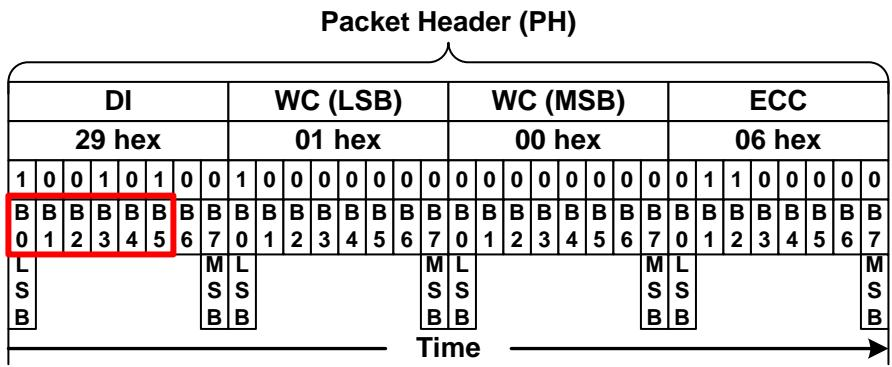  
Figure 53 Data Type (DT) on the Packet Header (PH)

This Data Type (DT) also defines what the used packet is: Short Packet (SPa) or Long Packet (LPa). Data Types (DT) are different from the MCU to the display module (or other devices) and vice versa.

These Data Type (DT) are defined on tables below.

<table><tr><td>Data Type
Hex</td><td>Data Type
Binary</td><td>Description</td><td>Packet
Size</td></tr><tr><td>01h</td><td>00 0001</td><td>Sync Event, V Sync Start.</td><td>Short</td></tr><tr><td>11h</td><td>01 0001</td><td>Sync Event, V Sync End.</td><td>Short</td></tr><tr><td>21h</td><td>10 0001</td><td>Sync Event, H Sync Start.</td><td>Short</td></tr><tr><td>31h</td><td>11 0001</td><td>Sync Event, H Sync End.</td><td>Short</td></tr><tr><td>08h</td><td>00 1000</td><td>End of Transmission (EoT) packet.</td><td>Short</td></tr><tr><td>02h</td><td>00 0010</td><td>Color Mode (CM) Off Command.</td><td>Short</td></tr><tr><td>12h</td><td>01 0010</td><td>Color Mode (CM) On Command.</td><td>Short</td></tr><tr><td>22h</td><td>10 0010</td><td>Shut Down Peripheral Command.</td><td>Short</td></tr><tr><td>32h</td><td>11 0010</td><td>Turn On Peripheral Command.</td><td>Short</td></tr><tr><td>03h</td><td>00 0011</td><td>Generic Short WRITE, no parameters</td><td>Short</td></tr><tr><td>13h</td><td>01 0011</td><td>Generic Short WRITE, 1 parameter.</td><td>Short</td></tr><tr><td>23h</td><td>10 0011</td><td>Generic Short WRITE, 2 parameters.</td><td>Short</td></tr><tr><td>04h</td><td>00 0100</td><td>Generic READ, no parameters.</td><td>Short</td></tr><tr><td>14h</td><td>01 0100</td><td>Generic READ, 1 parameter.</td><td>Short</td></tr><tr><td>24h</td><td>10 0100</td><td>Generic READ, 2 parameters.</td><td>Short</td></tr><tr><td>05h</td><td>00 0101</td><td>DCS WRITE, no parameter.</td><td>Short</td></tr><tr><td>15h</td><td>01 0101</td><td>DCS WRITE, 1 parameter.</td><td>Short</td></tr><tr><td>06h</td><td>00 0110</td><td>DCS READ, no parameter.</td><td>Short</td></tr><tr><td>37h</td><td>11 0111</td><td>Set Maximum Return Packet Size.</td><td>Short</td></tr><tr><td>09h</td><td>00 1001</td><td>Null Packet, no data.</td><td>Long</td></tr><tr><td>19h</td><td>01 1001</td><td>Blanking Packet, no data.</td><td>Long</td></tr><tr><td>29h</td><td>10 1001</td><td>Generic Long Write.</td><td>Long</td></tr><tr><td>39h</td><td>11 1001</td><td>DCS Long Write/write_LUT Command Packet.</td><td>Long</td></tr><tr><td>0Eh</td><td>00 1110</td><td>Packed Pixel Stream, 16-bit RGB,5-6-5 Format.</td><td>Long</td></tr><tr><td>1Eh</td><td>01 1110</td><td>Packed Pixel Stream, 18-bit RGB,6-6-6 Format.</td><td>Long</td></tr><tr><td>2Eh</td><td>10 1110</td><td>Loosely Packed Pixel Stream,18-bit RGB,6-6-6 Format</td><td>Long</td></tr><tr><td>3Eh</td><td>11 1110</td><td>Packed Pixel Stream,24-bit RGB,8-8-8 Format.</td><td>Long</td></tr></table>

Table 15 Data Type (DT) from MCU to the Display Module (or Other Devices)

<table><tr><td colspan="10">From the Display Module (or Other Devices) to the MCU</td></tr><tr><td>Hex</td><td>B 5</td><td>B 4</td><td>B 3</td><td>B 2</td><td>B 1</td><td>B 0</td><td>Description</td><td>Packet</td><td>Abbreviation</td></tr><tr><td>02h</td><td>0</td><td>0</td><td>0</td><td>0</td><td>1</td><td>0</td><td>Acknowledge with Error Report</td><td>Short</td><td>AwER</td></tr><tr><td>1Ch</td><td>0</td><td>1</td><td>1</td><td>1</td><td>0</td><td>0</td><td>DCS Read Long Response</td><td>Short</td><td>DCSRR_L</td></tr><tr><td>21h</td><td>1</td><td>0</td><td>0</td><td>0</td><td>0</td><td>1</td><td>DCS Read Short Response, 1 byte returned</td><td>Short</td><td>DCSRR1_S</td></tr><tr><td>22h</td><td>1</td><td>0</td><td>0</td><td>0</td><td>1</td><td>0</td><td>DCS Read Short Response, 2 byte returned</td><td>Short</td><td>DCSRR2_S</td></tr><tr><td>1Ah</td><td>0</td><td>1</td><td>1</td><td>0</td><td>1</td><td>0</td><td>Generic Read Long Response</td><td>Short</td><td>GENRR-L</td></tr><tr><td>11h</td><td>0</td><td>1</td><td>0</td><td>0</td><td>0</td><td>1</td><td>Generic Read Short Response,1 byte returned</td><td>Short</td><td>GENRR1-S</td></tr><tr><td>12h</td><td>0</td><td>1</td><td>0</td><td>0</td><td>1</td><td>0</td><td>Generic Read Short Response,2 byte returned</td><td>Short</td><td>GENRR2-S</td></tr></table>

Table 16 Data Type (DT) from the Display Module (or Other Devices) to the MCU

The receiver will ignore other Data Type (DT) if they are not defined on tables: "Data Type (DT) from the MCU to the Display Module (or Other Devices)" or "Data Type (DT) from the Display Module (or Other Devices) to the MCU".

# Packet Data (PD) on the Short Packet (SPa)

Packet Data (PD) of the Short Packet (SPa) is defined after Data Type (DT) of the Data Identification (DI) has indicated that Short Packet (SPa) is wanted to send.

The Word Count (WC) indicates the number of Bytes of Packet of Packet Data (PD) send after the Packet Header.

Packet Data (PD) of the Short Packet (SPa) consists of 2 data bytes: Data 0 and Data 1.

Packet Data (PD) sending order is that Data 0 is sent in the first and the Data 1 is sent in the last.

Bits of Data 1 are set to '0' if the information length is 1 byte.

Packet Data (PD) of the Short Packet (SPa), when the length of the information is 1 or 2 bytes are illustrated for reference purposes below, when Virtual Channel (VC) is 0.

Packet Data (PD) information:

- Data 0: 35hex (Display Command Set (DCS) with 1 Parameter => DI(Data Type (DT)) = 15hex)  
Data 1: 01hex (DCS's parameter)

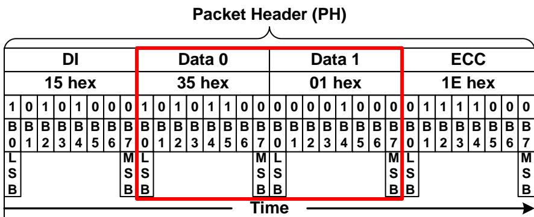  
Figure 54 Packet Data (PD) for Short Packet (SPa), 2 Bytes Information

Packet Data (PD) information:

- Data 0: 10hex (DCS without parameter => DI(Data Type (DT)) = 05hex)  
- Data 1: 00hex (Null)

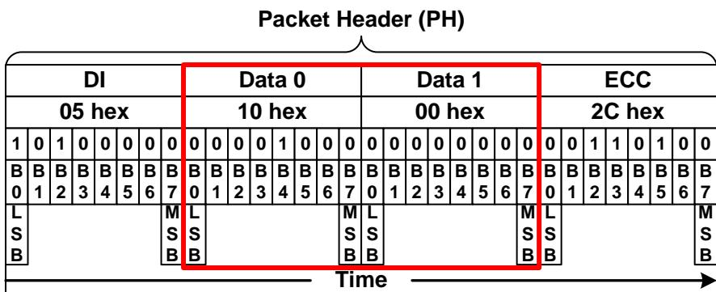  
Figure 55 Packet Data(PD) fo Short Packet (Spa), 1 Bytes Information

# Word Count (WC) on the Long Packet (LPa)

Word Count (WC) of the Long Packet (LPa) is defined after Data Type (DT) of the Data Identification (DI) has indicated that Long Packet (LPa) is wanted to send.

Word Count (WC) indicates a number of the data bytes of the Packet Data (PD) what is wanted to send after Packet Header (PH) versus Packet Data (PD) of the Short Packet (SPa) is placed in the Packet Header (PH).

Word Count (WC) of the Long Packet (LPa) consists of 2 bytes.

These 2 bytes of the Word Count (WC) sending order is that the Least Significant (LS) Byte is sent in the first and the Most Significant (MS) Byte is sent in the last.

Word Count (WC) of the Long Packet (LPa) is illustrated for reference purposes below.

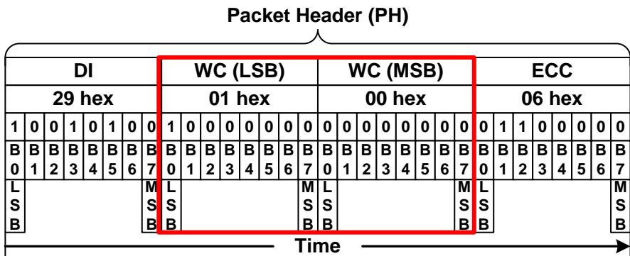  
Figure 56 Word Count (WC) on the Long Packet (LPa)

# Short Packet:

# Long Packet:

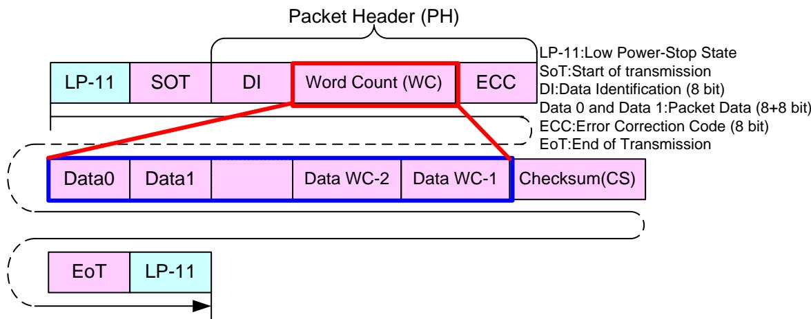

# Error Correction Code (ECC)

Error Correction Code (ECC) is a part of Packet Header (PH) and its purpose is to identify an error or errors on the Packet Header (PH):

The ECC protects the following field

- Short Packet (SPa): Data Identification (DI) byte (8 bits, D[0...7]), Packet Data (PD) bytes (16 bits, D[8...23]) and ECC(8 bits: P[0...7])  
- Long Packet (LPa): Data Identification (DI) byte (8 bits, D[0...7]), Word Count (WC) bytes (16 bits: D[8...23]) and ECC (8 bits, P[0...7])

D[23...0] and P[7...0] are illustrated for reference purposes below.

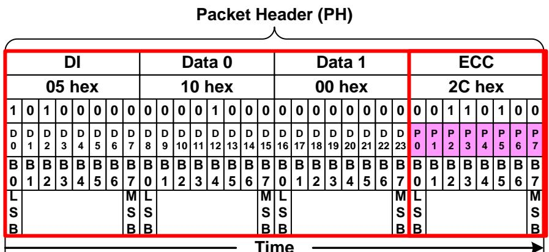  
D[23..0] and P[7...0] on the Short Packet (SPa)

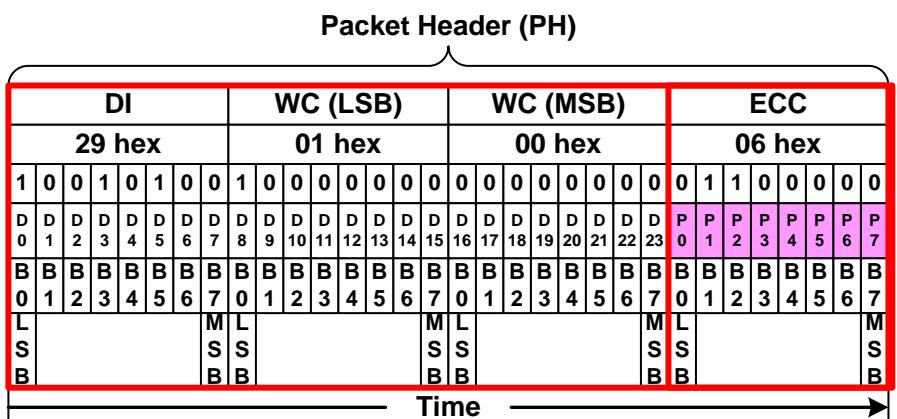  
D[23···0] and P[7···0] on the Long Packet (LPa)

Error Correction Code (ECC) can recognize one error or several errors and makes correction in one bit error case.

Bits (P[7...0]) of the Error Correction Code (ECC) are defined, where the symbol ‘ $\wedge$ ’ is presenting XOR function (Pn is ‘1’ if there is odd number of ‘1’s and Pn is ‘0’ if there is even number of ‘1’s), as follows.

·P7=0  
·P6=0  
- P5 = D10^D11^D12^D13^D14^D15^D16^D17^D18^D19^D21^D22^D23  
- P4 = D4^D5^D6^D7^D8^D9^D16^D17^D18^D19^D20^D22^D23  
- P3 = D1^D2^D3^D7^D8^D9^D13^D14^D15^D19^D20^D21^D23  
- P2 = D0^D2^D3^D5^D6^D9^D11^D12^D15^D18^D20^D21^D22  
- P1 = D0^D1^D3^D4^D6^D8^D10^D12^D14^D17^D20^D21^D22^D23  
- P0 = D0^D1^D2^D4^D5^D7^D10^D11^D13^D16^D20^D21^D22^D23

P7 and P6 are set to '0' because Error Correction Code (ECC) is based on 64 bit value ([D63...0]), but this implementation is based on 24 bit value (D[23...0]). Therefore, there is only needed 6 bits (P[5...0]) for Error Correction Code (ECC).

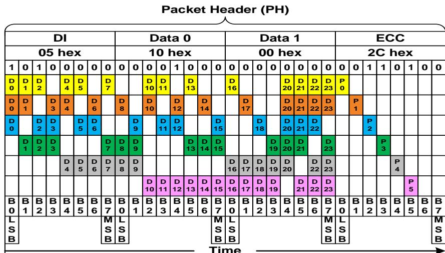  
XOR Functionality on the Short Packet (SPa)

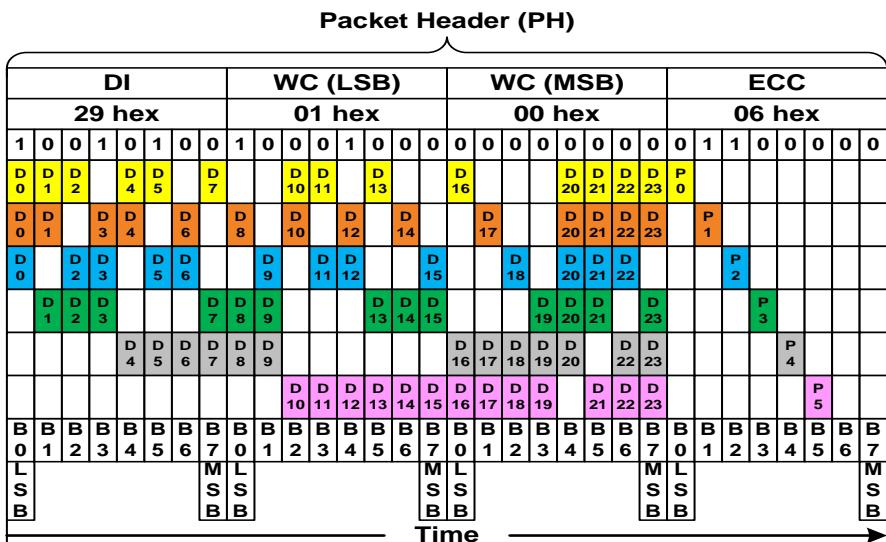  
XOR Functionality on the Long Packet (LPa)

The transmitter (The MCU or the Display Module) is sending data bits D[23...0] and Error Correction Code (ECC) P[7...0]. The receiver (The Display module or the MCU) is calculate an Internal Error Correction Code (IECC) and compares the received Error Correction Code (ECC) and the Internal Error Correction Code (IECC). This comparison is done when each power bit of ECC and IECC have been done XOR function. The result of this function is PO[7...0].

This functionality, where the transmitter is the MCU and the receiver is the display module, is illustrated for reference purposes below.

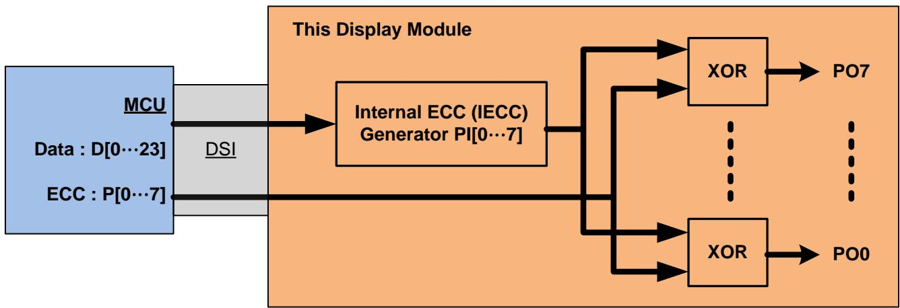  
Figure 57 Internal Error Correction Code (IECC) on the Display Module (The Receiver)

The sent data bits (D[23...0]) and ECC (P[7...0]) are received correctly, if a value of the PO[7...0]) is 00h. The sent data bits (D[23...0]) and ECC (P[7...0]) are not received correctly, if a value of the PO[7...0]) is not 00h.

<table><tr><td>ECC P[7...0]</td><td>1</td><td>1</td><td>0</td><td>0</td><td>0</td><td>0</td><td>0</td><td>0</td><td>03h</td></tr><tr><td>IECC PI[7...0]</td><td>1</td><td>1</td><td>0</td><td>0</td><td>0</td><td>0</td><td>0</td><td>0</td><td>03h</td></tr><tr><td>XOR(ECC,IECC) =&gt;PO[7...0]</td><td>0</td><td>0</td><td>0</td><td>0</td><td>0</td><td>0</td><td>0</td><td>0</td><td>=00h=&gt;No Error</td></tr><tr><td></td><td>L</td><td></td><td></td><td></td><td></td><td></td><td>M</td><td></td><td></td></tr><tr><td></td><td>S</td><td></td><td></td><td></td><td></td><td></td><td>S</td><td></td><td></td></tr><tr><td></td><td>B</td><td></td><td></td><td></td><td></td><td></td><td>B</td><td></td><td></td></tr></table>

Internal XOR Calculation between ECC and IECC Values-No Error  

<table><tr><td>ECC P[7...0]</td><td>1</td><td>1</td><td>0</td><td>0</td><td>0</td><td>0</td><td>0</td><td>0</td><td>03h</td></tr><tr><td>IECC PI[7...0]</td><td>1</td><td>1</td><td>1</td><td>1</td><td>0</td><td>0</td><td>0</td><td>0</td><td>0Fh</td></tr><tr><td>XOR(ECC,IECC) =&gt;PO[7...0]</td><td>0</td><td>0</td><td>1</td><td>1</td><td>0</td><td>0</td><td>0</td><td>0</td><td>=0Ch=&gt;Error</td></tr><tr><td></td><td>L</td><td></td><td></td><td></td><td></td><td></td><td></td><td>M</td><td></td></tr><tr><td></td><td>S</td><td></td><td></td><td></td><td></td><td></td><td></td><td>S</td><td></td></tr><tr><td></td><td>B</td><td></td><td></td><td></td><td></td><td></td><td></td><td>B</td><td></td></tr></table>

Internal XOR Calculation between ECC and IECC Values- Error

The received Error Correction Code (ECC) can be 00h when the Error Correction Code (ECC) functionality is not used for data values D[23...0] on the transmitter side.

The number of the errors (one or more) can be defined when the value of the PO[7...0] is compared to values on the following table.

<table><tr><td>Data Bit</td><td>PO7</td><td>PO6</td><td>PO5</td><td>PO4</td><td>PO3</td><td>PO2</td><td>PO1</td><td>PO0</td><td>Hex</td></tr><tr><td>D[0]</td><td>0</td><td>0</td><td>0</td><td>0</td><td>0</td><td>1</td><td>1</td><td>1</td><td>07h</td></tr><tr><td>D[1]</td><td>0</td><td>0</td><td>0</td><td>0</td><td>1</td><td>0</td><td>1</td><td>1</td><td>0Bh</td></tr><tr><td>D[2]</td><td>0</td><td>0</td><td>0</td><td>0</td><td>1</td><td>1</td><td>0</td><td>1</td><td>0Dh</td></tr><tr><td>D[3]</td><td>0</td><td>0</td><td>0</td><td>0</td><td>1</td><td>1</td><td>1</td><td>0</td><td>0Eh</td></tr><tr><td>D[4]</td><td>0</td><td>0</td><td>0</td><td>1</td><td>0</td><td>0</td><td>1</td><td>1</td><td>13h</td></tr><tr><td>D[5]</td><td>0</td><td>0</td><td>0</td><td>1</td><td>0</td><td>1</td><td>0</td><td>1</td><td>15h</td></tr><tr><td>D[6]</td><td>0</td><td>0</td><td>0</td><td>1</td><td>0</td><td>1</td><td>1</td><td>0</td><td>16h</td></tr><tr><td>D[7]</td><td>0</td><td>0</td><td>0</td><td>1</td><td>1</td><td>0</td><td>0</td><td>1</td><td>19h</td></tr><tr><td>D[8]</td><td>0</td><td>0</td><td>0</td><td>1</td><td>1</td><td>0</td><td>1</td><td>0</td><td>1Ah</td></tr><tr><td>D[9]</td><td>0</td><td>0</td><td>0</td><td>1</td><td>1</td><td>1</td><td>0</td><td>0</td><td>1Ch</td></tr><tr><td>D[10]</td><td>0</td><td>0</td><td>1</td><td>0</td><td>0</td><td>0</td><td>1</td><td>1</td><td>23h</td></tr><tr><td>D[11]</td><td>0</td><td>0</td><td>1</td><td>0</td><td>0</td><td>1</td><td>0</td><td>1</td><td>25h</td></tr><tr><td>D[12]</td><td>0</td><td>0</td><td>1</td><td>0</td><td>0</td><td>1</td><td>1</td><td>0</td><td>26h</td></tr><tr><td>D[13]</td><td>0</td><td>0</td><td>1</td><td>0</td><td>1</td><td>0</td><td>0</td><td>1</td><td>29h</td></tr><tr><td>D[14]</td><td>0</td><td>0</td><td>1</td><td>0</td><td>1</td><td>0</td><td>1</td><td>0</td><td>2Ah</td></tr><tr><td>D[15]</td><td>0</td><td>0</td><td>1</td><td>0</td><td>1</td><td>1</td><td>0</td><td>0</td><td>2Ch</td></tr><tr><td>D[16]</td><td>0</td><td>0</td><td>1</td><td>1</td><td>0</td><td>0</td><td>0</td><td>1</td><td>31h</td></tr><tr><td>D[17]</td><td>0</td><td>0</td><td>1</td><td>1</td><td>0</td><td>0</td><td>1</td><td>0</td><td>32h</td></tr><tr><td>D[18]</td><td>0</td><td>0</td><td>1</td><td>1</td><td>0</td><td>1</td><td>0</td><td>0</td><td>34h</td></tr><tr><td>D[19]</td><td>0</td><td>0</td><td>1</td><td>1</td><td>1</td><td>0</td><td>0</td><td>0</td><td>38h</td></tr><tr><td>D[20]</td><td>0</td><td>0</td><td>0</td><td>1</td><td>1</td><td>1</td><td>1</td><td>1</td><td>1Fh</td></tr><tr><td>D[21]</td><td>0</td><td>0</td><td>1</td><td>0</td><td>1</td><td>1</td><td>1</td><td>1</td><td>2Fh</td></tr><tr><td>D[22]</td><td>0</td><td>0</td><td>1</td><td>1</td><td>0</td><td>1</td><td>1</td><td>1</td><td>37h</td></tr><tr><td>D[23]</td><td>0</td><td>0</td><td>1</td><td>1</td><td>1</td><td>0</td><td>1</td><td>1</td><td>3Bh</td></tr></table>

One error is detected if the value of the PO[7...0] is on : One Bit Error Value of the Error Correction Code (ECC) and the receiver can correct this one bit error because this found value also defines what is a location of the corrupt bit e.g.

- PO[7...0] = 0Eh  
- The bit of the data (D[23...0]), what is not correct, is D[3]

More than one error is detected if the value of the PO[7...0] is not on: One Bit Error Value of the Error Correction Code (ECC) e.g. PO[7...0] = 0Ch.

# 8.7.2.3.1.4 Packet Data (PD) on the Long Packet (LPa)

Packet Data (PD) of the Long Packet (LPa) is defined after Packet Header (PH) of the Long Packet (LPa). The number of the data bytes is defined on chapter "Word Count (WC) on the Long Packet (LPa)".

# 8.7.2.3.1.5 Packet Footer (PF) on the Long Packet (LPa)

Packet Footer (PF) of the Long Packet (LPa) is defined after the Packet Data (PD) of the Long Packet (LPa). The Packet Footer (PF) is a checksum value what is calculated from the Packet Data of the Long Packet (LPa).

The checksum is using a 16-bit Cyclic Redundancy Check (CRC) value which is generated with a polynomial  $X16 + X12 + X5 + X0$  as it is illustrated below.

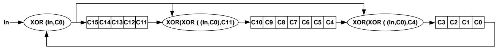  
Figure 58 16-bit Cyclic Redundancy Check (CRC) Calculation

The 16-bit Cyclic Redundancy Check (CRC) generator is initialized to FFFFh before calculations. The Least Significant Bit (LSB) of the data byte of the Packet Data (PD) is the first bit what is inputted into the 16-bit Cyclic Redundancy Check (CRC).

An example of the 16-bit Cyclic Redundancy Check (CRC), where the Packet Data (PD) of the Long Packet (LPa) is 01h, is illustrated (step-by-step) below.

<table><tr><td>Stop</td><td>In</td><td>XOR(In,C0)</td><td>C15</td><td>C14</td><td>C13</td><td>C12</td><td>C11</td><td>XOR(XOR(In,C0),C11(Step-1))</td><td>C10</td><td>C9</td><td>C8</td><td>C7</td><td>C6</td><td>C5</td><td>C4</td><td>XOR(XOR(In,C0),C4(Step-1))</td><td>C3</td><td>C2</td><td>C1</td><td>C0</td><td>C0</td></tr><tr><td>0</td><td>X</td><td>X</td><td>1</td><td>1</td><td>1</td><td>1</td><td>1</td><td>X</td><td>1</td><td>1</td><td>1</td><td>1</td><td>1</td><td>1</td><td>1</td><td>X</td><td>1</td><td>1</td><td>1</td><td>1</td><td>X</td></tr><tr><td>1</td><td>1(LSB)</td><td>0</td><td>0</td><td>1</td><td>1</td><td>1</td><td>1</td><td>1</td><td>1</td><td>1</td><td>1</td><td>1</td><td>1</td><td>1</td><td>1</td><td>1</td><td>1</td><td>1</td><td>1</td><td>1</td><td>1</td></tr><tr><td>2</td><td>0</td><td>1</td><td>1</td><td>0</td><td>1</td><td>1</td><td>1</td><td>0</td><td>0</td><td>1</td><td>1</td><td>1</td><td>1</td><td>1</td><td>1</td><td>0</td><td>0</td><td>1</td><td>1</td><td>1</td><td>1</td></tr><tr><td>3</td><td>0</td><td>1</td><td>1</td><td>1</td><td>0</td><td>1</td><td>1</td><td>0</td><td>0</td><td>0</td><td>1</td><td>1</td><td>1</td><td>1</td><td>1</td><td>0</td><td>0</td><td>0</td><td>1</td><td>1</td><td>1</td></tr><tr><td>4</td><td>0</td><td>1</td><td>1</td><td>1</td><td>1</td><td>0</td><td>1</td><td>0</td><td>0</td><td>0</td><td>0</td><td>1</td><td>1</td><td>1</td><td>1</td><td>0</td><td>0</td><td>0</td><td>0</td><td>1</td><td>1</td></tr><tr><td>5</td><td>0</td><td>1</td><td>1</td><td>1</td><td>1</td><td>1</td><td>0</td><td>0</td><td>0</td><td>0</td><td>0</td><td>0</td><td>1</td><td>1</td><td>1</td><td>0</td><td>0</td><td>0</td><td>0</td><td>0</td><td>0</td></tr><tr><td>6</td><td>0</td><td>0</td><td>0</td><td>1</td><td>1</td><td>1</td><td>1</td><td>0</td><td>0</td><td>0</td><td>0</td><td>0</td><td>0</td><td>1</td><td>1</td><td>1</td><td>1</td><td>0</td><td>0</td><td>0</td><td>0</td></tr><tr><td>7</td><td>0</td><td>0</td><td>0</td><td>0</td><td>1</td><td>1</td><td>1</td><td>1</td><td>1</td><td>0</td><td>0</td><td>0</td><td>0</td><td>0</td><td>0</td><td>1</td><td>1</td><td>1</td><td>0</td><td>0</td><td>0</td></tr><tr><td>8</td><td>0(MSB)</td><td>0</td><td>0</td><td>0</td><td>0</td><td>1</td><td>1</td><td>1</td><td>1</td><td>1</td><td>0</td><td>0</td><td>0</td><td>0</td><td>0</td><td>1</td><td>1</td><td>1</td><td>1</td><td>0</td><td>0</td></tr><tr><td></td><td>1 Byte</td><td>CRC Resoult</td><td>0</td><td>0</td><td>0</td><td>1</td><td>1</td><td></td><td>1</td><td>1</td><td>0</td><td>0</td><td>0</td><td>0</td><td>0</td><td></td><td>1</td><td>1</td><td>1</td><td>0</td><td></td></tr><tr><td></td><td></td><td></td><td>LSB</td><td></td><td></td><td></td><td></td><td></td><td></td><td></td><td></td><td></td><td></td><td></td><td></td><td></td><td></td><td></td><td></td><td>LSB</td><td></td></tr></table>

Figure 59 CRC Calculation - Packet Data (PD) is 01h

A value of the Packet Footer (PF) is 1E0Eh in this example. This example (Command 01h has been sent) is illustrated below.

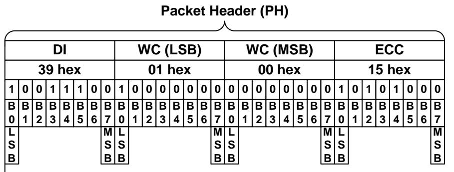

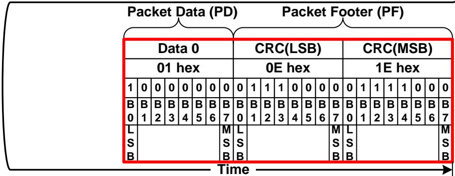  
Figure 60 Packet Footer (PF) Example

The receiver is calculated own checksum value from received Packet Data (PD). The receiver compares own checksum and the Packet Footer (PF) what the transmitter has sent.

The received Packet Data (PD) and Packet Footer (PF) are correct if the own checksum of the receiver and Packet Footer (PF) are equal and vice versa the received Packet Data (PD) and Packet Footer (PF) are not correct if the own checksum of the receiver and Packet Footer (PF) are not equal.

8.7.2.3.2 Packet Transmissions  
8.7.2.3.2.1 Packet from the MCU to the Display Module

# Display Command Set (DCS)

Display Command Set (DCS), which is defined on chapter "9 Instruction Description", is used from the MCU to the display module. This Display Command Set (DCS) is always defined on the Data 0 of the Packet Data (PD), which is included in Short Packet (SPa) and Long packet (LPa) as these are illustrated below.

Short Packet

Long Packet:

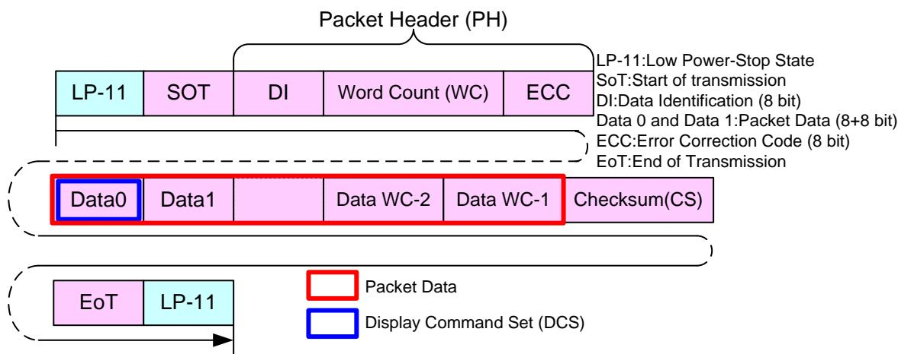  
Figure 61 Display Command Set (DCS) on Short Packet (SPa) and Long Packet (LPa)

# Generic Write, 1 Parameter (GENW1-S), Data Type = 010011 (13h)

"Generic Write, 1 Parameter" (GENW1-S) is always using a Short Packet (SPa), what is defined on Data Type (DT, 01 0011b), from the MCU to the display module. The content of 2 payload bytes is "command" and 00h.

These commands are defined on a table (See chapter "9 Instruction Description") below

<table><tr><td>Command</td></tr><tr><td>NOP (00h)</td></tr><tr><td>SWRESET (01h)</td></tr><tr><td>SLPIN (10H)</td></tr><tr><td>SLPOUT (11h)</td></tr><tr><td>PTLON (12h)</td></tr><tr><td>NORON (13h)</td></tr><tr><td>INVOFF (20h)</td></tr><tr><td>INVON (21h)</td></tr><tr><td>ALLPOFF (22h)</td></tr><tr><td>ALLPON (23h)</td></tr><tr><td>DISPOFF (28h)</td></tr><tr><td>DISPON (29h)</td></tr><tr><td>IDMOFF (38h)</td></tr><tr><td>IDMON (39h)</td></tr></table>

Short Packet (SPa) is defined e.g.

Data Identification (DI)

- Virtual Channel (VC, DI[7...6]): 00b

- Data Type (DT, DI[5...0]): 01 0011b

- Packet Data (PD)

- Data 0: "Sleep In (10h)", Display Command Set (DCS)

Data 1: Always 00hex

- Error Correction Code (ECC)

This is defined on the Short Packet (SPa) as follows.

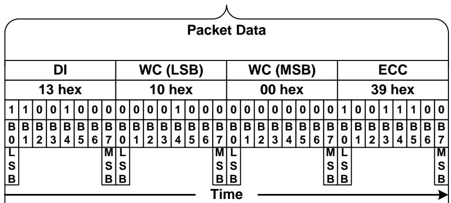  
Figure 62 Generic Write,1 Parameter (GENW1-S)-Example

# Generic Write, 2 Parameter (GENW2-S), Data Type = 10 0011 (23h)

"Generic Write, 2 Parameter" (GENW2-S) is always using a Short Packet (SPa), what is defined on Data Type (DT, 10 0011b), from the MCU to the display module. The content of 2 payload bytes is "command" and

"parameter". These commands are defined on a table (See chapter "6 Instruction Description") below.

<table><tr><td>Command</td></tr><tr><td>GAMSET (26h)</td></tr><tr><td>COLMOD (3Ah)</td></tr><tr><td>WRDISBV (51h)</td></tr><tr><td>WRCTRLD (53h)</td></tr><tr><td>WRCABC (55h)</td></tr><tr><td>WRCABCMB (5Eh)</td></tr></table>

Short Packet (SPa) is defined e.g.

Data Identification (DI)

- Virtual Channel (VC, DI[7...6]): 00b  
- Data Type (DT, DI[5...0]): 10 0011b

- Packet Data (PD)

- Data 0: "PMCSET (3Ah)", Display Command Set (DCS)  
- Data 1: 01hex, Parameter of the DCS

- Error Correction Code (ECC)

This is defined on the Short Packet (SPa) as follows.

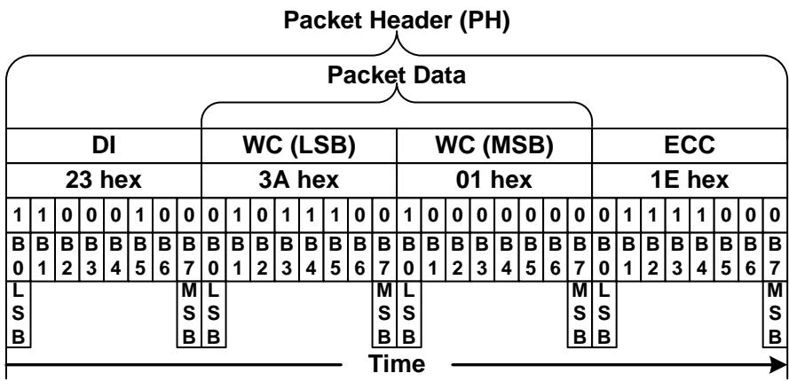  
Figure 63 Generic Write, 2 Parameter (GENW2-S) - Example

# Generic Write Long (GENW-L), Data Type = 10 1001 (29h)

"Generic Write Long" (GENW-L) is always using a Long Packet (LPa), what is defined on Data Type (DT, 10 1001b), from the MCU to the display module. Command (No Parameters) and Write (1 or more parameters), are defined on a table (See chapter "6 Instruction Description") below.

<table><tr><td colspan="3">Command</td></tr><tr><td>NOP (00h), Note1</td><td>INVON (21h), Note1</td><td>IDMOFF (38h), Note1</td></tr><tr><td>SWRESET (01h), Note1</td><td>ALLPOFF (22h)</td><td>IDMON (39h), Note1</td></tr><tr><td>SLPIN (10H), Note1</td><td>ALLPON (23h)</td><td>COLMOD (3Ah), Note2</td></tr><tr><td>SLPOUT (11h), Note1</td><td>GAMSET (26h), , Note2</td><td>WRDISBV (51h), Note2</td></tr><tr><td>PTLON (12h), Note1</td><td>DISPOFF (28h), Note1</td><td>WRCTRLD (53h), Note2</td></tr><tr><td>NORON (13h), Note1</td><td>DISPON (29h), Note1</td><td>WRCABC (55h), Note2</td></tr><tr><td>INVOFF (20h), Note1</td><td>PARLINES (C5h)</td><td>WRCABCMB (5E), Note2</td></tr></table>

Notes : 1. Also Short Packet (SPa) can be used; See Generic Write, 1 Parameter.  
2. Also Short Packet (SPa) can be used; See Generic Write, 2 Parameter.c

Long Packet (LPa), when a command (No Parameter) was sent, is defined e.g.

Data Identification (DI)

- Virtual Channel (VC, DI[7...6]): 00b  
- Data Type (DT, DI[5...0]): 10 1001b

- Word Count (WC)  
- Word Count (WC): 0001h

- Error Correction Code (ECC)  
- Packet Data (PD): Data 0: "Sleep In (10h)", Display Command Set (DCS)  
- Packet Footer (PF)

This is defined on the Long Packet (LPa) as follows.

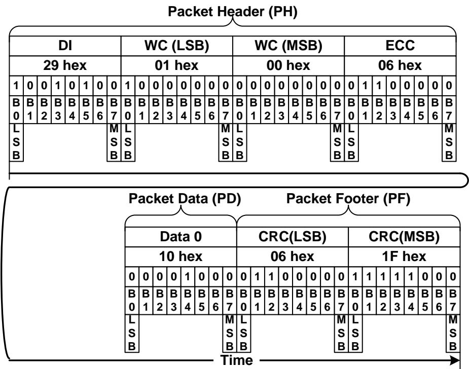  
Figure 64 Generic Long Write(GENW-L) with DCS Only - Example

Long Packet (LPa), when a Write (1 parameter) was sent, is defined e.g.

Data Identification (DI)  
- Virtual Channel (VC, DI[7...6]): 00b  
- Data Type (DT, DI[5...0]): 10 1001b  
- Word Count (WC)  
- Word Count (WC): 0002h  
- Error Correction Code (ECC)  
- Packet Data (PD):  
Data 0: "Gamma Set (3Ah)", Display Command Set (DCS)  
Data 1: 01hex, Parameter of the DCS  
- Packet Footer (PF)

This is defined on the Long Packet (LPa) as follows.

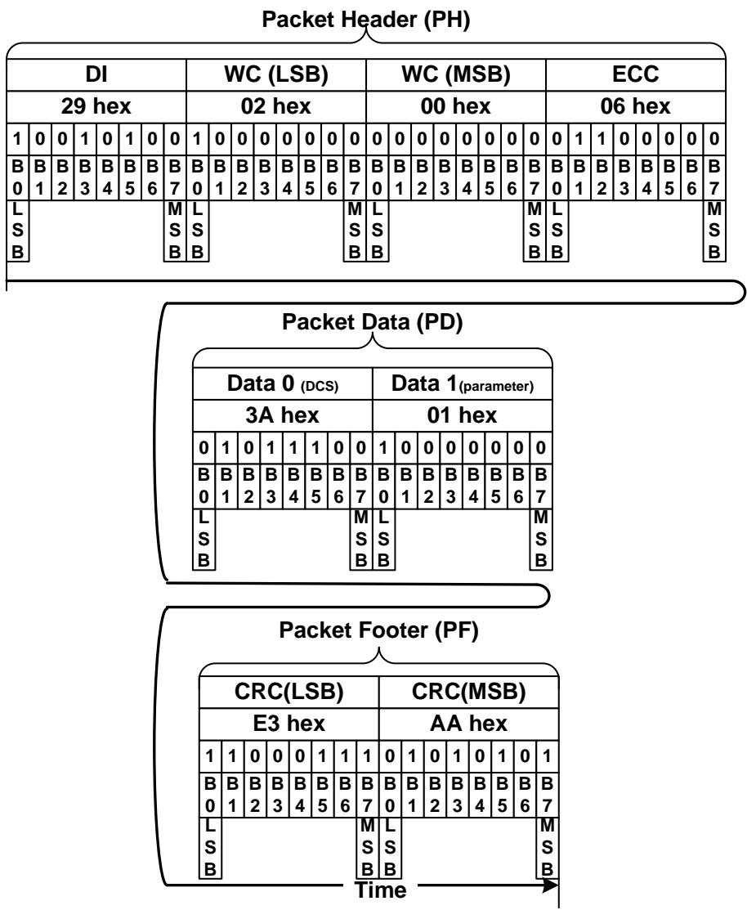  
Figure 65 Generic Long Write (GENW-L) with DCS and 1 Parameter-Example

Long Packet (Lpa), when a Write (4 parameters) was sent, is defined e.g.

Data Identification (DI)

- Virtual Channel (VC, DI[7...6]): 00b  
- Data Type (DT, DI[5...0]): 10 1001b

- Word Count (WC)  
- Word Count (WC): 0005h  
- Error Correction Code (ECC)  
- Packet Data (PD):

- Data 0: "PARLINES (30h)", Display Command Set (DCS)  
Data 1: 00hex, 1st Parameter of the DCS, Start Column SC[15...8]  
Data 2: 00hex, 2nd Parameter of the DCS, Start Column SC[7...0]  
Data 3: 01hex, 3rd Parameter of the DCS, End Column EC[15...8]  
Data 4: 3Fhex, 4th Parameter of the DCS, End Column EC[7...0]

- Packet Footer (PF)

This is defined on the Long Packet (Lpa) as follows.

Packet Header (PH)  

<table><tr><td colspan="9">DI</td><td colspan="8">WC (LSB)</td><td colspan="8">WC (MSB)</td><td colspan="8">ECC</td></tr><tr><td colspan="9">29 hex</td><td colspan="8">05 hex</td><td colspan="8">00 hex</td><td colspan="8">25 hex</td></tr><tr><td>1</td><td>0</td><td>0</td><td>1</td><td>0</td><td>1</td><td>0</td><td>0</td><td>1</td><td>0</td><td>1</td><td>0</td><td>0</td><td>0</td><td>0</td><td>0</td><td>0</td><td>0</td><td>0</td><td>0</td><td>0</td><td>0</td><td>0</td><td>0</td><td>0</td><td>1</td><td>0</td><td>1</td><td>0</td><td>0</td><td>1</td><td>0</td><td>0</td></tr><tr><td>B</td><td>B</td><td>B</td><td>B</td><td>B</td><td>B</td><td>B</td><td>B</td><td>B</td><td>B</td><td>B</td><td>B</td><td>B</td><td>B</td><td>B</td><td>B</td><td>B</td><td>B</td><td>B</td><td>B</td><td>B</td><td>B</td><td>B</td><td>B</td><td>B</td><td>B</td><td>B</td><td>B</td><td>B</td><td>B</td><td>B</td><td>B</td><td></td></tr><tr><td>0</td><td>1</td><td>2</td><td>3</td><td>4</td><td>5</td><td>6</td><td>7</td><td>0</td><td>1</td><td>2</td><td>3</td><td>4</td><td>5</td><td>6</td><td>6</td><td>7</td><td>0</td><td>1</td><td>2</td><td>3</td><td>4</td><td>5</td><td>6</td><td>6</td><td>7</td><td>0</td><td>1</td><td>2</td><td>3</td><td>4</td><td>5</td><td>6</td></tr><tr><td>L</td><td></td><td></td><td></td><td></td><td></td><td></td><td>M</td><td>L</td><td></td><td></td><td></td><td></td><td></td><td></td><td>M</td><td>L</td><td></td><td></td><td></td><td></td><td></td><td></td><td>M</td><td>L</td><td></td><td></td><td></td><td></td><td></td><td></td><td>M</td><td></td></tr><tr><td>S</td><td></td><td></td><td></td><td></td><td></td><td></td><td>S</td><td>S</td><td></td><td></td><td></td><td></td><td></td><td></td><td>S</td><td>S</td><td></td><td></td><td></td><td></td><td></td><td></td><td>S</td><td>S</td><td></td><td></td><td></td><td></td><td></td><td></td><td>S</td><td></td></tr><tr><td>B</td><td></td><td></td><td></td><td></td><td></td><td></td><td>B</td><td>B</td><td></td><td></td><td></td><td></td><td></td><td></td><td>B</td><td>B</td><td></td><td></td><td></td><td></td><td></td><td></td><td>B</td><td>B</td><td></td><td></td><td></td><td></td><td></td><td></td><td>B</td><td></td></tr></table>

<table><tr><td colspan="33">Packet Data (PD)</td></tr><tr><td colspan="8">Data 0 (DCS)</td><td colspan="8">Data 1(1stparameter)</td><td colspan="8">Data 2(2ndparameter)</td><td colspan="9">Data 3(3rdparameter)</td></tr><tr><td colspan="8">30 hex</td><td colspan="8">00 hex</td><td colspan="8">00 hex</td><td colspan="9">01 hex</td></tr><tr><td>0</td><td>0</td><td>0</td><td>0</td><td>1</td><td>1</td><td>0</td><td>0</td><td>0</td><td>0</td><td>0</td><td>0</td><td>0</td><td>0</td><td>0</td><td>0</td><td>0</td><td>0</td><td>0</td><td>0</td><td>0</td><td>0</td><td>0</td><td>0</td><td>1</td><td>0</td><td>0</td><td>0</td><td>0</td><td>0</td><td>0</td><td>0</td><td></td></tr><tr><td>B</td><td>B</td><td>B</td><td>B</td><td>B</td><td>B</td><td>B</td><td>B</td><td>B</td><td>B</td><td>B</td><td>B</td><td>B</td><td>B</td><td>B</td><td>B</td><td>B</td><td>B</td><td>B</td><td>B</td><td>B</td><td>B</td><td>B</td><td>B</td><td>B</td><td>B</td><td>B</td><td>B</td><td>B</td><td>B</td><td>B</td><td>B</td><td></td></tr><tr><td>0</td><td>1</td><td>2</td><td>3</td><td>4</td><td>5</td><td>6</td><td>7</td><td>0</td><td>1</td><td>2</td><td>3</td><td>4</td><td>5</td><td>6</td><td>7</td><td>0</td><td>1</td><td>2</td><td>3</td><td>4</td><td>5</td><td>6</td><td>7</td><td>0</td><td>1</td><td>2</td><td>3</td><td>4</td><td>5</td><td>6</td><td>7</td><td></td></tr><tr><td>L</td><td></td><td></td><td></td><td></td><td></td><td></td><td>M</td><td>L</td><td></td><td></td><td></td><td></td><td></td><td></td><td>M</td><td>L</td><td></td><td></td><td></td><td></td><td></td><td></td><td>M</td><td>L</td><td></td><td></td><td></td><td></td><td></td><td>M</td><td></td><td></td></tr><tr><td>S</td><td></td><td></td><td></td><td></td><td></td><td></td><td>S</td><td>S</td><td></td><td></td><td></td><td></td><td></td><td></td><td>S</td><td>S</td><td></td><td></td><td></td><td></td><td></td><td></td><td>S</td><td>S</td><td></td><td></td><td></td><td></td><td></td><td>S</td><td></td><td></td></tr><tr><td>B</td><td></td><td></td><td></td><td></td><td></td><td></td><td>B</td><td>B</td><td></td><td></td><td></td><td></td><td></td><td></td><td>B</td><td>B</td><td></td><td></td><td></td><td></td><td></td><td></td><td>B</td><td>B</td><td></td><td></td><td></td><td></td><td></td><td>B</td><td></td><td></td></tr></table>

<table><tr><td colspan="9">Packet Data (PD)</td><td colspan="14">Packet Footer (PF)</td><td></td></tr><tr><td colspan="9">Data 4(4stparameter)</td><td colspan="7">CRC(LSB)</td><td colspan="7">CRC(MSB)</td><td></td></tr><tr><td colspan="9">3F hex</td><td colspan="7">F5 hex</td><td colspan="7">34 hex</td><td></td></tr><tr><td>1</td><td>1</td><td>1</td><td>1</td><td>1</td><td>1</td><td>0</td><td>0</td><td>1</td><td>0</td><td>1</td><td>0</td><td>1</td><td>1</td><td>1</td><td>1</td><td>0</td><td>0</td><td>1</td><td>0</td><td>1</td><td>1</td><td>0</td><td>0</td></tr><tr><td>B</td><td>B</td><td>B</td><td>B</td><td>B</td><td>B</td><td>B</td><td>B</td><td>B</td><td>B</td><td>B</td><td>B</td><td>B</td><td>B</td><td>B</td><td>B</td><td>B</td><td>B</td><td>B</td><td>B</td><td>B</td><td>B</td><td>B</td><td>B</td></tr><tr><td>0</td><td>1</td><td>2</td><td>3</td><td>4</td><td>5</td><td>6</td><td>7</td><td>0</td><td>1</td><td>2</td><td>3</td><td>4</td><td>5</td><td>6</td><td>7</td><td>0</td><td>1</td><td>2</td><td>3</td><td>4</td><td>5</td><td>6</td><td>7</td></tr><tr><td>L</td><td rowspan="3">S</td><td rowspan="3">B</td><td rowspan="3">M</td><td rowspan="3">S</td><td rowspan="3">S</td><td rowspan="3">B</td><td rowspan="3" colspan="8">Time</td><td rowspan="3">M</td><td rowspan="3">L</td><td rowspan="3">S</td><td rowspan="3">B</td><td rowspan="3">B</td><td rowspan="3">B</td><td rowspan="3">B</td><td rowspan="3">M</td><td>S</td></tr><tr><td>S</td><td></td></tr><tr><td>B</td><td></td></tr></table>

Figure 66 Generic Write Long (GENW-L) with DCS and 4 Parameters-Example

# Generic Read, 1 Parameter (GENR1-S), Data Type = 01 0100 (14h)

"Generic Read, 1 Parameter (GENR1-S) is always using a Short Packet (SPa), what is defined on Data Type (DT,01 0100b), from the MCU to the display module. This command is defined on a table (See chapter "9 Instruction Description") below.

<table><tr><td colspan="2">Command</td></tr><tr><td>RDDID (04h)</td><td>RDDSM (0Eh)</td></tr><tr><td>RDNUMED (05h)</td><td>RDDSDR (0Fh)</td></tr><tr><td>RDRED (06h)</td><td>RDDISBV (52h)</td></tr><tr><td>RDGREEN (07h)</td><td>RDCTRLD (54h)</td></tr><tr><td>RDBLUE (08h)</td><td>RDCABC (56h)</td></tr><tr><td>RDDPM (0Ah)</td><td>RDCABCMB (5Fh)</td></tr><tr><td>RDDMADCTR (0Bh)</td><td>RDID1 (DAh)</td></tr><tr><td>RDDCOLMOD (0Ch)</td><td>RDID2 (DBh)</td></tr><tr><td>RDDIM (0Dh)</td><td>RDID3 (DCh)</td></tr></table>

The MCU has to define to the display module, what is the maximum size of the return packet. A command, what is used for this purpose, is "Set Maximum Return Packet Size" (SMRPS-S), which Data Type (DT) is 11 0111b and which is using Short Packet (SPa) before the MCU can send "Display Command Set (DCS) Read, No Parameter" to the display module. This same sequence is illustrated for reference purposes below.

# Step 1:

- The MCU sends "Set Maximum Return Packet Size" (Short Packet (SPa)) (SMRPS-S) to the display module when it wants to return one byte from the display module  
Data Identification (DI)

- Virtual Channel (VC, DI[7...6]): 00b  
Data Type (DT, DI[5...0]): 11 0111b

Maximum Return Packet Size (MRPS)

Data 0: 01hex  
Data 1:00hex

- Error Correction Code (ECC)

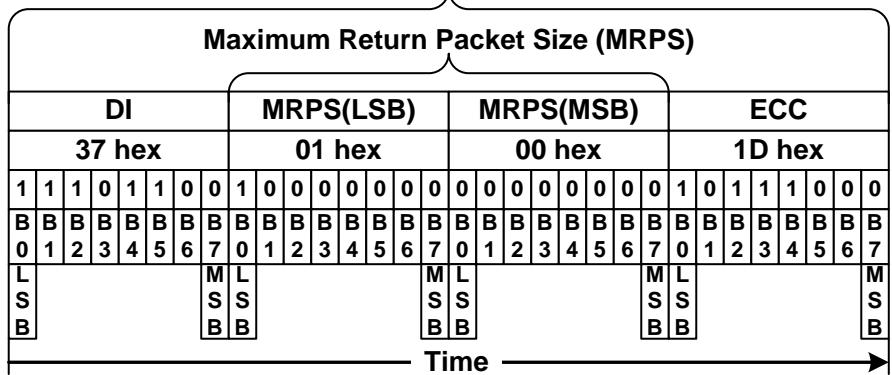  
Packet Header (PH)  
Figure 67 Set Maximum Return Packet Size (SMRPS-S)-Example

# Step 2:

- The MCU wants to receive a value of the "Read ID1 (DAh)" from the display module when the MCU sends "Generic Read, 1 Parameter" to the display module  
Data Identification (DI)

- Virtual Channel (VC, DI[7...6]): 00b  
- Data Type (DT, DI[5...0]): 01 0100b

- Packet Data (PD)

- Data 0: "Read ID1 (DAh)", Display Command Set (DCS)  
Data 1: Always 00hex

- Error Correction Code (ECC)

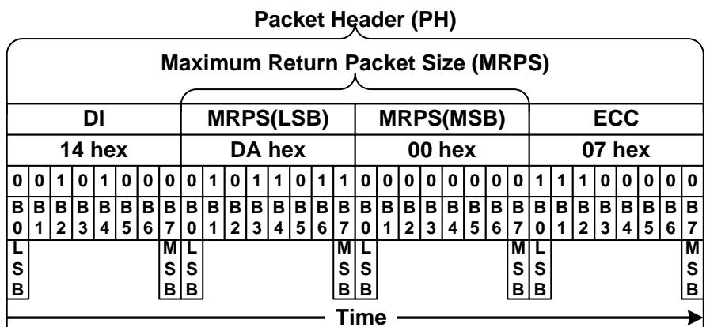  
Figure 68 Generic Read, 1 Parameter (GENR1-S) - Example

Step 3: The display module can send 2 different information to the MCU after Bus Turnaround (BTA)

1. An acknowledge with Error Report (AwER), which is using a Short Packet (SPa), if there is an error to receive a command. See section "Acknowledge with Error Report (AwER)".  
2. Information of the received command. Short Packet (SPa) or Long Packet (LPa)

# Display Command Set (DCS) Write, No Parameter (DCSWN-S), Data Type = 00 0101 (05h)

"Display Command Set (DCS) Write, No Parameter" is always using a Short Packet (SPa), what is defined on Data Type (DT, 00 0101b), from the MCU to the display module. These commands are defined on a table (See chapter "9 Instruction Description") below.

<table><tr><td colspan="2">Command</td></tr><tr><td>NOP (00h)</td><td>INVON (21h)</td></tr><tr><td>SWRESET (01h)</td><td>ALLPOFF (22h)</td></tr><tr><td>SLPIN (10h)</td><td>ALLPON (23h)</td></tr><tr><td>SLPOUT (11h)</td><td>DISPOFF (28h)</td></tr><tr><td>PTLON (12h)</td><td>DISPON (29h)</td></tr><tr><td>NORON (13h)</td><td>IDMOFF (38h)</td></tr><tr><td>INVOFF (20h)</td><td>IDMON (39h)</td></tr></table>

Short Packet (SPa) is defined e.g.

Data Identification (DI)

- Virtual Channel (VC, DI[7...6]): 00b  
- Data Type (DT, DI[5...0]): 00 0101b

- Packet Data (PD)

- Data 0: "Sleep In (10h)", Display Command Set (DCS)  
Data 1: Always 00hex

- Error Correction Code (ECC)

This is defined on the Short Packet (SPa) as follows.

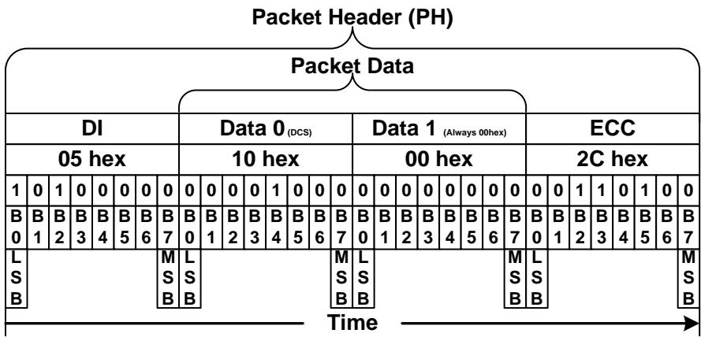  
Figure 69 Display Command Set (DCS) Write, No Parameter(DCSWN-S)-Example

Display Command Set (DCS) Write, 1 Parameter (DCSW1-S), Data Type = 01 0101 (15h)

"Display Command Set (DCS) Write, 1 Parameter" (DCSW1-S) is always using a Short Packet (SPa), what is defined on Data Type (DT, 01 0101b), from the MCU to the display module. These commands are defined on a table (See chapter "9 Instruction Description") below.

<table><tr><td>Command</td></tr><tr><td>GAMSET (26h)</td></tr><tr><td>COLMOD (3Ah)</td></tr><tr><td>WRDISBV (51h)</td></tr><tr><td>WRCTRLD (53h)</td></tr><tr><td>WRCABC (55h)</td></tr><tr><td>WRCABCMB (5Eh)</td></tr></table>

Short Packet (SPa) is defined e.g.

Data Identification (DI)

- Virtual Channel (VC, DI[7...6]): 00b

- Data Type (DT, DI[5...0]): 01 0101b

- Packet Data (PD)

- Data 0: "PMCSET (3Ah)", Display Command Set (DCS)

Data 1: 01hex, Parameter of the DCS

- Error Correction Code (ECC)

This is defined on the Short Packet (SPa) as follows.

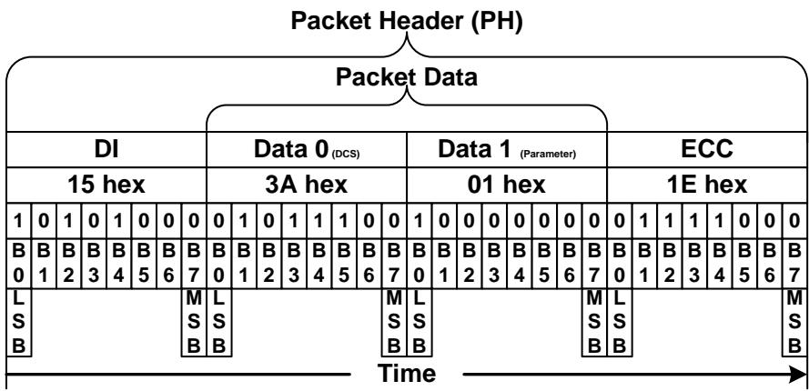  
Figure 70 Display Command Set (DCS) Write,1 Parameter (DCSW1-S)-Example

# Display Command Set (DCS) Write Long (DCSW-L), Data Type = 11 1001 (39h)

"Display Command Set (DCS) Write Long" (DCSW-L) is always using a Long Packet (LPa), what is defined on Data Type (DT, 11 1001b), from the MCU to the display module. Command (No Parameters) and Write (1 or more parameters), are defined on a table (See chapter "9 Instruction Description") below

<table><tr><td colspan="3">Command</td></tr><tr><td>NOP (00h) , Note1</td><td>INVON (21h) , Note1</td><td>COLMOD (3Ah) , Note2</td></tr><tr><td>SWRESET (01h) , Note1</td><td>GAMSET (26h) , Note2</td><td>WRDISBV (51h) , Note2</td></tr><tr><td>SLPIN (10h) , Note1</td><td>DISPOFF (28h) , Note1</td><td>WRCTRLD (53h)</td></tr><tr><td>SLPOUT (11h) , Note1</td><td>DISPON (29h) , Note1</td><td>WRCABC (55h) , Note2</td></tr><tr><td>PTLON (12h) , Note1</td><td>PARLINES (30h)</td><td>WRCABCMB (5Eh)</td></tr><tr><td>NORON (13h) , Note1</td><td>IDMOFF (38h) , Note1</td><td></td></tr><tr><td>INVOFF (20h) , Note1</td><td>IDMON (39h) , Note1</td><td></td></tr></table>

Notes : 1. Also Short Packet (SPa) can be used; See(Display Command Set (DCS) Write, No Parameter.  
2. Also Short Packet (SPa) can be used; See Display Command Set (DCS) Write, 1 Parameter.

Long Packet (LPa), when a command (No Parameter) was sent, is defined e.g.

Data Identification (DI)

- Virtual Channel (VC, DI[7...6]): 00b  
- Data Type (DT, DI[5...0]): 11 1001b

- Word Count (WC)  
- Word Count (WC): 0001h

- Error Correction Code (ECC)  
- Packet Data (PD): Data 0: "Sleep In (10h)", Display Command Set (DCS)  
- Packet Footer (PF)

This is defined on the Short Packet (SPa) as follows.

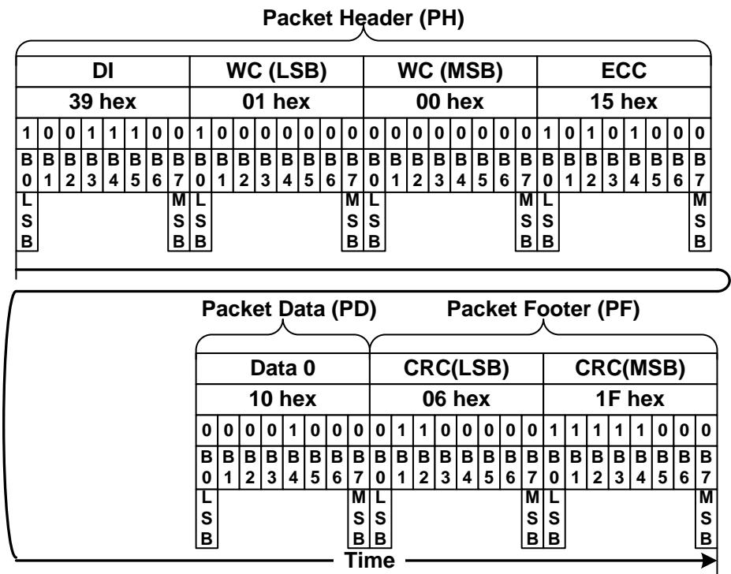  
Figure 71 Display Command Set (DCS) Write Long (DCSW-L) with DCS Only-Example

Long Packet (LPa), when a Write (1 parameter) was sent, is defined e.g.

Data Identification (DI)  
- Virtual Channel (VC, DI[7...6]): 00b  
- Data Type (DT, DI[5...0]): 11 1001b  
- Word Count (WC)  
- Word Count (WC): 0002h  
- Error Correction Code (ECC)  
- Packet Data (PD):  
Data 0: "Gamma Set (26h)", Display Command Set (DCS)  
Data 1: 01hex, Parameter of the DCS  
- Packet Footer (PF)

This is defined on the Short Packet (SPa) as follows

  
Figure 72 Display Command Set (DCS) Write Long with DCS and 1 Parameter-Example

Long Packet (LPa), when a Write (4 parameters) was sent, is defined e.g.

Data Identification (DI)

- Virtual Channel (VC, DI[7...6]): 00b  
- Data Type (DT, DI[5...0]): 11 1001b

- Word Count (WC)  
- Word Count (WC): 0005h  
- Error Correction Code (ECC)  
- Packet Data (PD):

- Data 0: "PARLINES (30h)", Display Command Set (DCS)  
Data 1: 00hex, 1st Parameter of the DCS, Start Column SC[15...8]  
Data 2: 00hex, 2nd Parameter of the DCS, Start Column SC[7...0]  
Data 3: 01hex, 3rd Parameter of the DCS, End Column EC[15...8]  
Data 4: 3Fhex, 4th Parameter of the DCS, End Column EC[7...0]

- Packet Footer (PF)

This is defined on the Short Packet (SPa) as follows.

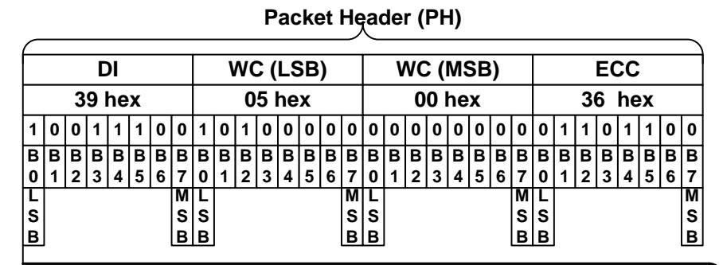

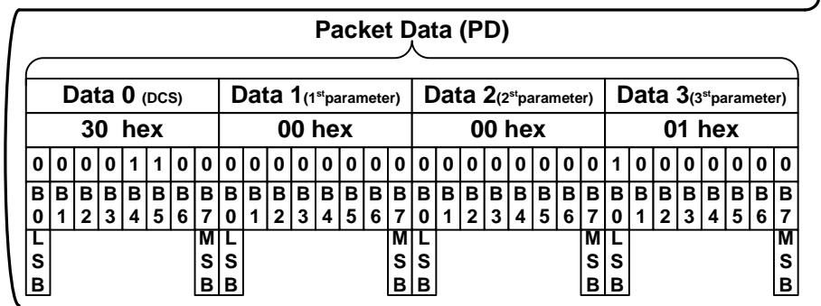

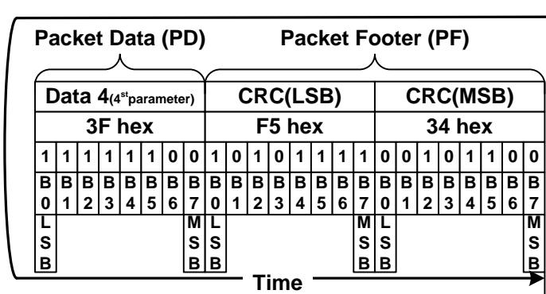  
Figure 73 Display Command Set (DCS) Write Long with DCS and 4 Parameters-Example

# Display Command Set (DCS) Read, No Parameter (DCSRN-S), Data Type = 00 0110 (06h)

"Display Command Set (DCS) Read, No Parameter" (DCSRN-S) is always using a Short Packet (SPa), what is defined on Data Type (DT, 00 0110b), from the MCU to the display module. These commands are defined on a table (See chapter "9 Instruction Description") below.

<table><tr><td colspan="2">Command</td></tr><tr><td>RDDID (04h)</td><td>RDDSM (0Eh)</td></tr><tr><td>RDNUMED (05h)</td><td>RDDSDR (0Fh)</td></tr><tr><td>RDRED (06h)</td><td>RDDISBV (52h)</td></tr><tr><td>RDGREEN (07h)</td><td>RDCTRLD (54h)</td></tr><tr><td>RDBLUE (08h)</td><td>RDCABC (56h)</td></tr><tr><td>RDDPM (0Ah)</td><td>RDCABCMB (5Fh)</td></tr><tr><td>RDDMADCTR (0Bh)</td><td>RDID1 (DAh)</td></tr><tr><td>RDDCOLMOD (0Ch)</td><td>RDID2 (DBh)</td></tr><tr><td>RDDIM (0Dh)</td><td>RDID3 (DCh)</td></tr></table>

The MCU has to define to the display module, what is the maximum size of the return packet. A command, what is used for this purpose, is "Set Maximum Return Packet Size" (SMRPS-S), which Data Type (DT) is 11 0111b and which is using Short Packet (SPa) before the MCU can send "Display Command Set (DCS) Read, No Parameter" to the display module. This same sequence is illustrated for reference purposes below.

# Step 1:

- The MCU sends "Set Maximum Return Packet Size" (Short Packet (SPa)) (SMRPS-S) to the display module when it wants to return one byte from the display module  
Data Identification (DI)

- Virtual Channel (VC, DI[7...6]): 00b  
- Data Type (DT, DI[5...0]): 11 0111b

Maximum Return Packet Size (MRPS)

Data 0: 01hex  
Data 1:00hex

- Error Correction Code (ECC)

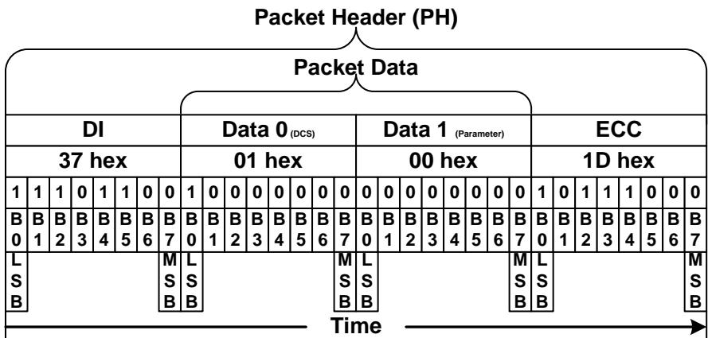  
Figure 74 Set Maximum Return Packet Size (SMRPS-S) - Example

# Step 2:

- The MCU wants to receive a value of the "Read ID1 (DAh)" from the display module when the MCU sends "Display Command Set (DCS) Read, No Parameter" to the display module  
Data Identification (DI)

- Virtual Channel (VC, DI[7...6]): 00b  
- Data Type (DT, DI[5...0]): 00 0110b

- Packet Data (PD)

- Data 0: "Read ID1 (DAh)", Display Command Set (DCS)  
Data 1: Always 00hex

- Error Correction Code (ECC)

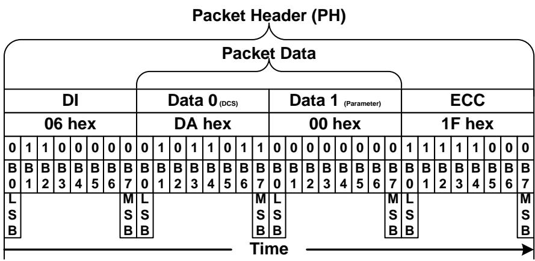  
Figure 75 Display Command Set (DCS) Read, No Parameter (DCSRN-S) - Example

Step 3: The display module can send 2 different information to the MCU after Bus Turnaround (BTA)

1. An acknowledge with Error Report (AwER), which is using a Short Packet (SPa), if there is an error to receive a command. See section "Acknowledge with Error Report (AwER)".  
2. Information of the received command. Short Packet (SPa) or Long Packet (LPa)

# Null Packet, No Data (NP-L), Data Type = 001001 (09h)

"Null Packet, No Data" (NP-L) is always using a Long Packet (LPa), what is defined on Data Type (DT, 001001b), from the MCU to the display module. The purpose of this command is keeping data lanes in the high speed mode (HSDT), if it is needed. The display module is ignored Packet Data (PD) what the MCU is sending.

Long Packet (LPa), when 5 random data bytes of the Packet Data (PD) were sent, is defined e.g.

Data Identification (DI)

- Virtual Channel (VC, DI[7...6]): 00b  
- Data Type (DT, DI[5...0]): 00 1001b

- Word Count (WC)  
- Word Count (WC): 0005h  
- Error Correction Code (ECC)  
- Packet Data (PD):

Data 0:89h (Random data)  
Data 1:23h (Random data)  
Data 2: 12h (Random data)  
Data 3: A2h (Random data)  
Data 4: E2h (Random data)

- Packet Footer (PF)

This is defined on the Long Packet (LPa) as follows.

Packet Header (PH)  

<table><tr><td colspan="8">DI</td><td colspan="8">WC (LSB)</td><td colspan="8">WC (MSB)</td><td colspan="7">ECC</td><td></td></tr><tr><td colspan="8">09 hex</td><td colspan="8">05 hex</td><td colspan="8">00 hex</td><td colspan="7">30 hex</td><td></td></tr><tr><td>0</td><td>1</td><td>0</td><td>1</td><td>1</td><td>0</td><td>0</td><td>0</td><td>1</td><td>0</td><td>1</td><td>0</td><td>0</td><td>0</td><td>0</td><td>0</td><td>0</td><td>0</td><td>0</td><td>0</td><td>0</td><td>0</td><td>0</td><td>0</td><td>1</td><td>1</td><td>1</td><td>1</td><td>0</td><td>1</td><td>0</td><td>0</td></tr><tr><td>B</td><td>B</td><td>B</td><td>B</td><td>B</td><td>B</td><td>B</td><td>B</td><td>B</td><td>B</td><td>B</td><td>B</td><td>B</td><td>B</td><td>B</td><td>B</td><td>B</td><td>B</td><td>B</td><td>B</td><td>B</td><td>B</td><td>B</td><td>B</td><td>B</td><td>B</td><td>B</td><td>B</td><td>B</td><td>B</td><td>B</td><td></td></tr><tr><td>0</td><td>1</td><td>2</td><td>3</td><td>4</td><td>5</td><td>6</td><td>7</td><td>0</td><td>1</td><td>2</td><td>3</td><td>4</td><td>5</td><td>6</td><td>7</td><td>0</td><td>1</td><td>2</td><td>3</td><td>4</td><td>5</td><td>6</td><td>7</td><td>0</td><td>1</td><td>2</td><td>3</td><td>4</td><td>5</td><td>6</td><td>7</td></tr><tr><td>L S B</td><td></td><td></td><td></td><td></td><td></td><td></td><td>M S B</td><td></td><td></td><td></td><td></td><td></td><td></td><td></td><td>M S B</td><td></td><td></td><td></td><td></td><td></td><td></td><td>M S B</td><td></td><td></td><td></td><td></td><td></td><td></td><td>M S B</td><td></td><td></td></tr></table>

Packet Data (PD)  

<table><tr><td colspan="7">Data 0 (DCS)</td><td colspan="7">Data 1(1&quot;parameter)</td><td colspan="7">Data 2(2&quot;parameter)</td><td colspan="6">Data 3(3&quot;parameter)</td><td></td><td></td><td></td><td></td><td></td></tr><tr><td colspan="7">89 hex</td><td colspan="7">23 hex</td><td colspan="7">12 hex</td><td colspan="6">A2 hex</td><td></td><td></td><td></td><td></td><td></td></tr><tr><td>1</td><td>0</td><td>0</td><td>1</td><td>0</td><td>0</td><td>0</td><td>1</td><td>1</td><td>1</td><td>0</td><td>0</td><td>0</td><td>1</td><td>0</td><td>0</td><td>0</td><td>1</td><td>0</td><td>0</td><td>1</td><td>0</td><td>0</td><td>0</td><td>1</td><td>0</td><td>1</td><td></td><td></td><td></td><td></td><td></td></tr><tr><td>B</td><td>B</td><td>1</td><td>B</td><td>B</td><td>B</td><td>B</td><td>B</td><td>B</td><td>B</td><td>B</td><td>B</td><td>B</td><td>B</td><td>B</td><td>B</td><td>B</td><td>B</td><td>B</td><td>B</td><td>B</td><td>B</td><td>B</td><td>B</td><td>B</td><td>B</td><td>B</td><td></td><td></td><td></td><td></td><td></td></tr><tr><td>0</td><td>1</td><td>2</td><td>3</td><td>4</td><td>5</td><td>6</td><td>7</td><td>0</td><td>1</td><td>2</td><td>3</td><td>4</td><td>5</td><td>6</td><td>7</td><td>0</td><td>1</td><td>2</td><td>3</td><td>4</td><td>5</td><td>6</td><td>7</td><td>0</td><td>1</td><td>2</td><td>3</td><td>4</td><td>5</td><td>6</td><td>7</td></tr><tr><td>L</td><td></td><td></td><td></td><td></td><td></td><td></td><td>M</td><td>L</td><td></td><td></td><td></td><td></td><td></td><td>M</td><td>L</td><td></td><td></td><td></td><td></td><td></td><td>M</td><td>L</td><td></td><td></td><td></td><td></td><td>M</td><td></td><td></td><td></td><td></td></tr><tr><td>S</td><td></td><td></td><td></td><td></td><td></td><td></td><td>S</td><td>S</td><td></td><td></td><td></td><td></td><td></td><td>S</td><td>S</td><td></td><td></td><td></td><td></td><td></td><td>S</td><td>S</td><td></td><td></td><td></td><td></td><td>S</td><td></td><td></td><td></td><td></td></tr><tr><td>B</td><td></td><td></td><td></td><td></td><td></td><td></td><td>B</td><td>B</td><td></td><td></td><td></td><td></td><td></td><td>B</td><td>B</td><td></td><td></td><td></td><td></td><td></td><td>B</td><td>B</td><td></td><td></td><td></td><td></td><td>B</td><td></td><td></td><td></td><td></td></tr></table>

Packet Data (PD)  

<table><tr><td colspan="8">Data 4(4thparameter)</td><td colspan="8">CRC(LSB)</td><td colspan="8">CRC(MSB)</td></tr><tr><td colspan="8">E2 hex</td><td colspan="8">59 hex</td><td colspan="8">29 hex</td></tr><tr><td>0</td><td>1</td><td>0</td><td>0</td><td>0</td><td>1</td><td>1</td><td>1</td><td>1</td><td>0</td><td>0</td><td>1</td><td>1</td><td>0</td><td>1</td><td>0</td><td>1</td><td>0</td><td>0</td><td>1</td><td>0</td><td>1</td><td>0</td><td>0</td></tr><tr><td>B</td><td>B</td><td>B</td><td>B</td><td>B</td><td>B</td><td>B</td><td>B</td><td>B</td><td>B</td><td>B</td><td>B</td><td>B</td><td>B</td><td>B</td><td>B</td><td>B</td><td>B</td><td>B</td><td>B</td><td>B</td><td>B</td><td>B</td><td>7</td></tr><tr><td>0</td><td>1</td><td>2</td><td>3</td><td>4</td><td>5</td><td>6</td><td>7</td><td>0</td><td>1</td><td>2</td><td>3</td><td>4</td><td>5</td><td>6</td><td>7</td><td>0</td><td>1</td><td>2</td><td>3</td><td>4</td><td>5</td><td>6</td><td>7</td></tr><tr><td>L</td><td>S</td><td></td><td></td><td></td><td></td><td></td><td>M</td><td>L</td><td></td><td></td><td></td><td></td><td></td><td></td><td>M</td><td>L</td><td></td><td></td><td></td><td></td><td></td><td>M</td><td>S</td></tr><tr><td>B</td><td></td><td></td><td></td><td></td><td></td><td></td><td>S</td><td>S</td><td></td><td></td><td></td><td></td><td></td><td>S</td><td>S</td><td></td><td></td><td></td><td></td><td></td><td></td><td>B</td><td>B</td></tr><tr><td></td><td></td><td></td><td></td><td></td><td></td><td></td><td>B</td><td>B</td><td></td><td></td><td></td><td></td><td></td><td>B</td><td>B</td><td></td><td></td><td></td><td></td><td></td><td></td><td></td><td></td></tr></table>

Figure 76 Null Packet, No Data (NP-L)-Example

# End of Transmission Packet (EoTP), Data Type = 001000 (08h)

"End of Transmission Packet" (EoTP) is always using a Short Packet (SPa), what is defined on Data Type (DT, 001000b), from the MCU to the display module. The purpose of this command is terminated the high speed mode (HPDT) properly when there is added this extra packet after the last payload packet before "End of Transmission" (EoT), which is an interface level functionality.

The MCU can decide if it want to use the "End of Transmission Packet" (EoTP) or not. The ST7701S has the capability to support both: i.e. If MCU applies the EoTP, it shall report the "DSI Protocol Violation" error when the EoTP is not detected in the high speed (HS). This error reporting can be enable/disable by bit DIS_EoTP_HS of command B100h (page 0).

The display module is or isn't receiving "End of Transmission Packet" (EoTP) from the MCU during the Low Power Data Transmission (LPDT) mode before "Marked-1" (=leaving Escape mode) what ends the Low Power Data Transmission (LPDT) mode.

The display module is not allowed to send "End of Transmission Packet" (EoTP) to MCU during the Low Power Data Transmission (LPDT) mode.

The summary of the receiving and transmitting EoTP is listed below.

<table><tr><td>Direction</td><td>Display Module (DM) in
High Speed Data Transmission (HPDT)</td><td>Display Module (DM) in
Low Power Data Transmission (LPDT)</td></tr><tr><td>MCU=&gt;Display Driver</td><td>With or Without EoTP is Supported</td><td>With or Without EoTP is Supported</td></tr><tr><td>Display Driver=&gt;MCU</td><td>HS Mode is not available
(EoTP is not available)</td><td>EoTP can not be sent by the Display
Driver</td></tr></table>

Table 17 Receiving and Transmitting EoTP during LPDT

Short Packet (SPa) is using a fixed format as follow

- Virtual Channel (VC, DI[7...6]): 00b

- Data Type (DT, DI[5...0]): 00 1000b

Data Identification (DI)  
- Packet Data (PD):  
Data 0: 0Fh  
Data 1:0Fh  
- Error Correction Code (ECC)  
ECC:01h

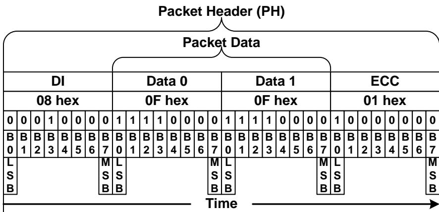  
Figure 77 End of Transmission Packet (EoTP)

Some use case of the "End of Transmission Packet" (EoTP) are illustrated only for reference purpose below.

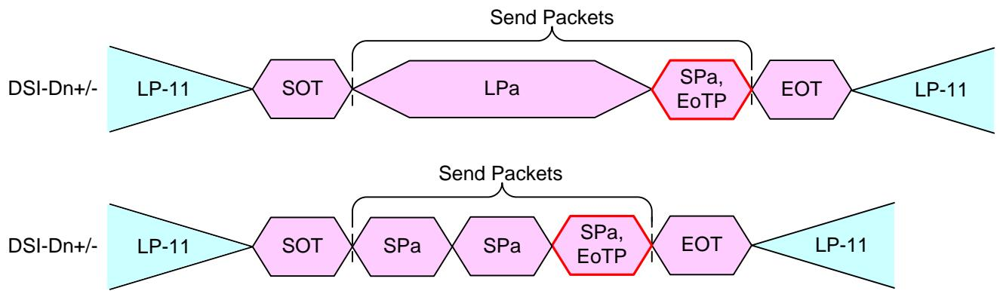  
Figure 78 End of Transmission Packet (EoTP)-Example

# Sync Event (H Start, H End, V Start, V End), Data Type = xx 0001 (x1h)

Sync Events are Short packets and, therefore, can time-accurately represent events like the start and end of sync pulses. As "start" and "end" are separate and distinct events, the length of sync pulses, as well as position relative to active pixel data, e.g. front and back porch display timing, may be accurately conveyed to the peripheral. The Sync Events are defined as follows:

- Data Type = 00 0001 (01h) V Sync Start

- Data Type = 010001 (11h) V Sync End

- Data Type = 10 0001 (21h) H Sync Start

- Data Type = 110001 (31h) H Sync End

In order to represent timing information as accurately as possible a V Sync Start event represents the start of the VSA and also implies an H Sync Start event for the first line of the VSA. Similarly, a V Sync End event implies an H Sync Start event for the last line of the VSA..

Sync events should occur in pairs, Sync Start and Sync End, if accurate 1054 pulse-length information needs to be conveyed. Alternatively, if only a single point (event) in time is required, a single sync event (normally, Sync Start) may be transmitted to the peripheral. Sync events may be concatenated with blanking packets to convey inter-line timing accurately and avoid the overhead of switching between LPS and HS for every event. Note there is a power penalty for keeping the data line in HS mode, however. Display modules that do not need traditional sync/blanking/pixel timing should transmit pixel data in a high-speed burst then put the bus in Low Power Mode, for reduced power consumption. The recommended burst size is a scan line of pixels, which may be temporarily stored in a line buffer on the display module.

# Color Mode On Command, and, Data Type = 010010 (12h)

Color Mode On is a Short packet command that switches a Video Mode display module to 8-colors mode for power saving.

# Color Mode Off Command, Data Type = 000010 (02h)

Color Mode Off is a Short packet command that returns a Video Mode display module from 8-colors mode to normal display operation.

# Shutdown Peripheral Command, Data Type  $= 10$  0010 (22h)

Shutdown Peripheral command is a Short packet command that turns off the display in a Video Mode display module for power saving. Note the interface shall remain powered in order to receive the turn-on, or wake-up, command.

# Turn On Peripheral Command, Data Type  $= 110010$  (32h)

Turn On Peripheral command is Short packet command that turns on the display in a Video Mode display module for normal display operation.

# Blanking Packet (Long), Data Type = 01 1001 (19h)

A Blanking packet is used to convey blanking timing information in a Long packet. Normally, the packet represents a period between active scan lines of a Video Mode display, where traditional display timing is provided from the host processor to the display module. The blanking period may have Sync Event packets interspersed between blanking segments. Like all packets, the Blanking packet contents shall be an integer number of bytes. Blanking packets may contain arbitrary data as payload. The Blanking packet consists of the DI byte, a two-byte WC, an ECC byte, a payload of length WC bytes, and a two-byte checksum.

Packed Pixel Stream, 16-bit Format, Long packet, Data Type = 00 1110 (0Eh)

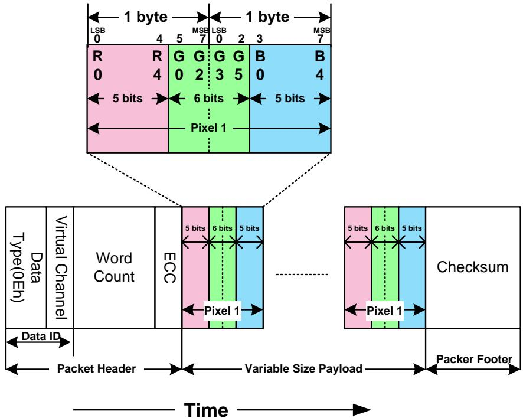  
Figure 79 16-bit per Pixel-RGB Color Format, Long packet

Packed Pixel Stream 16-Bit Format is a Long packet used to transmit image data formatted as 16-bit pixels to a Video Mode display module. The packet consists of the DI byte, a two-byte WC, an ECC byte, a payload of length WC bytes and a two-byte checksum. Pixel format is five bits red, six bits green, five bits blue, in that order. Note that the "Green" component is split across two bytes. Within a color component, the LSB is sent first, the MSB last. With this format, pixel boundaries align with byte boundaries every two bytes. The total line width (displayed plus non-displayed pixels) should be a multiple of two bytes.

Normally, the display module has no frame buffer of its own, so all image data shall be supplied by the host processor at a sufficiently high rate to avoid flicker or other visible artifacts.

Packed Pixel Stream, 18-bit Format, Long packet, Data type = 01 1110 (1Eh)

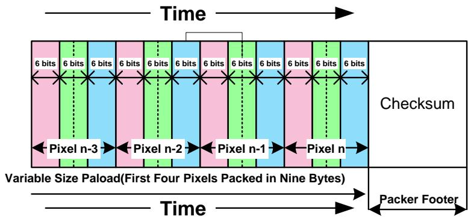  
Figure 80 18-bit per Pixel-RGB Color Format, Long pack

Packed Pixel Stream 18-Bit Format (Packed) is a Long packet. It is used to transmit RGB image data formatted as pixels to a Video Mode display module that displays 18-bit pixels. The packet consists of the DI byte, a two-byte WC, an ECC byte, a payload of length WC bytes and a two-byte Checksum. Pixel format is red (6 bits), green (6 bits) and blue (6 bits), in that order. Within a color component, the LSB is sent first, the MSB last.

Note that pixel boundaries only align with byte boundaries every four pixels (nine bytes). Preferably, display modules employing this format have a horizontal extent (width in pixels) evenly divisible by four, so no partial bytes remain at the end of the display line data. If the active (displayed) horizontal width is not a multiple of four pixels, the transmitter shall send additional fill pixels at the end of the display line to make the transmitted width a multiple of four pixels. The receiving peripheral shall not display the fill pixels when refreshing the display device. For example, if a display device has an active display width of 399 pixels, the transmitter should send 400 pixels in one or more packets. The receiver should display the first 399 pixels and discard the last pixel of the transmission.

With this format, the total line width (displayed plus non-displayed pixels) should be a multiple of four pixels (nine bytes).

Pixel Stream, 18-bit Format in Three Bytes, Long packet, Data Type = 101110 (2Eh)

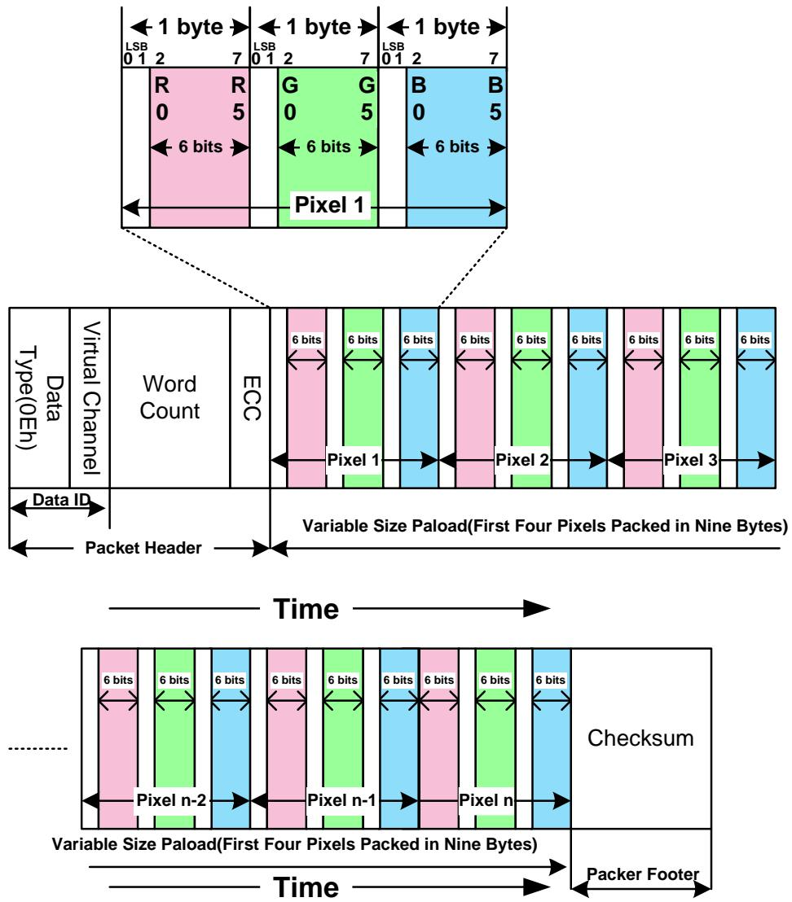  
Figure 81 18-bit per Pixel (Loosely Packed)-RGB Color Format, Long pack

In the 18-bit Pixel Loosely Packed format, each R, G, or B color component is six bits but is shifted to the upper bits of the byte, such that the valid pixel bits occupy bits [7:2] of each byte. Bits [1:0] of each payload byte representing active pixels are ignored. As a result, each pixel requires three bytes as it is transmitted across the Link. This requires more bandwidth than the "packed" format, but requires less shifting and multiplexing logic in the packing and unpacking functions on each end of the Link.

This format is used to transmit RGB image data formatted as pixels to a Video Mode display module that displays 18-bit pixels. The packet consists of the DI byte, a two-byte WC, an ECC byte, a payload of length WC bytes and a two-byte Checksum. The pixel format is red (6 bits), green (6 bits) and blue (6 bits) in that order. Within a color component, the LSB is sent first, the MSB last.

With this format, pixel boundaries align with byte boundaries every three bytes. The total line width (displayed plus non-displayed pixels) should be a multiple of three bytes.

# Packed Pixel Stream, 24-bit Format, Long packet, Data Type = 11 1110 (3Eh)

Packed Pixel Stream 24-Bit Format is a Long packet. It is used to transmit image data formatted as 24-bit pixels to a Video Mode display module. The packet consists of the DI byte, a two-byte WC, an ECC byte, a payload of length WC bytes and a two-byte Checksum. The pixel format is red (8 bits), green (8 bits) and blue (8 bits), in that order. Each color component occupies one byte in the pixel stream; no components are split across byte boundaries. Within a color component, the LSB is sent first, the MSB last.

With this format, pixel boundaries align with byte boundaries every three bytes. The total line width (displayed plus non-displayed pixels) should be a multiple of three bytes.

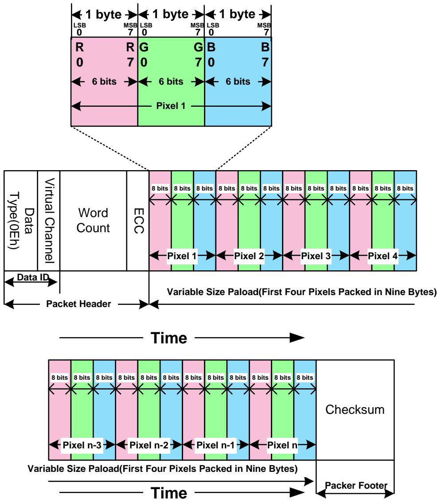  
Figure 82 24-bit per Pixel -RGB Color Format, Long packet

# 8.7.2.3.2.2

# PACKET FROM THE DISPLAY MODULE TO THE MCU

# Used Packet Types

The display module is always using Short Packet (SPa) or Long Packet (LPa), when it is returning information to the MCU after the MCU has requested information from the Display Module. This information can be a response of the Display Command Set (DCS) Read, No Parameter",(DCSRN-S)) or an Acknowledge with Error Report .The used packet type is defined on Data Type (DT)..

A number of the return bytes are more than the maximum size of the Packet Data (PD) on Long Packet (LPa) or Short Packet (SPa) when the display module is sending return bytes in several packets until all return bytes have been sent from the display module to the MCU.

It is not possible that the display module is sending return bytes in several packets even if the maximum size of the Packet Data (PD) could be sent on a packet.

Both cases are illustrated for reference purposes below.

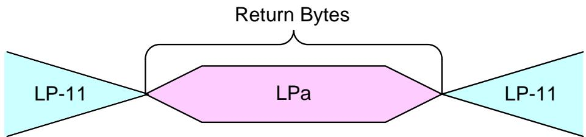

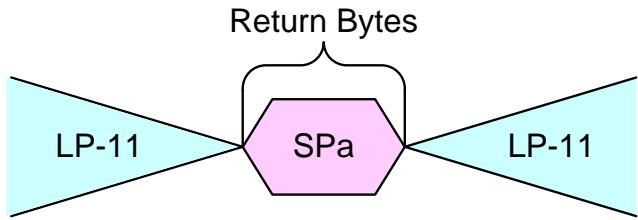  
Return Bytes on Signal Packet

<table><tr><td>Data Type
Hex</td><td>Data Type
Binary</td><td>Symbol</td><td>Description</td><td>Packet Size</td></tr><tr><td>02h</td><td>00 0010</td><td>AwER</td><td>Acknowledge &amp; Error Report</td><td>Short</td></tr><tr><td>1Ch</td><td>01 1100</td><td>DCSRR-L</td><td>DCS Long Read Response</td><td>Long</td></tr><tr><td>21h</td><td>10 0001</td><td>SCSRR1-S</td><td>DCS Short Read Response, 1 Byte returned</td><td>Short</td></tr><tr><td>22h</td><td>01 0010</td><td>DCSRR2-S</td><td>DCS Short Read Response, 2 Byte returned</td><td>Short</td></tr><tr><td>1Ah</td><td>01 1010</td><td>GENRR-L</td><td>Generic Long Read Response</td><td>Long</td></tr><tr><td>11h</td><td>01 0001</td><td>GENRR1-S</td><td>Generic Long Read Response, 1 Byte returned</td><td>Short</td></tr><tr><td>12h</td><td>01 0010</td><td>GENRR2-S</td><td>Generic Long Read Response, 2 Byte returned</td><td>Short</td></tr></table>

Table 18 Data Type for Display Module-sourced Packets

The display module is return 2 packets (1st packet: Data, 2nd packet Acknowledge with Error Report) to the MCU when the display module has received a read command. See section "Display Command Set (DCS) Read, No Parameter (DCSRN-S)" where has been detected and corrected a single bit error by the EEC (See bit 8 on Table" Acknowledge with Error Report (AwER) for Short Packet (SPa) Response"). This return packets are illustrated for reference purpose below.

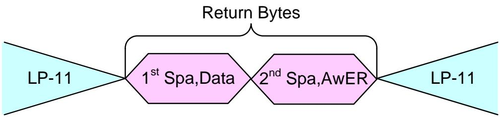  
Exception When Return Bytes on Several Packet

AwER=Acknowledge with Error Report

# Acknowledge with Error Report (AwER), Data Type = 00 0010(02h)

"Acknowledge with Error Report" (AwER) is always using a Short Packet (SPa), what is defined on Data Type (DT,00 0010b), from the display module to the MCU.

The Packet Data (PD) can include bits, which are defining the current error, when a corresponding bit is set to '1', as they are defined on the following table.

<table><tr><td>Bit</td><td>Description</td></tr><tr><td>0</td><td>SoT Error</td></tr><tr><td>1</td><td>SoT Sync Error</td></tr><tr><td>2</td><td>EoT Sync Error</td></tr><tr><td>3</td><td>Escape Mode Entry Command Error</td></tr><tr><td>4</td><td>Low-Power Transmit Sync Error</td></tr><tr><td>5</td><td>Any Protocol Timer Time-Out</td></tr><tr><td>6</td><td>False Control Error</td></tr><tr><td>7</td><td>Contention is Detected on the Display Module</td></tr><tr><td>8</td><td>ECC Error, single-bit (detected and corrected)</td></tr><tr><td>9</td><td>ECC Error, multi-bit (detected, not corrected)</td></tr><tr><td>10</td><td>Checksum Error (Long packet only)</td></tr><tr><td>11</td><td>DSI Data Type (DT) Not Recognized</td></tr><tr><td>12</td><td>DSI Virtual Channel (VC) ID Invalid</td></tr><tr><td>13</td><td>Invalid Transmission Length</td></tr><tr><td>14</td><td>Reserved, Set to ‘0’ internally</td></tr><tr><td>15</td><td>DSI Protocol Violation</td></tr></table>

Table 19 Acknowledge with Error Report (AwER) for Long Packet (LPa) Response  

<table><tr><td>Bit</td><td>Description</td></tr><tr><td>0</td><td>SoT Error</td></tr><tr><td>1</td><td>SoT Sync Error</td></tr><tr><td>2</td><td>EoT Sync Error</td></tr><tr><td>3</td><td>Escape Mode Entry Command Error</td></tr><tr><td>4</td><td>Low-Power Transmit Sync Error</td></tr><tr><td>5</td><td>Any Protocol Timer Time-Out</td></tr><tr><td>6</td><td>False Control Error</td></tr><tr><td>7</td><td>Contention is Detected on the Display Module</td></tr><tr><td>8</td><td>ECC Error, single-bit (detected and corrected)</td></tr><tr><td>9</td><td>ECC Error, multi-bit (detected, not corrected)</td></tr><tr><td>10</td><td>Set to “0” internally (Only for Long Packet (LP))</td></tr><tr><td>11</td><td>DSI Data Type (DT) Not Recognized</td></tr><tr><td>12</td><td>DSI Virtual Channel (VC) ID Invalid</td></tr><tr><td>13</td><td>Invalid Transmission Length</td></tr><tr><td>14</td><td>Reserved, Set to ‘0’ internally</td></tr><tr><td>15</td><td>DSI Protocol Violation</td></tr></table>

Table 20 Acknowledge with Error Report (AwER) for Short Packet (SPa) Response

These errors are only included on the last packet, which has been received from the MCU to the display module before Bus Turnaround (BTA).

The display module ignores the received packet which includes error or errors

Acknowledge with Error Report (AwER) of the Short Packet (SPa) is defined e.g.

Data Identification (DI)

- Virtual Channel (VC, DI[7...6]): 00b  
- Data Type (DT, DI[5...0]): 00 0010b

- Packet Data (PD):

- Bit 8: ECC Error, single-bit (detected and corrected)  
- AwER: 0100h

- Error Correction Code (ECC)

This is defined on the Short Packet (SPa) as follows.

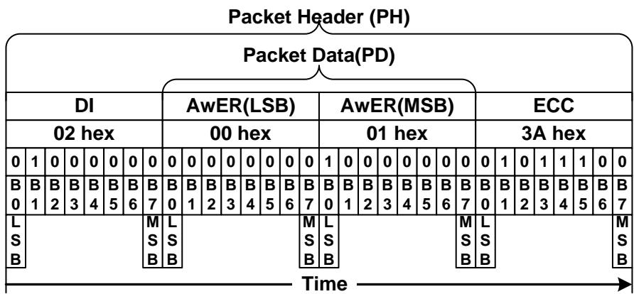  
Acknowledge with Error Report (AwER)-Example

It is possible that the display module receivers several packets, which include error, from the MPU before the MPU performs the Bus Turnaround (BTA). Some examples are illustrated below for reference purpose.

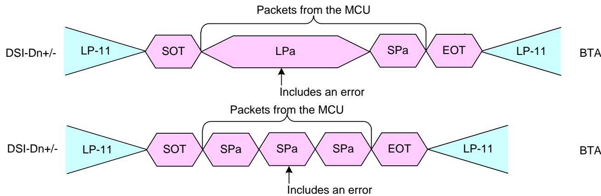  
Error Packet

Therefore, there is needed a method to check if there has been errors on the previous packets. These errors of the previous packets can check "Read Display Signal Mode (0Eh)" and "Read Number of the Errors on DSI (05h)" commands.

The bit D0 of the "Read Display Signal Mode (0Eh)" command has been set to '1' if a received packet includes an error.

The number of the packets, which are including an ECC or CRC error, are calculated on the RDNUMED register, which can read "Read Number of the Errors on DSI (05h)" command. This command also sets the RDNUMED register to 00h as well as set the bit D0 of the "Read Display Signal Mode (0Eh)" command to '0' after the MCU has read the RDNUMED register from the display module.

The functionality of the RDNUMED register is illustrated for reference purposes below.

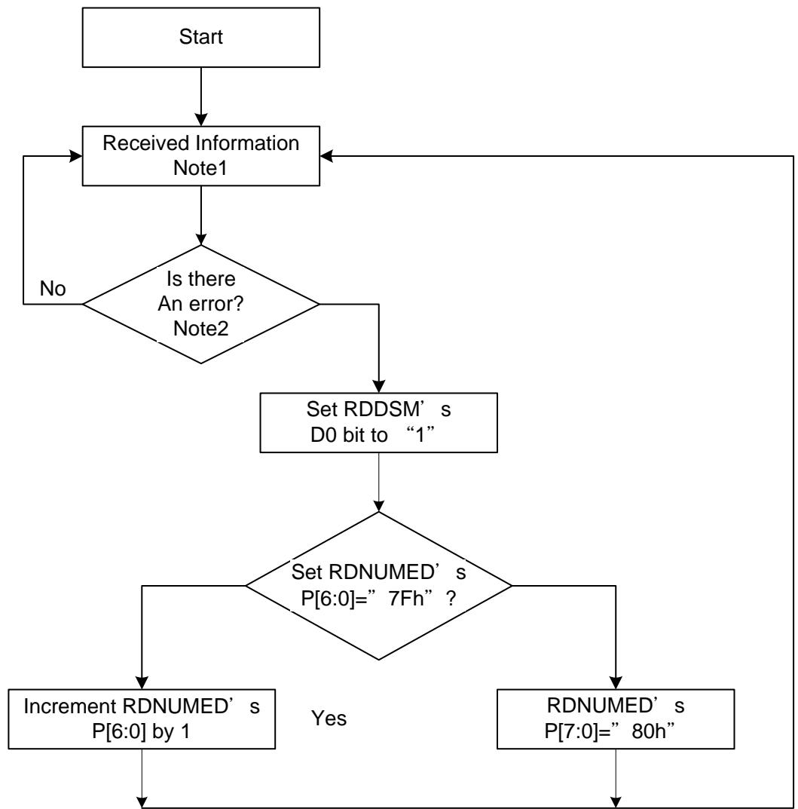

Notes:

1. This information can Interface or Packet Level Communication but it is always from the MCU to the display  
module in this case.  
2. CRC or ECC error.

# DCS Read Long Response (DCSRR-L), Data Type = 01 1100(1Ch)

“DCS Read Long Response” (DCSRR-L) is always using a Long Packet (LPa), what is defined on Data Type (DT,01 1100b), from the display module to the MCU. “DCS Read Long Response” (DCSRR-L) is used when the display module wants to response a DCS Read command, which the MCU has sent to the display module.

"DCS Read Long Response" (DCSRR-L) is used when the display module wants to response a DCS Read command, which the MCU has sent to the display module.

Long Packet (LPa), which includes 5 data bytes of the Packet Data (PD), is defined e.g.

Data Identification (DI)

- Virtual Channel (VC, DI[7...6]): 00b  
- Data Type (DT, DI[5...0]): 01 1100b

- Word Count (WC)  
- Word Count (WC): 0005h  
- Error Correction Code (ECC)  
- Packet Data (PD):

Data 0:89h  
Data 1:23h  
Data 2:12h  
Data 3: A2h  
Data 4: E2h

- Packet Footer (PF)

This is defined on the Long Packet (LP) as follows.

Packet Header (PH)  

<table><tr><td colspan="8">DI</td><td colspan="8">WC (LSB)</td><td colspan="8">WC (MSB)</td><td colspan="7">ECC</td></tr><tr><td colspan="8">1C hex</td><td colspan="8">05 hex</td><td colspan="8">00 hex</td><td colspan="7">29 hex</td></tr><tr><td>0</td><td>0</td><td>1</td><td>1</td><td>1</td><td>0</td><td>0</td><td>0</td><td>1</td><td>0</td><td>1</td><td>0</td><td>0</td><td>0</td><td>0</td><td>0</td><td>0</td><td>0</td><td>0</td><td>0</td><td>0</td><td>0</td><td>0</td><td>0</td><td>1</td><td>0</td><td>0</td><td>1</td><td>0</td><td>1</td><td>0</td></tr><tr><td>B</td><td>B</td><td>B</td><td>B</td><td>B</td><td>B</td><td>B</td><td>B</td><td>B</td><td>B</td><td>B</td><td>B</td><td>B</td><td>B</td><td>B</td><td>B</td><td>B</td><td>B</td><td>B</td><td>B</td><td>B</td><td>B</td><td>B</td><td>B</td><td>B</td><td>B</td><td>B</td><td>B</td><td>B</td><td>B</td><td>B</td></tr><tr><td>0</td><td>1</td><td>2</td><td>3</td><td>4</td><td>5</td><td>6</td><td>7</td><td>0</td><td>1</td><td>2</td><td>3</td><td>4</td><td>5</td><td>6</td><td>7</td><td>0</td><td>1</td><td>2</td><td>3</td><td>4</td><td>5</td><td>6</td><td>7</td><td>0</td><td>1</td><td>2</td><td>3</td><td>4</td><td>5</td><td>6</td></tr><tr><td>L</td><td></td><td></td><td></td><td></td><td></td><td></td><td>M</td><td>L</td><td></td><td></td><td></td><td></td><td></td><td></td><td>M</td><td>L</td><td></td><td></td><td></td><td></td><td></td><td>M</td><td>L</td><td></td><td></td><td></td><td></td><td></td><td>M</td><td></td></tr><tr><td>S</td><td></td><td></td><td></td><td></td><td></td><td></td><td>S</td><td>S</td><td></td><td></td><td></td><td></td><td></td><td></td><td>S</td><td>S</td><td></td><td></td><td></td><td></td><td></td><td>S</td><td>S</td><td></td><td></td><td></td><td></td><td></td><td>S</td><td></td></tr><tr><td>B</td><td></td><td></td><td></td><td></td><td></td><td></td><td>B</td><td>B</td><td></td><td></td><td></td><td></td><td></td><td></td><td>B</td><td>B</td><td></td><td></td><td></td><td></td><td></td><td>B</td><td>B</td><td></td><td></td><td></td><td></td><td></td><td>B</td><td></td></tr></table>

Packet Data (PD)  

<table><tr><td colspan="7">Data 0 (DCS)</td><td colspan="7">Data 1(1stparameter)</td><td colspan="7">Data 2(2ndparameter)</td><td colspan="7">Data 3(3rdparameter)</td><td></td><td></td><td></td></tr><tr><td colspan="7">89 hex</td><td colspan="7">23 hex</td><td colspan="7">12 hex</td><td colspan="7">A2 hex</td><td></td><td></td><td></td></tr><tr><td>0</td><td>0</td><td>0</td><td>1</td><td>1</td><td>0</td><td>0</td><td>1</td><td>1</td><td>1</td><td>0</td><td>0</td><td>0</td><td>1</td><td>0</td><td>0</td><td>1</td><td>0</td><td>0</td><td>1</td><td>0</td><td>0</td><td>0</td><td>1</td><td>0</td><td>0</td><td>1</td><td>0</td><td>1</td><td></td><td></td></tr><tr><td>B</td><td>B</td><td>B</td><td>B</td><td>B</td><td>B</td><td>B</td><td>B</td><td>B</td><td>B</td><td>B</td><td>B</td><td>B</td><td>B</td><td>B</td><td>B</td><td>B</td><td>B</td><td>B</td><td>B</td><td>B</td><td>B</td><td>B</td><td>B</td><td>B</td><td>B</td><td>B</td><td>B</td><td>B</td><td></td><td></td></tr><tr><td>0</td><td>1</td><td>2</td><td>3</td><td>4</td><td>5</td><td>6</td><td>7</td><td>0</td><td>1</td><td>2</td><td>3</td><td>4</td><td>5</td><td>6</td><td>7</td><td>0</td><td>1</td><td>2</td><td>3</td><td>4</td><td>5</td><td>6</td><td>7</td><td>0</td><td>1</td><td>2</td><td>3</td><td>4</td><td>5</td><td>6</td></tr><tr><td>L</td><td></td><td></td><td></td><td></td><td></td><td></td><td>M</td><td>L</td><td></td><td></td><td></td><td></td><td></td><td>M</td><td>L</td><td></td><td></td><td></td><td></td><td></td><td>M</td><td>L</td><td></td><td></td><td></td><td></td><td></td><td>M</td><td></td><td></td></tr><tr><td>S</td><td></td><td></td><td></td><td></td><td></td><td></td><td>S</td><td>S</td><td></td><td></td><td></td><td></td><td></td><td>S</td><td>S</td><td></td><td></td><td></td><td></td><td></td><td>S</td><td>S</td><td></td><td></td><td></td><td></td><td></td><td>S</td><td></td><td></td></tr><tr><td>B</td><td></td><td></td><td></td><td></td><td></td><td></td><td>B</td><td>B</td><td></td><td></td><td></td><td></td><td></td><td>B</td><td>B</td><td></td><td></td><td></td><td></td><td></td><td>B</td><td>B</td><td></td><td></td><td></td><td></td><td></td><td>B</td><td></td><td></td></tr></table>

Packet Data (PD)  

<table><tr><td colspan="8">Data 4(4stparameter)</td><td colspan="8">CRC(LSB)</td><td colspan="8">CRC(MSB)</td></tr><tr><td colspan="8">E2 hex</td><td colspan="8">59 hex</td><td colspan="8">29 hex</td></tr><tr><td>0</td><td>1</td><td>1</td><td>1</td><td>0</td><td>1</td><td>0</td><td>0</td><td>1</td><td>0</td><td>0</td><td>1</td><td>1</td><td>0</td><td>1</td><td>0</td><td>1</td><td>0</td><td>0</td><td>1</td><td>0</td><td>1</td><td>0</td><td>0</td></tr><tr><td>B</td><td>B</td><td>B</td><td>B</td><td>B</td><td>B</td><td>B</td><td>B</td><td>B</td><td>B</td><td>B</td><td>B</td><td>B</td><td>B</td><td>B</td><td>B</td><td>B</td><td>B</td><td>B</td><td>B</td><td>B</td><td>B</td><td>B</td><td>B</td></tr><tr><td>0</td><td>1</td><td>2</td><td>3</td><td>4</td><td>5</td><td>6</td><td>7</td><td>0</td><td>1</td><td>2</td><td>3</td><td>4</td><td>5</td><td>6</td><td>7</td><td>0</td><td>1</td><td>2</td><td>3</td><td>4</td><td>5</td><td>6</td><td>7</td></tr><tr><td>L</td><td></td><td></td><td></td><td></td><td></td><td></td><td>M</td><td>L</td><td></td><td></td><td></td><td></td><td></td><td></td><td>M</td><td>L</td><td></td><td></td><td></td><td></td><td></td><td>M</td><td></td></tr><tr><td>S</td><td></td><td></td><td></td><td></td><td></td><td></td><td>S</td><td>S</td><td></td><td></td><td></td><td></td><td></td><td></td><td>S</td><td>S</td><td></td><td></td><td></td><td></td><td></td><td>S</td><td></td></tr><tr><td>B</td><td></td><td></td><td></td><td></td><td></td><td></td><td>B</td><td>B</td><td></td><td></td><td></td><td></td><td></td><td></td><td>B</td><td>B</td><td></td><td></td><td></td><td></td><td></td><td>B</td><td></td></tr></table>

DCS Read Long Response(DCSRR-L)-Example

# DCS Read Short Response, 1 Byte Returned (DCSRR1-S), Data Type = 10001(21h)

“DCS Read Short Response, 1 Byte Returned” (DCSRR1-S) is always using a Short Packet (SPa), what is defined on Data Type (DT, 10 0001b), from the display module to the MCU. “DCS Read Short Response, 1 Byte Returned” (DCSRR1-S) is used when the display module wants to response a DCS Read command, which the MCU has sent to the display module.

Short Packet (SPa) is defined e.g.

Data Identification (DI)

- Virtual Channel (VC, DI[7...6]): 00b  
- Data Type (DT, DI[5...0]): 10 0001b

- Packet Data (PD):

Data 0:45h  
Data 1:00h (Always)

- Error Correction Code (ECC)

This is defined on the Short Packet (SP) as follows.

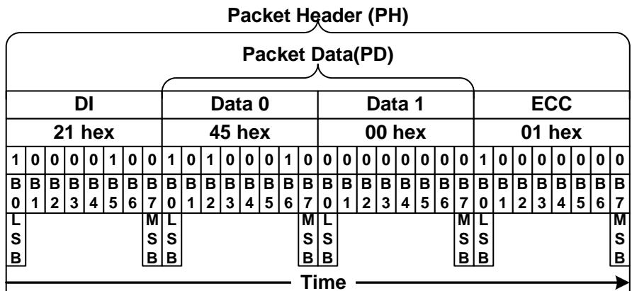  
DCS Read Short Response,1 Byte Returned(DCSRR1-S)-Example

DCS Read Short Response, 2 Bytes Returned (DCSRR2-S), Data Type = 10 0010(22h)

“DCS Read Short Response, 2 Bytes Returned” (DCSRR2-S) is always using a Short Packet (SPa), what is defined on Data Type (DT, 10 0010b), from the display module to the MCU. “DCS Read Short Response, 2 Bytes Returned” (DCSRR2-S) is used when the display module wants to response a DCS Read command, which the MCU has sent to the display module.

Short Packet (SPa) is defined e.g.

Data Identification (DI)

- Virtual Channel (VC, DI[7...6]): 00b  
- Data Type (DT, DI[5...0]): 10 0010b

- Packet Data (PD):

Data 0:45h  
Data 1:32h

- Error Correction Code (ECC)

This is defined on the Short Packet (SPa) as follows.

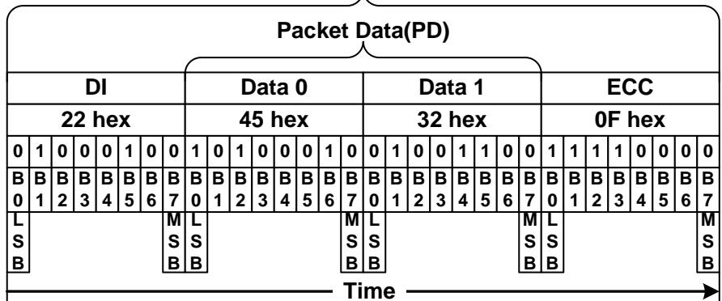  
Packet Header (PH)

DCS Read Short Response,2 Bytes Returned (DCSRR2-S) -Example

# Generic Read Long Response (GENRR-L), Data Type = 01 1010(1Ah)

"Generic Read Long Response" (GENRR-L) is always using a Long Packet (LPa), what is defined on Data Type (DT, 01 1010b), from the display module to the MCU. "Generic Read Long Response" (GENRR-L) is used when the display module wants to response a Generic Read command, which the MCU has sent to the display module. Long Packet (LPa), which includes 5 data bytes of the Packet Data (PD), is defined e.g.

Data Identification (DI)

- Virtual Channel (VC, DI[7...6]): 00b  
- Data Type (DT, DI[5...0]): 01 1010b

- Word Count (WC)  
- Word Count (WC): 0005h  
- Error Correction Code (ECC)  
- Packet Data (PD):

Data 0:89h  
Data 1:23h  
Data 2:12h  
Data 3: A2h  
Data 4: E2h

- Packet Footer (PF)

This is defined on the Long Packet (LP) as follows.

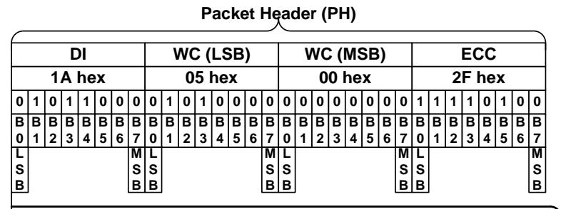

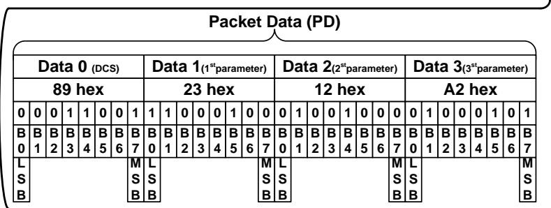

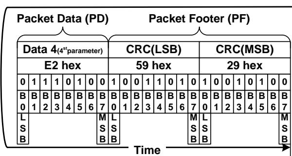

# Generic Read Short Response, 1 Byte Returned (GENRR1-S), Data Type = 010001(11h)

"Generic Read Short Response, 1 Byte Returned" (GENRR1-S) is always using a Short Packet (SPa), what is defined on Data Type (DT, 01 0001b), from the display module to the MCU. "Generic Read Short Response, 1 Byte Returned" (GENRR1-S) is used when the display module wants to response a Generic Read command, which the MCU has sent to the display module.

Short Packet (SPa) is defined e.g.

Data Identification (DI)

- Virtual Channel (VC, DI[7...6]): 00b  
- Data Type (DT, DI[5...0]): 01 0001b

- Packet Data (PD):

Data 0:45h  
Data 1:00h (Always)

- Error Correction Code (ECC)

This is defined on the Short Packet (SP) as follows.

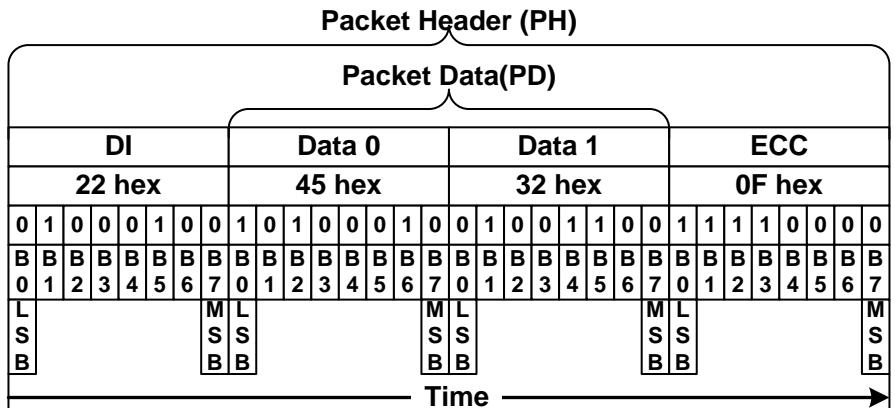  
Generic Read Short Response,1 Byte Returned (GENRR1-S)-Example

# Generic Read Short Response, 2 Bytes Returned (GENRR2-S), Data Type = 01 0010(12h)

"Generic Read Short Response, 2 Bytes Returned" (GENRR2-S) is always using a Short Packet (SPa), what is defined on Data Type (DT, 01 0010b), from the display module to the MCU. "Generic Read Short Response, 2 Bytes Returned" (GENRR2-S) is used when the display module wants to response a Generic Read command, which the MCU has sent to the display module.

Short Packet (SPa) is defined e.g.

Data Identification (DI)

- Virtual Channel (VC, DI[7...6]): 00b  
- Data Type (DT, DI[5...0]): 01 0010b

- Packet Data (PD):

Data 0:45h  
Data 1:32h

- Error Correction Code (ECC)

This is defined on the Short Packet (SP) as follows.

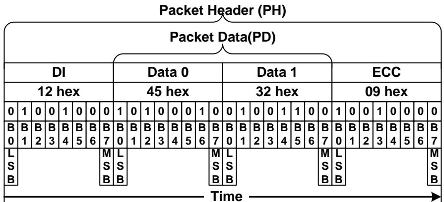

Generic Read Short Response, 2 Bytes Returned (GENRR2-S)-Example

# 8.7.2.3.3 COMMUNICATION SEQUENCES

# 8.7.2.3.3.1 GENERAL

The communication sequences can be done on interface or packet levels between the MCU and the display module. See chapters "Interface Level Communication" and "Packet Level Communication".

This communication sequence description is for DSI data lanes and it has been assumed that the needed low level communication is done on DSI clock lanes (DSI-CLK+/-) automatically.

Functions of the interface level communication is described on the following table.

<table><tr><td>Interface Mode</td><td>Abbreviation</td><td>Interface Action Description</td></tr><tr><td rowspan="7">Low Power</td><td>LP-11</td><td>Stop state</td></tr><tr><td>LPDT</td><td>Low power data transmission</td></tr><tr><td>ULPS</td><td>Ultra-Low power state</td></tr><tr><td>RAR</td><td>Remote application reset</td></tr><tr><td>TEE</td><td>Tearing effect event</td></tr><tr><td>ACK</td><td>Acknowledge (No error)</td></tr><tr><td>BTA</td><td>Bus turnaround</td></tr><tr><td>High Speed</td><td>HSDT</td><td>High speed data transmission</td></tr></table>

Functions of the packet level communication are described on the following table.

Table 21 Interface Level Communication  

<table><tr><td>Packet Sender</td><td>Abbreviation</td><td>Packet Size</td><td>Packet Description</td></tr><tr><td rowspan="6">MCU</td><td>DCSW1-S</td><td>SPa</td><td>DCS Write,1 Parameter</td></tr><tr><td>DCSWN-S</td><td>SPa</td><td>DCS Write, No parameter</td></tr><tr><td>DCSW-L</td><td>LPa</td><td>DCS Write, Long</td></tr><tr><td>DCSRN-S</td><td>SPa</td><td>DCS Read, No Parameter</td></tr><tr><td>SMRPS-S</td><td>SPa</td><td>Set maximum return packet size</td></tr><tr><td>NP-L</td><td>LPa</td><td>Null packet, No data</td></tr><tr><td rowspan="4">Display Module</td><td>AwER</td><td>SPa</td><td>Acknowledge with error report</td></tr><tr><td>DCSRR-L</td><td>LPa</td><td>DCS Read, Long Response</td></tr><tr><td>DCSRR1-S</td><td>SPa</td><td>DCS Read, Short Response</td></tr><tr><td>DCSRR2-S</td><td>SPa</td><td>DCS Read, Short Response</td></tr></table>

Table 22 Packet Level Communication

8.7.2.3.3.2

SEQUENCES

# DCS Write, 1 Parameter Sequence

A Short Packet (SPa) of "Display Command Set (DCS) Write, 1 Parameter (DCSW1-S)" is defined on chapter "Display Command Set (DCS) Write, 1 Parameter (DCSW1-S)" and example sequences, how this packet is used, is described on following tables.

DCS Write,1 Parameter Sequence - Example 1  

<table><tr><td rowspan="2">Line</td><td colspan="2">MCU</td><td rowspan="2">Information Direction</td><td colspan="2">Display Module</td><td rowspan="2">Comment</td></tr><tr><td>Packet Sender</td><td>Interface Mode Control</td><td>Interface Mode Control</td><td>Packet Sender</td></tr><tr><td>1</td><td>-</td><td>LP-11</td><td>=&gt;</td><td>-</td><td>-</td><td>Start</td></tr><tr><td>2</td><td>DCSW1-S</td><td>LPDT</td><td>=&gt;</td><td>-</td><td>-</td><td></td></tr><tr><td>3</td><td>-</td><td>LP-11</td><td>=&gt;</td><td>-</td><td>-</td><td>End</td></tr></table>

DCS Write,1 Parmeter Sequence - Example2  

<table><tr><td rowspan="2">Line</td><td colspan="2">MCU</td><td rowspan="2">Information Direction</td><td colspan="2">Display Module</td><td rowspan="2">Comment</td></tr><tr><td>Packet Sender</td><td>Interface Mode Control</td><td>Interface Mode Control</td><td>Packet Sender</td></tr><tr><td>1</td><td>-</td><td>LP-11</td><td>=&gt;</td><td>-</td><td>-</td><td>Start</td></tr><tr><td>2</td><td>DCSW1-S</td><td>HSDT</td><td>=&gt;</td><td>-</td><td>-</td><td></td></tr><tr><td>3</td><td>EoTP</td><td>HSDT</td><td>=&gt;</td><td>-</td><td>-</td><td>End of Transmission Packet</td></tr><tr><td>4</td><td>-</td><td>LP-11</td><td>=&gt;</td><td>-</td><td>-</td><td>End</td></tr></table>

DCS Write, 1 Parameter Sequence - Example 3  

<table><tr><td rowspan="2">Line</td><td colspan="2">MCU</td><td rowspan="2">Information Direction</td><td colspan="2">Display Module</td><td rowspan="2">Comment</td></tr><tr><td>Packet Sender</td><td>Interface Mode Control</td><td>Interface Mode Control</td><td>Packet Sender</td></tr><tr><td>1</td><td>-</td><td>LP-11</td><td>=&gt;</td><td>-</td><td>-</td><td>Start</td></tr><tr><td>2</td><td>DCSW1-S</td><td>HSDT</td><td>=&gt;</td><td>-</td><td>-</td><td></td></tr><tr><td>3</td><td>EoTP</td><td>HSDT</td><td>=&gt;</td><td>-</td><td>-</td><td>End of Transmission Packet</td></tr><tr><td>4</td><td>-</td><td>LP-11</td><td>=&gt;</td><td>-</td><td>-</td><td></td></tr><tr><td>5</td><td>-</td><td>BTA</td><td>&lt;=</td><td>BTA</td><td>-</td><td>Interface control change from the MCU to the display module</td></tr><tr><td>6</td><td>-</td><td>-</td><td>&lt;=</td><td>LP-11</td><td>-</td><td>If no error=&gt;goto line8
If error=goto line 13</td></tr><tr><td>7</td><td></td><td></td><td></td><td></td><td></td><td></td></tr><tr><td>8</td><td>-</td><td>-</td><td>&lt;=</td><td>ACK</td><td>-</td><td>No error</td></tr><tr><td>9</td><td>-</td><td>-</td><td>&lt;=</td><td>LP-11</td><td>-</td><td></td></tr><tr><td>10</td><td>-</td><td>BTA</td><td>&lt;=</td><td>BTA</td><td>-</td><td>Interface control change from the display module to the MCU</td></tr><tr><td>11</td><td>-</td><td>LP-11</td><td>=&gt;</td><td>-</td><td>-</td><td>End</td></tr><tr><td>12</td><td></td><td></td><td></td><td></td><td></td><td></td></tr><tr><td>13</td><td>-</td><td>-</td><td>&lt;=</td><td>LPDT</td><td>AwER</td><td>Error report</td></tr><tr><td>14</td><td>-</td><td>-</td><td>&lt;=</td><td>LP-11</td><td>-</td><td></td></tr><tr><td>15</td><td>-</td><td>BTA</td><td>&lt;=</td><td>BTA</td><td>-</td><td></td></tr><tr><td>16</td><td>-</td><td>LP-11</td><td>=&gt;</td><td>-</td><td>-</td><td>End</td></tr></table>

# DCS Write, No Parameter Sequence

A Short Packet (SPa) of "Display Command Set (DCS) Write, No Parameter (DCSWN-S)" is defined on chapter "Display Command Set (DCS) Write, No Parameter (DCSWN-S)" and example sequences, how this packet is used, is described on following tables.

DCS Write,No Parameter Sequence-Example 1  

<table><tr><td rowspan="2">Line</td><td colspan="2">MCU</td><td rowspan="2">Information Direction</td><td colspan="2">Display Module</td><td rowspan="2">Comment</td></tr><tr><td>Packet Sender</td><td>Interface Mode Control</td><td>Interface Mode Control</td><td>Packet Sender</td></tr><tr><td>1</td><td>-</td><td>LP-11</td><td>=&gt;</td><td>-</td><td>-</td><td>Start</td></tr><tr><td>2</td><td>DCSW1-S</td><td>LPDT</td><td>=&gt;</td><td>-</td><td>-</td><td></td></tr><tr><td>3</td><td>-</td><td>LP-11</td><td>=&gt;</td><td>-</td><td>-</td><td>End</td></tr></table>

DCS Write,No Parmeter Sequence - Example2  

<table><tr><td rowspan="2">Line</td><td colspan="2">MCU</td><td rowspan="2">Information Direction</td><td colspan="2">Display Module</td><td rowspan="2">Comment</td></tr><tr><td>Packet Sender</td><td>Interface Mode Control</td><td>Interface Mode Control</td><td>Packet Sender</td></tr><tr><td>1</td><td>-</td><td>LP-11</td><td>=&gt;</td><td>-</td><td>-</td><td>Start</td></tr><tr><td>2</td><td>DCSW1-S</td><td>HSDT</td><td>=&gt;</td><td>-</td><td>-</td><td></td></tr><tr><td>3</td><td>EoTP</td><td>HSDT</td><td>=&gt;</td><td>-</td><td>-</td><td>End of Transmission Packet</td></tr><tr><td>4</td><td>-</td><td>LP-11</td><td>=&gt;</td><td>-</td><td>-</td><td>End</td></tr></table>

DCS Write, No Parameter Sequence - Example 3  

<table><tr><td rowspan="2">Line</td><td colspan="2">MCU</td><td rowspan="2">Information Direction</td><td colspan="2">Display Module</td><td rowspan="2">Comment</td></tr><tr><td>Packet Sender</td><td>Interface Mode Control</td><td>Interface Mode Control</td><td>Packet Sender</td></tr><tr><td>1</td><td>-</td><td>LP-11</td><td>=&gt;</td><td>-</td><td>-</td><td>Start</td></tr><tr><td>2</td><td>DCSW1-S</td><td>HSDT</td><td>=&gt;</td><td>-</td><td>-</td><td></td></tr><tr><td>3</td><td>EoTP</td><td>HSDT</td><td>=&gt;</td><td>-</td><td>-</td><td>End of Transmission Packet</td></tr><tr><td>4</td><td>-</td><td>LP-11</td><td>=&gt;</td><td>-</td><td>-</td><td></td></tr><tr><td>5</td><td>-</td><td>BTA</td><td>&lt;=</td><td>BTA</td><td>-</td><td>Interface control change from the MCU to the display module</td></tr><tr><td>6</td><td>-</td><td>-</td><td>&lt;=</td><td>LP-11</td><td>-</td><td>If no error=&gt;goto line8
If error=goto line 13</td></tr><tr><td>7</td><td></td><td></td><td></td><td></td><td></td><td></td></tr><tr><td>8</td><td>-</td><td>-</td><td>&lt;=</td><td>ACK</td><td>-</td><td>No error</td></tr><tr><td>9</td><td>-</td><td>-</td><td>&lt;=</td><td>LP-11</td><td>-</td><td></td></tr><tr><td>10</td><td>-</td><td>BTA</td><td>&lt;=</td><td>BTA</td><td>-</td><td>Interface control change from the display module to the MCU</td></tr><tr><td>11</td><td>-</td><td>LP-11</td><td>=&gt;</td><td>-</td><td>-</td><td>End</td></tr><tr><td>12</td><td></td><td></td><td></td><td></td><td></td><td></td></tr><tr><td>13</td><td>-</td><td>-</td><td>&lt;=</td><td>LPDT</td><td>AwER</td><td>Error report</td></tr><tr><td>14</td><td>-</td><td>-</td><td>&lt;=</td><td>LP-11</td><td>-</td><td></td></tr><tr><td>15</td><td>-</td><td>BTA</td><td>&lt;=</td><td>BTA</td><td>-</td><td></td></tr><tr><td>16</td><td>-</td><td>LP-11</td><td>=&gt;</td><td>-</td><td>-</td><td>End</td></tr></table>

# DCS Write Long Sequence

A Long Packet (LPa) of "Display Command Set (DCS) Write Long (DCSW-L)" is defined on chapter "Display Command Set (DCS) Write Long (DCSW-L)" and example sequences, how this packet is used, is described on following tables.

DCS Write, Long Sequence-Example 1  

<table><tr><td rowspan="2">Line</td><td colspan="2">MCU</td><td rowspan="2">Information Direction</td><td colspan="2">Display Module</td><td rowspan="2">Comment</td></tr><tr><td>Packet Sender</td><td>Interface Mode Control</td><td>Interface Mode Control</td><td>Packet Sender</td></tr><tr><td>1</td><td>-</td><td>LP-11</td><td>=&gt;</td><td>-</td><td>-</td><td>Start</td></tr><tr><td>2</td><td>DCSW-L</td><td>LPDT</td><td>=&gt;</td><td>-</td><td>-</td><td></td></tr><tr><td>3</td><td>-</td><td>LP-11</td><td>=&gt;</td><td>-</td><td>-</td><td>End</td></tr></table>

DCS Write, Long Sequence - Example2  

<table><tr><td rowspan="2">Line</td><td colspan="2">MCU</td><td rowspan="2">Information Direction</td><td colspan="2">Display Module</td><td rowspan="2">Comment</td></tr><tr><td>Packet Sender</td><td>Interface Mode Control</td><td>Interface Mode Control</td><td>Packet Sender</td></tr><tr><td>1</td><td>-</td><td>LP-11</td><td>=&gt;</td><td>-</td><td>-</td><td>Start</td></tr><tr><td>2</td><td>DCSW-L</td><td>HSDT</td><td>=&gt;</td><td>-</td><td>-</td><td></td></tr><tr><td>3</td><td>EoTP</td><td>HSDT</td><td>=&gt;</td><td>-</td><td>-</td><td>End of Transmission Packet</td></tr><tr><td>4</td><td>-</td><td>LP-11</td><td>=&gt;</td><td>-</td><td>-</td><td>End</td></tr></table>

DCS Write, Long Sequence - Example 3  

<table><tr><td rowspan="2">Line</td><td colspan="2">MCU</td><td rowspan="2">Information Direction</td><td colspan="2">Display Module</td><td rowspan="2">Comment</td></tr><tr><td>Packet Sender</td><td>Interface Mode Control</td><td>Interface Mode Control</td><td>Packet Sender</td></tr><tr><td>1</td><td>-</td><td>LP-11</td><td>=&gt;</td><td>-</td><td>-</td><td>Start</td></tr><tr><td>2</td><td>DCSW-L</td><td>HSDT</td><td>=&gt;</td><td>-</td><td>-</td><td></td></tr><tr><td>3</td><td>EoTP</td><td>HSDT</td><td>=&gt;</td><td>-</td><td>-</td><td>End of Transmission Packet</td></tr><tr><td>4</td><td>-</td><td>LP-11</td><td>=&gt;</td><td>-</td><td>-</td><td></td></tr><tr><td>5</td><td>-</td><td>BTA</td><td>&lt;=</td><td>BTA</td><td>-</td><td>Interface control change from the MCU to the display module</td></tr><tr><td>6</td><td>-</td><td>-</td><td>&lt;=</td><td>LP-11</td><td>-</td><td>If no error=&gt;goto line8
If error=goto line 13</td></tr><tr><td>7</td><td></td><td></td><td></td><td></td><td></td><td></td></tr><tr><td>8</td><td>-</td><td>-</td><td>&lt;=</td><td>ACK</td><td>-</td><td>No error</td></tr><tr><td>9</td><td>-</td><td>-</td><td>&lt;=</td><td>LP-11</td><td>-</td><td></td></tr><tr><td>10</td><td>-</td><td>BTA</td><td>&lt;=</td><td>BTA</td><td>-</td><td>Interface control change from the display module to the MCU</td></tr><tr><td>11</td><td>-</td><td>LP-11</td><td>=&gt;</td><td>-</td><td>-</td><td>End</td></tr><tr><td>12</td><td></td><td></td><td></td><td></td><td></td><td></td></tr><tr><td>13</td><td>-</td><td>-</td><td>&lt;=</td><td>LPDT</td><td>AwER</td><td>Error report</td></tr><tr><td>14</td><td>-</td><td>-</td><td>&lt;=</td><td>LP-11</td><td>-</td><td></td></tr><tr><td>15</td><td>-</td><td>BTA</td><td>&lt;=</td><td>BTA</td><td>-</td><td></td></tr><tr><td>16</td><td>-</td><td>LP-11</td><td>=&gt;</td><td>-</td><td>-</td><td>End</td></tr></table>

# DCS Read, No Parameter Sequence

A Short Packet (SPa) of "Display Command Set (DCS) Read, No Parameter (DCSRN-S)" is defined on chapter "Display Command Set (DCS) Read, No Parameter (DCSRN-S)" and example sequences, how this packet is used, is described on following tables.

DCS Read, No Parameter Sequence - Example 1  

<table><tr><td rowspan="2">Line</td><td colspan="2">MCU</td><td rowspan="2">Information Direction</td><td colspan="2">Display Module</td><td rowspan="2">Comment</td></tr><tr><td>Packet Sender</td><td>Interface Mode Control</td><td>Interface Mode Control</td><td>Packet Sender</td></tr><tr><td>1</td><td>-</td><td>LP-11</td><td>=&gt;</td><td></td><td>-</td><td>Start</td></tr><tr><td>2</td><td>SMRPS-S</td><td>HSDT</td><td>=&gt;</td><td></td><td>-</td><td>Define how many data byte is wanted to read: 1 byte</td></tr><tr><td>3</td><td>DCSRN-S</td><td>HSDT</td><td>=&gt;</td><td></td><td>-</td><td>Wanted to get a response ID1 (DAh)</td></tr><tr><td>4</td><td>EoTP</td><td>HSDT</td><td>=&gt;</td><td></td><td>-</td><td>End of Transmission Packet</td></tr><tr><td>5</td><td>-</td><td>LP-11</td><td>=&gt;</td><td></td><td>-</td><td></td></tr><tr><td>6</td><td>-</td><td>BTA</td><td>&lt;=</td><td>BTA</td><td>-</td><td>Interface control change from the MCU to the display module</td></tr><tr><td>7</td><td>-</td><td>-</td><td>&lt;=</td><td>LP-11</td><td>-</td><td>If no error=&gt;goto line 9
If error=&gt;goto line 14
If error is corrected by ECC =&gt;go to line 19</td></tr><tr><td>8</td><td></td><td></td><td></td><td></td><td></td><td></td></tr><tr><td>9</td><td>-</td><td>-</td><td>&lt;=</td><td>LPDT</td><td>DCSRR1-S</td><td>Responded 1 byte return</td></tr><tr><td>10</td><td>-</td><td>-</td><td>&lt;=</td><td>LP-11</td><td>-</td><td></td></tr><tr><td>11</td><td>-</td><td>BTA</td><td>&lt;=</td><td>BTA</td><td>-</td><td>Interface control change from the Display module to the MCU</td></tr><tr><td>12</td><td>-</td><td>LP-11</td><td>=&gt;</td><td>-</td><td>-</td><td>End</td></tr><tr><td>13</td><td></td><td></td><td></td><td></td><td></td><td></td></tr><tr><td>14</td><td>-</td><td>-</td><td>&lt;=</td><td>LPDT</td><td>AwER</td><td>Error report</td></tr><tr><td>15</td><td>-</td><td>-</td><td>&lt;=</td><td>LP-11</td><td>-</td><td></td></tr><tr><td>16</td><td>-</td><td>BTA</td><td>&lt;=</td><td>BTA</td><td>-</td><td>Interface Control change from the Display module to the MCU</td></tr><tr><td>17</td><td>-</td><td>LP-11</td><td>=&gt;</td><td>-</td><td>-</td><td>End</td></tr><tr><td>18</td><td></td><td></td><td></td><td></td><td></td><td></td></tr><tr><td>19</td><td>-</td><td>-</td><td>&lt;=</td><td>LPDT</td><td>DCSRR1-S</td><td>Responded 1 byte return</td></tr><tr><td>20</td><td>-</td><td>-</td><td>&lt;=</td><td>LPDT</td><td>AwER</td><td>Error Report
(Error is Corrected by ECC)</td></tr><tr><td>21</td><td>-</td><td>-</td><td>&lt;=</td><td>LP-11</td><td>-</td><td></td></tr><tr><td>22</td><td>-</td><td>BTA</td><td>&lt;=</td><td>BTA</td><td>-</td><td>Interface control change from the display module to the MCU</td></tr><tr><td>23</td><td>-</td><td>LP-11</td><td>=&gt;</td><td>-</td><td>-</td><td>End</td></tr></table>

# Null Packet, No Data Sequence

A Long Packet (LPa) of "Null Packet, No Data (NP-L)" is defined on chapter "Null Packet, No Data (NP-L)" and example sequences, how this packet is used, is described on following tables.

Null Packet, No Parameter Sequence - Example  

<table><tr><td rowspan="2">Line</td><td colspan="2">MCU</td><td rowspan="2">Information Direction</td><td colspan="2">Display Module</td><td rowspan="2">Comment</td></tr><tr><td>Packet Sender</td><td>Interface Mode Control</td><td>Interface Mode Control</td><td>Packet Sender</td></tr><tr><td>1</td><td>-</td><td>LP-11</td><td>=&gt;</td><td>-</td><td>-</td><td>Start</td></tr><tr><td>2</td><td>NP-L</td><td>HSDT</td><td>=&gt;</td><td>-</td><td>-</td><td>Only high speed data transmission Is used</td></tr><tr><td>3</td><td>EoTP</td><td>HSDT</td><td>=&gt;</td><td>-</td><td>-</td><td>End of Transmission Packet</td></tr><tr><td>4</td><td>-</td><td>LP-11</td><td>=&gt;</td><td>-</td><td>-</td><td>End</td></tr></table>

# End of Transmission Packet

A Short Packet (SPa) of "End of Transmission (EoT)" is defined on chapter "End of Transmission Packet (EoT)" and an example sequences, how this packet is used, is described on following tables.

End of Transmission Packet - Example  

<table><tr><td rowspan="2">Line</td><td colspan="2">MCU</td><td rowspan="2">Information Direction</td><td colspan="2">Display Module</td><td rowspan="2">Comment</td></tr><tr><td>Packet Sender</td><td>Interface Mode Control</td><td>Interface Mode Control</td><td>Packet Sender</td></tr><tr><td>1</td><td>-</td><td>LP-11</td><td>=&gt;</td><td>-</td><td>-</td><td>Start</td></tr><tr><td>2</td><td>NP-L</td><td>HSDT</td><td>=&gt;</td><td>-</td><td>-</td><td>Only high speed data transmission Is used</td></tr><tr><td>3</td><td>EoTP</td><td>HSDT</td><td>=&gt;</td><td>-</td><td>-</td><td>End of Transmission Packet</td></tr><tr><td>4</td><td>-</td><td>LP-11</td><td>=&gt;</td><td>-</td><td>-</td><td>End</td></tr></table>

# 8.7.2.4 Video Mode Communication

Video Mode peripherals require pixel data delivered in real time. This section specifies the format and timing of DSI traffic for this type of display module.

# 8.7.2.4.1 TRANSMISSION PACKET SEQUENCES

DSI supports several formats, or packet sequences, for Video Mode data transmission. The peripheral's timing requirements dictate which format is appropriate. In the following sections, Burst Mode refers to time-compression of the RGB pixel (active video) portion of the transmission. In addition, these terms are used throughout the following sections:

- Non-Burst Mode with Sync Pulses - enables the peripheral to accurately reconstruct original video timing, including sync pulse widths.  
- Non-Burst Mode with Sync Events – similar to above, but accurate reconstruction of sync pulse widths is not required, so a single Sync Event is substituted.  
- Burst mode - RGB pixel packets are time-compressed, leaving more time during a scan line for LP mode (saving power) or for multiplexing other transmissions onto the DSI link.

In the following figures the Blanking or Low-Power Interval (BLLP) is defined as a period during which video packets such as pixel-stream and sync event packets are not actively transmitted to the peripheral. To enable PHY synchronization the host processor should periodically end HS transmission and drive the Data Lanes to the LP state. This transition should take place at least once per frame; shown as LPM in the figures in this section. It is recommended to return to LP state once per scan-line during the horizontal blanking time. Regardless of the frequency of BLLP periods, the host processor is responsible for meeting all documented peripheral timing requirements. Note, at lower frequencies BLLP periods will approach, or become, zero, and burst mode will be indistinguishable from non-burst mode.

During the BLLP the DSI Link may do any of the following:

- Remain in Idle Mode with the host processor in LP-11 state and the peripheral in LP-RX  
- Transmit one or more non-video packets from the host processor to the peripheral using Escape Mode  
- Transmit one or more non-video packets from the host processor to the peripheral using HS Mode  
- If the previous processor-to-peripheral transmission ended with BTA, transmit one or more packets from the peripheral to the host processor using Escape Mode  
- Transmit one or more packets from the host processor to a different peripheral using a different Virtual Channel ID

The sequence of packets within the BLLP or RGB portion of a HS transmission is arbitrary. The host processor may compose any sequence of packets, including iterations, within the limits of the packet format definitions. For all timing cases, the first line of a frame shall start with VS; all other lines shall start with HS. This is also true in the special case when VSA+VBP=0. Note that the position of synchronization packets, such as VS and HS, in time is of utmost importance since this has a direct impact on the visual performance of the display panel.

Normally, RGB pixel data is sent with one full scan line of pixels in a single packet. If necessary, a horizontal scan-line of active pixels may be divided into two or more packets. However, individual pixels shall not be split across packets.

Transmission packet components used in the figures in this section are defined in Figure below unless otherwise specified.

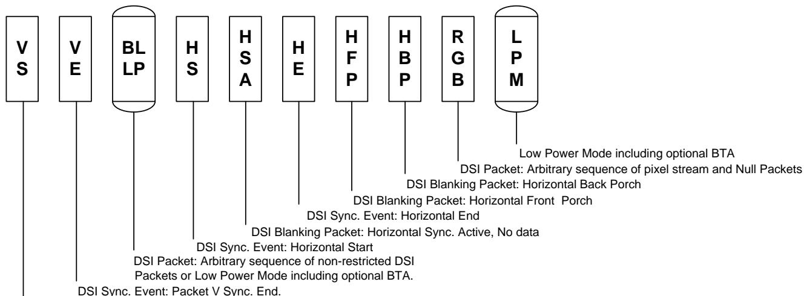  
DSI Sync. Event: Packet V Sync. Start.

# DSI Video Mode Interface Timing Legend

If a peripheral timing specification for HBP or HFP minimum period is zero, the corresponding Blanking Packet may be omitted. If the HBP or HFP maximum period is zero, the corresponding blanking packet shall be omitted. There are two limitation for MIPI Video mode 2 Lane:

(1) The packet number for H-porch or 1-line data should be even.  
(2) Packet Pixel Stream should be start at Lane0.

# 8.7.2.4.2 NON-BURST MODE WITH SYNC PULSES

With this format, the goal is to accurately convey DPI-type timing over the DSI serial Link. This includes matching DPI pixel-transmission rates, and widths of timing events like sync pulses. Accordingly, synchronization periods are defined using packets transmitting both start and end of sync pulses. An example of this mode is shown in Figure below.

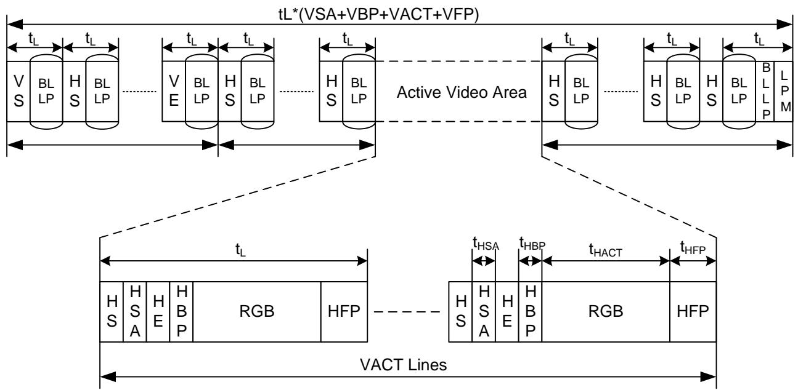  
Figure 83 DSI Video Mode Interface Timing: Non-Burst Transmission with Sync Start and End

Normally, periods shown as HSA (Horizontal Sync Active), HBP (Horizontal Back Porch) and HFP (Horizontal Front Porch) are filled by Blanking Packets, with lengths (including packet overhead) calculated to match the period specified by the peripheral's data sheet. Alternatively, if there is sufficient time to transition from HS to LP mode and back again, a timed interval in LP mode may substitute for a Blanking Packet, thus saving power.

# 8.7.2.4.3 NON-BURST MODE

This mode is a simplification of the format described in section 5.3.2.4.2 “Non-Burst Mode with Sync Pulse”. Only the start of each synchronization pulse is transmitted. The peripheral may regenerate sync pulses as needed from each Sync Event packet received. Pixels are transmitted at the same rate as they would in a corresponding parallel display interface such as DPI-2. An example of this mode is shown in Figure below.

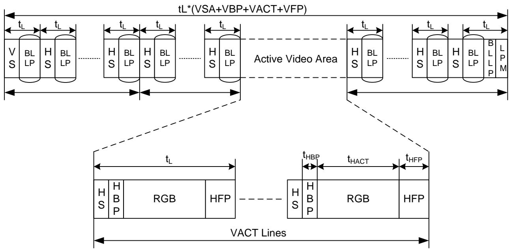  
Figure 84 DSI Video Mode Interface Timing: Non-burst Transmission

As with the previous Non-Burst Mode, if there is sufficient time to transition from HS to LP mode and back again, a timed interval in LP mode may substitute for a Blanking Packet, thus saving power.

# 8.7.2.4.4 BURST MODE

In this mode, blocks of pixel data can be transferred in a shorter time using a time-compressed burst format. This is a good strategy to reduce overall DSI power consumption, as well as enabling larger blocks of time for other data transmissions over the Link in either direction. There may be a line buffer or similar memory on the peripheral to accommodate incoming data at high speed. Following HS pixel data transmission, the bus goes to Low Power Mode, during which it may remain idle, i.e. the host processor remains in LP-11 state, or LP transmission may take place in either direction. If the peripheral takes control of the bus for sending data to the host processor, its transmission time shall be limited to ensure data underflow does not occur from its internal buffer memory to the display device. An example of this mode is shown in Figure below.

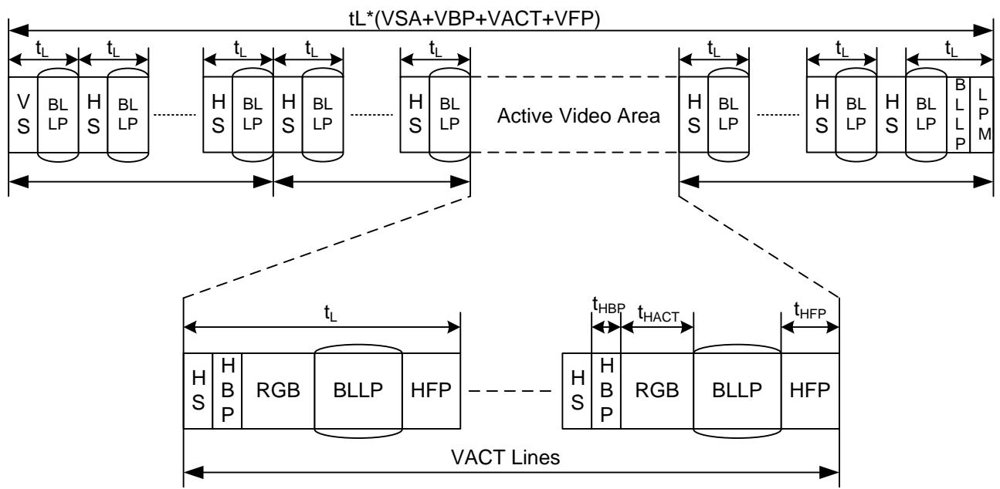  
Figure 85 DSI Video Mode Interface Timing: Burst Transmission

Similar to the Non-Burst Mode scenario, if there is sufficient time to transition from HS to LP mode and back again, a timed interval in LP mode may substitute for a Blanking Packet, thus saving power.

# 9 POWER ON/OFF SEQUENCE

VDDI and VDDA can be applied or powered down in any order. During the Power Off sequence, if the LCD is in the Sleep Out mode, VDDA and VDDI must be powered down with minimum 120msec. If the LCD is in the Sleep In mode, VDDA and VDDI can be powered down with minimum 0msec after the RESX is released.

CSX can be applied at any timing or can be permanently grounded. RESX has high priority over CSX.

Notes:

1. There will be no damage to the ST7701S if the power sequences are not met.  
2. There will be no abnormal visible effects on the display panel during the Power On/Off Sequences.  
3. There will be no abnormal visible effects on the display between the end of Power On Sequence and before receiving the Sleep Out command, and also between receiving the Sleep In command and the Power Off Sequence.  
4. If the RESX line is not steadily held by the host during the Power On Sequence as defined in Sections 9.1 and  
9.2, then it will be necessary to apply the Hardware Reset (RESX) after the completion of the Host Power On

Sequence to ensure correct operations. Otherwise, all the functions are not guaranteed.

The power on/off sequence is illustrated below

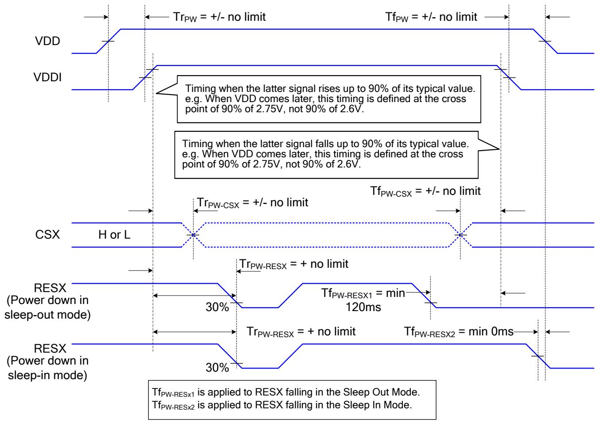

# 9.1 Uncontrolled Power Off

The uncontrolled power-off means a situation which removed a battery without the controlled power off sequence. It will neither damage the module or the host interface.

If uncontrolled power-off happened, the display will go blank and there will not any visible effect on the display (blank display) and remains blank until "Power On Sequence" powers it up.

# 10 POWER LEVEL DEFINITION

# 10.1 Power Level

7 level modes are defined they are in order of maximum power consumption to minimum power consumption:

1. Normal Mode On (full display), Idle Mode Off, Sleep Out.  
In this mode, the display is able to show maximum 16.7M colors.  
2. Partial Mode On, Idle Mode Off, Sleep Out  
In this mode, part of the display is used with maximum 16.7M colors.  
3. Normal Mode On (full display), Idle Mode On, Sleep Out.  
In this mode, the full display is used but with 8 colors.  
4. Partial Mode On, Idle Mode On, Sleep Out

In this mode, part of the display is used but with 8 colors.

5. Sleep In Mode.

In this mode, the DC/DC converter, internal oscillator and panel driver circuit are stopped. Only the MPU interface and registers are working with VDDI power supply.

6. Deep Standby Mode.

In this mode, the DC/DC converter, internal oscillator and panel driver circuit are stopped. The MPU interface and registers are not working.

7. Power Off Mode

In this mode, VDDI and VDDA/VDDB are removed.

NOTE: Transition between mode 1~5 is controllable by MPU commands. Mode 6 is entered for power saving with

both power supplies for I/O and analog circuits and can be exited by hardware reset only (RESX=L). Mode 7 is entered only when both power supplies for I/O and analog circuits are removed.

10.2 Power Flow Chart  
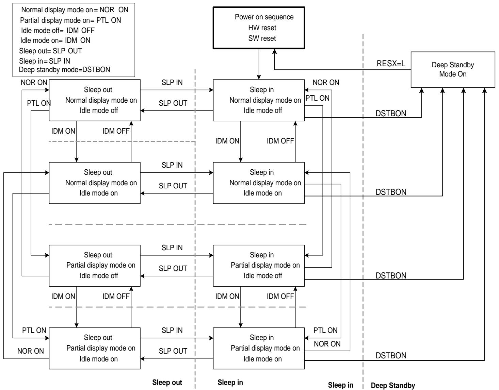  
NOTES:  
1) There is not any abnormal visual effect when there is changing from one power mode to another power mode.  
2) There is not any limitation, which is not specified by this spec, when there is changing from one power mode to another power mode

The following table represents the Registers its mode state.  

<table><tr><td rowspan="2">Mode</td><td rowspan="2">Register</td><td colspan="2">Control</td></tr><tr><td>Enter</td><td>Exit</td></tr><tr><td>Sleep in mode</td><td>Keep</td><td colspan="2">Command</td></tr><tr><td>Deep-standby mode</td><td>Loss</td><td>Command</td><td>Reset pin</td></tr><tr><td>Reset=L</td><td>Keep(Default Value)</td><td colspan="2">Reset (H/W)</td></tr></table>

The condition for irregular power off mode is shown below.  

<table><tr><td>Power Off Mode</td><td>VDD</td><td>VDDI</td><td>RESX</td><td>I/O</td></tr><tr><td>Mode 1</td><td>ON</td><td>OFF</td><td>High to Low</td><td>Low</td></tr><tr><td>Mode 2</td><td>OFF</td><td>ON</td><td>High to Low</td><td>Low</td></tr></table>

Note: VDD means VDDA, VDDB

# 10.3 Sleep Out -Command and self-diagnostic functions of the display module

# 10.3.1 Register loading Detection

Sleep Out-command is a trigger for an internal function of the display module, which indicates, if the display module loading function of factory default values from ROM to registers of the display controller is working properly.

There are compared factory values of the ROM and register values of the display controller by the display controller (1st step: compare register and ROM values, 2nd step: loads ROM values to registers). If those both values (ROM and register values) are same, there is inverted (= increased by 1) a bit, which is defined in command RDDSDR (The used bit of this command is D7). If those both values are not same, this bit (D7) is not inverted (= not increased by 1).

The flow chart for this internal function is following:

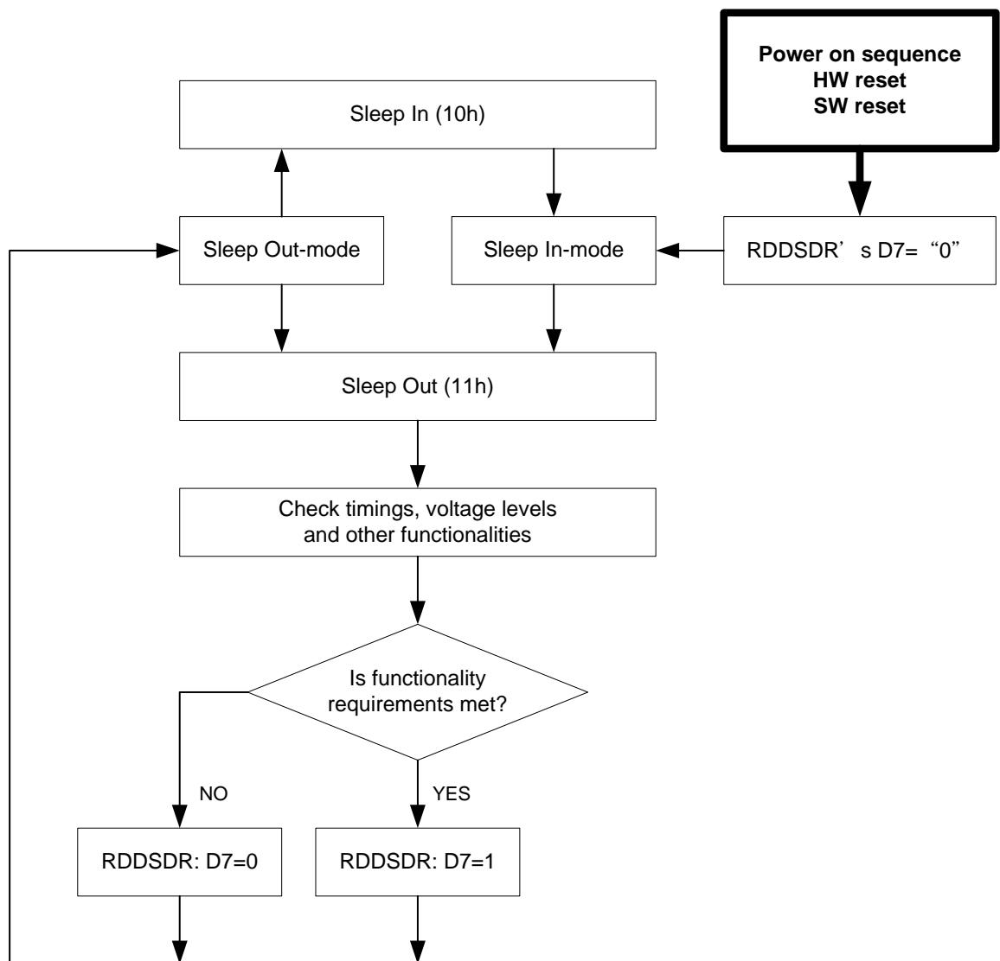

# 10.3.2 Functionality Detection

Sleep Out-command is a trigger for an internal function of the display module.

The internal function (= the display controller) is comparing if the display module is still meeting functionality requirements (e.g. booster voltage levels, timings, etc.). If functionality requirement is met, bit-6 of RDDSDR is set to 1, which defined in command Read Display Self-Diagnostic Result (RDDSDR). The used bit of this command is D6. If functionality requirement is not same, this bit (D6) is set to 0.

The flow chart for this internal function is following:

# 11 GAMMA CORRECTION

ST7701S incorporate the gamma correction function to display 16M colors for the LCD panel. The gamma correction is performed with 3 groups of registers, which are gradient adjustment, contrast adjustment and fine- adjustment registers for positive and negative polarities, and RGB can be adjusted individually.

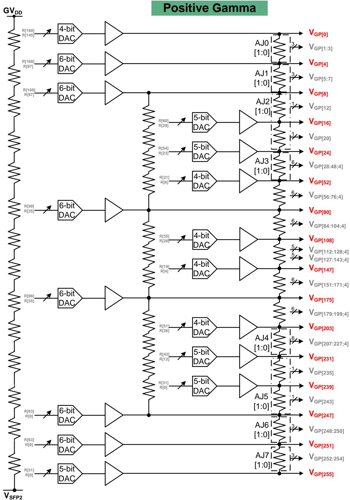  
Figure 86 Gray scale Voltage Generation (Positive)

  
Figure 87 Gray scale Voltage Generation (Positive)

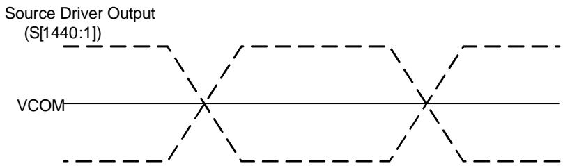  
Figure 88 Relationship between Source Output and VCOM

Percentage adjustment:

AJ0P[1:0], AJ1P[1:0], AJ2P[1:0], AJ3P[1:0], AJ0N[1:0], AJ1N[1:0], AJ2N[1:0], AJ3N[1:0], these register are used to adjust the voltage level of interpolation point. The following table is the detail description.

AJ0P[1:0]/AJ0N[1:0]:  

<table><tr><td></td><td>00h</td><td>01h</td><td>02h</td><td>03h</td></tr><tr><td>VP1/VN1</td><td>64%</td><td>75%</td><td>70%</td><td>53%</td></tr><tr><td>VP2/VN2</td><td>27%</td><td>50%</td><td>41%</td><td>17%</td></tr><tr><td>VP3/VN3</td><td>9%</td><td>25%</td><td>15%</td><td>3%</td></tr><tr><td>VP5/VN5</td><td>75%</td><td>75%</td><td>88%</td><td>88%</td></tr><tr><td>VP6/VN6</td><td>50%</td><td>50%</td><td>58%</td><td>58%</td></tr><tr><td>VP7/VN7</td><td>25%</td><td>25%</td><td>29%</td><td>29%</td></tr></table>

AJ1P[1:0]/AJ1N[1:0]:  

<table><tr><td></td><td>00h</td><td>01h</td><td>02h</td><td>03h</td></tr><tr><td>VP12/VN12</td><td>50%</td><td>54%</td><td>50%</td><td>60%</td></tr><tr><td>VP20/VN20</td><td>50%</td><td>44%</td><td>50%</td><td>42%</td></tr><tr><td>VP28/VN28</td><td>86%</td><td>71%</td><td>80%</td><td>66%</td></tr><tr><td>VP32/VN32</td><td>71%</td><td>57%</td><td>63%</td><td>49%</td></tr><tr><td>VP36/VN36</td><td>57%</td><td>40%</td><td>49%</td><td>34%</td></tr><tr><td>VP40/VN40</td><td>43%</td><td>29%</td><td>34%</td><td>23%</td></tr><tr><td>VP44/VN44</td><td>29%</td><td>17%</td><td>20%</td><td>14%</td></tr><tr><td>VP48/VN48</td><td>14%</td><td>6%</td><td>9%</td><td>6%</td></tr></table>

AJ2P[1:0]/AJ2N[1:0]:  

<table><tr><td></td><td>00h</td><td>01h</td><td>02h</td><td>03h</td></tr><tr><td>VP207/VN207</td><td>86%</td><td>86%</td><td>86%</td><td>89%</td></tr><tr><td>VP211/VN211</td><td>71%</td><td>71%</td><td>77%</td><td>80%</td></tr><tr><td>VP215/VN215</td><td>57%</td><td>60%</td><td>63%</td><td>69%</td></tr><tr><td>VP219/VN219</td><td>43%</td><td>43%</td><td>46%</td><td>51%</td></tr><tr><td>VP223/VN223</td><td>29%</td><td>34%</td><td>31%</td><td>37%</td></tr><tr><td>VP227/VN227</td><td>14%</td><td>17%</td><td>14%</td><td>20%</td></tr><tr><td>VP235/VN235</td><td>50%</td><td>56%</td><td>47%</td><td>47%</td></tr><tr><td>VP243/VN243</td><td>50%</td><td>50%</td><td>50%</td><td>53%</td></tr></table>

AJ3P[1:0]/AJ3N[1:0]:  

<table><tr><td></td><td>00h</td><td>01h</td><td>02h</td><td>03h</td></tr><tr><td>VP248/VN248</td><td>75%</td><td>75%</td><td>71%</td><td>71%</td></tr><tr><td>VP249/VN249</td><td>50%</td><td>50%</td><td>42%</td><td>42%</td></tr><tr><td>VP250/VN250</td><td>25%</td><td>25%</td><td>13%</td><td>13%</td></tr><tr><td>VP252/VN252</td><td>91%</td><td>75%</td><td>85%</td><td>97%</td></tr><tr><td>VP253/VN253</td><td>73%</td><td>50%</td><td>59%</td><td>83%</td></tr><tr><td>VP254/VN254</td><td>36%</td><td>25%</td><td>30%</td><td>48%</td></tr></table>

Table 23 voltage level percentage adjustment description

# 11.1 Gray voltage generator for digital gamma correction

ST7701S digital gamma function can implement the RGB gamma correction independently. ST7701S utilizes look-up table of digital gamma to change ram data, and then display the changed data from source driver. The following diagram shows the data flow of digital gamma.

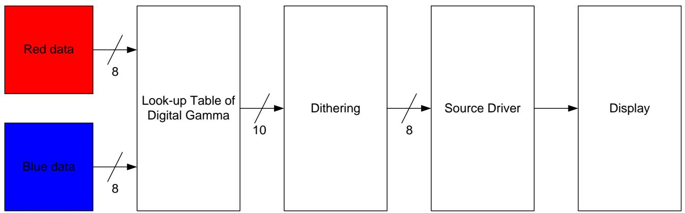  
Figure 89 Block diagram of digital gamma

There are 2 registers and each register has 260 bytes to set R, G, B gamma independently. When bit DGMEN be set to 1, R and B gamma will be mapped via look-up table of digital gamma to gray level voltage.

# 11.2 Display Dimming

# General Description

A dimming function (how fast to change the brightness from old to new level and what are brightness levels during the change) is used when changing from one brightness level to another. This dimming function curve is the same in increment and decrement. The basic idea is described below.

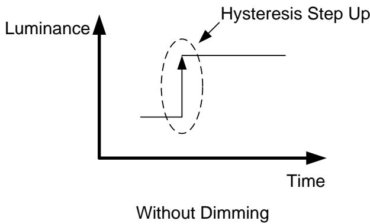

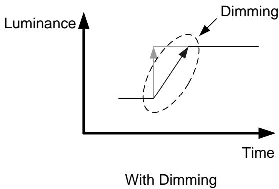

Dimming function can be enable and disable. See "Write CTRL Display (53h)" (bit DD) for more information.

# Dimming Requirement

Dimming function in the display module should be implemented so that 400-600ms is used for the transition between the original brightness value and the target brightness value. The transferring time steps between these two brightness values are equal making the transition linear.

The dimming function is working similarly in both upward and downward directions.

An upward example is illustrate below

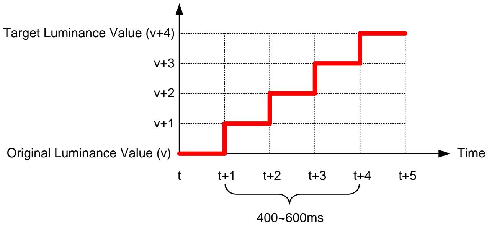

# Definition of brightness transition time

- Shorter transition time than 500ms.

There is some stable time between transitions. Below drawing is for transition time: 400ms.

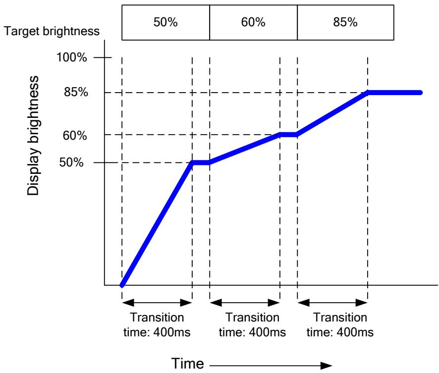

- Longer transition time than 500ms

There is no any stable time between transitions. Below drawing is for transition time: 600ms.

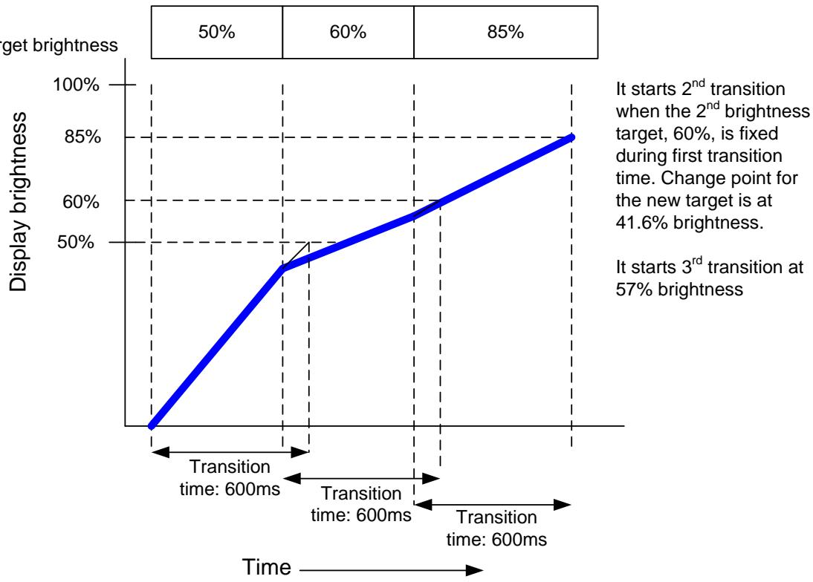  
Target brightness

# 11.3 Content Adaptive Brightness Control (CABC)

# Definition of CABC

A Content Adaptive Brightness Control function can be used to reduce the power consumption of the luminance source. Content adaptation means that content gray level scale can be increased while simultaneously lowering brightness of the backlight to achieve same perceived brightness. The adjusted gray level scale and thus the power consumption reduction

Definition of Modes and target power reduction ratio:

- Off mode: Content Adaptive Brightness Control functionality is totally off.  
- UI [User interface] image mode: Optimized for UI image. It is kept image quality as much as possible. Target power consumption reduction ratio:  $10\%$  or less.  
- Still picture mode: Optimized for still picture. Some image quality degradation would be acceptable. Target power consumption reduction ratio: more than  $30\%$ .  
- Moving image mode: Optimized for moving image. It is focused on the biggest power reduction with image quality degradation. Target power consumption reduction ratio: more than  $30\%$ .

Note 1: Updating partial area of the image data should be supported by CABC functionality.

Note 2: Processing power consumption of CABC should be minimized.

The transition time for dimming function is illustrated below.

Content Adaptive Brightness Control

Display brightness is changed, according to the image contents. The following graph mentions the case of displaying three different images.

- Image A: -20% brightness reduction  
- Image B: -30% brightness reduction  
- Image C: -30% brightness reduction

Transition time from the previous image to the current displayed image is "transition time A".

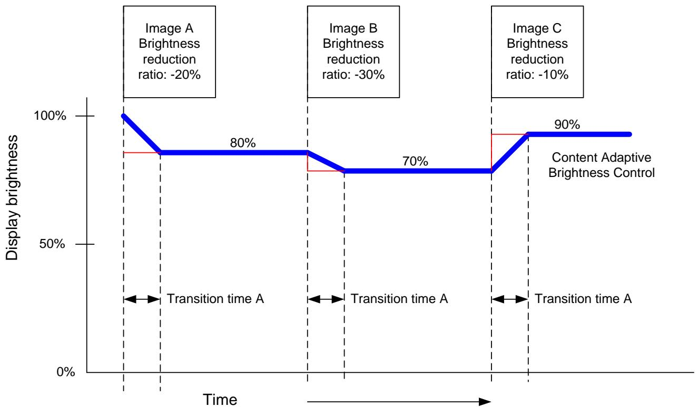

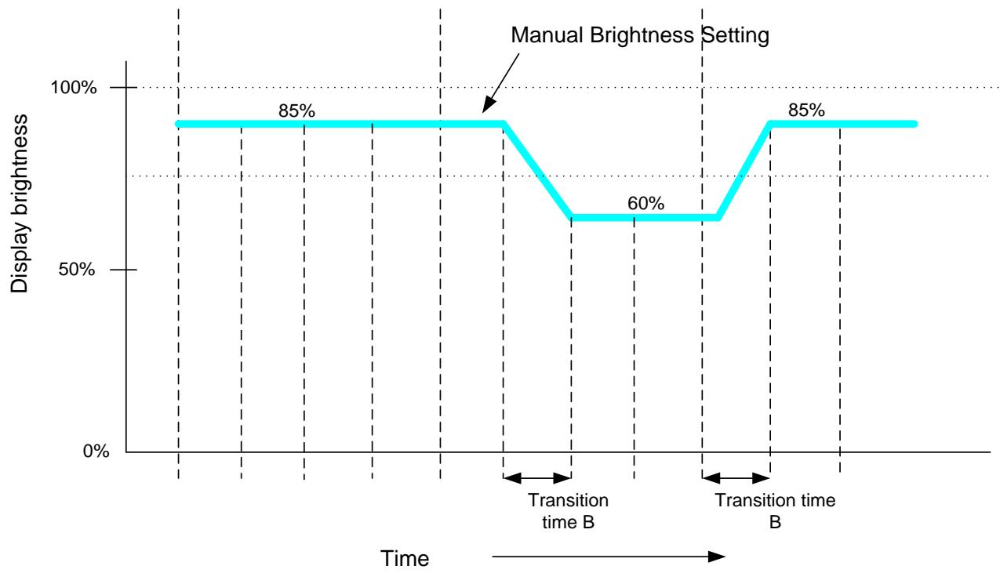  
- Manual brightness setting and Dimming function

# - Combine Display brightness

Green line in the following graph is for the output brightness of display. It is combined with both display brightness, which are defined in the above graphs.

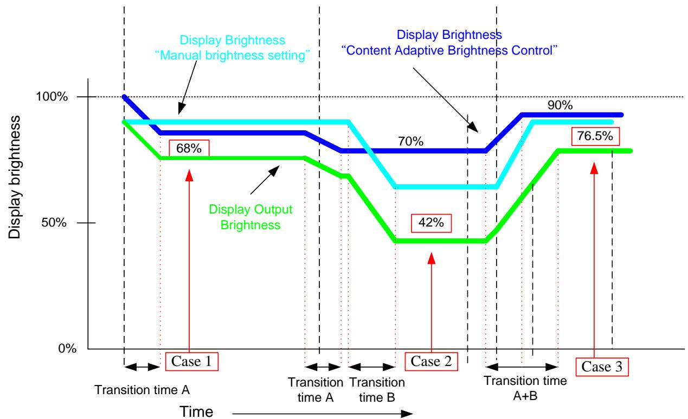  
Maximum transition time is transition time  $\mathrm{A} + \mathrm{B}$ .

Brightness level calculates with the following formula.

Display Output brightness = Manual Brightness setting * CABC brightness ratio  

<table><tr><td></td><td>Manual Brightness setting</td><td>Brightness ratio [CABC]</td><td>Display Output brightness</td></tr><tr><td>Case 1</td><td>85%</td><td>80%</td><td>68%</td></tr><tr><td>Case 2</td><td>60%</td><td>70%</td><td>42%</td></tr><tr><td>Case 3</td><td>85%</td><td>90%</td><td>76.5%</td></tr></table>

Transition time from the current brightness to target brightness is  $A + B$  in the worst case.

# Minimum brightness setting of CABC function

CABC function is automatically reduced backlight brightness based on image contents. In the case of the combination with the LABC or manual brightness setting, display brightness is too dark. It must affect to image quality degradation. CABC minimum brightness setting is to avoid too much brightness reduction. When CABC is active, CABC can not reduce the display brightness to less than CABC minimum brightness setting. If CABC algorithm works without any abnormal visual effect, image processing function can operate even when the brightness can not be changed.

This function does not affect to the other function, manual brightness setting. Manual brightness can be set the display brightness to less than CABC minimum brightness. Smooth transition and dimming function can be worked as normal.

When display brightness is turned off (BCTRL=0 of the Write CTRL Display (53h)), CABC minimum brightness setting is ignored. "Read CABC minimum brightness (5Fh)" always read the setting value of "Write CABC minimum brightness (5Eh)".

<table><tr><td></td><td>WRCABC (55h)</td><td>Function</td><td>RDCABCMB (5Fh)</td><td>Image</td></tr><tr><td>Sleep-in</td><td>--</td><td>NA</td><td>WRCABCMB (5Eh)</td><td>--</td></tr><tr><td>CABC off</td><td>00b</td><td>Disable</td><td>WRCABCMB (5Eh)</td><td>Original</td></tr><tr><td>CABC on</td><td>01b/10b/11b</td><td>Enable</td><td>WRCABCMB (5Eh)</td><td>CABC modified</td></tr></table>

Brightness level calculates with the following formula.

Display Output Brightness = Manual brightness setting * CABC brightness ratio

Below drawing is for the explanation of the CABC minimum brightness setting.

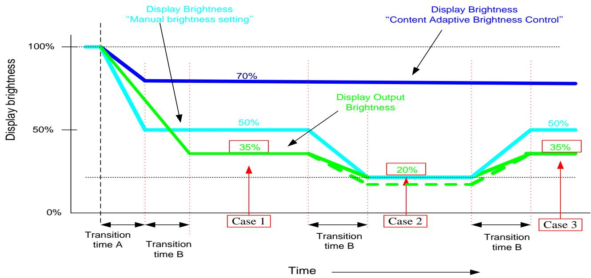

CABC minimum brightness value = 51 (33h: 20% display brightness)  

<table><tr><td></td><td>Display Brightness [manual setting]</td><td>Brightness ratio [CABC]</td><td>Calculation result of the display brightness formula</td><td>Display Output Brightness</td><td>Image</td></tr><tr><td>Case 1</td><td>50%</td><td>70%</td><td>35%</td><td>35%</td><td>CABC modified</td></tr><tr><td>Case 2</td><td>20%</td><td>70%</td><td>14%</td><td>20%</td><td>CABC modified</td></tr><tr><td>Case 3</td><td>50%</td><td>70%</td><td>35%</td><td>35%</td><td>CABC modified</td></tr></table>

At the case 2, the calculation result of the display brightness is  $14\%$ . CABC minimum brightness value is set to  $20\%$  brightness. Actual display brightness is  $20\%$  as the CABC minimum brightness setting.

# 12 COMMAND

12.1 Command Transmission Mode on MIPI Interface  

<table><tr><td>Command</td><td>MIPI Transmission Mode</td></tr><tr><td>Command Table1</td><td>LPDT / HSDT</td></tr><tr><td>Command Table2</td><td>LPDT</td></tr></table>

12.2 System Function Command Table 1  

<table><tr><td rowspan="2">Instruction</td><td colspan="2">Address</td><td rowspan="2">R/W/C</td><td rowspan="2">PNUM</td><td rowspan="2">D7</td><td rowspan="2">D6</td><td rowspan="2">D5</td><td rowspan="2">D4</td><td rowspan="2">D3</td><td rowspan="2">D2</td><td rowspan="2">D1</td><td rowspan="2">D0</td><td rowspan="2">Function</td></tr><tr><td>MIPI</td><td>SPI-16</td></tr><tr><td>NOP</td><td>00h</td><td>0000h</td><td>C</td><td>0</td><td>0</td><td>0</td><td>0</td><td>0</td><td>0</td><td>0</td><td>0</td><td>0</td><td>No operation</td></tr><tr><td>SWRESET</td><td>01h</td><td>0100h</td><td>C</td><td>0</td><td>0</td><td>0</td><td>0</td><td>0</td><td>0</td><td>0</td><td>0</td><td>1</td><td>Software reset</td></tr><tr><td rowspan="3">RDDID</td><td rowspan="3">04h</td><td>0400h</td><td rowspan="3">R</td><td rowspan="3">3</td><td colspan="8">ID1[7:0]</td><td>ID1 read</td></tr><tr><td>0401h</td><td colspan="8">ID2[7:0]</td><td>ID2 read</td></tr><tr><td>0402h</td><td colspan="8">ID3[7:0]</td><td>ID3 read</td></tr><tr><td>RDNUMED</td><td>05h</td><td>0500h</td><td>R</td><td>1</td><td>ErrOver</td><td colspan="7">Err[6:0]</td><td>Read No. of the Errors on DSI only</td></tr><tr><td>RDRED</td><td>06h</td><td>0600h</td><td>R</td><td>1</td><td colspan="8">R_1st[7:0]</td><td>Read the first pixel of Color R</td></tr><tr><td>RDGREEN</td><td>07h</td><td>0700h</td><td>R</td><td>1</td><td colspan="8">G_1st[7:0]</td><td>Read the first pixel of Color G</td></tr><tr><td>RDBLUE</td><td>08h</td><td>0800h</td><td>R</td><td>1</td><td colspan="8">B_1st[7:0]</td><td>Read the first pixel of Color B</td></tr><tr><td>RDDPM</td><td>0Ah</td><td>0A00h</td><td>R</td><td>1</td><td>BSTON</td><td>0</td><td>0</td><td>SLPOUT</td><td>1</td><td>DISON</td><td>--</td><td>--</td><td>Read Display Power Mode</td></tr><tr><td>RDDMADCTL</td><td>0Bh</td><td>0B00h</td><td>R</td><td>1</td><td>--</td><td>--</td><td>--</td><td>ML</td><td>BGR</td><td>--</td><td>--</td><td>--</td><td>Read Display MADCTR</td></tr><tr><td>RDDCOLMOD</td><td>0Ch</td><td>0C00h</td><td>R</td><td>1</td><td>--</td><td colspan="2">VIPF[2:0]</td><td>--</td><td>--</td><td>--</td><td>--</td><td>--</td><td>Read Display Pixel Format</td></tr><tr><td>RDDIM</td><td>0Dh</td><td>0D00h</td><td>R</td><td>1</td><td>--</td><td>--</td><td>INVON</td><td>ALPXLON</td><td>ALPXLOFF</td><td colspan="3">GCS[2:0]</td><td>Read Display Image Mode</td></tr><tr><td>RDDSM</td><td>0Eh</td><td>0E00h</td><td>R</td><td>1</td><td>TEON</td><td>TELMD</td><td>--</td><td>--</td><td>--</td><td>--</td><td>--</td><td>--</td><td>Read Display Signal Mode</td></tr><tr><td>RDDSDR</td><td>0Fh</td><td>0F00h</td><td>R</td><td>1</td><td>RLD</td><td>FUND</td><td>0</td><td>0</td><td>--</td><td>--</td><td>--</td><td>--</td><td>Read Display Self-diagnostic result</td></tr><tr><td>SLPIN</td><td>10h</td><td>1000h</td><td>C</td><td>0</td><td>0</td><td>0</td><td>0</td><td>0</td><td>0</td><td>0</td><td>1</td><td>0</td><td>Sleep in</td></tr><tr><td>SLPOUT</td><td>11h</td><td>1100h</td><td>C</td><td>0</td><td>0</td><td>0</td><td>0</td><td>1</td><td>0</td><td>0</td><td>0</td><td>1</td><td>Sleep out</td></tr><tr><td>PTLON</td><td>12h</td><td>1200h</td><td>C</td><td>0</td><td>0</td><td>0</td><td>0</td><td>1</td><td>0</td><td>0</td><td>1</td><td>0</td><td>Partial mode on</td></tr><tr><td>NORON</td><td>13h</td><td>1300h</td><td>C</td><td>0</td><td>0</td><td>0</td><td>0</td><td>1</td><td>0</td><td>0</td><td>1</td><td>1</td><td>Normal display mode on</td></tr><tr><td>INVOFF</td><td>20h</td><td>2000h</td><td>C</td><td>0</td><td>0</td><td>0</td><td>1</td><td>0</td><td>0</td><td>0</td><td>0</td><td>0</td><td>Display inversion off (normal)</td></tr><tr><td>INVON</td><td>21h</td><td>2100h</td><td>C</td><td>0</td><td>0</td><td>0</td><td>1</td><td>0</td><td>0</td><td>0</td><td>0</td><td>1</td><td>Display inversion on</td></tr><tr><td>ALLPOFF</td><td>22h</td><td>2200h</td><td>C</td><td>0</td><td>0</td><td>0</td><td>1</td><td>0</td><td>0</td><td>0</td><td>1</td><td>0</td><td>All pixel off (black)</td></tr><tr><td>ALLPON</td><td>23h</td><td>2300h</td><td>C</td><td>0</td><td>0</td><td>0</td><td>1</td><td>0</td><td>0</td><td>0</td><td>1</td><td>1</td><td>All pixel on (white)</td></tr><tr><td>GAMSET</td><td>26h</td><td>2600h</td><td>W</td><td>1</td><td>--</td><td>--</td><td>--</td><td>--</td><td colspan="4">GC[3:0]</td><td>Gamma curve select</td></tr><tr><td>DISPOFF</td><td>28h</td><td>2800h</td><td>C</td><td>0</td><td>0</td><td>0</td><td>1</td><td>0</td><td>1</td><td>0</td><td>0</td><td>0</td><td>Display off</td></tr><tr><td>DISPON</td><td>29h</td><td>2900h</td><td>C</td><td>0</td><td>0</td><td>0</td><td>1</td><td>0</td><td>1</td><td>0</td><td>0</td><td>1</td><td>Display on</td></tr><tr><td>TEOFF</td><td>34h</td><td>3400h</td><td>C</td><td>0</td><td>0</td><td>0</td><td>1</td><td>1</td><td>0</td><td>1</td><td>0</td><td>0</td><td>Tearing effect line off</td></tr><tr><td>TEON</td><td>35h</td><td>3500h</td><td>W</td><td>0</td><td>0</td><td>0</td><td>1</td><td>1</td><td>0</td><td>1</td><td>0</td><td>1</td><td>Tearing effect line on</td></tr><tr><td>MADCTL</td><td>36h</td><td>3600h</td><td>W</td><td>1</td><td>--</td><td>--</td><td>--</td><td>ML</td><td>BGR</td><td>--</td><td>--</td><td>--</td><td>Display data access control</td></tr><tr><td>IDMOFF</td><td>38h</td><td>3800h</td><td>C</td><td>0</td><td>--</td><td>--</td><td>--</td><td>--</td><td>--</td><td>--</td><td>--</td><td>--</td><td>Idle mode off</td></tr><tr><td>IDMON</td><td>39h</td><td>3900h</td><td>C</td><td>0</td><td>--</td><td>--</td><td>--</td><td>--</td><td>--</td><td>--</td><td>--</td><td>--</td><td>Idle mode on</td></tr><tr><td>COLMOD</td><td>3Ah</td><td>3A00h</td><td>W</td><td>0</td><td>--</td><td colspan="3">VIPF[2:0]</td><td>--</td><td>--</td><td>--</td><td>--</td><td>Interface Pixel Format</td></tr><tr><td rowspan="2">GSL</td><td rowspan="2">45h</td><td>4500h</td><td rowspan="2">R</td><td rowspan="2">2</td><td colspan="8">TESL[15:8]</td><td rowspan="2">Read Tear line</td></tr><tr><td>4501h</td><td colspan="8">TESL[7:0]</td></tr><tr><td>WRDIBV</td><td>51h</td><td>5100h</td><td>W</td><td>1</td><td colspan="8">DBV[7:0]</td><td>Write display brightness</td></tr><tr><td>RDDISBV</td><td>52h</td><td>5200h</td><td>R</td><td>1</td><td colspan="8">DBV[7:0]</td><td>Read display brightness value</td></tr><tr><td>WRCTRLD</td><td>53h</td><td>5300h</td><td>W</td><td>1</td><td>--</td><td>--</td><td>BCTRL</td><td>--</td><td>DD</td><td>BL</td><td>--</td><td>--</td><td>Write control display</td></tr><tr><td>RRCTRLD</td><td>54h</td><td>5400h</td><td>R</td><td>1</td><td>--</td><td>--</td><td>BCTRL</td><td>--</td><td>DD</td><td>BL</td><td>--</td><td>--</td><td>Read control display value</td></tr><tr><td>WRCABC</td><td>55h</td><td>5500h</td><td>W</td><td>1</td><td>CE_ON</td><td>--</td><td colspan="2">CE_MD[1:0]</td><td>--</td><td>--</td><td colspan="2">CABC_MD[1:0]</td><td>Write CABC mode</td></tr><tr><td>RRCABC</td><td>56h</td><td>5600h</td><td>R</td><td>1</td><td>CE_ON</td><td>--</td><td colspan="2">CE_MD[1:0]</td><td>--</td><td>--</td><td colspan="2">CABC_MD[1:0]</td><td>Read CABC mode</td></tr><tr><td>WRCABCMB</td><td>5Eh</td><td>5E00h</td><td>W</td><td>1</td><td colspan="8">CMB[7:0]</td><td>Write CABC minimum brightness</td></tr><tr><td>RRCABCMB</td><td>5Fh</td><td>5F00h</td><td>R</td><td>1</td><td colspan="8">CMB[7:0]</td><td>Read CABC minimum brightness</td></tr><tr><td>RDABCSD</td><td>68h</td><td>6800h</td><td>R</td><td>1</td><td>RLD</td><td>FUND</td><td>--</td><td>--</td><td>--</td><td>--</td><td>--</td><td>--</td><td>Read Automatic Brightness Control Self-Diagnostic Result</td></tr><tr><td>RDBWLB</td><td>70h</td><td>7000h</td><td>R</td><td>1</td><td>BKx1</td><td>BKx0</td><td>BKy1</td><td>BKy0</td><td>Wx1</td><td>Wx0</td><td>Wy1</td><td>Wy0</td><td>Read Black/White Low Bits</td></tr><tr><td>RDBkx</td><td>71h</td><td>7100h</td><td>R</td><td>1</td><td>BKx9</td><td>BKx8</td><td>BKx7</td><td>BKx6</td><td>BKx5</td><td>BKx4</td><td>BKx3</td><td>BKx2</td><td>Read BKx</td></tr><tr><td>RDBky</td><td>72h</td><td>7200h</td><td>R</td><td>1</td><td>BKy9</td><td>BKy8</td><td>BKy7</td><td>BKy6</td><td>BKy5</td><td>BKy4</td><td>BKy3</td><td>BKy2</td><td>Read Bky</td></tr><tr><td>RDWx</td><td>73h</td><td>7300h</td><td>R</td><td>1</td><td>Wx9</td><td>Wx8</td><td>Wx7</td><td>Wx6</td><td>Wx5</td><td>Wx4</td><td>Wx3</td><td>Wx2</td><td>Read Wx</td></tr><tr><td>RDWy</td><td>74h</td><td>7400h</td><td>R</td><td>1</td><td>Wy9</td><td>Wy8</td><td>Wy7</td><td>Wy6</td><td>Wy5</td><td>Wy4</td><td>Wy3</td><td>Wy2</td><td>Read Wy</td></tr><tr><td>RDRGLB</td><td>75h</td><td>7500h</td><td>R</td><td>1</td><td>Rx1</td><td>Rx0</td><td>Ry1</td><td>Ry0</td><td>Gx1</td><td>Gx0</td><td>Gy1</td><td>Gy0</td><td>Read Red/Green Low bits</td></tr><tr><td>RDRx</td><td>76h</td><td>7600h</td><td>R</td><td>1</td><td>Rx9</td><td>Rx8</td><td>Rx7</td><td>Rx6</td><td>Rx5</td><td>Rx4</td><td>Rx3</td><td>Rx2</td><td>Read Rx</td></tr><tr><td>RDRy</td><td>77h</td><td>7700h</td><td>R</td><td>1</td><td>Ry9</td><td>Ry8</td><td>Ry7</td><td>Ry6</td><td>Ry5</td><td>Ry4</td><td>Ry3</td><td>Ry2</td><td>Read Ry</td></tr><tr><td>RDGx</td><td>78h</td><td>7800h</td><td>R</td><td>1</td><td>Gx9</td><td>Gx8</td><td>Gx7</td><td>Gx6</td><td>Gx5</td><td>Gx4</td><td>Gx3</td><td>Gx2</td><td>Read Gx</td></tr><tr><td>RDGy</td><td>79h</td><td>7900h</td><td>R</td><td>1</td><td>Gy9</td><td>Gy8</td><td>Gy7</td><td>Gy6</td><td>Gy5</td><td>Gy4</td><td>Gy3</td><td>Gy2</td><td>Read Gy</td></tr><tr><td>RDBALB</td><td>7Ah</td><td>7A00h</td><td>R</td><td>1</td><td>Bx1</td><td>Bx0</td><td>By1</td><td>By0</td><td>Ax1</td><td>Ax0</td><td>Ay1</td><td>Ay0</td><td>Blue/AColour Low Bits</td></tr><tr><td>RDBx</td><td>7Bh</td><td>7B00h</td><td>R</td><td>1</td><td>Bx9</td><td>Bx8</td><td>Bx7</td><td>Bx6</td><td>Bx5</td><td>Bx4</td><td>Bx3</td><td>Bx2</td><td>Read Bx</td></tr><tr><td>RDBy</td><td>7Ch</td><td>7C00h</td><td>R</td><td>1</td><td>By9</td><td>By8</td><td>By7</td><td>By6</td><td>By5</td><td>By4</td><td>By3</td><td>By2</td><td>Read By</td></tr><tr><td>RDAx</td><td>7Dh</td><td>7D00h</td><td>R</td><td>1</td><td>Ax9</td><td>Ax8</td><td>Ax7</td><td>Ax6</td><td>Ax5</td><td>Ax4</td><td>Ax3</td><td>Ax2</td><td>Read Ax</td></tr><tr><td>RDAy</td><td>7Eh</td><td>7E00h</td><td>R</td><td>1</td><td>Ay9</td><td>Ay8</td><td>Ay7</td><td>Ay6</td><td>Ay5</td><td>Ay4</td><td>At3</td><td>Ay2</td><td>Read Ay</td></tr><tr><td rowspan="5">RDDDBS/CHKSUM</td><td rowspan="5">A1h</td><td>A100h</td><td rowspan="5">R</td><td rowspan="5">5</td><td colspan="8">0x88</td><td rowspan="5">Read the DDB from the provided location</td></tr><tr><td>A101h</td><td colspan="8">0x02</td></tr><tr><td>A102h</td><td colspan="8">MID[15:8]</td></tr><tr><td>A103h</td><td colspan="8">MID[7:0]</td></tr><tr><td>A104h</td><td colspan="8">8'hff</td></tr><tr><td rowspan="5">RDDDBC</td><td rowspan="5">A8h</td><td>A800h</td><td rowspan="5">R</td><td rowspan="5">5</td><td colspan="8">SID[15:8]</td><td rowspan="5">Continue reading the DDB from the last read location</td></tr><tr><td>A801h</td><td colspan="8">SID[7:0]</td></tr><tr><td>A802h</td><td colspan="8">MID[15:8]</td></tr><tr><td>A803h</td><td colspan="8">MID[7:0]</td></tr><tr><td>A804h</td><td colspan="8">8'hff</td></tr><tr><td>RDFCS</td><td>AAh</td><td>AA00h</td><td>R</td><td>1</td><td colspan="8">FCS[7:0]</td><td>Read First Checksum</td></tr><tr><td>RDCCS</td><td>AFh</td><td>AF00h</td><td>R</td><td>1</td><td colspan="8">CCS[7:0]</td><td>Read Continue Checksum</td></tr><tr><td>RDID1</td><td>DAh</td><td>DA00h</td><td>R</td><td>1</td><td colspan="8">ID1[7:0]</td><td>Read ID1</td></tr><tr><td>RDID2</td><td>DBh</td><td>DB00h</td><td>R</td><td>1</td><td colspan="8">ID2[7:0]</td><td>Read ID2</td></tr><tr><td>RDID3</td><td>DCh</td><td>DC00h</td><td>R</td><td>1</td><td colspan="8">ID3[7:0]</td><td>Read ID3</td></tr></table>

Note:  
1. In MIPI interface, parameters of the command are stores onto registers when the last parameter of the  
command has been received. Also, parameters of the command are not stored onto registers if there has been  
happen a break. This note is valid when a number of the parameters is equal or less than 32.  
2. The 8-bit address code for "MIPI" in above table and following command description means include 3-wire 9-bit  
SPI and 4-wire 8-bit SPI.

Table 24 System Function Command List

12.2.1 NOP (00/0000h)  

<table><tr><td>00H</td><td colspan="11">NOP (No Operation)</td><td></td></tr><tr><td rowspan="2">Inst / Para</td><td rowspan="2">R/W</td><td colspan="2">Address</td><td rowspan="2">D15-8</td><td rowspan="2">D7</td><td rowspan="2">D6</td><td rowspan="2">D5</td><td rowspan="2">D4</td><td rowspan="2">D3</td><td rowspan="2">D2</td><td rowspan="2">D1</td><td rowspan="2">D0</td></tr><tr><td>MIPI</td><td>SPI-16</td></tr><tr><td>NOP</td><td>W</td><td>00h</td><td>0000h</td><td colspan="9">No Argument</td></tr><tr><td>Parameter</td><td colspan="12">No Parameter</td></tr><tr><td>Description</td><td colspan="12">This command is empty command. It does not have effect on the display module.However it can be used to terminate parameter write commands.</td></tr><tr><td>Restriction</td><td colspan="12"></td></tr><tr><td rowspan="6">RegisterAvailability</td><td rowspan="6"></td><td colspan="5">Status</td><td colspan="5">Availability</td><td rowspan="6"></td></tr><tr><td colspan="5">Normal Mode On, Idle Mode Off, Sleep Out</td><td colspan="5">Yes</td></tr><tr><td colspan="5">Normal Mode On, Idle Mode On, Sleep Out</td><td colspan="5">Yes</td></tr><tr><td colspan="5">Partial Mode On, Idle Mode Off, Sleep Out</td><td colspan="5">Yes</td></tr><tr><td colspan="5">Partial Mode On, Idle Mode On, Sleep Out</td><td colspan="5">Yes</td></tr><tr><td colspan="5">Sleep In</td><td colspan="5">Yes</td></tr><tr><td rowspan="4">Default</td><td rowspan="4"></td><td colspan="4">Status</td><td colspan="6">Default Value</td><td rowspan="4"></td></tr><tr><td colspan="4">Power On Sequence</td><td colspan="6">N/A</td></tr><tr><td colspan="4">S/W Reset</td><td colspan="6">N/A</td></tr><tr><td colspan="4">H/W Reset</td><td colspan="6">N/A</td></tr><tr><td>Flow Chart</td><td colspan="12"></td></tr></table>

12.2.2 SWRESET (01h/0100h): Software Reset  

<table><tr><td>01H</td><td colspan="11">SWRESET (Software Reset)</td><td></td></tr><tr><td rowspan="2">Inst / Para</td><td rowspan="2">R/W</td><td colspan="2">Address</td><td rowspan="2">D15-8</td><td rowspan="2">D7</td><td rowspan="2">D6</td><td rowspan="2">D5</td><td rowspan="2">D4</td><td rowspan="2">D3</td><td rowspan="2">D2</td><td rowspan="2">D1</td><td rowspan="2">D0</td></tr><tr><td>MIPI</td><td>SPI-16</td></tr><tr><td>SWRESET</td><td>W</td><td>01h</td><td>0100h</td><td>xx</td><td>0</td><td>0</td><td>0</td><td>0</td><td>0</td><td>0</td><td>0</td><td>1</td></tr><tr><td>Parameter</td><td colspan="12">No Parameter</td></tr><tr><td>Description</td><td colspan="12">“-” Don&#x27;t care
-The display module performs a software reset, registers are written with their SW reset default values.
-Frame memory contents are unaffected by this command.</td></tr><tr><td>Restriction</td><td colspan="12">It will be necessary to wait 5msec before sending new command following software reset.
The display module loads all display suppliers&#x27; factory default values to the registers during this 5msec.
If software reset is sent during sleep in mode, it will be necessary to wait 120msec before sending sleep out command.
Software reset command cannot be sent during sleep out sequence.
When MIPI Video Mode application, the shut down packet should be sent (leave to video mode) before S/W reset</td></tr><tr><td rowspan="6">Register Availability</td><td rowspan="6"></td><td colspan="5">Status</td><td colspan="6">Availability</td></tr><tr><td colspan="5">Normal Mode On, Idle Mode Off, Sleep Out</td><td colspan="6">Yes</td></tr><tr><td colspan="5">Normal Mode On, Idle Mode On, Sleep Out</td><td colspan="6">Yes</td></tr><tr><td colspan="5">Partial Mode On, Idle Mode Off, Sleep Out</td><td colspan="6">Yes</td></tr><tr><td colspan="5">Partial Mode On, Idle Mode On, Sleep Out</td><td colspan="6">Yes</td></tr><tr><td colspan="5">Sleep In</td><td colspan="6">Yes</td></tr><tr><td rowspan="4">Default</td><td rowspan="4"></td><td colspan="4">Status</td><td colspan="6">Default Value</td><td rowspan="4"></td></tr><tr><td colspan="4">Power On Sequence</td><td colspan="6">N/A</td></tr><tr><td colspan="4">S/W Reset</td><td colspan="6">N/A</td></tr><tr><td colspan="4">H/W Reset</td><td colspan="6">N/A</td></tr><tr><td>Flow Chart</td><td colspan="5">SWRESET (01h)
Host
Display whole
Blank screen
Driver
Set
Command
To S/W Default
Value
Mode</td><td colspan="7">Legend
Command
Parameter
Display
Action
Mode
Sequential
transfer</td></tr></table>

12.2.3 RDDID (04h/0400h~0402h): Read Display ID  

<table><tr><td>04H</td><td colspan="11">RDDID (Read Display ID)</td><td></td></tr><tr><td rowspan="2">Inst / Para</td><td rowspan="2">R/W</td><td colspan="2">Address</td><td rowspan="2">D15-8</td><td rowspan="2">D7</td><td rowspan="2">D6</td><td rowspan="2">D5</td><td rowspan="2">D4</td><td rowspan="2">D3</td><td rowspan="2">D2</td><td rowspan="2">D1</td><td rowspan="2">D0</td></tr><tr><td>MIPI</td><td>SPI-16</td></tr><tr><td rowspan="3">RDDID</td><td rowspan="3">R</td><td rowspan="3">04h</td><td>0400h</td><td>00h</td><td colspan="8">ID1[7:0]</td></tr><tr><td>0401h</td><td>00h</td><td colspan="8">ID2[7:0]</td></tr><tr><td>0402h</td><td>00h</td><td colspan="8">ID3[7:0]</td></tr><tr><td>Description</td><td colspan="12">-This read byte returns 24-bit display identification information.-The 1stparameter is dummy data-The 2ndparameter (ID1): LCD module&#x27;s manufacturer ID.-The 3rdparameter (ID2): LCD module/driver version ID-The 4thparameter (ID3): LCD module/driver ID.-Commands RDID1/2/3(DAh, DBh, DCh) read data correspond to the parameters 2,3,4 of the command 04h, respectively.</td></tr><tr><td>Restriction</td><td colspan="12">-</td></tr><tr><td rowspan="6">Register availability</td><td rowspan="6"></td><td colspan="5">Status</td><td colspan="6">Availability</td></tr><tr><td colspan="5">Normal Mode On, Idle Mode Off, Sleep Out</td><td colspan="6">Yes</td></tr><tr><td colspan="5">Normal Mode On, Idle Mode On, Sleep Out</td><td colspan="6">Yes</td></tr><tr><td colspan="5">Partial Mode On, Idle Mode Off, Sleep Out</td><td colspan="6">Yes</td></tr><tr><td colspan="5">Partial Mode On, Idle Mode On, Sleep Out</td><td colspan="6">Yes</td></tr><tr><td colspan="5">Sleep In</td><td colspan="6">Yes</td></tr><tr><td rowspan="5">Default</td><td rowspan="5"></td><td rowspan="2" colspan="4">Status</td><td colspan="7">Default Value</td></tr><tr><td colspan="2">ID1</td><td colspan="2">ID2</td><td colspan="3">ID3</td></tr><tr><td colspan="4">Power On Sequence</td><td colspan="2">0xFF</td><td colspan="2">0xFF</td><td colspan="3">0xFF</td></tr><tr><td colspan="4">S/W Reset</td><td colspan="2">0xFF</td><td colspan="2">0xFF</td><td colspan="3">0xFF</td></tr><tr><td colspan="4">H/W Reset</td><td colspan="2">0xFF</td><td colspan="2">0xFF</td><td colspan="3">0xFF</td></tr><tr><td>Flow Chart</td><td colspan="5">RDDID(04h)Send 1stParameterID1[7:0]Send 2ndParameterID2[7:0]Send 3rdParameterID3[7:0]</td><td>HostDriver</td><td colspan="6">LegendCommandDisplayActionModeSequentialtransfer</td></tr></table>

12.2.4 RDNUMED (05h/0500h): Read Number of Errors on DSI  

<table><tr><td>05H</td><td colspan="11">RDNUMED</td><td></td></tr><tr><td rowspan="2">Inst / Para</td><td rowspan="2">R/W</td><td colspan="2">Address</td><td rowspan="2">D15-8</td><td rowspan="2">D7</td><td rowspan="2">D6</td><td rowspan="2">D5</td><td rowspan="2">D4</td><td rowspan="2">D3</td><td rowspan="2">D2</td><td rowspan="2">D1</td><td rowspan="2">D0</td></tr><tr><td>Others</td><td>SPI-16</td></tr><tr><td>RDNUMED</td><td>R</td><td>05h</td><td>X</td><td>X</td><td>Errover</td><td colspan="7">Err[6:0]</td></tr><tr><td>Description</td><td colspan="12">The first parameter is telling a number of the parity errors on DSI. The more detailed description of the bits is below.Err[6:0] bits are telling a number of the parity errors.Errover is set to &quot;1&quot; if there is overflow with P[6..0] bits.This command is used for MIPI DSI only. It is no function for others interface operation.</td></tr><tr><td>Restriction</td><td colspan="12">-</td></tr><tr><td rowspan="6">Register availability</td><td rowspan="6"></td><td colspan="5">Status</td><td colspan="6">Availability</td></tr><tr><td colspan="5">Normal Mode On, Idle Mode Off, Sleep Out</td><td colspan="6">Yes</td></tr><tr><td colspan="5">Normal Mode On, Idle Mode On, Sleep Out</td><td colspan="6">Yes</td></tr><tr><td colspan="5">Partial Mode On, Idle Mode Off, Sleep Out</td><td colspan="6">Yes</td></tr><tr><td colspan="5">Partial Mode On, Idle Mode On, Sleep Out</td><td colspan="6">Yes</td></tr><tr><td colspan="5">Sleep In</td><td colspan="6">Yes</td></tr><tr><td rowspan="5">Default</td><td rowspan="5"></td><td rowspan="2" colspan="4">Status</td><td colspan="7">Default Value</td></tr><tr><td>Errover</td><td colspan="6">Err[6:0]</td></tr><tr><td colspan="4">Power On Sequence</td><td>0</td><td colspan="6">000-0000</td></tr><tr><td colspan="4">S/W Reset</td><td>0</td><td colspan="6">000-0000</td></tr><tr><td colspan="4">H/W Reset</td><td>0</td><td colspan="6">000-0000</td></tr><tr><td>Flow Chart</td><td colspan="12">RDNUMED(05h)Send 1stParameterHostDriverLegendCommandParameterDisplayActionModeSequentialtransfer</td></tr></table>

12.2.5 RDRED (06h/0600h): Read the first pixel of Red Color  

<table><tr><td>06H</td><td colspan="11">RDRED</td><td></td></tr><tr><td rowspan="2">Inst / Para</td><td rowspan="2">R/W</td><td colspan="2">Address</td><td rowspan="2">D15-8</td><td rowspan="2">D7</td><td rowspan="2">D6</td><td rowspan="2">D5</td><td rowspan="2">D4</td><td rowspan="2">D3</td><td rowspan="2">D2</td><td rowspan="2">D1</td><td rowspan="2">D0</td></tr><tr><td>MIPI</td><td>SPI-16</td></tr><tr><td>RDRED</td><td>R</td><td>X</td><td>0600h</td><td>X</td><td colspan="8">R_1st[7:0]</td></tr><tr><td>Description</td><td colspan="12">This command returns the red component value of the first pixel in the active frame.
Only the relevant bits are used according to pixel format, unused bits are set to &quot;0&quot;.
-16-bit format: R4 is MSB and R0 is LSB. R7, R6 and R5 are set to &quot;0&quot;.
-18-bit format: R5 is MSB and R0 is LSB. R7 and R6 are set to &quot;0&quot;.
-24-bit format: R7 is MSB and R0 is LSB.</td></tr><tr><td>Restriction</td><td colspan="12">-</td></tr><tr><td rowspan="6">Register availability</td><td colspan="6">Status</td><td colspan="6">Availability</td></tr><tr><td colspan="6">Normal Mode On, Idle Mode Off, Sleep Out</td><td colspan="6">Yes</td></tr><tr><td colspan="6">Normal Mode On, Idle Mode On, Sleep Out</td><td colspan="6">Yes</td></tr><tr><td colspan="6">Partial Mode On, Idle Mode Off, Sleep Out</td><td colspan="6">Yes</td></tr><tr><td colspan="6">Partial Mode On, Idle Mode On, Sleep Out</td><td colspan="6">Yes</td></tr><tr><td colspan="6">Sleep In</td><td colspan="6">Yes</td></tr><tr><td rowspan="4">Default</td><td colspan="7">Status</td><td colspan="5">Default Value (D7 to D0)</td></tr><tr><td colspan="7">Power On Sequence</td><td colspan="5">00h</td></tr><tr><td colspan="7">S/W Reset</td><td colspan="5">00h</td></tr><tr><td colspan="7">H/W Reset</td><td colspan="5">00h</td></tr><tr><td>Flow Chart</td><td colspan="5">RDRED(06h)
Dummy Read
Send R[7:0] data</td><td>Host Driver</td><td colspan="6">Legend
Command
Parameter
Display
Action
Mode
Sequential transfer</td></tr></table>

12.2.6 RDGREEN (07h/0700h): Read the first pixel of Green Color  

<table><tr><td>07H</td><td colspan="11">RDGREEN</td><td></td></tr><tr><td rowspan="2">Inst / Para</td><td rowspan="2">R/W</td><td colspan="2">Address</td><td rowspan="2">D15-8</td><td rowspan="2">D7</td><td rowspan="2">D6</td><td rowspan="2">D5</td><td rowspan="2">D4</td><td rowspan="2">D3</td><td rowspan="2">D2</td><td rowspan="2">D1</td><td rowspan="2">D0</td></tr><tr><td>MIPI</td><td>SPI-16</td></tr><tr><td>RDGREEN</td><td>R</td><td>X</td><td>0700h</td><td>X</td><td colspan="8">G_1st[7:0]</td></tr><tr><td>Description</td><td colspan="12">This command returns the green component value of the first pixel in the active frame.
Only the relevant bits are used according to pixel format, unused bits are set to &quot;0&quot;.
-16-bit format: G4 is MSB and G0 is LSB. G7, G6 and G5 are set to &quot;0&quot;.
-18-bit format: G5 is MSB and G0 is LSB. G7 and G6 are set to &quot;0&quot;.
-24-bit format: G7 is MSB and G0 is LSB.</td></tr><tr><td>Restriction</td><td colspan="12">-</td></tr><tr><td rowspan="6">Register availability</td><td rowspan="6"></td><td colspan="5">Status</td><td colspan="6">Availability</td></tr><tr><td colspan="5">Normal Mode On, Idle Mode Off, Sleep Out</td><td colspan="6">Yes</td></tr><tr><td colspan="5">Normal Mode On, Idle Mode On, Sleep Out</td><td colspan="6">Yes</td></tr><tr><td colspan="5">Partial Mode On, Idle Mode Off, Sleep Out</td><td colspan="6">Yes</td></tr><tr><td colspan="5">Partial Mode On, Idle Mode On, Sleep Out</td><td colspan="6">Yes</td></tr><tr><td colspan="5">Sleep In</td><td colspan="6">Yes</td></tr><tr><td rowspan="4">Default</td><td rowspan="4"></td><td colspan="4">Status</td><td colspan="7">Default Value (D7 to D0)</td></tr><tr><td colspan="4">Power On Sequence</td><td colspan="7">00h</td></tr><tr><td colspan="4">S/W Reset</td><td colspan="7">00h</td></tr><tr><td colspan="4">H/W Reset</td><td colspan="7">00h</td></tr><tr><td>Flow Chart</td><td colspan="5">RDGREEN(07h)
Dummy Read
Send G[7:0] data</td><td colspan="7">Legend
Command
Parameter
Display
Action
Mode
Sequential transfer</td></tr></table>

12.2.7 RDBLUE (08h/0800h): Read the first pixel of Blue Color  

<table><tr><td>08H</td><td colspan="11">RDBLUE</td><td></td></tr><tr><td rowspan="2">Inst / Para</td><td rowspan="2">R/W</td><td colspan="2">Address</td><td rowspan="2">D15-8</td><td rowspan="2">D7</td><td rowspan="2">D6</td><td rowspan="2">D5</td><td rowspan="2">D4</td><td rowspan="2">D3</td><td rowspan="2">D2</td><td rowspan="2">D1</td><td rowspan="2">D0</td></tr><tr><td>MIPI</td><td>SPI-16</td></tr><tr><td>RDBLUE</td><td>R</td><td>X</td><td>0800h</td><td>X</td><td colspan="8">B_1st[7:0]</td></tr><tr><td>Description</td><td colspan="12">This command returns the blue component value of the first pixel in the active frame.
Only the relevant bits are used according to pixel format, unused bits are set to “0”.
-16-bit format: B4 is MSB and B0 is LSB. B7, B6 and B5 are set to “0”.
-18-bit format: B5 is MSB and B0 is LSB. B7 and B6 are set to “0”.
-24-bit format: B7 is MSB and B0 is LSB.</td></tr><tr><td>Restriction</td><td colspan="12">-</td></tr><tr><td rowspan="6">Register availability</td><td rowspan="6"></td><td colspan="5">Status</td><td colspan="6">Availability</td></tr><tr><td colspan="5">Normal Mode On, Idle Mode Off, Sleep Out</td><td colspan="6">Yes</td></tr><tr><td colspan="5">Normal Mode On, Idle Mode On, Sleep Out</td><td colspan="6">Yes</td></tr><tr><td colspan="5">Partial Mode On, Idle Mode Off, Sleep Out</td><td colspan="6">Yes</td></tr><tr><td colspan="5">Partial Mode On, Idle Mode On, Sleep Out</td><td colspan="6">Yes</td></tr><tr><td colspan="5">Sleep In</td><td colspan="6">Yes</td></tr><tr><td rowspan="4">Default</td><td rowspan="4"></td><td colspan="4">Status</td><td colspan="7">Default Value (D7 to D0)</td></tr><tr><td colspan="4">Power On Sequence</td><td colspan="7">00h</td></tr><tr><td colspan="4">S/W Reset</td><td colspan="7">00h</td></tr><tr><td colspan="4">H/W Reset</td><td colspan="7">00h</td></tr><tr><td>Flow Chart</td><td colspan="5">RDBULE(08h)
Dummy Read
Send B[7:0] data</td><td>Host Driver</td><td colspan="6">Legend
Command
Parameter
Display
Action
Mode
Sequential transfer</td></tr></table>

12.2.8 RDDPM (0Ah/0A0h): Read Display Power Mode  

<table><tr><td>0AH</td><td colspan="11">RDDPM</td><td></td></tr><tr><td rowspan="2">Inst / Para</td><td rowspan="2">R/W</td><td colspan="2">Address</td><td rowspan="2">D15-8</td><td rowspan="2">D7</td><td rowspan="2">D6</td><td rowspan="2">D5</td><td rowspan="2">D4</td><td rowspan="2">D3</td><td rowspan="2">D2</td><td rowspan="2">D1</td><td rowspan="2">D0</td></tr><tr><td>MIPI</td><td>SPI-16</td></tr><tr><td>RDDPM</td><td>R</td><td>0Ah</td><td>0A00h</td><td>X</td><td>BSTON</td><td>0</td><td>0</td><td>SLPOUT</td><td>1</td><td>DISON</td><td>--</td><td>--</td></tr><tr><td rowspan="10">Description</td><td colspan="12">This command indicates the current status of the display as described in the table below:</td></tr><tr><td>Bit</td><td colspan="3">Description</td><td colspan="8">Value</td></tr><tr><td>D7</td><td colspan="3">Booster Voltage Status</td><td colspan="8">“1”=Booster On, “0”=Booster Off</td></tr><tr><td>D6</td><td colspan="3">Not Defined</td><td colspan="8">Set to “0” (not used)</td></tr><tr><td>D5</td><td colspan="3">Not Defined</td><td colspan="8">Set to “0” (not used)</td></tr><tr><td>D4</td><td colspan="3">Sleep In/Out</td><td colspan="8">“1” = Sleep Out Mode, “0” = Sleep In Mode</td></tr><tr><td>D3</td><td colspan="3">Not Defined</td><td colspan="8">Set to “1” (not used)</td></tr><tr><td>D2</td><td colspan="3">Display On/Off</td><td colspan="8">“1” = Display is On, “0” = Display is Off</td></tr><tr><td>D1</td><td colspan="3">Not Defined</td><td colspan="8">Set to “0” (not used)</td></tr><tr><td>D0</td><td colspan="3">Not Defined</td><td colspan="8">Set to “0” (not used)</td></tr><tr><td>Restriction</td><td colspan="12">-</td></tr><tr><td rowspan="6">Register availability</td><td colspan="6">Status</td><td colspan="6">Availability</td></tr><tr><td colspan="6">Normal Mode On, Idle Mode Off, Sleep Out</td><td colspan="6">Yes</td></tr><tr><td colspan="6">Normal Mode On, Idle Mode On, Sleep Out</td><td colspan="6">Yes</td></tr><tr><td colspan="6">Partial Mode On, Idle Mode Off, Sleep Out</td><td colspan="6">Yes</td></tr><tr><td colspan="6">Partial Mode On, Idle Mode On, Sleep Out</td><td colspan="6">Yes</td></tr><tr><td colspan="6">Sleep In</td><td colspan="6">Yes</td></tr><tr><td rowspan="4">Default</td><td colspan="5">Status</td><td colspan="7">Default Value (D7 to D0)</td></tr><tr><td colspan="5">Power On Sequence</td><td colspan="7">08h</td></tr><tr><td colspan="5">S/W Reset</td><td colspan="7">08h</td></tr><tr><td colspan="5">H/W Reset</td><td colspan="7">08h</td></tr><tr><td>Flow Chart</td><td colspan="12">RDDPM(0Ah)Send 1stParameterHostDriverLegendCommandParameterDisplayActionModeSequentialtransfer</td></tr></table>

12.2.9 RDDMADCTL (0Bh/0B00h): Read Display MADCTL  

<table><tr><td>0BH</td><td colspan="11">RDDMADCTL</td><td></td></tr><tr><td rowspan="2">Inst / Para</td><td rowspan="2">R/W</td><td colspan="2">Address</td><td rowspan="2">D15-8</td><td rowspan="2">D7</td><td rowspan="2">D6</td><td rowspan="2">D5</td><td rowspan="2">D4</td><td rowspan="2">D3</td><td rowspan="2">D2</td><td rowspan="2">D1</td><td rowspan="2">D0</td></tr><tr><td>MIPI</td><td>SPI-16</td></tr><tr><td>RDDMADCTL</td><td>R</td><td>0Bh</td><td>0B00h</td><td>X</td><td>--</td><td>--</td><td>--</td><td>ML</td><td>BGR</td><td>--</td><td>--</td><td>--</td></tr><tr><td rowspan="9">Description</td><td colspan="12">This command indicates the current status of the display as described in the table below:</td></tr><tr><td colspan="2">Bit</td><td colspan="3">Description</td><td colspan="7">Value</td></tr><tr><td colspan="2">D7~D5</td><td colspan="3">Not Defined</td><td colspan="7">Set to &quot;0&quot; (not used)</td></tr><tr><td colspan="2">D4</td><td colspan="3">Vertical refresh Order (ML)</td><td colspan="7">&quot;0&quot; = Increment, &quot;1&quot; = Decrement</td></tr><tr><td colspan="2">D3</td><td colspan="3">RGB-BGR Order</td><td colspan="7">&quot;0&quot; = RGB color sequence
&quot;1&quot; = BGR color sequence</td></tr><tr><td colspan="2">D2</td><td colspan="3">--</td><td colspan="7">&quot;0&quot;</td></tr><tr><td colspan="2">D1</td><td colspan="3">Not Defined</td><td colspan="7">Set to &quot;0&quot; (not used)</td></tr><tr><td colspan="2">D0</td><td colspan="3">Not Defined</td><td colspan="7">Set to &quot;0&quot; (not used)</td></tr><tr><td colspan="12"></td></tr><tr><td>Restriction</td><td colspan="12">-</td></tr><tr><td rowspan="19">Register availability</td><td colspan="12"></td></tr><tr><td colspan="12"></td></tr><tr><td colspan="12"></td></tr><tr><td colspan="12"></td></tr><tr><td colspan="12"></td></tr><tr><td colspan="12"></td></tr><tr><td colspan="12"></td></tr><tr><td colspan="9"></td><td></td><td></td><td></td></tr><tr><td colspan="9"></td><td></td><td></td><td></td></tr><tr><td colspan="9"></td><td></td><td></td><td></td></tr><tr><td colspan="9"></td><td></td><td></td><td></td></tr><tr><td colspan="9"></td><td></td><td></td><td></td></tr><tr><td colspan="9"></td><td></td><td></td><td></td></tr><tr><td colspan="9"></td><td></td><td></td><td></td></tr><tr><td colspan="6"></td><td colspan="3">Default Value (D7 to D0)</td><td></td><td></td><td></td></tr><tr><td colspan="6"></td><td colspan="3">00h</td><td></td><td></td><td></td></tr><tr><td colspan="6"></td><td colspan="3">00h</td><td></td><td></td><td></td></tr><tr><td colspan="6"></td><td colspan="3">00h</td><td></td><td></td><td></td></tr><tr><td colspan="6"></td><td></td><td></td><td></td><td></td><td></td><td></td></tr><tr><td rowspan="7">Default</td><td colspan="12"></td></tr><tr><td colspan="12"></td></tr><tr><td colspan="12"></td></tr><tr><td colspan="12"></td></tr><tr><td colspan="12"></td></tr><tr><td colspan="12"></td></tr><tr><td colspan="9"></td><td colspan="3">Legend
Command
Parameter
Display
Action
Mode
Sequential
transfer</td></tr><tr><td>Flow Chart</td><td colspan="12"></td></tr></table>

12.2.10 RDDCOLMOD (0Ch/0C00h): Read Display Pixel Format  

<table><tr><td>0CH</td><td colspan="11">RDDCOLMOD</td><td></td></tr><tr><td rowspan="2">Inst / Para</td><td rowspan="2">R/W</td><td colspan="2">Address</td><td rowspan="2">D15-8</td><td rowspan="2">D7</td><td rowspan="2">D6</td><td rowspan="2">D5</td><td rowspan="2">D4</td><td rowspan="2">D3</td><td rowspan="2">D2</td><td rowspan="2">D1</td><td rowspan="2">D0</td></tr><tr><td>MIPI</td><td>SPI-16</td></tr><tr><td>RDDCOLMOD</td><td>R</td><td>0Ch</td><td>0C00h</td><td>X</td><td>--</td><td colspan="3">VIPF[2:0]</td><td>--</td><td>--</td><td>--</td><td>--</td></tr><tr><td rowspan="8">Description</td><td colspan="12">This command indicates the current status of the display as described in the table below:</td></tr><tr><td colspan="2">Bit</td><td colspan="3">Description</td><td colspan="7">Value</td></tr><tr><td colspan="2">D7</td><td colspan="3">Not Defined</td><td colspan="7">Set to &quot;0&quot; (not used)</td></tr><tr><td colspan="2">D6~D4</td><td colspan="3">RGB Interface Color Format</td><td colspan="7">&quot;101&quot; = 16-bit / pixel&quot;110&quot; = 18-bit / pixel&quot;111&quot; = 24-bit / pixel</td></tr><tr><td colspan="2">D3</td><td colspan="3">Not Defined</td><td colspan="7">Set to &quot;0&quot; (not used)</td></tr><tr><td colspan="2">D2</td><td colspan="3">Not Defined</td><td colspan="7">Set to &quot;0&quot; (not used)</td></tr><tr><td colspan="2">D1</td><td colspan="3">Not Defined</td><td colspan="7">Set to &quot;0&quot; (not used)</td></tr><tr><td colspan="2">D0</td><td colspan="3">Not Defined</td><td colspan="7">Set to &quot;0&quot; (not used)</td></tr><tr><td colspan="13"></td></tr><tr><td>Restriction</td><td colspan="12">-</td></tr><tr><td rowspan="19">Register availability</td><td colspan="12"></td></tr><tr><td colspan="12"></td></tr><tr><td colspan="12"></td></tr><tr><td colspan="12"></td></tr><tr><td colspan="12"></td></tr><tr><td colspan="12"></td></tr><tr><td colspan="12"></td></tr><tr><td colspan="9"></td><td></td><td></td><td></td></tr><tr><td colspan="9"></td><td></td><td></td><td></td></tr><tr><td colspan="9"></td><td></td><td></td><td></td></tr><tr><td colspan="9"></td><td></td><td></td><td></td></tr><tr><td colspan="9"></td><td></td><td></td><td></td></tr><tr><td colspan="9"></td><td></td><td></td><td></td></tr><tr><td colspan="9"></td><td></td><td></td><td></td></tr><tr><td colspan="6"></td><td colspan="3">Default Value (D7 to D0)</td><td></td><td></td><td></td></tr><tr><td colspan="6"></td><td colspan="3">70h</td><td></td><td></td><td></td></tr><tr><td colspan="6"></td><td colspan="3">70h</td><td></td><td></td><td></td></tr><tr><td colspan="6"></td><td colspan="3">70h</td><td></td><td></td><td></td></tr><tr><td colspan="6"></td><td></td><td></td><td></td><td></td><td></td><td></td></tr><tr><td rowspan="7">Default</td><td colspan="12"></td></tr><tr><td colspan="12"></td></tr><tr><td colspan="12"></td></tr><tr><td colspan="12"></td></tr><tr><td colspan="12"></td></tr><tr><td colspan="12"></td></tr><tr><td colspan="9"></td><td colspan="3">LegendCommandParameterDisplayActionModeSequentialtransfer</td></tr></table>

12.2.11 RDDIM (0Dh/0D00h): Read Display Image Mode  

<table><tr><td>0DH</td><td colspan="11">RDDIM</td><td></td></tr><tr><td rowspan="2">Inst / Para</td><td rowspan="2">R/W</td><td colspan="2">Address</td><td rowspan="2">D15-8</td><td rowspan="2">D7</td><td rowspan="2">D6</td><td rowspan="2">D5</td><td rowspan="2">D4</td><td rowspan="2">D3</td><td rowspan="2">D2</td><td rowspan="2">D1</td><td rowspan="2">D0</td></tr><tr><td>MIPI</td><td>SPI-16</td></tr><tr><td>RDDIM</td><td>R</td><td>0Dh</td><td>0D00h</td><td>X</td><td>--</td><td>--</td><td>INVON</td><td>ALPXLON</td><td>ALPXOFF</td><td colspan="3">GCS[2:0]</td></tr><tr><td rowspan="7">Description</td><td colspan="12">This command indicates the current status of the display as described in the table below:</td></tr><tr><td colspan="2">Bit</td><td colspan="4">Description</td><td colspan="6">Value</td></tr><tr><td colspan="2">D7~D6</td><td colspan="4">Not Defined</td><td colspan="6">Set to &quot;00&quot; (not used)</td></tr><tr><td colspan="2">D5</td><td colspan="4">Inversion On/Off</td><td colspan="6">&quot;1&quot;=Inversion On, &quot;0&quot;=Inversion Off</td></tr><tr><td colspan="2">D4</td><td colspan="4">All Pixel On</td><td colspan="6">&quot;1&quot;=White display, &quot;0&quot;=Normal display</td></tr><tr><td colspan="2">D3</td><td colspan="4">All Pixel Off</td><td colspan="6">&quot;1&quot;=Black display, &quot;0&quot;=Normal display</td></tr><tr><td colspan="2">D2~D0</td><td colspan="4">Gamma Curve Selection</td><td colspan="6">&quot;000&quot;=GC0, &quot;001&quot;=GC1&quot;010&quot;=GC2, &quot;011&quot;=GC3&quot;110&quot; to &quot;111&quot; not defined</td></tr><tr><td>Restriction</td><td colspan="12">-</td></tr><tr><td rowspan="6">Register availability</td><td rowspan="6" colspan="2"></td><td colspan="5">Status</td><td colspan="5">Availability</td></tr><tr><td colspan="5">Normal Mode On, Idle Mode Off, Sleep Out</td><td colspan="5">Yes</td></tr><tr><td colspan="5">Normal Mode On, Idle Mode On, Sleep Out</td><td colspan="5">Yes</td></tr><tr><td colspan="5">Partial Mode On, Idle Mode Off, Sleep Out</td><td colspan="5">Yes</td></tr><tr><td colspan="5">Partial Mode On, Idle Mode On, Sleep Out</td><td colspan="5">Yes</td></tr><tr><td colspan="5">Sleep In</td><td colspan="5">Yes</td></tr><tr><td rowspan="4">Default</td><td rowspan="4" colspan="2"></td><td colspan="4">Status</td><td colspan="6">Default Value (D7 to D0)</td></tr><tr><td colspan="4">Power On Sequence</td><td colspan="6">00h</td></tr><tr><td colspan="4">S/W Reset</td><td colspan="6">00h</td></tr><tr><td colspan="4">H/W Reset</td><td colspan="6">00h</td></tr><tr><td>Flow Chart</td><td colspan="2"></td><td colspan="10">RDDIM(0Dh)Send 1stParameterHostDriverLegendCommandParameterDisplayActionModeSequentialtransfer</td></tr></table>

12.2.12 RDDSM (0Eh/0E00h): Read Display Signal Mode  

<table><tr><td>0EH</td><td colspan="11">RDDSM</td><td></td></tr><tr><td rowspan="2">Inst / Para</td><td rowspan="2">R/W</td><td colspan="2">Address</td><td rowspan="2">D15-8</td><td rowspan="2">D7</td><td rowspan="2">D6</td><td rowspan="2">D5</td><td rowspan="2">D4</td><td rowspan="2">D3</td><td rowspan="2">D2</td><td rowspan="2">D1</td><td rowspan="2">D0</td></tr><tr><td>MIPI</td><td>SPI-16</td></tr><tr><td>RDDSM</td><td>R</td><td>0Eh</td><td>0E00h</td><td>X</td><td>TEON</td><td>TELMD</td><td>--</td><td>--</td><td>--</td><td>--</td><td>--</td><td>--</td></tr><tr><td rowspan="5">Description</td><td colspan="12"></td></tr><tr><td colspan="2">Bit</td><td colspan="3">Description</td><td colspan="7">Value</td></tr><tr><td colspan="2">D7</td><td colspan="3">Tearing Effect Line On/Off</td><td colspan="7">&quot;1&quot;=On,&quot;0&#x27;=Off</td></tr><tr><td colspan="2">D6</td><td colspan="3">Tearing Effect Line Mode</td><td colspan="7">&quot;1&#x27;=Mode2,&quot;0&#x27;=Mode1</td></tr><tr><td colspan="2">D4~D0</td><td colspan="3">Not Defined</td><td colspan="7">Set to &quot;00000&quot; (not used)</td></tr><tr><td>Restriction</td><td colspan="12">-</td></tr><tr><td rowspan="18">Register availability</td><td colspan="12"></td></tr><tr><td colspan="12"></td></tr><tr><td colspan="12"></td></tr><tr><td colspan="12"></td></tr><tr><td colspan="12"></td></tr><tr><td colspan="12"></td></tr><tr><td colspan="12"></td></tr><tr><td colspan="9"></td><td></td><td></td><td></td></tr><tr><td colspan="9"></td><td></td><td></td><td></td></tr><tr><td colspan="9"></td><td></td><td></td><td></td></tr><tr><td colspan="9"></td><td></td><td></td><td></td></tr><tr><td colspan="9"></td><td></td><td></td><td></td></tr><tr><td colspan="9"></td><td></td><td></td><td></td></tr><tr><td colspan="9"></td><td></td><td></td><td></td></tr><tr><td colspan="6"></td><td colspan="3">Default Value (D7 to D0)</td><td></td><td></td><td></td></tr><tr><td colspan="6"></td><td colspan="3">00h</td><td></td><td></td><td></td></tr><tr><td colspan="6"></td><td colspan="3">00h</td><td></td><td></td><td></td></tr><tr><td colspan="6"></td><td colspan="3">00h</td><td></td><td></td><td></td></tr><tr><td rowspan="13">Default</td><td colspan="12"></td></tr><tr><td colspan="12"></td></tr><tr><td colspan="12"></td></tr><tr><td colspan="12"></td></tr><tr><td colspan="12"></td></tr><tr><td colspan="12"></td></tr><tr><td colspan="9"></td><td colspan="3">Legend</td></tr><tr><td colspan="9"></td><td colspan="3">Command</td></tr><tr><td colspan="9"></td><td colspan="3">Parameter</td></tr><tr><td colspan="9"></td><td colspan="3">Display</td></tr><tr><td colspan="9"></td><td colspan="3">Action</td></tr><tr><td colspan="9"></td><td colspan="3">Mode</td></tr><tr><td colspan="9"></td><td colspan="3">Sequential transfer</td></tr></table>

12.2.13 RDDSDR (0Fh/0F00h): Read Display Self-Diagnostic Result  

<table><tr><td>0FH</td><td colspan="11">RDDSDR</td><td></td></tr><tr><td rowspan="2">Inst / Para</td><td rowspan="2">R/W</td><td colspan="2">Address</td><td rowspan="2">D15-8</td><td rowspan="2">D7</td><td rowspan="2">D6</td><td rowspan="2">D5</td><td rowspan="2">D4</td><td rowspan="2">D3</td><td rowspan="2">D2</td><td rowspan="2">D1</td><td rowspan="2">D0</td></tr><tr><td>MIPI</td><td>SPI-16</td></tr><tr><td>RDDSDR</td><td>R</td><td>0Fh</td><td>0F00h</td><td>X</td><td>RLD</td><td>FUND</td><td>0</td><td>0</td><td>--</td><td>--</td><td>--</td><td>--</td></tr><tr><td rowspan="5">Description</td><td colspan="12"></td></tr><tr><td colspan="2">Bit</td><td colspan="3">Description</td><td colspan="7">Value</td></tr><tr><td colspan="2">D7</td><td colspan="3">Register Loading Detection</td><td colspan="7">See section 10.3.1</td></tr><tr><td colspan="2">D5</td><td colspan="3">Functionality Detection</td><td colspan="7">See section 10.3.2</td></tr><tr><td colspan="2">D5~D0</td><td colspan="3">Not Defined</td><td colspan="7">Set to &quot;000000&quot; (not used)</td></tr><tr><td>Restriction</td><td colspan="12">-</td></tr><tr><td rowspan="19">Register availability</td><td colspan="12"></td></tr><tr><td colspan="12"></td></tr><tr><td colspan="12"></td></tr><tr><td colspan="12"></td></tr><tr><td colspan="12"></td></tr><tr><td colspan="12"></td></tr><tr><td colspan="12"></td></tr><tr><td colspan="9"></td><td></td><td></td><td></td></tr><tr><td colspan="9"></td><td></td><td></td><td></td></tr><tr><td colspan="9"></td><td></td><td></td><td></td></tr><tr><td colspan="9"></td><td></td><td></td><td></td></tr><tr><td colspan="9"></td><td></td><td></td><td></td></tr><tr><td colspan="9"></td><td></td><td></td><td></td></tr><tr><td colspan="9"></td><td></td><td></td><td></td></tr><tr><td colspan="6"></td><td colspan="6">Default Value (D7 to D0)</td></tr><tr><td colspan="6"></td><td colspan="6">00h</td></tr><tr><td colspan="6"></td><td colspan="6">00h</td></tr><tr><td colspan="6"></td><td colspan="6">00h</td></tr><tr><td colspan="6"></td><td></td><td></td><td></td><td></td><td></td><td></td></tr><tr><td rowspan="13">Default</td><td colspan="12"></td></tr><tr><td colspan="12"></td></tr><tr><td colspan="12"></td></tr><tr><td colspan="12"></td></tr><tr><td colspan="12"></td></tr><tr><td colspan="12"></td></tr><tr><td colspan="9"></td><td colspan="3">Legend</td></tr><tr><td colspan="9"></td><td colspan="3">Command</td></tr><tr><td colspan="9"></td><td colspan="3">Parameter</td></tr><tr><td colspan="9"></td><td colspan="3">Display</td></tr><tr><td colspan="9"></td><td colspan="3">Action</td></tr><tr><td colspan="9"></td><td colspan="3">Mode</td></tr><tr><td colspan="9"></td><td colspan="3">Sequential transfer</td></tr></table>

12.2.14 SLPIN (10h/1000h): Sleep in  

<table><tr><td>10H</td><td colspan="11">SLPIN</td><td></td></tr><tr><td rowspan="2">Inst / Para</td><td rowspan="2">R/W</td><td colspan="2">Address</td><td rowspan="2">D15-8</td><td rowspan="2">D7</td><td rowspan="2">D6</td><td rowspan="2">D5</td><td rowspan="2">D4</td><td rowspan="2">D3</td><td rowspan="2">D2</td><td rowspan="2">D1</td><td rowspan="2">D0</td></tr><tr><td>MIPI</td><td>SPI-16</td></tr><tr><td>SLPIN</td><td>W</td><td>10h</td><td>1000h</td><td>X</td><td colspan="8">No Argument</td></tr><tr><td>Description</td><td colspan="12">This command causes the TFT LCD module to enter the minimum power consumption mode.
In this mode the DC/DC converter is stopped, Internal display oscillator is stopped, and panel scanning is stopped.
Control Interface as will as display data and registers are still working.
User can send PCLK, HS and VS information on RGB I/F for blank display after Sleep In command and this information is valid during 2 frames after Sleep In command if there is used Normal Mode On in Sleep Out-mode.
Dimming function does not work when there is changing mode from Sleep Out to Sleep In.
There is used an internal oscillator for blank display</td></tr><tr><td>Restriction</td><td colspan="12">-</td></tr><tr><td rowspan="6">Register availability</td><td colspan="6">Status</td><td colspan="6">Availability</td></tr><tr><td colspan="6">Normal Mode On, Idle Mode Off, Sleep Out</td><td colspan="6">Yes</td></tr><tr><td colspan="6">Normal Mode On, Idle Mode On, Sleep Out</td><td colspan="6">Yes</td></tr><tr><td colspan="6">Partial Mode On, Idle Mode Off, Sleep Out</td><td colspan="6">Yes</td></tr><tr><td colspan="6">Partial Mode On, Idle Mode On, Sleep Out</td><td colspan="6">Yes</td></tr><tr><td colspan="6">Sleep In</td><td colspan="6">Yes</td></tr><tr><td rowspan="4">Default</td><td colspan="5">Status</td><td colspan="7">Default Value (D7 to D0)</td></tr><tr><td colspan="5">Power On Sequence</td><td colspan="7">Sleep In Mode</td></tr><tr><td colspan="5">S/W Reset</td><td colspan="7">Sleep In Mode</td></tr><tr><td colspan="5">H/W Reset</td><td colspan="7">Sleep In Mode</td></tr><tr><td rowspan="2">Flow Chart</td><td colspan="12">It takes about 120 msec to get into Sleep In mode (booster off state) after SLPIN command issued.
The results of booster off can be check by RDDST (0Ah) command D7.</td></tr><tr><td colspan="12">SPLIN(10h)
Display whole blank screen(Automatic No Effect to DISP On/Off Command)
Drain Charge Form Panel
Stop DC/DC Converter
Internal Oscillator
Sleep In Mode
Legend
Command
Parameter
Display
Action
Mode
Sequential transfer</td></tr></table>

12.2.15 SLPOUT (11h/1100h): Sleep Out  

<table><tr><td>11H</td><td colspan="11">SLPOUT</td><td></td></tr><tr><td rowspan="2">Inst / Para</td><td rowspan="2">R/W</td><td colspan="2">Address</td><td rowspan="2">D15-8</td><td rowspan="2">D7</td><td rowspan="2">D6</td><td rowspan="2">D5</td><td rowspan="2">D4</td><td rowspan="2">D3</td><td rowspan="2">D2</td><td rowspan="2">D1</td><td rowspan="2">D0</td></tr><tr><td>MIPI</td><td>SPI-16</td></tr><tr><td>SLPOUT</td><td>W</td><td>11h</td><td>1100h</td><td>X</td><td colspan="8">No Argument</td></tr><tr><td>Description</td><td colspan="12">This command turns off sleep mode.In this mode the DC/DC converter is enabled, Internal display oscillator is started, and panel scanning is started.User can start to send PCLK, HS and VS information on RGB I/F before Sleep Out command and this information is valid at least 2 frames before Sleep Out command, if there is left Sleep In-mode to Sleep Out-mode in Normal Mode On.There is used an internal oscillator for blank display.ST7701S will do sequence control about gate control signals when sleep out.</td></tr><tr><td>Restriction</td><td colspan="12">-</td></tr><tr><td rowspan="6">Register availability</td><td colspan="6">Status</td><td colspan="6">Availability</td></tr><tr><td colspan="6">Normal Mode On, Idle Mode Off, Sleep Out</td><td colspan="6">Yes</td></tr><tr><td colspan="6">Normal Mode On, Idle Mode On, Sleep Out</td><td colspan="6">Yes</td></tr><tr><td colspan="6">Partial Mode On, Idle Mode Off, Sleep Out</td><td colspan="6">Yes</td></tr><tr><td colspan="6">Partial Mode On, Idle Mode On, Sleep Out</td><td colspan="6">Yes</td></tr><tr><td colspan="6">Sleep In</td><td colspan="6">Yes</td></tr><tr><td rowspan="4">Default</td><td colspan="5">Status</td><td colspan="7">Default Value (D7 to D0)</td></tr><tr><td colspan="5">Power On Sequence</td><td colspan="7">Sleep In Mode</td></tr><tr><td colspan="5">S/W Reset</td><td colspan="7">Sleep In Mode</td></tr><tr><td colspan="5">H/W Reset</td><td colspan="7">Sleep In Mode</td></tr><tr><td rowspan="2">Flow Chart</td><td colspan="12">It takes about 120 m sec to get into Sleep out mode after SLPOUT command issued.</td></tr><tr><td colspan="4">SLPOUT(11h)StartInternal OscillatorStartDC/DC ConverterAll control signalsfor glass arenormal</td><td colspan="3">Display whole blankscreen(AutomaticNo Effect to DISPOn/Off Command)Sleep out Mode</td><td colspan="5">LegendCommandParameterDisplayActionModeSequentialtransfer</td></tr></table>

12.2.16 PTLON (12h/1200h): Partial Display Mode On  

<table><tr><td>12H</td><td colspan="11">PTLON</td><td></td></tr><tr><td rowspan="2">Inst / Para</td><td rowspan="2">R/W</td><td colspan="2">Address</td><td rowspan="2">D15-8</td><td rowspan="2">D7</td><td rowspan="2">D6</td><td rowspan="2">D5</td><td rowspan="2">D4</td><td rowspan="2">D3</td><td rowspan="2">D2</td><td rowspan="2">D1</td><td rowspan="2">D0</td></tr><tr><td>MIPI</td><td>SPI-16</td></tr><tr><td>PTLON</td><td>W</td><td>12h</td><td>1200h</td><td>X</td><td colspan="8">No Argument</td></tr><tr><td>Description</td><td colspan="12">This command turns on Partial mode. The partial mode window is described by the Partial Area command. To leave Partial mode, the Normal Display Mode On command (13H) should be written. There is no abnormal visual effect during mode change between Normal mode On to Partial mode On.</td></tr><tr><td>Restriction</td><td colspan="12">This command has no effect when Partial Display mode is active.</td></tr><tr><td rowspan="25">Register availability</td><td colspan="12"></td></tr><tr><td colspan="12"></td></tr><tr><td colspan="12"></td></tr><tr><td colspan="12"></td></tr><tr><td colspan="12"></td></tr><tr><td colspan="12"></td></tr><tr><td colspan="12"></td></tr><tr><td colspan="9"></td><td></td><td></td><td></td></tr><tr><td colspan="9"></td><td></td><td></td><td></td></tr><tr><td colspan="9"></td><td></td><td></td><td></td></tr><tr><td colspan="9"></td><td></td><td></td><td></td></tr><tr><td colspan="9"></td><td></td><td></td><td></td></tr><tr><td colspan="9"></td><td></td><td></td><td></td></tr><tr><td colspan="9"></td><td></td><td></td><td></td></tr><tr><td colspan="6"></td><td colspan="3">Default Value (D7 to D0)</td><td></td><td></td><td></td></tr><tr><td colspan="6"></td><td colspan="3">Normal Mode On</td><td></td><td></td><td></td></tr><tr><td colspan="6"></td><td colspan="3">Normal Mode On</td><td></td><td></td><td></td></tr><tr><td colspan="6"></td><td colspan="3">Normal Mode On</td><td></td><td></td><td></td></tr><tr><td colspan="6"></td><td colspan="3">Normal Mode On</td><td></td><td></td><td></td></tr><tr><td colspan="6"></td><td colspan="3">Default Value (D7 to D0)</td><td></td><td></td><td></td></tr><tr><td colspan="6"></td><td colspan="3">Normal Mode On</td><td></td><td></td><td></td></tr><tr><td colspan="6"></td><td colspan="3">Normal Mode On</td><td></td><td></td><td></td></tr><tr><td colspan="6"></td><td colspan="3">Normal Mode On</td><td></td><td></td><td></td></tr><tr><td colspan="6"></td><td colspan="3">Default Value (D7 to D0)</td><td></td><td></td><td></td></tr><tr><td colspan="6"></td><td colspan="3">Normal Mode On</td><td></td><td colspan="2">See Partial Area (30h)</td></tr></table>

12.2.17 NORON (13h/1300h): Normal Display Mode On  

<table><tr><td>13H</td><td colspan="11">NORON</td><td></td></tr><tr><td rowspan="2">Inst / Para</td><td rowspan="2">R/W</td><td colspan="2">Address</td><td rowspan="2">D15-8</td><td rowspan="2">D7</td><td rowspan="2">D6</td><td rowspan="2">D5</td><td rowspan="2">D4</td><td rowspan="2">D3</td><td rowspan="2">D2</td><td rowspan="2">D1</td><td rowspan="2">D0</td></tr><tr><td>MIPI</td><td>SPI-16</td></tr><tr><td>NORON</td><td>W</td><td>13h</td><td>1300h</td><td>X</td><td colspan="8">No Argument</td></tr><tr><td>Description</td><td colspan="12">This command returns the display to normal mode.Normal display mode on means Partial mode off.Exit from NORON by the Partial mode On command (12h)There is no abnormal visual effect during mode change from Partial mode On to Normal mode On.</td></tr><tr><td>Restriction</td><td colspan="12">This command has no effect when Normal Display mode is active.</td></tr><tr><td rowspan="45">Register availability</td><td rowspan="44" colspan="12"></td></tr><tr></tr><tr></tr><tr></tr><tr></tr><tr></tr><tr></tr><tr></tr><tr></tr><tr></tr><tr></tr><tr></tr><tr></tr><tr></tr><tr></tr><tr></tr><tr></tr><tr></tr><tr></tr><tr></tr><tr></tr><tr></tr><tr></tr><tr></tr><tr></tr><tr></tr><tr></tr><tr></tr><tr><td colspan="6">Default Value (D7 to D0)</td></tr><tr><td colspan="6">Normal Mode On</td></tr><tr><td colspan="6">Normal Mode On</td></tr><tr><td colspan="6">Normal Mode On</td></tr><tr><td rowspan="7" colspan="6">Normal Mode On</td></tr><tr></tr><tr></tr><tr></tr><tr></tr><tr></tr><tr></tr><tr><td colspan="6">Default Value (D7 to D0)</td></tr><tr><td colspan="6">Normal Mode On</td></tr><tr><td colspan="6">Normal Mode On</td></tr><tr><td colspan="6">Normal Mode On</td></tr><tr><td colspan="6">Normal Mode On</td></tr><tr><td></td><td></td><td></td><td></td><td></td><td></td><td></td><td></td><td></td><td></td><td></td><td></td></tr></table>

12.2.18 INVOFF (20h/2000h): Display Inversion Off  

<table><tr><td>20H</td><td colspan="11">INVOFF</td><td></td></tr><tr><td rowspan="2">Inst / Para</td><td rowspan="2">R/W</td><td colspan="2">Address</td><td rowspan="2">D15-8</td><td rowspan="2">D7</td><td rowspan="2">D6</td><td rowspan="2">D5</td><td rowspan="2">D4</td><td rowspan="2">D3</td><td rowspan="2">D2</td><td rowspan="2">D1</td><td rowspan="2">D0</td></tr><tr><td>MIPI</td><td>SPI-16</td></tr><tr><td>INVOFF</td><td>W</td><td>20h</td><td>2000h</td><td>X</td><td colspan="8">No Argument</td></tr><tr><td>Description</td><td colspan="12">This command is used to recover from display inversion mode.This command does not change any other status.Display</td></tr><tr><td>Restriction</td><td colspan="12">This command has no effect when module is already in Inversion Off mode.</td></tr><tr><td rowspan="6">Register availability</td><td rowspan="6"></td><td colspan="5">Status</td><td colspan="6">Availability</td></tr><tr><td colspan="5">Normal Mode On, Idle Mode Off, Sleep Out</td><td colspan="6">Yes</td></tr><tr><td colspan="5">Normal Mode On, Idle Mode On, Sleep Out</td><td colspan="6">Yes</td></tr><tr><td colspan="5">Partial Mode On, Idle Mode Off, Sleep Out</td><td colspan="6">Yes</td></tr><tr><td colspan="5">Partial Mode On, Idle Mode On, Sleep Out</td><td colspan="6">Yes</td></tr><tr><td colspan="5">Sleep In</td><td colspan="6">Yes</td></tr><tr><td rowspan="4">Default</td><td rowspan="4"></td><td colspan="4">Status</td><td colspan="7">Default Value (D7 to D0)</td></tr><tr><td colspan="4">Power On Sequence</td><td colspan="7">Display Inversion off</td></tr><tr><td colspan="4">S/W Reset</td><td colspan="7">Display Inversion off</td></tr><tr><td colspan="4">H/W Reset</td><td colspan="7">Display Inversion off</td></tr><tr><td>Flow Chart</td><td></td><td colspan="11">LegendCommandParameterDisplayActionModeSequentialtransfer</td></tr></table>

12.2.19 INVON (21h/2100h): Display Inversion On  

<table><tr><td>21H</td><td colspan="11">INVON</td><td></td></tr><tr><td rowspan="2">Inst / Para</td><td rowspan="2">R/W</td><td colspan="2">Address</td><td rowspan="2">D15-8</td><td rowspan="2">D7</td><td rowspan="2">D6</td><td rowspan="2">D5</td><td rowspan="2">D4</td><td rowspan="2">D3</td><td rowspan="2">D2</td><td rowspan="2">D1</td><td rowspan="2">D0</td></tr><tr><td>MIPI</td><td>SPI-16</td></tr><tr><td>INVON</td><td>W</td><td>21h</td><td>2100h</td><td>X</td><td colspan="8">No Argument</td></tr><tr><td>Description</td><td colspan="12">This command is used to enter display inversion mode.This command does not change any other status.To exit from Display Inversion On, the Display Inversion Off command (20h) should be written.Display</td></tr><tr><td>Restriction</td><td colspan="12">This command has no effect when module is already in Inversion On mode.</td></tr><tr><td rowspan="6">Register availability</td><td rowspan="6"></td><td colspan="5">Status</td><td colspan="6">Availability</td></tr><tr><td colspan="5">Normal Mode On, Idle Mode Off, Sleep Out</td><td colspan="6">Yes</td></tr><tr><td colspan="5">Normal Mode On, Idle Mode On, Sleep Out</td><td colspan="6">Yes</td></tr><tr><td colspan="5">Partial Mode On, Idle Mode Off, Sleep Out</td><td colspan="6">Yes</td></tr><tr><td colspan="5">Partial Mode On, Idle Mode On, Sleep Out</td><td colspan="6">Yes</td></tr><tr><td colspan="5">Sleep In</td><td colspan="6">Yes</td></tr><tr><td rowspan="4">Default</td><td rowspan="4"></td><td colspan="4">Status</td><td colspan="7">Default Value (D7 to D0)</td></tr><tr><td colspan="4">Power On Sequence</td><td colspan="7">Display Inversion off</td></tr><tr><td colspan="4">S/W Reset</td><td colspan="7">Display Inversion off</td></tr><tr><td colspan="4">H/W Reset</td><td colspan="7">Display Inversion off</td></tr><tr><td>Flow Chart</td><td></td><td colspan="11">LegendCommandParameterDisplayActionModeSequentialtransfer</td></tr></table>

12.2.20 ALLPOFF (22h/2200h): All Pixel Off  

<table><tr><td>22H</td><td colspan="11">ALLPOFF</td><td></td></tr><tr><td rowspan="2">Inst / Para</td><td rowspan="2">R/W</td><td colspan="2">Address</td><td rowspan="2">D15-8</td><td rowspan="2">D7</td><td rowspan="2">D6</td><td rowspan="2">D5</td><td rowspan="2">D4</td><td rowspan="2">D3</td><td rowspan="2">D2</td><td rowspan="2">D1</td><td rowspan="2">D0</td></tr><tr><td>MIPI</td><td>SPI-16</td></tr><tr><td>ALLPOFF</td><td>W</td><td>22h</td><td>2200h</td><td>X</td><td colspan="8">No Argument</td></tr><tr><td>Description</td><td colspan="12">This command turns the display panel black in Sleep Out mode and a status of the Display On/Off register can be on or off. This command does not change any other status.
Display</td></tr><tr><td>Restriction</td><td colspan="12">This command has no effect when module is already in All Pixel Off mode.</td></tr><tr><td rowspan="6">Register availability</td><td rowspan="6"></td><td colspan="5">Status</td><td colspan="6">Availability</td></tr><tr><td colspan="5">Normal Mode On, Idle Mode Off, Sleep Out</td><td colspan="6">Yes</td></tr><tr><td colspan="5">Normal Mode On, Idle Mode On, Sleep Out</td><td colspan="6">Yes</td></tr><tr><td colspan="5">Partial Mode On, Idle Mode Off, Sleep Out</td><td colspan="6">Yes</td></tr><tr><td colspan="5">Partial Mode On, Idle Mode On, Sleep Out</td><td colspan="6">Yes</td></tr><tr><td colspan="5">Sleep In</td><td colspan="6">Yes</td></tr><tr><td rowspan="4">Default</td><td rowspan="4"></td><td colspan="4">Status</td><td colspan="7">Default Value (D7 to D0)</td></tr><tr><td colspan="4">Power On Sequence</td><td colspan="7">All pixel off</td></tr><tr><td colspan="4">S/W Reset</td><td colspan="7">All pixel off</td></tr><tr><td colspan="4">H/W Reset</td><td colspan="7">All pixel off</td></tr><tr><td>Flow Chart</td><td></td><td colspan="11">Legend
Command
Parameter
Display
Action
Mode
Sequential
transfer</td></tr></table>

12.2.21 ALLPON (23h/2300h): All Pixel ON  

<table><tr><td>23H</td><td colspan="11">ALLPON</td><td></td></tr><tr><td rowspan="2">Inst / Para</td><td rowspan="2">R/W</td><td colspan="2">Address</td><td rowspan="2">D15-8</td><td rowspan="2">D7</td><td rowspan="2">D6</td><td rowspan="2">D5</td><td rowspan="2">D4</td><td rowspan="2">D3</td><td rowspan="2">D2</td><td rowspan="2">D1</td><td rowspan="2">D0</td></tr><tr><td>MIPI</td><td>SPI-16</td></tr><tr><td>ALLPOFF</td><td>W</td><td>23h</td><td>2300h</td><td>X</td><td colspan="8">No Argument</td></tr><tr><td>Description</td><td colspan="12">This command turns the display panel white in Sleep Out mode and a status of the Display On/Off register can be on or off. This command does not change any other status.
Display
&quot;All Pixels Off&quot; or &quot;Normal Display Mode On&quot; commands are used to leave this mode. The display panel is showing the display data after &quot;Normal Display On&quot; command.</td></tr><tr><td>Restriction</td><td colspan="12">This command has no effect when module is already in all Pixel On mode.</td></tr><tr><td rowspan="6">Register availability</td><td rowspan="6"></td><td colspan="5">Status</td><td colspan="6">Availability</td></tr><tr><td colspan="5">Normal Mode On, Idle Mode Off, Sleep Out</td><td colspan="6">Yes</td></tr><tr><td colspan="5">Normal Mode On, Idle Mode On, Sleep Out</td><td colspan="6">Yes</td></tr><tr><td colspan="5">Partial Mode On, Idle Mode Off, Sleep Out</td><td colspan="6">Yes</td></tr><tr><td colspan="5">Partial Mode On, Idle Mode On, Sleep Out</td><td colspan="6">Yes</td></tr><tr><td colspan="5">Sleep In</td><td colspan="6">Yes</td></tr><tr><td rowspan="4">Default</td><td rowspan="4"></td><td colspan="4">Status</td><td colspan="7">Default Value (D7 to D0)</td></tr><tr><td colspan="4">Power On Sequence</td><td colspan="7">All Pixel off</td></tr><tr><td colspan="4">S/W Reset</td><td colspan="7">All Pixel off</td></tr><tr><td colspan="4">H/W Reset</td><td colspan="7">All Pixel off</td></tr><tr><td>Flow Chart</td><td></td><td colspan="11">Legend
Command
Parameter
Display
Action
Mode
Sequential
transfer</td></tr></table>

12.2.22 GAMSET (26h/2600h): Gamma Set  

<table><tr><td>26H</td><td colspan="11">GAMSET</td><td></td></tr><tr><td rowspan="2">Inst / Para</td><td rowspan="2">R/W</td><td colspan="2">Address</td><td rowspan="2">D15-8</td><td rowspan="2">D7</td><td rowspan="2">D6</td><td rowspan="2">D5</td><td rowspan="2">D4</td><td rowspan="2">D3</td><td rowspan="2">D2</td><td rowspan="2">D1</td><td rowspan="2">D0</td></tr><tr><td>MIPI</td><td>SPI-16</td></tr><tr><td>GAMSET</td><td>W</td><td>23h</td><td>2300h</td><td>X</td><td>--</td><td>--</td><td>--</td><td>--</td><td colspan="4">GC[3:0]</td></tr><tr><td rowspan="7">Description</td><td colspan="12">This command is used to select the desired Gamma curve for the current display. A maximum of 4 curves can be selected. The curve is selected by setting the appropriate bit in the parameter as described in the Table.</td></tr><tr><td colspan="3">GC[3:0]</td><td colspan="3">Parameter</td><td colspan="6">Curve Selected</td></tr><tr><td colspan="3">01h</td><td colspan="3">GC0</td><td colspan="6">Gamma Curve 1 (G=2.2)</td></tr><tr><td colspan="3">02h</td><td colspan="3">GC1</td><td colspan="6">Reserved</td></tr><tr><td colspan="3">04h</td><td colspan="3">GC2</td><td colspan="6">Reserved</td></tr><tr><td colspan="3">08h</td><td colspan="3">GC3</td><td colspan="6">Reserved</td></tr><tr><td colspan="12">Note :All other values are undefined.</td></tr><tr><td>Restriction</td><td colspan="12">Values of GC [7:0] not shown in table above are invalid and will not change the current selected gamma curve until valid is received.</td></tr><tr><td rowspan="6">Register availability</td><td colspan="6">Status</td><td colspan="6">Availability</td></tr><tr><td colspan="6">Normal Mode On, Idle Mode Off, Sleep Out</td><td colspan="6">Yes</td></tr><tr><td colspan="6">Normal Mode On, Idle Mode On, Sleep Out</td><td colspan="6">Yes</td></tr><tr><td colspan="6">Partial Mode On, Idle Mode Off, Sleep Out</td><td colspan="6">Yes</td></tr><tr><td colspan="6">Partial Mode On, Idle Mode On, Sleep Out</td><td colspan="6">Yes</td></tr><tr><td colspan="6">Sleep In</td><td colspan="6">Yes</td></tr><tr><td rowspan="4">Default</td><td colspan="5">Status</td><td colspan="7">Default Value (D7 to D0)</td></tr><tr><td colspan="5">Power On Sequence</td><td colspan="7">Reserved</td></tr><tr><td colspan="5">S/W Reset</td><td colspan="7">Reserved</td></tr><tr><td colspan="5">H/W Reset</td><td colspan="7">Reserved</td></tr><tr><td>Flow Chart</td><td colspan="5">GAMSET(26h) 
GC[3:0] 
New Gamma 
Curve Loaded</td><td colspan="7">Legend 
Command 
Parameter 
Display 
Action 
Mode 
Sequential 
transfer</td></tr></table>

12.2.23 DISPOFF (28h/2800h): Display Off  

<table><tr><td>28H</td><td colspan="11">DISPOFF</td><td></td></tr><tr><td rowspan="2">Inst / Para</td><td rowspan="2">R/W</td><td colspan="2">Address</td><td rowspan="2">D15-8</td><td rowspan="2">D7</td><td rowspan="2">D6</td><td rowspan="2">D5</td><td rowspan="2">D4</td><td rowspan="2">D3</td><td rowspan="2">D2</td><td rowspan="2">D1</td><td rowspan="2">D0</td></tr><tr><td>MIPI</td><td>SPI-16</td></tr><tr><td>DISPOFF</td><td>W</td><td>28h</td><td>2800h</td><td>X</td><td colspan="8">No Argument</td></tr><tr><td>Description</td><td colspan="12">This command is used to enter into DISPLAY OFF mode. In this mode, the display data is disables and blank page inserted.This command does not change any other status. There will be no abnormal visible effect on the display.Display</td></tr><tr><td>Restriction</td><td colspan="12">This command has no effect when module is already in Display Off mode.</td></tr><tr><td rowspan="6">Register availability</td><td rowspan="6"></td><td colspan="5">Status</td><td colspan="6">Availability</td></tr><tr><td colspan="5">Normal Mode On, Idle Mode Off, Sleep Out</td><td colspan="6">Yes</td></tr><tr><td colspan="5">Normal Mode On, Idle Mode On, Sleep Out</td><td colspan="6">Yes</td></tr><tr><td colspan="5">Partial Mode On, Idle Mode Off, Sleep Out</td><td colspan="6">Yes</td></tr><tr><td colspan="5">Partial Mode On, Idle Mode On, Sleep Out</td><td colspan="6">Yes</td></tr><tr><td colspan="5">Sleep In</td><td colspan="6">Yes</td></tr><tr><td rowspan="4">Default</td><td rowspan="4"></td><td colspan="4">Status</td><td colspan="7">Default Value (D7 to D0)</td></tr><tr><td colspan="4">Power On Sequence</td><td colspan="7">Display off</td></tr><tr><td colspan="4">S/W Reset</td><td colspan="7">Display off</td></tr><tr><td colspan="4">H/W Reset</td><td colspan="7">Display off</td></tr><tr><td>Flow Chart</td><td></td><td colspan="11">Legend
Command
Parameter
Display
Action
Mode
Sequential
transfer</td></tr></table>

12.2.24 DISPON (29h/2900h): Display On  

<table><tr><td>29H</td><td colspan="11">DISPON</td><td></td></tr><tr><td rowspan="2">Inst / Para</td><td rowspan="2">R/W</td><td colspan="2">Address</td><td rowspan="2">D15-8</td><td rowspan="2">D7</td><td rowspan="2">D6</td><td rowspan="2">D5</td><td rowspan="2">D4</td><td rowspan="2">D3</td><td rowspan="2">D2</td><td rowspan="2">D1</td><td rowspan="2">D0</td></tr><tr><td>MIPI</td><td>SPI-16</td></tr><tr><td>DISPON</td><td>W</td><td>29h</td><td>2900h</td><td>X</td><td colspan="8">No Argument</td></tr><tr><td>Description</td><td colspan="12">This command is used to enter into DISPLAY OFF mode. In this mode, the display data is disables and blank page inserted.This command does not change any other status. There will be no abnormal visible effect on the display.Display</td></tr><tr><td>Restriction</td><td colspan="12">This command has no effect when module is already in Display Off mode.</td></tr><tr><td rowspan="6">Register availability</td><td rowspan="6"></td><td colspan="5">Status</td><td colspan="6">Availability</td></tr><tr><td colspan="5">Normal Mode On, Idle Mode Off, Sleep Out</td><td colspan="6">Yes</td></tr><tr><td colspan="5">Normal Mode On, Idle Mode On, Sleep Out</td><td colspan="6">Yes</td></tr><tr><td colspan="5">Partial Mode On, Idle Mode Off, Sleep Out</td><td colspan="6">Yes</td></tr><tr><td colspan="5">Partial Mode On, Idle Mode On, Sleep Out</td><td colspan="6">Yes</td></tr><tr><td colspan="5">Sleep In</td><td colspan="6">Yes</td></tr><tr><td rowspan="4">Default</td><td rowspan="4"></td><td colspan="4">Status</td><td colspan="7">Default Value (D7 to D0)</td></tr><tr><td colspan="4">Power On Sequence</td><td colspan="7">Display off</td></tr><tr><td colspan="4">S/W Reset</td><td colspan="7">Display off</td></tr><tr><td colspan="4">H/W Reset</td><td colspan="7">Display off</td></tr><tr><td>Flow Chart</td><td></td><td colspan="11">Legend
Command
Parameter
Display
Action
Mode
Sequential
transfer</td></tr></table>

12.2.25 TEOFF (34h/3400h):Tearing Effect Line OFF  

<table><tr><td>34H</td><td colspan="11">TEOFF</td><td></td></tr><tr><td rowspan="2">Inst / Para</td><td rowspan="2">R/W</td><td colspan="2">Address</td><td rowspan="2">D15-8</td><td rowspan="2">D7</td><td rowspan="2">D6</td><td rowspan="2">D5</td><td rowspan="2">D4</td><td rowspan="2">D3</td><td rowspan="2">D2</td><td rowspan="2">D1</td><td rowspan="2">D0</td></tr><tr><td>MIPI</td><td>SPI-16</td></tr><tr><td>TEOFF</td><td>W</td><td>34h</td><td>3400h</td><td>X</td><td colspan="8">No Argument</td></tr><tr><td>Description</td><td colspan="12">This command is used to turn off the Display module&#x27;s Tearing Effect output signal (Active Low) on the TE signal line.</td></tr><tr><td>Restriction</td><td colspan="12">This command has no effect when the Tearing Effect output is already OFF.</td></tr><tr><td rowspan="6">Register availability</td><td rowspan="6"></td><td colspan="6">Status</td><td colspan="5">Availability</td></tr><tr><td colspan="6">Normal Mode On, Idle Mode Off, Sleep Out</td><td colspan="5">Yes</td></tr><tr><td colspan="6">Normal Mode On, Idle Mode On, Sleep Out</td><td colspan="5">Yes</td></tr><tr><td colspan="6">Partial Mode On, Idle Mode Off, Sleep Out</td><td colspan="5">Yes</td></tr><tr><td colspan="6">Partial Mode On, Idle Mode On, Sleep Out</td><td colspan="5">Yes</td></tr><tr><td colspan="6">Sleep In</td><td colspan="5">Yes</td></tr><tr><td rowspan="4">Default</td><td rowspan="4"></td><td colspan="5">Status</td><td colspan="6">Default Value (D7 to D0)</td></tr><tr><td colspan="5">Power On Sequence</td><td colspan="6">00h</td></tr><tr><td colspan="5">S/W Reset</td><td colspan="6">00h</td></tr><tr><td colspan="5">H/W Reset</td><td colspan="6">00h</td></tr><tr><td>Flow Chart</td><td></td><td colspan="5">TE Line Output On
TEOFF(34h)
TE Line Output OFF</td><td colspan="6">Legend
Command
Parameter
Display
Action
Mode
Sequential transfer</td></tr></table>

12.2.26 TEON (35h/3500h):Tearing Effect Line ON  

<table><tr><td>35H</td><td colspan="11">TEON</td><td></td></tr><tr><td rowspan="2">Inst / Para</td><td rowspan="2">R/W</td><td colspan="2">Address</td><td rowspan="2">D15-8</td><td rowspan="2">D7</td><td rowspan="2">D6</td><td rowspan="2">D5</td><td rowspan="2">D4</td><td rowspan="2">D3</td><td rowspan="2">D2</td><td rowspan="2">D1</td><td rowspan="2">D0</td></tr><tr><td>MIPI</td><td>SPI-16</td></tr><tr><td>TEOFF</td><td>W</td><td>35h</td><td>3500h</td><td>X</td><td>--</td><td>--</td><td>--</td><td>--</td><td>--</td><td>--</td><td>--</td><td>M</td></tr><tr><td>Description</td><td colspan="12">This command is used to turn ON the Tearing Effect output signal on the TE signal line. Changing the MADCTL bit B4 will not affect this output. The Tearing Effect Line On has one parameter, which describes the mode of the Tearing Effect Output Line.
When M = 0: The Tearing Effect Output line consists of V-Blanking information only:
Vertical time scale
When M = 1: The Tearing Effect Output Line consists of both V-Blanking and H-Blanking information:
Vertical time scale
Note: During the Sleep In Mode with Tearing Effect Line On, Tearing Effect Output pin will be active Low.</td></tr><tr><td>Restriction</td><td colspan="12">This command has no effect when the Tearing Effect output is already OFF.</td></tr><tr><td rowspan="6">Register availability</td><td rowspan="6"></td><td colspan="5">Status</td><td colspan="6">Availability</td></tr><tr><td colspan="5">Normal Mode On, Idle Mode Off, Sleep Out</td><td colspan="6">Yes</td></tr><tr><td colspan="5">Normal Mode On, Idle Mode On, Sleep Out</td><td colspan="6">Yes</td></tr><tr><td colspan="5">Partial Mode On, Idle Mode Off, Sleep Out</td><td colspan="6">Yes</td></tr><tr><td colspan="5">Partial Mode On, Idle Mode On, Sleep Out</td><td colspan="6">Yes</td></tr><tr><td colspan="5">Sleep In</td><td colspan="6">Yes</td></tr><tr><td rowspan="4">Default</td><td rowspan="4"></td><td colspan="4">Status</td><td colspan="7">Default Value (D7 to D0)</td></tr><tr><td colspan="4">Power On Sequence</td><td colspan="7">00h</td></tr><tr><td colspan="4">S/W Reset</td><td colspan="7">00h</td></tr><tr><td colspan="4">H/W Reset</td><td colspan="7">00h</td></tr></table>

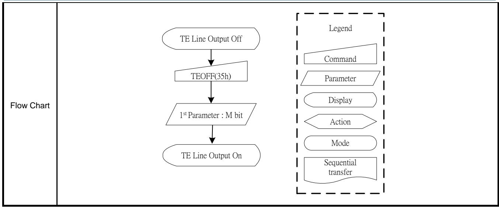

12.2.27 MADCTL(36h/3600h): Display data access control  

<table><tr><td>36H</td><td colspan="11">IDMOFF</td><td></td></tr><tr><td rowspan="2">Inst / Para</td><td rowspan="2">R/W</td><td colspan="2">Address</td><td rowspan="2">D15-8</td><td rowspan="2">D7</td><td rowspan="2">D6</td><td rowspan="2">D5</td><td rowspan="2">D4</td><td rowspan="2">D3</td><td rowspan="2">D2</td><td rowspan="2">D1</td><td rowspan="2">D0</td></tr><tr><td>MIPI</td><td>SPI-16</td></tr><tr><td>IDMOFF</td><td>W</td><td>36h</td><td>3600h</td><td>X</td><td>--</td><td>--</td><td>--</td><td>ML</td><td>BGR</td><td>--</td><td>--</td><td>--</td></tr><tr><td>Description</td><td colspan="12">ML: GET Scan direction selection.
ML=0 Get normal scan.
ML=1 Get reverse scan.
BGR:
BGR=0 →RGB
BGR=1 →BGR</td></tr><tr><td>Restriction</td><td colspan="12">This command has no effect when module is already in Idle Off mode.</td></tr><tr><td rowspan="6">Register availability</td><td rowspan="6"></td><td colspan="5">Status</td><td colspan="6">Availability</td></tr><tr><td colspan="5">Normal Mode On, Idle Mode Off, Sleep Out</td><td colspan="6">Yes</td></tr><tr><td colspan="5">Normal Mode On, Idle Mode On, Sleep Out</td><td colspan="6">Yes</td></tr><tr><td colspan="5">Partial Mode On, Idle Mode Off, Sleep Out</td><td colspan="6">Yes</td></tr><tr><td colspan="5">Partial Mode On, Idle Mode On, Sleep Out</td><td colspan="6">Yes</td></tr><tr><td colspan="5">Sleep In</td><td colspan="6">Yes</td></tr><tr><td rowspan="4">Default</td><td rowspan="4"></td><td colspan="4">Status</td><td colspan="7">Default Value (D7 to D0)</td></tr><tr><td colspan="4">Power On Sequence</td><td colspan="7">00H</td></tr><tr><td colspan="4">S/W Reset</td><td colspan="7">00H</td></tr><tr><td colspan="4">H/W Reset</td><td colspan="7">00H</td></tr><tr><td>Flow Chart</td><td></td><td colspan="11">Legend
Command
Parameter
Display
Action
Mode
Sequential
transfer</td></tr></table>

12.2.28 IDMOFF (38h/3800h): Idle Mode Off  

<table><tr><td>38H</td><td colspan="11">IDMOFF</td><td></td></tr><tr><td rowspan="2">Inst / Para</td><td rowspan="2">R/W</td><td colspan="2">Address</td><td rowspan="2">D15-8</td><td rowspan="2">D7</td><td rowspan="2">D6</td><td rowspan="2">D5</td><td rowspan="2">D4</td><td rowspan="2">D3</td><td rowspan="2">D2</td><td rowspan="2">D1</td><td rowspan="2">D0</td></tr><tr><td>MIPI</td><td>SPI-16</td></tr><tr><td>IDMOFF</td><td>W</td><td>38h</td><td>3800h</td><td>X</td><td colspan="8">No Argument</td></tr><tr><td>Description</td><td colspan="12">This command is used to recover from Idle mode onIn the idle off mode, display panel can display maximum 16.7M colors.</td></tr><tr><td>Restriction</td><td colspan="12">This command has no effect when module is already in Idle Off mode.</td></tr><tr><td rowspan="6">Register availability</td><td rowspan="6"></td><td colspan="6">Status</td><td colspan="5">Availability</td></tr><tr><td colspan="6">Normal Mode On, Idle Mode Off, Sleep Out</td><td colspan="5">Yes</td></tr><tr><td colspan="6">Normal Mode On, Idle Mode On, Sleep Out</td><td colspan="5">Yes</td></tr><tr><td colspan="6">Partial Mode On, Idle Mode Off, Sleep Out</td><td colspan="5">Yes</td></tr><tr><td colspan="6">Partial Mode On, Idle Mode On, Sleep Out</td><td colspan="5">Yes</td></tr><tr><td colspan="6">Sleep In</td><td colspan="5">Yes</td></tr><tr><td rowspan="4">Default</td><td rowspan="4"></td><td colspan="5">Status</td><td colspan="6">Default Value (D7 to D0)</td></tr><tr><td colspan="5">Power On Sequence</td><td colspan="6">Idle Mode off</td></tr><tr><td colspan="5">S/W Reset</td><td colspan="6">Idle Mode off</td></tr><tr><td colspan="5">H/W Reset</td><td colspan="6">Idle Mode off</td></tr><tr><td>Flow Chart</td><td></td><td colspan="5">Idle On ModeIDMOFF(38h)Idle Off Mode</td><td colspan="6">LegendCommandParameterDisplayActionModeSequentialtransfer</td></tr></table>

12.2.29 IDMON (39h/3900h): Idle Mode On  

<table><tr><td>39H</td><td colspan="11">IDMON</td><td></td></tr><tr><td rowspan="2">Inst / Para</td><td rowspan="2">R/W</td><td colspan="2">Address</td><td rowspan="2">D15-8</td><td rowspan="2">D7</td><td rowspan="2">D6</td><td rowspan="2">D5</td><td rowspan="2">D4</td><td rowspan="2">D3</td><td rowspan="2">D2</td><td rowspan="2">D1</td><td rowspan="2">D0</td></tr><tr><td>MIPI</td><td>SPI-16</td></tr><tr><td>IDMON</td><td>W</td><td>39h</td><td>3900h</td><td>X</td><td colspan="8">No Argument</td></tr><tr><td rowspan="10">Description</td><td colspan="12">Example)Frame Data DisplayTop-Left (0,0)This command is used to enter into Idle mode on.In the idle on mode, color expression is reduced. The primary and the secondary colors using MSB ofeach R, G, and B in Frame Data, 8 color depth data is displayed.</td></tr><tr><td colspan="3">Color</td><td colspan="2">R5 R4 R3 R2 R1 R0</td><td colspan="3">G5 G4 G3 G2 G1 G0</td><td colspan="3">B5 B4 B3 B4 B1 B0</td><td></td></tr><tr><td colspan="3">Black</td><td colspan="2">0xxxxx</td><td colspan="3">0xxxxx</td><td colspan="3">0xxxxxx</td><td></td></tr><tr><td colspan="3">Blue</td><td colspan="2">0xxxxx</td><td colspan="3">0xxxxx</td><td colspan="3">1xxxxxx</td><td></td></tr><tr><td colspan="3">Red</td><td colspan="2">1xxxxx</td><td colspan="3">0xxxxx</td><td colspan="3">0xxxxxx</td><td></td></tr><tr><td colspan="3">Magenta</td><td colspan="2">1xxxxx</td><td colspan="3">0xxxxx</td><td colspan="3">1xxxxxx</td><td></td></tr><tr><td colspan="3">Green</td><td colspan="2">0xxxxx</td><td colspan="3">1xxxxx</td><td colspan="3">0xxxxxx</td><td></td></tr><tr><td colspan="3">Cyan</td><td colspan="2">0xxxxx</td><td colspan="3">1xxxxx</td><td colspan="3">1xxxxxx</td><td></td></tr><tr><td colspan="3">Yellow</td><td colspan="2">1xxxxx</td><td colspan="3">1xxxxx</td><td colspan="3">0xxxxxx</td><td></td></tr><tr><td colspan="3">White</td><td colspan="2">1xxxxx</td><td colspan="3">1xxxxx</td><td colspan="3">1xxxxxx</td><td></td></tr><tr><td>Restriction</td><td colspan="12">This command has no effect when module is already in Idle On mode.</td></tr><tr><td rowspan="7">Register availability</td><td colspan="12"></td></tr><tr><td colspan="6">Status</td><td colspan="6">Availability</td></tr><tr><td colspan="6">Normal Mode On, Idle Mode Off, Sleep Out</td><td colspan="6">Yes</td></tr><tr><td colspan="6">Normal Mode On, Idle Mode On, Sleep Out</td><td colspan="6">Yes</td></tr><tr><td colspan="6">Partial Mode On, Idle Mode Off, Sleep Out</td><td colspan="6">Yes</td></tr><tr><td colspan="6">Partial Mode On, Idle Mode On, Sleep Out</td><td colspan="6">Yes</td></tr><tr><td colspan="6">Sleep In</td><td colspan="6">Yes</td></tr><tr><td rowspan="5">Default</td><td colspan="12"></td></tr><tr><td colspan="5">Status</td><td colspan="7">Default Value (D7 to D0)</td></tr><tr><td colspan="5">Power On Sequence</td><td colspan="7">Idle Mode off</td></tr><tr><td colspan="5">S/W Reset</td><td colspan="7">Idle Mode off</td></tr><tr><td colspan="5">H/W Reset</td><td colspan="7">Idle Mode off</td></tr></table>

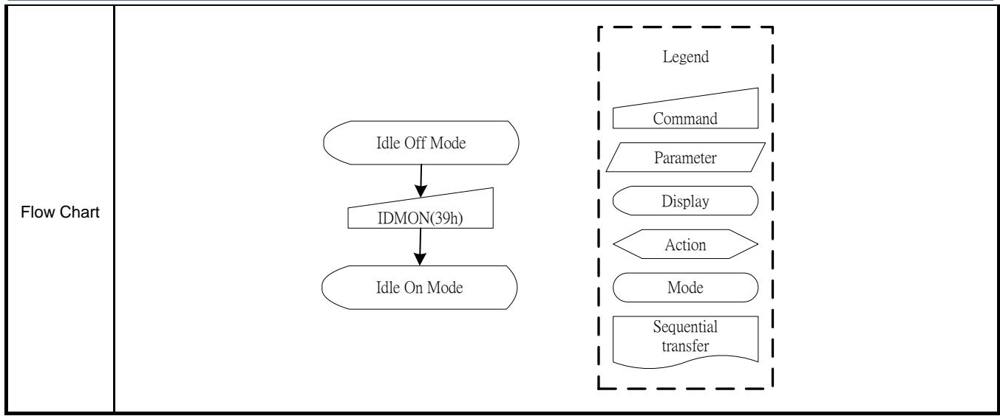

12.2.30 COLMOD (3Ah/3A00h): Interface Pixel Format  

<table><tr><td>3AH</td><td colspan="11">COLMOD</td><td></td></tr><tr><td rowspan="2">Inst / Para</td><td rowspan="2">R/W</td><td colspan="2">Address</td><td rowspan="2">D15-8</td><td rowspan="2">D7</td><td rowspan="2">D6</td><td rowspan="2">D5</td><td rowspan="2">D4</td><td rowspan="2">D3</td><td rowspan="2">D2</td><td rowspan="2">D1</td><td rowspan="2">D0</td></tr><tr><td>MIPI</td><td>SPI-16</td></tr><tr><td>COLMOD</td><td>W</td><td>3Ah</td><td>3A00h</td><td>X</td><td>--</td><td colspan="3">VIPF[2:0]</td><td>--</td><td>--</td><td>--</td><td>--</td></tr><tr><td rowspan="3">Description</td><td colspan="12">This command is used to define the format of RGB picture data.The formats are shown in the table:</td></tr><tr><td colspan="3"></td><td>Bit</td><td colspan="3">NAME</td><td colspan="5">DESCRIPTION</td></tr><tr><td colspan="3"></td><td>VIPF[2:0]</td><td colspan="3">Pixel Format for RGB Interface</td><td colspan="5">&quot;101&quot;=16-bit/pixel&quot;110&quot;=18-bit/pixel&quot;111&quot;=24-bit/pixelThe others=not defined</td></tr><tr><td>Restriction</td><td colspan="12">There is no visible effect until the display data is written to.</td></tr><tr><td rowspan="6">Register availability</td><td colspan="3"></td><td colspan="4">Status</td><td colspan="5">Availability</td></tr><tr><td colspan="3"></td><td colspan="4">Normal Mode On, Idle Mode Off, Sleep Out</td><td colspan="5">Yes</td></tr><tr><td colspan="3"></td><td colspan="4">Normal Mode On, Idle Mode On, Sleep Out</td><td colspan="5">Yes</td></tr><tr><td colspan="3"></td><td colspan="4">Partial Mode On, Idle Mode Off, Sleep Out</td><td colspan="5">Yes</td></tr><tr><td colspan="3"></td><td colspan="4">Partial Mode On, Idle Mode On, Sleep Out</td><td colspan="5">Yes</td></tr><tr><td colspan="3"></td><td colspan="4">Sleep In</td><td colspan="5">Yes</td></tr><tr><td rowspan="4">Default</td><td colspan="3"></td><td colspan="3">Status</td><td colspan="6">Default Value (D7 to D0)</td></tr><tr><td colspan="3"></td><td colspan="3">Power On Sequence</td><td colspan="6">70h</td></tr><tr><td colspan="3"></td><td colspan="3">S/W Reset</td><td colspan="6">70h</td></tr><tr><td colspan="3"></td><td colspan="3">H/W Reset</td><td colspan="6">70h</td></tr><tr><td>Flow Chart</td><td colspan="3"></td><td colspan="9">24-bit/pixel ModeCOLMOD(3Ah)ParameterVIPF[2:0]&quot;110&quot;18-bit/pixel ModeLegendCommandDisplayActionModeSequentialtransfer</td></tr></table>

12.2.31 GSL (45h): Get Scan Line  

<table><tr><td>45H</td><td colspan="11">GSL</td><td></td></tr><tr><td rowspan="2">Inst / Para</td><td rowspan="2">R/W</td><td colspan="2">Address</td><td rowspan="2">D15-8</td><td rowspan="2">D7</td><td rowspan="2">D6</td><td rowspan="2">D5</td><td rowspan="2">D4</td><td rowspan="2">D3</td><td rowspan="2">D2</td><td rowspan="2">D1</td><td rowspan="2">D0</td></tr><tr><td>MIPI</td><td>SPI-16</td></tr><tr><td rowspan="2">GSL</td><td rowspan="2">R</td><td rowspan="2">45h</td><td>4500h</td><td>X</td><td colspan="8">TELS[15:8]</td></tr><tr><td>4501h</td><td>X</td><td colspan="8">TELS[7:0]</td></tr><tr><td>Description</td><td colspan="12">The display reads the current scan line N, used to update the display device. The total number of scan lines on a display device is defined as VSYNC + VBP + VACT + VFP. The first scan line is defined as the first line of V-Sync and is denoted as Line 0.</td></tr><tr><td>Restriction</td><td colspan="12">--</td></tr><tr><td rowspan="19">Register availability</td><td colspan="12"></td></tr><tr><td colspan="12"></td></tr><tr><td colspan="12"></td></tr><tr><td colspan="12"></td></tr><tr><td colspan="12"></td></tr><tr><td colspan="12"></td></tr><tr><td colspan="12"></td></tr><tr><td colspan="9"></td><td></td><td></td><td></td></tr><tr><td colspan="9"></td><td></td><td></td><td></td></tr><tr><td colspan="9"></td><td></td><td></td><td></td></tr><tr><td colspan="9"></td><td></td><td></td><td></td></tr><tr><td colspan="9"></td><td></td><td></td><td></td></tr><tr><td colspan="9"></td><td></td><td></td><td></td></tr><tr><td colspan="9"></td><td></td><td></td><td></td></tr><tr><td colspan="6"></td><td colspan="3">Default Value (D7 to D0)</td><td></td><td></td><td></td></tr><tr><td colspan="6"></td><td colspan="3">00h</td><td></td><td></td><td></td></tr><tr><td colspan="6"></td><td colspan="3">00h</td><td></td><td></td><td></td></tr><tr><td colspan="6"></td><td colspan="3">00h</td><td></td><td></td><td></td></tr><tr><td colspan="6"></td><td colspan="3">00h</td><td></td><td></td><td></td></tr><tr><td rowspan="13">Default</td><td colspan="12"></td></tr><tr><td colspan="12"></td></tr><tr><td colspan="12"></td></tr><tr><td colspan="12"></td></tr><tr><td colspan="12"></td></tr><tr><td colspan="12"></td></tr><tr><td colspan="9"></td><td colspan="3">Legend</td></tr><tr><td colspan="9"></td><td colspan="3">Command</td></tr><tr><td colspan="9"></td><td colspan="3">Parameter</td></tr><tr><td colspan="9"></td><td colspan="3">Display</td></tr><tr><td colspan="9"></td><td colspan="3">Action</td></tr><tr><td colspan="9"></td><td colspan="3">Mode</td></tr><tr><td colspan="9"></td><td colspan="3">Sequential transfer</td></tr></table>

12.2.32 WRDISBV (51h): Write Display Brightness  

<table><tr><td>51H</td><td colspan="11">WRDISBV</td><td></td></tr><tr><td rowspan="2">Inst / Para</td><td rowspan="2">R/W</td><td colspan="2">Address</td><td rowspan="2">D15-8</td><td rowspan="2">D7</td><td rowspan="2">D6</td><td rowspan="2">D5</td><td rowspan="2">D4</td><td rowspan="2">D3</td><td rowspan="2">D2</td><td rowspan="2">D1</td><td rowspan="2">D0</td></tr><tr><td>MIPI</td><td>SPI-16</td></tr><tr><td>WRDISBV</td><td>W</td><td>51h</td><td>5100h</td><td>X</td><td colspan="8">DBV[7:0]</td></tr><tr><td>Description</td><td colspan="12">This command is used to adjust the brightness value of the display.It should be checked what the relationship between this written value and output brightness of the display is. This relationship is defined on the display module specification.In principle relationship is that 00h value means the lowest brightness and FFh value means the highest brightness.</td></tr><tr><td>Restriction</td><td colspan="12">The display supplier cannot use this command for tuning (e.g. factory tuning, etc.).</td></tr><tr><td rowspan="6">Register availability</td><td rowspan="6"></td><td colspan="6">Status</td><td colspan="5">Availability</td></tr><tr><td colspan="6">Normal Mode On, Idle Mode Off, Sleep Out</td><td colspan="5">Yes</td></tr><tr><td colspan="6">Normal Mode On, Idle Mode On, Sleep Out</td><td colspan="5">Yes</td></tr><tr><td colspan="6">Partial Mode On, Idle Mode Off, Sleep Out</td><td colspan="5">Yes</td></tr><tr><td colspan="6">Partial Mode On, Idle Mode On, Sleep Out</td><td colspan="5">Yes</td></tr><tr><td colspan="6">Sleep In</td><td colspan="5">Yes</td></tr><tr><td rowspan="4">Default</td><td rowspan="4"></td><td colspan="5">Status</td><td colspan="6">Default Value (D7 to D0)</td></tr><tr><td colspan="5">Power On Sequence</td><td colspan="6">00h</td></tr><tr><td colspan="5">S/W Reset</td><td colspan="6">00h</td></tr><tr><td colspan="5">H/W Reset</td><td colspan="6">00h</td></tr><tr><td>Flow Chart</td><td colspan="12">WRDISBV(51h)Parameter DBV[7:0]New Brightness LoadedLegendCommandDisplayActionModeSequentialtransfer</td></tr></table>

12.2.33 RDDISBV (52h/5200h): Read Display Brightness Value  

<table><tr><td>52H</td><td colspan="11">RDDISBV</td><td></td></tr><tr><td rowspan="2">Inst / Para</td><td rowspan="2">R/W</td><td colspan="2">Address</td><td rowspan="2">D15-8</td><td rowspan="2">D7</td><td rowspan="2">D6</td><td rowspan="2">D5</td><td rowspan="2">D4</td><td rowspan="2">D3</td><td rowspan="2">D2</td><td rowspan="2">D1</td><td rowspan="2">D0</td></tr><tr><td>MIPI</td><td>SPI-16</td></tr><tr><td>WRDISBV</td><td>R</td><td>52h</td><td>5200h</td><td>X</td><td colspan="8">DBV[7:0]</td></tr><tr><td>Description</td><td colspan="12">This command returns the brightness value of the display.It should be checked what the relationship between this returned value and output brightness of the display. This relationship is defined on the display module specification is.In principle the relationship is that 00h value means the lowest brightness and FFh value means the highest brightness.DBV[7:0] is reset when display is in sleep in mode.DBV[7:0] is &#x27;0&#x27; when bit BCTRL of write CTRL display command (53h) is &#x27;0&#x27;DBV[7:0] IS manual set brightness specified with write CTRL display command (53h) when bit BCTRL is &#x27;1&#x27;</td></tr><tr><td>Restriction</td><td colspan="12">--</td></tr><tr><td rowspan="6">Register availability</td><td rowspan="6"></td><td colspan="5">Status</td><td colspan="6">Availability</td></tr><tr><td colspan="5">Normal Mode On, Idle Mode Off, Sleep Out</td><td colspan="6">Yes</td></tr><tr><td colspan="5">Normal Mode On, Idle Mode On, Sleep Out</td><td colspan="6">Yes</td></tr><tr><td colspan="5">Partial Mode On, Idle Mode Off, Sleep Out</td><td colspan="6">Yes</td></tr><tr><td colspan="5">Partial Mode On, Idle Mode On, Sleep Out</td><td colspan="6">Yes</td></tr><tr><td colspan="5">Sleep In</td><td colspan="6">Yes</td></tr><tr><td rowspan="4">Default</td><td rowspan="4"></td><td colspan="4">Status</td><td colspan="7">Default Value (D7 to D0)</td></tr><tr><td colspan="4">Power On Sequence</td><td colspan="7">00h</td></tr><tr><td colspan="4">S/W Reset</td><td colspan="7">00h</td></tr><tr><td colspan="4">H/W Reset</td><td colspan="7">00h</td></tr><tr><td>Flow Chart</td><td></td><td colspan="4">RDDISB(52h)HostDriverSend ParameterDBV[7:0]</td><td colspan="7">LegendCommandParameterDisplayActionModeSequentialtransfer</td></tr></table>

12.2.34 WRCTRLD (53h/5300h): Write CTRL Display  

<table><tr><td>53H</td><td colspan="11">WRCTRLD</td><td></td></tr><tr><td rowspan="2">Inst / Para</td><td rowspan="2">R/W</td><td colspan="2">Address</td><td rowspan="2">D15-8</td><td rowspan="2">D7</td><td rowspan="2">D6</td><td rowspan="2">D5</td><td rowspan="2">D4</td><td rowspan="2">D3</td><td rowspan="2">D2</td><td rowspan="2">D1</td><td rowspan="2">D0</td></tr><tr><td>MIPI</td><td>SPI-16</td></tr><tr><td>WRCTRLD</td><td>W</td><td>53h</td><td>5300h</td><td>X</td><td>--</td><td>--</td><td>BCTRL</td><td>--</td><td>DD</td><td>BL</td><td>--</td><td>--</td></tr><tr><td>Description</td><td colspan="12">This command is used to control display brightness.BCTRL: Brightness Control Block On/Off, This bit is always used to switch brightness for display.0 = Off (Brightness register are 00h, DBV[7:0])1 = On (Brightness register are active, according to the other parameters.)DD: Display Dimming (Only for manual brightness setting)DD = 0: Display Dimming is off.DD = 1: Display Dimming is on.BL: Backlight Control On/Off0 = Off (Completely turn off backlight circuit. Control lines must be low.)1 = OnDimming function is adapted to the brightness registers for display when bit BCTRL is changed at DD=1.When BL bit changed from &#x27;on&#x27; to &#x27;off&#x27;, backlight is turned off without gradual dimming, even if dimming-on (DD=1) are selected.</td></tr><tr><td>Restriction</td><td colspan="12">--</td></tr><tr><td rowspan="18">Register availability</td><td colspan="12"></td></tr><tr><td colspan="12"></td></tr><tr><td colspan="12"></td></tr><tr><td colspan="12"></td></tr><tr><td colspan="12"></td></tr><tr><td colspan="12"></td></tr><tr><td colspan="12"></td></tr><tr><td colspan="9"></td><td></td><td></td><td></td></tr><tr><td colspan="9"></td><td></td><td></td><td></td></tr><tr><td colspan="9"></td><td></td><td></td><td></td></tr><tr><td colspan="9"></td><td></td><td></td><td></td></tr><tr><td colspan="9"></td><td></td><td></td><td></td></tr><tr><td colspan="9"></td><td></td><td></td><td></td></tr><tr><td colspan="9"></td><td></td><td></td><td></td></tr><tr><td colspan="6"></td><td colspan="3">Default Value (D7 to D0)</td><td></td><td></td><td></td></tr><tr><td colspan="6"></td><td colspan="3">00h</td><td></td><td></td><td></td></tr><tr><td colspan="6"></td><td colspan="3">00h</td><td></td><td></td><td></td></tr><tr><td colspan="6"></td><td colspan="3">00h</td><td></td><td></td><td></td></tr></table>

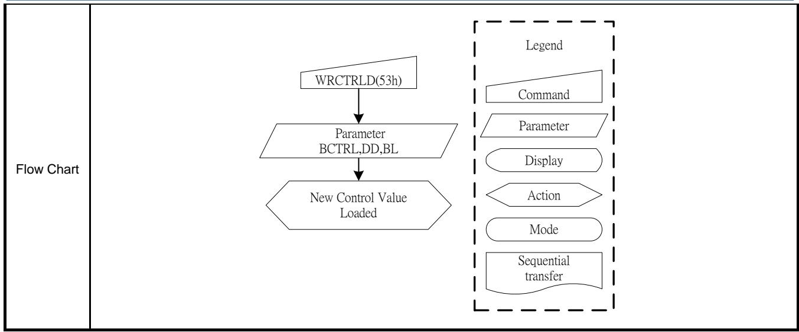

12.2.35 RDCTRLD (54h): Read CTRL Value Display  

<table><tr><td>54H</td><td colspan="11">WRCTRLD</td><td></td></tr><tr><td rowspan="2">Inst / Para</td><td rowspan="2">R/W</td><td colspan="2">Address</td><td rowspan="2">D15-8</td><td rowspan="2">D7</td><td rowspan="2">D6</td><td rowspan="2">D5</td><td rowspan="2">D4</td><td rowspan="2">D3</td><td rowspan="2">D2</td><td rowspan="2">D1</td><td rowspan="2">D0</td></tr><tr><td>MIPI</td><td>SPI-16</td></tr><tr><td>RDCTRLD</td><td>R</td><td>54h</td><td>5400h</td><td>X</td><td>--</td><td>--</td><td>BCTRL</td><td>--</td><td>DD</td><td>BL</td><td>--</td><td>--</td></tr><tr><td>Description</td><td colspan="12">This command returns ambient light and brightness control values..BCTRL: Brightness Control Block On/Off, This bit is always used to switch brightness for display.0 = Off 1 = OnDD: Display Dimming (Only for manual brightness setting)DD = 0  DD = 1BL: Backlight Control On/Off0 = Off 1 = On</td></tr><tr><td>Restriction</td><td colspan="12">--</td></tr><tr><td rowspan="6">Register availability</td><td colspan="6">Status</td><td colspan="6">Availability</td></tr><tr><td colspan="6">Normal Mode On, Idle Mode Off, Sleep Out</td><td colspan="6">Yes</td></tr><tr><td colspan="6">Normal Mode On, Idle Mode On, Sleep Out</td><td colspan="6">Yes</td></tr><tr><td colspan="6">Partial Mode On, Idle Mode Off, Sleep Out</td><td colspan="6">Yes</td></tr><tr><td colspan="6">Partial Mode On, Idle Mode On, Sleep Out</td><td colspan="6">Yes</td></tr><tr><td colspan="6">Sleep In</td><td colspan="6">Yes</td></tr><tr><td rowspan="4">Default</td><td colspan="5">Status</td><td colspan="7">Default Value (D7 to D0)</td></tr><tr><td colspan="5">Power On Sequence</td><td colspan="7">00h</td></tr><tr><td colspan="5">S/W Reset</td><td colspan="7">00h</td></tr><tr><td colspan="5">H/W Reset</td><td colspan="7">00h</td></tr><tr><td>Flow Chart</td><td colspan="5">RDCTRLD(54h)HostSend ParameterBCTRL,DD,BL</td><td colspan="7">LegendCommandParameterDisplayActionModeSequentialtransfer</td></tr></table>

# 12.2.36 WRCACE (55h/5500h): Write Content Adaptive Brightness Control and Color Enhancement

<table><tr><td>55H</td><td colspan="11">WRCACE</td><td></td></tr><tr><td rowspan="2">Inst / Para</td><td rowspan="2">R/W</td><td colspan="2">Address</td><td rowspan="2">D15-8</td><td rowspan="2">D7</td><td rowspan="2">D6</td><td rowspan="2">D5</td><td rowspan="2">D4</td><td rowspan="2">D3</td><td rowspan="2">D2</td><td rowspan="2">D1</td><td rowspan="2">D0</td></tr><tr><td>MIPI</td><td>SPI-16</td></tr><tr><td>WRCACE</td><td>W</td><td>55h</td><td>5500h</td><td>X</td><td>CE_ON</td><td>--</td><td colspan="2">CEMD[1:0]</td><td>--</td><td>--</td><td colspan="2">CABC_MD[1:0]</td></tr><tr><td rowspan="11">Description</td><td colspan="12">This command is used to set parameters for image content based adaptive brightness control functionality and Color Enhancement functionCE_ON=&quot;1&quot;,Color enhancement on CE_ON=&quot;0&quot;,Color enhancement offThere are three color enhancement levels can be set.</td></tr><tr><td colspan="3">CEMD[1]</td><td colspan="2">CEMD[0]</td><td colspan="7">Function</td></tr><tr><td colspan="3">0</td><td colspan="2">0</td><td colspan="7">Low enhancement</td></tr><tr><td colspan="3">0</td><td colspan="2">1</td><td colspan="7">Medium enhancement</td></tr><tr><td colspan="3">1</td><td colspan="2">1</td><td colspan="7">High enhancement</td></tr><tr><td colspan="12">There is possible to used 4 different modes for content adaptive image functionality, which are defined on a table below.</td></tr><tr><td colspan="3">CABC_MD[1]</td><td colspan="2">CABC_MD[0]</td><td colspan="7">Function</td></tr><tr><td colspan="3">0</td><td colspan="2">0</td><td colspan="7">Off</td></tr><tr><td colspan="3">0</td><td colspan="2">1</td><td colspan="7">User Interface Mode</td></tr><tr><td colspan="3">1</td><td colspan="2">0</td><td colspan="7">Still Picture</td></tr><tr><td colspan="3">1</td><td colspan="2">1</td><td colspan="7">Moving Image</td></tr><tr><td>Restriction</td><td colspan="12">--</td></tr><tr><td rowspan="6">Register availability</td><td colspan="6">Status</td><td colspan="6">Availability</td></tr><tr><td colspan="6">Normal Mode On, Idle Mode Off, Sleep Out</td><td colspan="6">Yes</td></tr><tr><td colspan="6">Normal Mode On, Idle Mode On, Sleep Out</td><td colspan="6">Yes</td></tr><tr><td colspan="6">Partial Mode On, Idle Mode Off, Sleep Out</td><td colspan="6">Yes</td></tr><tr><td colspan="6">Partial Mode On, Idle Mode On, Sleep Out</td><td colspan="6">Yes</td></tr><tr><td colspan="6">Sleep In</td><td colspan="6">Yes</td></tr><tr><td rowspan="4">Default</td><td colspan="5">Status</td><td colspan="7">Default Value (D7 to D0)</td></tr><tr><td colspan="5">Power On Sequence</td><td colspan="7">00h</td></tr><tr><td colspan="5">S/W Reset</td><td colspan="7">00h</td></tr><tr><td colspan="5">H/W Reset</td><td colspan="7">00h</td></tr></table>

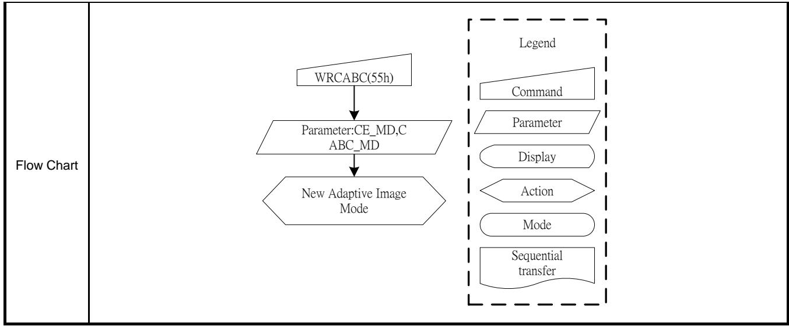

12.2.37 RDCABC (56h/5600h): Read Content Adaptive Brightness Control  

<table><tr><td>56H</td><td colspan="11">RDCABC</td><td></td></tr><tr><td rowspan="2">Inst / Para</td><td rowspan="2">R/W</td><td colspan="2">Address</td><td rowspan="2">D15-8</td><td rowspan="2">D7</td><td rowspan="2">D6</td><td rowspan="2">D5</td><td rowspan="2">D4</td><td rowspan="2">D3</td><td rowspan="2">D2</td><td rowspan="2">D1</td><td rowspan="2">D0</td></tr><tr><td>MIPI</td><td>SPI-16</td></tr><tr><td>RDCABC</td><td>R</td><td>56h</td><td>5600h</td><td>X</td><td>CE_ON</td><td>--</td><td colspan="2">CEMD[1:0]</td><td>--</td><td>--</td><td colspan="2">CABC_MD[1:0]</td></tr><tr><td rowspan="12">Description</td><td colspan="12">This command is used to read the settings for image content based adaptive brightness control functionality. 
CE_ON=&quot;1&quot;,Color enhancement on CE_ON=&quot;0&quot;,Color enhancement off 
There are three color enhancement levels can be set.</td></tr><tr><td colspan="3">CEMD[1]</td><td colspan="2">CEMD[0]</td><td colspan="7">Function</td></tr><tr><td colspan="3">0</td><td colspan="2">0</td><td colspan="7">Low enhancement</td></tr><tr><td colspan="3">0</td><td colspan="2">1</td><td colspan="7">Medium enhancement</td></tr><tr><td colspan="3">1</td><td colspan="2">1</td><td colspan="7">High enhancement</td></tr><tr><td colspan="12">There is possible to used 4 different modes for content adaptive image functionality, which are defined on a table below.</td></tr><tr><td colspan="3">CABC_MD[1]</td><td colspan="2">CABC_MD[0]</td><td colspan="7">Function</td></tr><tr><td colspan="3">0</td><td colspan="2">0</td><td colspan="7">Off</td></tr><tr><td colspan="3">0</td><td colspan="2">1</td><td colspan="7">User Interface Mode</td></tr><tr><td colspan="3">1</td><td colspan="2">0</td><td colspan="7">Still Picture</td></tr><tr><td colspan="3">1</td><td colspan="2">1</td><td colspan="7">Moving Image</td></tr><tr><td colspan="12">&#x27;&#x27;: Don&#x27;t care</td></tr><tr><td>Restriction</td><td colspan="12">--</td></tr><tr><td rowspan="6">Register availability</td><td colspan="6">Status</td><td colspan="6">Availability</td></tr><tr><td colspan="6">Normal Mode On, Idle Mode Off, Sleep Out</td><td colspan="6">Yes</td></tr><tr><td colspan="6">Normal Mode On, Idle Mode On, Sleep Out</td><td colspan="6">Yes</td></tr><tr><td colspan="6">Partial Mode On, Idle Mode Off, Sleep Out</td><td colspan="6">Yes</td></tr><tr><td colspan="6">Partial Mode On, Idle Mode On, Sleep Out</td><td colspan="6">Yes</td></tr><tr><td colspan="6">Sleep In</td><td colspan="6">Yes</td></tr><tr><td rowspan="4">Default</td><td colspan="5">Status</td><td colspan="7">Default Value (D7 to D0)</td></tr><tr><td colspan="5">Power On Sequence</td><td colspan="7">00h</td></tr><tr><td colspan="5">S/W Reset</td><td colspan="7">00h</td></tr><tr><td colspan="5">H/W Reset</td><td colspan="7">00h</td></tr></table>

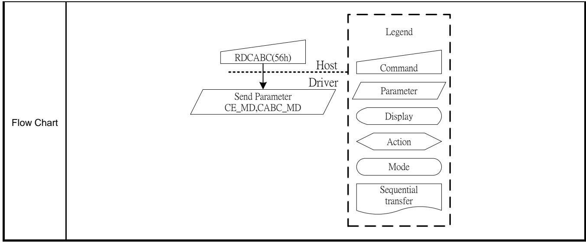

12.2.38 WRCABCMB (5Eh/5E00h): Write CABC Minimum Brightness  

<table><tr><td>5EH</td><td colspan="11">WRCABCMB</td><td></td></tr><tr><td rowspan="2">Inst / Para</td><td rowspan="2">R/W</td><td colspan="2">Address</td><td rowspan="2">D15-8</td><td rowspan="2">D7</td><td rowspan="2">D6</td><td rowspan="2">D5</td><td rowspan="2">D4</td><td rowspan="2">D3</td><td rowspan="2">D2</td><td rowspan="2">D1</td><td rowspan="2">D0</td></tr><tr><td>MIPI</td><td>SPI-16</td></tr><tr><td>WRCABCMB</td><td>W</td><td>5Eh</td><td>5E00h</td><td>X</td><td colspan="8">CMB[7:0]</td></tr><tr><td>Description</td><td colspan="12">This command is used to set the minimum brightness value of the display for CABC function.In principle relationship is that 00h value means the lowest brightness for CABC and FFh value means the brightness for CABC.</td></tr><tr><td>Restriction</td><td colspan="12">--</td></tr><tr><td rowspan="6">Register availability</td><td rowspan="6"></td><td colspan="5">Status</td><td colspan="6">Availability</td></tr><tr><td colspan="5">Normal Mode On, Idle Mode Off, Sleep Out</td><td colspan="6">Yes</td></tr><tr><td colspan="5">Normal Mode On, Idle Mode On, Sleep Out</td><td colspan="6">Yes</td></tr><tr><td colspan="5">Partial Mode On, Idle Mode Off, Sleep Out</td><td colspan="6">Yes</td></tr><tr><td colspan="5">Partial Mode On, Idle Mode On, Sleep Out</td><td colspan="6">Yes</td></tr><tr><td colspan="5">Sleep In</td><td colspan="6">Yes</td></tr><tr><td rowspan="4">Default</td><td rowspan="4"></td><td colspan="4">Status</td><td colspan="7">Default Value (D7 to D0)</td></tr><tr><td colspan="4">Power On Sequence</td><td colspan="7">00h</td></tr><tr><td colspan="4">S/W Reset</td><td colspan="7">00h</td></tr><tr><td colspan="4">H/W Reset</td><td colspan="7">00h</td></tr><tr><td>Flow Chart</td><td colspan="12">WRCABCME(5Eh)Parameter:CMBNew Display LuminanceValue LoadedLegendCommandParameterDisplayActionModeSequentialtransfer</td></tr></table>

12.2.39 RDCABCMB (5Fh/5F00h): Read CABC Minimum Brightness  

<table><tr><td>5FH</td><td colspan="11">WRCABCMB</td><td></td></tr><tr><td rowspan="2">Inst / Para</td><td rowspan="2">R/W</td><td colspan="2">Address</td><td rowspan="2">D15-8</td><td rowspan="2">D7</td><td rowspan="2">D6</td><td rowspan="2">D5</td><td rowspan="2">D4</td><td rowspan="2">D3</td><td rowspan="2">D2</td><td rowspan="2">D1</td><td rowspan="2">D0</td></tr><tr><td>MIPI</td><td>SPI-16</td></tr><tr><td>WRCABCMB</td><td>R</td><td>5Fh</td><td>5F00h</td><td>X</td><td colspan="8">CMB[7:0]</td></tr><tr><td>Description</td><td colspan="12">This command returns the minimum brightness value of CABC function.
In principle relationship is that 00h value means the lowest brightness for CABC and FFh value means the brightness for CABC.</td></tr><tr><td>Restriction</td><td colspan="12">--</td></tr><tr><td rowspan="6">Register availability</td><td rowspan="6"></td><td colspan="5">Status</td><td colspan="6">Availability</td></tr><tr><td colspan="5">Normal Mode On, Idle Mode Off, Sleep Out</td><td colspan="6">Yes</td></tr><tr><td colspan="5">Normal Mode On, Idle Mode On, Sleep Out</td><td colspan="6">Yes</td></tr><tr><td colspan="5">Partial Mode On, Idle Mode Off, Sleep Out</td><td colspan="6">Yes</td></tr><tr><td colspan="5">Partial Mode On, Idle Mode On, Sleep Out</td><td colspan="6">Yes</td></tr><tr><td colspan="5">Sleep In</td><td colspan="6">Yes</td></tr><tr><td rowspan="4">Default</td><td rowspan="4"></td><td colspan="4">Status</td><td colspan="7">Default Value (D7 to D0)</td></tr><tr><td colspan="4">Power On Sequence</td><td colspan="7">00h</td></tr><tr><td colspan="4">S/W Reset</td><td colspan="7">00h</td></tr><tr><td colspan="4">H/W Reset</td><td colspan="7">00h</td></tr><tr><td>Flow Chart</td><td colspan="12">RDCABCMB(5Fh)Host CommandParameterDisplayActionModeSequentialtransfer</td></tr></table>

12.2.40 RDABCSDR (68h/6800h): Read Automatic Brightness Control Self-Diagnostic Result  

<table><tr><td>68H</td><td colspan="11">WRCABCMB</td><td></td></tr><tr><td rowspan="2">Inst / Para</td><td rowspan="2">R/W</td><td colspan="2">Address</td><td rowspan="2">D15-8</td><td rowspan="2">D7</td><td rowspan="2">D6</td><td rowspan="2">D5</td><td rowspan="2">D4</td><td rowspan="2">D3</td><td rowspan="2">D2</td><td rowspan="2">D1</td><td rowspan="2">D0</td></tr><tr><td>MIPI</td><td>SPI-16</td></tr><tr><td>WRCABCMB</td><td>R</td><td>68h</td><td>6800h</td><td>X</td><td>RLD</td><td>FUND</td><td>--</td><td>--</td><td>--</td><td>--</td><td>--</td><td>--</td></tr><tr><td>Description</td><td colspan="12">This command indicates the current status of the display self-diagnostic results for automatic brightness control after sleep out -command as described below: 
-RLD: Register loading detection 
-FUND: Functionality detection 
“-” Don&#x27;t care</td></tr><tr><td>Restriction</td><td colspan="12">--</td></tr><tr><td rowspan="6">Register availability</td><td rowspan="6"></td><td colspan="6">Status</td><td colspan="5">Availability</td></tr><tr><td colspan="6">Normal Mode On, Idle Mode Off, Sleep Out</td><td colspan="5">Yes</td></tr><tr><td colspan="6">Normal Mode On, Idle Mode On, Sleep Out</td><td colspan="5">Yes</td></tr><tr><td colspan="6">Partial Mode On, Idle Mode Off, Sleep Out</td><td colspan="5">Yes</td></tr><tr><td colspan="6">Partial Mode On, Idle Mode On, Sleep Out</td><td colspan="5">Yes</td></tr><tr><td colspan="6">Sleep In</td><td colspan="5">Yes</td></tr><tr><td rowspan="4">Default</td><td rowspan="4"></td><td colspan="5">Status</td><td colspan="6">Default Value (D7 to D0)</td></tr><tr><td colspan="5">Power On Sequence</td><td colspan="6">00h</td></tr><tr><td colspan="5">S/W Reset</td><td colspan="6">00h</td></tr><tr><td colspan="5">H/W Reset</td><td colspan="6">00h</td></tr><tr><td>Flow Chart</td><td colspan="12">RDABCSDR(68h) 
Host 
Driver 
Send Parameter 
RLD,FUND 
Legend 
Command 
Parameter 
Display 
Action 
Mode 
Sequential 
transfer</td></tr></table>

12.2.41 RDBWLB (70h/7000h):Read Black/White Low Bits  

<table><tr><td>70H</td><td colspan="11">RDBWLB</td><td></td></tr><tr><td rowspan="2">Inst / Para</td><td rowspan="2">R/W</td><td colspan="2">Address</td><td rowspan="2">D15-8</td><td rowspan="2">D7</td><td rowspan="2">D6</td><td rowspan="2">D5</td><td rowspan="2">D4</td><td rowspan="2">D3</td><td rowspan="2">D2</td><td rowspan="2">D1</td><td rowspan="2">D0</td></tr><tr><td>MIPI</td><td>SPI-16</td></tr><tr><td>RDBWLB</td><td>R</td><td>70h</td><td>7000h</td><td>X</td><td>BKx1</td><td>BKx0</td><td>BKy1</td><td>BKy0</td><td>Wx1</td><td>Wx0</td><td>Wy1</td><td>Wy0</td></tr><tr><td>Description</td><td colspan="12">This command reads the lowest bits of black and white color characteristics.
Black: Bkx and Bky
White: Wx and Wy</td></tr><tr><td>Restriction</td><td colspan="12">--</td></tr><tr><td rowspan="6">Register availability</td><td rowspan="6"></td><td colspan="5">Status</td><td colspan="6">Availability</td></tr><tr><td colspan="5">Normal Mode On, Idle Mode Off, Sleep Out</td><td colspan="6">Yes</td></tr><tr><td colspan="5">Normal Mode On, Idle Mode On, Sleep Out</td><td colspan="6">Yes</td></tr><tr><td colspan="5">Partial Mode On, Idle Mode Off, Sleep Out</td><td colspan="6">Yes</td></tr><tr><td colspan="5">Partial Mode On, Idle Mode On, Sleep Out</td><td colspan="6">Yes</td></tr><tr><td colspan="5">Sleep In</td><td colspan="6">Yes</td></tr><tr><td rowspan="4">Default</td><td rowspan="4"></td><td colspan="4">Status</td><td colspan="7">Default Value (D7 to D0)</td></tr><tr><td colspan="4">Power On Sequence</td><td colspan="7">XXh</td></tr><tr><td colspan="4">S/W Reset</td><td colspan="7">XXh</td></tr><tr><td colspan="4">H/W Reset</td><td colspan="7">XXh</td></tr><tr><td>Flow Chart</td><td colspan="5">RDBWLB(70h)
Send 1stParameter
Send 2ndParameter</td><td>Host Driver</td><td colspan="6">Legend
Command
Parameter
Display
Action
Mode
Sequential transfer</td></tr></table>

12.2.42 RDBkx (71h/7100h):Read Bkx  

<table><tr><td>71H</td><td colspan="11">RDBkx</td><td></td></tr><tr><td rowspan="2">Inst / Para</td><td rowspan="2">R/W</td><td colspan="2">Address</td><td rowspan="2">D15-8</td><td rowspan="2">D7</td><td rowspan="2">D6</td><td rowspan="2">D5</td><td rowspan="2">D4</td><td rowspan="2">D3</td><td rowspan="2">D2</td><td rowspan="2">D1</td><td rowspan="2">D0</td></tr><tr><td>MIPI</td><td>SPI-16</td></tr><tr><td>RDBkx</td><td>R</td><td>71h</td><td>7100h</td><td>X</td><td colspan="8">BKx[9:2]</td></tr><tr><td>Description</td><td colspan="12">This command reads the Bkx bits (Bkx [9:2]) of black color characteristics.</td></tr><tr><td>Restriction</td><td colspan="12">Only the 2nd parameter is sent on the DSI; the 1st parameter is not sent.</td></tr><tr><td rowspan="6">Register availability</td><td rowspan="6"></td><td colspan="6">Status</td><td colspan="5">Availability</td></tr><tr><td colspan="6">Normal Mode On, Idle Mode Off, Sleep Out</td><td colspan="5">Yes</td></tr><tr><td colspan="6">Normal Mode On, Idle Mode On, Sleep Out</td><td colspan="5">Yes</td></tr><tr><td colspan="6">Partial Mode On, Idle Mode Off, Sleep Out</td><td colspan="5">Yes</td></tr><tr><td colspan="6">Partial Mode On, Idle Mode On, Sleep Out</td><td colspan="5">Yes</td></tr><tr><td colspan="6">Sleep In</td><td colspan="5">Yes</td></tr><tr><td rowspan="4">Default</td><td rowspan="4"></td><td colspan="5">Status</td><td colspan="6">Default Value (D7 to D0)</td></tr><tr><td colspan="5">Power On Sequence</td><td colspan="6">XXh</td></tr><tr><td colspan="5">S/W Reset</td><td colspan="6">XXh</td></tr><tr><td colspan="5">H/W Reset</td><td colspan="6">XXh</td></tr><tr><td>Flow Chart</td><td></td><td colspan="4">RDBKx[9:2](71h)Send 1stParameterSend 2ndParameter</td><td>Host Driver</td><td colspan="6">LegendCommandDisplayActionModeSequential transfer</td></tr></table>

12.2.43 RDBky (72h/7200h):Read Bky  

<table><tr><td>72H</td><td colspan="11">RDBky</td><td></td></tr><tr><td rowspan="2">Inst / Para</td><td rowspan="2">R/W</td><td colspan="2">Address</td><td rowspan="2">D15-8</td><td rowspan="2">D7</td><td rowspan="2">D6</td><td rowspan="2">D5</td><td rowspan="2">D4</td><td rowspan="2">D3</td><td rowspan="2">D2</td><td rowspan="2">D1</td><td rowspan="2">D0</td></tr><tr><td>MIPI</td><td>SPI-16</td></tr><tr><td>RDBky</td><td>R</td><td>72h</td><td>7200h</td><td>X</td><td colspan="8">BKy[9:2]</td></tr><tr><td>Description</td><td colspan="12">This command reads the Bkx bits (Bky [9:2]) of black color characteristics.</td></tr><tr><td>Restriction</td><td colspan="12">Only the 2nd parameter is sent on the DSI; the 1st parameter is not sent.</td></tr><tr><td rowspan="18">Register availability</td><td colspan="12"></td></tr><tr><td colspan="12"></td></tr><tr><td colspan="12"></td></tr><tr><td colspan="12"></td></tr><tr><td colspan="12"></td></tr><tr><td colspan="12"></td></tr><tr><td colspan="12"></td></tr><tr><td colspan="9"></td><td></td><td></td><td></td></tr><tr><td colspan="9"></td><td></td><td></td><td></td></tr><tr><td colspan="9"></td><td></td><td></td><td></td></tr><tr><td colspan="9"></td><td></td><td></td><td></td></tr><tr><td colspan="9"></td><td></td><td></td><td></td></tr><tr><td colspan="9"></td><td></td><td></td><td></td></tr><tr><td colspan="9"></td><td></td><td></td><td></td></tr><tr><td colspan="6"></td><td colspan="3">Default Value (D7 to D0)</td><td></td><td></td><td></td></tr><tr><td colspan="6"></td><td colspan="3">XXh</td><td></td><td></td><td></td></tr><tr><td colspan="6"></td><td colspan="3">XXh</td><td></td><td></td><td></td></tr><tr><td colspan="6"></td><td colspan="3">XXh</td><td></td><td></td><td></td></tr></table>

12.2.44 RDWx (73h/7300h):Read Wx  

<table><tr><td>73H</td><td colspan="11">RDWx</td><td></td></tr><tr><td rowspan="2">Inst / Para</td><td rowspan="2">R/W</td><td colspan="2">Address</td><td rowspan="2">D15-8</td><td rowspan="2">D7</td><td rowspan="2">D6</td><td rowspan="2">D5</td><td rowspan="2">D4</td><td rowspan="2">D3</td><td rowspan="2">D2</td><td rowspan="2">D1</td><td rowspan="2">D0</td></tr><tr><td>MIPI</td><td>SPI-16</td></tr><tr><td>RDWx</td><td>R</td><td>72h</td><td>7200h</td><td>X</td><td colspan="8">Wx[9:2]</td></tr><tr><td>Description</td><td colspan="12">This command reads the Wx bits (Bky [9:2]) of black color characteristics.</td></tr><tr><td>Restriction</td><td colspan="12">Only the 2nd parameter is sent on the DSI; the 1st parameter is not sent.</td></tr><tr><td rowspan="19">Register availability</td><td colspan="12"></td></tr><tr><td colspan="12"></td></tr><tr><td colspan="12"></td></tr><tr><td colspan="12"></td></tr><tr><td colspan="12"></td></tr><tr><td colspan="12"></td></tr><tr><td colspan="12"></td></tr><tr><td colspan="9"></td><td></td><td></td><td></td></tr><tr><td colspan="9"></td><td></td><td></td><td></td></tr><tr><td colspan="9"></td><td></td><td></td><td></td></tr><tr><td colspan="9"></td><td></td><td></td><td></td></tr><tr><td colspan="9"></td><td></td><td></td><td></td></tr><tr><td colspan="9"></td><td></td><td></td><td></td></tr><tr><td colspan="9"></td><td></td><td></td><td></td></tr><tr><td colspan="6"></td><td colspan="3">Default Value (D7 to D0)</td><td></td><td></td><td></td></tr><tr><td colspan="6"></td><td colspan="3">XXh</td><td></td><td></td><td></td></tr><tr><td colspan="6"></td><td colspan="3">XXh</td><td></td><td></td><td></td></tr><tr><td colspan="6"></td><td colspan="3">XXh</td><td></td><td></td><td></td></tr><tr><td colspan="6"></td><td colspan="3">XXh</td><td></td><td></td><td></td></tr></table>

12.2.45 RDWy (74h/7400h):Read Wy  

<table><tr><td>74H</td><td colspan="11">RDWy</td><td></td></tr><tr><td rowspan="2">Inst / Para</td><td rowspan="2">R/W</td><td colspan="2">Address</td><td rowspan="2">D15-8</td><td rowspan="2">D7</td><td rowspan="2">D6</td><td rowspan="2">D5</td><td rowspan="2">D4</td><td rowspan="2">D3</td><td rowspan="2">D2</td><td rowspan="2">D1</td><td rowspan="2">D0</td></tr><tr><td>MIPI</td><td>SPI-16</td></tr><tr><td>RDWy</td><td>R</td><td>74h</td><td>7400h</td><td>X</td><td colspan="8">Wy[9:2]</td></tr><tr><td>Description</td><td colspan="12">This command reads the Wx bits (Bky [9:2]) of black color characteristics.
“-” Don’t care</td></tr><tr><td>Restriction</td><td colspan="12">Only the 2nd parameter is sent on the DSI; the 1st parameter is not sent.</td></tr><tr><td rowspan="19">Register availability</td><td colspan="12"></td></tr><tr><td colspan="12"></td></tr><tr><td colspan="12"></td></tr><tr><td colspan="12"></td></tr><tr><td colspan="12"></td></tr><tr><td colspan="12"></td></tr><tr><td colspan="12"></td></tr><tr><td colspan="9"></td><td></td><td></td><td></td></tr><tr><td colspan="9"></td><td></td><td></td><td></td></tr><tr><td colspan="9"></td><td></td><td></td><td></td></tr><tr><td colspan="9"></td><td></td><td></td><td></td></tr><tr><td colspan="9"></td><td></td><td></td><td></td></tr><tr><td colspan="9"></td><td></td><td></td><td></td></tr><tr><td colspan="9"></td><td></td><td></td><td></td></tr><tr><td colspan="6"></td><td colspan="3">Default Value (D7 to D0)</td><td></td><td></td><td></td></tr><tr><td colspan="6"></td><td colspan="3">XXh</td><td></td><td></td><td></td></tr><tr><td colspan="6"></td><td colspan="3">XXh</td><td></td><td></td><td></td></tr><tr><td colspan="6"></td><td colspan="3">XXh</td><td></td><td></td><td></td></tr><tr><td colspan="6"></td><td colspan="3">XXh</td><td></td><td></td><td></td></tr></table>

12.2.46 RDRGLB (75h/7500h):Read Red/Green Low Bits  

<table><tr><td>75H</td><td colspan="11">RDRGLB</td><td></td></tr><tr><td rowspan="2">Inst / Para</td><td rowspan="2">R/W</td><td colspan="2">Address</td><td rowspan="2">D15-8</td><td rowspan="2">D7</td><td rowspan="2">D6</td><td rowspan="2">D5</td><td rowspan="2">D4</td><td rowspan="2">D3</td><td rowspan="2">D2</td><td rowspan="2">D1</td><td rowspan="2">D0</td></tr><tr><td>MIPI</td><td>SPI-16</td></tr><tr><td>RDRGLB</td><td>R</td><td>75h</td><td>7500h</td><td>X</td><td>Rx1</td><td>Rx0</td><td>Ry1</td><td>Ry0</td><td>Gx1</td><td>Gx0</td><td>Gy1</td><td>Gy0</td></tr><tr><td>Description</td><td colspan="12">This command reads the lowest bits of red and green color characteristics.
Red: Rx and Ry
Green: Gx and Gy</td></tr><tr><td>Restriction</td><td colspan="12">Only the 2nd parameter is sent on the DSI; the 1st parameter is not sent.</td></tr><tr><td rowspan="18">Register availability</td><td colspan="12"></td></tr><tr><td colspan="12"></td></tr><tr><td colspan="12"></td></tr><tr><td colspan="12"></td></tr><tr><td colspan="12"></td></tr><tr><td colspan="12"></td></tr><tr><td colspan="12"></td></tr><tr><td colspan="9"></td><td></td><td></td><td></td></tr><tr><td colspan="9"></td><td></td><td></td><td></td></tr><tr><td colspan="9"></td><td></td><td></td><td></td></tr><tr><td colspan="9"></td><td></td><td></td><td></td></tr><tr><td colspan="9"></td><td></td><td></td><td></td></tr><tr><td colspan="9"></td><td></td><td></td><td></td></tr><tr><td colspan="9"></td><td></td><td></td><td></td></tr><tr><td colspan="6"></td><td colspan="3">Default Value (D7 to D0)</td><td></td><td></td><td></td></tr><tr><td colspan="6"></td><td colspan="3">XXh</td><td></td><td></td><td></td></tr><tr><td colspan="6"></td><td colspan="3">XXh</td><td></td><td></td><td></td></tr><tr><td colspan="6"></td><td colspan="3">XXh</td><td></td><td></td><td></td></tr></table>

12.2.47 RDRx (76h/7600h):Read Rx  

<table><tr><td>76H</td><td colspan="11">RDRx</td><td></td></tr><tr><td rowspan="2">Inst / Para</td><td rowspan="2">R/W</td><td colspan="2">Address</td><td rowspan="2">D15-8</td><td rowspan="2">D7</td><td rowspan="2">D6</td><td rowspan="2">D5</td><td rowspan="2">D4</td><td rowspan="2">D3</td><td rowspan="2">D2</td><td rowspan="2">D1</td><td rowspan="2">D0</td></tr><tr><td>MIPI</td><td>SPI-16</td></tr><tr><td>RDRx</td><td>R</td><td>76h</td><td>7600h</td><td>X</td><td colspan="8">Rx[9:2]</td></tr><tr><td>Description</td><td colspan="12">This command reads the Rx bits (Rx [9:2]) of red color characteristics.</td></tr><tr><td>Restriction</td><td colspan="12">Only the 2nd parameter is sent on the DSI; the 1st parameter is not sent.</td></tr><tr><td rowspan="19">Register availability</td><td colspan="12"></td></tr><tr><td colspan="12"></td></tr><tr><td colspan="12"></td></tr><tr><td colspan="12"></td></tr><tr><td colspan="12"></td></tr><tr><td colspan="12"></td></tr><tr><td colspan="12"></td></tr><tr><td colspan="9"></td><td></td><td></td><td></td></tr><tr><td colspan="9"></td><td></td><td></td><td></td></tr><tr><td colspan="9"></td><td></td><td></td><td></td></tr><tr><td colspan="9"></td><td></td><td></td><td></td></tr><tr><td colspan="9"></td><td></td><td></td><td></td></tr><tr><td colspan="9"></td><td></td><td></td><td></td></tr><tr><td colspan="9"></td><td></td><td></td><td></td></tr><tr><td colspan="6"></td><td colspan="3">Default Value (D7 to D0)</td><td></td><td></td><td></td></tr><tr><td colspan="6"></td><td colspan="3">XXh</td><td></td><td></td><td></td></tr><tr><td colspan="6"></td><td colspan="3">XXh</td><td></td><td></td><td></td></tr><tr><td colspan="6"></td><td colspan="3">XXh</td><td></td><td></td><td></td></tr><tr><td colspan="6"></td><td colspan="3">XXh</td><td></td><td></td><td></td></tr></table>

12.2.48 RDRy (77h/7700h):Read Ry  

<table><tr><td>77H</td><td colspan="11">RDRy</td><td></td></tr><tr><td rowspan="2">Inst / Para</td><td rowspan="2">R/W</td><td colspan="2">Address</td><td rowspan="2">D15-8</td><td rowspan="2">D7</td><td rowspan="2">D6</td><td rowspan="2">D5</td><td rowspan="2">D4</td><td rowspan="2">D3</td><td rowspan="2">D2</td><td rowspan="2">D1</td><td rowspan="2">D0</td></tr><tr><td>MIPI</td><td>SPI-16</td></tr><tr><td>RDRy</td><td>R</td><td>77h</td><td>7700h</td><td>X</td><td colspan="8">Ry[9:2]</td></tr><tr><td>Description</td><td colspan="12">This command reads the Rx bits (Ry [9:2]) of red color characteristics.</td></tr><tr><td>Restriction</td><td colspan="12">Only the 2nd parameter is sent on the DSI; the 1st parameter is not sent.</td></tr><tr><td rowspan="6">Register availability</td><td rowspan="6"></td><td colspan="6">Status</td><td colspan="5">Availability</td></tr><tr><td colspan="6">Normal Mode On, Idle Mode Off, Sleep Out</td><td colspan="5">Yes</td></tr><tr><td colspan="6">Normal Mode On, Idle Mode On, Sleep Out</td><td colspan="5">Yes</td></tr><tr><td colspan="6">Partial Mode On, Idle Mode Off, Sleep Out</td><td colspan="5">Yes</td></tr><tr><td colspan="6">Partial Mode On, Idle Mode On, Sleep Out</td><td colspan="5">Yes</td></tr><tr><td colspan="6">Sleep In</td><td colspan="5">Yes</td></tr><tr><td rowspan="4">Default</td><td rowspan="4"></td><td colspan="5">Status</td><td colspan="6">Default Value (D7 to D0)</td></tr><tr><td colspan="5">Power On Sequence</td><td colspan="6">XXh</td></tr><tr><td colspan="5">S/W Reset</td><td colspan="6">XXh</td></tr><tr><td colspan="5">H/W Reset</td><td colspan="6">XXh</td></tr></table>

12.2.49 RDGx (78h/7800h):Read Gx  

<table><tr><td>78H</td><td colspan="11">RDGx</td><td></td></tr><tr><td rowspan="2">Inst / Para</td><td rowspan="2">R/W</td><td colspan="2">Address</td><td rowspan="2">D15-8</td><td rowspan="2">D7</td><td rowspan="2">D6</td><td rowspan="2">D5</td><td rowspan="2">D4</td><td rowspan="2">D3</td><td rowspan="2">D2</td><td rowspan="2">D1</td><td rowspan="2">D0</td></tr><tr><td>MIPI</td><td>SPI-16</td></tr><tr><td>RDGx</td><td>R</td><td>77h</td><td>7700h</td><td>X</td><td colspan="8">Gx[9:2]</td></tr><tr><td>Description</td><td colspan="12">This command reads the Rx bits (Gx [9:2]) of red color characteristics.</td></tr><tr><td>Restriction</td><td colspan="12">Only the 2nd parameter is sent on the DSI; the 1st parameter is not sent.</td></tr><tr><td rowspan="19">Register availability</td><td colspan="12"></td></tr><tr><td colspan="12"></td></tr><tr><td colspan="12"></td></tr><tr><td colspan="12"></td></tr><tr><td colspan="12"></td></tr><tr><td colspan="12"></td></tr><tr><td colspan="12"></td></tr><tr><td colspan="9"></td><td></td><td></td><td></td></tr><tr><td colspan="9"></td><td></td><td></td><td></td></tr><tr><td colspan="9"></td><td></td><td></td><td></td></tr><tr><td colspan="9"></td><td></td><td></td><td></td></tr><tr><td colspan="9"></td><td></td><td></td><td></td></tr><tr><td colspan="9"></td><td></td><td></td><td></td></tr><tr><td colspan="9"></td><td></td><td></td><td></td></tr><tr><td colspan="6"></td><td colspan="3">Default Value (D7 to D0)</td><td></td><td></td><td></td></tr><tr><td colspan="6"></td><td colspan="3">XXh</td><td></td><td></td><td></td></tr><tr><td colspan="6"></td><td colspan="3">XXh</td><td></td><td></td><td></td></tr><tr><td colspan="6"></td><td colspan="3">XXh</td><td></td><td></td><td></td></tr><tr><td colspan="6"></td><td colspan="3">XXh</td><td></td><td></td><td></td></tr></table>

12.2.50 RDGy (79h/7900h):Read Gy  

<table><tr><td>79H</td><td colspan="11">RDGy</td><td></td></tr><tr><td rowspan="2">Inst / Para</td><td rowspan="2">R/W</td><td colspan="2">Address</td><td rowspan="2">D15-8</td><td rowspan="2">D7</td><td rowspan="2">D6</td><td rowspan="2">D5</td><td rowspan="2">D4</td><td rowspan="2">D3</td><td rowspan="2">D2</td><td rowspan="2">D1</td><td rowspan="2">D0</td></tr><tr><td>MIPI</td><td>SPI-16</td></tr><tr><td>RDGy</td><td>R</td><td>79h</td><td>7900h</td><td>X</td><td colspan="8">Gy[9:2]</td></tr><tr><td>Description</td><td colspan="12">This command reads the Gx bits (Gx [9:2]) of red color characteristics.</td></tr><tr><td>Restriction</td><td colspan="12">Only the 2nd parameter is sent on the DSI; the 1st parameter is not sent.</td></tr><tr><td rowspan="6">Register availability</td><td rowspan="6"></td><td colspan="6">Status</td><td colspan="5">Availability</td></tr><tr><td colspan="6">Normal Mode On, Idle Mode Off, Sleep Out</td><td colspan="5">Yes</td></tr><tr><td colspan="6">Normal Mode On, Idle Mode On, Sleep Out</td><td colspan="5">Yes</td></tr><tr><td colspan="6">Partial Mode On, Idle Mode Off, Sleep Out</td><td colspan="5">Yes</td></tr><tr><td colspan="6">Partial Mode On, Idle Mode On, Sleep Out</td><td colspan="5">Yes</td></tr><tr><td colspan="6">Sleep In</td><td colspan="5">Yes</td></tr><tr><td rowspan="4">Default</td><td rowspan="4"></td><td colspan="5">Status</td><td colspan="6">Default Value (D7 to D0)</td></tr><tr><td colspan="5">Power On Sequence</td><td colspan="6">XXh</td></tr><tr><td colspan="5">S/W Reset</td><td colspan="6">XXh</td></tr><tr><td colspan="5">H/W Reset</td><td colspan="6">XXh</td></tr></table>

12.2.51 RDBALB (7Ah/7A00h):Read Blue/A Color Low Bits  

<table><tr><td>7AH</td><td colspan="11">RDBALB</td><td></td></tr><tr><td rowspan="2">Inst / Para</td><td rowspan="2">R/W</td><td colspan="2">Address</td><td rowspan="2">D15-8</td><td rowspan="2">D7</td><td rowspan="2">D6</td><td rowspan="2">D5</td><td rowspan="2">D4</td><td rowspan="2">D3</td><td rowspan="2">D2</td><td rowspan="2">D1</td><td rowspan="2">D0</td></tr><tr><td>MIPI</td><td>SPI-16</td></tr><tr><td>RDBALB</td><td>R</td><td>7Ah</td><td>7A00h</td><td>X</td><td>Bx1</td><td>Bx0</td><td>By1</td><td>By0</td><td>Ax1</td><td>Ax0</td><td>Ay1</td><td>Ay0</td></tr><tr><td>Description</td><td colspan="12">This command reads the lowest bits of blue and A color color characteristics.
Blue: Bx and By
A color: Ax and Ay</td></tr><tr><td>Restriction</td><td colspan="12">Only the 2nd parameter is sent on the DSI; the 1st parameter is not sent.</td></tr><tr><td rowspan="8">Register availability</td><td colspan="12"></td></tr><tr><td colspan="12"></td></tr><tr><td colspan="12"></td></tr><tr><td colspan="12"></td></tr><tr><td colspan="12"></td></tr><tr><td colspan="12"></td></tr><tr><td colspan="12"></td></tr><tr><td colspan="9"></td><td></td><td></td><td></td></tr><tr><td rowspan="7">Default</td><td colspan="12"></td></tr><tr><td colspan="12"></td></tr><tr><td colspan="12"></td></tr><tr><td colspan="12"></td></tr><tr><td colspan="12"></td></tr><tr><td colspan="12"></td></tr><tr><td colspan="9"></td><td></td><td></td><td></td></tr></table>

12.2.52 RDBx (7Bh/7B00h):Read Bx  

<table><tr><td>7BH</td><td colspan="11">RDBx</td><td></td></tr><tr><td rowspan="2">Inst / Para</td><td rowspan="2">R/W</td><td colspan="2">Address</td><td rowspan="2">D15-8</td><td rowspan="2">D7</td><td rowspan="2">D6</td><td rowspan="2">D5</td><td rowspan="2">D4</td><td rowspan="2">D3</td><td rowspan="2">D2</td><td rowspan="2">D1</td><td rowspan="2">D0</td></tr><tr><td>MIPI</td><td>SPI-16</td></tr><tr><td>RDBx</td><td>R</td><td>7Bh</td><td>7B00h</td><td>X</td><td colspan="8">Bx[9:2]</td></tr><tr><td>Description</td><td colspan="12">This command reads the Bx bits (Bx [9:2]) of red color characteristics.</td></tr><tr><td>Restriction</td><td colspan="12">Only the 2nd parameter is sent on the DSI; the 1st parameter is not sent.</td></tr><tr><td rowspan="8">Register availability</td><td colspan="12"></td></tr><tr><td colspan="12"></td></tr><tr><td colspan="12"></td></tr><tr><td colspan="12"></td></tr><tr><td colspan="12"></td></tr><tr><td colspan="12"></td></tr><tr><td colspan="12"></td></tr><tr><td colspan="9"></td><td></td><td></td><td></td></tr><tr><td rowspan="7">Default</td><td colspan="12"></td></tr><tr><td colspan="12"></td></tr><tr><td colspan="12"></td></tr><tr><td colspan="12"></td></tr><tr><td colspan="12"></td></tr><tr><td colspan="12"></td></tr><tr><td colspan="9"></td><td></td><td></td><td></td></tr></table>

12.2.53 RDBy (7Ch/7C00h):Read By  

<table><tr><td>7CH</td><td colspan="11">RDBy</td><td></td></tr><tr><td rowspan="2">Inst / Para</td><td rowspan="2">R/W</td><td colspan="2">Address</td><td rowspan="2">D15-8</td><td rowspan="2">D7</td><td rowspan="2">D6</td><td rowspan="2">D5</td><td rowspan="2">D4</td><td rowspan="2">D3</td><td rowspan="2">D2</td><td rowspan="2">D1</td><td rowspan="2">D0</td></tr><tr><td>MIPI</td><td>SPI-16</td></tr><tr><td>RDBx</td><td>R</td><td>7Ch</td><td>7C00h</td><td>X</td><td colspan="8">By[9:2]</td></tr><tr><td>Description</td><td colspan="12">This command reads the By bits (By [9:2]) of red color characteristics.</td></tr><tr><td>Restriction</td><td colspan="12">Only the 2nd parameter is sent on the DSI; the 1st parameter is not sent.</td></tr><tr><td rowspan="10">Register availability</td><td colspan="12"></td></tr><tr><td colspan="7"></td><td colspan="5">Availability</td></tr><tr><td colspan="7"></td><td colspan="5">Yes</td></tr><tr><td colspan="7"></td><td colspan="5">Yes</td></tr><tr><td colspan="7"></td><td colspan="5">Yes</td></tr><tr><td colspan="7"></td><td colspan="5">Yes</td></tr><tr><td colspan="7"></td><td colspan="5">Yes</td></tr><tr><td colspan="7"></td><td colspan="5">Yes</td></tr><tr><td colspan="7"></td><td colspan="4">Yes</td><td></td></tr><tr><td colspan="7"></td><td colspan="4">Yes</td><td></td></tr><tr><td rowspan="6">Default</td><td colspan="12"></td></tr><tr><td colspan="12"></td></tr><tr><td colspan="12"></td></tr><tr><td colspan="12"></td></tr><tr><td colspan="12"></td></tr><tr><td colspan="12"></td></tr></table>

12.2.54 RDAx (7Dh/7D00h):Read Ax  

<table><tr><td>7DH</td><td colspan="11">RDAX</td><td></td></tr><tr><td rowspan="2">Inst / Para</td><td rowspan="2">R/W</td><td colspan="2">Address</td><td rowspan="2">D15-8</td><td rowspan="2">D7</td><td rowspan="2">D6</td><td rowspan="2">D5</td><td rowspan="2">D4</td><td rowspan="2">D3</td><td rowspan="2">D2</td><td rowspan="2">D1</td><td rowspan="2">D0</td></tr><tr><td>MIPI</td><td>SPI-16</td></tr><tr><td>RDAx</td><td>R</td><td>7Dh</td><td>7D00h</td><td>X</td><td colspan="8">Ax[9:2]</td></tr><tr><td>Description</td><td colspan="12">This command reads the Ax bits (Ax [9:2]) of red color characteristics.</td></tr><tr><td>Restriction</td><td colspan="12">Only the 2nd parameter is sent on the DSI; the 1st parameter is not sent.</td></tr><tr><td rowspan="18">Register availability</td><td colspan="12"></td></tr><tr><td colspan="12"></td></tr><tr><td colspan="12"></td></tr><tr><td colspan="12"></td></tr><tr><td colspan="12"></td></tr><tr><td colspan="12"></td></tr><tr><td colspan="12"></td></tr><tr><td colspan="9"></td><td></td><td></td><td></td></tr><tr><td colspan="9"></td><td></td><td></td><td></td></tr><tr><td colspan="9"></td><td></td><td></td><td></td></tr><tr><td colspan="9"></td><td></td><td></td><td></td></tr><tr><td colspan="9"></td><td></td><td></td><td></td></tr><tr><td colspan="9"></td><td></td><td></td><td></td></tr><tr><td colspan="9"></td><td></td><td></td><td></td></tr><tr><td colspan="6"></td><td colspan="3">Default Value (D7 to D0)</td><td></td><td></td><td></td></tr><tr><td colspan="6"></td><td colspan="3">XXh</td><td></td><td></td><td></td></tr><tr><td colspan="6"></td><td colspan="3">XXh</td><td></td><td></td><td></td></tr><tr><td colspan="6"></td><td colspan="3">XXh</td><td></td><td></td><td></td></tr></table>

12.2.55 RDAy (7Eh/7E00h):Read Ay  

<table><tr><td>7EH</td><td colspan="11">RDAy</td><td></td></tr><tr><td rowspan="2">Inst / Para</td><td rowspan="2">R/W</td><td colspan="2">Address</td><td rowspan="2">D15-8</td><td rowspan="2">D7</td><td rowspan="2">D6</td><td rowspan="2">D5</td><td rowspan="2">D4</td><td rowspan="2">D3</td><td rowspan="2">D2</td><td rowspan="2">D1</td><td rowspan="2">D0</td></tr><tr><td>MIPI</td><td>SPI-16</td></tr><tr><td>RDAy</td><td>R</td><td>7Dh</td><td>7D00h</td><td>X</td><td colspan="8">Ay[9:2]</td></tr><tr><td>Description</td><td colspan="12">This command reads the Ay bits (Ay [9:2]) of red color characteristics.</td></tr><tr><td>Restriction</td><td colspan="12">Only the 2nd parameter is sent on the DSI; the 1st parameter is not sent.</td></tr><tr><td rowspan="8">Register availability</td><td colspan="12"></td></tr><tr><td colspan="12"></td></tr><tr><td colspan="12"></td></tr><tr><td colspan="12"></td></tr><tr><td colspan="12"></td></tr><tr><td colspan="12"></td></tr><tr><td colspan="12"></td></tr><tr><td colspan="9"></td><td></td><td></td><td></td></tr><tr><td rowspan="7">Default</td><td colspan="12"></td></tr><tr><td colspan="12"></td></tr><tr><td colspan="12"></td></tr><tr><td colspan="12"></td></tr><tr><td colspan="12"></td></tr><tr><td colspan="12"></td></tr><tr><td colspan="9"></td><td></td><td></td><td></td></tr></table>

12.2.56 RDDDBS (A1h/A100h): Read DDB Start  

<table><tr><td>A1H</td><td colspan="11">RDDDBS</td><td></td></tr><tr><td rowspan="2">Inst / Para</td><td rowspan="2">R/W</td><td colspan="2">Address</td><td rowspan="2">D15-8</td><td rowspan="2">D7</td><td rowspan="2">D6</td><td rowspan="2">D5</td><td rowspan="2">D4</td><td rowspan="2">D3</td><td rowspan="2">D2</td><td rowspan="2">D1</td><td rowspan="2">D0</td></tr><tr><td>MIPI</td><td>SPI-16</td></tr><tr><td rowspan="5">RDDDBS</td><td rowspan="5">R</td><td rowspan="5">A1h</td><td>A100h</td><td rowspan="5">X</td><td colspan="8">0x88</td></tr><tr><td>A101h</td><td colspan="8">0x02</td></tr><tr><td>A102h</td><td colspan="8">MID[15:8]</td></tr><tr><td>A103h</td><td colspan="8">MID[7:0]</td></tr><tr><td>A104h</td><td colspan="8">8&#x27;hff</td></tr><tr><td>Description</td><td colspan="12">This command reads the supplier identification and display module mode/revision information. 
Parameter 1: the ID of IC.(0x88). 
Parameter 2: the ID of IC.(0x02). 
Parameter 3: MRID [7:0] LCD module/driver ID. 
Parameter 4: MRID [15:8] IC version code. 
Parameter 5: FFh - Exit code – there is no more data in the Descriptor Block 
This read sequence can be interrupted by any command and it can be continued by the Read DDB Continue (A8h) command. 
For example, RDDDBS =&gt; 1st parameter has been sent =&gt; 2nd parameter has been sent =&gt; interrupt =&gt; RDDDBC =&gt; 3rd parameter of the RDDDBS has been sent.</td></tr><tr><td>Restriction</td><td colspan="12"></td></tr><tr><td rowspan="8">Register availability</td><td colspan="12"></td></tr><tr><td colspan="12"></td></tr><tr><td colspan="12"></td></tr><tr><td colspan="12"></td></tr><tr><td colspan="12"></td></tr><tr><td colspan="12"></td></tr><tr><td colspan="12"></td></tr><tr><td colspan="9"></td><td></td><td></td><td></td></tr><tr><td rowspan="5">Default</td><td colspan="12"></td></tr><tr><td colspan="12"></td></tr><tr><td colspan="12"></td></tr><tr><td colspan="12"></td></tr><tr><td colspan="12"></td></tr></table>

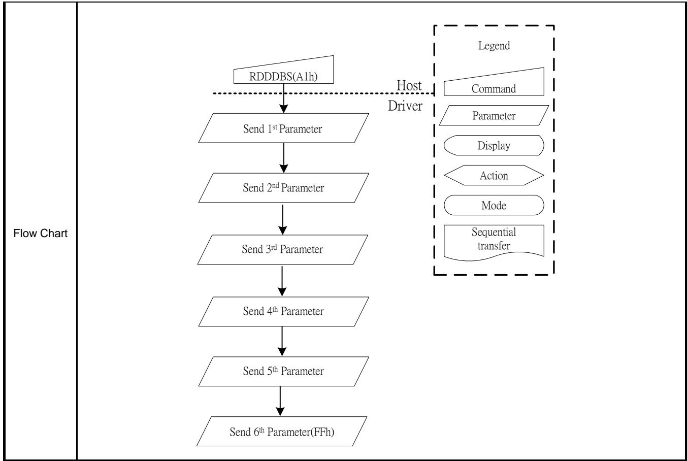

12.2.57 RDDDBC (A8h/A800h): Read DDB Continue  

<table><tr><td>A8H</td><td colspan="11">RDDDBC</td><td></td></tr><tr><td rowspan="2">Inst / Para</td><td rowspan="2">R/W</td><td colspan="2">Address</td><td rowspan="2">D15-8</td><td rowspan="2">D7</td><td rowspan="2">D6</td><td rowspan="2">D5</td><td rowspan="2">D4</td><td rowspan="2">D3</td><td rowspan="2">D2</td><td rowspan="2">D1</td><td rowspan="2">D0</td></tr><tr><td>MIPI</td><td>SPI-16</td></tr><tr><td rowspan="5">RDDDBC</td><td rowspan="5">R</td><td rowspan="5">A8h</td><td>A800h</td><td rowspan="5">X</td><td colspan="8">SID[15:8]</td></tr><tr><td>A801h</td><td colspan="8">SID[7:0]</td></tr><tr><td>A802h</td><td colspan="8">MID[15:8]</td></tr><tr><td>A803h</td><td colspan="8">MID[7:0]</td></tr><tr><td>A804h</td><td colspan="8">8&#x27;hff</td></tr><tr><td>Description</td><td colspan="12">This command is used to read the supplier&#x27;s identification and revision information from the point where RDDDBS (A1h) was interrupted by another command.</td></tr><tr><td>Restriction</td><td colspan="12"></td></tr><tr><td rowspan="35">Register availability</td><td rowspan="35" colspan="12"></td></tr><tr></tr><tr></tr><tr></tr><tr></tr><tr></tr><tr></tr><tr></tr><tr></tr><tr></tr><tr></tr><tr></tr><tr></tr><tr></tr><tr></tr><tr></tr><tr></tr><tr></tr><tr></tr><tr></tr><tr></tr><tr></tr><tr></tr><tr></tr><tr></tr><tr></tr><tr></tr><tr></tr><tr><td colspan="6">Legend</td></tr><tr><td colspan="6">Command</td></tr><tr><td colspan="6">Parameter</td></tr><tr><td colspan="6">Display</td></tr><tr><td colspan="6">Action</td></tr><tr><td colspan="6">Mode</td></tr><tr><td colspan="6">Sequential transfer</td></tr></table>

12.2.58 RDFCS (AAh/AA00h): Read First Checksum  

<table><tr><td>AAH</td><td colspan="11">RDFCS</td><td></td></tr><tr><td rowspan="2">Inst / Para</td><td rowspan="2">R/W</td><td colspan="2">Address</td><td rowspan="2">D15-8</td><td rowspan="2">D7</td><td rowspan="2">D6</td><td rowspan="2">D5</td><td rowspan="2">D4</td><td rowspan="2">D3</td><td rowspan="2">D2</td><td rowspan="2">D1</td><td rowspan="2">D0</td></tr><tr><td>MIPI</td><td>SPI-16</td></tr><tr><td>RDFCS</td><td>R</td><td>7Dh</td><td>7D00h</td><td>X</td><td colspan="8">FCS[7:0]</td></tr><tr><td>Description</td><td colspan="12">This command reads the first checksum calculated from registers of the User&#x27;s area and the Frame Memory after the write access to those registers and/or Frame Memory has been done.</td></tr><tr><td>Restriction</td><td colspan="12">Only the 2nd parameter is sent on the DSI; the 1st parameter is not sent.</td></tr><tr><td rowspan="6">Register availability</td><td rowspan="6"></td><td colspan="5">Status</td><td colspan="6">Availability</td></tr><tr><td colspan="5">Normal Mode On, Idle Mode Off, Sleep Out</td><td colspan="6">Yes</td></tr><tr><td colspan="5">Normal Mode On, Idle Mode On, Sleep Out</td><td colspan="6">Yes</td></tr><tr><td colspan="5">Partial Mode On, Idle Mode Off, Sleep Out</td><td colspan="6">Yes</td></tr><tr><td colspan="5">Partial Mode On, Idle Mode On, Sleep Out</td><td colspan="6">Yes</td></tr><tr><td colspan="5">Sleep In</td><td colspan="6">Yes</td></tr><tr><td rowspan="4">Default</td><td rowspan="4"></td><td colspan="4">Status</td><td colspan="7">Default Value (D7 to D0)</td></tr><tr><td colspan="4">Power On Sequence</td><td colspan="7">78h</td></tr><tr><td colspan="4">S/W Reset</td><td colspan="7">78h</td></tr><tr><td colspan="4">H/W Reset</td><td colspan="7">78h</td></tr><tr><td>Flow Chart</td><td></td><td colspan="4">RDFCS(AAh)Send 1stParameterSend FCS[7:0]</td><td>Host Driver</td><td colspan="6">LegendCommandParameterDisplayActionModeSequential transfer</td></tr></table>

12.2.59 RDCCS (AFh/AF00h): Read Continue Checksum  

<table><tr><td>AFH</td><td colspan="11">RDCCS</td><td></td></tr><tr><td rowspan="2">Inst / Para</td><td rowspan="2">R/W</td><td colspan="2">Address</td><td rowspan="2">D15-8</td><td rowspan="2">D7</td><td rowspan="2">D6</td><td rowspan="2">D5</td><td rowspan="2">D4</td><td rowspan="2">D3</td><td rowspan="2">D2</td><td rowspan="2">D1</td><td rowspan="2">D0</td></tr><tr><td>MIPI</td><td>SPI-16</td></tr><tr><td>RDCCS</td><td>R</td><td>AFh</td><td>AF00h</td><td>X</td><td colspan="8">CCS[7:0]</td></tr><tr><td>Description</td><td colspan="12">This command reads the following checksum that is calculated continuously after the first checksum from registers of the User&#x27;s area and the Frame Memory after the write access to those registers and/or Frame Memory is done.</td></tr><tr><td>Restriction</td><td colspan="12">It is necessary to wait 300ms after the last write access to registers of the User&#x27;s area before this checksum value can be read the first time.
Only the 2nd parameter is sent on the DSI; the 1st parameter is not sent.</td></tr><tr><td rowspan="6">Register availability</td><td rowspan="6"></td><td colspan="5">Status</td><td colspan="6">Availability</td></tr><tr><td colspan="5">Normal Mode On, Idle Mode Off, Sleep Out</td><td colspan="6">Yes</td></tr><tr><td colspan="5">Normal Mode On, Idle Mode On, Sleep Out</td><td colspan="6">Yes</td></tr><tr><td colspan="5">Partial Mode On, Idle Mode Off, Sleep Out</td><td colspan="6">Yes</td></tr><tr><td colspan="5">Partial Mode On, Idle Mode On, Sleep Out</td><td colspan="6">Yes</td></tr><tr><td colspan="5">Sleep In</td><td colspan="6">Yes</td></tr><tr><td rowspan="4">Default</td><td rowspan="4"></td><td colspan="4">Status</td><td colspan="7">Default Value (D7 to D0)</td></tr><tr><td colspan="4">Power On Sequence</td><td colspan="7">78h</td></tr><tr><td colspan="4">S/W Reset</td><td colspan="7">78h</td></tr><tr><td colspan="4">H/W Reset</td><td colspan="7">78h</td></tr><tr><td>Flow Chart</td><td></td><td colspan="4">RDCCS(AFh) 
Send 1stParameter 
Send CCS[7:0]</td><td>Host 
Driver</td><td colspan="6">Legend 
Command 
Parameter 
Display 
Action 
Mode 
Sequential 
transfer</td></tr></table>

12.2.60 RDID1 (DAh/DA00h): Read ID1  

<table><tr><td>DAH</td><td colspan="11">RDID1</td><td></td></tr><tr><td rowspan="2">Inst / Para</td><td rowspan="2">R/W</td><td colspan="2">Address</td><td rowspan="2">D15-8</td><td rowspan="2">D7</td><td rowspan="2">D6</td><td rowspan="2">D5</td><td rowspan="2">D4</td><td rowspan="2">D3</td><td rowspan="2">D2</td><td rowspan="2">D1</td><td rowspan="2">D0</td></tr><tr><td>MIPI</td><td>SPI-16</td></tr><tr><td>RDID1</td><td>R</td><td>DAh</td><td>DA00h</td><td>X</td><td colspan="8">ID1[7:0]</td></tr><tr><td>Description</td><td colspan="12">-This read byte identifies the LCD module&#x27;s manufacturer.</td></tr><tr><td>Restriction</td><td colspan="12"></td></tr><tr><td rowspan="8">Register availability</td><td colspan="12"></td></tr><tr><td colspan="12"></td></tr><tr><td colspan="12"></td></tr><tr><td colspan="12"></td></tr><tr><td colspan="12"></td></tr><tr><td colspan="12"></td></tr><tr><td colspan="12"></td></tr><tr><td colspan="9"></td><td></td><td></td><td></td></tr><tr><td rowspan="6">Default</td><td colspan="9"></td><td></td><td></td><td></td></tr><tr><td colspan="9"></td><td></td><td></td><td></td></tr><tr><td colspan="9"></td><td></td><td></td><td></td></tr><tr><td colspan="9"></td><td></td><td></td><td></td></tr><tr><td colspan="9"></td><td></td><td></td><td></td></tr><tr><td colspan="9"></td><td></td><td></td><td></td></tr><tr><td rowspan="8">Flow Chart</td><td colspan="9"></td><td></td><td></td><td></td></tr><tr><td colspan="9"></td><td></td><td></td><td></td></tr><tr><td colspan="9"></td><td></td><td></td><td></td></tr><tr><td colspan="9"></td><td></td><td></td><td></td></tr><tr><td colspan="9"></td><td></td><td></td><td></td></tr><tr><td colspan="9"></td><td></td><td></td><td></td></tr><tr><td colspan="9"></td><td></td><td></td><td></td></tr><tr><td colspan="9"></td><td colspan="3">Sequential transfer</td></tr></table>

12.2.61 RDID2 (DBh/DB00h): Read ID2  

<table><tr><td>DBH</td><td colspan="11">RDID2</td><td></td></tr><tr><td rowspan="2">Inst / Para</td><td rowspan="2">R/W</td><td colspan="2">Address</td><td rowspan="2">D15-8</td><td rowspan="2">D7</td><td rowspan="2">D6</td><td rowspan="2">D5</td><td rowspan="2">D4</td><td rowspan="2">D3</td><td rowspan="2">D2</td><td rowspan="2">D1</td><td rowspan="2">D0</td></tr><tr><td>MIPI</td><td>SPI-16</td></tr><tr><td>RDID2</td><td>R</td><td>DBh</td><td>DB00h</td><td>X</td><td colspan="8">ID2[7:0]</td></tr><tr><td>Description</td><td colspan="12">-This read byte identifies the LCD module&#x27;s manufacturer.</td></tr><tr><td>Restriction</td><td colspan="12"></td></tr><tr><td rowspan="8">Register availability</td><td colspan="12"></td></tr><tr><td colspan="12"></td></tr><tr><td colspan="12"></td></tr><tr><td colspan="12"></td></tr><tr><td colspan="12"></td></tr><tr><td colspan="12"></td></tr><tr><td colspan="12"></td></tr><tr><td colspan="9"></td><td></td><td></td><td></td></tr><tr><td rowspan="6">Default</td><td colspan="9"></td><td></td><td></td><td></td></tr><tr><td colspan="9"></td><td></td><td></td><td></td></tr><tr><td colspan="9"></td><td></td><td></td><td></td></tr><tr><td colspan="9"></td><td></td><td></td><td></td></tr><tr><td colspan="9"></td><td></td><td></td><td></td></tr><tr><td colspan="9"></td><td></td><td></td><td></td></tr><tr><td rowspan="8">Flow Chart</td><td colspan="9"></td><td></td><td></td><td></td></tr><tr><td colspan="9"></td><td></td><td></td><td></td></tr><tr><td colspan="9"></td><td></td><td></td><td></td></tr><tr><td colspan="9"></td><td></td><td></td><td></td></tr><tr><td colspan="9"></td><td></td><td></td><td></td></tr><tr><td colspan="9"></td><td></td><td></td><td></td></tr><tr><td colspan="9"></td><td></td><td></td><td></td></tr><tr><td colspan="9"></td><td colspan="3">Sequential transfer</td></tr></table>

12.2.62 RDID3 (DCh/DC00h): Read ID3  

<table><tr><td>DCH</td><td colspan="11">RDID3</td><td></td></tr><tr><td rowspan="2">Inst / Para</td><td rowspan="2">R/W</td><td colspan="2">Address</td><td rowspan="2">D15-8</td><td rowspan="2">D7</td><td rowspan="2">D6</td><td rowspan="2">D5</td><td rowspan="2">D4</td><td rowspan="2">D3</td><td rowspan="2">D2</td><td rowspan="2">D1</td><td rowspan="2">D0</td></tr><tr><td>MIPI</td><td>SPI-16</td></tr><tr><td>RDID3</td><td>R</td><td>DCh</td><td>DC00h</td><td>X</td><td colspan="8">ID3[7:0]</td></tr><tr><td>Description</td><td colspan="12">-This read byte identifies the LCD module&#x27;s manufacturer.</td></tr><tr><td>Restriction</td><td colspan="12"></td></tr><tr><td rowspan="8">Register availability</td><td colspan="12"></td></tr><tr><td colspan="12"></td></tr><tr><td colspan="12"></td></tr><tr><td colspan="12"></td></tr><tr><td colspan="12"></td></tr><tr><td colspan="12"></td></tr><tr><td colspan="12"></td></tr><tr><td colspan="9"></td><td></td><td></td><td></td></tr><tr><td rowspan="6">Default</td><td colspan="9"></td><td></td><td></td><td></td></tr><tr><td colspan="9"></td><td></td><td></td><td></td></tr><tr><td colspan="9"></td><td></td><td></td><td></td></tr><tr><td colspan="9"></td><td></td><td></td><td></td></tr><tr><td colspan="9"></td><td></td><td></td><td></td></tr><tr><td colspan="9"></td><td></td><td></td><td></td></tr><tr><td rowspan="8">Flow Chart</td><td colspan="9"></td><td></td><td></td><td></td></tr><tr><td colspan="9"></td><td></td><td></td><td></td></tr><tr><td colspan="9"></td><td></td><td></td><td></td></tr><tr><td colspan="9"></td><td></td><td></td><td></td></tr><tr><td colspan="9"></td><td></td><td></td><td></td></tr><tr><td colspan="9"></td><td></td><td></td><td></td></tr><tr><td colspan="9"></td><td></td><td></td><td></td></tr><tr><td colspan="9"></td><td colspan="3">Sequential transfer</td></tr></table>

12.3 System Function Command Table 2  

<table><tr><td rowspan="2">Instruction</td><td colspan="2">Address</td><td rowspan="2">R/W</td><td rowspan="2">PNUM</td><td rowspan="2">D7</td><td rowspan="2">D6</td><td rowspan="2">D5</td><td rowspan="2">D4</td><td rowspan="2">D3</td><td rowspan="2">D2</td><td rowspan="2">D1</td><td rowspan="2">D0</td><td rowspan="2">Function</td></tr><tr><td>MIPI</td><td>SPI-16</td></tr><tr><td rowspan="5">CN2BKxSEL</td><td rowspan="5">FFh</td><td>FF00h</td><td rowspan="5">W</td><td rowspan="5">5</td><td>0</td><td>1</td><td>1</td><td>1</td><td>0</td><td>1</td><td>1</td><td>1</td><td rowspan="5">Command2_BKx Function Selection</td></tr><tr><td>FF01h</td><td>0</td><td>0</td><td>0</td><td>0</td><td>0</td><td>0</td><td>0</td><td>1</td></tr><tr><td>FF02h</td><td>--</td><td>--</td><td>--</td><td>--</td><td>--</td><td>--</td><td>--</td><td>--</td></tr><tr><td>FF03h</td><td>--</td><td>--</td><td>--</td><td>--</td><td>--</td><td>--</td><td>--</td><td>--</td></tr><tr><td>FF04h</td><td>0</td><td>0</td><td>0</td><td>CN2</td><td>0</td><td>0</td><td>0</td><td>BKSEL</td></tr></table>

Command2_BK0  

<table><tr><td rowspan="2">Instruction</td><td colspan="2">Address</td><td rowspan="2">R/W/C</td><td rowspan="2">PNUM</td><td rowspan="2">D7</td><td rowspan="2">D6</td><td rowspan="2">D5</td><td rowspan="2">D4</td><td rowspan="2">D3</td><td rowspan="2">D2</td><td rowspan="2">D1</td><td rowspan="2">D0</td><td rowspan="2">Function</td></tr><tr><td>MIPI</td><td>SPI-16</td></tr><tr><td rowspan="16">PVGAMCTRL</td><td rowspan="16">B0h</td><td>B000h</td><td rowspan="16">W</td><td rowspan="16">16</td><td colspan="2">AJ0P[1:0]</td><td>--</td><td>--</td><td colspan="4">VC0P[3:0]</td><td rowspan="16">Positive Voltage Gamma Control</td></tr><tr><td>B001h</td><td colspan="2">AJ1P[1:0]</td><td colspan="6">VC4P[5:0]</td></tr><tr><td>B002h</td><td colspan="2">AJ2P[1:0]</td><td colspan="6">VC8P[5:0]</td></tr><tr><td>B003h</td><td>--</td><td>--</td><td>--</td><td colspan="5">VC16P[4:0]</td></tr><tr><td>B004h</td><td colspan="2">AJ3P[1:0]</td><td>--</td><td colspan="5">VC24P[4:0]</td></tr><tr><td>B005h</td><td>--</td><td>--</td><td>--</td><td colspan="5">VC52P[3:0]</td></tr><tr><td>B006h</td><td>--</td><td>--</td><td colspan="6">VC80P[5:0]</td></tr><tr><td>B007h</td><td>--</td><td>--</td><td>--</td><td colspan="5">VC108P[3:0]</td></tr><tr><td>B008h</td><td>--</td><td>--</td><td>--</td><td colspan="5">VC147P[3:0]</td></tr><tr><td>B009h</td><td>--</td><td>--</td><td colspan="6">VC175P[5:0]</td></tr><tr><td>B00Ah</td><td>--</td><td>--</td><td>--</td><td colspan="5">VC203P[3:0]</td></tr><tr><td>B00Bh</td><td colspan="2">AJ4P[1:0]</td><td>--</td><td colspan="5">VC231P[4:0]</td></tr><tr><td>B00Ch</td><td>--</td><td>--</td><td>--</td><td colspan="5">VC239P[4:0]</td></tr><tr><td>B00Dh</td><td colspan="2">AJ5P[1:0]</td><td colspan="6">VC247P[5:0]</td></tr><tr><td>B00Eh</td><td colspan="2">AJ6P[1:0]</td><td colspan="6">VC251P[5:0]</td></tr><tr><td>B00Fh</td><td colspan="2">AJ7P[1:0]</td><td>--</td><td colspan="5">VC255P[4:0]</td></tr><tr><td rowspan="9">NVGAMCTRL</td><td rowspan="9">B1h</td><td>B100h</td><td rowspan="9">W</td><td rowspan="9">16</td><td colspan="2">AJ0N[1:0]</td><td>--</td><td>--</td><td colspan="4">VCON[3:0]</td><td rowspan="9">Negative Voltage Gamma Control</td></tr><tr><td>B101h</td><td colspan="2">AJ1N[1:0]</td><td colspan="6">VC4N[5:0]</td></tr><tr><td>B102h</td><td colspan="2">AJ2N[1:0]</td><td colspan="6">AJ2P[1:0]</td></tr><tr><td>B103h</td><td>--</td><td>--</td><td>--</td><td colspan="5">VC16N[4:0]</td></tr><tr><td>B104h</td><td>--</td><td>--</td><td>--</td><td colspan="5">VC24N[4:0]</td></tr><tr><td>B105h</td><td>--</td><td>--</td><td>--</td><td colspan="5">VC52N[3:0]</td></tr><tr><td>B106h</td><td>--</td><td>--</td><td colspan="6">VC80N[5:0]</td></tr><tr><td>B107h</td><td>--</td><td>--</td><td>--</td><td colspan="5">VC108N[3:0]</td></tr><tr><td>B108h</td><td>--</td><td>--</td><td>--</td><td colspan="5">VC147N[3:0]</td></tr><tr><td rowspan="7"></td><td rowspan="7">B109h</td><td rowspan="7">B109h</td><td rowspan="7">W</td><td rowspan="7">130</td><td>--</td><td>--</td><td colspan="6">VC175N[5:0]</td><td rowspan="7"></td></tr><tr><td>--</td><td>--</td><td>--</td><td>--</td><td colspan="4">VC203N[3:0]</td></tr><tr><td colspan="2">AJ4N[1:0]</td><td>--</td><td colspan="5">VC231N[4:0]</td></tr><tr><td>--</td><td>--</td><td>--</td><td colspan="5">VC239N[4:0]</td></tr><tr><td colspan="2">AJ5N[1:0]</td><td colspan="6">AJ5P[1:0]</td></tr><tr><td colspan="2">AJ6N[1:0]</td><td colspan="6">AJ6P[1:0]</td></tr><tr><td colspan="2">AJ7N[1:0]</td><td>--</td><td colspan="5">VC255N[4:0]</td></tr><tr><td>DGMEN</td><td>B8</td><td>B800h</td><td>W</td><td>1</td><td>0</td><td>0</td><td>0</td><td>DGM_ON</td><td>0</td><td>0</td><td>0</td><td>0</td><td>Digital Gamma Enable</td></tr><tr><td rowspan="18">DGMLUTR</td><td rowspan="18">B9</td><td rowspan="18">B900</td><td rowspan="18">W</td><td rowspan="18">130</td><td colspan="8">P0[7:0]</td><td rowspan="18">Digital Gamma Look-up Table for Red</td></tr><tr><td>--</td><td>--</td><td>--</td><td>--</td><td>--</td><td>--</td><td colspan="2">P0[9:8]</td></tr><tr><td>--</td><td>--</td><td>--</td><td>--</td><td>--</td><td>--</td><td colspan="2">P4[1:0]</td></tr><tr><td>--</td><td>--</td><td>--</td><td>--</td><td>--</td><td>--</td><td>--</td><td colspan="1">--</td></tr><tr><td colspan="8">P8[7:0]</td></tr><tr><td>--</td><td>--</td><td>--</td><td>--</td><td>--</td><td>--</td><td colspan="2">P8[9:8]</td></tr><tr><td>--</td><td>--</td><td>--</td><td>--</td><td>--</td><td>--</td><td colspan="2">P12[1:0]</td></tr><tr><td>--</td><td>--</td><td>--</td><td>--</td><td>--</td><td>--</td><td>--</td><td colspan="1">--</td></tr><tr><td colspan="8">:</td></tr><tr><td colspan="8">:</td></tr><tr><td colspan="8">:</td></tr><tr><td colspan="8">:</td></tr><tr><td colspan="8">P248[7:0]</td></tr><tr><td>--</td><td>--</td><td>--</td><td>--</td><td>--</td><td>--</td><td colspan="2">P248[9:8]</td></tr><tr><td>--</td><td>--</td><td>--</td><td>--</td><td>--</td><td>--</td><td colspan="2">P252[1:0]</td></tr><tr><td>--</td><td>--</td><td>--</td><td>--</td><td>--</td><td>--</td><td>--</td><td colspan="1">--</td></tr><tr><td colspan="8">P255[7:0]</td></tr><tr><td>--</td><td>--</td><td>--</td><td>--</td><td>--</td><td>--</td><td colspan="2">P255[9:8]</td></tr><tr><td rowspan="10">DGMLUTB</td><td rowspan="10">BA</td><td rowspan="10">BA00</td><td rowspan="10">W</td><td rowspan="10">130</td><td colspan="8">P0[7:0]</td><td rowspan="10">Digital Gamma Look-up Table for Blue</td></tr><tr><td>--</td><td>--</td><td>--</td><td>--</td><td>--</td><td>--</td><td colspan="2">P0[9:8]</td></tr><tr><td>--</td><td>--</td><td>--</td><td>--</td><td>--</td><td>--</td><td colspan="2">P4[1:0]</td></tr><tr><td>--</td><td>--</td><td>--</td><td>--</td><td>--</td><td>--</td><td>--</td><td colspan="1">--</td></tr><tr><td colspan="3">P8[7:0]</td><td colspan="5">:</td></tr><tr><td>--</td><td>--</td><td>--</td><td>--</td><td>--</td><td>--</td><td colspan="2">P8[9:8]</td></tr><tr><td>--</td><td>--</td><td>--</td><td>--</td><td>--</td><td>--</td><td colspan="2">P12[1:0]</td></tr><tr><td>--</td><td>--</td><td>--</td><td>--</td><td>--</td><td>--</td><td>--</td><td colspan="1">--</td></tr><tr><td colspan="3">:</td><td colspan="5">:</td></tr><tr><td colspan="3">:</td><td colspan="5">:</td></tr><tr><td rowspan="6"></td><td rowspan="6"></td><td>BA7C</td><td rowspan="6"></td><td rowspan="6"></td><td colspan="8">P248[7:0]</td><td rowspan="6"></td></tr><tr><td>BA7D</td><td>--</td><td>--</td><td>--</td><td>--</td><td>--</td><td>--</td><td colspan="2">P248[9:8]</td></tr><tr><td>BA7E</td><td>--</td><td>--</td><td>--</td><td>--</td><td>--</td><td>--</td><td colspan="2">P252[1:0]</td></tr><tr><td>BA7F</td><td>--</td><td>--</td><td>--</td><td>--</td><td>--</td><td>--</td><td>--</td><td colspan="1">--</td></tr><tr><td>BA80</td><td colspan="8">P255[7:0]</td></tr><tr><td>BA81</td><td>--</td><td>--</td><td>--</td><td>--</td><td>--</td><td>--</td><td colspan="2">P255[9:8]</td></tr><tr><td>PWM_CLK</td><td>BC</td><td>BC00</td><td>W</td><td>1</td><td>0</td><td>0</td><td>0</td><td>1</td><td>1</td><td colspan="3">Pwm_clk_sel[2:0]</td><td>PWM CLK select</td></tr><tr><td rowspan="2">LNESET</td><td rowspan="2">C0</td><td>C000</td><td rowspan="2">W</td><td>2</td><td>LDE_EN</td><td colspan="7">Line[6:0]</td><td rowspan="2">Display Line setting</td></tr><tr><td>C001</td><td>2</td><td>--</td><td>--</td><td>--</td><td>--</td><td>--</td><td>--</td><td colspan="2">Line_Delta[1:0]</td></tr><tr><td rowspan="2">PORCTRL</td><td rowspan="2">C1</td><td>C100</td><td rowspan="2">W</td><td>2</td><td colspan="8">VBP[7:0]</td><td rowspan="2">Porch control</td></tr><tr><td>C101</td><td>2</td><td colspan="8">VFP[7:0]</td></tr><tr><td rowspan="2">INVSEL</td><td rowspan="2">C2</td><td>C200</td><td rowspan="2">W</td><td>2</td><td>0</td><td>0</td><td>1</td><td>1</td><td>0</td><td colspan="3">NLINV[2:0]</td><td rowspan="2">Inversion selection &amp; Frame Rate Control</td></tr><tr><td>C201</td><td>2</td><td>--</td><td>--</td><td>--</td><td colspan="5">RTNI[4:0]</td></tr><tr><td rowspan="3">RGBCTRL</td><td rowspan="3">C3</td><td>C300</td><td rowspan="3">W</td><td>3</td><td>DE/HV</td><td>--</td><td>--</td><td>--</td><td>VSP</td><td>HSP</td><td>DP</td><td>EP</td><td rowspan="3">RGB control</td></tr><tr><td>C301</td><td>3</td><td colspan="8">HBP_HVRGB[7:0]</td></tr><tr><td>C302</td><td>3</td><td colspan="8">VBP_HVRGB[7:0]</td></tr><tr><td rowspan="4">PARCTRL</td><td rowspan="4">C5</td><td>C500</td><td rowspan="4">W</td><td>4</td><td colspan="8">PTSA[7:0]</td><td rowspan="4">Partial mode Control</td></tr><tr><td>C501</td><td>4</td><td>--</td><td>--</td><td>--</td><td>--</td><td>--</td><td>--</td><td colspan="2">PTSA[9:8]</td></tr><tr><td>C502</td><td>4</td><td colspan="8">PTEA[7:0]</td></tr><tr><td>C503</td><td>4</td><td>--</td><td>--</td><td>--</td><td>--</td><td>--</td><td>--</td><td colspan="2">PTEA[9:8]</td></tr><tr><td>SDIR</td><td>C7</td><td>C700</td><td>W</td><td>1</td><td>--</td><td>--</td><td>--</td><td>--</td><td>--</td><td>SS</td><td>--</td><td>--</td><td>Source direction control</td></tr><tr><td>PDOTSET</td><td>C8</td><td>C800</td><td>W</td><td>1</td><td>Z_EN</td><td>Z_SDM1S</td><td>Z_GltoR</td><td>--</td><td>--</td><td>--</td><td>--</td><td>--</td><td>Pesudo-Dot inversion driving setting</td></tr><tr><td>COLCTRL</td><td>CD</td><td>CD00</td><td>W</td><td>1</td><td>--</td><td>--</td><td>INV_LED PWM</td><td>INV_LED ON</td><td>MDT</td><td colspan="3">EPF[2:0]</td><td>Color Control</td></tr><tr><td>SSCTRL</td><td>CE</td><td>CE00</td><td>W</td><td>1</td><td>DSSE</td><td>0</td><td colspan="2">DSSRG[1:0]</td><td>0</td><td>1</td><td>0</td><td>0</td><td>Spread spectrum Control</td></tr><tr><td>SECTRL</td><td>E0</td><td>E000</td><td>W</td><td>1</td><td>--</td><td>--</td><td>--</td><td>SRE</td><td colspan="4">SRE_alpha[3:0]</td><td>Sunlight Readable Enhancement</td></tr><tr><td>NRCTRL</td><td>E1</td><td>E100</td><td>W</td><td>1</td><td>--</td><td>--</td><td>--</td><td>NRE</td><td>--</td><td>--</td><td colspan="2">NR_mel[1:0]</td><td>Noise Reduce Control</td></tr><tr><td>SECTRL</td><td>E2</td><td>E200</td><td>W</td><td>1</td><td>--</td><td>--</td><td>--</td><td>SE</td><td colspan="4">Y_gain[3:0]</td><td>Sharpness Control</td></tr><tr><td>CCCTRL</td><td>E3</td><td>E300</td><td>W</td><td>1</td><td>--</td><td>--</td><td>--</td><td>--</td><td>--</td><td>--</td><td>--</td><td>CCE</td><td>Color Calibration Control</td></tr><tr><td>SKCTRL</td><td>E4</td><td>E400</td><td>W</td><td>1</td><td>--</td><td>--</td><td>--</td><td>SKE</td><td>--</td><td>--</td><td colspan="2">Skin_ce_mid[1:0]</td><td>Skin Tone Preservation Control</td></tr><tr><td>NVMSETE</td><td>EA</td><td>EA00</td><td>W</td><td>1</td><td>--</td><td>--</td><td>--</td><td>--</td><td>--</td><td>--</td><td>--</td><td>ADEN</td><td>NVM address Setting Enable</td></tr><tr><td>CABCCTRL</td><td>EE</td><td>EE00</td><td>W</td><td>1</td><td>--</td><td>--</td><td>--</td><td>LEDPWR SEL</td><td>--</td><td>--</td><td>--</td><td>LED_EN</td><td>CABC Control</td></tr></table>

Command2_BK1  

<table><tr><td rowspan="2">Instruction</td><td colspan="2">Address</td><td rowspan="2">R/W/C</td><td rowspan="2">PNUM</td><td rowspan="2">D7</td><td rowspan="2">D6</td><td rowspan="2">D5</td><td rowspan="2">D4</td><td rowspan="2">D3</td><td rowspan="2">D2</td><td rowspan="2">D1</td><td rowspan="2">D0</td><td rowspan="2">Function</td></tr><tr><td>MIPI</td><td>SPI-16</td></tr><tr><td>VRHS</td><td>B0</td><td>B000</td><td>W</td><td>1</td><td colspan="8">VRHA[7:0]</td><td>Vop amplitude setting</td></tr><tr><td>VCOMS</td><td>B1</td><td>B100</td><td>W</td><td>1</td><td colspan="8">VCOM[7:0]</td><td>VCOM amplitude setting</td></tr><tr><td>VGHSS</td><td>B2</td><td>B200</td><td>W</td><td>1</td><td>--</td><td>--</td><td>--</td><td>--</td><td colspan="4">VGHSS[3:0]</td><td>VGH Voltage setting</td></tr><tr><td>TESCMD</td><td>B3</td><td>B300</td><td>W</td><td>1</td><td>1</td><td>--</td><td>--</td><td>--</td><td>--</td><td>0</td><td>0</td><td>0</td><td>TEST Command Setting</td></tr><tr><td>VGLS</td><td>B5</td><td>B500</td><td>W</td><td>1</td><td>0</td><td>1</td><td>--</td><td>--</td><td colspan="4">VGLS[3:0]</td><td>VGL Voltage setting</td></tr><tr><td>VRHDV</td><td>B6</td><td>B600</td><td>W</td><td>1</td><td>0</td><td colspan="7">VRH_DV[6:0]</td><td>VRH_DV Voltage setting</td></tr><tr><td>PWCTRL1</td><td>B7</td><td>B700</td><td>W</td><td>1</td><td colspan="2">AP[1:0]</td><td>--</td><td>--</td><td colspan="2">APIS[1:0]</td><td colspan="2">APOS[1:0]</td><td>Power Control 1</td></tr><tr><td>PWCTRL2</td><td>B8</td><td>B800</td><td>W</td><td>1</td><td>--</td><td>--</td><td colspan="2">AVDD[1:0]</td><td>--</td><td>--</td><td colspan="2">AVCL[1:0]</td><td>Power Control 2</td></tr><tr><td>PWCTRL3</td><td>B9</td><td>B900</td><td>W</td><td>1</td><td>--</td><td>--</td><td colspan="2">SVPO_PUM</td><td>--</td><td>--</td><td colspan="2">SVNO_PUM</td><td>Power Control 3</td></tr><tr><td>PCLKS 1</td><td>BA</td><td>BA00</td><td>W</td><td>1</td><td>--</td><td>--</td><td colspan="2">STP4CKS[1:0]</td><td>--</td><td>--</td><td colspan="2">STP1CKS[1:0]</td><td>Power pumping clk selection 1</td></tr><tr><td>PCLKS 2</td><td>BB</td><td>BB00</td><td>W</td><td>1</td><td>--</td><td>--</td><td>--</td><td>--</td><td>--</td><td>--</td><td colspan="2">SBSTCKS[1:0]</td><td>Power pumping clk selection 2</td></tr><tr><td>PCLKS 3</td><td>BC</td><td>BC00</td><td>W</td><td>1</td><td>--</td><td>--</td><td colspan="2">STP3CKS[1:0]</td><td colspan="2">STP2PCKS[1:0]</td><td colspan="2">STP2SCKS[1:0]</td><td>Power pumping clk selection 3</td></tr><tr><td>PDR1</td><td>C1</td><td>C100</td><td>W</td><td>1</td><td>0</td><td>1</td><td>1</td><td>1</td><td colspan="4">T2D</td><td>Source pre.drive timing set1</td></tr><tr><td>PDR2</td><td>C2</td><td>C200</td><td>W</td><td>1</td><td>0</td><td>1</td><td>1</td><td>1</td><td colspan="4">T3D</td><td>Source preDrive timing set2</td></tr><tr><td>MIPISET 1</td><td>D0</td><td>D000</td><td>W</td><td>1</td><td>1</td><td>0</td><td>0</td><td>0</td><td>EOTP_EN</td><td>0</td><td colspan="2">ERR_SEL[1:0]</td><td>MIPI Setting 1</td></tr><tr><td rowspan="4">MIPISET 2</td><td rowspan="4">D1</td><td>D100</td><td rowspan="4">W</td><td rowspan="4">4</td><td colspan="4">Mpc_tlpx1[3:0]</td><td colspan="4">Mpc_tlpx0[3:0]</td><td rowspan="4">MIPI Setting 2</td></tr><tr><td>D101</td><td colspan="4">Mpc_timestamp[3:0]</td><td colspan="4">Mpc_tlpx2[3:0]</td></tr><tr><td>D102</td><td>--</td><td>--</td><td>--</td><td>--</td><td colspan="4">Mpc_ttago[3:0]</td></tr><tr><td>D103</td><td>--</td><td>--</td><td>--</td><td>--</td><td colspan="4">Mpc_ttaget[3:0]</td></tr><tr><td>MIPISET 3</td><td>D2</td><td>D200</td><td>W</td><td>1</td><td>--</td><td>--</td><td>1</td><td>1</td><td colspan="4">PHY_ttasure[3:0]</td><td>MIPI Setting 3</td></tr><tr><td rowspan="2">MIPISET 4</td><td rowspan="2">D3</td><td>D300</td><td rowspan="2">W</td><td rowspan="2">2</td><td>--</td><td>--</td><td>--</td><td>--</td><td>--</td><td colspan="3">PHY_CSK[2:0]</td><td rowspan="2">MIPI Setting 4</td></tr><tr><td>D301</td><td>--</td><td colspan="3">PHY_dsk1[2:0]</td><td>--</td><td colspan="3">PHY_dsk0[2:0]</td></tr></table>

Command2_BK3  

<table><tr><td rowspan="2">Instruction</td><td colspan="2">Address</td><td rowspan="2">R/W/C</td><td rowspan="2">PNUM</td><td rowspan="2">D7</td><td rowspan="2">D6</td><td rowspan="2">D5</td><td rowspan="2">D4</td><td rowspan="2">D3</td><td rowspan="2">D2</td><td rowspan="2">D1</td><td rowspan="2">D0</td><td rowspan="2">Function</td></tr><tr><td>MIPI</td><td>SPI-16</td></tr><tr><td rowspan="4">NVMEN</td><td rowspan="4">C8</td><td>C800</td><td rowspan="4">W</td><td rowspan="4">4</td><td>0</td><td>1</td><td>1</td><td>1</td><td>0</td><td>1</td><td>1</td><td>1</td><td rowspan="4">NVM Enable</td></tr><tr><td>C801</td><td>0</td><td>0</td><td>0</td><td>0</td><td>0</td><td>0</td><td>0</td><td>1</td></tr><tr><td>C802</td><td>1</td><td>1</td><td>1</td><td>0</td><td>1</td><td>1</td><td>1</td><td>0</td></tr><tr><td>C803</td><td>0</td><td>0</td><td>0</td><td>0</td><td>0</td><td>1</td><td>0</td><td>0</td></tr><tr><td rowspan="3">NVMSET</td><td rowspan="3">CA</td><td>CA00</td><td rowspan="3">W</td><td rowspan="3">3</td><td colspan="6">--</td><td colspan="2">PA [9:8]</td><td rowspan="3">NVM manual control Setting</td></tr><tr><td>CA01</td><td colspan="8">PA [7:0]</td></tr><tr><td>CA02</td><td colspan="8">PDIN [7:0]</td></tr><tr><td>PROMACT</td><td>CC</td><td>CC01</td><td>W</td><td>1</td><td>1</td><td>0</td><td>1</td><td>0</td><td>1</td><td>0</td><td>1</td><td>0</td><td>NVM Program Active</td></tr></table>

12.3.1 CND2BKxSEL (FFh/FF00h): Command2 BKx Selection  

<table><tr><td>FFH</td><td colspan="11">CND2BKxSEL</td><td></td></tr><tr><td rowspan="2">Inst / Para</td><td rowspan="2">R/W</td><td colspan="2">Address</td><td rowspan="2">D15-8</td><td rowspan="2">D7</td><td rowspan="2">D6</td><td rowspan="2">D5</td><td rowspan="2">D4</td><td rowspan="2">D3</td><td rowspan="2">D2</td><td rowspan="2">D1</td><td rowspan="2">D0</td></tr><tr><td>MIPI</td><td>SPI-16</td></tr><tr><td rowspan="5">CN2BKxSEL</td><td>W</td><td rowspan="5">FFh</td><td>FF00h</td><td>X</td><td>0</td><td>1</td><td>1</td><td>1</td><td>0</td><td>1</td><td>1</td><td>1</td></tr><tr><td>W</td><td>FF01h</td><td>X</td><td>0</td><td>0</td><td>0</td><td>0</td><td>0</td><td>0</td><td>0</td><td>1</td></tr><tr><td>W</td><td>FF02h</td><td>X</td><td>0</td><td>0</td><td>0</td><td>0</td><td>0</td><td>0</td><td>0</td><td>0</td></tr><tr><td>W</td><td>FF03h</td><td>X</td><td>0</td><td>0</td><td>0</td><td>0</td><td>0</td><td>0</td><td>0</td><td>0</td></tr><tr><td>W</td><td>FF04h</td><td>X</td><td>0</td><td>0</td><td>0</td><td>CN2</td><td>0</td><td>0</td><td>0</td><td>BKxSEL</td></tr><tr><td rowspan="5">Description</td><td colspan="12">This command is used to select the function of Command BK0 or Command BK1.When CN2=&#x27;1&#x27; enable the BK function of Command2, CN2=&#x27;0&#x27; disable the BK function of Command2.</td></tr><tr><td colspan="4"></td><td>BKxSEL</td><td colspan="7">BKx Function Select</td></tr><tr><td colspan="4"></td><td>00h</td><td colspan="7">BK0</td></tr><tr><td colspan="4"></td><td>01h</td><td colspan="7">BK1</td></tr><tr><td colspan="4"></td><td>03h</td><td colspan="7">BK3</td></tr><tr><td>Restriction</td><td colspan="12"></td></tr><tr><td rowspan="8">Register availability</td><td colspan="12"></td></tr><tr><td colspan="12"></td></tr><tr><td colspan="12"></td></tr><tr><td colspan="12"></td></tr><tr><td colspan="12"></td></tr><tr><td colspan="12"></td></tr><tr><td colspan="12"></td></tr><tr><td colspan="9"></td><td></td><td></td><td></td></tr><tr><td rowspan="5">Default</td><td colspan="12"></td></tr><tr><td colspan="12"></td></tr><tr><td colspan="12"></td></tr><tr><td colspan="12"></td></tr><tr><td colspan="12"></td></tr></table>

# 12.3.2 Command 2 BK0 Function

12.3.2.1 PVGAMCTRL (B0h/B000h): Positive Voltage Gamma Control  

<table><tr><td>B0H</td><td colspan="11">PVGAMCTRL (BK0)</td><td></td></tr><tr><td rowspan="2">Inst / Para</td><td rowspan="2">R/W</td><td colspan="2">Address</td><td rowspan="2">D15-8</td><td rowspan="2">D7</td><td rowspan="2">D6</td><td rowspan="2">D5</td><td rowspan="2">D4</td><td rowspan="2">D3</td><td rowspan="2">D2</td><td rowspan="2">D1</td><td rowspan="2">D0</td></tr><tr><td>MIPI</td><td>SPI-16</td></tr><tr><td rowspan="16">PVGAMCTRL</td><td>W</td><td rowspan="16">B0h</td><td>B000h</td><td>X</td><td colspan="2">AJ0P[1:0]</td><td>--</td><td>--</td><td colspan="4">VC0P[3:0]</td></tr><tr><td>W</td><td>B001h</td><td>X</td><td colspan="2">AJ1P[1:0]</td><td colspan="6">VC4P[5:0]</td></tr><tr><td>W</td><td>B002h</td><td>X</td><td colspan="2">AJ2P[1:0]</td><td colspan="6">VC8P[5:0]</td></tr><tr><td>W</td><td>B003h</td><td>X</td><td>--</td><td>--</td><td>--</td><td colspan="5">VC16P[4:0]</td></tr><tr><td>W</td><td>B004h</td><td>X</td><td colspan="2">AJ3P[1:0]</td><td>--</td><td colspan="5">VC24P[4:0]</td></tr><tr><td>W</td><td>B005h</td><td>X</td><td>--</td><td>--</td><td>--</td><td>--</td><td colspan="4">VC52P[3:0]</td></tr><tr><td>W</td><td>B006h</td><td>X</td><td>--</td><td>--</td><td colspan="6">VC80P[5:0]</td></tr><tr><td>W</td><td>B007h</td><td>X</td><td>--</td><td>--</td><td>--</td><td>--</td><td colspan="4">VC108P[3:0]</td></tr><tr><td>W</td><td>B008h</td><td>X</td><td>--</td><td>--</td><td>--</td><td>--</td><td colspan="4">VC147P[3:0]</td></tr><tr><td>W</td><td>B009h</td><td>X</td><td>--</td><td>--</td><td colspan="6">VC175P[5:0]</td></tr><tr><td>W</td><td>B00Ah</td><td>X</td><td>--</td><td>--</td><td>--</td><td>--</td><td colspan="4">VC203P[3:0]</td></tr><tr><td>W</td><td>B00Bh</td><td>X</td><td colspan="2">AJ4P[1:0]</td><td>--</td><td colspan="5">VC231P[4:0]</td></tr><tr><td>W</td><td>B00Ch</td><td>X</td><td>--</td><td>--</td><td>--</td><td colspan="5">VC239P[4:0]</td></tr><tr><td>W</td><td>B00Dh</td><td>X</td><td colspan="2">AJ5P[1:0]</td><td colspan="6">VC247P[5:0]</td></tr><tr><td>W</td><td>B00Eh</td><td>X</td><td colspan="2">AJ6P[1:0]</td><td colspan="6">VC251P[5:0]</td></tr><tr><td>W</td><td>B00Fh</td><td>X</td><td colspan="2">AJ7P[1:0]</td><td>--</td><td colspan="5">VC255P[4:0]</td></tr><tr><td rowspan="15">Description</td><td colspan="12">Please refer to 11.Default value:</td></tr><tr><td colspan="2"></td><td>Value(hex)</td><td colspan="2"></td><td colspan="7">Value(hex)</td></tr><tr><td colspan="2">VC0P[3:0]</td><td>00H</td><td colspan="2">VC239P[4:0]</td><td colspan="7">00H</td></tr><tr><td colspan="2">VC4P[5:0]</td><td>00H</td><td colspan="2">VC247P[5:0]</td><td colspan="7">00H</td></tr><tr><td colspan="2">VC8P[5:0]</td><td>00H</td><td colspan="2">VC251P[5:0]</td><td colspan="7">00H</td></tr><tr><td colspan="2">VC16P[4:0]</td><td>00H</td><td colspan="2">VC255P[4:0]</td><td colspan="7">00H</td></tr><tr><td colspan="2">VC24P[4:0]</td><td>00H</td><td colspan="2">AJ0P[1:0]</td><td colspan="7">00H</td></tr><tr><td colspan="2">VC52P[3:0]</td><td>00H</td><td colspan="2">AJ1P[1:0]</td><td colspan="7">00H</td></tr><tr><td colspan="2">VC80P[5:0]</td><td>00H</td><td colspan="2">AJ2P[1:0]</td><td colspan="7">00H</td></tr><tr><td colspan="2">VC108P[3:0]</td><td>00H</td><td colspan="2">AJ3P[1:0]</td><td colspan="7">00H</td></tr><tr><td colspan="2">VC147P[3:0]</td><td>00H</td><td colspan="2">AJ4P[1:0]</td><td colspan="7">00H</td></tr><tr><td colspan="2">VC175P[5:0]</td><td>00H</td><td colspan="2">AJ5P[1:0]</td><td colspan="7">00H</td></tr><tr><td colspan="2">VC203P[3:0]</td><td>00H</td><td colspan="2">AJ6P[1:0]</td><td colspan="7">00H</td></tr><tr><td colspan="2">VC231P[4:0]</td><td>00H</td><td colspan="2">AJ7P[1:0]</td><td colspan="7">00H</td></tr><tr><td colspan="12"></td></tr><tr><td>Restriction</td><td colspan="12">--</td></tr><tr><td rowspan="7">Register availability</td><td colspan="12"></td></tr><tr><td>Status</td><td colspan="11">Availability</td></tr><tr><td>Normal Mode On, Idle Mode Off, Sleep Out</td><td colspan="11">Yes</td></tr><tr><td>Normal Mode On, Idle Mode On, Sleep Out</td><td colspan="11">Yes</td></tr><tr><td>Partial Mode On, Idle Mode Off, Sleep Out</td><td colspan="11">Yes</td></tr><tr><td>Partial Mode On, Idle Mode On, Sleep Out</td><td colspan="11">Yes</td></tr><tr><td>Sleep In</td><td colspan="11">Yes</td></tr><tr><td rowspan="5">Default</td><td colspan="12"></td></tr><tr><td>Status</td><td colspan="11">Default Value (D7 to D0)</td></tr><tr><td>Power On Sequence</td><td colspan="11">All “0”</td></tr><tr><td>S/W Reset</td><td colspan="11">All “0”</td></tr><tr><td>H/W Reset</td><td colspan="11">All “0”</td></tr></table>

12.3.2.2 NVGAMCTRL (B1h/B100h): Negative Voltage Gamma Control  

<table><tr><td>B1H</td><td colspan="11">NVGAMCTRL (BK0)</td><td></td></tr><tr><td rowspan="2">Inst / Para</td><td rowspan="2">R/W</td><td colspan="2">Address</td><td rowspan="2">D15-8</td><td rowspan="2">D7</td><td rowspan="2">D6</td><td rowspan="2">D5</td><td rowspan="2">D4</td><td rowspan="2">D3</td><td rowspan="2">D2</td><td rowspan="2">D1</td><td rowspan="2">D0</td></tr><tr><td>MIPI</td><td>SPI-16</td></tr><tr><td rowspan="16">NVGAMCTRL</td><td>W</td><td rowspan="16">B0h</td><td>B100h</td><td>X</td><td colspan="2">AJ0N[1:0]</td><td>--</td><td>--</td><td colspan="4">VCON[3:0]</td></tr><tr><td>W</td><td>B101h</td><td>X</td><td colspan="2">AJ1N[1:0]</td><td colspan="6">VC8N[5:0]</td></tr><tr><td>W</td><td>B102h</td><td>X</td><td colspan="2">AJ2N[1:0]</td><td colspan="6">VC8N[5:0]</td></tr><tr><td>W</td><td>B103h</td><td>X</td><td>--</td><td>--</td><td>--</td><td colspan="5">VC16N[4:0]</td></tr><tr><td>W</td><td>B104h</td><td>X</td><td colspan="2">AJ3N[1:0]</td><td>--</td><td colspan="5">VC24N[4:0]</td></tr><tr><td>W</td><td>B105h</td><td>X</td><td>--</td><td>--</td><td>--</td><td>--</td><td colspan="4">VC52N[3:0]</td></tr><tr><td>W</td><td>B106h</td><td>X</td><td>--</td><td>--</td><td colspan="6">VC80N[5:0]</td></tr><tr><td>W</td><td>B107h</td><td>X</td><td>--</td><td>--</td><td>--</td><td>--</td><td colspan="4">VC108N[3:0]</td></tr><tr><td>W</td><td>B108h</td><td>X</td><td>--</td><td>--</td><td>--</td><td>--</td><td colspan="4">VC147N[3:0]</td></tr><tr><td>W</td><td>B109h</td><td>X</td><td>--</td><td>--</td><td colspan="6">VC175N[5:0]</td></tr><tr><td>W</td><td>B10Ah</td><td>X</td><td>--</td><td>--</td><td>--</td><td>--</td><td colspan="4">VC203N[3:0]</td></tr><tr><td>W</td><td>B10Bh</td><td>X</td><td colspan="2">AJ4N[1:0]</td><td>--</td><td colspan="5">VC231N[4:0]</td></tr><tr><td>W</td><td>B10Ch</td><td>X</td><td>--</td><td>--</td><td>--</td><td colspan="5">VC239N[4:0]</td></tr><tr><td>W</td><td>B10Dh</td><td>X</td><td colspan="2">AJ5N[1:0]</td><td colspan="6">VC247N[5:0]</td></tr><tr><td>W</td><td>B10Eh</td><td>X</td><td colspan="2">AJ6N[1:0]</td><td colspan="6">VC251N[5:0]</td></tr><tr><td>W</td><td>B10Fh</td><td>X</td><td colspan="2">AJ7N[1:0]</td><td>--</td><td colspan="5">VC255N[4:0]</td></tr><tr><td rowspan="15">Description</td><td colspan="12">Please refer to 11.Default value:</td></tr><tr><td colspan="2"></td><td>Value(hex)</td><td colspan="3"></td><td colspan="6">Value(hex)</td></tr><tr><td colspan="2">VC0N[3:0]</td><td>00H</td><td colspan="3">VC239N[4:0]</td><td colspan="6">00H</td></tr><tr><td colspan="2">VC4N[5:0]</td><td>00H</td><td colspan="3">VC247N[5:0]</td><td colspan="6">00H</td></tr><tr><td colspan="2">VC8N[5:0]</td><td>00H</td><td colspan="3">VC251N[5:0]</td><td colspan="6">00H</td></tr><tr><td colspan="2">VC16N[4:0]</td><td>00H</td><td colspan="3">VC255N[4:0]</td><td colspan="6">00H</td></tr><tr><td colspan="2">VC24N[4:0]</td><td>00H</td><td colspan="3">AJ0N[1:0]</td><td colspan="6">00H</td></tr><tr><td colspan="2">VC52N[3:0]</td><td>00H</td><td colspan="3">AJ1N[1:0]</td><td colspan="6">00H</td></tr><tr><td colspan="2">VC80N[5:0]</td><td>00H</td><td colspan="3">AJ2N[1:0]</td><td colspan="6">00H</td></tr><tr><td colspan="2">VC108N[3:0]</td><td>00H</td><td colspan="3">AJ3N[1:0]</td><td colspan="6">00H</td></tr><tr><td colspan="2">VC147N[3:0]</td><td>00H</td><td colspan="3">AJ4N[1:0]</td><td colspan="6">00H</td></tr><tr><td colspan="2">VC175N[5:0]</td><td>00H</td><td colspan="3">AJ5N[1:0]</td><td colspan="6">00H</td></tr><tr><td colspan="2">VC203N[3:0]</td><td>00H</td><td colspan="3">AJ6N[1:0]</td><td colspan="6">00H</td></tr><tr><td colspan="2">VC231N[4:0]</td><td>00H</td><td colspan="3">AJ7N[1:0]</td><td colspan="6">00H</td></tr><tr><td colspan="12"></td></tr><tr><td>Restriction</td><td colspan="12">--</td></tr><tr><td rowspan="7">Register availability</td><td colspan="12"></td></tr><tr><td>Status</td><td colspan="11">Availability</td></tr><tr><td>Normal Mode On, Idle Mode Off, Sleep Out</td><td colspan="11">Yes</td></tr><tr><td>Normal Mode On, Idle Mode On, Sleep Out</td><td colspan="11">Yes</td></tr><tr><td>Partial Mode On, Idle Mode Off, Sleep Out</td><td colspan="11">Yes</td></tr><tr><td>Partial Mode On, Idle Mode On, Sleep Out</td><td colspan="11">Yes</td></tr><tr><td>Sleep In</td><td colspan="11">Yes</td></tr><tr><td rowspan="5">Default</td><td colspan="12"></td></tr><tr><td>Status</td><td colspan="11">Default Value (D7 to D0)</td></tr><tr><td>Power On Sequence</td><td colspan="11">All “0”</td></tr><tr><td>S/W Reset</td><td colspan="11">All “0”</td></tr><tr><td>H/W Reset</td><td colspan="11">All “0”</td></tr></table>

12.3.2.3 DGMEN (B8h/B800h): Digital Gamma Enable  

<table><tr><td>B8H</td><td colspan="11">DGMEN (BK0)</td><td></td></tr><tr><td rowspan="2">Inst / Para</td><td rowspan="2">R/W</td><td colspan="2">Address</td><td rowspan="2">D15-8</td><td rowspan="2">D7</td><td rowspan="2">D6</td><td rowspan="2">D5</td><td rowspan="2">D4</td><td rowspan="2">D3</td><td rowspan="2">D2</td><td rowspan="2">D1</td><td rowspan="2">D0</td></tr><tr><td>MIPI</td><td>SPI-16</td></tr><tr><td>DGMEN</td><td>W</td><td>B8h</td><td>B800h</td><td>X</td><td>0</td><td>0</td><td>0</td><td>DGM_ON</td><td>0</td><td>0</td><td>0</td><td>0</td></tr><tr><td>Description</td><td colspan="12">DGM_ON:Digital Gamma EnableDGM_ON=&quot;0&quot;, disable this function.DGM_ON=&quot;1&quot;, enable this function.</td></tr><tr><td>Restriction</td><td colspan="12">--</td></tr><tr><td rowspan="6">Register availability</td><td rowspan="6"></td><td colspan="6">Status</td><td colspan="4">Availability</td><td rowspan="6"></td></tr><tr><td colspan="6">Normal Mode On, Idle Mode Off, Sleep Out</td><td colspan="4">Yes</td></tr><tr><td colspan="6">Normal Mode On, Idle Mode On, Sleep Out</td><td colspan="4">Yes</td></tr><tr><td colspan="6">Partial Mode On, Idle Mode Off, Sleep Out</td><td colspan="4">Yes</td></tr><tr><td colspan="6">Partial Mode On, Idle Mode On, Sleep Out</td><td colspan="4">Yes</td></tr><tr><td colspan="6">Sleep In</td><td colspan="4">Yes</td></tr><tr><td rowspan="4">Default</td><td rowspan="4"></td><td colspan="5">Status</td><td colspan="5">Default Value (D7 to D0)</td><td rowspan="4"></td></tr><tr><td colspan="5">Power On Sequence</td><td colspan="5">00h</td></tr><tr><td colspan="5">S/W Reset</td><td colspan="5">00h</td></tr><tr><td colspan="5">H/W Reset</td><td colspan="5">00h</td></tr></table>

12.3.2.4 DGMLUTR (B9h/B900h): Digital Gamma Look-up Table for Red  

<table><tr><td>B9H</td><td colspan="11">DGMLUTR (BK0)</td><td></td></tr><tr><td rowspan="2">Inst / Para</td><td rowspan="2">R/W</td><td colspan="2">Address</td><td rowspan="2">D15-8</td><td rowspan="2">D7</td><td rowspan="2">D6</td><td rowspan="2">D5</td><td rowspan="2">D4</td><td rowspan="2">D3</td><td rowspan="2">D2</td><td rowspan="2">D1</td><td rowspan="2">D0</td></tr><tr><td>MIPI</td><td>SPI-16</td></tr><tr><td rowspan="16">DGMLUTB</td><td>W</td><td rowspan="16">B9h</td><td>B900h</td><td>X</td><td colspan="8">P0[7:0]</td></tr><tr><td>W</td><td>B901h</td><td>X</td><td>--</td><td>--</td><td>--</td><td>--</td><td>--</td><td>--</td><td colspan="2">P0[9:8]</td></tr><tr><td>W</td><td>B902h</td><td>X</td><td>--</td><td>--</td><td>--</td><td>--</td><td>--</td><td>--</td><td colspan="2">P4[1:0]</td></tr><tr><td>W</td><td>B903h</td><td>X</td><td>--</td><td>--</td><td>--</td><td>--</td><td>--</td><td>--</td><td>--</td><td>--</td></tr><tr><td>W</td><td>B904h</td><td>X</td><td colspan="8">P8[7:0]</td></tr><tr><td>W</td><td>B905h</td><td>X</td><td>--</td><td>--</td><td>--</td><td>--</td><td>--</td><td>--</td><td colspan="2">P8[9:8]</td></tr><tr><td>W</td><td>B906h</td><td>X</td><td>--</td><td>--</td><td>--</td><td>--</td><td>--</td><td>--</td><td colspan="2">P12[1:0]</td></tr><tr><td>W</td><td>B907h</td><td>X</td><td>--</td><td>--</td><td>--</td><td>--</td><td>--</td><td>--</td><td>--</td><td>--</td></tr><tr><td>W</td><td>:</td><td>X</td><td colspan="8">:</td></tr><tr><td>W</td><td>:</td><td>X</td><td colspan="8">:</td></tr><tr><td>W</td><td>B97Ch</td><td>X</td><td colspan="8">P248[7:0]</td></tr><tr><td>W</td><td>B97Dh</td><td>X</td><td>--</td><td>--</td><td>--</td><td>--</td><td>--</td><td>--</td><td colspan="2">P248[9:8]</td></tr><tr><td>W</td><td>B97Eh</td><td>X</td><td>--</td><td>--</td><td>--</td><td>--</td><td>--</td><td>--</td><td colspan="2">P252[1:0]</td></tr><tr><td>W</td><td>B97Fh</td><td>X</td><td>--</td><td>--</td><td>--</td><td>--</td><td>--</td><td>--</td><td>--</td><td>--</td></tr><tr><td>W</td><td>B980h</td><td>X</td><td colspan="8">P255[7:0]</td></tr><tr><td>W</td><td>B981h</td><td>X</td><td>--</td><td>--</td><td>--</td><td>--</td><td>--</td><td>--</td><td colspan="2">P255[9:8]</td></tr><tr><td>Description</td><td colspan="12">Digital Gamma Look-up Table for Red</td></tr><tr><td>Restriction</td><td colspan="12">--</td></tr><tr><td rowspan="6">Register availability</td><td rowspan="6"></td><td colspan="5">Status</td><td colspan="5">Availability</td><td rowspan="6"></td></tr><tr><td colspan="5">Normal Mode On, Idle Mode Off, Sleep Out</td><td colspan="5">Yes</td></tr><tr><td colspan="5">Normal Mode On, Idle Mode On, Sleep Out</td><td colspan="5">Yes</td></tr><tr><td colspan="5">Partial Mode On, Idle Mode Off, Sleep Out</td><td colspan="5">Yes</td></tr><tr><td colspan="5">Partial Mode On, Idle Mode On, Sleep Out</td><td colspan="5">Yes</td></tr><tr><td colspan="5">Sleep In</td><td colspan="5">Yes</td></tr><tr><td rowspan="4">Default</td><td rowspan="4"></td><td colspan="4">Status</td><td colspan="6">Default Value (D7 to D0)</td><td rowspan="4"></td></tr><tr><td colspan="4">Power On Sequence</td><td colspan="6">All “0”</td></tr><tr><td colspan="4">S/W Reset</td><td colspan="6">All “0”</td></tr><tr><td colspan="4">H/W Reset</td><td colspan="6">All “0”</td></tr></table>

12.3.2.5 DGMLUTB (BAh/BA00h): Digital Gamma Look-up Table for Blue  

<table><tr><td>BAH</td><td colspan="11">DGMLUTB (BK0)</td><td></td></tr><tr><td rowspan="2">Inst / Para</td><td rowspan="2">R/W</td><td colspan="2">Address</td><td rowspan="2">D15-8</td><td rowspan="2">D7</td><td rowspan="2">D6</td><td rowspan="2">D5</td><td rowspan="2">D4</td><td rowspan="2">D3</td><td rowspan="2">D2</td><td rowspan="2">D1</td><td rowspan="2">D0</td></tr><tr><td>MIPI</td><td>SPI-16</td></tr><tr><td rowspan="16">DGMLUTB</td><td>W</td><td rowspan="16">BAh</td><td>BA00h</td><td>X</td><td colspan="8">P0[7:0]</td></tr><tr><td>W</td><td>BA01h</td><td>X</td><td>--</td><td>--</td><td>--</td><td>--</td><td>--</td><td>--</td><td colspan="2">P0[9:8]</td></tr><tr><td>W</td><td>BA02h</td><td>X</td><td>--</td><td>--</td><td>--</td><td>--</td><td>--</td><td>--</td><td colspan="2">P4[1:0]</td></tr><tr><td>W</td><td>BA03h</td><td>X</td><td>--</td><td>--</td><td>--</td><td>--</td><td>--</td><td>--</td><td>--</td><td>--</td></tr><tr><td>W</td><td>BA04h</td><td>X</td><td colspan="8">P8[7:0]</td></tr><tr><td>W</td><td>BA05h</td><td>X</td><td>--</td><td>--</td><td>--</td><td>--</td><td>--</td><td>--</td><td colspan="2">P8[9:8]</td></tr><tr><td>W</td><td>BA06h</td><td>X</td><td>--</td><td>--</td><td>--</td><td>--</td><td>--</td><td>--</td><td colspan="2">P12[1:0]</td></tr><tr><td>W</td><td>BA07h</td><td>X</td><td>--</td><td>--</td><td>--</td><td>--</td><td>--</td><td>--</td><td>--</td><td>--</td></tr><tr><td>W</td><td>:</td><td>X</td><td colspan="8">:</td></tr><tr><td>W</td><td>:</td><td>X</td><td colspan="8">:</td></tr><tr><td>W</td><td>BA7Ch</td><td>X</td><td colspan="8">P248[7:0]</td></tr><tr><td>W</td><td>BA7Dh</td><td>X</td><td>--</td><td>--</td><td>--</td><td>--</td><td>--</td><td>--</td><td colspan="2">P248[9:8]</td></tr><tr><td>W</td><td>BA7Eh</td><td>X</td><td>--</td><td>--</td><td>--</td><td>--</td><td>--</td><td>--</td><td colspan="2">P252[1:0]</td></tr><tr><td>W</td><td>BA7Fh</td><td>X</td><td>--</td><td>--</td><td>--</td><td>--</td><td>--</td><td>--</td><td>--</td><td>--</td></tr><tr><td>W</td><td>BA80h</td><td>X</td><td colspan="8">P255[7:0]</td></tr><tr><td>W</td><td>BA81h</td><td>X</td><td>--</td><td>--</td><td>--</td><td>--</td><td>--</td><td>--</td><td colspan="2">P255[9:8]</td></tr><tr><td>Description</td><td colspan="12">Digital Gamma Look-up Table for Blue</td></tr><tr><td>Restriction</td><td colspan="12">--</td></tr><tr><td rowspan="6">Register availability</td><td rowspan="6"></td><td colspan="5">Status</td><td colspan="5">Availability</td><td rowspan="6"></td></tr><tr><td colspan="5">Normal Mode On, Idle Mode Off, Sleep Out</td><td colspan="5">Yes</td></tr><tr><td colspan="5">Normal Mode On, Idle Mode On, Sleep Out</td><td colspan="5">Yes</td></tr><tr><td colspan="5">Partial Mode On, Idle Mode Off, Sleep Out</td><td colspan="5">Yes</td></tr><tr><td colspan="5">Partial Mode On, Idle Mode On, Sleep Out</td><td colspan="5">Yes</td></tr><tr><td colspan="5">Sleep In</td><td colspan="5">Yes</td></tr><tr><td rowspan="4">Default</td><td rowspan="4"></td><td colspan="4">Status</td><td colspan="6">Default Value (D7 to D0)</td><td rowspan="4"></td></tr><tr><td colspan="4">Power On Sequence</td><td colspan="6">All “0”</td></tr><tr><td colspan="4">S/W Reset</td><td colspan="6">All “0”</td></tr><tr><td colspan="4">H/W Reset</td><td colspan="6">All “0”</td></tr></table>

12.3.2.6 PWM CLK SEL(BCh/BC00h):PWM CLK select  

<table><tr><td>BCH</td><td colspan="11">PWM CLK SEL (BK0)</td><td></td></tr><tr><td rowspan="3">Inst / Para</td><td rowspan="2">R/W</td><td colspan="2">Address</td><td rowspan="2">D15-8</td><td rowspan="2">D7</td><td rowspan="2">D6</td><td rowspan="2">D5</td><td rowspan="2">D4</td><td rowspan="2">D3</td><td rowspan="2">D2</td><td rowspan="2">D1</td><td rowspan="2">D0</td></tr><tr><td>MIPI</td><td>SPI-16</td></tr><tr><td>W</td><td></td><td>BC00h</td><td>X</td><td>0</td><td>0</td><td>0</td><td>1</td><td>1</td><td colspan="3">PWM CLK SEL[2:0]</td></tr><tr><td rowspan="10">Description</td><td colspan="12">PWM CLK SEL[2:0]: PWM CLK select.</td></tr><tr><td colspan="3"></td><td>Value(hex)</td><td colspan="8"></td></tr><tr><td colspan="3">PWM CLK SEL[2:0]</td><td>00H</td><td colspan="8">_clk/1</td></tr><tr><td colspan="3">PWM CLK SEL[2:0]</td><td>01H</td><td colspan="8">_clk/2</td></tr><tr><td colspan="3">PWM CLK SEL[2:0]</td><td>02H</td><td colspan="8">_clk/4</td></tr><tr><td colspan="3">PWM CLK SEL[2:0]</td><td>03H</td><td colspan="8">_clk/8</td></tr><tr><td colspan="3">PWM CLK SEL[2:0]</td><td>04H</td><td colspan="8">_clk/16</td></tr><tr><td colspan="3">PWM CLK SEL[2:0]</td><td>05H</td><td colspan="8">_clk/32</td></tr><tr><td colspan="3">PWM CLK SEL[2:0]</td><td>06H</td><td colspan="8">_clk/64</td></tr><tr><td colspan="3">PWM CLK SEL[2:0]</td><td>07H</td><td colspan="8">_clk/128</td></tr><tr><td>Restriction</td><td colspan="12">--</td></tr><tr><td rowspan="6">Register availability</td><td rowspan="6"></td><td colspan="6">Status</td><td colspan="4">Availability</td><td rowspan="6"></td></tr><tr><td colspan="6">Normal Mode On, Idle Mode Off, Sleep Out</td><td colspan="4">Yes</td></tr><tr><td colspan="6">Normal Mode On, Idle Mode On, Sleep Out</td><td colspan="4">Yes</td></tr><tr><td colspan="6">Partial Mode On, Idle Mode Off, Sleep Out</td><td colspan="4">Yes</td></tr><tr><td colspan="6">Partial Mode On, Idle Mode On, Sleep Out</td><td colspan="4">Yes</td></tr><tr><td colspan="6">Sleep In</td><td colspan="4">Yes</td></tr><tr><td rowspan="4">Default</td><td rowspan="4"></td><td colspan="4">Status</td><td colspan="7">Default Value (D7 to D0)</td></tr><tr><td colspan="4">Power On Sequence</td><td colspan="7">1fh</td></tr><tr><td colspan="4">S/W Reset</td><td colspan="7">1fh</td></tr><tr><td colspan="4">H/W Reset</td><td colspan="7">1fh</td></tr></table>

12.3.2.7 LNESET (C0h/C000h): Display Line Setting  

<table><tr><td>C0H</td><td colspan="11">LNESET (BK0)</td><td></td></tr><tr><td rowspan="2">Inst / Para</td><td rowspan="2">R/W</td><td colspan="2">Address</td><td rowspan="2">D15-8</td><td rowspan="2">D7</td><td rowspan="2">D6</td><td rowspan="2">D5</td><td rowspan="2">D4</td><td rowspan="2">D3</td><td rowspan="2">D2</td><td rowspan="2">D1</td><td rowspan="2">D0</td></tr><tr><td>MIPI</td><td>SPI-16</td></tr><tr><td rowspan="2">LNESET</td><td>W</td><td rowspan="2">C0h</td><td>C000h</td><td>X</td><td>LDE_EN</td><td colspan="7">Line[6:0]</td></tr><tr><td>W</td><td>C001h</td><td>X</td><td>--</td><td>--</td><td>--</td><td>--</td><td>--</td><td>--</td><td colspan="2">Line_dalta[1:0]</td></tr><tr><td>Description</td><td colspan="12">Line[6:0]: display line settingLDE_EN: add extra-line enableLDE_EN=&quot;0&quot;,no add delta line , NL=(Line[6:0]+1)*8EX:(C0:0x6b,0x00)→((0x6b+1) x 8)=864;LDE_EN=&quot;1&quot;,add delta line , NL=(Line[6:0]+1)*8+ Line_dalta[1:0]*2EX:(C0:0xe9,0x03)→((0x69+1) x8) + (3x2)=854SCNL= NL+VBP+VFP</td></tr><tr><td>Restriction</td><td colspan="12">--</td></tr><tr><td rowspan="6">Register availability</td><td rowspan="6"></td><td colspan="5">Status</td><td colspan="5">Availability</td><td rowspan="6"></td></tr><tr><td colspan="5">Normal Mode On, Idle Mode Off, Sleep Out</td><td colspan="5">Yes</td></tr><tr><td colspan="5">Normal Mode On, Idle Mode On, Sleep Out</td><td colspan="5">Yes</td></tr><tr><td colspan="5">Partial Mode On, Idle Mode Off, Sleep Out</td><td colspan="5">Yes</td></tr><tr><td colspan="5">Partial Mode On, Idle Mode On, Sleep Out</td><td colspan="5">Yes</td></tr><tr><td colspan="5">Sleep In</td><td colspan="5">Yes</td></tr><tr><td rowspan="4">Default</td><td rowspan="4"></td><td colspan="4">Status</td><td colspan="7">Default Value (D7 to D0)</td></tr><tr><td colspan="4">Power On Sequence</td><td colspan="7">6bh/00h</td></tr><tr><td colspan="4">S/W Reset</td><td colspan="7">6bh/00h</td></tr><tr><td colspan="4">H/W Reset</td><td colspan="7">6bh/00h</td></tr></table>

12.3.2.8 PORCTRL (C1h/C100h):Porch Control  

<table><tr><td>C1H</td><td colspan="11">PORCTRL (BK0)</td><td></td></tr><tr><td rowspan="2">Inst / Para</td><td rowspan="2">R/W</td><td colspan="2">Address</td><td rowspan="2">D15-8</td><td rowspan="2">D7</td><td rowspan="2">D6</td><td rowspan="2">D5</td><td rowspan="2">D4</td><td rowspan="2">D3</td><td rowspan="2">D2</td><td rowspan="2">D1</td><td rowspan="2">D0</td></tr><tr><td>MIPI</td><td>SPI-16</td></tr><tr><td rowspan="2">PORCTRL</td><td>W</td><td rowspan="2">C1h</td><td>C100h</td><td>X</td><td colspan="8">VBP[7:0]</td></tr><tr><td>W</td><td>C101h</td><td>X</td><td colspan="8">VFP[7:0]</td></tr><tr><td>Description</td><td colspan="12">VBP[7:0]: Back-Porch Vertical line setting for display.VFP[7:0]: Front-Porch Vertical line setting for display.</td></tr><tr><td>Restriction</td><td colspan="12">--</td></tr><tr><td rowspan="6">Register availability</td><td rowspan="6"></td><td colspan="6">Status</td><td colspan="4">Availability</td><td rowspan="6"></td></tr><tr><td colspan="6">Normal Mode On, Idle Mode Off, Sleep Out</td><td colspan="4">Yes</td></tr><tr><td colspan="6">Normal Mode On, Idle Mode On, Sleep Out</td><td colspan="4">Yes</td></tr><tr><td colspan="6">Partial Mode On, Idle Mode Off, Sleep Out</td><td colspan="4">Yes</td></tr><tr><td colspan="6">Partial Mode On, Idle Mode On, Sleep Out</td><td colspan="4">Yes</td></tr><tr><td colspan="6">Sleep In</td><td colspan="4">Yes</td></tr><tr><td rowspan="4">Default</td><td rowspan="4"></td><td colspan="4">Status</td><td colspan="7">Default Value (D7 to D0)</td></tr><tr><td colspan="4">Power On Sequence</td><td colspan="7">04h/02h</td></tr><tr><td colspan="4">S/W Reset</td><td colspan="7">04h/02h</td></tr><tr><td colspan="4">H/W Reset</td><td colspan="7">04h/02h</td></tr></table>

12.3.2.9 INVSET (C2h/C200h):Inversion selection & Frame Rate Control  

<table><tr><td>C2H</td><td colspan="11">INVSET (BK0)</td><td></td></tr><tr><td rowspan="2">Inst / Para</td><td rowspan="2">R/W</td><td colspan="2">Address</td><td rowspan="2">D15-8</td><td rowspan="2">D7</td><td rowspan="2">D6</td><td rowspan="2">D5</td><td rowspan="2">D4</td><td rowspan="2">D3</td><td rowspan="2">D2</td><td rowspan="2">D1</td><td rowspan="2">D0</td></tr><tr><td>MIPI</td><td>SPI-16</td></tr><tr><td rowspan="2">INVSET</td><td>W</td><td rowspan="2">C2h</td><td>C200h</td><td>X</td><td>0</td><td>0</td><td>1</td><td>1</td><td>0</td><td colspan="3">NLINV[2:0]</td></tr><tr><td>W</td><td>C201h</td><td>X</td><td>--</td><td>--</td><td>--</td><td colspan="5">RTNI[4:0]</td></tr><tr><td rowspan="6">Description</td><td colspan="12">NLINV[2:0]:Inversion Selection</td></tr><tr><td colspan="2">NLINV[2:0]</td><td colspan="10">Inversion</td></tr><tr><td colspan="2">0</td><td colspan="10">1 Dot</td></tr><tr><td colspan="2">1</td><td colspan="10">2 Dot</td></tr><tr><td colspan="2">7</td><td colspan="10">Column</td></tr><tr><td colspan="12">RTNI[4:0]:minimum number of pclk in each linePCLK=512+(RTNI[4:0)x16)</td></tr><tr><td>Restriction</td><td colspan="12">--</td></tr><tr><td rowspan="6">Register availability</td><td rowspan="6"></td><td colspan="6">Status</td><td colspan="4">Availability</td><td rowspan="6"></td></tr><tr><td colspan="6">Normal Mode On, Idle Mode Off, Sleep Out</td><td colspan="4">Yes</td></tr><tr><td colspan="6">Normal Mode On, Idle Mode On, Sleep Out</td><td colspan="4">Yes</td></tr><tr><td colspan="6">Partial Mode On, Idle Mode Off, Sleep Out</td><td colspan="4">Yes</td></tr><tr><td colspan="6">Partial Mode On, Idle Mode On, Sleep Out</td><td colspan="4">Yes</td></tr><tr><td colspan="6">Sleep In</td><td colspan="4">Yes</td></tr><tr><td rowspan="4">Default</td><td rowspan="4"></td><td colspan="4">Status</td><td colspan="7">Default Value (D7 to D0)</td></tr><tr><td colspan="4">Power On Sequence</td><td colspan="7">10h/00h</td></tr><tr><td colspan="4">S/W Reset</td><td colspan="7">10h/00h</td></tr><tr><td colspan="4">H/W Reset</td><td colspan="7">10h/00h</td></tr></table>

12.3.2.10 RGBCTRL (C3h/C300h):RGB control  

<table><tr><td>C3H</td><td colspan="11">RGBCTRL (BK0)</td><td></td></tr><tr><td rowspan="2">Inst / Para</td><td rowspan="2">R/W</td><td colspan="2">Address</td><td rowspan="2">D15-8</td><td rowspan="2">D7</td><td rowspan="2">D6</td><td rowspan="2">D5</td><td rowspan="2">D4</td><td rowspan="2">D3</td><td rowspan="2">D2</td><td rowspan="2">D1</td><td rowspan="2">D0</td></tr><tr><td>MIPI</td><td>SPI-16</td></tr><tr><td rowspan="3">RGBCTRL</td><td>W</td><td rowspan="3">C3h</td><td>C300h</td><td>X</td><td>DE/HV</td><td>--</td><td>--</td><td>--</td><td>VSP</td><td>HSP</td><td>DP</td><td>EP</td></tr><tr><td>W</td><td>C301h</td><td>X</td><td colspan="8">HBP_HVRGB[7:0]</td></tr><tr><td>W</td><td>C302h</td><td>X</td><td colspan="8">VBP_HVRGB[7:0]</td></tr><tr><td>Description</td><td colspan="12">DE/HV:RGB Mode selectionDE/HV=&quot;0&quot;,RGB DE mode.DE/HV=&quot;1&quot;,RGB HV mode.VSP: Sets the signal polarity of the VSYNC pin.VSP=&quot;0&quot;, Low activeVSP=&quot;1&quot;, High activeHSP: Sets the signal polarity of the HSYNC pin.HSP=&quot;0&quot;, Low activeHSP=&quot;1&quot;, High activeDP: Sets the signal polarity of the DOTCLK pin.DP = &quot;0&quot; The data is input on the positive edge of DOTCLKDP = &quot;1&quot; The data is input on the negative edge of DOTCLKEP: Sets the signal polarity of the ENABLE pin.EP = &quot;0&quot; The data DB23-0 is written when ENABLE = &quot;1&quot;. Disable data write operation when ENABLE = &quot;0&quot;.EP = &quot;1&quot; The data DB23-0 is written when ENABLE = &quot;0&quot;. Disable data write operation when ENABLE = &quot;1&quot;.VBP_HVRGB[7:0]: RGB interface Vsync back porch setting for HV mode. Minimum setting is 0x02.HBP_HVRGB[7:0]: RGB interface Hsync back porch setting for HV mode.</td></tr><tr><td>Restriction</td><td colspan="12">--</td></tr><tr><td rowspan="6">Register availability</td><td rowspan="6"></td><td colspan="5">Status</td><td colspan="5">Availability</td><td rowspan="6"></td></tr><tr><td colspan="5">Normal Mode On, Idle Mode Off, Sleep Out</td><td colspan="5">Yes</td></tr><tr><td colspan="5">Normal Mode On, Idle Mode On, Sleep Out</td><td colspan="5">Yes</td></tr><tr><td colspan="5">Partial Mode On, Idle Mode Off, Sleep Out</td><td colspan="5">Yes</td></tr><tr><td colspan="5">Partial Mode On, Idle Mode On, Sleep Out</td><td colspan="5">Yes</td></tr><tr><td colspan="5">Sleep In</td><td colspan="5">Yes</td></tr><tr><td rowspan="4">Default</td><td rowspan="4"></td><td colspan="4">Status</td><td colspan="6">Default Value (D7 to D0)</td><td rowspan="4"></td></tr><tr><td colspan="4">Power On Sequence</td><td colspan="6">00h/10h/08h</td></tr><tr><td colspan="4">S/W Reset</td><td colspan="6">00h/10h/08h</td></tr><tr><td colspan="4">H/W Reset</td><td colspan="6">00h/10h/08h</td></tr></table>

12.3.2.11 PARCTRL (C5h/C500h):Partial Mode Control  

<table><tr><td>C5H</td><td colspan="11">PARCTRL (BK0)</td><td></td></tr><tr><td rowspan="2">Inst / Para</td><td rowspan="2">R/W</td><td colspan="2">Address</td><td rowspan="2">D15-8</td><td rowspan="2">D7</td><td rowspan="2">D6</td><td rowspan="2">D5</td><td rowspan="2">D4</td><td rowspan="2">D3</td><td rowspan="2">D2</td><td rowspan="2">D1</td><td rowspan="2">D0</td></tr><tr><td>MIPI</td><td>SPI-16</td></tr><tr><td rowspan="4">PARCTRL</td><td>W</td><td rowspan="4">C5h</td><td>C500h</td><td>X</td><td colspan="8">PTSA[7:0]</td></tr><tr><td>W</td><td>C501h</td><td>X</td><td>--</td><td>--</td><td>--</td><td>--</td><td>--</td><td>--</td><td colspan="2">PTSA[9:8]</td></tr><tr><td>W</td><td>C502h</td><td>X</td><td colspan="8">PTEA[7:0]</td></tr><tr><td>W</td><td>C503</td><td>X</td><td>-</td><td>--</td><td>--</td><td>--</td><td>--</td><td>--</td><td colspan="2">PTEA[9:8]</td></tr><tr><td>Description</td><td colspan="12">PTSA[9:0]: Partial display start line addressPTEA[9:0]: Partial display end line address</td></tr><tr><td>Restriction</td><td colspan="12">--</td></tr><tr><td rowspan="6">Register availability</td><td rowspan="6" colspan="2"></td><td colspan="5">Status</td><td colspan="4">Availability</td><td rowspan="6"></td></tr><tr><td colspan="5">Normal Mode On, Idle Mode Off, Sleep Out</td><td colspan="4">Yes</td></tr><tr><td colspan="5">Normal Mode On, Idle Mode On, Sleep Out</td><td colspan="4">Yes</td></tr><tr><td colspan="5">Partial Mode On, Idle Mode Off, Sleep Out</td><td colspan="4">Yes</td></tr><tr><td colspan="5">Partial Mode On, Idle Mode On, Sleep Out</td><td colspan="4">Yes</td></tr><tr><td colspan="5">Sleep In</td><td colspan="4">Yes</td></tr><tr><td rowspan="5">Default</td><td rowspan="5" colspan="12"></td></tr><tr></tr><tr></tr><tr></tr><tr></tr></table>

12.3.2.12 SDIR (C7h/C700): X-direction Control  

<table><tr><td>C7H</td><td colspan="11">PDOSET (BK0)</td><td></td></tr><tr><td rowspan="2">Inst / Para</td><td rowspan="2">R/W</td><td colspan="2">Address</td><td rowspan="2">D15-8</td><td rowspan="2">D7</td><td rowspan="2">D6</td><td rowspan="2">D5</td><td rowspan="2">D4</td><td rowspan="2">D3</td><td rowspan="2">D2</td><td rowspan="2">D1</td><td rowspan="2">D0</td></tr><tr><td>MIPI</td><td>SPI-16</td></tr><tr><td>PDOSET</td><td>W</td><td>C7h</td><td>C700h</td><td>X</td><td>--</td><td>--</td><td>--</td><td>--</td><td>--</td><td>SS</td><td>--</td><td>--</td></tr><tr><td>Description</td><td colspan="12">SS:To selection x-direction.SS=&quot;0&quot;,source form 0 to 479SS=&quot;1&quot;,source form 479 to 0</td></tr><tr><td>Restriction</td><td colspan="12">--</td></tr><tr><td rowspan="6">Register availability</td><td rowspan="6"></td><td colspan="6">Status</td><td colspan="4">Availability</td><td rowspan="6"></td></tr><tr><td colspan="6">Normal Mode On, Idle Mode Off, Sleep Out</td><td colspan="4">Yes</td></tr><tr><td colspan="6">Normal Mode On, Idle Mode On, Sleep Out</td><td colspan="4">Yes</td></tr><tr><td colspan="6">Partial Mode On, Idle Mode Off, Sleep Out</td><td colspan="4">Yes</td></tr><tr><td colspan="6">Partial Mode On, Idle Mode On, Sleep Out</td><td colspan="4">Yes</td></tr><tr><td colspan="6">Sleep In</td><td colspan="4">Yes</td></tr><tr><td rowspan="4">Default</td><td rowspan="4"></td><td colspan="5">Status</td><td colspan="6">Default Value (D7 to D0)</td></tr><tr><td colspan="5">Power On Sequence</td><td colspan="6">00h</td></tr><tr><td colspan="5">S/W Reset</td><td colspan="6">00h</td></tr><tr><td colspan="5">H/W Reset</td><td colspan="6">00h</td></tr></table>

12.3.2.13 PDOSET (C8h/C800h):Pseudo-Dot inversion diving setting  

<table><tr><td>C8H</td><td colspan="11">PDOSET (BK0)</td><td></td></tr><tr><td rowspan="2">Inst / Para</td><td rowspan="2">R/W</td><td colspan="2">Address</td><td rowspan="2">D15-8</td><td rowspan="2">D7</td><td rowspan="2">D6</td><td rowspan="2">D5</td><td rowspan="2">D4</td><td rowspan="2">D3</td><td rowspan="2">D2</td><td rowspan="2">D1</td><td rowspan="2">D0</td></tr><tr><td>MIPI</td><td>SPI-16</td></tr><tr><td>PDOSET</td><td>W</td><td>C8h</td><td>C800h</td><td>X</td><td>Z_EN</td><td>Z_SDM1</td><td>Z_Gltor</td><td>--</td><td>--</td><td>--</td><td>--</td><td>--</td></tr><tr><td>Description</td><td colspan="12">Z_EN:To enable pseudo-dot inversion driving.Z_EN=&quot;0&quot;,enable PDOSET settingZ_EN=&quot;1&quot;,disable PDOSET settingZ_SDM1: SDUM_1 or SDUM_2 enable control (for Z-inv only)Z_SDM1=&quot;0&quot;,SDUM_2 is enableZ_SMDL=&quot;1&quot;,SDUM_1 is enableZ_Gltor: upper-left pixel,source drive to R-SideZ_Gltor=&quot;0&quot;,L-side firstZ_Gltor=&quot;1&quot;,R-side first</td></tr><tr><td>Restriction</td><td colspan="12">--</td></tr><tr><td rowspan="6">Register availability</td><td rowspan="6"></td><td colspan="5">Status</td><td colspan="5">Availability</td><td rowspan="6"></td></tr><tr><td colspan="5">Normal Mode On, Idle Mode Off, Sleep Out</td><td colspan="5">Yes</td></tr><tr><td colspan="5">Normal Mode On, Idle Mode On, Sleep Out</td><td colspan="5">Yes</td></tr><tr><td colspan="5">Partial Mode On, Idle Mode Off, Sleep Out</td><td colspan="5">Yes</td></tr><tr><td colspan="5">Partial Mode On, Idle Mode On, Sleep Out</td><td colspan="5">Yes</td></tr><tr><td colspan="5">Sleep In</td><td colspan="5">Yes</td></tr><tr><td rowspan="4">Default</td><td rowspan="4"></td><td colspan="4">Status</td><td colspan="6">Default Value (D7 to D0)</td><td rowspan="4"></td></tr><tr><td colspan="4">Power On Sequence</td><td colspan="6">00h</td></tr><tr><td colspan="4">S/W Reset</td><td colspan="6">00h</td></tr><tr><td colspan="4">H/W Reset</td><td colspan="6">00h</td></tr></table>

12.3.2.14 COLCTRL (CDh/CD00h):Color Control  

<table><tr><td>CDH</td><td colspan="11">COLCTRL (BK0)</td><td></td></tr><tr><td rowspan="2">Inst / Para</td><td rowspan="2">R/W</td><td colspan="2">Address</td><td rowspan="2">D15-8</td><td rowspan="2">D7</td><td rowspan="2">D6</td><td rowspan="2">D5</td><td rowspan="2">D4</td><td rowspan="2">D3</td><td rowspan="2">D2</td><td rowspan="2">D1</td><td rowspan="2">D0</td></tr><tr><td>MIPI</td><td>SPI-16</td></tr><tr><td>COLCTRL</td><td>W</td><td>CDh</td><td>CD00h</td><td>X</td><td>--</td><td>--</td><td>INV_LED_PWM</td><td>INV_LED_ON</td><td>MDT</td><td colspan="3">EPF[2:0]</td></tr><tr><td>Description</td><td colspan="12">INV_LED PWM: LEDPWM polarity control.
INV_LED PWM=&quot;0&quot;, polarity normal.
INV_LED PWM=&quot;1&quot;, polarity reverse.
INV_LED_ON: LED_ON polarity control.
INV_LED_ON=&quot;0&quot;, polarity normal.
INV_LED_ON=&quot;1&quot;, polarity reverse.
MDT: RGB pixel format argument.(for 262K).See Table 17.
MDT=&quot;0&quot;, pixel format argument normal.
MDT=&quot;1&quot;, pixel collect to DB[17:0].
EPF[2:0]: end of pixel format (for 65k &amp; 262k mode)
0:copy self MSB
1:copy G MSB
2:copy self LSB
4:FIX 0
5:FIX 1</td></tr><tr><td>Restriction</td><td colspan="12">--</td></tr><tr><td rowspan="6">Register availability</td><td rowspan="6"></td><td colspan="5">Status</td><td colspan="6">Availability</td></tr><tr><td colspan="5">Normal Mode On, Idle Mode Off, Sleep Out</td><td colspan="6">Yes</td></tr><tr><td colspan="5">Normal Mode On, Idle Mode On, Sleep Out</td><td colspan="6">Yes</td></tr><tr><td colspan="5">Partial Mode On, Idle Mode Off, Sleep Out</td><td colspan="6">Yes</td></tr><tr><td colspan="5">Partial Mode On, Idle Mode On, Sleep Out</td><td colspan="6">Yes</td></tr><tr><td colspan="5">Sleep In</td><td colspan="6">Yes</td></tr><tr><td rowspan="4">Default</td><td rowspan="4"></td><td colspan="4">Status</td><td colspan="7">Default Value (D7 to D0)</td></tr><tr><td colspan="4">Power On Sequence</td><td colspan="7">00h</td></tr><tr><td colspan="4">SW Reset</td><td colspan="7">00h</td></tr><tr><td colspan="4">HW Reset</td><td colspan="7">00h</td></tr></table>

12.3.2.15 SSCTRL (CEh/CE00h):Spread spectrum Control  

<table><tr><td>CEH</td><td colspan="11">SSSCTRL (BK0)</td><td></td></tr><tr><td rowspan="2">Inst / Para</td><td rowspan="2">R/W</td><td colspan="2">Address</td><td rowspan="2">D15-8</td><td rowspan="2">D7</td><td rowspan="2">D6</td><td rowspan="2">D5</td><td rowspan="2">D4</td><td rowspan="2">D3</td><td rowspan="2">D2</td><td rowspan="2">D1</td><td rowspan="2">D0</td></tr><tr><td>MIPI</td><td>SPI-16</td></tr><tr><td>SSCTRL</td><td>W</td><td>CEh</td><td>CE00h</td><td>X</td><td>DSSE</td><td>0</td><td colspan="2">DSSRG[1:0]</td><td>0</td><td>1</td><td>0</td><td>0</td></tr><tr><td rowspan="6">Description</td><td colspan="12">DSSE : Digital spread spectrum Enable. 
DSSE=&quot;0&quot;, Digital spread spectrum disable. 
DSEE=&quot;1&quot;, Digital spread spectrum Enable. 
DSSRG[1:0]: DSS OSC maximum frequency variation range setting..</td></tr><tr><td colspan="3">DSSRG[1:0]</td><td colspan="9">Range</td></tr><tr><td colspan="3">0</td><td colspan="9">Disable</td></tr><tr><td colspan="3">1</td><td colspan="9">2.5%</td></tr><tr><td colspan="3">2</td><td colspan="9">5%</td></tr><tr><td colspan="3">3</td><td colspan="9">7.5%</td></tr><tr><td>Restriction</td><td colspan="12">--</td></tr><tr><td rowspan="6">Register availability</td><td rowspan="6" colspan="3"></td><td colspan="4">Status</td><td colspan="5">Availability</td></tr><tr><td colspan="4">Normal Mode On, Idle Mode Off, Sleep Out</td><td colspan="5">Yes</td></tr><tr><td colspan="4">Normal Mode On, Idle Mode On, Sleep Out</td><td colspan="5">Yes</td></tr><tr><td colspan="4">Partial Mode On, Idle Mode Off, Sleep Out</td><td colspan="5">Yes</td></tr><tr><td colspan="4">Partial Mode On, Idle Mode On, Sleep Out</td><td colspan="5">Yes</td></tr><tr><td colspan="4">Sleep In</td><td colspan="5">Yes</td></tr><tr><td rowspan="6">Default</td><td rowspan="6" colspan="12"></td></tr><tr></tr><tr></tr><tr></tr><tr></tr><tr></tr></table>

12.3.2.16 SECTRL (E0h/E000h):Sunlight Readable Enhancement  

<table><tr><td>E0H</td><td colspan="11">SECTRL (BK0)</td><td></td></tr><tr><td rowspan="2">Inst / Para</td><td rowspan="2">R/W</td><td colspan="2">Address</td><td rowspan="2">D15-8</td><td rowspan="2">D7</td><td rowspan="2">D6</td><td rowspan="2">D5</td><td rowspan="2">D4</td><td rowspan="2">D3</td><td rowspan="2">D2</td><td rowspan="2">D1</td><td rowspan="2">D0</td></tr><tr><td>MIPI</td><td>SPI-16</td></tr><tr><td>SECTRL</td><td>W</td><td>E0h</td><td>E000h</td><td>X</td><td>--</td><td>--</td><td>--</td><td>SRE</td><td colspan="4">SRE_alpha[3:0]</td></tr><tr><td>Description</td><td colspan="12">SRE: Sunlight Readable Enhancement (SRE) enable control.SRE=&quot;0&quot;, Sunlight Readable Enhancement disable.SRE=&quot;1&quot;, Sunlight Readable Enhancement enable.SRE_alpha:Sunlight Readable Enhancemnet (SRE) level selection[00:0F]→ [lower: highest]</td></tr><tr><td>Restriction</td><td colspan="12">--</td></tr><tr><td rowspan="6">Register availability</td><td rowspan="6"></td><td colspan="6">Status</td><td colspan="4">Availability</td><td rowspan="6"></td></tr><tr><td colspan="6">Normal Mode On, Idle Mode Off, Sleep Out</td><td colspan="4">Yes</td></tr><tr><td colspan="6">Normal Mode On, Idle Mode On, Sleep Out</td><td colspan="4">Yes</td></tr><tr><td colspan="6">Partial Mode On, Idle Mode Off, Sleep Out</td><td colspan="4">Yes</td></tr><tr><td colspan="6">Partial Mode On, Idle Mode On, Sleep Out</td><td colspan="4">Yes</td></tr><tr><td colspan="6">Sleep In</td><td colspan="4">Yes</td></tr><tr><td rowspan="4">Default</td><td rowspan="4"></td><td colspan="5">Status</td><td colspan="6">Default Value (D7 to D0)</td></tr><tr><td colspan="5">Power On Sequence</td><td colspan="6">00h</td></tr><tr><td colspan="5">S/W Reset</td><td colspan="6">00h</td></tr><tr><td colspan="5">H/W Reset</td><td colspan="6">00h</td></tr></table>

12.3.2.17 NRCTRL (E1h/E100h):Noise Reduce Control  

<table><tr><td>E1H</td><td colspan="11">NRCTRL (BK0)</td><td></td></tr><tr><td rowspan="2">Inst / Para</td><td rowspan="2">R/W</td><td colspan="2">Address</td><td rowspan="2">D15-8</td><td rowspan="2">D7</td><td rowspan="2">D6</td><td rowspan="2">D5</td><td rowspan="2">D4</td><td rowspan="2">D3</td><td rowspan="2">D2</td><td rowspan="2">D1</td><td rowspan="2">D0</td></tr><tr><td>MIPI</td><td>SPI-16</td></tr><tr><td>NRCTRL</td><td>W</td><td>E1h</td><td>E100h</td><td>X</td><td>--</td><td>--</td><td>--</td><td>NRE</td><td></td><td></td><td colspan="2">NR_md[1:0]</td></tr><tr><td>Description</td><td colspan="12">NRE: Noise Reduce Function Enable Control.NRE=&quot;0&quot;, Noise Reduce Function disable.NRE=&quot;1&quot;, Noise Reduce Function enable.NR_md:Noise Reduce level selection.</td></tr><tr><td>Restriction</td><td colspan="12">--</td></tr><tr><td rowspan="6">Register availability</td><td rowspan="6"></td><td colspan="6">Status</td><td colspan="4">Availability</td><td rowspan="6"></td></tr><tr><td colspan="6">Normal Mode On, Idle Mode Off, Sleep Out</td><td colspan="4">Yes</td></tr><tr><td colspan="6">Normal Mode On, Idle Mode On, Sleep Out</td><td colspan="4">Yes</td></tr><tr><td colspan="6">Partial Mode On, Idle Mode Off, Sleep Out</td><td colspan="4">Yes</td></tr><tr><td colspan="6">Partial Mode On, Idle Mode On, Sleep Out</td><td colspan="4">Yes</td></tr><tr><td colspan="6">Sleep In</td><td colspan="4">Yes</td></tr><tr><td rowspan="4">Default</td><td rowspan="4"></td><td colspan="5">Status</td><td colspan="6">Default Value (D7 to D0)</td></tr><tr><td colspan="5">Power On Sequence</td><td colspan="6">00h</td></tr><tr><td colspan="5">S/W Reset</td><td colspan="6">00h</td></tr><tr><td colspan="5">H/W Reset</td><td colspan="6">00h</td></tr></table>

12.3.2.18 SECTRL (E2h/E200h):Sharpness Control  

<table><tr><td>E2H</td><td colspan="11">SECTRL (BK0)</td><td></td></tr><tr><td rowspan="2">Inst / Para</td><td rowspan="2">R/W</td><td colspan="2">Address</td><td rowspan="2">D15-8</td><td rowspan="2">D7</td><td rowspan="2">D6</td><td rowspan="2">D5</td><td rowspan="2">D4</td><td rowspan="2">D3</td><td rowspan="2">D2</td><td rowspan="2">D1</td><td rowspan="2">D0</td></tr><tr><td>MIPI</td><td>SPI-16</td></tr><tr><td>SECTRL</td><td>W</td><td>E2h</td><td>E200h</td><td>X</td><td>--</td><td>--</td><td>--</td><td>SE</td><td colspan="4">Y_gain[3:0]</td></tr><tr><td>Description</td><td colspan="12">SE: Sharpness Function Enable Control.SE=&quot;0&quot;, Sharpness Function disable.SE=&quot;1&quot;, Sharpness Function enable.Y_gain :Sharpness level Selection.</td></tr><tr><td>Restriction</td><td colspan="12">--</td></tr><tr><td rowspan="6">Register availability</td><td rowspan="6"></td><td colspan="6">Status</td><td colspan="4">Availability</td><td rowspan="6"></td></tr><tr><td colspan="6">Normal Mode On, Idle Mode Off, Sleep Out</td><td colspan="4">Yes</td></tr><tr><td colspan="6">Normal Mode On, Idle Mode On, Sleep Out</td><td colspan="4">Yes</td></tr><tr><td colspan="6">Partial Mode On, Idle Mode Off, Sleep Out</td><td colspan="4">Yes</td></tr><tr><td colspan="6">Partial Mode On, Idle Mode On, Sleep Out</td><td colspan="4">Yes</td></tr><tr><td colspan="6">Sleep In</td><td colspan="4">Yes</td></tr><tr><td rowspan="4">Default</td><td rowspan="4"></td><td colspan="5">Status</td><td colspan="6">Default Value (D7 to D0)</td></tr><tr><td colspan="5">Power On Sequence</td><td colspan="6">00h</td></tr><tr><td colspan="5">S/W Reset</td><td colspan="6">00h</td></tr><tr><td colspan="5">H/W Reset</td><td colspan="6">00h</td></tr></table>

12.3.2.19 CCCTRL (E3h/E300h):Color Calibration Control  

<table><tr><td>E3H</td><td colspan="11">CCCTRL (BK0)</td><td></td></tr><tr><td rowspan="2">Inst / Para</td><td rowspan="2">R/W</td><td colspan="2">Address</td><td rowspan="2">D15-8</td><td rowspan="2">D7</td><td rowspan="2">D6</td><td rowspan="2">D5</td><td rowspan="2">D4</td><td rowspan="2">D3</td><td rowspan="2">D2</td><td rowspan="2">D1</td><td rowspan="2">D0</td></tr><tr><td>MIPI</td><td>SPI-16</td></tr><tr><td>CCCTRL</td><td>W</td><td>E3h</td><td>E300h</td><td>X</td><td>--</td><td>--</td><td>--</td><td>--</td><td>--</td><td>--</td><td>--</td><td>CCE</td></tr><tr><td>Description</td><td colspan="12">CCE: Color Calibration Function Enable Control.
CCE=&quot;0&quot;, Color Calibration Function disable.
CCE=&quot;1&quot;, Color Calibration Function enable.</td></tr><tr><td>Restriction</td><td colspan="12">--</td></tr><tr><td rowspan="6">Register availability</td><td rowspan="6"></td><td colspan="6">Status</td><td colspan="4">Availability</td><td rowspan="6"></td></tr><tr><td colspan="6">Normal Mode On, Idle Mode Off, Sleep Out</td><td colspan="4">Yes</td></tr><tr><td colspan="6">Normal Mode On, Idle Mode On, Sleep Out</td><td colspan="4">Yes</td></tr><tr><td colspan="6">Partial Mode On, Idle Mode Off, Sleep Out</td><td colspan="4">Yes</td></tr><tr><td colspan="6">Partial Mode On, Idle Mode On, Sleep Out</td><td colspan="4">Yes</td></tr><tr><td colspan="6">Sleep In</td><td colspan="4">Yes</td></tr><tr><td rowspan="4">Default</td><td rowspan="4"></td><td colspan="5">Status</td><td colspan="6">Default Value (D7 to D0)</td></tr><tr><td colspan="5">Power On Sequence</td><td colspan="6">00h</td></tr><tr><td colspan="5">S/W Reset</td><td colspan="6">00h</td></tr><tr><td colspan="5">H/W Reset</td><td colspan="6">00h</td></tr></table>

12.3.2.20 SKCTRL (E4h/E400h):Skin Tone Preservation Control  

<table><tr><td>E4H</td><td colspan="11">SKCTRL (BK0)</td><td></td></tr><tr><td rowspan="2">Inst / Para</td><td rowspan="2">R/W</td><td colspan="2">Address</td><td rowspan="2">D15-8</td><td rowspan="2">D7</td><td rowspan="2">D6</td><td rowspan="2">D5</td><td rowspan="2">D4</td><td rowspan="2">D3</td><td rowspan="2">D2</td><td rowspan="2">D1</td><td rowspan="2">D0</td></tr><tr><td>MIPI</td><td>SPI-16</td></tr><tr><td>SKCTRL</td><td>W</td><td>E4h</td><td>E400h</td><td>X</td><td>--</td><td>--</td><td>--</td><td>SKE</td><td>--</td><td>--</td><td colspan="2">Skin_ce_mid[1:0]</td></tr><tr><td>Description</td><td colspan="12">SKE: Skin Tone Preservation enable control.SKE=&quot;0&quot;, Skin Tone Preservation disable.SKE=&quot;1&quot;, Skin Tone Preservation enable.Skin_ce_mid: Skin Tone Preservation enable control</td></tr><tr><td>Restriction</td><td colspan="12">--</td></tr><tr><td rowspan="6">Register availability</td><td rowspan="6"></td><td colspan="5">Status</td><td colspan="5">Availability</td><td rowspan="6"></td></tr><tr><td colspan="5">Normal Mode On, Idle Mode Off, Sleep Out</td><td colspan="5">Yes</td></tr><tr><td colspan="5">Normal Mode On, Idle Mode On, Sleep Out</td><td colspan="5">Yes</td></tr><tr><td colspan="5">Partial Mode On, Idle Mode Off, Sleep Out</td><td colspan="5">Yes</td></tr><tr><td colspan="5">Partial Mode On, Idle Mode On, Sleep Out</td><td colspan="5">Yes</td></tr><tr><td colspan="5">Sleep In</td><td colspan="5">Yes</td></tr><tr><td rowspan="4">Default</td><td rowspan="4"></td><td colspan="4">Status</td><td colspan="7">Default Value (D7 to D0)</td></tr><tr><td colspan="4">Power On Sequence</td><td colspan="7">00h</td></tr><tr><td colspan="4">S/W Reset</td><td colspan="7">00h</td></tr><tr><td colspan="4">H/W Reset</td><td colspan="7">00h</td></tr></table>

12.3.2.21 NVMSETE (EAH/EA00H): NVM Address Setting Enable  

<table><tr><td>EAH</td><td colspan="11">NVMSETE (BK0)</td><td></td></tr><tr><td rowspan="2">Inst / Para</td><td rowspan="2">R/W</td><td colspan="2">Address</td><td rowspan="2">D15-8</td><td rowspan="2">D7</td><td rowspan="2">D6</td><td rowspan="2">D5</td><td rowspan="2">D4</td><td rowspan="2">D3</td><td rowspan="2">D2</td><td rowspan="2">D1</td><td rowspan="2">D0</td></tr><tr><td>MIPI</td><td>SPI-16</td></tr><tr><td>NVMSETE</td><td>W</td><td>EAh</td><td>EA00h</td><td>X</td><td>--</td><td>--</td><td>--</td><td>--</td><td>--</td><td>--</td><td>--</td><td>ADEN</td></tr><tr><td>Description</td><td colspan="12">ADEN:NVM Address Setting Enable.
ADEN=&quot;0&quot;, NVM Address Setting disable.
ADEN=&quot;1&quot;, NVM Address Setting enable.</td></tr><tr><td>Restriction</td><td colspan="12">--</td></tr><tr><td rowspan="6">Register availability</td><td rowspan="6"></td><td colspan="6">Status</td><td colspan="4">Availability</td><td rowspan="6"></td></tr><tr><td colspan="6">Normal Mode On, Idle Mode Off, Sleep Out</td><td colspan="4">Yes</td></tr><tr><td colspan="6">Normal Mode On, Idle Mode On, Sleep Out</td><td colspan="4">Yes</td></tr><tr><td colspan="6">Partial Mode On, Idle Mode Off, Sleep Out</td><td colspan="4">Yes</td></tr><tr><td colspan="6">Partial Mode On, Idle Mode On, Sleep Out</td><td colspan="4">Yes</td></tr><tr><td colspan="6">Sleep In</td><td colspan="4">Yes</td></tr><tr><td rowspan="4">Default</td><td rowspan="4"></td><td colspan="4">Status</td><td colspan="7">Default Value (D7 to D0)</td></tr><tr><td colspan="4">Power On Sequence</td><td colspan="7">00h</td></tr><tr><td colspan="4">S/W Reset</td><td colspan="7">00h</td></tr><tr><td colspan="4">H/W Reset</td><td colspan="7">00h</td></tr></table>

12.3.2.22 CABCCTRL (EEh/EE00h):CABC Control  

<table><tr><td>EEH</td><td colspan="11">CABCCTRL (BK0)</td><td></td></tr><tr><td rowspan="2">Inst / Para</td><td rowspan="2">R/W</td><td colspan="2">Address</td><td rowspan="2">D15-8</td><td rowspan="2">D7</td><td rowspan="2">D6</td><td rowspan="2">D5</td><td rowspan="2">D4</td><td rowspan="2">D3</td><td rowspan="2">D2</td><td rowspan="2">D1</td><td rowspan="2">D0</td></tr><tr><td>MIPI</td><td>SPI-16</td></tr><tr><td>CABCCTRL</td><td>W</td><td>EEh</td><td>EE00h</td><td>X</td><td>--</td><td>--</td><td>--</td><td>LEDPWRSEL</td><td>--</td><td>--</td><td>--</td><td>LEDON</td></tr><tr><td>Description</td><td colspan="12">LED_ON: LED_ON output controlLED_ON=&quot;0&quot;,LED_ON output control off.LED_ON=&quot;1&quot;, LED_ON output control on.LEDPWR SEL: LED_ON output level selection.LEDPWR SEL=&quot;0&quot;,output level is VDDI.LEDPWR SEL=&quot;1&quot;, output level is VDBD.</td></tr><tr><td>Restriction</td><td colspan="12">--</td></tr><tr><td rowspan="6">Register availability</td><td rowspan="6" colspan="3"></td><td colspan="4">Status</td><td colspan="4">Availability</td><td rowspan="6"></td></tr><tr><td colspan="4">Normal Mode On, Idle Mode Off, Sleep Out</td><td colspan="4">Yes</td></tr><tr><td colspan="4">Normal Mode On, Idle Mode On, Sleep Out</td><td colspan="4">Yes</td></tr><tr><td colspan="4">Partial Mode On, Idle Mode Off, Sleep Out</td><td colspan="4">Yes</td></tr><tr><td colspan="4">Partial Mode On, Idle Mode On, Sleep Out</td><td colspan="4">Yes</td></tr><tr><td colspan="4">Sleep In</td><td colspan="4">Yes</td></tr><tr><td rowspan="4">Default</td><td rowspan="4" colspan="3"></td><td colspan="3">Status</td><td colspan="5">Default Value (D7 to D0)</td><td rowspan="4"></td></tr><tr><td colspan="3">Power On Sequence</td><td colspan="5">00h</td></tr><tr><td colspan="3">S/W Reset</td><td colspan="5">00h</td></tr><tr><td colspan="3">H/W Reset</td><td colspan="5">00h</td></tr></table>

12.3.2.23 DSTB: Deep Standby Mode Enable  

<table><tr><td></td><td colspan="11">DSTB</td><td></td></tr><tr><td rowspan="2">Inst / Para</td><td rowspan="2">R/W</td><td colspan="2">Address</td><td rowspan="2">D15-8</td><td rowspan="2">D7</td><td rowspan="2">D6</td><td rowspan="2">D5</td><td rowspan="2">D4</td><td rowspan="2">D3</td><td rowspan="2">D2</td><td rowspan="2">D1</td><td rowspan="2">D0</td></tr><tr><td>MIPI</td><td>SPI-16</td></tr><tr><td rowspan="6">PARCTRL</td><td>W</td><td rowspan="6">FFh</td><td>FF00h</td><td>X</td><td>0</td><td>1</td><td>1</td><td>1</td><td>0</td><td>1</td><td>1</td><td>1</td></tr><tr><td>W</td><td>FF01h</td><td>X</td><td>0</td><td>0</td><td>0</td><td>0</td><td>0</td><td>0</td><td>0</td><td>1</td></tr><tr><td>W</td><td>FF02h</td><td>X</td><td>0</td><td>0</td><td>0</td><td>0</td><td>0</td><td>0</td><td>0</td><td>0</td></tr><tr><td>W</td><td>FF03</td><td>X</td><td>0</td><td>0</td><td>0</td><td>0</td><td>0</td><td>0</td><td>0</td><td>0</td></tr><tr><td>W</td><td>FF04</td><td>X</td><td>0</td><td>0</td><td>0</td><td>0</td><td>0</td><td>0</td><td>0</td><td>0</td></tr><tr><td>W</td><td>FF05</td><td></td><td>DSTB</td><td>0</td><td>0</td><td>0</td><td>0</td><td>0</td><td>0</td><td>0</td></tr><tr><td>Description</td><td colspan="12">DSTB:DSTB Mode Enable Setting.DSTB=&quot;0&quot;, DSTB Mode Setting disable.DSTB=&quot;1&quot;, DSTB Mode Setting enable.</td></tr><tr><td>Restriction</td><td colspan="12">--</td></tr><tr><td rowspan="6">Register availability</td><td rowspan="6"></td><td colspan="6">Status</td><td colspan="4">Availability</td><td rowspan="6"></td></tr><tr><td colspan="6">Normal Mode On, Idle Mode Off, Sleep Out</td><td colspan="4">Yes</td></tr><tr><td colspan="6">Normal Mode On, Idle Mode On, Sleep Out</td><td colspan="4">Yes</td></tr><tr><td colspan="6">Partial Mode On, Idle Mode Off, Sleep Out</td><td colspan="4">Yes</td></tr><tr><td colspan="6">Partial Mode On, Idle Mode On, Sleep Out</td><td colspan="4">Yes</td></tr><tr><td colspan="6">Sleep In</td><td colspan="4">Yes</td></tr><tr><td rowspan="4">Default</td><td rowspan="4"></td><td colspan="5">Status</td><td colspan="6">Default Value (D7 to D0)</td></tr><tr><td colspan="5">Power On Sequence</td><td colspan="6">00h</td></tr><tr><td colspan="5">S/W Reset</td><td colspan="6">00h</td></tr><tr><td colspan="5">H/W Reset</td><td colspan="6">00h</td></tr></table>

12.3.2.24 DSTBT: Deep Standby Mode Active  

<table><tr><td></td><td colspan="11">DSTBT</td><td></td></tr><tr><td rowspan="2">Inst / Para</td><td rowspan="2">R/W</td><td colspan="2">Address</td><td rowspan="2">D15-8</td><td rowspan="2">D7</td><td rowspan="2">D6</td><td rowspan="2">D5</td><td rowspan="2">D4</td><td rowspan="2">D3</td><td rowspan="2">D2</td><td rowspan="2">D1</td><td rowspan="2">D0</td></tr><tr><td>MIPI</td><td>SPI-16</td></tr><tr><td rowspan="5">PARCTRL</td><td>W</td><td rowspan="5">FFh</td><td>FF00h</td><td>X</td><td>0</td><td>1</td><td>1</td><td>1</td><td>0</td><td>1</td><td>1</td><td>1</td></tr><tr><td>W</td><td>FF01h</td><td>X</td><td>0</td><td>0</td><td>0</td><td>0</td><td>0</td><td>0</td><td>0</td><td>1</td></tr><tr><td>W</td><td>FF02h</td><td>X</td><td>0</td><td>0</td><td>0</td><td>0</td><td>0</td><td>0</td><td>0</td><td>0</td></tr><tr><td>W</td><td>FF03</td><td>X</td><td>0</td><td>0</td><td>0</td><td>0</td><td>0</td><td>0</td><td>0</td><td>0</td></tr><tr><td>W</td><td>FF04</td><td>X</td><td>DSTBT</td><td>0</td><td>0</td><td>0</td><td>0</td><td>0</td><td>0</td><td>0</td></tr><tr><td>Description</td><td colspan="12">DSTBT:DSTB Mode Active.DSTBT=&quot;0&quot;, DSTB Mode not Active.DSTBT=&quot;1&quot;, DSTB Mode Active.</td></tr><tr><td>Restriction</td><td colspan="12">--</td></tr><tr><td rowspan="6">Register availability</td><td rowspan="6" colspan="2"></td><td colspan="5">Status</td><td colspan="4">Availability</td><td rowspan="6"></td></tr><tr><td colspan="5">Normal Mode On, Idle Mode Off, Sleep Out</td><td colspan="4">Yes</td></tr><tr><td colspan="5">Normal Mode On, Idle Mode On, Sleep Out</td><td colspan="4">Yes</td></tr><tr><td colspan="5">Partial Mode On, Idle Mode Off, Sleep Out</td><td colspan="4">Yes</td></tr><tr><td colspan="5">Partial Mode On, Idle Mode On, Sleep Out</td><td colspan="4">Yes</td></tr><tr><td colspan="5">Sleep In</td><td colspan="4">Yes</td></tr><tr><td rowspan="5">Default</td><td rowspan="5" colspan="12"></td></tr><tr></tr><tr></tr><tr></tr><tr></tr></table>

# Enter DSTB Mode Flow:

Step1: 0xFF:0x77/0x01/0x00/0x00/0x00/0x80

Step2: 0xFF:0x77/0x01/0x00/0x00/0x80

# 12.3.3 Command 2 BK1 Function

# 12.3.3.1 VRHS (B0h/B000h):Vop Amplitude setting

<table><tr><td>BOH</td><td colspan="11">VRHS (BK1)</td><td></td></tr><tr><td rowspan="2">Inst / Para</td><td rowspan="2">R/W</td><td colspan="2">Address</td><td rowspan="2">D15-8</td><td rowspan="2">D7</td><td rowspan="2">D6</td><td rowspan="2">D5</td><td rowspan="2">D4</td><td rowspan="2">D3</td><td rowspan="2">D2</td><td rowspan="2">D1</td><td rowspan="2">D0</td></tr><tr><td>MIPI</td><td>SPI-16</td></tr><tr><td>VRHS</td><td>W</td><td>B0h</td><td>B000h</td><td>X</td><td colspan="8">VRHA[7:0]</td></tr><tr><td>Description</td><td colspan="12">VRHA[7:0]: VRH Set.Vop=3.5375+(VRHA[7:0)x0.0125);VRHP=Vop+(Vcom+Vcom offset);VRHN=-Vop+(Vcom+Vcom offset);</td></tr><tr><td>Restriction</td><td colspan="12">--</td></tr><tr><td rowspan="6">Register availability</td><td rowspan="6"></td><td colspan="6">Status</td><td colspan="4">Availability</td><td rowspan="6"></td></tr><tr><td colspan="6">Normal Mode On, Idle Mode Off, Sleep Out</td><td colspan="4">Yes</td></tr><tr><td colspan="6">Normal Mode On, Idle Mode On, Sleep Out</td><td colspan="4">Yes</td></tr><tr><td colspan="6">Partial Mode On, Idle Mode Off, Sleep Out</td><td colspan="4">Yes</td></tr><tr><td colspan="6">Partial Mode On, Idle Mode On, Sleep Out</td><td colspan="4">Yes</td></tr><tr><td colspan="6">Sleep In</td><td colspan="4">Yes</td></tr><tr><td rowspan="4">Default</td><td rowspan="4"></td><td colspan="4">Status</td><td colspan="7">Default Value (D7 to D0)</td></tr><tr><td colspan="4">Power On Sequence</td><td colspan="7">4dh</td></tr><tr><td colspan="4">S/W Reset</td><td colspan="7">4dh</td></tr><tr><td colspan="4">H/W Reset</td><td colspan="7">4dh</td></tr></table>

12.3.3.2 VCOMS (B1h/B100h):VCOM amplitude setting  

<table><tr><td>B1H</td><td colspan="11">VCOM (BK1)</td><td></td></tr><tr><td rowspan="2">Inst / Para</td><td rowspan="2">R/W</td><td colspan="2">Address</td><td rowspan="2">D15-8</td><td rowspan="2">D7</td><td rowspan="2">D6</td><td rowspan="2">D5</td><td rowspan="2">D4</td><td rowspan="2">D3</td><td rowspan="2">D2</td><td rowspan="2">D1</td><td rowspan="2">D0</td></tr><tr><td>MIPI</td><td>SPI-16</td></tr><tr><td>VCOM</td><td>W</td><td>B1h</td><td>B100h</td><td>X</td><td colspan="8">VCOM[7:0]</td></tr><tr><td>Description</td><td colspan="12">VCOM[7:0]: VCOM Set.VCOM=0.1+(VCOM[7:0] x 0.0125);</td></tr><tr><td>Restriction</td><td colspan="12">--</td></tr><tr><td rowspan="6">Register availability</td><td rowspan="6"></td><td colspan="6">Status</td><td colspan="4">Availability</td><td rowspan="6"></td></tr><tr><td colspan="6">Normal Mode On, Idle Mode Off, Sleep Out</td><td colspan="4">Yes</td></tr><tr><td colspan="6">Normal Mode On, Idle Mode On, Sleep Out</td><td colspan="4">Yes</td></tr><tr><td colspan="6">Partial Mode On, Idle Mode Off, Sleep Out</td><td colspan="4">Yes</td></tr><tr><td colspan="6">Partial Mode On, Idle Mode On, Sleep Out</td><td colspan="4">Yes</td></tr><tr><td colspan="6">Sleep In</td><td colspan="4">Yes</td></tr><tr><td rowspan="4">Default</td><td rowspan="4"></td><td colspan="4">Status</td><td colspan="7">Default Value (D7 to D0)</td></tr><tr><td colspan="4">Power On Sequence</td><td colspan="7">40h</td></tr><tr><td colspan="4">S/W Reset</td><td colspan="7">40h</td></tr><tr><td colspan="4">H/W Reset</td><td colspan="7">40h</td></tr></table>

12.3.3.3 VGHSS (B2h/B200h):VGH Voltage setting  

<table><tr><td>B2H</td><td colspan="11">VGHSS (BK1)</td><td></td></tr><tr><td rowspan="2">Inst / Para</td><td rowspan="2">R/W</td><td colspan="2">Address</td><td rowspan="2">D15-8</td><td rowspan="2">D7</td><td rowspan="2">D6</td><td rowspan="2">D5</td><td rowspan="2">D4</td><td rowspan="2">D3</td><td rowspan="2">D2</td><td rowspan="2">D1</td><td rowspan="2">D0</td></tr><tr><td>MIPI</td><td>SPI-16</td></tr><tr><td>VGHSS</td><td>W</td><td>B2h</td><td>B200h</td><td>X</td><td>--</td><td>--</td><td>--</td><td>--</td><td colspan="4">VGHSS[3:0]</td></tr><tr><td rowspan="9">Description</td><td colspan="12">VGHSS[3:0]: Gate High Voltage setting.</td></tr><tr><td colspan="3"></td><td>VGHSS[3:0]</td><td colspan="2">Voltage</td><td>VGHSS[3:0]</td><td colspan="5">Voltage</td></tr><tr><td colspan="3"></td><td>00H</td><td colspan="2">11.5</td><td>07H</td><td colspan="5">15.0</td></tr><tr><td colspan="3"></td><td>01H</td><td colspan="2">12.0</td><td>08H</td><td colspan="5">15.5</td></tr><tr><td colspan="3"></td><td>02H</td><td colspan="2">12.5</td><td>09H</td><td colspan="5">16.0</td></tr><tr><td colspan="3"></td><td>03H</td><td colspan="2">13.0</td><td>0AH</td><td colspan="5">16.5</td></tr><tr><td colspan="3"></td><td>04H</td><td colspan="2">13.5</td><td>0BH</td><td colspan="5">17.0</td></tr><tr><td colspan="3"></td><td>05H</td><td colspan="2">14.0</td><td>0CH</td><td colspan="5">17.0</td></tr><tr><td colspan="3"></td><td>06H</td><td colspan="2">14.5</td><td>0DH</td><td colspan="5">17.0</td></tr><tr><td>Restriction</td><td colspan="12">--</td></tr><tr><td rowspan="6">Register availability</td><td colspan="2"></td><td colspan="4">Status</td><td colspan="5">Availability</td><td></td></tr><tr><td colspan="2"></td><td colspan="4">Normal Mode On, Idle Mode Off, Sleep Out</td><td colspan="5">Yes</td><td></td></tr><tr><td colspan="2"></td><td colspan="4">Normal Mode On, Idle Mode On, Sleep Out</td><td colspan="5">Yes</td><td></td></tr><tr><td colspan="2"></td><td colspan="4">Partial Mode On, Idle Mode Off, Sleep Out</td><td colspan="5">Yes</td><td></td></tr><tr><td colspan="2"></td><td colspan="4">Partial Mode On, Idle Mode On, Sleep Out</td><td colspan="5">Yes</td><td></td></tr><tr><td colspan="2"></td><td colspan="4">Sleep In</td><td colspan="5">Yes</td><td></td></tr><tr><td rowspan="4">Default</td><td colspan="2"></td><td colspan="3">Status</td><td colspan="6">Default Value (D7 to D0)</td><td></td></tr><tr><td colspan="2"></td><td colspan="3">Power On Sequence</td><td colspan="6">02h</td><td></td></tr><tr><td colspan="2"></td><td colspan="3">S/W Reset</td><td colspan="6">02h</td><td></td></tr><tr><td colspan="2"></td><td colspan="3">H/W Reset</td><td colspan="6">02h</td><td></td></tr></table>

12.3.3.4 TESTCMD (B3h/B300h):TEST Command Setting  

<table><tr><td>B3H</td><td colspan="11">TESTCMD (BK1)</td><td></td></tr><tr><td rowspan="2">Inst / Para</td><td rowspan="2">R/W</td><td colspan="2">Address</td><td rowspan="2">D15-8</td><td rowspan="2">D7</td><td rowspan="2">D6</td><td rowspan="2">D5</td><td rowspan="2">D4</td><td rowspan="2">D3</td><td rowspan="2">D2</td><td rowspan="2">D1</td><td rowspan="2">D0</td></tr><tr><td>MIPI</td><td>SPI-16</td></tr><tr><td>TESTCMD</td><td>W</td><td>B3h</td><td>B300h</td><td>X</td><td>1</td><td>--</td><td>--</td><td>--</td><td>--</td><td>0</td><td>0</td><td>0</td></tr><tr><td>Description</td><td colspan="12">TESTCMD:0x80H</td></tr><tr><td>Restriction</td><td colspan="12">--</td></tr><tr><td rowspan="6">Register availability</td><td rowspan="6"></td><td colspan="6">Status</td><td colspan="4">Availability</td><td rowspan="6"></td></tr><tr><td colspan="6">Normal Mode On, Idle Mode Off, Sleep Out</td><td colspan="4">Yes</td></tr><tr><td colspan="6">Normal Mode On, Idle Mode On, Sleep Out</td><td colspan="4">Yes</td></tr><tr><td colspan="6">Partial Mode On, Idle Mode Off, Sleep Out</td><td colspan="4">Yes</td></tr><tr><td colspan="6">Partial Mode On, Idle Mode On, Sleep Out</td><td colspan="4">Yes</td></tr><tr><td colspan="6">Sleep In</td><td colspan="4">Yes</td></tr><tr><td rowspan="4">Default</td><td rowspan="4"></td><td colspan="4">Status</td><td colspan="7">Default Value (D7 to D0)</td></tr><tr><td colspan="4">Power On Sequence</td><td colspan="7">00h</td></tr><tr><td colspan="4">S/W Reset</td><td colspan="7">00h</td></tr><tr><td colspan="4">H/W Reset</td><td colspan="7">00h</td></tr></table>

12.3.3.5 VGLS (B5h/B500h):VGL Voltage setting  

<table><tr><td>B5H</td><td colspan="11">VGLS (BK1)</td><td></td></tr><tr><td rowspan="2">Inst / Para</td><td rowspan="2">R/W</td><td colspan="2">Address</td><td rowspan="2">D15-8</td><td rowspan="2">D7</td><td rowspan="2">D6</td><td rowspan="2">D5</td><td rowspan="2">D4</td><td rowspan="2">D3</td><td rowspan="2">D2</td><td rowspan="2">D1</td><td rowspan="2">D0</td></tr><tr><td>MIPI</td><td>SPI-16</td></tr><tr><td>VGLS</td><td>W</td><td>B5h</td><td>B500h</td><td>X</td><td>--</td><td>1</td><td>--</td><td>--</td><td colspan="4">VGLS[3:0]</td></tr><tr><td rowspan="10">Description</td><td colspan="12">VGLS[3:0]: Gate Low Voltage setting.</td></tr><tr><td colspan="3"></td><td>VGLS[3:0]</td><td colspan="2">Voltage</td><td>VGHSS[3:0]</td><td colspan="5">Voltage</td></tr><tr><td colspan="3"></td><td>00H</td><td colspan="2">-7.06</td><td>08H</td><td colspan="5">-9.83</td></tr><tr><td colspan="3"></td><td>01H</td><td colspan="2">-7.47</td><td>09H</td><td colspan="5">-10.17</td></tr><tr><td colspan="3"></td><td>02H</td><td colspan="2">-7.91</td><td>0AH</td><td colspan="5">-10.53</td></tr><tr><td colspan="3"></td><td>03H</td><td colspan="2">-8.14</td><td>0BH</td><td colspan="5">-10.91</td></tr><tr><td colspan="3"></td><td>04H</td><td colspan="2">-8.65</td><td>0CH</td><td colspan="5">-11.31</td></tr><tr><td colspan="3"></td><td>05H</td><td colspan="2">-8.92</td><td>0DH</td><td colspan="5">-11.74</td></tr><tr><td colspan="3"></td><td>06H</td><td colspan="2">-9.21</td><td>0EH</td><td colspan="5">-12.20</td></tr><tr><td colspan="3"></td><td>07H</td><td colspan="2">-9.51</td><td>0FH</td><td colspan="5">-12.69</td></tr><tr><td>Restriction</td><td colspan="12">--</td></tr><tr><td rowspan="6">Register availability</td><td colspan="2"></td><td colspan="4">Status</td><td colspan="5">Availability</td><td></td></tr><tr><td colspan="2"></td><td colspan="4">Normal Mode On, Idle Mode Off, Sleep Out</td><td colspan="5">Yes</td><td></td></tr><tr><td colspan="2"></td><td colspan="4">Normal Mode On, Idle Mode On, Sleep Out</td><td colspan="5">Yes</td><td></td></tr><tr><td colspan="2"></td><td colspan="4">Partial Mode On, Idle Mode Off, Sleep Out</td><td colspan="5">Yes</td><td></td></tr><tr><td colspan="2"></td><td colspan="4">Partial Mode On, Idle Mode On, Sleep Out</td><td colspan="5">Yes</td><td></td></tr><tr><td colspan="2"></td><td colspan="4">Sleep In</td><td colspan="5">Yes</td><td></td></tr><tr><td rowspan="4">Default</td><td colspan="2"></td><td colspan="3">Status</td><td colspan="6">Default Value (D7 to D0)</td><td></td></tr><tr><td colspan="2"></td><td colspan="3">Power On Sequence</td><td colspan="6">07h</td><td></td></tr><tr><td colspan="2"></td><td colspan="3">S/W Reset</td><td colspan="6">07h</td><td></td></tr><tr><td colspan="2"></td><td colspan="3">H/W Reset</td><td colspan="6">07h</td><td></td></tr></table>

12.3.3.6 PWCTRL1 (B7h/B700h):Power Control 1  

<table><tr><td>B7H</td><td colspan="11">PWCTRL1 (BK1)</td><td></td></tr><tr><td rowspan="2">Inst / Para</td><td rowspan="2">R/W</td><td colspan="2">Address</td><td rowspan="2">D15-8</td><td rowspan="2">D7</td><td rowspan="2">D6</td><td rowspan="2">D5</td><td rowspan="2">D4</td><td rowspan="2">D3</td><td rowspan="2">D2</td><td rowspan="2">D1</td><td rowspan="2">D0</td></tr><tr><td>MIPI</td><td>SPI-16</td></tr><tr><td>PWCTRL1</td><td>W</td><td>B7h</td><td>B700h</td><td>X</td><td colspan="2">AP[1:0]</td><td>--</td><td>--</td><td colspan="2">APIS[1:0]</td><td colspan="2">APOS[1:0]</td></tr><tr><td rowspan="18">Description</td><td colspan="12">AP[1:0]: Gamma OP bias current selection.</td></tr><tr><td colspan="2">AP[1:0]</td><td colspan="10">Current</td></tr><tr><td colspan="2">00H</td><td colspan="10">Off</td></tr><tr><td colspan="2">01H</td><td colspan="10">Min</td></tr><tr><td colspan="2">02H</td><td colspan="10">Middle</td></tr><tr><td colspan="2">03H</td><td colspan="10">Max</td></tr><tr><td colspan="12">APIS[1:0]: Source OP input stage bias current selection</td></tr><tr><td colspan="2">APIS[1:0]</td><td colspan="10">Current</td></tr><tr><td colspan="2">00H</td><td colspan="10">Off</td></tr><tr><td colspan="2">01H</td><td colspan="10">Min</td></tr><tr><td colspan="2">02H</td><td colspan="10">Middle</td></tr><tr><td colspan="2">03H</td><td colspan="10">Max</td></tr><tr><td colspan="12">APOS[1:0]: Source OP output stage bias current selection.</td></tr><tr><td colspan="2">APOS[1:0]</td><td colspan="10">Current</td></tr><tr><td colspan="2">00H</td><td colspan="10">Off</td></tr><tr><td colspan="2">01H</td><td colspan="10">Min</td></tr><tr><td colspan="2">02H</td><td colspan="10">Middle</td></tr><tr><td colspan="2">03H</td><td colspan="10">Max</td></tr><tr><td>Restriction</td><td colspan="12">--</td></tr><tr><td rowspan="6">Register availability</td><td rowspan="6" colspan="2"></td><td colspan="5">Status</td><td colspan="4">Availability</td><td rowspan="6"></td></tr><tr><td colspan="5">Normal Mode On, Idle Mode Off, Sleep Out</td><td colspan="4">Yes</td></tr><tr><td colspan="5">Normal Mode On, Idle Mode On, Sleep Out</td><td colspan="4">Yes</td></tr><tr><td colspan="5">Partial Mode On, Idle Mode Off, Sleep Out</td><td colspan="4">Yes</td></tr><tr><td colspan="5">Partial Mode On, Idle Mode On, Sleep Out</td><td colspan="4">Yes</td></tr><tr><td colspan="5">Sleep In</td><td colspan="4">Yes</td></tr><tr><td rowspan="5">Default</td><td rowspan="5" colspan="12"></td></tr><tr></tr><tr></tr><tr></tr><tr></tr></table>

12.3.3.7 PWCTRL2 (B8h/B800h):Power Control 2  

<table><tr><td>B8H</td><td colspan="11">PWCTRL2 (BK1)</td><td></td></tr><tr><td rowspan="2">Inst / Para</td><td rowspan="2">R/W</td><td colspan="2">Address</td><td rowspan="2">D15-8</td><td rowspan="2">D7</td><td rowspan="2">D6</td><td rowspan="2">D5</td><td rowspan="2">D4</td><td rowspan="2">D3</td><td rowspan="2">D2</td><td rowspan="2">D1</td><td rowspan="2">D0</td></tr><tr><td>MIPI</td><td>SPI-16</td></tr><tr><td>PWCTRL2</td><td>W</td><td>B8h</td><td>B800h</td><td>X</td><td>--</td><td>--</td><td colspan="2">AVDD[1:0]</td><td>--</td><td>--</td><td colspan="2">AVCL[1:0]</td></tr><tr><td rowspan="12">Description</td><td colspan="12">AVDD[1:0]: AVDD voltage setting.</td></tr><tr><td colspan="2">AVDD[1:0]</td><td colspan="10">AVDD</td></tr><tr><td colspan="2">00H</td><td colspan="10">6.2 V</td></tr><tr><td colspan="2">01H</td><td colspan="10">6.4 V</td></tr><tr><td colspan="2">02H</td><td colspan="10">6.6 V</td></tr><tr><td colspan="2">03H</td><td colspan="10">6.8 V</td></tr><tr><td colspan="12">AVCL[1:0]: AVCL voltage setting</td></tr><tr><td colspan="2">AVCL[1:0]</td><td colspan="10">AVCL</td></tr><tr><td colspan="2">00H</td><td colspan="10">-4.4 V</td></tr><tr><td colspan="2">01H</td><td colspan="10">-4.6 V</td></tr><tr><td colspan="2">02H</td><td colspan="10">-4.8 V</td></tr><tr><td colspan="2">03H</td><td colspan="10">-5.0 V</td></tr><tr><td>Restriction</td><td colspan="12">--</td></tr><tr><td rowspan="6">Register availability</td><td rowspan="6" colspan="3"></td><td colspan="4">Status</td><td colspan="4">Availability</td><td rowspan="6"></td></tr><tr><td colspan="4">Normal Mode On, Idle Mode Off, Sleep Out</td><td colspan="4">Yes</td></tr><tr><td colspan="4">Normal Mode On, Idle Mode On, Sleep Out</td><td colspan="4">Yes</td></tr><tr><td colspan="4">Partial Mode On, Idle Mode Off, Sleep Out</td><td colspan="4">Yes</td></tr><tr><td colspan="4">Partial Mode On, Idle Mode On, Sleep Out</td><td colspan="4">Yes</td></tr><tr><td colspan="4">Sleep In</td><td colspan="4">Yes</td></tr><tr><td rowspan="4">Default</td><td rowspan="4" colspan="3"></td><td colspan="3">Status</td><td colspan="6">Default Value (D7 to D0)</td></tr><tr><td colspan="3">Power On Sequence</td><td colspan="6">21h</td></tr><tr><td colspan="3">S/W Reset</td><td colspan="6">21h</td></tr><tr><td colspan="3">H/W Reset</td><td colspan="6">21h</td></tr></table>

12.3.3.8 PWCTRL3 (B9h/B900h):Power Control 2  

<table><tr><td>B8H</td><td colspan="11">PWCTRL3 (BK1)</td><td></td></tr><tr><td rowspan="2">Inst / Para</td><td rowspan="2">R/W</td><td colspan="2">Address</td><td rowspan="2">D15-8</td><td rowspan="2">D7</td><td rowspan="2">D6</td><td rowspan="2">D5</td><td rowspan="2">D4</td><td rowspan="2">D3</td><td rowspan="2">D2</td><td rowspan="2">D1</td><td rowspan="2">D0</td></tr><tr><td>MIPI</td><td>SPI-16</td></tr><tr><td>PWCTRL3</td><td>W</td><td>B9h</td><td>B900h</td><td>X</td><td>--</td><td>--</td><td colspan="2">SVPO_PUM[1:0]</td><td>--</td><td>--</td><td colspan="2">SVNO_PUM[1:0]</td></tr><tr><td rowspan="12">Description</td><td colspan="12">SVPO_PUM: source pumping cell setting.</td></tr><tr><td colspan="2">SVPO_PUM[1:0]</td><td colspan="10">Cell set</td></tr><tr><td colspan="2">00H</td><td colspan="10">4</td></tr><tr><td colspan="2">01H</td><td colspan="10">5</td></tr><tr><td colspan="2">02H</td><td colspan="10">6</td></tr><tr><td colspan="2">03H</td><td colspan="10">7</td></tr><tr><td colspan="12">SVNO_PUM: source pumping cell setting.</td></tr><tr><td colspan="2">SVNO_PUM[1:0]</td><td colspan="10">Cell set</td></tr><tr><td colspan="2">00H</td><td colspan="10">4</td></tr><tr><td colspan="2">01H</td><td colspan="10">5</td></tr><tr><td colspan="2">02H</td><td colspan="10">6</td></tr><tr><td colspan="2">03H</td><td colspan="10">7</td></tr><tr><td>Restriction</td><td colspan="12">--</td></tr><tr><td rowspan="6">Register availability</td><td rowspan="6" colspan="3"></td><td colspan="4">Status</td><td colspan="4">Availability</td><td rowspan="6"></td></tr><tr><td colspan="4">Normal Mode On, Idle Mode Off, Sleep Out</td><td colspan="4">Yes</td></tr><tr><td colspan="4">Normal Mode On, Idle Mode On, Sleep Out</td><td colspan="4">Yes</td></tr><tr><td colspan="4">Partial Mode On, Idle Mode Off, Sleep Out</td><td colspan="4">Yes</td></tr><tr><td colspan="4">Partial Mode On, Idle Mode On, Sleep Out</td><td colspan="4">Yes</td></tr><tr><td colspan="4">Sleep In</td><td colspan="4">Yes</td></tr><tr><td rowspan="5">Default</td><td rowspan="5" colspan="12"></td></tr><tr></tr><tr></tr><tr></tr><tr></tr></table>

12.3.3.9 PCLKS1 (BAh/BA00h):Power pumping clk selection 1  

<table><tr><td>BAH</td><td colspan="11">PCLKS1 (BK1)</td><td></td></tr><tr><td rowspan="2">Inst / Para</td><td rowspan="2">R/W</td><td colspan="2">Address</td><td rowspan="2">D15-8</td><td rowspan="2">D7</td><td rowspan="2">D6</td><td rowspan="2">D5</td><td rowspan="2">D4</td><td rowspan="2">D3</td><td rowspan="2">D2</td><td rowspan="2">D1</td><td rowspan="2">D0</td></tr><tr><td>MIPI</td><td>SPI-16</td></tr><tr><td>PCLKS1</td><td>W</td><td>BAh</td><td>BA00h</td><td>X</td><td>--</td><td>--</td><td colspan="2">STP4CKS[1:0]</td><td>--</td><td>--</td><td colspan="2">STP1CKS [1:0]</td></tr><tr><td rowspan="12">Description</td><td colspan="12">STP4CKS[1:0]: step4 pumping clk selection.</td></tr><tr><td colspan="2">STP4CKS[1:0]</td><td colspan="10">CLK</td></tr><tr><td colspan="2">00H</td><td colspan="10">3.3 MHz</td></tr><tr><td colspan="2">01H</td><td colspan="10">4.0 MHz</td></tr><tr><td colspan="2">02H</td><td colspan="10">2.5 MHz</td></tr><tr><td colspan="2">03H</td><td colspan="10">6.0 MHz</td></tr><tr><td colspan="12">STP1CKS[1:0]: step1 pumping clk selection.</td></tr><tr><td colspan="2">STP1CKS[1:0]</td><td colspan="10">CLK</td></tr><tr><td colspan="2">00H</td><td colspan="10">3.3 MHz</td></tr><tr><td colspan="2">01H</td><td colspan="10">4.0 MHz</td></tr><tr><td colspan="2">02H</td><td colspan="10">2.5 MHz</td></tr><tr><td colspan="2">03H</td><td colspan="2">6.0 MHz</td><td colspan="8">Availability</td></tr><tr><td>Restriction</td><td colspan="12">--</td></tr><tr><td rowspan="9">Register availability</td><td colspan="12"></td></tr><tr><td colspan="12"></td></tr><tr><td colspan="12"></td></tr><tr><td colspan="12"></td></tr><tr><td colspan="12"></td></tr><tr><td colspan="12"></td></tr><tr><td colspan="12"></td></tr><tr><td colspan="9"></td><td></td><td></td><td></td></tr><tr><td colspan="9"></td><td></td><td></td><td></td></tr><tr><td rowspan="5">Default</td><td colspan="12"></td></tr><tr><td colspan="12"></td></tr><tr><td colspan="12"></td></tr><tr><td colspan="12"></td></tr><tr><td colspan="12"></td></tr></table>

12.3.3.10 PCLKS2 (BBh/BB00h):Power pumping clk selection 2  

<table><tr><td>BBH</td><td colspan="11">PCLKS2 (BK1)</td><td></td></tr><tr><td rowspan="2">Inst / Para</td><td rowspan="2">R/W</td><td colspan="2">Address</td><td rowspan="2">D15-8</td><td rowspan="2">D7</td><td rowspan="2">D6</td><td rowspan="2">D5</td><td rowspan="2">D4</td><td rowspan="2">D3</td><td rowspan="2">D2</td><td rowspan="2">D1</td><td rowspan="2">D0</td></tr><tr><td>MIPI</td><td>SPI-16</td></tr><tr><td>PCLKS1</td><td>W</td><td>BBh</td><td>BB00h</td><td>X</td><td>--</td><td>--</td><td>--</td><td>--</td><td>--</td><td>--</td><td colspan="2">SBSTCKS[1:0]</td></tr><tr><td rowspan="6">Description</td><td colspan="12">SBSTCKS[1:0]: source pumping clk selection.</td></tr><tr><td colspan="2">SBSTCKS[1:0]</td><td colspan="10">CLK</td></tr><tr><td colspan="2">00H</td><td colspan="10">5.0 MHz</td></tr><tr><td colspan="2">01H</td><td colspan="10">6.7 MHz</td></tr><tr><td colspan="2">02H</td><td colspan="10">8.0 MHz</td></tr><tr><td colspan="2">03H</td><td colspan="10">10 MHz</td></tr><tr><td>Restriction</td><td colspan="12">--</td></tr><tr><td rowspan="6">Register availability</td><td rowspan="6" colspan="2"></td><td colspan="5">Status</td><td colspan="4">Availability</td><td rowspan="6"></td></tr><tr><td colspan="5">Normal Mode On, Idle Mode Off, Sleep Out</td><td colspan="4">Yes</td></tr><tr><td colspan="5">Normal Mode On, Idle Mode On, Sleep Out</td><td colspan="4">Yes</td></tr><tr><td colspan="5">Partial Mode On, Idle Mode Off, Sleep Out</td><td colspan="4">Yes</td></tr><tr><td colspan="5">Partial Mode On, Idle Mode On, Sleep Out</td><td colspan="4">Yes</td></tr><tr><td colspan="5">Sleep In</td><td colspan="4">Yes</td></tr><tr><td rowspan="5">Default</td><td colspan="12"></td></tr><tr><td colspan="12"></td></tr><tr><td colspan="12"></td></tr><tr><td colspan="12"></td></tr><tr><td colspan="12"></td></tr></table>

12.3.3.11 PCLKS3 (BCh/BC00h):Power pumping clk selection 3  

<table><tr><td>BCH</td><td colspan="11">PCLKS3 (BK1)</td><td></td></tr><tr><td rowspan="2">Inst / Para</td><td rowspan="2">R/W</td><td colspan="2">Address</td><td rowspan="2">D15-8</td><td rowspan="2">D7</td><td rowspan="2">D6</td><td rowspan="2">D5</td><td rowspan="2">D4</td><td rowspan="2">D3</td><td rowspan="2">D2</td><td rowspan="2">D1</td><td rowspan="2">D0</td></tr><tr><td>MIPI</td><td>SPI-16</td></tr><tr><td>PCLKS3</td><td>W</td><td>BCh</td><td>BC00h</td><td>X</td><td>--</td><td>--</td><td colspan="2">STP3CKS[1:0]</td><td colspan="2">STP2CKS[1:0]</td><td colspan="2">STP2SCKS [1:0]</td></tr><tr><td rowspan="18">Description</td><td colspan="12">STP3CKS[1:0]: step3 pumping clk selection.</td></tr><tr><td colspan="2">STP4CKS[1:0]</td><td colspan="10">CLK</td></tr><tr><td colspan="2">00H</td><td colspan="10">2.5 MHz</td></tr><tr><td colspan="2">01H</td><td colspan="10">3.3 MHz</td></tr><tr><td colspan="2">02H</td><td colspan="10">4.0 MHz</td></tr><tr><td colspan="2">03H</td><td colspan="10">5.0 MHz</td></tr><tr><td colspan="12">STP2CKS[1:0]: step2 VGHP pumping clk selection.</td></tr><tr><td colspan="2">STP1CKS[1:0]</td><td colspan="10">CLK</td></tr><tr><td colspan="2">00H</td><td colspan="10">2.5 MHz</td></tr><tr><td colspan="2">01H</td><td colspan="10">3.3 MHz</td></tr><tr><td colspan="2">02H</td><td colspan="10">4.0 MHz</td></tr><tr><td colspan="2">03H</td><td colspan="2">5.0 MHz</td><td colspan="8">CLK</td></tr><tr><td colspan="12">STP2SCKS[1:0]: step2 VGHS pumping clk selection.</td></tr><tr><td colspan="2">STP2SCKS[1:0]</td><td colspan="10">CLK</td></tr><tr><td colspan="2">00H</td><td colspan="10">2.5 MHz</td></tr><tr><td colspan="2">01H</td><td colspan="10">3.3 MHz</td></tr><tr><td colspan="2">02H</td><td colspan="10">4.0 MHz</td></tr><tr><td colspan="2">03H</td><td colspan="2">5.0 MHz</td><td></td><td></td><td></td><td></td><td></td><td></td><td></td><td></td></tr><tr><td>Restriction</td><td colspan="12">--</td></tr><tr><td rowspan="6">Register availability</td><td rowspan="6" colspan="2"></td><td colspan="5">Status</td><td colspan="4">Availability</td><td rowspan="6"></td></tr><tr><td colspan="5">Normal Mode On, Idle Mode Off, Sleep Out</td><td colspan="4">Yes</td></tr><tr><td colspan="5">Normal Mode On, Idle Mode On, Sleep Out</td><td colspan="4">Yes</td></tr><tr><td colspan="5">Partial Mode On, Idle Mode Off, Sleep Out</td><td colspan="4">Yes</td></tr><tr><td colspan="5">Partial Mode On, Idle Mode On, Sleep Out</td><td colspan="4">Yes</td></tr><tr><td colspan="5">Sleep In</td><td colspan="4">Yes</td></tr><tr><td rowspan="5">Default</td><td colspan="12"></td></tr><tr><td colspan="5">Status</td><td colspan="7">Default Value (D7 to D0)</td></tr><tr><td colspan="5">Power On Sequence</td><td colspan="7">22h</td></tr><tr><td colspan="5">S/W Reset</td><td colspan="7">22h</td></tr><tr><td colspan="5">H/W Reset</td><td colspan="7">22h</td></tr></table>

12.3.3.12 SPD1 (C1h/C100h): Source predrive timing set1  

<table><tr><td>C1H</td><td colspan="11">SPD1(BK1)</td><td></td></tr><tr><td rowspan="2">Inst / Para</td><td rowspan="2">R/W</td><td colspan="2">Address</td><td rowspan="2">D15-8</td><td rowspan="2">D7</td><td rowspan="2">D6</td><td rowspan="2">D5</td><td rowspan="2">D4</td><td rowspan="2">D3</td><td rowspan="2">D2</td><td rowspan="2">D1</td><td rowspan="2">D0</td></tr><tr><td>MIPI</td><td>SPI-16</td></tr><tr><td>SPD1</td><td>W</td><td>C1h</td><td>C100h</td><td>X</td><td>0</td><td>1</td><td>1</td><td>1</td><td colspan="4">T2D [3:0]</td></tr><tr><td>Description</td><td colspan="12">T2D [3:0]: source pre.drive timing setting.(GND to VDD)Adjust Range: 0 ~ 3 uS1 step is 0.2uS</td></tr><tr><td>Restriction</td><td colspan="12">--</td></tr><tr><td rowspan="6">Register availability</td><td rowspan="6"></td><td colspan="6">Status</td><td colspan="4">Availability</td><td rowspan="6"></td></tr><tr><td colspan="6">Normal Mode On, Idle Mode Off, Sleep Out</td><td colspan="4">Yes</td></tr><tr><td colspan="6">Normal Mode On, Idle Mode On, Sleep Out</td><td colspan="4">Yes</td></tr><tr><td colspan="6">Partial Mode On, Idle Mode Off, Sleep Out</td><td colspan="4">Yes</td></tr><tr><td colspan="6">Partial Mode On, Idle Mode On, Sleep Out</td><td colspan="4">Yes</td></tr><tr><td colspan="6">Sleep In</td><td colspan="4">Yes</td></tr><tr><td rowspan="4">Default</td><td rowspan="4"></td><td colspan="5">Status</td><td colspan="6">Default Value (D7 to D0)</td></tr><tr><td colspan="5">Power On Sequence</td><td colspan="6">75h</td></tr><tr><td colspan="5">S/W Reset</td><td colspan="6">75h</td></tr><tr><td colspan="5">H/W Reset</td><td colspan="6">75h</td></tr></table>

12.3.3.13 SPD2 (C2h/C200h):Source EQ2 Setting  

<table><tr><td>C1H</td><td colspan="11">SPD2 (BK1)</td><td></td></tr><tr><td rowspan="2">Inst / Para</td><td rowspan="2">R/W</td><td colspan="2">Address</td><td rowspan="2">D15-8</td><td rowspan="2">D7</td><td rowspan="2">D6</td><td rowspan="2">D5</td><td rowspan="2">D4</td><td rowspan="2">D3</td><td rowspan="2">D2</td><td rowspan="2">D1</td><td rowspan="2">D0</td></tr><tr><td>MIPI</td><td>SPI-16</td></tr><tr><td>SPD2</td><td>W</td><td>C2h</td><td>C200h</td><td>X</td><td>0</td><td>1</td><td>1</td><td>1</td><td colspan="4">T3D [3:0]</td></tr><tr><td>Description</td><td colspan="12">T3D [3:0]: source pre.drive timing setting (VDD to 2*VDD level)
Adjust Range: 4 ~ 12 uS
1 step is 0.8 uS</td></tr><tr><td>Restriction</td><td colspan="12">--</td></tr><tr><td rowspan="6">Register availability</td><td rowspan="6"></td><td colspan="6">Status</td><td colspan="4">Availability</td><td rowspan="6"></td></tr><tr><td colspan="6">Normal Mode On, Idle Mode Off, Sleep Out</td><td colspan="4">Yes</td></tr><tr><td colspan="6">Normal Mode On, Idle Mode On, Sleep Out</td><td colspan="4">Yes</td></tr><tr><td colspan="6">Partial Mode On, Idle Mode Off, Sleep Out</td><td colspan="4">Yes</td></tr><tr><td colspan="6">Partial Mode On, Idle Mode On, Sleep Out</td><td colspan="4">Yes</td></tr><tr><td colspan="6">Sleep In</td><td colspan="4">Yes</td></tr><tr><td rowspan="4">Default</td><td rowspan="4"></td><td colspan="5">Status</td><td colspan="6">Default Value (D7 to D0)</td></tr><tr><td colspan="5">Power On Sequence</td><td colspan="6">75h</td></tr><tr><td colspan="5">S/W Reset</td><td colspan="6">75h</td></tr><tr><td colspan="5">H/W Reset</td><td colspan="6">75h</td></tr></table>

12.3.3.14 MIPISET1 (D0h/D000h):MIPI Setting 1  

<table><tr><td>D0H</td><td colspan="11">MIPISET1 (BK1)</td><td></td></tr><tr><td rowspan="2">Inst / Para</td><td rowspan="2">R/W</td><td colspan="2">Address</td><td rowspan="2">D15-8</td><td rowspan="2">D7</td><td rowspan="2">D6</td><td rowspan="2">D5</td><td rowspan="2">D4</td><td rowspan="2">D3</td><td rowspan="2">D2</td><td rowspan="2">D1</td><td rowspan="2">D0</td></tr><tr><td>MIPI</td><td>SPI-16</td></tr><tr><td>MIPISET1</td><td>W</td><td>D0h</td><td>D000h</td><td>X</td><td>1</td><td>0</td><td>0</td><td>0</td><td>EOT_EN</td><td>0</td><td colspan="2">ERR_SEL[1:0]</td></tr><tr><td rowspan="6">Description</td><td colspan="12">EOT_EN: protocol selection error reporting enableEOT_EN=&quot;0&quot;, disable eotp report error.EOT_EN=&quot;1&quot;, enable eotp report error. ERR_SEL[1:0]: ERR pin output signal setting.</td></tr><tr><td colspan="2">ERR_SEL[1:0]</td><td colspan="10">output</td></tr><tr><td colspan="2">00H</td><td colspan="10">Disable</td></tr><tr><td colspan="2">01H</td><td colspan="10">CRC error only</td></tr><tr><td colspan="2">02H</td><td colspan="10">ECC error only</td></tr><tr><td colspan="2">03H</td><td colspan="10">CRC+ECC error</td></tr><tr><td>Restriction</td><td colspan="12">--</td></tr><tr><td rowspan="6">Register availability</td><td rowspan="6" colspan="2"></td><td colspan="5">Status</td><td colspan="4">Availability</td><td rowspan="6"></td></tr><tr><td colspan="5">Normal Mode On, Idle Mode Off, Sleep Out</td><td colspan="4">Yes</td></tr><tr><td colspan="5">Normal Mode On, Idle Mode On, Sleep Out</td><td colspan="4">Yes</td></tr><tr><td colspan="5">Partial Mode On, Idle Mode Off, Sleep Out</td><td colspan="4">Yes</td></tr><tr><td colspan="5">Partial Mode On, Idle Mode On, Sleep Out</td><td colspan="4">Yes</td></tr><tr><td colspan="5">Sleep In</td><td colspan="4">Yes</td></tr><tr><td rowspan="4">Default</td><td rowspan="4" colspan="2"></td><td colspan="4">Status</td><td colspan="6">Default Value (D7 to D0)</td></tr><tr><td colspan="4">Power On Sequence</td><td colspan="6">00h</td></tr><tr><td colspan="4">S/W Reset</td><td colspan="6">00h</td></tr><tr><td colspan="4">H/W Reset</td><td colspan="6">00h</td></tr></table>

12.3.3.15 MIPISET2 (D1h/D100h):MIPI Setting 2  

<table><tr><td>D1H</td><td colspan="11">MIPISET2 (BK1)</td><td></td></tr><tr><td rowspan="2">Inst / Para</td><td rowspan="2">R/W</td><td colspan="2">Address</td><td rowspan="2">D15-8</td><td rowspan="2">D7</td><td rowspan="2">D6</td><td rowspan="2">D5</td><td rowspan="2">D4</td><td rowspan="2">D3</td><td rowspan="2">D2</td><td rowspan="2">D1</td><td rowspan="2">D0</td></tr><tr><td>MIPI</td><td>SPI-16</td></tr><tr><td rowspan="4">MIPISET2</td><td rowspan="4">W</td><td rowspan="4">D1h</td><td>D100h</td><td>X</td><td colspan="4">Mpc_tlpx1[3:0]</td><td colspan="4">Mpc_tlpx0[3:0]</td></tr><tr><td>D101h</td><td>X</td><td colspan="4">Mpc_timestamp[3:0]</td><td colspan="4">Mpc_tlpx2[3:0]</td></tr><tr><td>D102h</td><td>X</td><td>--</td><td>--</td><td>--</td><td>--</td><td colspan="4">Mpc_ttago[3:0]</td></tr><tr><td>D103h</td><td>X</td><td>--</td><td>--</td><td>--</td><td>--</td><td colspan="4">Mpc_ttaget[3:0]</td></tr><tr><td rowspan="8">Description</td><td colspan="12">A:Host to Display BTA
B:T_A_GO :Time to drive LP_00 after Turnaround Request
C:T_TA_SURE:Time-out before new Tx side start driving
D:T_TA_GET :Time to drive LP_00 by new Tx
A B a b LPDT
C D e f g h i j k
a:Mpc_ttago b:overlap
c:PHY_tasure d:Mpc_ttaget
e:Mpc_tlpx0 f:Mpc_tlpx2
g:Mpc_tlpx0 h:Mpc_tlpx1
i:Mpc_tlpx0 j:Mpc_tlpx1
k:Mpc_ttimeadj</td></tr><tr><td colspan="2">REG</td><td colspan="4">Description</td><td colspan="6">Value</td></tr><tr><td colspan="2">Mpc_tlpx0</td><td colspan="4">Rx LPM state timeout signal</td><td colspan="6">step:</td></tr><tr><td colspan="2">Mpc_tlpx1</td><td colspan="4">Rx LPM state timeout signal</td><td colspan="6">step:</td></tr><tr><td colspan="2">Mpc_tlpx2</td><td colspan="4">RX_to_TX_LP11</td><td colspan="6">step:</td></tr><tr><td colspan="2">Mpc_ttimeadj</td><td colspan="4">LPM transmitting time</td><td colspan="6">step:</td></tr><tr><td colspan="2">Mpc_ttago</td><td colspan="4">Tx-&gt;Rx BTA timeout signal</td><td colspan="6">Range:0~13, if &gt;13→13</td></tr><tr><td colspan="2">Mpc_ttaget</td><td colspan="4">Tx BTA setting timeout signal</td><td colspan="6">step:</td></tr><tr><td>Restriction</td><td colspan="12">--</td></tr><tr><td rowspan="6">Register availability</td><td colspan="6">Status</td><td colspan="6">Availability</td></tr><tr><td colspan="6">Normal Mode On, Idle Mode Off, Sleep Out</td><td colspan="6">Yes</td></tr><tr><td colspan="6">Normal Mode On, Idle Mode On, Sleep Out</td><td colspan="6">Yes</td></tr><tr><td colspan="6">Partial Mode On, Idle Mode Off, Sleep Out</td><td colspan="6">Yes</td></tr><tr><td colspan="6">Partial Mode On, Idle Mode On, Sleep Out</td><td colspan="6">Yes</td></tr><tr><td colspan="6">Sleep In</td><td colspan="6">Yes</td></tr></table>

<table><tr><td rowspan="4">Default</td><td>Status</td><td>Default Value (D7 to D0)</td></tr><tr><td>Power On Sequence</td><td>31h/03h/04h/05h</td></tr><tr><td>S/W Reset</td><td>00h/03h/04h/05h</td></tr><tr><td>H/W Reset</td><td>00h/03h/04h/05h</td></tr></table>

12.3.3.16 MIPISET3 (D2h/D200h):MIPI Setting 3  

<table><tr><td>D2H</td><td colspan="11">MIPISET3 (BK1)</td><td></td></tr><tr><td rowspan="2">Inst / Para</td><td rowspan="2">R/W</td><td colspan="2">Address</td><td rowspan="2">D15-8</td><td rowspan="2">D7</td><td rowspan="2">D6</td><td rowspan="2">D5</td><td rowspan="2">D4</td><td rowspan="2">D3</td><td rowspan="2">D2</td><td rowspan="2">D1</td><td rowspan="2">D0</td></tr><tr><td>MIPI</td><td>SPI-16</td></tr><tr><td>MIPISET3</td><td>W</td><td>D2h</td><td>D200h</td><td>X</td><td>--</td><td>--</td><td>1</td><td>1</td><td colspan="4">Phy_ttasure[3:0]</td></tr><tr><td rowspan="3">Description</td><td colspan="12">A:Host to Display BTA
B:T_A_GO :Time to drive LP_00 after Turnaround Request
C:T_A_SURE:Time-out before new Tx side start driving
D:T_A_GET :Time to drive LP_00 by new Tx
      A      b      c      d      e       f       g       h       i       j       k
      c      d      e       f       g       h       i       j       k</td></tr><tr><td colspan="12">a:Mpc_ttago          b:overlap
c:PHY_ttasure   d:Mpc_ttaget
e:Mpc tlpx0        f:Mpc tlpx2
g:Mpc tlpx0        h:Mpc tlpx1
i:Mpc tlpx0        j:Mpc tlpx1
k:Mpc_xtimeadj</td></tr><tr><td colspan="12">Phy_ttausre: Rx-&gt;Tx BTA timeout signal
Step:</td></tr><tr><td>Restriction</td><td colspan="12">--</td></tr><tr><td rowspan="6">Register availability</td><td rowspan="6"></td><td colspan="6">Status</td><td colspan="4">Availability</td><td rowspan="6"></td></tr><tr><td colspan="6">Normal Mode On, Idle Mode Off, Sleep Out</td><td colspan="4">Yes</td></tr><tr><td colspan="6">Normal Mode On, Idle Mode On, Sleep Out</td><td colspan="4">Yes</td></tr><tr><td colspan="6">Partial Mode On, Idle Mode Off, Sleep Out</td><td colspan="4">Yes</td></tr><tr><td colspan="6">Partial Mode On, Idle Mode On, Sleep Out</td><td colspan="4">Yes</td></tr><tr><td colspan="6">Sleep In</td><td colspan="4">Yes</td></tr><tr><td rowspan="4">Default</td><td rowspan="4"></td><td colspan="4">Status</td><td colspan="7">Default Value (D7 to D0)</td></tr><tr><td colspan="4">Power On Sequence</td><td colspan="7">31h</td></tr><tr><td colspan="4">S/W Reset</td><td colspan="7">31h</td></tr><tr><td colspan="4">H/W Reset</td><td colspan="7">31h</td></tr></table>

12.3.3.17 MIPISET4 (D3h/D300h):MIPI Setting 4  

<table><tr><td>D3H</td><td colspan="11">MIPISET4 (BK1)</td><td></td></tr><tr><td rowspan="2">Inst / Para</td><td rowspan="2">R/W</td><td colspan="2">Address</td><td rowspan="2">D15-8</td><td rowspan="2">D7</td><td rowspan="2">D6</td><td rowspan="2">D5</td><td rowspan="2">D4</td><td rowspan="2">D3</td><td rowspan="2">D2</td><td rowspan="2">D1</td><td rowspan="2">D0</td></tr><tr><td>MIPI</td><td>SPI-16</td></tr><tr><td rowspan="2">MIPISET4</td><td rowspan="2">W</td><td rowspan="2">D3h</td><td>D300h</td><td>X</td><td>--</td><td>--</td><td>--</td><td>1</td><td>--</td><td colspan="3">PHY_CSK[2:0]</td></tr><tr><td>D301h</td><td>X</td><td></td><td colspan="3">PHY_dsk1[2:0]</td><td>--</td><td colspan="3">PHY_dsk0[2:0]</td></tr><tr><td>Description</td><td colspan="12">PHY_CSK: MIPI Clock Lane DelayStep: 1 step 200psPHY_dsk1: MIPI Data 1 Lane DelayStep: 1 step 200psPHY_dsk0: MIPI Data 0 Lane DelayStep: 1 step 200ps</td></tr><tr><td>Restriction</td><td colspan="12">--</td></tr><tr><td rowspan="6">Register availability</td><td rowspan="6" colspan="2"></td><td colspan="5">Status</td><td colspan="4">Availability</td><td rowspan="6"></td></tr><tr><td colspan="5">Normal Mode On, Idle Mode Off, Sleep Out</td><td colspan="4">Yes</td></tr><tr><td colspan="5">Normal Mode On, Idle Mode On, Sleep Out</td><td colspan="4">Yes</td></tr><tr><td colspan="5">Partial Mode On, Idle Mode Off, Sleep Out</td><td colspan="4">Yes</td></tr><tr><td colspan="5">Partial Mode On, Idle Mode On, Sleep Out</td><td colspan="4">Yes</td></tr><tr><td colspan="5">Sleep In</td><td colspan="4">Yes</td></tr><tr><td rowspan="5">Default</td><td rowspan="5" colspan="12"></td></tr><tr></tr><tr></tr><tr></tr><tr></tr></table>

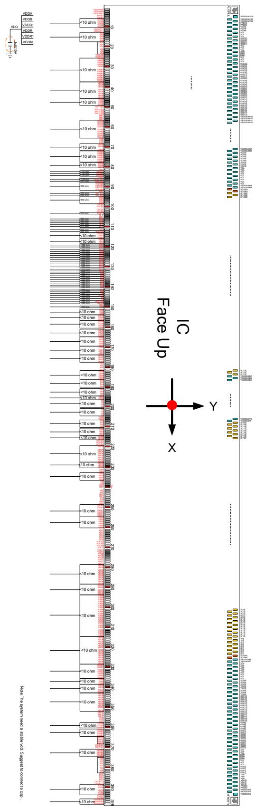  
13 APPLICATION CIRCUIT

# 13.1 Voltage Generation

The following is the ST7701S analog voltage pattern diagram:

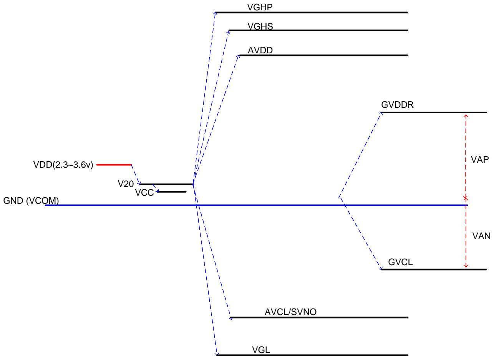  
Figure 90 Power Booster Level

# 13.2 Relationship about source voltage

The relationship about source voltage is shown as below:

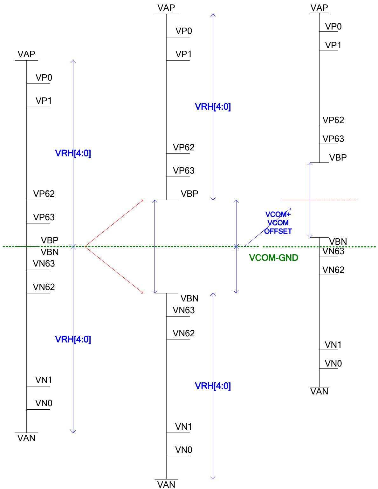  
Figure 91 Relationship about source voltage

14 REVISION HISTORY  

<table><tr><td>Version</td><td>Date</td><td>Description</td></tr><tr><td>V1.0</td><td>2017/03</td><td>Release Version</td></tr><tr><td>V1.1</td><td>2017/04</td><td>1、pad name (p14~34)
2、A1 read Value (p247)</td></tr><tr><td>V1.2</td><td>2017 /10</td><td>1、modify source voltage(p9)
2、add 480x960 resolution(p9)
3、modify pad name (Pad 420~422)</td></tr></table>